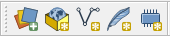

# Создание общегеографической карты {#map-design-general}

## Введение {#map-design-general-intro}

**Цель задания** — знакомство с моделями пространственных объектов и базой пространственных данных. Визуализация данных на карте. Оформление легенды и компоновки карты.

**Необходимая теоретическая подготовка:** модели пространственных данных, модели пространственных объектов, базы пространственных объектов, картографические проекции.

**Необходимая практическая подготовка:** практическая подготовка не требуется.

**Исходные данные:** база географических данных на территорию Кавказских гор, собранная из нескольких источников.

**Ожидаемый результат:** общегеографическая карта гор Кавказа и прилегающих территорий масштаба 1:4 500 000.

### Контольный лист {#map-design-general-checklist}

* Добавить на карту источники пространственных данных и настроить их оформление
* Настроить подписи объектов
* Создать компоновку карты и легенду
* Экспортировать результат в графический файл

<!-- ### Аннотация {#map-design-general-annotation}

Задание посвящено знакомству с созданием тематических карт на основе баз пространственных данных. Вы познакомитесь с представлением площадных, линейных, точечных объектов в базе пространственных данных. Научитесь создавать карты на их основе, оформлять легенду, сетку координат и зарамочные элементы карты. -->

## Начало работы {#map-design-general-begin}
[В начало упражнения ⇡](#map-design-general)

1. Скачайте архив с исходными данными для упражнения и распакуйте его в свою рабочую директорию.

1. Запустите **QGIS**. Для запуска воспользуйтесь иконкой с названием **`QGIS Desktop 3.4.15 with GRASS 7.8.2`**.

2. Найдите **панель менеджера источников данных**  и откройте **Менеджер источников данных**.

3. В менеджере источников данных в режиме браузера найдите вашу рабочую директорию, а в ней — каталог `Ex01_GeneralMap\raster_data`. В этом каталоге отображается единственный источник данных — `30n030e_20101117_gmted_mea075.tif`. Иконка  и расширение `\*.tif` (Tagged Image Tile Format) подсказывают вам, что этот источник представляет пространственные данные в растровой (регулярно-сеточной) модели.   

    > Замечание 1: растр, с которым вы будете работать сейчас, сохранён в формате [GeoTIFF](https://www.opengeospatial.org/standards/geotiff). От «обычного» TIFF этот формат отличается тем, что сведения о пространственной привязке в GeoTIFF записываются непосредственно в файл с данными, в то время как «обычный» формат TIFF не поддерживает запись сведений о пространственной привязке, поэтому она хранится отдельно — в [world-файле](https://en.wikipedia.org/wiki/World_file). В дальнейшем вы часто будете работать и с тем, и с другим способом хранения пространственных данных.

    > Замечание 2: файл `30n030e_20101117_gmted_mea075.tif` является фрагментом («тайлом») глобальной цифровой модели рельефа (ЦМР) [GMTED2010](https://www.usgs.gov/land-resources/eros/coastal-changes-and-impacts/gmted2010). Этот источник часто используется для геоинформационного анализа и картографирования. Загрузить тайлы GMTED2010 можно через сервис [EarthExplorer](https://earthexplorer.usgs.gov/) геологической службы США.

3. Дважды щёлкните левой кнопкой мыши на название файла `30n030e_20101117_gmted_mea075.tif` в менеджере источников данных. В панель слоёв (по умолчанию слева) добавится слой с названием `30n030e_20101117_gmted_mea075`.

4. Сохраните проект QGIS в папку с материалами упражнения (на том же иерархическом уровне, где находятся . Назовите его по шаблону <Ex01_%Фамилия%>, где %Фамилия% —  ваша фамилия латинскими буквами. 

**Скриншот 1: Окно QGIS после загрузки набора данных.**

>Примечание: файл проекта QGIS (\*.qgs, \*.qgz) и документ карты ArcGIS (\*.mxd) отличаются от тех файлов, с которыми вы работали ранее. В этих файлах не хранятся пространственные данные, а только ссылки на них и настройки их отображения (включая порядок слоёв, символику и подписи). Если вы перемещаете файл проекта относительно источников данных, ссылки «теряются». Поэтому важно правильно организовать структуру ГИС-проекта. В рамках нашего упражнения мы разместили файл проекта в директории более высокого уровня по отношению к тем директориям, где лежат данные. Теперь, если мы переместим всю папку Ex01 вместе со всем её содержимым, относительные пути от файла проекта до файлов данных не изменятся, и проект сохранит работоспособность. Разумеется, такое простое решение не будет оптимальным для крупных организаций с разветвлённой структурой сетевых ресурсов, но для студенческих проектов оно, как правило, работает

## Настройка системы координат {#map-design-general-projection}
[В начало упражнения ⇡](#map-design-general)

В правом нижнем углу карты вы видите надпись . Нажмите на эту надпись, чтобы открыть интерфейс выбора системы координат проекта. 

В открывшемся окне вы видите более подробную информацию об используемой системе координат. Код `EPSG:4326` соответствует системе географических координат **WGS 84**. Термин «географическая система координат» (*geographic coordinate systems*) в ГИС означает, что координаты объектов и линейные параметры растров хранятся в виде широты и долготы. Альтернативный подход — проецированные системы координат (*projected coordinate systems*), где плановые координаты измеряются в метрических единицах.

Система координат проекта была импортирована из первого (в нашем случае — пока единственного) загруженного источника пространственных данных. Система координат WGS 84, как правило, не используется для картографирования, поэтому мы изменим систему координат проекта.

К настоящему моменту вы ещё не освоили курс «Математическая картография», в котором подробно разбираются вопросы разработки и выбора проекций для различных карт. Поэтому мы воспользуемся простым инструментом для выбора проекции — [Projection Wizard](http://projectionwizard.org/).

1. Перейдите на сайт [Projection Wizard](http://projectionwizard.org/). Настройте параметры территории и проекции следующим образом:
    
    Класс проекции по виду искажений: **равнопромежуточная**  
    Охват территории картографирования: от 39° с.ш. до 46° с.ш., от 36° в.д. до 51° в.д.

    Вам будет предложено две проекции. **Нажмите на ссылку PROJ.4**, соответствующей **косой азимутальной** проекции. В верхней части экрана будет отображено всплывающее окно с параметрами выбранной проекции в формате [PROJ](https://proj.org/usage/quickstart.html).

    >формат PROJ, ранее известный как PROJ.4 — один из трёх форматов описания системы координат, с которыми вы должны быть «на ты» по окончании курса геоинформатики. Другой формат — коды [EPSG](http://www.epsg-registry.org/) (удобный ресурс для поиска — [epsg.io](https://epsg.io/)). Эта международная база систем координат интегрирована почти во всё современное геоинформационное и окологеоинформационное ПО, включая QGIS. Третий вариант — описание систем координат в формате Well-Known Text (WKT), применяемое в ArcGIS и некотором другом ПО.

2. Скопируйте строку PROJ в буфер обмена
   
    Также **вставьте скопированную строку в отчётный документ**

2. В QGIS откройте меню **Установки** — **Пользовательские проекции...**

3. Нажмите кнопку **Добавить новую проекцию**

4. В полях для ввода ниже введите название проекции: *Azimuthal Equidistant (Caucasus)*, в поле «Параметры» скопируйте строку PROJ.

5. Нажмите **ОК**.

    Вы успешно добавили новую систему координат в пользовательский список. Теперь нужно применить её к проекту.

6. Откройте интерфейс выбора системы координат. Это можно сделать не только нажатием на элемент в правом нижнем углу, но и через меню **Проекты** — **Свойства...** (вкладка **Система координат**).

7. В открывшемся меню найдите в списке свою проекцию, выберите её и нажмите **ОК**.

**Скриншот 2: Окно QGIS после изменения проекции**

Закройте интерфейс выбора системы координат и нажмите правой кнопкой на слой `30n030e_20101117_gmted_mea075` в таблице слоёв. В контекстном меню выберите **Свойства...** и в открывшемся окне перейдите на вкладку **Информация**. Вы видите, что проекция набора данных не изменилась. Просто QGIS умеет трансформировать наборы данных для отображения их в целевой проекции. Это называется «перепроецирование на лету́». 

## Навигация по карте {#map-design-general-navigation}
[В начало упражнения ⇡](#map-design-general)

После изменения проекции центр карты сместился таким образом, что загруженный растр перестанет помещаться во фрейм карты. Нам в любом случае необходимо увеличить масштаб и переместить изображение, чтобы иметь возможность рассмотреть территорию картографирования более детально. Воспользуемся этим как поводом для освоения инструментов панели инструментов перемещения по карте:  

Изучите функционал инструментов перемещения по карте. Некоторые из них могут быть задействованы независимо. Например, масштабирование выполняется прокруткой колеса мыши, а перемещение по карте — движением мыши с зажатой средней кнопкой.

Когда освоитесь с функциями перемещения по карте, установите масштаб карты равным 1:5 000 000. Это можно сделать в элементе «Масштаб» в нижней панели QGIS. После этого переместите изображение таким образом, чтобы Кавказские горы простирались из северо-западного угла к юго-восточному.

## Оформление рельефа {#map-design-general-relief}
[В начало упражнения ⇡](#map-design-general)

Изображение рельефа, которые вы видите, представляет собой так называемую аналитическую отмывку по высоте. Для аналитической отмывки используется шкала оттенков серого, применяемая по умолчанию. Мы будем использовать аналитическую отмывку по высоте вместе со светотеневой отмывкой.

1. Откройте свойства слоя `30n030e_20101117_gmted_mea075` и перейдите на вкладку **Стиль**.

2. Измените тип представления с *Одноканальное серое* на *Одноканальное псевдоцветное*.

3. Установите минимальное значение равным *0*, а максимальное значение — *4000*.

4. В строке выбора градиента нажмите правой кнопкой на шкалу и в открывшемся контекстном меню выберите опцию **Создать новый градиент**

5. В появившемся всплывающем окне в ниспадающем списке выберите тип градиента *Catalog: cpt-city* ([подробнее о cpt-city](http://soliton.vm.bytemark.co.uk/pub/cpt-city/))

6. В открывшемся каталоге в разделе *Topography* выберите градиент *c3t3* и нажмите **OK**

7. После нажатия OK были закрыты все окна, кроме окна свойств слоя `30n030e_20101117_gmted_mea075`. Нажмите **OK**, чтобы применить изменения символики и закрыть окно.

    Вы успешно применили аналитическую отмывку по высоте к цифровой модели рельефа. Но для красочного, визуально привлекательного изображения этого недостаточно. Помимо аналитической отмывки по высоте, мы создадим светотеневую отмывку.

8. Щёлкните правой кнопкой мыши по слою `30n030e_20101117_gmted_mea075` в таблице слоёв и в контекстном меню нажмите **Дублировать слой**.

    Дубликат слоя будет помещён в таблице слоёв ниже исходного слоя, выключен, а к его имени будет приписано "копия".

    ***Обратите внимание, что оба слоя используют один и тот же источник данных.** Вы можете сделать сколько угодно слоёв с разными настройками визуализации на базе одного и того же набора пространственных данных. Но если вы измените используемый набор пространственных данных, это повлечёт за собой автоматическое изменение вида слоёв (но не настроек их визуализации).*

9. Используя контекстное меню или окно свойств слоя, переименуйте оба слоя. Нижний слой назовите *Аналитическая отмывка по высоте*, верхний — *Светотеневая отмывка*.

    *Названия слоёв никак не затрагивают источник пространственных данных. До тех пор, пока вам не приходится работать со слоями с помощью скриптов на языке Python, вы можете никак не ограничивать себя в названиях.*

10. Включите отображение нижнего слоя.

11. Откройте свойства слоя «Светотеневая отмывка», перейдите на вкладку «Стиль».

12. Измените способ визуализации на *Теневой рельеф* и нажмите **Применить**. При этом изменения будут применены, но окно свойств не закроется.

    На заднем плане вы видите изменения, произошедшие с вашим слоем. Во-первых, изображение светотеневой отмывки полностью закрыло изображение аналитической отмывки по высоте. Эту проблему можно решить, включив настройки прозрачности для слоя. Во-вторых, сама светотеневая отмывка выглядит очень тёмной. Это связано с несовпадением единиц измерения «по горизонтали» и «по вертикали» в исходном наборе данных. В нашем случае эту проблему можно решить двумя путями: трансформировать слой в проецированную систему координат или применить коэффициент масштабирования по вертикали (*Z-factor*). Мы пойдём вторым путём и будем изменять значение коэффициента масштабирования.

    Коэффициент масштабирования представляет собой переводной коэффициент из «вертикальных» единиц измерения в «горизонтальные». Поскольку «горизонтальные» единицы в нашем случае — градусы, и поскольку протяжённость одного градуса по долготе и по широте не совпадает, с его вычислением могут возникнуть сложности. 

    **Вопрос\*: Рассчитайте коэффициент масштабирования по отношению к 1° долготы и 1° широты (на широте параллели касания проекции), ответ запишите в виде обыкновенной дроби.**
    
    Чтобы не тратить время на точные расчёты, мы воспользуемся значением *0,000012*

13. Помимо переводного коэффициента между единицами измерения, нам нужно дополнительно масштабировать высоты по вертикали, чтобы отмывка выглядела более «рельефно». В разных случаях применяется дополнительный множитель в диапазоне от 1,5 до 10, мы воспользуемся коэффициентом *5*.

14. Перемножьте оба коэффициента и введите полученное значение в качестве Z-фактора слоя.

15. Перейдите на вкладку **Прозрачность** и установите коэффициент непрозрачности для слоя равным 50 %. Примените изменения, закройте окно свойств слоя и сохраните проект.

**Скриншот 3: полученное изображение рельефа**

*Примечание для картографов: настройки визуализации рельефа, которые вы применили в этом упражнении, подобраны, так сказать, «на скорую руку», без предварительного анализа распределения высот картографируемой территории и выбора оптимальной шкалы. Эти вопросы подробно освещаются в курсах «Оформление карт» и «Общегеографическое картографирование».*

## Добавление векторных наборов данных {#map-design-general-vector}
[В начало упражнения ⇡](#map-design-general)

Вновь откройте менеджер источников данных в виде браузера и перейдите в директорию «Размещение по умолчанию для проекта». Раскройте папку *vector_data*.

> Размещение по умолчанию для проекта — это директория, в которую был сохранён проект QGIS (*.qgz).

Вы видите несколько источников данных, обозначенных символом . Это векторные наборы данных, представленные в формате [шейп-файлов](https://desktop.arcgis.com/ru/arcmap/latest/manage-data/shapefiles/what-is-a-shapefile.htm).

Теперь откройте эту же директорию через Проводник Windows (или любой другой файловый менеджер). Сравните количество файлов в Проводнике с количеством доступных источников данных в браузере QGIS

> Шейп-файлы были базовым форматом ГИС-пакета ArcView и за счёт этого получили очень широкое распространение. Шейп-файлы не такие функциональные, как базы геоданных ESRI (современный базовый формат для продуктов линейки ArcGIS) или GeoPackage, но тем не менее их продолжают активно использовать.  
Многие особенности шейп-файлов обусловлены спецификой и возможностями компьютеров начала 90-х гг. В частности, геометрия набора данных хранится отдельно (в файле `.shp`), семантика — отдельно (в формате dBASE, `.dbf`), а для связи между ними используется индекс-файл (`.shx`). Эти три файла — обязательные компоненты шейп-файла. Помимо них, отдельно могут быть записаны сведения о проекции (`.prj`), кодировке (`.cpg`) и многое другое.  
При копировании шейп-файла через Проводник необходимо копировать все файлы с одинаковым именем целиком.

1. Добавьте на карту наборы данных об объектах гидрографии (`hydrography-polyline.shp`, `hydrography-polygon.shp`). В таблице слоёв разместите линии над полигонами. Переименуйте слои в «Водотоки» и «Водоёмы» соответственно.

2. Настройте символику для добавленных векторных наборов данных. Также, как и для растров, настройки символики векторных данных помещаются в свойствах слоя, на вкладке «Стиль».   

    Для полигонов гидрографии установите стандартный стиль *topo water* из библиотеки QGIS.  

    Для линейных объектов используйте стандартный стиль *simple blue line*, но уменьшите толщину линии до 0,26 мм

    > Если приглядеться, то можно увидеть, что знак контура береговой линии и знаки линейных объектов гидрографии на суше не совпадают. Можно изменить цвет и толщину обводки для полигонов объектов гидрографии, сделав их такими же, как у рек и каналов.

3. Добавьте к карте железные дороги и автодороги. Переименуйте слои и изобразите их линиями толщиной 0,26 мм. Для автодорог используйте красный цвет, для железных дорог — тёмно-серый (20 % светлоты).

## Использование атрибутов объектов при визуализации {#map-design-general-attributes}
[В начало упражнения ⇡](#map-design-general)

До этого момента мы работали только визуальным представлением слоя и никак не касались семантической составляющей. На следующем шаге вы будете использовать разные значки для различных типов объектов в одном слое.

1. Добавьте к карте слой `adm_line` и переименуйте его в «Границы».

