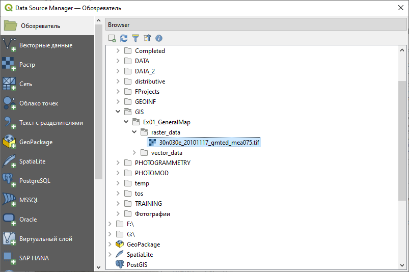
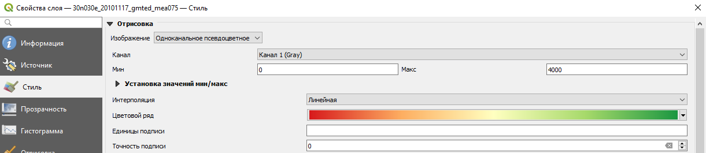
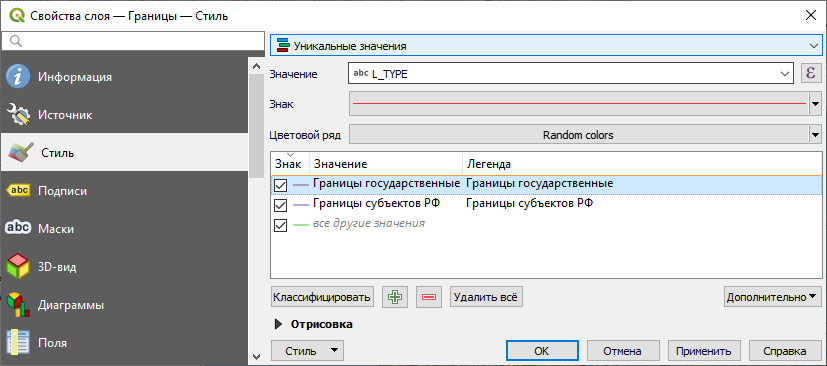

# (PART) Основы работы с QGIS {-}

# Создание общегеографической карты {#map-design-general}

[Архив с данными и файлом отчёта](https://1drv.ms/u/s!AmtmZDq3JgxHgZUGIl2IXikh_JmrhA?e=NdRmIe){target="_blank"}

## Введение {#map-design-general-intro}

**Цель задания** — знакомство с моделями пространственных объектов и базой пространственных данных. Визуализация данных на карте. Оформление легенды и компоновки карты.

**Необходимая теоретическая подготовка:** модели пространственных данных, модели пространственных объектов, базы пространственных объектов, картографические проекции.

**Необходимая практическая подготовка:** практическая подготовка не требуется.

**Исходные данные:** база географических данных на территорию Кавказских гор, собранная из нескольких источников.

**Ожидаемый результат:** общегеографическая карта гор Кавказа и прилегающих территорий масштаба 1:4 500 000.

### Контольный лист {#map-design-general-checklist}

* Добавить на карту источники пространственных данных и настроить их оформление
* Настроить подписи объектов
* Создать компоновку карты и легенду
* Экспортировать результат в графический файл

<!-- ### Аннотация {#map-design-general-annotation}

Задание посвящено знакомству с созданием тематических карт на основе баз пространственных данных. Вы познакомитесь с представлением площадных, линейных, точечных объектов в базе пространственных данных. Научитесь создавать карты на их основе, оформлять легенду, сетку координат и зарамочные элементы карты. -->

## Начало работы {#map-design-general-begin}
[В начало упражнения ⇡](#map-design-general)

1. Скачайте архив с исходными данными для упражнения и распакуйте его в свою рабочую директорию.

1. Запустите **QGIS**. Для запуска воспользуйтесь иконкой с названием **`QGIS Desktop ...`**, где `...` — номер версии QGIS, установленной на вашем компьютере.

2. Найдите **панель менеджера источников данных**  и откройте **Менеджер источников данных**.

    > Ряд действий в QGIS можно выполнить с помощью горячих клавиш. Так, для открытия Менеджера источников данных можно нажать `Ctrl+L`. Сведения о доступных горячих главишах отображаются во всплывающих подсказках при наведении курсора на иконку.
  
    

3. В менеджере источников данных в режиме браузера найдите вашу рабочую директорию, а в ней — каталог `Ex01_GeneralMap\raster_data`. В этом каталоге отображается единственный источник данных — `30n030e_20101117_gmted_mea075.tif`. Иконка  и расширение `*.tif` (Tagged Image Tile Format) подсказывают вам, что этот источник представляет пространственные данные в растровой (регулярно-сеточной) модели.   

    
    
    > Замечание 1: растр, с которым вы будете работать сейчас, сохранён в формате [GeoTIFF](https://www.opengeospatial.org/standards/geotiff). От «обычного» TIFF этот формат отличается тем, что сведения о пространственной привязке в GeoTIFF записываются непосредственно в файл с данными, в то время как «обычный» формат TIFF не поддерживает запись сведений о пространственной привязке, поэтому она хранится отдельно — в [world-файле](https://en.wikipedia.org/wiki/World_file). В дальнейшем вы часто будете работать и с тем, и с другим способом хранения пространственных данных.

    > Замечание 2: файл `30n030e_20101117_gmted_mea075.tif` является фрагментом («тайлом») глобальной цифровой модели рельефа (ЦМР) [GMTED2010](https://www.usgs.gov/land-resources/eros/coastal-changes-and-impacts/gmted2010). Этот источник часто используется для геоинформационного анализа и картографирования. Загрузить тайлы GMTED2010 можно через сервис [EarthExplorer](https://earthexplorer.usgs.gov/) геологической службы США.

3. Дважды щёлкните левой кнопкой мыши на название файла `30n030e_20101117_gmted_mea075.tif` в менеджере источников данных. В панель слоёв (по умолчанию слева) добавится слой с названием `30n030e_20101117_gmted_mea075`. После добавления слоя можно закрыть окно Менеджера источников данных.

4. Сохраните проект QGIS в папку с материалами упражнения (на том же иерархическом уровне, где находятся папки `raster_data` и `vector_data`). Назовите его по шаблону `<Ex01_%Фамилия%>`, где `%Фамилия%` —  ваша фамилия латинскими буквами. После сохранения проека сделайте снимок экрана и вставьте его в отчётный файл.

<kbd>**Снимок экрана №1.** Окно QGIS после загрузки набора данных</kbd>

  > Примечание: файл проекта QGIS (\*.qgs, \*.qgz) и документ карты ArcGIS (\*.mxd) отличаются от тех файлов, с которыми вы работали ранее. В этих файлах не хранятся пространственные данные, а только ссылки на них и настройки их отображения (включая порядок слоёв, символику и подписи). Если вы перемещаете файл проекта относительно источников данных, ссылки «теряются». Поэтому важно правильно организовать структуру ГИС-проекта. В рамках нашего упражнения мы разместили файл проекта в директории более высокого уровня по отношению к тем директориям, где лежат данные. Теперь, если мы переместим всю папку Ex01 вместе со всем её содержимым, относительные пути от файла проекта до файлов данных не изменятся, и проект сохранит работоспособность. Конечно, такое решение не будет оптимальным для крупных организаций с разветвлённой структурой сетевых ресурсов, но для студенческих проектов оно, как правило, работает.

## Настройка системы координат {#map-design-general-projection}
[В начало упражнения ⇡](#map-design-general)

В правом нижнем углу карты вы видите надпись . Нажмите на эту надпись, чтобы открыть интерфейс выбора системы координат проекта. 


В открывшемся окне вы видите более подробную информацию об используемой системе координат. Код `EPSG:4326` соответствует системе географических координат **WGS 84**. Термин «географическая система координат» (*geographic coordinate systems*) в ГИС означает, что координаты объектов и линейные параметры растров хранятся в виде широты и долготы. Альтернативный подход — проецированные системы координат (*projected coordinate systems*), где плановые координаты измеряются в метрических единицах.

Система координат проекта была импортирована из первого (в нашем случае — пока единственного) загруженного источника пространственных данных. Система координат WGS 84 обычно не используется для картографирования, поэтому мы изменим систему координат проекта.

Для выбора проекции воспользуемся удобным инструментом, который позволяет оптимизировать этот процесс — [Projection Wizard](http://projectionwizard.org/).

1. Перейдите на сайт [Projection Wizard](http://projectionwizard.org/). Настройте параметры территории и проекции следующим образом:
    
    - класс проекции по виду искажений: **равнопромежуточная** (*Equidistant*);
    - охват территории картографирования: от 39° с.ш. до 46° с.ш., от 36° в.д. до 51° в.д.
    
    Если все сделано верно, то окно приложения должно принять приблизительно следующий вид:
    

    Вам будет предложено две проекции. **Нажмите на ссылку PROJ.4**, соответствующей **косой азимутальной** проекции (англ. *oblique azimuthal*). На экране будет отображено всплывающее окно с параметрами выбранной проекции в формате [WKT](https://docs.geotools.org/stable/javadocs/org/opengis/referencing/doc-files/WKT.html).

2. Скопируйте описание WKT в буфер обмена
   
    Также **вставьте скопированную строку в отчётный документ**
    
    С помощью сайта Projection Wizard вы успешно создали новое определение системы координат. Теперь нужно ввести это определение во внутреннюю базу QGIS.

2. В QGIS откройте меню **Установки** — **Пользовательские проекции...**

3. Нажмите кнопку **Добавить систему координат** 

4. В полях для ввода ниже введите название проекции: `Azimuthal Equidistant (Caucasus)`, в поле _Формат_ выберите тип `WKT`, в поле _Параметры_ вставьте скопированное определение WKT. 

    

5. Нажмите **ОК**.

    Вы успешно добавили новую систему координат в пользовательский список. Теперь нужно применить её к проекту.

6. Откройте интерфейс выбора системы координат. Это можно сделать не только нажатием на элемент в правом нижнем углу, или через меню **Проект** — **Свойства...** (вкладка **Система координат**).

7. В открывшемся меню найдите в списке свою проекцию (для этого можно использовать поле "Фильтр" вверху окна), выберите её и нажмите **ОК**.

Если все сделано верно, изображение ЦМР должно приобрести форму сфероидической трапеции. Сделайте снимок экрана и вставьте его в отчётный файл.

<kbd>**Снимок экрана №2.** Окно QGIS после изменения проекции</kbd>

Закройте интерфейс выбора системы координат и нажмите правой кнопкой на слой `30n030e_20101117_gmted_mea075` в таблице слоёв. В контекстном меню выберите **Свойства...** и в открывшемся окне перейдите на вкладку **Информация**. Вы видите, что проекция набора данных не изменилась. QGIS, как и большинство ГИС-пакетов, умеет трансформировать наборы данных для отображения их в целевой проекции. На жаргоне ГИС-специалистов это называется *«перепроецирование на лету» (reprojection on the fly)*. 

## Навигация по карте {#map-design-general-navigation}
[В начало упражнения ⇡](#map-design-general)

Чтобы иметь возможность рассмотреть территорию картографирования более детально, потребуется увеличить масштаб и переместить изображение. Изучите функциональные возможности инструментов навигациии, которые расположены на панели инструментов __Map Navigation__ (если панель отсутствует, щелкните на пустом поле среди панелей инструментов, и активируйте соответствующий пункт в меню): 


Некоторые инструменты навигации могут быть задействованы независимо. Например, масштабирование выполняется прокруткой колеса мыши, а перемещение по карте — движением мыши с зажатой средней кнопкой.

> Режим _панорамирования_ (перемещения карты) также активируется нажитием пробела. Зажмите пробел и просто двигайте курсор мышкой или тачпадом. Нажимать кнопку мыши или тачпад при этом не надо! 

После того как инструменты навигации станут понятны, установите масштаб карты равным $1:5~000~000$. Это можно сделать в элементе _Масштаб_ в нижней панели QGIS. При этом достаточно ввести только знаменатель масштаба, выделив его двойным кликом и заменив на нужное значение без пробела (`5000000`).

После этого переместите изображение таким образом, чтобы Кавказские горы занимали картографическое изображение целиком по ширине.

## Оформление изображения рельефа {#map-design-general-relief}
[В начало упражнения ⇡](#map-design-general)

Изображение рельефа, которые вы видите, представляет собой так называемую аналитическую отмывку по высоте. Для аналитической отмывки используется шкала оттенков серого, применяемая по умолчанию. Мы будем использовать аналитическую отмывку по высоте вместе со светотеневой отмывкой.

1. Откройте свойства слоя `30n030e_20101117_gmted_mea075` и перейдите на вкладку **Стиль**.

2. Измените тип представления с *Одноканальное серое* на *Одноканальное псевдоцветное*.

3. Установите минимальное значение равным *0*, а максимальное значение — *4000*.

    

4. В строке выбора градиента («Цветовой ряд») нажмите правой кнопкой на шкалу и в открывшемся контекстном меню выберите опцию **Новый цветовой ряд...**

    

5. В появившемся всплывающем окне в ниспадающем списке выберите тип градиента *Каталог: cpt-city* ([подробнее о cpt-city](http://soliton.vm.bytemark.co.uk/pub/cpt-city/))

6. В открывшемся каталоге в разделе *Topography* выберите градиент *c3t3* и нажмите **OK**

    

7. После нажатия OK были закрыты все окна, кроме окна свойств слоя `30n030e_20101117_gmted_mea075`. Нажмите **OK**, чтобы применить изменения символики и закрыть окно.

    Вы успешно применили аналитическую отмывку по высоте к цифровой модели рельефа. Но для красочного, визуально привлекательного изображения этого недостаточно. Помимо аналитической отмывки по высоте, мы создадим светотеневую отмывку.

8. Щёлкните правой кнопкой мыши по слою `30n030e_20101117_gmted_mea075` в таблице слоёв и в контекстном меню нажмите **Дублировать слой**.

    Дубликат слоя будет помещён в таблице слоёв ниже исходного слоя, выключен, а к его имени будет приписано "копия".

    > **Обратите внимание, что оба слоя используют один и тот же источник данных.** Вы можете сделать сколько угодно слоёв с разными настройками визуализации на базе одного и того же набора пространственных данных. Но если вы измените используемый набор пространственных данных, это повлечёт за собой автоматическое изменение вида слоёв (но не настроек их визуализации).

9. Используя контекстное меню или окно свойств слоя, переименуйте оба слоя. Нижний слой назовите *Аналитическая отмывка по высоте*, верхний — *Светотеневая отмывка*.

    > Названия слоёв никак не затрагивают источник пространственных данных. До тех пор, пока вам не приходится работать со слоями с помощью скриптов на языке Python, вы можете никак не ограничивать себя в названиях.

10. Включите отображение нижнего слоя.

11. Откройте свойства слоя «Светотеневая отмывка», перейдите на вкладку «Стиль».

12. Измените способ визуализации на *Теневой рельеф* и нажмите **Применить**. При этом изменения будут применены, но окно свойств не закроется.

    На заднем плане вы видите изменения, произошедшие с вашим слоем. Во-первых, изображение светотеневой отмывки полностью закрыло изображение аналитической отмывки по высоте. Эту проблему можно решить, включив настройки прозрачности для слоя. Во-вторых, сама светотеневая отмывка выглядит очень тёмной. Это связано с несовпадением единиц измерения «по горизонтали» и «по вертикали» в исходном наборе данных: ячейки растра образут градусную сетку, а высотные отметки хранятся в метрах.   Проблему можно решить двумя путями: трансформировать слой в проецированную систему координат или применить коэффициент масштабирования по вертикали (*Z-factor*). Мы пойдём вторым путём и будем изменять значение коэффициента масштабирования.

    > Коэффициент масштабирования представляет собой переводной коэффициент из «вертикальных» единиц измерения в «горизонтальные». Для растров на градусной сетке, коэффициент, строго говоря, будет различным по широте и долготе в силу сближения меридианов. 

    **Рассчитайте коэффициент масштабирования по отношению к 1° долготы и 1° широты (на широте параллели касания проекции)**. После этого сверьтесь с результатом ниже:
    
```{r, echo = FALSE}
library(htmltools)

shiny::actionButton("show_table_button", 
                    label = "Показать Z-factor", 
                    onclick = "button_handler()")

div(id = "resultContainer", hidden = "true", HTML("0.000012"))
```

```{js, echo = FALSE}
function button_handler() {
  document.getElementById('resultContainer').hidden = false;
}
```

13. Помимо переводного коэффициента между единицами измерения, нам нужно дополнительно масштабировать высоты по вертикали, чтобы отмывка выглядела более «рельефно». В разных случаях применяется дополнительный множитель в диапазоне от 1,5 до 10, мы воспользуемся коэффициентом *5*.

14. Перемножьте оба коэффициента и введите полученное значение в качестве Z-фактора слоя.

15. Перейдите на вкладку **Прозрачность** и установите коэффициент непрозрачности для слоя равным 50 %. Примените изменения, закройте окно свойств слоя и сохраните проект.

<kbd>**Снимок экрана №3.** Изображение рельефа с высотной и светотеневой отмывкой</kbd>

> Настройки визуализации рельефа, которые применялись в этом упражнении, подобраны приблизительно, без предварительного анализа распределения высот картографируемой территории и выбора оптимальной шкалы. Эти вопросы подробно освещаются в курсах «Оформление карт» и «Общегеографическое картографирование», читаемых на кафедре картографии и геоинформатики

## Добавление векторных наборов данных {#map-design-general-vector}
[В начало упражнения ⇡](#map-design-general)

Откройте стыкуемое окно браузера и перейдите в директорию *Домашний каталог проекта*. Раскройте папку *vector_data*.

> Домашний каталог проекта — это директория (папка), в которую был сохранён проект QGIS (*.qgz).


Вы видите несколько источников данных, обозначенных символом . Это векторные наборы данных, представленные в формате [шейп-файлов](https://desktop.arcgis.com/ru/arcmap/latest/manage-data/shapefiles/what-is-a-shapefile.htm).

Теперь откройте эту же директорию через Проводник Windows (или любой другой файловый менеджер). Сравните количество файлов в Проводнике с количеством доступных источников данных в браузере QGIS

> Шейп-файлы были базовым форматом ГИС-пакета ArcView и за счёт этого получили очень широкое распространение. Шейп-файлы не такие функциональные, как базы геоданных ESRI (современный базовый формат для продуктов линейки ArcGIS) или GeoPackage, но тем не менее их продолжают активно использовать. Многие особенности шейп-файлов обусловлены спецификой и возможностями компьютеров начала 90-х гг. В частности, геометрия набора данных хранится отдельно (в файле `*.shp`), семантика — отдельно (в формате dBASE, `*.dbf`), а для связи между ними используется индекс-файл (`*.shx`). Эти три файла — обязательные компоненты шейп-файла. Помимо них, отдельно могут быть записаны сведения о проекции (`*.prj`), кодировке (`*.cpg`) и многое другое. Основным файлом, тем не менее, считается `*.shp`, а все остальные на компьютерном сленге называются [*sidecar*-файлами](https://en.wikipedia.org/wiki/Sidecar_file). 

> **Важно:** при копировании шейп-файлов через Проводник необходимо копировать **все** файлы с одинаковым именем

1. Добавьте на карту наборы данных об объектах гидрографии (`hydrography-polyline.shp`, `hydrography-polygon.shp`). В таблице слоёв разместите линии над полигонами. Переименуйте слои в «Водотоки» и «Водоёмы» соответственно.

    > Все векторные наборы данных для этого упражнения созданы на основе [цифровых географических основ ВСЕГЕИ](http://www.vsegei.com/ru/info/topo/). Это один из немногих общедоступных источников пространственных данных общегеографического содержания на территорию Российской Федерации и ближнего зарубежья.

2. Настройте символику для добавленных векторных наборов данных. Также, как и для растров, настройки символики векторных данных помещаются в свойствах слоя, на вкладке **Стиль**.   

    - Для полигонов гидрографии установите стандартный стиль *topo water* из библиотеки QGIS.  
    - Для линейных объектов используйте стандартный стиль *simple blue line*, но уменьшите толщину линии до 0,26 мм
    
    
    

    > Если приглядеться, то можно увидеть, что знак контура береговой линии и знаки линейных объектов гидрографии на суше не совпадают. Можно изменить цвет и толщину обводки для полигонов объектов гидрографии, сделав их такими же, как у рек и каналов.

3. Добавьте к карте железные дороги и автодороги. Переименуйте слои и изобразите их линиями толщиной 0,26 мм. Для автодорог используйте красный цвет, для железных дорог — тёмно-серый (20 % светлоты).

## Использование атрибутов объектов при визуализации {#map-design-general-attributes}
[В начало упражнения ⇡](#map-design-general)

До этого момента мы работали только визуальным представлением слоя и никак не касались семантической составляющей. На следующем шаге вы будете использовать разные значки для различных типов объектов в одном слое.

1. Добавьте к карте набор данных `adm_line`, переместите добавленный слой ниже всех линейных объектов и переименуйте его в «Границы».

2. Вызовите контекстное меню слоя «Границы» и выберите опцию «Открыть таблицу атрибутов». Откроется таблица атрибутов источника данных.

    
    
    Таблица атрибутов — это представление базы данных, связанной с набором пространственных объектов. База функционирует по общим правилам реляционной базы данных: каждый объект представляется одной «строкой», в каждом столбце (поле) одному объекту соответствует одно значение. Атрибуты играют важную роль в геоинформационных системах. На их основе происходит визуализация данных, также они участвуют в большинстве операций пространственного анализа. В этом упражнении вы используете атрибуты, чтобы присвоить различные стили объектам в одном слое.
    
4. Закройте таблицу атрибутов или пристыкуйте её к нижней части окна. 

5. Откройте свойства слоя на вкладке *Стиль*.

6. Измените тип визуализации с *Обычный знак* на *Уникальные значения*. Эта настройка позволяет присваивать объектам различные стили в соответствии со значениями определённого атрибута.

    

7. В выпадающем списке **Поле** выберите столбец `L_TYPE`, по которому будет происходить классификация, и нажмите кнопку **Классифицировать** внизу формы.

    В форму добавились три записи. Две из них представляют фактически имеющиеся значения атрибутов, третья — «пустая» — предназначена для визуализации всех остальных значений (которых фактически нет в таблице на настоящий момент, но которые могут появиться позже в результате редактирования)  
    
    

      
    
    <!-- Возможности автоматической настройки визуализации у QGIS пока невелики по сравнению с ArcGIS или MapInfo. Например, сейчас нашим классам присвоены стили в виде линий, у которых совпадают все параметры, кроме цвета. По-другому QGIS (пока) не умеет .   -->

    <!-- Наша задача — создать разные условные знаки для разных типов границ -->
    
8. Дважды щёлкните на значке, соответствующем классу *Границы государственные*. Откроется уже знакомый вам интерфейс настройки условных знаков. Обратите внимание на форму в левом верхнем углу: вы можете задать несколько слоёв для одного условного знака, используя опцию добавления слоёв ().

    > Слои в таблице слоёв и слои условного знака — это две разные, не связанные между собой сущности
    
9. Создайте для государственных границ двухслойный знак. Нижний слой: линия серого цвета (75 % светлоты) шириной 1 мм, с плоскими концами (чтобы концы линии не «свешивались» в воду). Верхний слой: линия тёмно-серого цвета (светлота 20 %) толщиной 0,26 мм, штрихпунктирная, с плоскими концами.

    

9. Создайте аналогичный знак для границ субъектов РФ. Нижний слой: линия серого цвета (75 % светлоты) шириной 0,8 мм, с плоскими концами. Верхний слой: линия тёмно-серого цвета (светлота 20 %) толщиной 0,26 мм, штриховая, с плоскими концами.

10. Для прочих границ используйте однослойный условный знак: пунктирная линия тёмно-серого цвета

**Сохраните проект.**

## Подписи {#map-design-general-labels}
[В начало упражнения ⇡](#map-design-general)

1. Добавьте на карту набор данных `elevation_points.shp`, расположите слой на самом верху списка и переименуйте его в *Вершины*. Настройте отображение единым знаком в виде чёрного треугольника, аналогично тому, как показываются отметки высот в школьных атласах.

2. Откройте таблицу атрибутов слоя. Какие поля можно использовать для подписей?

    > На общегеографических картах обычно приводятся высоты и названия горных вершин. В этом упражнении мы ограничимся названиями.

3. Закройте таблицу атрибутов и откройте свойства слоя. Перейдите на вкладку «Подписи». Переключите режим подписей на *Обычные подписи* (подписывать объекты значением атрибута). В открывшемся меню в выпадающем списке «Подписывать значениями» выберите поле `NAME` — тексты подписей будут «считываться» из него. 

    

4. В поле **Text sample** отображается пример подписи с теми настройками, которые заданы по умолчанию. Если вы будете менять настройки подписей (шрифт, форматирование, «гало» и др.), этот пример будет меняться. Сейчас мы последовательно пройдём по вкладкам настройки подписей, исправив необходимые параметры.

    - На вкладке *Текст* установите гарнитуру («шрифт») Times New Roman, начертание («стиль») полужирный курсив, кегль («размер») 8.
    - На вкладке *Буфер* включите опцию «Буферизовать подписи» и задайте буферизацию размером 0,6 мм. Это повысит читаемость подписей на карте.
    - На вкладке *Размещение* выберите опцию «Картографическое», расстояние 0,1 мм от границ символа (*from symbol bounds*)
    
    Примените настройки подписей и закройте свойства слоя
    
8. В каталоге `vector_data` остался незадействованный слой — `population_points`. Добавьте его в проект, переименуйте и самостоятельно настройте условные знаки и подписи. Используйте параметр *уникальные значения* для того, чтобы отобразить города с разной численностью населения разными условными знаками.

<kbd>**Снимок экрана №4.** Окно QGIS после завершения настройки символов</kbd>

**Сохраните проект.**

## Настройка компоновки карты {#map-design-general-layout}
[В начало упражнения ⇡](#map-design-general)

Изображение, которое вы видите во фрейме данных, можно экспортировать в отдельный графический файл «как есть» (с помощью опции **Проекты — Импорт/экспорт — Экспортировать карту как изображение...**). Однако для картографических целей, как правило, формируется **компоновка карты**. На листе заданного формата размещается картографическое изображение, добавляется название, легенда, масштабная линейка и элементы зарамочного оформления. 

Сейчас мы создадим макет компоновки с расчётом на то, что итоговая карта будет вставлена в отчёт.

1. Создайте новый макет компоновки (**Проект — Создать Макет...**) или `Ctrl+P`. 

2. Введите название макета: Ex01_%Фамилия%, где %Фамилия% — ваша фамилия на любом языке.

    После ввода названия откроется окно компоновки (*Layout*)  
    
    
4. Добавьте на лист картографическое изображение. Для этого используется инструмент **Добавить карту** из панели инструментов. Выберите инструмент и «растяните» прямоугольник карты на листе. 
    
    

5. После добавления элемента откроется панель его свойств. Изучите настройки, доступные в этой панели, а затем установите для карты знаменатель масштаба *4 000 000* и размеры $237\times130$ мм. В том же разделе, где устанавливаются размеры элемента, задайте для элемента карты положение по $X = 30$ мм и положение по $Y = 30$ мм.

    > Положение элемента на листе отсчитывается от верхнего левого угла листа до точки привязки элемента.
    
6. Добавьте к карте градусную сетку. Для этого в свойствах элемента найдите раздел **Сетки**, нажмите на кнопку *Добавить новую сетку*, а затем *Modify Grid*. Откроется меню настройки сетки. Задайте для сетки проекцию WGS84, интервал по долготе — $4°$, интервал по широте — $2°$. Также уменьшите толщину линий сетки до $0.1$ мм. Для этого щёлкните левой кнокой мыши по элементу *Стиль линии* и выполните необходимые настройки в уже привычном для вас интерфейсе. Вернуться обратно к настройкам сетки можно, нажав на кнопку *Назад* в левом верхнем углу интерфейса.

7. Добавьте рамку сетки в виде простой линии. Для этого в свойствах элемента активируйте раздел **Рамка**. 

8. Включите отображение подписей координатной сетки. Для этого в разделе **Сетки** выберите в списке созданную сетку, нажмите кнопку **Modify Grid...** и отметьте флажок *Draw Coordinates*. Настройте отображение подписей так, чтобы широта подписывалась только вдоль западной и восточной рамки, а долгота — только вдоль северной и южной. Используйте формат координат *Десятичные с окончанием* и нулевое число знаков после запятой (этот параметр в QGIS называется *Точность координат*).

8. Вернитесь к макету и передвиньте картографическое изображение внутри элемента таким образом, чтобы вместилась вся основная часть Главного Кавказского хребта. Можно ориентироваться на города: в северо-западном углу карты должен отображаться Краснодар, в юго-восточном — Баку.  

    > Для перемещения карты внутри фрейма используется инструмент **Перемещение содержимого элемента**.

5. Добавьте на лист название карты. Для этого **вставьте новую надпись** и разместите её над элементом карты. Введите название карты «Кавказские горы», используйте выключку (горизонтальное выравнивание) по центру, настройте параметры шрифта на своё усмотрение (заголовки обычно набираются прописными буквами с разреженным кернингом). 

7. Добавьте на лист масштабную линейку. Переместите линейку в юго-западный угол карты, установите для неё отображение фона и границы, исправьте обозначение единиц измерения. Уменьшите высоту линейки, кегль шрифта и отступы подписей, чтобы линейка смотрелась более компактно. 

8. Добавьте на лист легенду. Легенда будет собрана автоматически на основе тех настроек визуализации, которые применены для слоёв карты. 

9. Отредактируйте легенду. Для этого сначала выключите автообновление (*Auto update*) элементов легенды, чтобы сделать список элементов доступным для редактирования. Удалите из легенды те условные знаки, которые не встречаются на карте, и переименуйте неинформативные или пустые подписи.

10. Добавьте обводку для элемента легенды и разместите элемент в северо-восточном углу карты.

11. Добавьте ещё один текстовый элемент и впишите в него сведения об авторстве.

12. Экспортируйте получившуюся карту в изображение формата PNG («Макет» — «Экспорт в изображение...» или специальная кнопка на главной панели инструментов макета).

**Сохраните проект.**
    
----
_Энтин А.Л., Самсонов Т.Е._ **Основы геоинформатики: практикум в QGIS**. М.: Географический факультет МГУ, `r lubridate::year(Sys.Date())`.
----