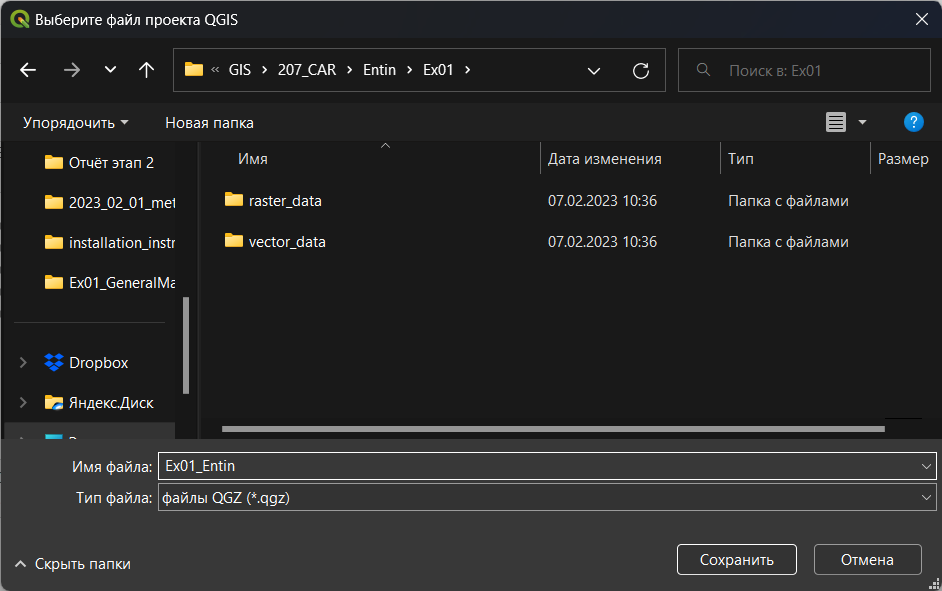

# (PART) Основы работы с QGIS {-}

# Создание общегеографической карты {#map-design-general}

[Архив с исходными данными](https://github.com/aentin/qgis-course/raw/master/files/Ex01.zip)

[Контрольный лист](https://github.com/aentin/qgis-course/raw/master/files/Ex01_%D0%BE%D1%82%D1%87%D1%91%D1%82.docx)

## Введение {#map-design-general-intro}

**Цель задания** — знакомство с моделями пространственных объектов и пространственных данных, форматами хранения растровых и векторных данных. Визуализация данных на карте. Создание макета компоновки карты.

**Необходимая теоретическая подготовка:** модели пространственных данных, модели пространственных объектов, базы пространственных данных, картографические проекции, системы координат.

**Необходимая практическая подготовка:** специальная практическая подготовка не требуется. 

**Исходные данные:** база пространственных данных на территорию Кавказских гор, собранная из нескольких источников.

**Ожидаемый результат:** общегеографическая карта гор Кавказа и прилегающих территорий масштаба 1:4 500 000.

### Контольный лист {#map-design-general-checklist}

* Добавить на карту слои растровых пространственных данных;
* Создать изображение отмывки рельефа;
* Добавить на карту слои векторных пространственных данных;
* Настроить оформление векторных пространственных данных;
* Настроить подписи объектов;
* Создать макет компоновки карты;
* Экспортировать результат в графический файл;

<!-- ### Аннотация {#map-design-general-annotation}

Задание посвящено знакомству с созданием тематических карт на основе баз пространственных данных. Вы познакомитесь с представлением площадных, линейных, точечных объектов в базе пространственных данных. Научитесь создавать карты на их основе, оформлять легенду, сетку координат и зарамочные элементы карты. -->

Перед началом работы рекомендуется включить отображение расширений имён файлов.

## Начало работы {#map-design-general-begin}
[В начало упражнения ⇡](#map-design-general)

1. Скачайте архив с исходными данными для упражнения. Распакуйте этот архив в свою рабочую директорию. В вашей рабочей директории должна появиться папка `Ex01`. Перед продолжением работы убедитесь, что это именно папка, а не файл архива.

2. Запустите QGIS.

3. В открывшемся окне QGIS нажмите кнопку **Создать новый проект** , чтобы создать новый проект. 

4. Сохраните проект QGIS в папку Ex01, где лежат материалы к упражнению. Для этого нажмите иконку сохранения , в открывшемся окне проводника перейдите в папку Ex01 и введите название вашего проекта QGIS по шаблону: `Ex01_Familia`, где `Familia` —  ваша фамилия латинскими буквами. 

Окно QGIS должно принять вид, аналогичный показанному на изображении ниже:

    
> Ряд действий в QGIS можно выполнить с помощью горячих клавиш. Так, для создания нового проекта можно нажать `Ctrl+N`, а для сохранения проекта — `Ctrl+S`. Сведения о доступных горячих главишах отображаются во всплывающих подсказках при наведении курсора на иконку.

5. Найдите в рабочем окне QGIS панель браузера и разверните в нём домашний каталог проекта. Если панель браузера отключена, её можно включить в меню «Вид» — «Панели», пункт «Браузер».
    

    
> Домашний каталог проекта — это папка (каталог, директория), где сохранён проект, в котором вы работаете в настоящий момент.

6. В домашнем каталоге разверните содержимое директории `raster_data`. В этом каталоге отображается единственный источник данных — `30n030e_20101117_gmted_mea300.tif`. Иконка  и расширение `*.tif` (Tagged Image Tile Format) подсказывают вам, что этот источник представляет пространственные данные в растровой (регулярно-сеточной) модели.

    
> Примечание 1: растр, с которым вы будете работать сейчас, сохранён в формате [GeoTIFF](https://www.opengeospatial.org/standards/geotiff). От «обычного» TIFF этот формат отличается тем, что сведения о пространственной привязке в GeoTIFF записываются непосредственно в файл с данными, в то время как «обычный» формат TIFF не поддерживает запись сведений о пространственной привязке, поэтому она хранится отдельно — в [world-файле](https://en.wikipedia.org/wiki/World_file). В дальнейшем вы часто будете работать и с тем, и с другим способом хранения пространственных данных.

> Примечание 2: файл `30n030e_20101117_gmted_mea300.tif` является фрагментом («тайлом») глобальной цифровой модели рельефа (ЦМР) [GMTED2010](https://www.usgs.gov/land-resources/eros/coastal-changes-and-impacts/gmted2010). Этот набор данных часто используется для геоинформационного анализа и картографирования. Загрузить тайлы GMTED2010 можно через сервис [EarthExplorer](https://earthexplorer.usgs.gov/) геологической службы США.

7. Дважды щёлкните левой кнопкой мыши на название файла `30n030e_20101117_gmted_mea300.tif` в окне браузера или, зажав левую кнопку мыши, перетащите файл из панели браузера в основной фрейм QGIS. В панель слоёв (по умолчанию она находится слева) добавится слой с названием `30n030e_20101117_gmted_mea300`.

8. Сохраните проект и сделайте снимок экрана.

<kbd>В отчёт: снимок экрана №1 — QGIS после загрузки набора данных</kbd>

**Важно! Здесь и далее под «снимком экрана» понимается снимок всего экрана целиком. Если необходимо будет сделать изображение только части экрана, это будет прямо указано в инструкции**. 

> Примечание 3: необходимо помнить о важной особенности рабочих проектов программных средств ГИС, в частности, файлов проектов QGIS (\*.qgs, \*.qgz). В файле проекта хранятся не сами пространственные данные, а только ссылки на них и настройки их отображения (включая порядок слоёв, символику и подписи). Если вы перемещаете файл проекта относительно источников данных, ссылки «ломаются». Поэтому важно правильно организовать структуру ГИС-проекта. В рамках нашего упражнения мы разместили файл проекта в директории более высокого уровня по отношению к тем директориям, где лежат данные. Теперь, если мы переместим всю папку Ex01 вместе с её содержимым, относительные пути от файла проекта до файлов данных не изменятся, и проект QGIS сохранит работоспособность. На начальных этапах освоения QGIS мы рекомендуем размещать все компоненты ГИС-проекта (файл проекта и файлы данных) в одной директории.

## Настройка системы координат {#map-design-general-projection}
[В начало упражнения ⇡](#map-design-general)

В правом нижнем углу карты вы видите надпись . Нажмите на эту надпись, чтобы открыть интерфейс выбора системы координат проекта. 

В открывшемся окне вы видите подробную информацию об используемой системе координат. Код `EPSG:4326` соответствует географической системе координат WGS 84. Термин «географическая система координат» (*geographic coordinate system*) в ГИС означает, что координаты объектов и линейные параметры растров представлены в виде широты и долготы. Альтернативный подход — проецированные системы координат (*projected coordinate systems*), где плановые координаты измеряются в метрических единицах, обычно в метрах.

Система координат проекта импортируется из первого загруженного источника пространственных данных. Система координат WGS 84 обычно не используется для картографирования, поэтому мы изменим систему координат проекта.

Для выбора проекции воспользуемся инструментом, который позволяет облегчить этот процесс — [Projection Wizard](http://projectionwizard.org/).

1. Перейдите на сайт [Projection Wizard](http://projectionwizard.org/). Настройте параметры территории и проекции следующим образом:
    
    - класс проекции по виду искажений (*Distortion Property*): **равнопромежуточная** (***Equidistant***);
    - охват территории картографирования: примерно как показано на рисунке ниже
    

2. Вам будет предложено два варианта системы координат. **Нажмите на ссылку PROJ**, соответствующую **косой азимутальной** проекции (англ. *oblique azimuthal*). На экране будет отображено всплывающее окно с параметрами выбранной проекции в формате [PROJ](https://proj.org/).

3. Скопируйте строку PROJ в буфер обмена и вставьте скопированную строку в отчётный документ.

<kbd>В отчёт: строка PROJ с определением системы координат</kbd>
    
С помощью сайта Projection Wizard вы успешно создали новое определение системы координат. Теперь нужно ввести это определение во внутреннюю базу QGIS.

4. В QGIS откройте меню **Настройки** — **Пользовательские проекции...**

5. Нажмите кнопку **Добавить систему координат** 

6. В полях для ввода ниже введите название проекции: `Azimuthal Equidistant (Caucasus)`, в поле _Формат_ выберите `Proj`, в поле _Параметры_ вставьте скопированную строку PROJ. 

    
> Замечание: формат PROJ помечен в QGIS как устаревший и не рекомендуемый, но тем не менее мы используем его в этом упражнении, потому что использование более полного и подробного формата [WKT](https://docs.geotools.org/stable/javadocs/org/opengis/referencing/doc-files/WKT.html) в том виде, в котором описание генерируется ресурсом Projection Wizard, может привести к ошибкам QGIS на следующих шагах.
    
7. Нажмите кнопку **Проверить**, чтобы убедиться, что синтаксис вставленной строки корректен

8. Нажмите **ОК**.

Вы успешно добавили новую систему координат в пользовательский список. Теперь нужно применить её к проекту.

9. Откройте интерфейс выбора системы координат. Это можно сделать нажатием на элемент в правом нижнем углу, или через меню **Проект** — **Свойства...** (вкладка **Система координат**).

10. В открывшемся меню найдите в списке свою проекцию (для этого можно использовать поле "Фильтр" вверху окна), выберите её и нажмите **ОК**.

11. Если все сделано верно, изображение ЦМР должно приобрести форму сфероидической трапеции. Сделайте снимок экрана и вставьте его в отчётный файл.

    

12. Сохраните проект и сделайте снимок экрана

<kbd>В отчёт: снимок экрана №2 — Окно QGIS после изменения проекции</kbd>

Закройте интерфейс выбора системы координат и нажмите правой кнопкой на слой `30n030e_20101117_gmted_mea300` в таблице слоёв. В контекстном меню выберите **Свойства...** и в открывшемся окне перейдите на вкладку **Информация**. Вы видите, что проекция набора данных не изменилась. QGIS, как и большинство ГИС-пакетов, умеет трансформировать наборы данных для отображения их в целевой проекции. На жаргоне ГИС-специалистов это называется *«перепроецирование на лету» (reprojection on the fly)*. 

## Навигация по карте {#map-design-general-navigation}
[В начало упражнения ⇡](#map-design-general)

Чтобы иметь возможность рассмотреть территорию картографирования более детально, потребуется увеличить масштаб и переместить изображение. Изучите функциональные возможности инструментов навигациии, которые расположены на панели инструментов __Map Navigation__ (если панель отсутствует, щелкните на пустом поле среди панелей инструментов, и активируйте соответствующий пункт в меню): 

Некоторые инструменты навигации могут быть задействованы независимо. Например, масштабирование выполняется прокруткой колеса мыши, а перемещение по карте — движением мыши с зажатой средней кнопкой.

> Режим _панорамирования_ (перемещения карты) также активируется нажитием пробела. Зажмите пробел и просто двигайте курсор мышкой или тачпадом. Нажимать кнопку мыши или тачпад при этом не надо! 

После того как инструменты навигации станут понятны, установите масштаб карты равным $1:5~000~000$. Это можно сделать в элементе _Масштаб_ в нижней панели QGIS. При этом достаточно ввести только знаменатель масштаба, выделив его двойным кликом и заменив на нужное значение без пробела (`5000000`).

После этого переместите изображение таким образом, чтобы Кавказские горы занимали картографическое изображение целиком по ширине.

## Оформление изображения рельефа {#map-design-general-relief}
[В начало упражнения ⇡](#map-design-general)

Изображение рельефа, которые вы видите, представляет собой так называемую аналитическую отмывку по высоте. Для аналитической отмывки используется шкала оттенков серого, применяемая по умолчанию. Мы будем использовать аналитическую отмывку по высоте вместе со светотеневой отмывкой.

1. Откройте свойства слоя `30n030e_20101117_gmted_mea300` и перейдите на вкладку **Стиль**.

2. Измените тип представления с *Одноканальное серое* на *Одноканальное псевдоцветное*.

3. Установите минимальное значение — *0*, максимальное — *4000*.

    

4. В строке выбора градиента («Градиент») нажмите правой кнопкой на цветовую палитру и в открывшемся контекстном меню выберите опцию **Создать новый градиент...**

    

5. В появившемся всплывающем окне в ниспадающем списке выберите тип градиента *Каталог: cpt-city* 

    

> Подробнее о cpt-city вы можете прочитать [здесь](http://soliton.vm.bytemark.co.uk/pub/cpt-city/)

6. В открывшемся каталоге в разделе *Topography* выберите градиент *c3t3* и нажмите **OK**

    

7. Нажмите **OK**, чтобы применить выбранную палитру. Будут закрыты все окна, кроме окна свойств слоя `30n030e_20101117_gmted_mea300`. 

8. Нажмите **OK** в окне свойств слоя, чтобы применить изменения символики и закрыть окно свойств слоя. Окно проекта QGIS примет вид, аналогичный показанному на рисунке ниже.

    

Вы успешно применили аналитическую отмывку по высоте к цифровой модели рельефа. Но для красочного, визуально привлекательного изображения этого недостаточно. Помимо аналитической отмывки по высоте, мы создадим светотеневую отмывку.

9. Переименуйте слой `30n030e_20101117_gmted_mea300` в `Аналитическая отмывка`. Для этого откройте контекстное меню слоя (нажмите на слой в таблице слоёв правой кнопкой мыши) и выберите опцию «Переименовать слой».

> Названия слоёв никак не затрагивают источник пространственных данных. До тех пор, пока вам не приходится работать со слоями с помощью скриптов на языке Python, вы можете никак не ограничивать себя в названиях.

10. Используя контекстное меню, создайте дубликат слоя `Аналитическая отмывка` (опция называется «Дублировать слой»). Дубликат слоя будет помещён в таблице слоёв ниже исходного слоя, его отображение будет отключено, а к его имени будет приписано "копия". Дубликат представляет собой самостоятельный слой, после его создания он не связан с исходным слоем.

    Обратите внимание, что оба слоя используют один и тот же источник данных. Вы можете сделать сколько угодно слоёв с разными настройками визуализации на базе одного и того же набора пространственных данных. Если вы измените используемый набор пространственных данных, это повлечёт за собой автоматическое изменение вида слоёв, но не настроек их визуализации.

11. Назовите новый слой `Светотеневая отмывка`, включите его отображение и переместите его наверх списка слоёв.

> Слои в QGIS отрисовываются последовательно в том порядке, в котором они перечислены в панели слоёв. Сначала визуализируется самый нижний слой, затем поверх него отрисовывается второй снизу слой и так далее.

12. Откройте свойства слоя «Светотеневая отмывка» и перейдите на вкладку «Стиль».

13. Измените способ визуализации на *Теневой рельеф* и нажмите **Применить**. При этом изменения будут применены, но окно свойств не закроется.

    

На этом шаге вы видите изменения, произошедшие с вашим слоем. Во-первых, изображение светотеневой отмывки полностью закрыло изображение аналитической отмывки по высоте. Эту проблему можно решить, включив настройки прозрачности для слоя. Во-вторых, сама светотеневая отмывка выглядит очень тёмной. Это связано с несовпадением единиц измерения «по горизонтали» и «по вертикали» в исходном наборе данных: плановые координаты измеряются в градусах, а высота — в метрах. Проблему можно решить двумя путями: трансформировать слой в проецированную систему координат или применить коэффициент масштабирования по оси Z (*Z-factor*). Мы пойдём вторым путём и изменим значение коэффициента масштабирования.

> Коэффициент масштабирования представляет собой переводной коэффициент из «вертикальных» единиц измерения в «горизонтальные». Для растров на градусной сетке, коэффициент, строго говоря, будет различным по широте и долготе в силу сближения меридианов. Тем не менее, в качестве первого приближения можно рассчитать этот коэффициент, исходя из длины 1° меридиана: $1° / 111 км \approx 9 \cdot 10^{-6} °/м$, или $0,000009$. Но если мы применим именно такой коэффициент масштабирования по Z, изображение будет выглядеть очень плоским, поскольку превышения на местности значительно меньше расстояний. Чтобы сделать изображение более рельефным, применяют дополнительный множитель в пределах от 1,5 до 10. Мы воспользуемся коэффициентом 5. Таким образом, целевое значение коэффициента масштабирования по оси Z составит $0,000045$.

14. Вернитесь в окно свойств слоя, если вы закрыли его, и на вкладке **Стиль** введите значение коэффициента масштабирования по Z, равное $0,000045$.

15. Перейдите на вкладку **Прозрачность** и установите коэффициент непрозрачности для слоя равным 50 %. Примените изменения и закройте окно свойств слоя.

16. Сохраните проект и сделайте снимок экрана.

<kbd>В отчёт: снимок экрана №3 — изображение рельефа в виде отмывки</kbd>

Далее мы не будем напоминать вам о необходимости сохранять проект. Делайте это сами после каждого важного изменения.

> Примечание для картографов: настройки визуализации рельефа, которые применяются в этом упражнении, подобраны приблизительно, без предварительного анализа распределения высот картографируемой территории и выбора оптимальной шкалы. Эти вопросы подробно освещаются в курсах «Оформление карт» и «Общегеографическое картографирование», которые преподаются на кафедре картографии и геоинформатики.

## Добавление векторных наборов данных {#map-design-general-vector}
[В начало упражнения ⇡](#map-design-general)

Раскройте содержимое папки *vector_data* в домашнем каталоге проекта

Вы видите несколько источников данных, обозначенных символом . Это векторные наборы данных, представленные в формате [шейп-файлов](https://desktop.arcgis.com/ru/arcmap/latest/manage-data/shapefiles/what-is-a-shapefile.htm).

Теперь откройте эту же директорию через проводник Windows (или любой другой файловый менеджер). Сравните количество файлов в проводнике с количеством доступных источников данных в браузере QGIS.

> Шейп-файлы были базовым форматом ГИС-пакета ARC/INFO и за счёт этого получили широкое распространение. Шейп-файлы не такие функциональные, как базы геоданных ESRI (современный базовый формат для продуктов линейки ArcGIS) или GeoPackage, но тем не менее их продолжают активно использовать. Многие особенности шейп-файлов обусловлены спецификой и возможностями компьютеров начала 90-х гг. В частности, геометрия набора данных хранится отдельно (в файле `*.shp`), семантика — отдельно (в формате dBASE, `*.dbf`), а для связи между ними используется индекс-файл (`*.shx`). Эти три файла — обязательные компоненты шейп-файла. Помимо них, отдельно могут быть записаны сведения о проекции (`*.prj`), кодировке (`*.cpg`) и многое другое. Основным файлом, тем не менее, считается `*.shp`, а все остальные на компьютерном сленге называются [*sidecar*-файлами](https://en.wikipedia.org/wiki/Sidecar_file). 

> **Важно:** при копировании шейп-файлов через Проводник необходимо копировать **все** файлы с одинаковым именем.

1. Добавьте на карту наборы данных об объектах гидрографии (`hydrography-line.shp`, `hydrography-polygon.shp`). В таблице слоёв разместите линии над полигонами. Переименуйте слои в «Водотоки» и «Водоёмы» соответственно.

> Все векторные наборы данных для этого упражнения созданы на основе [цифровых географических основ ВСЕГЕИ](https://www.vsegei.ru/ru/info/topo/). До недавнего времени это был лучший источник мелкомасштабных общегеографических пространственных данных на территорию Российской Федерации и сопредельных стран. По состоянию на 6 февраля 2025 г. ВСЕГЕИ переименован в Институт Карпинского, а приведённая ссылка не работает, но коллектив авторов надеется, что рано или поздно географические основы будут вновь доступны свободно.

2. Настройте символику для добавленных векторных наборов данных. Также, как и для растров, настройки символики векторных данных помещаются в свойствах слоя, на вкладке **Стиль**.   

    - Для полигонов гидрографии установите стандартный стиль *topo water* из библиотеки QGIS.
    
    
    
    - Для линейных объектов используйте стандартный стиль *topo hydrology*, но уменьшите толщину линии до 0,26 мм.
    
    

3. Добавьте к карте железные дороги и автодороги. Переименуйте слои и изобразите их линиями толщиной 0,26 мм. Для автодорог используйте красный цвет, для железных дорог — тёмно-серый (20 % светлоты).

После всех операций окно QGIS должно принять вид, аналогичный изображению ниже.

## Использование атрибутов объектов при визуализации {#map-design-general-attributes}
[В начало упражнения ⇡](#map-design-general)

До этого момента мы работали только визуальным представлением слоя и никак не касались семантической составляющей. На следующем шаге вы будете использовать разные значки для различных типов объектов в одном слое.

1. Добавьте к карте набор данных `adm_line`, переместите добавленный слой ниже всех линейных объектов и переименуйте его в «Границы».

2. Вызовите контекстное меню слоя «Границы» и выберите опцию «Открыть таблицу атрибутов». Откроется таблица атрибутов источника данных.

    
> Таблица атрибутов — это представление базы данных, связанной с набором пространственных объектов. База функционирует по общим правилам реляционной базы данных: каждый объект представляется одной «строкой», в каждом столбце (поле) одному объекту соответствует одно значение. Атрибуты играют важную роль в геоинформационных системах. На их основе происходит визуализация данных, также они участвуют в большинстве операций пространственного анализа. В этом упражнении вы используете атрибуты, чтобы присвоить различные стили объектам в одном слое.
    
3. Закройте таблицу атрибутов. 

4. Откройте свойства слоя границ на вкладке *Стиль*.

5. Измените тип визуализации с *Простая симолика* на *Символизация по уникальным значениям*. Эта настройка позволяет присваивать объектам различные стили в соответствии со значениями определённого атрибута.

6. В выпадающем списке **Поле** выберите столбец `L_TYPE`, по которому будет происходить классификация, и нажмите кнопку **Классифицировать** внизу формы.

    В форму добавились три записи. Две из них представляют фактически имеющиеся значения атрибутов, третья — «пустая» — предназначена для визуализации всех остальных значений (которых фактически нет в таблице на настоящий момент, но которые могут появиться позже в результате редактирования).
    

    
7. Дважды щёлкните на значке, соответствующем классу *Границы государственные*. Откроется уже знакомый вам интерфейс настройки условных знаков. Обратите внимание на форму в левом верхнем углу: вы можете задать несколько слоёв для одного условного знака, используя опцию добавления слоёв ().

> Слои в таблице слоёв и слои условного знака — это две разные, не связанные между собой сущности.
    
8. Создайте для государственных границ двухслойный знак. Нижний слой: линия серого цвета (75 % светлоты) шириной 1 мм, с плоскими концами (чтобы концы линии не «свешивались» в воду). Верхний слой: линия тёмно-серого цвета (светлота 20 %) толщиной 0,26 мм, штрихпунктирная, с плоскими концами.

9. Создайте аналогичный знак для границ субъектов РФ. Нижний слой: линия серого цвета (75 % светлоты) шириной 0,8 мм, с плоскими концами. Верхний слой: линия тёмно-серого цвета (светлота 20 %) толщиной 0,26 мм, штриховая, с плоскими концами.

10. Для прочих границ используйте однослойный условный знак: пунктирная линия тёмно-серого цвета.

11. Сделайте снимок экрана для отчёта

<kbd>В отчёт: снимок экрана №4 — изображение рельефа с элементами ситуации</kbd>

## Подписи {#map-design-general-labels}
[В начало упражнения ⇡](#map-design-general)

1. Добавьте на карту набор данных `elevation_points.shp`, расположите слой на самом верху списка и переименуйте его в *Вершины*. 

2. Настройте отображение вершин единым знаком в виде чёрного треугольника, аналогично тому, как показываются отметки высот в школьных географических атласах.

3. Откройте таблицу атрибутов слоя и изучите её содержимое. Определите, какие поля можно использовать для подписей. Закройте таблицу атрибутов.

> На общегеографических картах обычно приводятся высоты и названия горных вершин. В этом упражнении мы ограничимся названиями.

4. Откройте свойства слоя и перейдите на вкладку «Подписи». Переключите режим подписей на *Обычные подписи* (подписывать объекты значением атрибута). В открывшемся меню в выпадающем списке «Подписывать значениями» выберите поле `NAME` — тексты подписей будут «считываться» из него. 

4. В поле **Образец текста** отображается пример подписи с теми настройками, которые заданы по умолчанию. Если вы будете менять настройки подписей (шрифт, форматирование, «гало» и др.), этот пример будет меняться. Сейчас мы последовательно пройдём по вкладкам настройки подписей, исправив необходимые параметры.

    - На вкладке *Текст* установите гарнитуру («шрифт») Times New Roman, начертание («стиль») полужирный курсив, кегль («размер») 8.
    - На вкладке *Буфер* включите опцию «Буферизовать подписи» и задайте буферизацию размером 0,6 мм. Это повысит читаемость подписей на карте.
    - На вкладке *Размещение* выберите опцию «Картографическое», расстояние 0,1 мм от границ знака (*from symbol bounds*)
    
    Примените настройки подписей и закройте свойства слоя.

    
5. В каталоге `vector_data` остался незадействованный слой — населённые пункты (`population_points`). Добавьте его в проект, переименуйте и самостоятельно настройте условные знаки и подписи. Используйте параметр *уникальные значения* для того, чтобы отобразить города с разной численностью населения разными условными знаками.

6. После завершения настройки населённых пунктов сделайте снимок экрана

<kbd>В отчёт: снимок экрана №5 — Окно QGIS после завершения настройки символов</kbd>

## Настройка компоновки карты {#map-design-general-layout}
[В начало упражнения ⇡](#map-design-general)

Изображение, которое вы видите во фрейме данных, можно экспортировать в отдельный графический файл «как есть» (с помощью опции **Проекты — Импорт/экспорт — Экспортировать карту как изображение...**). Однако для картографических целей, как правило, формируется **компоновка карты**. На листе заданного формата размещается картографическое изображение, добавляется название, легенда, масштабная линейка и элементы зарамочного оформления. 

Сейчас мы создадим макет компоновки с расчётом на то, что итоговая карта будет вставлена в отчёт.

1. Создайте новый макет компоновки (**Проект — Создать Макет...**) или `Ctrl+P`. 

2. Введите название макета: Ex01_%Фамилия%, где %Фамилия% — ваша фамилия на русском языке.

    После ввода названия откроется окно компоновки (*Layout*)  
    

    
3. Добавьте на лист картографическое изображение. Для этого используется инструмент **Добавить карту** из панели инструментов. Выберите инструмент и «растяните» прямоугольник карты на листе. 
    

4. После добавления элемента откроется панель его свойств. Изучите настройки, доступные в этой панели, а затем установите для карты знаменатель масштаба *4 000 000* и размеры $237\times130$ мм. В том же разделе, где устанавливаются размеры элемента, задайте для элемента карты положение по $X = 30$ мм и положение по $Y = 30$ мм.

> Положение элемента на листе отсчитывается от верхнего левого угла листа до точки привязки элемента.
    

    
5. Добавьте к карте градусную сетку. Для этого в свойствах элемента найдите раздел **Сетки**, нажмите на кнопку **Добавить новую сетку**, а затем **Настроить сетку...** (*Modify Grid*). Откроется меню настройки сетки. Задайте для сетки проекцию WGS84, интервал по долготе — $4°$, интервал по широте — $2°$. Также уменьшите толщину линий сетки до $0.1$ мм. Для этого щёлкните левой кнокой мыши по элементу *Стиль линии* и выполните необходимые настройки в уже привычном для вас интерфейсе. Вернуться обратно к настройкам сетки можно, нажав на кнопку *Назад* в левом верхнем углу интерфейса.

6. Добавьте рамку сетки в виде простой линии. Для этого в свойствах элемента в разделе **Рамка** установите настройку **Стиль области**: **Линия границы**

7. Включите отображение подписей координатной сетки. Для этого в настройках координатной сетки отметьте флажок **Отображение координат**. Настройте отображение подписей так, чтобы широта подписывалась только вдоль западной и восточной рамки, а долгота — только вдоль северной и южной. Используйте формат координат **Десятичные с окончанием** и нулевое число знаков после запятой (этот параметр в QGIS называется **Точность координат**).

8. Вернитесь к макету и передвиньте картографическое изображение внутри элемента таким образом, чтобы вместилась вся основная часть Главного Кавказского хребта. Можно ориентироваться на города: в северо-западном углу карты должен отображаться Краснодар, в юго-восточном — Баку. При необходимости можно уменьшить масштаб карты.  

> Для перемещения карты внутри фрейма используется инструмент **Перемещение содержимого элемента** .

9. Добавьте на лист название карты. Для этого вставьте новую надпись (с помощью инструмента **Добавить надпись** ) и разместите её над элементом карты. Введите название карты «Кавказские горы», используйте выключку (горизонтальное выравнивание) по центру, настройте параметры шрифта на своё усмотрение (заголовки обычно набираются прописными буквами с разреженным кернингом). 

10. Добавьте на лист масштабную линейку с помощью кнопки **Добавить масштабную линейку** . Переместите линейку в юго-западный угол карты, установите для неё отображение фона и границы. Если необходимо, уменьшите высоту линейки, кегль шрифта и отступы подписей, чтобы линейка смотрелась более компактно. 

11. Добавьте на лист легенду с помощью кнопки **Добавить легенду** . Легенда будет собрана автоматически на основе тех настроек визуализации, которые применены для слоёв карты. 

12. Отредактируйте легенду. Для этого сначала выключите автообновление (*Auto update*) элементов легенды, чтобы сделать список элементов доступным для редактирования. Сохраните в легенде только условные знаки населённых пунктов и границ, а также переименуйте неинформативные или пустые подписи.

13. Добавьте обводку для элемента легенды и разместите легенду в северо-восточном углу карты.

14. Добавьте ещё один текстовый элемент и впишите в него имя автора карты.

15. Экспортируйте получившуюся карту в изображение формата PNG («Макет» — «Экспорт в изображение...» или специальная кнопка на главной панели инструментов макета). При экспорте включите настройку **Обрезать по содержимому**, чтобы не экспортировать поля страницы.

16. Вставьте экспортированное изображение в отчётный файл.

<kbd>В отчёт: итоговое картографическое изображение</kbd>

----
_Энтин А.Л., Самсонов Т.Е., Карпачевский А.М._ **Основы геоинформатики: практикум в QGIS**. М.: Географический факультет МГУ, `r lubridate::year(Sys.Date())`.
----