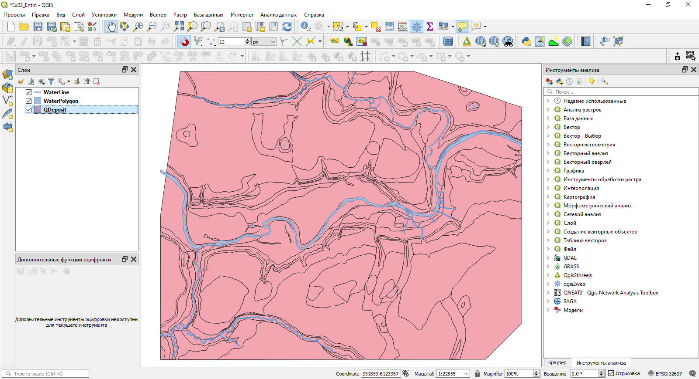

# Создание карты четвертичных отложений {#map-design-quaternary}

[Архив с данными и файлом отчёта](https://1drv.ms/u/s!AmtmZDq3JgxHgZUFCgDwGfEvocDIrw?e=LZbP6h)

## Введение {#map-design-quaternary-intro}

**Цель задания** — закрепление навыков загрузки и визуализации данных в QGIS.

**Необходимая теоретическая подготовка:** модели пространственных данных, модели пространственных объектов, базы пространственных объектов, картографические проекции.

**Необходимая практическая подготовка:** в объёме упражнения 1.

**Исходные данные:** база геоданных ESRI на территорию Сатинского учебного полигона, Калужская область.

**Ожидаемый результат:** карта четвертичных отложений Сатинского полигона М 1:30 000

### Контольный лист {#map-design-quaternary-checklist}

* Добавить на карту источники пространственных данных
* Импортировать символику
* Настроить подписи объектов
* Создать набор пространственных данных из текстового файла
* Создать компоновку карты и легенду
* Экспортировать результат в графический файл

## Начало работы {#map-design-quaternary-begin}
[В начало упражнения ⇡](#map-design-quaternary)

1. Скачайте архив с исходными данными для упражнения и распакуйте его в свою рабочую директорию.

    В вашей рабочей директории появилась «папка» `Satino.gdb`. Зайдя в неё с помощью проводника или Finder'a, вы увидите множество файлов с различными расширениями (*.spx, *.gdbtable, *.gdbtablx и др.). Ничего не редактируйте в этой «папке».

2. Запустите **QGIS** и сразу сохраните проект в своей рабочей директории, на одном иерархическом уровне с `Satino.gdb`. Назовите его по шаблону `Ex02_%Фамилия.qgz%`.

    >Примечание: не забывайте периодически сохранять проект QGIS!

3. Откройте Менеджер источников данных и разверните содержимое базы `Satino.gdb`

    
    
    Вы видите список наборов пространственных данных, хранящихся в базе `Satino.gdb`. Это векторные наборы различной геометрии (точечной, линейной и полигональной).
    
    >База геоданных ESRI (*.gdb) — основной формат, используемый линейкой программных продуктов ArcGIS. В базах геоданных могут храниться как векторные, так и растровые данные. Кроме того, базы геоданных поддерживают специальные возможности (подтипы, доменты) и структуры данных (топологические и сетевые наборы).  
    
    >QGIS способен получать доступ к базам геоданных ESRI в режиме чтения, но не в режиме редактирования. И даже эти возможности ограничены: QGIS «видит» векторные наборы пространственных данных, но «не считывает» структуру базы (классы и наборы пространственных объектов), растровые наборы, топологию и другие элементы, специфические для ArcGIS. В частности, набор DEM, который отображается в браузере как векторный полигональный набор данных, на самом деле является растровым набором.
    
## Добавление данных в проект {#map-design-quaternary-data}
[В начало упражнения ⇡](#map-design-quaternary)

1. Добавьте на карту наборы `WaterLine`, `WaterPolygon` и `QDeposit`.

    **Вопрос 1:** какая система координат присвоена для каждого набора данных? Какая проекция используется для этой системы координат? К какому виду относится эта проекция по характеру искажений? Для чего она применяется?  
    **Вопрос 2:** какая система координат присвоена проекту QGIS после добавления набора данных?  
    
2. Настройте визуализацию слоёв `WaterLine` и `WaterPolygon`, используя условные знаки из библиотеки QGIS. Окно QGIS должно принять вид, аналогичный рисунку ниже:  

    

3. Откройте таблицу атрибутов слоя `QDeposit` и изучите её.  

    
    
    Вы видите индексы и текстовые описания четвертичных отложений. Далее вы визуализируете слой QDeposit таким образом, что каждому типу отложений (`Deposit`) будет сопоставлен уникальный условный знак.
    
## Применение готового стиля к слою {#map-design-quaternary-classification}
[В начало упражнения ⇡](#map-design-quaternary)

1. Откройте свойства слоя `QDeposit`.

2. На вкладке «Стиль» измените тип отображения на *Уникальные значения* и настройте классификацию по полю `Index` c использованием случайных цветов (*Random colors*). Закройте свойства слоя и оцените результат.  

    **Скриншот 1:** результат классификации — отображение каждого типа отложений уникальным цветом. 
    
3. Изображение стало более «пёстрым», но не стало более читаемым. Человеческому глазу трудно распознать два десятка уникальных оттенков цвета. Кроме того, исходя из географической логики, родственным категориям должны быть присвоены схожие цвета.  

    Разработка цветовых решений для сложных, комплексных карт является отдельной научной задачей. В этом упражнении вы будете использовать готовые наборы стилей.
    
4. В левом нижнем углу вкладки «Стиль» найдите кнопку «Стиль». Нажмите на неё и выберите опцию «Загрузить стиль». В открывшемся окне в строчке «Файл» найдите стилевой файл `QDeposit.qml`. Загрузите из этого файла всю доступную символику. 

    >QGIS, как и другое геоинформационное ПО, позволяет сохранять настройки отображения слоя в отдельный стилевой файл. Поддерживаются два формата: QGIS Layer Style File (*.qml) и Styled Layer Descriptor (*.sld). В проприетарном ПО (ArcGIS, MapInfo) используются другие форматы описания стилей. Как правило, они несовместимы друг с другом.
    
    **Скриншот 2:** изображение готового слоя после импорта символики
    
5. Изучите условные знаки, применённые для слоя, и ответьте на вопросы:

    **Вопрос 3**: чем отличается условный знак, применённый для биогенных отложений, от всех прочих условных знаков? Каким образом это осуществлено?
    
    **Вопрос 4**: как соотносятся записи в таблице атрибутов (поле Deposit) и записи в поле «Легенда» в настройках стиля условных знаков?
    
6. Настройте подписи для слоя. Для подписывания используйте поле Index. Настройки подписей определите самостоятельно.

## Создание набора пространственных данных из таблицы с координатами {#map-design-quaternary-csv}
[В начало упражнения ⇡](#map-design-quaternary)

1. Найдите в проводнике файл `geol_points.csv` и откройте его с помощью простого текстового редактора (Блокнот или аналогичный). Изучите содержимое файла.

    

    >Comma-Separated Values (CSV) — простой текстовый формат, предназначенный для хранения табличных данных. Каждая строка представляет строку таблицы, а ячейки, соответствующие столбцам, разделяются специальными символами. В качестве такого символа может быть использована запятая, точка с запятой, знак табуляции или сочетание из нескольких символов. 
    
    В представленном файле вы видите два столбца — X и Y. Это представление координат точек. Система координат, которая использовалась при создании файла, совпадает с системой координат вашего проекта. На следующих шагах вы загрузите эту таблицу в QGIS как набор пространственных данных.
    
2. Откройте панель менеджера источников данных и перейдите на вкладку *Delimited Text*. Поскольку текстовый файл не содержит сведений, необходимых для корректного импорта и визуализации, мы будем настраивать параметры импорта вручную.
    
3. Нажмите значок с символом `...` справа от первого поля и в окне Проводника откройте файл `geol_points.csv`. Не меняйте имя слоя и кодировку.

    >Примечание: в дальнейшем в вашей практике будут встречаться CSV-файлы, созданные в различных кодировках. В таких случаях нужно будет выбрать (или подобрать) правильную кодировку. Проверить себя можно по образцу загружаемой таблицы, который отображается в нижней части интерфейса загрузчика.

4. В первом блоке настроек («Формат файла») установите корректный разделитель столбцов.

5. Во втором блоке настроек («Настройки полей и записей») установите нужные параметры самостоятельно.

6. В третьем блоке настроек («Геометрия») определите, какие поля содержат координаты точек, и установите целевую систему координат — такую же, как система координат проекта.

7. В блоке «Настройки слоя» не меняйте значения, определённые по умолчанию.

8. Проверьте себя, посмотрев блок «Примеры данных». Если настройки заданы правильно, в этом блоке будут корректно отображены первые 20 строк таблицы (не считая заголовков).
    
    **Скриншот 3:** Окно настроек импорта CSV-файла

9. Нажмите кнопку «Добавить», чтобы добавить слой на карту.

10. Настройте условные знаки для добавленного слоя. Отобразите все разрезы чёрными кругами диаметром 1,4 мм без обводки.

## Оформление карты {#map-design-quaternary-final}
[В начало упражнения ⇡](#map-design-quaternary)

7. Создайте макет карты в портретной ориентировке и добавьте на него картографическое изображение.

8. Установите следующие параметры элемента карты: ширина 170 мм, высота 140 мм, масштаб картографического изображения 1:30 000.

9. Разместите элемент карты в верхней половине листа

10. Настройте сетку **прямоугольных** координат для карты в виде перекрестий.  

     >*Подсказка: используйте для сетки ту же систему координат, которая применена для проекта QGIS в целом*

11. Добавьте зарамочное оформление: название карты, легенду, масштабную линейку.

12. Экспортируйте карту в формат PNG и вставьте её в отчётный документ.  

    >*Подсказка: используйте опцию «Обрезать по содержимому», чтобы сохранить размеры изображения в отчётном документе*

