# Создание политической карты мира {#map-design-world}

[Файл отчёта]()

## Введение {#map-design-world-intro}

**Цель задания** — закрепление навыков загрузки и визуализации данных в QGIS.

**Необходимая теоретическая подготовка:** модели пространственных данных, модели пространственных объектов, базы пространственных объектов, картографические проекции.

**Необходимая практическая подготовка:** не требуется.

**Исходные данные:** [Natural Earth](https://www.naturalearthdata.com/).

**Ожидаемый результат:** политическая карта мира М 1:130 000 000

### Контольный лист {#map-design-world-checklist}

* Добавить на карту источники пространственных данных
* Создать определение проекции
* Настроить отображение объектов на карте различными цветами в соответствии с данными в таблице атрибутов
* Скомпоновать картографическое изображение
* Экспортировать результат в графический файл

## Начало работы {#map-design-world-begin}
[В начало упражнения ⇡](#map-design-world)

Работа с пространственными данными обычно подразумевает одновременное использование множества файлов и баз данных, которые могут располагаться как на вашем локальном компьютере, так и в локальной сети или в Интернете. Хотя в реальной практике использования ГИС обычно применяется сетевое размещение ресурсов, в этом упражнении и далее в курсе геоинформатики вы, как правило, будете организовывать все ресурсы ваших ГИС-проекты в локальных директориях.

1. Создайте или выберите директорию (папку) для упражнений по геоинформатике на вашем рабочем компьютере. Например, для компьютеров под управлением ОС Windows: `D:\GIS\207_CAR\Ivanov`. Мы настоятельно рекомендуем, чтобы полный путь к рабочей директории не содержал символов русского алфавита, диакритики или других специальных символов.

2. В рабочей директории создайте папку для текущего упражнения, например, `Ex02`. Все данные, относящиеся к этому упражнению, будут находиться здесь.

3. В папке для текущего упражнения создайте ещё одну вложенную папку. Назовите её `data`. В эту папку вы будете помещать пространственные данные, которые получите на последующих этапах.

## Загрузка исходных данных {#map-design-world-input-data}
[В начало упражнения ⇡](#map-design-world)

Работа в ГИС — это в первую очередь работа с пространственными данными. Пространственные данные могут иметь различную форму представления, уровень детализации, назначение и лицензионные ограничения на использование. В этом упражнении мы воспользуемся данными ресурса [Natural Earth](https://www.naturalearthdata.com/). Это наборы пространственных данных низкой детализации, предназначенные для создания карт мелкого масштаба (1:10 000 000, 1:50 000 000, 1:110 000 000). Важно, что все данные находятся в свободном доступе — вы можете использовать их без ограничений как в учебных и научных задачах, так и в коммерческих проектах. Посмотрите вкладку *About*, чтобы узнать больше о Natural Earth.

1. Перейдите на страницу загрузок Natural Earth (https://www.naturalearthdata.com/downloads/). На этой странице перейдите в раздел Cultural, соответствующий самому мелкому масштабу.
    
    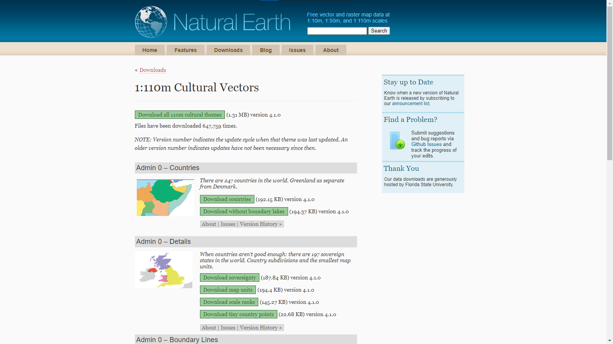
    
2. Скачайте набор данных `Admin 0 – Countries`. На ваш компьютер будет загружен архив в формате [ZIP](https://pkware.cachefly.net/webdocs/casestudies/APPNOTE.TXT). Этот формат поддерживается большинством современных программ для архивирования и разархивирования файлов.

3. Распакуйте содержимое архива в папку `data`, созданную на предыдущем шаге. Сам архив можно удалить.

    Содержимое архива составляют пространственные данные в виде [шейп-файла ESRI](#manual-dataformats-shapefile), а также несколько сопроводительных файлов
    
    
    
    > Шейп-файлы были базовым форматом ГИС-пакета ArcView и за счёт этого получили очень широкое распространение. Шейп-файлы не такие функциональные, как базы геоданных ESRI (современный базовый формат для продуктов линейки ArcGIS) или GeoPackage, но тем не менее их продолжают активно использовать. Многие особенности шейп-файлов обусловлены спецификой и возможностями компьютеров начала 90-х гг. В частности, геометрия набора данных хранится отдельно (в файле `.shp`), семантика — отдельно (в формате [dBase](https://en.wikipedia.org/wiki/DBase), `.dbf`), а для быстрого поиска по пространственным данным используется индекс-файл (`.shx`). Эти три файла — обязательные компоненты шейп-файла. Помимо них, отдельно могут быть записаны сведения о проекции (`.prj`), кодировке (`.cpg`) и многое другое. Основным файлом, тем не менее, считается `.shp`, а все остальные на компьютерном сленге называются [*sidecar*-файлами](https://en.wikipedia.org/wiki/Sidecar_file). Все файлы в составе шейп-файла имеют одинаковые имена, но разные расширения.
    
4. Изучите содержимое папки после разархивирования. Удалите файлы, которые не входят в состав шейп-файла. Определите назначение остальных файлов.

## Создание ГИС-проекта и загрузка данных в проект {#map-design-world-qgis-project}
[В начало упражнения ⇡](#map-design-world)

1. Запустите QGIS.
    
    >Для запуска можно воспользоваться ярлыком QGIS Desktop <...> или QGIS Desktop <...> with GRASS <...>. Второй ярлык одновременно с QGIS запускает сессию GRASS, что позволяет задействовать инструменты GRASS изнутри QGIS. В этом упражнении вы не будете использовать инструменты GRASS, поэтому можно воспользоваться любым ярлыком для запуска.
    
2. Сохраните проект в папку с материалами текущего упражнения (в нашем примере — `Ex02`) под именем `Ex02_*Surname*` (вместо surname вставьте вашу фамилию в латинской транслитерации). Чтобы сохранить проект, воспользуйтесь опцией «Сохранить» из меню «Проект» или кнопкой  на панели инструментов проекта. Проект QGIS версии 3 имеет расширение `*.qgz`.

    >Для самопроверки: проект QGIS (файл `*.qgz`) должен располагаться в том же каталоге, что и папка `data`.

3. Откройте **Менеджер источников данных**. Это можно сделать из меню «Слой», с помощью кнопки  на специальной панели (которая так и называется — панель менеджера источников данных) или нажав комбинацию клавиш `Ctlr`+`L`. Откроется окно Менеджера источников данных

4. Если вы впервые пользуетесь QGIS, то окно Менеджера откроется на вкладке «Обозреватель», вид которого аналогичен проводнику файловой системы. Если Менеджер источников данных открылся на другой вкладке, перейдите на вкладку «Обозреватель»

5. Найдите в списке папок «Размещение по умолчанию для проекта» и раскройте его.

    
    «Размещение по умолчанию для проекта» — это каталог, в котором находится ваш файл проекта. Если бы мы не сохранили проект на предыдущем шаге, этого пункта в проводнике не было бы. Размещение по умолчанию облегчает доступ к файлам проекта, если вы поддерживаете структуру ГИС-проекта в порядке.
    
6. Разверните содержимое папки `data`. Сколько наборов пространственных данных находится в этой папке?

7. Добавьте набор `ne_110m_admin_0_countries.shp` в проект. Для этого дважды щёлкните по его названию левой клавишей мыши или воспользуйтесь опцией «Добавить слой в проект» из контекстного меню.

8. Закройте Менеджер источников данных. Окно QGIS примет вид, аналогичный представленному ниже.

    
9. Сохраните проект QGIS. 
    
<kbd>**Снимок экрана №1.** Окно QGIS после загрузки набора данных</kbd>

## Настройка системы координат проекта {#map-design-world-crs}
[В начало упражнения ⇡](#map-design-world)

В правом нижнем углу окна QGIS вы видите надпись 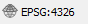. Нажмите на эту надпись, чтобы открыть интерфейс выбора системы координат проекта. 

  >Примечание: в тот же интерфейс можно попасть, выбрав «Проект» — «Свойства», и в открывшемся окне перейдя на вкладку «Система координат».

В открывшемся окне вы видите более подробную информацию об используемой системе координат. Код `EPSG:4326` соответствует системе географических координат **WGS 84**. Термин «географическая система координат» (*geographic coordinate systems*) в ГИС означает, что координаты объектов и линейные параметры растров хранятся в виде широты и долготы. Альтернативный подход — проецированные системы координат (*projected coordinate systems*), где плановые координаты измеряются в метрических единицах.

Система координат проекта была импортирована из первого (в нашем случае — пока единственного) загруженного источника пространственных данных. Система координат WGS 84, как правило, не используется для картографирования, поэтому мы изменим систему координат проекта. Поскольку проект предназначен для создания карты мира, мы выберем систему координат, использующую подходящую проекцию — например, [проекцию Робинсона](https://en.wikipedia.org/wiki/Robinson_projection)

1. В строке «Фильтр» в верхней части интерфейса выбора системы координат проекта начните вводить `robinson`, чтобы отфильтровать доступные системы координат по названию. Ниже, в блоке «Предустановленные системы координат», будет выведен список систем координат, в название которых входит введённая совокупность символов.

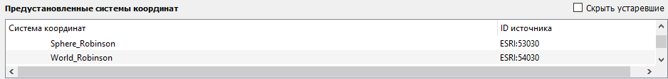
    
2. Выберите ту из систем координат, где в качестве вспомогательной поверхности используется эллипсоид вращения

    >Примечание: на карте общемирового охвата различия между системами координат, использующих одну проекцию, но разные геодезические даты (датумов), несущестенно. Но в общем случае использование разных геодезических дат (датумов) может приводить к изменению положений контуров на сотни метров.
    
3. Примените изменения и закройте окно свойств проекта

Сейчас ваша карта выглядит приблизительно так, как показано на иллюстрации ниже:

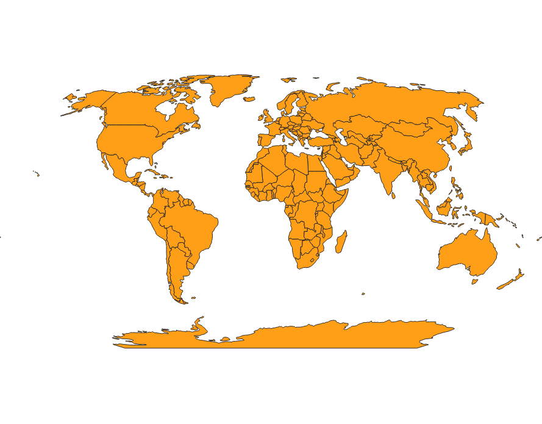

Это изображение уже больше похоже на «приличную» карту мира, но у него есть ряд заметных недостатков. Главный из них — разрыв вдоль 180-го меридиана, из-за которого Чукотка оказывается «оторванной» от основной территории Российской Федерации и переносится в северо-западный угол карты.

Чтобы избавиться от этого эффекта, мы изменим один из параметров системы координат — центральный меридиан проекции. Изменение центрального меридиана приведёт к тому, что картографическое изображение «сдвинется», как лента конвейера. В результате Чукотка окажется в восточной части карты и не будет оторвана от Евразии. Но сначала нам нужно определить, на какую величину нужно сдвинуть центральный меридиан.

4. Верните проекту исходную систему координат (`WGS 84`) и увеличьте изображение Берингова пролива. Обратите внимание, что воображаемые линии меридианов в некотором диапазоне не пересекают сушу

    
5. Подводя курсор узлам полигонов, ближайшим к «разрыву», определите диапазон долгот более точно, до десятых долей градуса.

6. В найденном диапазоне выберите меридиан, долгота которого будет кратна 0,5°

7. Теперь вычислите разность между 180° и найденной долготой. Это и будет искомое смещение центрального меридиана проекции. Запомните или запишите его.

8. Вернитесь в интерфейс выбора системы координат и снова выберите систему координат с проекцией Робинсона.

9. В блоке определений системы координат скопируйте описание системы координат в формате WKT. Копируйте строки, показанные ниже:

    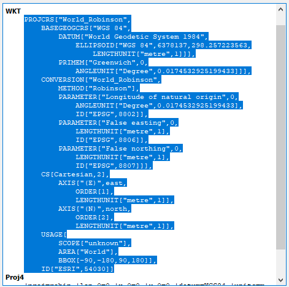

    Для удобства можете сохранить скопированные строки в отдельный текстовый файл
    
10. Закройте интерфейс выбора системы координат.

11. Откройте меню настройки новых систем координат («Установки» — «Пользовательские проекции...»).

12. Нажмите зелёную клавишу с изображением знака «+», чтобы начать добавление новой системы координат.

13. В строке «Параметр» введите имя для вашей новой системы координат. Для удобства дальнейшей работы имя должно быть коротким и информативным, например `Robinson_shift`. Можно также вписать в имя конкретное значение параметра, которое вы собираетесь изменить.

14. Убедитесь, что опция «Формат» установлена в значение `WKT (Recommended)`. Вы скопировали параметры системы координат в формате WKT, поэтому данная опция вам подходит.

15. В блок «Параметры» вставьте определение системы координат, скопированный ранее на шаге 9.

16. Измените параметры системы координат следующим образом:

  * Параметр *Longitude of natural origin*: вместо 0 установите значение, найденное на шаге 7. В качестве разделителя целой и дробной части используйте точку!
  * Параметр *ID* в самом конце списка: удалите запись ` ID["ESRI",54030]`, а также запятую, которая находится перед ней в строке выше. Обратите внимание, что удалить нужно только одну квадратную скобку — вторая относится к более крупному блоку описания! Если вы всё сделали правильно, описание системы координат будет оканчиваться **тремя** квадратными скобками.
  
17. Нажмите кнопку «Validate», чтобы проверить синтаксическую корректность введённого определения координат. Если система выдаст сообщеине «The WKT projection definition is valid», то вы всё сделали правильно. В противном случае вернитесь на шаг 15.

18. Если определение успешно прошло валидацию, нажмите ОК, чтобы сохранить введённые параметры. На этом этапе система также может выдать ошибку, если введённые параметры совпадают с определением, которое уже есть в базе. В этом случае вернитесь на шаг 16.

19. Теперь снова откройте окно выбора системы координат. Задайте проекту систему координат, которую вы только что ввели.

Увеличьте изображение так, чтобы видеть северо-восточную оконечность Евразии. Ваше изображение должно выглядеть аналогично показанному ниже:

Также обратите внимание на изображение Антарктиды. **Из-за смещения центрального меридиана этот континет отрисовывается с ошибками**, но в рамках данного упражнения мы их проигнорируем.

20. Отобразите набор данных в полном охвате (`Ctrl+Shift+F` или кнопка 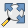 на панели навигации) и сделайте снимок экрана.

<kbd>**Снимок экрана №2.** Окно QGIS после настройки системы координат</kbd>

Вы настроили систему координат проекта (проекцию для будущей карты). Теперь вы начнёте работать с визуализацией слоя государств.

## Окраска стран в разные цвета {#map-design-world-colorbrewer}
[В начало упражнения ⇡](#map-design-world)

1. Переименуйте слой `ne_110m_admin_0_countries`. Назовите его `Страны`.

2. Откройте таблицу атрибутов слоя `Страны`. Для этого нажмите правой кнопкой мыши на название слоя в таблице слоёв и выберите пункт «Открыть таблицу атрибутов».

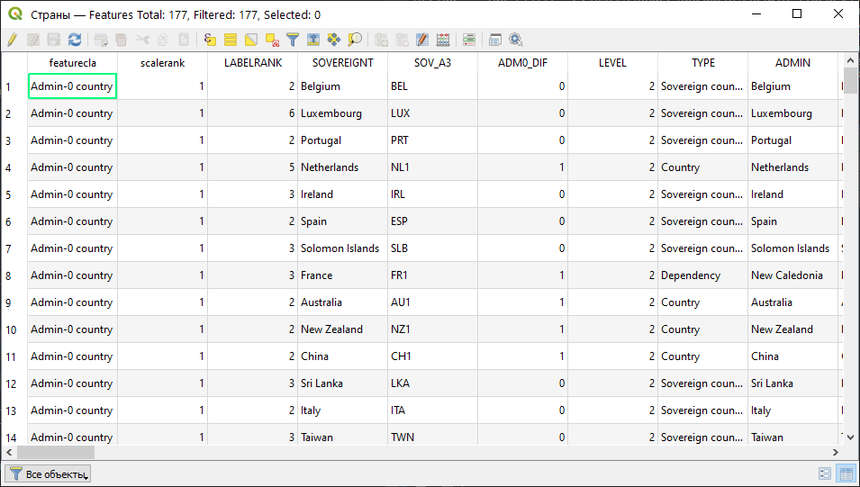

Таблица атрибутов является представлением базы данных, сопоставленной набору пространственных данных. Каждый объект на карте имеет массу семантической (атрибутивной) информации. Например, в том наборе, который вы сейчас используете, есть названия стран на различных языках, текстовые характеристики уровня экономического развития и многое другое. Но сейчас нас интересуют столбцы с названием `MAPCOLOR`.

1. Изучите столбец `MAPCOLOR7`. Сколько различных уникальных значений присвоено объектам в полях этого столбца?

В настоящий момент все страны обозначены в окне проекта при помощи одного и того же условного знака. На политических картах различные территории обычно отображаются различными цветами, причём цвета могут повторяться. Столбец `MAPCOLOR7` (и соседние с ним столбцы) специально созданы разработчиками Natural Earth, чтобы закодировать отображение стран разными цветами. При этом цифры в столбце не означают какой-то конкретный цвет — это просто условные «коды», которыми ГИС-специалист может пользоваться для присвоения различных условных знаков. Мы изменим способ визуализации слоя таким образом, чтобы каждому уникальному значению поля `MAPCOLOR7` соответствовал свой цвет. Но сначала подберём нужную палитру цветов.

2. Перейдите на сайт [ColorBrewer](https://colorbrewer2.org/). Выясните, для чего он предназначен, каким функционалом обладает.

    >Примечание: ColorBrewer — это палитры цветов, широко применяемые в картографии и смежных задачах. Палитры ColorBrewer интегрированы в различное популярное программное обеспечение, в том числе в QGIS. Сайт [ColorBrewer](https://colorbrewer2.org/) предоставляет удобный интерфейс для выбора нужной палитры.
    
    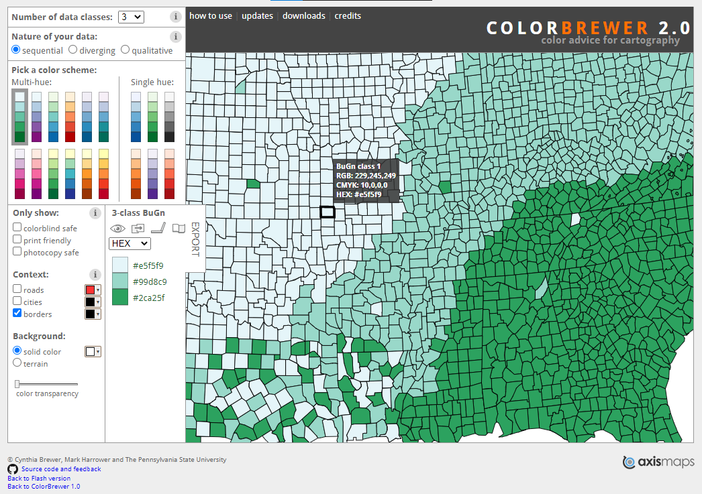
    
3. Подберите палитру, исходя из следующих соображений:
  
  * Число цветов: по числу уникальных значений в поле `MAPCOLOR7`;
  * Тип данных, к которым применяется палитра: качественные (*qualitative*);
  * Из доступных вариантов выберите палитру мягких, так называемых «пастельных» цветов.
  
4. Запомните или запишите название выбранной палитры. Сделайте снимок экрана.

<kbd>**Снимок экрана №3.** Окно браузера с выбранной палитрой ColorBrewer</kbd>
  
5. Вернитесь в QGIS. Откройте окно свойств слоя `Страны`. Для этого дважды щёлкните левой кнопкой мыши по названию слоя или нажмите на него правой кнопкой мыши, а в контекстном меню выберите «Свойства...»

6. Основная вкладка для настройки визуализации слоя — это вкладка «Оформление». Как видите, сейчас для слоя применён стиль «Обычный знак». Это значит, что все объекты слоя изображаются на карте при помощи одного и того же условного знака.

7. Измените способ визуализации с «Обычный знак» на «Уникальные значения». Внешний вид окна сильно изменится.

8. Ниже, в поле «Значение», выберите из выпадающего списка поле `MAPCOLOR7`. Мы возьмём значения из этого поля и каждому из них присвоим свой условный знак.

9. Найдите кнопку «Классифицировать» в нижней части окна и нажмите на неё. QGIS автоматически выберет все уникальные значения из столбца и присвоит им случайные цвета. Окно настройки примет вид, аналогичный этому:

Обратите внимание, что в таблице значений больше записей, чем уникальных значений в поле `MAPCOLOR7`. QGIS автоматически добавляет строку «*все другие значения*» на случай, если после редактирования слоя в столбец добавляют новые, не встречавшиеся ранее значения. Без специального знака «*все другие значения*» объекты с новыми значениями прост не будут отображаться на карте.

10. Примените изменения, закройте окно свойств слоя, сохраните проект и сделайте снимок экрана.

<kbd>**Снимок экрана №4.** Окно QGIS с визуализацией стран с помощью случайно заданных цветов</kbd>.

11. Вновь откройте окно свойст слоя на вкладке «Оформление».

12. В таблице значений удалите запись «*все другие значения*». Мы не будем редактировать слой, а значит, можем быть уверены, что никаких новых значений не появится.

13. Измените палитру цветов. Для этого щёлкните правой кнопкой мыши на выпадающем меню «Градиент» и выберите пункт «Создать новый градиент»

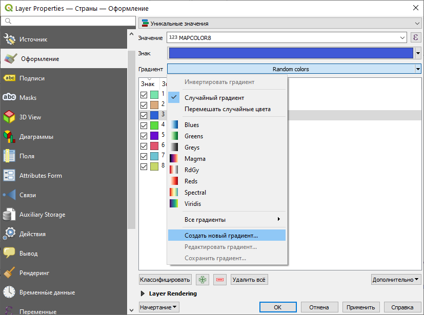

14. В открывшемся окне выберите тип градиента: «Каталог: ColorBrewer» и нажмите OK.

15. В новом открывшемся окне введите два параметра:

  * Имя схемы: название палитры, которое вы запомнили на шаге 4;
  * Цвета: необходимое число цветов
  
Выбранные настройки палитры будут автоматически применены к слою. Картографическое изображение примет вид, аналогичный представленному ниже:

16. Последний штрих к изображению стран — удаление обводки. На следующих шагах мы добавим другие слои, с помощью которых изобразим береговую линию и границы государств, поэтому обводка полигонов слоя государств будет нам только мешать. Чтобы удалить обводку, вернитесь в свойства слоя на вкладку «Оформление», нажмите на поле «Знак», выберите слой *Simple Fill* в перечне слоёв знака и установите для параметра «Стиль обводки» значение «Без обводки».

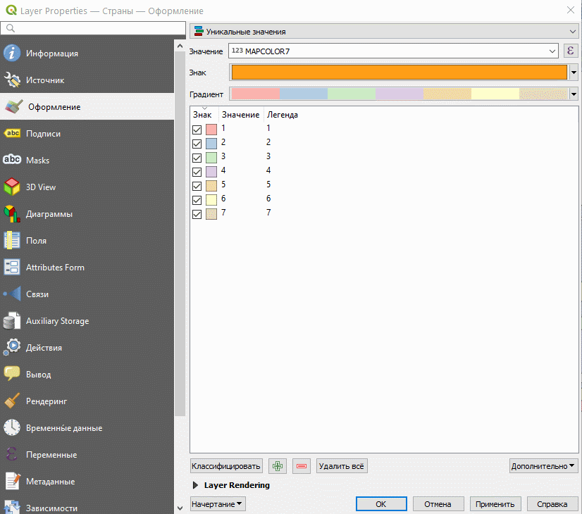

<kbd>**Снимок экрана №5.** Окно QGIS с визуализацией стран с помощью специально заданной палитры</kbd>.

## Добавление других слоёв на карту {#map-design-world-other-layers}
[В начало упражнения ⇡](#map-design-world)

1. Загрузите с сайта Natural Earth следующие наборы данных, соответствующие детальности вашей карты:
  
  * береговую линию (*Coastline*)
  * сухопутные границы (*Boundary Lines*)
  * Населённые пункты (*Populated Places*)
  
2. Распакуйте содержимое архивов в ту же директорию, где находится шейп-файл государств. Удалите лишние файлы.

3. Добавьте загруженные наборы данных в ваш проект QGIS. Переименуйте их следующим образом: «Береговая линия», «Границы», «Населённые пункты».

4. Расставьте слои в следующем порядке:

  * Населённые пункты
  * Береговая линия
  * Границы
  * Страны
  
5. Примените следующие настройки визуализации слоёв линейной геометрии

  * Береговая линия: линии синего цвета толщиной 0,26 мм
  * Границы государств: линии серого цвета толщиной 0,26 мм
  
  Самостоятельно изучите интерфейс настройки цвета в QGIS
  
6. Примените следующие настройки для слоя населённых пунктов: условный знак `city` из библиотеки QGIS, размер 1,2 мм.

7. Помимо добавленных слоёв, нам необходим слой для изображения океанов. К сожалению, из-за несовершенства QGIS вы не можете воспользоваться для этой цели набором данных с Natural Earth. Загрузите шейп-файл океанов по [этой ссылке](https://1drv.ms/u/s!AmtmZDq3JgxHgZswh2sFnErE-JEmGw?e=xoZW4c). Распакуйте шейп-файл в папку с другими шей-файлами и добавьте его в проект. 

8. Переименуйте добавленный слой в «Океан» и расположите его в самом низу таблицы слоёв.

9. Задайте для слоя «Океан» условный знак в виде заливки светло-голубого цвета без обводки.

10. Сохраните проект и сделайте снимок экрана.

<kbd>**Снимок экрана №6.** Окно QGIS с визуализацией стран с помощью специально заданной палитры</kbd>.

## Создание компоновки карты {#map-design-world-layout}
[В начало упражнения ⇡](#map-design-world)

Изображение, которое вы создали — ещё не карта. Нужно создать компоновку карты — разместить картографическое изображение на листе бумаги, добавить название, масштабную линейку и другие элементы зарамочного оформления. 

1. Создайте новый макет (`Ctrl+P` или «Проект» — «Создать макет...»). В небольшом диалоговом окне, появляющемся при создании макета, введите его название — свою фамилию на русском языке. Нажмите ОК.

2. На экране откроется отдельное окно настройки компоновки. В центре его — белый прямоугольник, имитирующий лист бумаги. Панели по краям экрана предназначены для добавления и настройки элементов макета.

3. Найдите и активируйте инструмент добавления карты к макету .

4. Продумайте, как будет расположена карта на вашем листе. Обязательно запланируйте отступ 2–2,5 см от края листа с каждой стороны.

5. Переместите курсор на лист в положение, соответствующее планируемому положению северо-западного угла карты.

6. Зажав левую кнопку мыши, ведите курсор к планируемому положению юго-восточного угла карты.

7. Пока элемент карты выбран, в правой части окна компоновки отображается панель свойств элемента. Найдите в нём раздел «Положение и размер» и установите размер карты равным 260×130 мм

8. В той же панели задайте знаменатель масштаба картографического изображения равным 130 000 000.

9. Пользуясь инструментом перемещения содержимого элемента (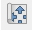), измените положение изображения карты так, чтобы вписать её в рамки

10. Добавьте к макету текст и напишите в нём название карты. Подберите форму и размер шрифта. Расположите название над картой.

11. Добавьте к карте масштабную линейку.

12. Добавьте к карте текст и укажите в нём автора карты.

13. Экспортируйте изображение в формат PNG