# Создание социально-экономической карты {#map-design-population}

[Архив с исходными данными](https://github.com/aentin/qgis-course/raw/master/files/Ex04.zip)

[Контрольный лист](https://github.com/aentin/qgis-course/raw/master/files/Ex04_%D0%BE%D1%82%D1%87%D1%91%D1%82.docx){target="_blank"}

## Введение {#map-design-population-intro}

**Цель задания** --- закрепление навыков загрузки и визуализации данных в QGIS.

**Необходимая теоретическая подготовка:** модели пространственных данных, модели пространственных объектов, базы пространственных объектов, картографические проекции.

**Необходимая практическая подготовка:** в объёме упражнения 1.

**Исходные данные:** база пространственных данных на территорию Российской Федерации

**Ожидаемый результат:** тематическая карта «Население России» масштаба 1:35 000 000

В этом упражнении вы закрепите базовые навыки визуализации с использованием программных средств ГИС, составив карту населения Российской Федерации в разрезе субъектов фередации и крупных населённых пунктов. На картах населения, как правило, изображается людность городов (способом значков) и плотность населения (способом количественного фона). В рамках упражнения мы не будем пытаться выполнить «объективное» районирование территории по естественным градациям плотности населения; вместо этого воспользуемся обобщённой статистикой по плотности населения субъектов РФ.

### Контольный лист {#map-design-population-checklist}

-   Добавить на карту источники пространственных данных
-   Импортировать символику
-   Настроить подписи объектов
-   Создать набор пространственных данных из текстового файла
-   Создать компоновку карты и легенду
-   Экспортировать результат в графический файл

## Начало работы {#map-design-population-begin}

[В начало упражнения ⇡](#map-design-population)

1.  Скачайте архив с исходными данными для упражнения и распакуйте его в свою рабочую директорию.

2.  Запустите **QGIS**. Нажмите кнопку **Сохранить** и сохраните проект QGIS (файл формата `.qgz`) в распакованную папку (*Ex03_PopulationMap*) под именем `Ex03_%Фамилия%`. Папка *Ex03_PopulationMap* теперь является расположением по умолчанию для проекта.

3.  Откройте **Менеджер источников данных**, на вкладке **Браузер** найдите и разверните **Размещение по умолчанию для проекта**. Вы видите там файл проекта, который вы только что сохранили, и базу данных `RussiaPopulationMap.gpkg`.

4.  Разверните содержимое базы `RussiaPopulationMap.gpkg`.

    

    > Файл формата GeoPackage (\*.gpkg) представляет собой базу данных SQLite, внутри которой содержатся таблицы с данными и таблицы с метаданными. В отличие от шейп-файлов, GeoPackage хранит всю необходимую информацию в одном файле. Это позиционируется как одно из главных преимуществ формата.

    Один файл формата GeoPackage может хранить один или несколько наборов пространственных данных. В терминологии разработчиков формата разные наборы данных внутри базы называются *слоями* (*layers*) или *таблицами данных* (*data tables*). В браузере менеджера источников данных они отображаются с использованием разных значков в зависимости от типа геометрии:

    -   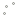 точки;
    -   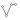 линии;
    -   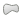 полигоны.

    Как и в случае с шейп-файлами, один набор данных может содержать объекты только одного типа геометрии.

5.  Добавьте на карту все наборы из базы `RussiaPopulationMap.gpkg`. Для добавления набора дважды щёлкните по его названию левой кнопкой мыши.

6.  В панели **Слои** основного окна QGIS расположите слои в следующем порядке:

    -   cities (города)
    -   coastline (береговая линия)
    -   boundaries (государственные границы)
    -   lakes (озера)
    -   regions (регионы РФ)
    -   neighbouring countries (соседние страны)

7.  Используя кнопку 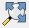 **Полный охват** или комбинацию клавиш `Ctrl+Shift+F`, измените охват изображения, чтобы во фрейме карты отобразились все объекты из добавленных слоёв.

    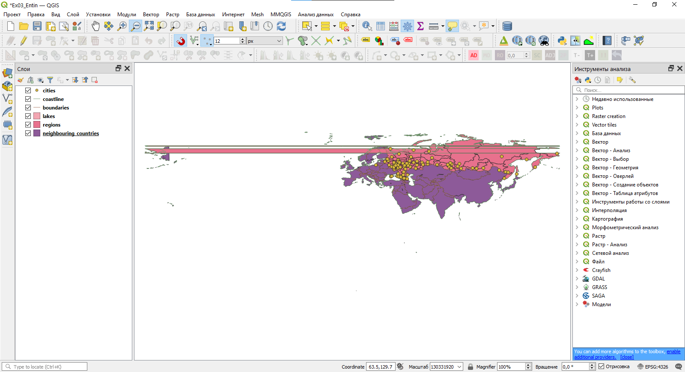

    Как видите, изображение выглядит немного странно и мало похоже на карту России. Поскольку Чукотский автономный округ расположен одновременно в западном и восточном полушариях, его изображение разрывается, если в проекте используется географическая система координат (что соответствует цилиндрической равнопромежуточной по меридианам проекции). Для карт России обычно применяются конические проекции, причём многих из них нет в международных базах данных. На следующем шаге мы выберем для карты подходящую проекцию и систему координат.

## Изменение системы координат проекта {#map-design-population-change-crs}

[В начало упражнения ⇡](#map-design-population)

1.  Откройте **Свойства проекта**, а в них --- вкладку **Система координат**

    > Это можно сделать одним из следующих способов: из меню **Проект** --- **Свойства...**, при помощи сочетания клавиш `Ctrl+Shift+P` или нажатием на надпись `EPSG:4326` в правом нижнем углу окна QGIS. Рекомендуем пользоваться последним способом, поскольку он сразу открывает нужную вкладку.

2.  В строке поиска введите `Asia_North`, чтобы отфильтровать список доступных систем координат. Теперь в списке предустановленных систем координат (*Predefined coordinate systems*) отображаются только системы координат, название которых включает символы `Asia_North`.

    

3.  Выберите из списка систему координат в конической равновеликой проекции (*Equal Area Conic*).

4.  Нажмите **ОК**.

5.  Установите масштаб карты равным **1:35 000 000**.

<kbd>**Снимок экрана №1.** Окно QGIS после изменения системы координат проекта</kbd>

5.  Сохраните проект QGIS. Запишите файл проекта (`*.qgz`) в папку с исходными данными и назовите его по шаблону `Ex03_%Фамилия%`.

> Примечание: в дальнейшем мы не будем напоминать вам о необходимости сохранять

## Создание картограмм {#map-design-population-fill-color}

[В начало упражнения ⇡](#map-design-population)

Для отображения относительных показателей по единицам административно-территориального деления используется способ изображения, который в русской картографической традиции называется **картограммой**. Картограмму очень просто сделать в ГИС, если у вас есть набор пространственных данных, пригодный для картографирования.

1.  Откройте таблицу атрибутов слоя **regions**. Найдите в этой таблице поле `population_density`. Это поле таблицы хранит значения плотности населения по субъектам РФ.

    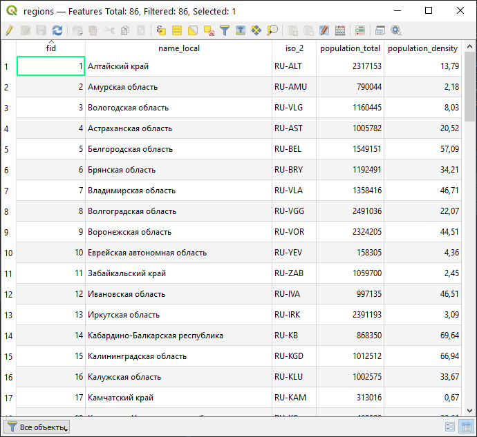

2.  Закройте таблицу атрибутов. Откройте свойства слоя **regions** и перейдите на вкладку **Стиль**.

3.  В верхней части окна выберите из выпадающего списка метод визуализации *Градуированный знак*

    

4.  Во втором поле выберите столбец таблицы атрибутов, значения которого будут использованы для создания визуализации. Вам нужно выбрать из выпадающего списка поле, хранящее информцию о значениях плотности населения.

    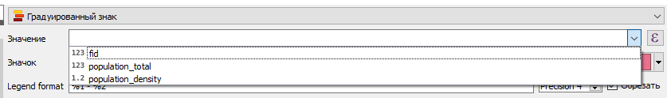

    > Значения, взятые из выбранного поля, будут классифицированы, то есть разделены на диапазоны, с использованием одного из доступных в QGIS метода классификации. Каждому диапазону сопоставляется уникальный условный знак. Все пространственные объекты, значения выбранного атрибута которых попадают в один и тот же диапазон, будут изображены на карте с использованием этого условного знака. Метод визуализации *Градуированный знак* предполагает, что условные знаки будут отличаться цветом фона, и эти цвета определяются на основе заданного градиента цветов.

5.  Нажмите **правой кнопкой мыши** на содержимое параметра **Градиент**. В открывшемся меню перейдите к пункту **Все градиенты** и выберите градиент **Oranges**

    

6.  После всех применённых настроек блок классов (*Classes*) остаётся пустым. Чтобы классифицировать имеющееся множество значений, нажмите кнопку **Классифицировать**. Классификация будет выполнена с использованием метода естественных разрывов (*Natural Breaks*), который используется в QGIS по умолчанию.

7.  Нажмите **ОК**, чтобы применить изменения и закрыть окно свойств слоя. Изображение должно принять вид, аналогичный рисунку ниже.

    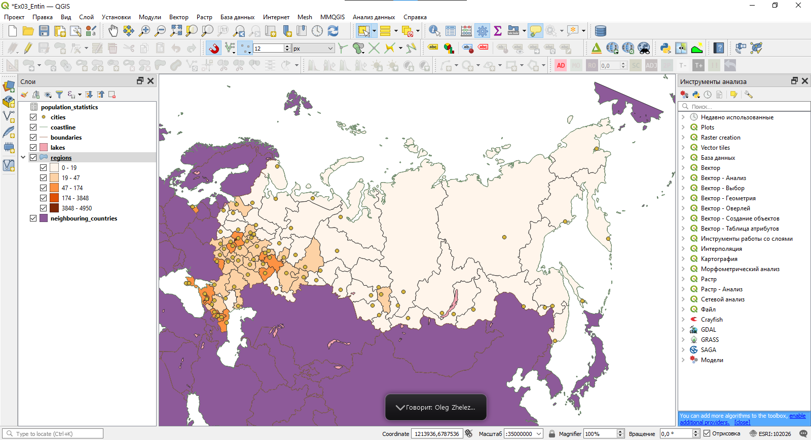

    > Существует множество методов классификаций: равных интервалов, квантилей, стандартных отклонений и т.д. По умолчанию в большинстве геоинформационных продуктов используется метод естественных интервалов: считается, что он в среднем неплохо отражает особенности распределения. Следует знать, однако, что этот метод классификации плохо справляется с распределениями, обладающими значительной асимметрией и эксцессом (*heavy-tail distribution*). Кроме того, интервалы, генерируемые этим методом, не обладают свойством наглядности. На следующем шаге мы отредактируем применяемую классификацию.

8.  Снова откройте окно свойств слоя на вкладке **Стиль**. Проверьте, что опция **Связать границы классов** (ниже кнопки **Классифицировать**) включена.

9.  Используя поле ввода в правой части окна, измените число классов на 7.

    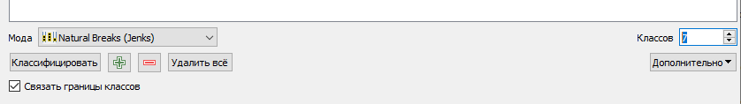

10. Теперь мы отредактируем вручную границы классов. Дважды щёлкните левой кнопкой мыши по значениям первого класса в списке. Откроется окно редактирования границ классов

    

11. Введение следующие параметры:

    -   нижнее значение: **0**
    -   верхнее значение: **1**

12. Нажмите **ОК** в окне редактирования границ классов. Вы выделили в отдельный класс регионы РФ со средней плотностью менее 1 человека на квадратный километр. Обратите внимание, что нижняя граница следующего класса тоже изменилась. Это произошло потому, что исполььзуется опция **Связать границы классов**. Это ускорит для вас процесс редактирования границ других классов

13. Измените границы следующих классов в соответствии со следующим списком:

    -   1 -- 5;
    -   5 -- 10;
    -   10 -- 20;
    -   20 -- 50;
    -   50 -- 100;
    -   100 -- 5000

14. Нажмите **OK**, чтобы применить новые настройки и закрыть окно свойств слоя.

<kbd>**Снимок экрана №2.** Окно QGIS после настройки визуализации слоя регионов РФ</kbd>

15. Вы настроили визуализацию слоя, но прежде чем переходить к другим слоям, необходимо сделать ряд косметических изменений. Начните с переименования слоя. В таблице слоёв щёлкните правой кнопкой мыши по названию слоя **regions**, выберите пункт меню **Переименовать** и введите для слоя новое название: **Плотность населения, чел/км²**.

16. Теперь измените отображение некоторых классов в легенде. Снова откройте свойства слоя на вкладке **Стиль**. В таблице классов в колонке **Легенда** отображаются названия классов в таком виде, в котором они будут показаны в легенде. Дважды щёлкните на подписи легенды класса «0 -- 1». Введите вручную новую подпись для легенды: **менее 1**.

17. Аналогичным образом измените запись в легенде для класса «100 -- 5000»: **более 100**.

18. Примените изменения и закройте окно свойств слоя.

19. Зажимая левой кнопкой мыши и перетаскивая записи в таблице, измените их порядок так, чтобы они были отсортированы по убыванию:

    

Вы закончили настраивать отображение слоя картограммы и можете перейти к настройке следующего слоя.

## Создание шкалы значков {#map-design-population-symbols}

[В начало упражнения ⇡](#map-design-population)

Плотность населения на картах обычно отображается с помощью шкалы значков. Вы создадите такую шкалу, используя положения населённых пунктов и данные из таблицы атрибутов соответствующего набора данных.

1.  Откройте таблицу атрибутов слоя **cities**. Найдите в этой таблице поле `population_2020`. Это поле таблицы хранит значения численности населения по городам РФ (в тысячах человек).

2.  Закройте таблицу атрибутов. Откройте свойства слоя **cities** и перейдите на вкладку **Стиль**.

3.  В верхней части окна выберите из выпадающего списка метод визуализации *Градуированный знак*

4.  Во втором поле выберите столбец таблицы атрибутов, значения которого будут использованы для создания визуализации. Вам нужно выбрать из выпадающего списка поле, хранящее информцию о значениях численности населения.

5.  Нажмите на кнопку **Значок**. В открывшемся меню выберите новый символ для значка --- *Dot Purple*

    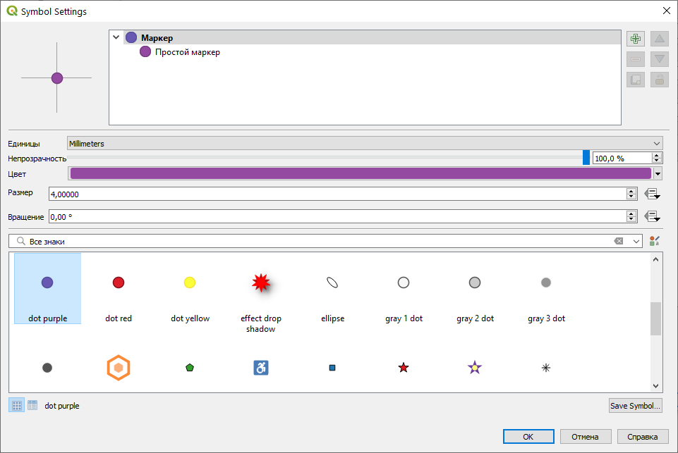

6.  В поле **Метод** поменяйте вариант *Цвет* на вариант *Размер*. Для отображения различных классов будут использоваться значки разных размеров.

7.  Настройки поля **Размер** (*Size from ... to ...*) служат для изменения размера значков. Оставьте значения, предложенные QGIS по умолчанию.

8.  Нажмите кнопку **Классифицировать**. В списке классов появится пять записей.

9.  Измените границы классов в соответствии со следующим списком:

    -   100 -- 200;
    -   200 -- 500;
    -   500 -- 1000;
    -   1000 -- 5000;
    -   5000 -- 15000;

10. Переименуйте элемент легенды, соответствующей классу с самыми большими значениями. Установите новую подпись **более 5000**

11. Измените порядок строк в таблице таким образом, чтобы значения располагались по убыванию (аналогично тому, как вы делали для легенды картограммы)

    

12. Примените изменения и закройте окно свойств слоя.

13. Переименуйте слой **cities**. Задайте этому слою имя **Людность городов, тыс. чел.**

Результат будет выглядеть приблизительно так, как показано на рисунке:

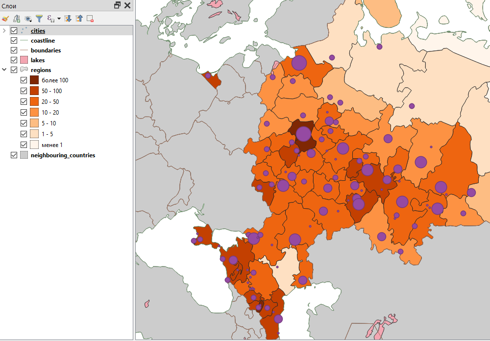

<kbd>**Снимок экрана №3.** Окно QGIS после настройки визуализации слоя населённых пунктов РФ</kbd>

## Добавление подписей значков {#map-design-population-labels}

[В начало упражнения ⇡](#map-design-population)

1.  Откройте свойства слоя **cities**, вкладку **Подписи**. Эта вкладка используется для настройки подписей и содержит ряд вложенных вкладок, позволяющих настраивать параметры размещения и отображения подписей. Прямо сейчас все вложенные опции отключены, поскольку используется режим **Не показывать подписи** (*No labels*).

2.  В выпадающем списке в верхней части окна измените **No labels** (**Не показывать подписи**) на **Single labels** (**Подписи по значениям одного поля**). Сразу после изменения этой настройки на вкладке откроется множество других параметров.

    

3.  В опции **Значение** выберите поле, из которого будут взяты тексты подписей. Это поле **name_map**

4.  На вкладке **Текст** измените **размер** на **7**.

    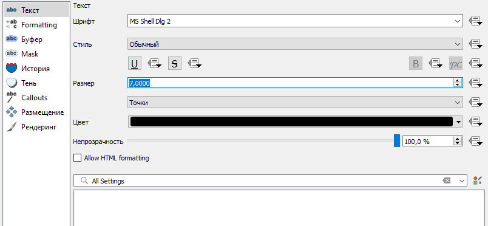

    > «Размер текста» в QGIS --- это кегль, или высота шрифта. Традиционно она измеряется в типографских пунктах (пт, *pt*), так же, как в текстовых редакторах типа Microsoft Word.

5.  Перейдите на вкладку «Буфер». Включите опцию **Показывать текстовый буфер** (*Draw text buffer*). Установите для буфера размер **0,6 миллиметра**.

    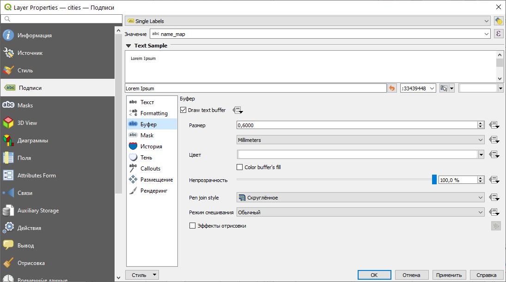

6.  На вкладке **Размещение** установите способ размещения значков **Картографический** (*Cartographic*) и расстояние **0,1 миллиметра** от границ символа (*From Symbol Bounds*)

    

7.  Примените изменения и закройте окно свойств слоя.

Результат будет выглядеть приблизительно так, как показано на рисунке ниже. Заметьте, что QGIS отрисовывает не все подписи, доступные в таблице атрибутов --- например, с высокой вероятностью не показывается подпись Москвы. Опции размещения подписей можно настраивать более детально, но это не входит в задачи этого упражнения.

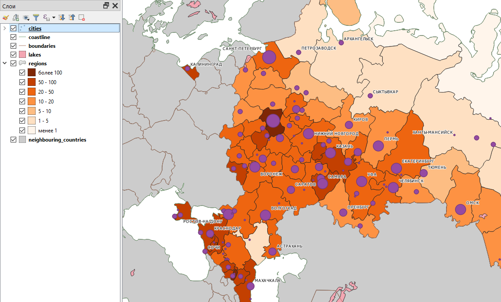

<kbd>**Снимок экрана №4.** Окно QGIS после добавления подписей</kbd>

## Настройка условных знаков географической основы {#map-design-population-basemap}

[В начало упражнения ⇡](#map-design-population)

Мы задали оформление слоям, отвечающим за тематическую нагрузку создаваемой карты. Теперь нам необходимо задать символику для всех остальных слоёв и расположить их в правильном порядке.

1.  Переименуйте оставшиеся слои:

    -   boundaries: **государственные границы**
    -   coastline: **береговая линия**
    -   lakes: **озёра**
    -   neighbouring_countries: **соседние страны**

2.  Расположите слои в следующем порядке:

    -   Людность городов
    -   береговая линия
    -   государственные границы
    -   озёра
    -   Плотность населения
    -   соседние страны

3.  Задайте для слоя береговой линии символ **simple blue line** и толщину **0,36**

    

4.  Задайте для слоя государственных границ символ **Residental road**

    

5.  Задайте для слоя озёр символ **topo water**

6.  Задайте для слоя соседних стран символ **gray 2 fill**

Результат обновления символики слоёв будет выглядеть приблизительно так:

## Создание макета карты {#map-design-population-layout}

[В начало упражнения ⇡](#map-design-population)

Макет (*Layout*) в QGIS -- это основной способ создания картографических изображений на основе визуализированных пространственных данных. Вы размещаете картографическое изображение на листе, добавляете зарамочное оформление (название, легенду, подпись масштаба и др.), и в заключение экспортируете результат в виде растровой или векторной графики.

> *Примечание:* в одном проекте QGIS может быть создано несколько макетов, использующих разные наборы слоёв.

1.  Измените охват картографического изображения в основном окне QGIS так, чтобы территория России умещалась в нём целиком.

2.  Создайте новый макет компоновки. Для этого нажмите `Ctrl+P`, воспользуйтесь пунктом меню **Проект** --- **Создать макет** или кнопкой 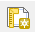 **Создать макет** на главной панели

3.  QGIS попросит вас ввести название макета. Никаких ограничений на название не накладывается, вы можете использовать любое имя. Например, `%Фамилия%_карта_России`

4.  Когда вы введёте название макета и нажмёте ОК, откроется новое окно --- окно вёрстки макета:

    

    Белый прямоугольник, который вы видите в центре окна, обозначает страницу бумаги, на которой вы размещаете ваше изображение. Для добавления и редактирования элементов макета используется **Панель инструментов** (см. рисунок ниже). Она может быть размещена горизонтально или вертикально.

    

5.  Добавьте картографическое изображение на макет. Нажмите кнопку **Добавить Карта** на Панели инструментов или выберите аналогичную опцию из меню **Добавить объект**. Затем установите курсор на то место страницы, где вы хотите поместить северо-западный (верхний левый) угол карты. Зажмите левую кнопку мыши и ведите курсор к месту, где должен располагаться юго-восточный (нижний правый) угол карты. Доведя курсор до этого места, отпустите левую кнопку мыши. Результат должен выглядеть приблизительно так, как показано на рисунке ниже:

    

    Обратите внимание, что размер картографического изображения меньше размера страницы. Это сделано специально: мы оставляем поля для печати. Несколько позже вы ещё немного уменьшите размер изображения, чтобы разместить на листе название карты, легенду, масштабную линейку и другую необходимую информацию.

    > Примечание: перевод QGIS на русский язык всё ещё оставляет желать лучшего. В некоторых случаях ошибки незначительны (как, например, с названием опции «Добавить Карта»), но иногда неправильный перевод может сбить с толку.

6.  Следущие несколько шагов будут посвящены настройке сетки координат для карты. Чтобы начать настройку, найдите панель **Свойства элемента**, а в ней --- вкладку **Сетки**

    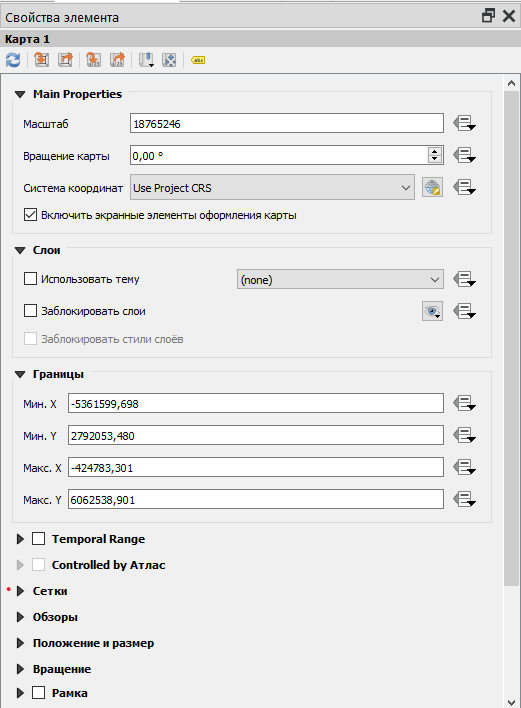

7.  Разверните вкладку **Сетки** и нажмите на кнопку **Добавить сетку**. Обратите внимание, что к одному картографическому изображению можно добавить несколько сеток, присвоив им разные имена. Сейчас мы этого делать не будем, нам достаточно одной сетки географических координат.

    

8.  Нажмите на кнопку **Modify Grid...**, чтобы перейти к настройкам сетки

9.  В открывшейся панели измените значения следующих параметров:

    Внешний вид:

    -   **Система координат:** установите систему координат WGS 1984 (EPSG:4326)
    -   **Интервал по X (долготе):** 30
    -   **Интервал по Y (широте):** 15
    -   **Стиль линии:** используйте существующий стиль, но уменьшите толщину линии до 0,15 мм

    Рамка:

    -   **Вид рамки:** Exterior ticks (внешние метки)
    -   Отображать слева и справа только широту (latitude only)
    -   Отображать сверху и снизу только метки долготы (longitude only)

    Координаты:

    -   Включить опцию **Draw Coordinates** (**Показывать координаты**)
    -   **Формат:** Decimal with Suffix (десятичные дроби с меткой направления)
    -   Показывать слева и справа только подписи широты
    -   Показывать снизу и сверху только подписи долготы
    -   **Точность координат:** 0 (*эта настройка отвечает за число знаков после запятой*)

10. Вернитесь в «Свойства элемента» и найдите настройку «Фон» (англ. *Background*, неправиильно переведено как «история»). Измените фон картографического изображения на светло-голубой. Таким образом вы сымитируете цветной фон морей и океанов.

    Результат будет выглядеть приблизительно так, как показано на рисунке ниже:

    

11. Добавьте легенду на макет. Нажмите кнопку **Добавить Легенда**, а затем щёлкните левой кнопкой мыши возле северо-восточного угла карты. Нажмите ОК в появившемся окне настройки размера элемента. После добавления легенды макет будет выглядеть примерно так, как показано на рисунке ниже:

    

12. Выберите элемент легенды и перейдите в «Свойства элемента». Найдите пункт **Элементы легенды** (Legend Items). Этот пункт позволяет вам настраивать содержимое автоматически собираемой легенды.

13. Отключите опцию Auto Update. Выключая эту опцию, вы «разрываете связь» между основным окном QGIS и легендой. Теперь при любых изменениях в основной карте легенда не будет обновляться автоматически. С другой стороны, это даёт вам возможность редактировать содержимое легенды.

14. Удалите из легенды все элементы, кроме «Людность городов» и «Плотность населения».

15. Измените размер и положение элементов макета таким образом, чтобы и карта, и легенда помещались на листе и не перекрывали друг друга. Результат должен выглядеть приблизительно так, как показано на рисунке ниже:

    

16. Добавьте масштабную линейку на макет. Нажмите кнопку **Добавить Масштабная линейка** или воспользуйтесь аналогичной опцией из меню **Добавить Объект**. Разместите его под основным картографическим изображением.

17. Измените подпись единиц измерения масштабной линейки: вместо варианта «km», который используется по умолчанию, впишите «км»

18. Вставьте текстовые блоки: название карты и информацию об авторстве карты.

19. Если необходимо, измените размеры или взаимное расположение элементов, чтобы все они умещались на листе и не «прилипали» к его краям. Результат должен выглядеть приблизительно так, как показано на рисунке ниже:

    

20. Экспортируйте изображение в графический файл формата PNG. Для этого используйте кнопку  **Экспорт в изображение** или опцию меню **Макет**, имеющую такое же название. В настройках экспорта укажите целевое разрешение 300 точек на дюйм (dots per inch, dpi).
