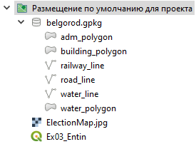
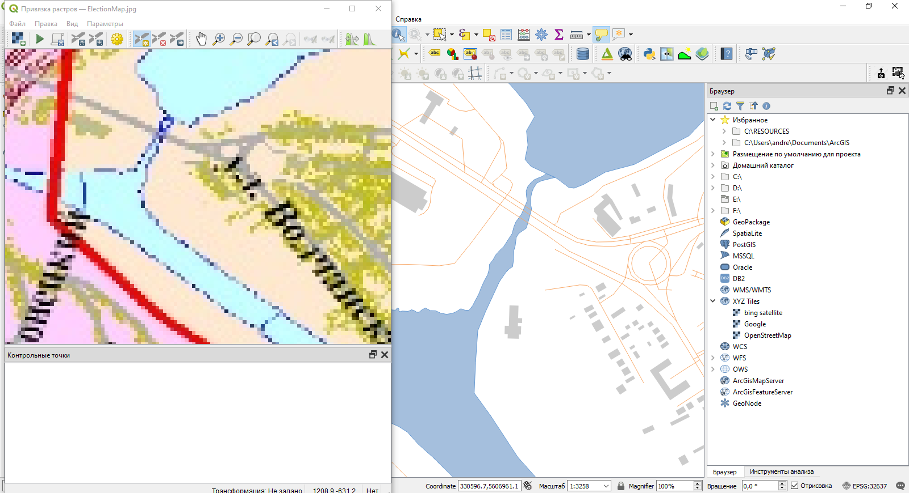
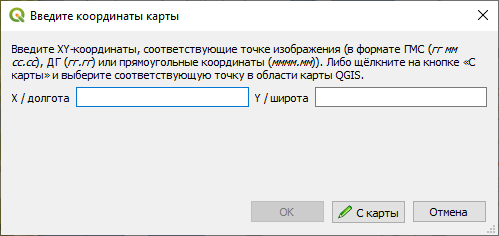
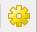
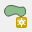
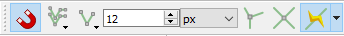
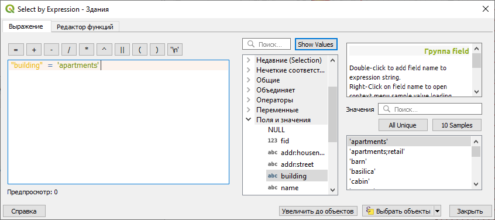
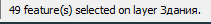
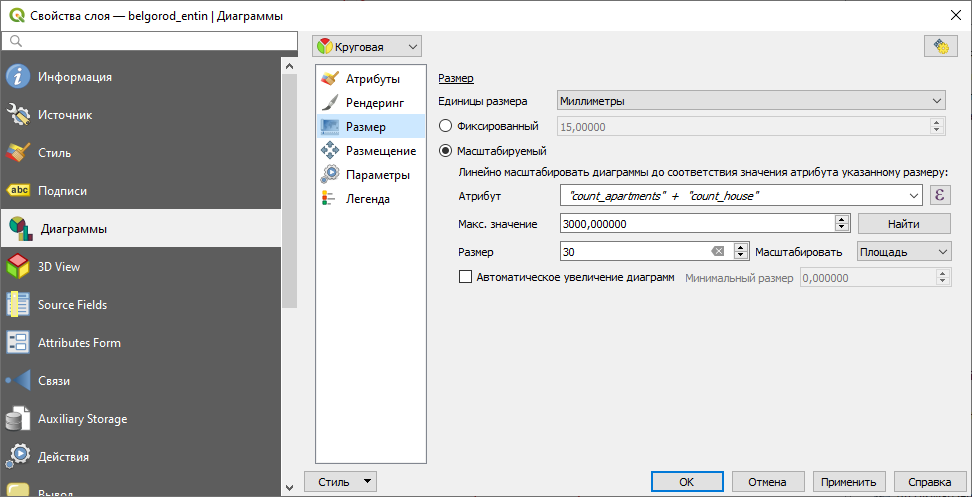
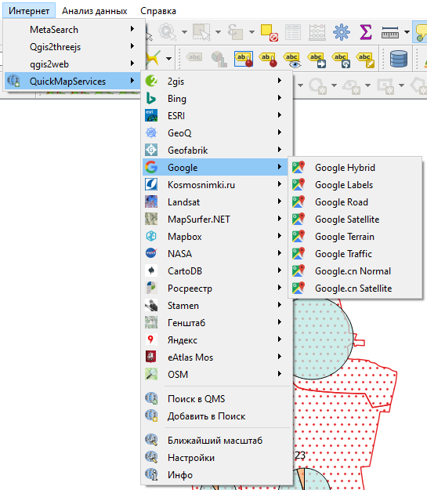

# Привязка и цифрование административной карты {#map-ref-districts}

[Архив с данными и файлом отчёта](https://1drv.ms/u/s!AmtmZDq3JgxHgZUEDiSdZeUQ-2U9dw?e=kBWcAM)

## Введение {#map-ref-districts-intro}

**Цель задания** — знакомство с привязкой, трансформированием и цифрованием геоизображений, элементами базовых технологий ГИС (оверлей, пространственные запросы).

**Необходимая теоретическая подготовка:** Системы координат и проекции карт, привязка геоизображений, трансформирование геоизображений, цифрование геоизображений. Методы трансформации: аффинное, проективное, полиномиальное, метод резинового листа (сплайны). Пространственные запросы, атрибутивные запросы, оверлей.

**Необходимая практическая подготовка:** Знание основных компонент интерфейса QGIS (менеджер источников данных, панель слоёв, фрейм карты, окно настройки компоновки). Добавление источников пространственных данных в проект. Настройка символики и подписей объектов. Создание макета, добавление карты и зарамочного оформления, экспорт макета.

**Исходные данные:** Cлои картографической основы OpenStreetMap, растровая карта избирательных округов г. Белгорода.

**Результат:** Набор пространственных данных с избирательными округами г. Белгорода и статистикой по застройке в пределах округов. Картодиаграммы по количеству домов и степени застроенности. Картографическое изображение.

### Контрольный лист {#map-ref-economic-control}

* Привязать растровую карту к опорным данным
* Создать класс избирательных округов путем цифрования растровой карты
* Добавить номера районов в таблицу атрибутов
* Определить (путем применения серии пространственных запросов) структуру застройки в каждом округе
* Построить картодиаграммы по полученным значениям
* Подготовить проект карты с компоновкой

## Добавление базовых данных {#map-ref-districts-basemap}
[В начало упражнения ⇡](#map-ref-districts)

1. Скачайте архив и распакуйте его в свою рабочую директорию. 

2. Создайте проект QGIS и сохраните его в распакованную папку (*Ex05_RefAdm*) в своей рабочей директории.

3. В менеджере источников данных найдите расположение проекта и разверните содержимое базы `belgorod.gpkg`.

    
    
    >Формат [GeoPackage](http://www.geopackage.org/) был предложен в середине 2010-х как открытая [альтернатива существующим форматам](https://imgs.xkcd.com/comics/standards.png) хранения пространственных данных: [шейп-файлу](http://switchfromshapefile.org/#shapefileisbad) и базам геоданных ESRI. GeoPackage представляет собой базу данных SQLite, внутри которой содержатся таблицы с данными и таблицы с метаданными. Такой подход аналогичен базе геоданных ESRI. Однако, в отличие от базы геоданных и от шейп-файлов, GeoPackage хранит всю необходимую информацию в одном файле (*.gpkg). Это позиционируется как одно из главных преимуществ формата.

4. Добавьте на карту все наборы из базы `belgorod.gpkg`.

    >*Примечание: проще всего сделать это через менеджер источников данных. Другой вариант — перетащить файл из окна системного файлового менеджера.* 
    
5. Разместите слои в следующем порядке и настройте их символику:

    - **железные дороги:** тёмно-серые линии толщиной 0,4 мм;
    - **автодороги:** светло-оранжевые линии толщиной 0,26 мм;
    - **здания и сооружения:** заливка светло-серого цвета без обводки;
    - **водоёмы:** используйте стиль `topo water`;
    - **водотоки:** синие линии толщиной 0,26 мм;
    - **административные границы:** иcпользуйте стиль `outline red`.
    
    Задайте слоям русскоязычные названия

6. Отобразите карту в охвате слоя границ.

    **Скриншот 1:** окно QGIS после завершения настройки символики
    
    **Вопрос 1:** какая система координат используется в проекте? Для чего обычно применяется эта система координат?
    
## Привязка карты {#map-ref-districts-referencing}
[В начало упражнения ⇡](#map-ref-districts)

1. Для привязки растров в QGIS имеется модуль «Привязка растров (GDAL)». Чтобы запустить его, выберите «Растр» — «Привязка растров...». Откроется окно модуля привязки.

    >Примечание: Если в меню «Растр» нет нужного пункта, следует зайти в меню «Модули» — «Управление модулями...» и в разделе «Установленные» включить модуль «Привязка растров (GDAL)». «Привязка растров» — модуль, который входит в ядро QGIS, он обязательно устанавливается вместе с основной программой.
    
2. В окне привязки нажмите кнопку «Открыть растр» и откройте файл `ElectionMap.jpg`, который находится в вашей рабочей директории. При загрузке QGIS попросит вас указать систему координат для добавляемого растра. Выбирайте ту же систему координат, которая используется в проекте.

3. Расположите окно модуля привязки таким образом, чтобы оно не закрывало основной фрейм карты. Выключите панели инструментов QGIS, если они вам мешают.

    
    
    Обратите внимание, что растровое изображение выглядит искажённым («сплюснутым») по сравнению с изображением в основном окне QGIS. Если вы откроете растр в какой-либо программе просмотра изображений, вы убедитесь, что растр действительно будто бы «сжат» по вертикали.
    
4. Перемещаясь по карте, найдите соответствующие точки на изображении и в основном окне QGIS

   
   
5. Используя инструмент «Добавить точку» в окне модуля привязки, установите первую точку на растровом изображении (щелчком левой кнопки мыши). QGIS выдаст запрос на ввод координат:

    
    
6. В некоторых случаях можно ввести координаты вручную, но нам будет проще «снять их с карты», то есть указать соответственную точку в основном окне QGIS. Нажмите кнопку «С карты». Окна модуля привязки при этом свернутся.

7. Щёлкните левой кнопкой мыше в соответствующей точке основного окна QGIS. Программа автоматически считает координаты точки и подставит их в форму:

    
    
8. Нажмите OK, чтобы добавить первую опорную точку.

    >Примечание: счёт опорных точек в QGIS начинается с нуля, поэтому первая точка получит индекс «0», вторая — «1» и так далее.
    
9. **Найдите и расставьте ещё 7-8 опорных точек.**. Точки должны быть равномерно распределены по полю карты и не находиться на одной линии. В качестве опорных точек лучше всего использовать пересечения автодорог и/или железных дорог. Кроме того, не следует использовать контура границ для расстановки опорных точек — в представленных материалах они не совпадают!

10. Откройте окно параметров трансформации  и ознакомьтесь с доступными параметрами трансформации.

    **Вопрос 2:** какие типы трансформации растра доступны в QGIS? В каких случаях они применяются? Сколько точек необходимо для осуществления каждого типа трансформации? 
    

11. Настройте параметры трансформации следующим образом:

    - **Тип трансформации:** Проективная;
    - **Метод интерполяции:** Ближайший сосед;
    - **Целевая система координат:** такая же, как СК проекта;
    - Остальные параметры оставьте по умолчанию
    - Обязательно включите опцию «Открыть результат в QGIS»
    
12. Нажмите ОК, чтобы закрыть окно параметров трансформации и сохранить изменения настроек.

13. Изучите таблицу опорных точек, которая отображается внизу окна модуля привязки. Если суммарная невязка для какой-либо точки превышает 0,5 пикселя, отключите её и добавьте новую точку. Не удаляйте отключённые точки!

    >Подсказка: чтобы легче было ориентироваться в опорных точках, можно включить отображение идентификаторов точек в настройках модуля привязки.

    **Вопрос 3:** Можно ли загружать и сохранять опорные точки привязки в QGIS? Если да, как это сделать?

14. Когда точность всех активных опорных точек составит меньше 1 пикселя, нажмите кнопку , чтобы запустить процесс привязки. В результате будет создан новый файл, который автоматически добавится в основное окно QGIS.

15. Изучите результат привязки. Если он устраивает вас, окно привязки можно закрывать. Если нет, удалите добавленный слой, вернитесь в окно привязки, внесите необходимые изменения и запустите привязку ещё раз.

    **Скриншот 2:** окно QGIS после завершения привязки.
    
## Создание слоя избирательных округов {#map-ref-districts-creation}
[В начало упражнения ⇡](#map-ref-districts)

1. Отключите все слои, кроме административных границ. Измените стиль слоя границ на `outline black`. Разместите привязанный растр в таблице слоёв под слоем административных границ.

    Мы готовы к тому, чтобы начать векторизовать («цифровать») контура избирательных округов. Но для этого нам нужен набор данных, в который мы будем сохранять создаваемые объекты. На следующем шаге мы создадим такой набор данных.
    
2. **Создайте новый набор данных GeoPackage**. Это можно сделать из панели источников данных, из меню «слой» или нажав комбинацию клавиш `Ctrl+Shift+N`. Откроется окно настройки нового слоя.

3. Заполните поля в открывшемся окне следующим образом:
    
    - **База данных:** сохраните файл `*.gpkg` в папку `Ex05_RefAdm`. Назовите его по шаблону `Belgorod_%фамилия%.gpkg`;
    - **Имя таблицы:** примите значение, предлагаемое по умолчанию после указания пути к базе;
    - **Тип геометрии:** _(определите самостоятельно)_
    - Чекбоксы «Include Z dimension» и «Include M values» оставьте выключенными;
    - **Система координат**: такая же, как система координат проекта.
    
4. Блоки *New Field* и *Fields List* предназначены для настройки таблицы атрибутов создаваемого набора данных. В блоке *New Field* вводится имя, тип и длина поля, по нажатию кнопки *Add to Fields list* создаваемое поле добавляется в список.
    
    Добавьте поле **district_id** целочисленного типа в список полей.
    
    не раскрывайте блок *Advanced Options*, они не интересуют нас в рамках этого упражнения.
    
    После применения всех настроек окно создания нового набора будет выглядеть аналогично представленному на экране:
    
    
    
5. Нажмите ОК, чтобы создать источник данных. Новый слой автоматически добавится в проект.  

    На следующих шагах вы будете создавать новые пространственные объекты в этом слое.

6. Измените стиль слоя на `pattern dot red`. Такая символика удобна для цифрования, поскольку позволит не «скрывать» растровый слой под созданными объектами.

7. Редактирование данных в ГИС по умолчанию «выключено». Чтобы получить возможность редактировать наборы данных, нужно включать специальный режим редактирования. В QGIS этот режим включается отдельно для каждого слоя. Чтобы включить режим редактирования, выберите слой, который вы собираетесь редактировать, в таблице слоёв и нажмите кнопку  на панели инструментов оцифровки.

8. Включив режим редактирования, нажмите кнопку «Добавить объект»  в панели инструментов оцифровки, чтобы добавить новый объект. Внешний вид и название этой кнопки будут отличаться в зависимости от типа геометрии слоя.
    
9. Включите панель инструментов прилипания, если она ещё не включена.

    
    
    >Примечание: прилипание (*snapping*, снеппинг) и его частный случай — трассировка (*tracing*) — исключительно важные функции программных средств ГИС. Они позволяют повторять контура уже существующих объектов при редактировании. Это не только ускоряет процесс, но и позволяет соблюдать специфические геоинформационные требования к топологии пространственных данных.
    
10. В панели инструментов прилипания:  
    
    * Включите прилипание;
    * Установите режим прилипания «к вершинам и сегментам»
    * Порог прилипания — не меньше 10 пикселей
    * Включите трассировку (*Tracing*)
    
    Эти настройки нужны, чтобы контура создаваемых вами объектов повторяли контура слоя административных границ, где это необходимо.
    
    Теперь вы готовы к тому, чтобы оцифровать свой первый контур. Ваша задача будет состоять в том, чтобы оцифровать границы избирательных округов в пределах одного из административных округов Белгорода (Западного или Восточного).
    
11. Увеличьте изображение таким образом, чтобы видеть избирательные округа возле южного сегмента границы двух административных округов. Нажмите левой кнопкой мыши на карте в месте, где проходит граница избирательного округа и не проходит граница административного округа. По нажатию левой кнопки мыши устанавливается положение первого узла создаваемого контура.

12. «Обходите» контур по часовой стрелке или против часовой стрелки, устанавливая новые узлы.  

    

    Не пугайтесь, если QGIS отобразит зелёный крестик поверх вашего контура — таким образом маркируются самопересечения.  

    Чтобы удалить последний введённый узел, нажмите `Backspace`. Чтобы сбросить контур целиком, нажмите `Esc`.

13. Дойдя до границы административных округов, установите новый узел на ней. Место установки узла автоматически притянется к границе.

    
    
14. Теперь переместите курсор вдоль границы. Наблюдайте за тем, как ориентируется контур создаваемого объекта. Установите следующий узел на границе подальше от точки касания.

    
    
15. Когда границы округов «разойдутся», снова нажимайте левую кнопку мыши, чтобы установить новый узел в желаемой точке.

16. Чтобы завершить редактирование, нажмите правую кнопку мыши. Откроется окно ввода атрибутов. Введите номер избирательного округа и нажмите ОК или Enter, чтобы применить изменения и закрыть окно ввода атрибутов.  

    Новый объект добавлен в слой и отображается на карте.
    
    >Примечание: неправильно введённый номер можно исправить в таблице атрибутов
    
17. Векторизуйте остальные объекты в пределах выделенной вам половины г. Белгорода. Следуйте границам административных округов и ранее оцифрованных объектах. При незначительных различиях в границах цифруйте по границам административных округов, если расхождения большие — цифруйте по границам избирательных округов.

18. Сохраните изменения в слое. Для этого нажмите кнопку «Сохранить правки»  на панели инструментов оцифровки. Не выключайте режим редактирования.

    >Примечание: сохранение правок в слое никак не сказывается на сохранении проекта и независимо от него. Вы можете сохранить проект, затем в другом проекте изменить один из наборов пространственных данных, затем вернуться в изначальный проект — и все изменения набора отобразятся в нём. На символику слоя это не повлияет.
    
19. Отключите растровый слой. Включите для набора данных об избирательных округах подписи по полю `district_id`. Настройки подписей задайте самостоятельно.

    **Скриншот 3:** оцифрованные контура избирательных округов.

## Расчет статистики по округам {#map-ref-districts-stats}
[В начало упражнения ⇡](#map-ref-districts)

В данной части работы предлагается определить количество зданий разных типов (жилые многоэтажки и частная застройка), которые попадают в пределы каждого округа, затем построить картодиаграммы по полученным значениям. Для этого будет использован следующий алгоритм:

* Выбрать округ на карте

* Выбрать здания, попадающие в его пределы (*пространственный запрос*).

* Из полученной выборки оставить только здания, принадлежащие к определённому типу (*атрибутивный запрос*).

* Записать число отобранных зданий в соответствующий атрибут текущего района.

Эти операции необходимо повторить для каждого округа.

1. Не выключая режим редактирования, откройте таблицу атрибутов слоя.

2. Нажмите кнопку «Добавить новое поле» или `Ctrl+W` на клавиатуре, чтобы добавить новый столбец в таблицу.

3. Добавьте два целочисленных поля: `count_apartments` и `count_house`. Эти поля будут служить для подсчёта (*count*) многоквартирных жилых домов (*apartments*) и частной застройки (*house*) соответственно.

4. Включите слой зданий.

4. **Выберите** первый созданный вами контур округа: выделите строку в таблице атрибутов или воспользуйтесь инструментом выборки в окне карты . Выделенный объект будет подсвечен жёлтым цветом на карте и синим — в таблице атрибутов.

5. Теперь выберите те объекты из слоя зданий, которые находятся внутри выбранного округа. Для этого запустите инструмент «Вектор» — «Выборка» — «Выделение по районам...». Используйте условие «находятся внутри» (*are within*). 

    
    
    Нажмите «Выполнить», чтобы выбрать объекты в слое зданий.
    
4. Имея выборку в слое зданий и не закрывая окно пространственного запроса («Выделение по районам...»), осуществите выборку по атрибутам. Для этого выберите в таблице слоёв слой зданий и нажмите кнопку «Выделить объекты, удовлетворяющие условию» . Откроется форма ввода атрибутивного запроса.

    >Атрибутивные запросы в ГИС, как правило, создаются с использованием диалектов языка [SQL](https://ru.wikipedia.org/wiki/SQL). Само выражение представляет собой только условие (*where clause*) и часто использует значения атрибутов.

5. Форма ввода атрибутивного запроса состоит из трёх частей. В левой части конструируется собственно запрос, средняя содержит список доступных переменных и функций, в правой отображается справочная и служебная информация.

6. В структуре тегов OpenStreetMap многоэтажные жилые дома обозначаются тегом `apartments`. После конвертации данных OpenStreetMap в реляционную базу данных соответствующий тег содержится в поле `buildings`.

    Мы должны **выбрать** в слое зданий те объекты, значение атрибута `buildings` которых задано как `apartments`.
    
7. Найдите в среднем поле группу «Поля и значения» и разверните её. Найдите поле «Building» и дважды щёлкните по нему левой кнопкой мыши. Поле будет добавлено в запрос, в нижней части окна появится пример результата запроса, а в правой части отобразится вспомогательная форма извлечения уникальных значений.

8. Введите знак `=` в поле конструирования запроса.

9. Нажмите кнопку *All Unique*, чтобы получить список уникальных значений, записанных в поле `building`.

10. Дважды щёлкните по записи `apartments` в списке уникальных значений. Она будет добавлена в конструктор запроса.

    После применения всех действий окно конструктора запроса будет выглядеть, как на рисунке ниже:
    
    
    
    **Вопрос 4:** Почему в нижней части окна отображается запись «Предпросмотр: 0»?
    
11. Мы сформулировали условие для выборки, однако нам нужно выбрать объекты не просто из слоя, а из уже существующей выборки. Для этого откройте выпадающий список кнопки «Выбрать объекты» и выберите функцию «Фильтровать текущее выделение»:

    
    
12. После применения фильтра появится всплывающее сообщение с числом выбранных объектов. Эта информация будет продублирована внизу окна QGIS:

    
    
13. Введите полученную цифру в таблицу атрибутов слоя избирательных округов.

14. Повторите выборку поочерёдно для каждого округа. Вводите получаемые значения в таблицу атрибутов. Не забывайте периодически сохранять изменения!

15. Теперь повторите выборку ещё раз, но уже не для многоквартирных домов, а для частных владений. Им соответствует запись `house` в поле `building`.

    **Вопрос 5:** вставьте в отчёт SQL-выражение для выбора частных владений.
    
    **Вопрос 6:** можно ли было делать выборку в другом порядке (т.е. сначала выборку по атрибутам, а затем — по пространственному положению)? Если да, то каковы были бы отличия процедуры?
    
16. Скопируйте таблицу атрибутов в любой табличный процессор (Microsoft Excel, Google Sheets, LibreOffice Calc). Для этого при помощи сочетания клавиш `Ctrl+A` выделите все записи в таблице, скопируйте при помощи `Ctrl+C` и вставьте записи без форматирования в табличный процессор при помощи `Ctrl+Shift+V`.

17. Удалите первый столбец (`wkt_geometry`).

18. **Скопируйте остальные столбцы и вставьте их в отчётный файл**.

## Построение картодиаграмм {#map-ref-districts-diagrams}
[В начало упражнения ⇡](#map-ref-districts)

Диаграммы в QGIS создаются как настройка отображения слоя. Однако соответствующий блок располагается не на вкладке «Стиль», как «обычные» условные знаки, а на отдельной вкладке «Диаграммы».

Инструменты создания диаграмм в QGIS пока ещё несовершенны и находятся в стадии активной разработки, поэтому, во-первых, некоторые настройки могут работать некорректно, во-вторых, в скором будущем возможно кардинальное изменение интерфейса настройки.

1. Откройте свойства слоя избирательных округов и перейдите на вкладку «Диаграммы». В верхнем левом углу включите отображение круговых диаграмм.

2. На вкладке «Атрибуты» добавьте атрибуты `count_apartments` и `count_house` в список включённых в диаграмму. Настройте мягкие, пастельные цвета для их отображения.

3. Вкладку «Рендеринг» установите для диаграмм настройку прозрачности (70 %)

4. На вкладке «Размер» измените способ задания размера с фиксированного на переменный («масштабируемый»).

    Изменение размера диаграмм в QGIS работает следующим образом. Пользователь задаёт максимальное значение показателя, который будет управлять размером диаграммы, и соответствующий ему максимальный диаметр диаграммы. Размер круга масштабируется пропорционально величине показателя. Из картографических соображений следует всегда выбирать масштабирование площади, а не линейного размера (диаметра).
    
    В качестве показателя можно использовать значение из какого-либо столбца таблицы атрибутов. Но можно и рассчитывать это значение непосредственно при визуализации. Мы воспользуемся вторым вариантом.
    
5. Нажмите кнопку со значком в виде буквы ε справа от поля «Атрибут». Откроется уже знакомое вам окно конструирования выражений.

6. Задайте выражение для суммирования значений полей `count_apartments` и `count_house`. Убедитесь, что расчёт выполняется кооректно (см. строку «Предпросмотр») и, если это так, нажмите OK.

7. Вернувшись в окно настройки диаграмм, нажмите кнопку «Найти» в строке «Максимальное значение», чтобы автоматически рассчитать максимальный результат выражения.

8. Округлите полученное значение в большую сторону до тысяч.

9. Установите максимальный размер диаграмм равным 30 (мм).

    В QGIS есть ещё одна полезная опция — увеличение размера диаграмм. Она применяется, если при масштабировании некоторые диаграммы становятся слишком малы. В таком случае их размер увеличивается до минимального (задаваемого пользователем) порогового значения.
    
    После установки всех параметров окно должно принять следующий вид:
    
    
    
10. Перейдите на вкладку «Легенда». Здесь вы настроите комбинацию условных знаков для отображения в легенде. Нажмите кнопку «Показать значки для размера диаграмм в легенде» (*Show Legend Entries for Diagram Size*).

11. Настройте отображение значков следующим образом:  
    * «Коллапсируйте» значки легенды;
    * В качестве символа используйте белый маркер круглой формы с тёмно-серой обводкой;
    * Задайте заголовок («Число домов»);
    * Задайте классы значков вручную: 100, 500, 1000, далее через 1000 до максимальной величины.
    
    Интерфейс настройки диаграммы должен принять приблизительно следующий вид:
    
    
    
    >**Важное замечание:** конечно, такой набор значков не является картографически корректным для создания легенды к абсолютной непрерывной шкале значков. По состоянию на `r Sys.Date()` ни один широко используемый ГИС-пакет не может сделать легенду к размерам кругов картодиаграммы согласно принятым картографическим правилам. Легенды к таким картам следует составлять или исправлять вручную.
    
## Использование базовых слоёв из сети Интернет {#map-ref-districts-wms}
[В начало упражнения ⇡](#map-ref-districts)

Большинство современных программных средств ГИС даёт возможность использовать не только локальные данные, но и наборы, распространяемые через Интернет с использованием специальных протоколов (WMS, WFS, WCS и др.). В частности, таким способом можно добавлять в ваш проект базовые карты Google Maps, Яндекс.Карт и некоторых других сервисов.

Разработан удобный плагин, позволяющий вам получить доступ к этим источникам «в один клик». Он называется **QuickMapServices**.

1. Откройте меню управления подключаемыми модулями («Модули» — «Управление модулями...»), наберите в строке поиска `QuickMapServices` и установите найденный модуль.

    Установленный модуль будет доступен из выпадающего меню «Интернет»:
    
    

2. Откройте настройки модуля *QuickMapServices*, перейдите на вкладку «Загрузить сервисы» и нажмите «Получить дополнительные источники данных». В список доступных сервисов добавится ряд дополнительных источников.

    
    
3. Добавьте к проекту базовую карту OpenStreetMap Monochrome.

4. Расположите слой с избирательными округами поверх базовой карты. Все остальные слои отключите.

## Оформление итоговой схемы {#map-ref-districts-result}
[В начало упражнения ⇡](#map-ref-districts)

1. Создайте макет компоновки для оформления итоговой схемы. 

2. Добавьте карту к макету. Настройте оформление карты. Исходите из того, что ваша схема предназначена для вставки в отчёт: учтите ориентировку страницы, необходимость зарезервировать место под поля и др.
    
    В рамках этого упражнения не создавайте сетку координат, но добавьте рамку карты и отключите фон.
    
3. Добавьте легенду и настройте её.

4. Добавьте остальные необходимые элементы зарамочного оформления.

5. Оцените получившееся изображение. При необходимости вернитесь в основное окно QGIS и измените настройки оформления слоёв.

6. Экспортируйте схему с разрешением 96 точек на дюйм. Используйте опцию «Обрезать по содержимому».

    >Примечание: разрешение 96 точек на дюйм считается довольно низким для картографических целей. Изображения с таким разрешением не годятся для печати, но иногда могут быть пригодны для размещения в Интернете. ВЫ снижаете разрешение для того, чтобы сохранить читаемость базовой карты.
    
7. Вставьте итоговую схему в отчётный файл.
