# (PART) Редактирование данных в ГИС {-}

# Привязка графических материалов {#raster-reference}

[Архив с исходными данными](https://github.com/aentin/qgis-course/raw/master/files/Ex05.zip)

[Контрольный лист](https://github.com/aentin/qgis-course/raw/master/files/Ex05_%D0%BE%D1%82%D1%87%D1%91%D1%82.docx)

**Внимание! Ваш преподаватель может предоставить вам другие исходные данные для выполнения этого упражнения**: [листы топографической карты](https://drive.google.com/drive/folders/1-NtO7MSvw7uX3O3pzXaxT8Z2qvGk1PJM?usp=sharing){target='blank'}, [спутниковые снимки](https://drive.google.com/drive/folders/1-PNy4EK3vydNuTYxAqBZe-MEFqQdYPUx?usp=sharing){target='blank'}. При возникновении противоречий следуйте указаниям преподавателя!

## Введение {#raster-reference-intro}

**Цель задания** — знакомство с привязкой и трансформированием растровых геоизображений.

**Необходимая теоретическая подготовка:** Системы координат и проекции карт, привязка геоизображений, трансформирование геоизображений. Разграфка, номенклатура и проекция топографических карт. Методы трансформации: аффинное, проективное, полиномиальное, метод резинового листа.

**Необходимая практическая подготовка:** Знание основных компонент интерфейса QGIS (менеджер источников данных, панель слоёв, фрейм карты), умение выполнять масштабирование и перемещение по карте, определять координаты курсора.

**Исходные данные:** Растровые изображения листов топографических карт и тематических карт, сканированные космические снимки.

**Результат:** Привязанные и трансформированные растровые изображения, пригодные для непосредственно использования в ГИС.

**Аннотация:** Положение точки в пределах растрового изображения может быть определено во внутренней системе координат растра. В этой системе координаты отсчитываются от верхнего левого угла растра по направлению отсчёта строк и столбцов и измеряются, соответственно, в пикселах. Для работы в геоинформационных системах (ГИС) необходимо установить соответствие между внутренней системой координат растра и внешней (целевой) системой координат, применяемой в ГИС-проекте — иными словами, выполнить *привязку* растра. С точки зрения пользователя ГИС, привязка заключается в определении для некоторого числа точек двух пар координат: 1) пары координат во внутренней системе координат растра и 2) пары координат в целевой системе координат ГИС-проекта. Но если «внутренние» координаты могут быть легко определены, поскольку они непосредственно связаны непосредственно с растром, то целевые координаты необходимо узнавать отдельно. У некоторых видов растров — например, у топографических карт, — координатные метки с их численными значениями нанесены на само изображение в виде сеток географических или прямоугольных координат. У других — например, у космических снимков, — эту информацию нужно определять с привлечением дополнительных источников. 

Точки, используемые для привязки, должны равномерно покрывать всю площадь изображения (или по крайней мере ту его часть, которая будет использоваться в исследовании), а также не должны находиться на одной прямой.

Привязка растра часто сопровождается *трансформированием* растра. В ходе трансформирования растр пересчитывается в новую систему координат таким образом, что направления отсчёта строк и столбцов становятся параллельными осям координат целевой системы.

### Контрольный лист {#raster-reference-control}

* Определить систему координат для привязки
* Привязать сканированный лист карты по известным координатам точек
* Оценить точность привязки карты
* Привязать изображение путём интерактивного определения положения точек привязки
* Использовать базовые карты из сети Интернет для привязки

## Привязка растра по меткам координат {#raster-reference-input}
[В начало упражнения ⇡](#raster-reference)

1. Скачайте архив с исходными данными и распакуйте его в свою рабочую директорию.

2. Найдите в папке `raw_images` изображение `o38-085.tif`, откройте и изучите его в любой программе просмотра изображений. Это отсканированный лист топографической карты масштаба 1:100 000 на город Кинешма и его окрестности.
  
  >Топографические карты на территорию СССР составлялись в проекции Гаусса-Крюгера. Задание проекции позволяет ввести систему плоских прямоугольных координат — соответствующая сетка наносится на лист карты. Когда вы работаете с листом карты в бумажном виде, вы можете определить координаты любой точки, проведя несложные измерения относительно линий сетки, измерить расстояния, углы и площади. Использование ГИС значительно упрощает рутинные операции, поскольку все объекты в ГИС-проекте помещены в некоторую систему координат.
  
Для выполнения привязки нам нужно определить целевую систему координат, в которой следует привязать (соориентировать) исходный растр, а затем выбрать несколько пар точек, для которых известны и внутренние координаты (в системе координат растра), и целевые координаты (в целевой системе координат). Точки пересечения линий сетки прямоугольных координат хорошо подходят в этом качестве, поскольку их целевые координаты подписаны вдоль рамок карты.

### Определение целевой системы координат {#raster-reference-select-coordinate-system}

Привязка растра начинается с определения целевой системы координат. Сейчас мы работаем с топографической картой, изданной в 1990 г. в рамках системы топографического картографирования СССР. Топографические карты СССР составлялись в проекции Гаусса-Крюгера на основе датума СК-42, использующего эллипсоид Красовского, с разграфкой по 6-градусным зонам. Описание целевой системы координат должно включать все эти компоненты.

Для определения подходящих систем координат мы воспользуемся ресурсом [Spatialreference.org](https://spatialreference.org/).

1. Перейдите на сайт [Spatialreference.org](https://spatialreference.org/)

    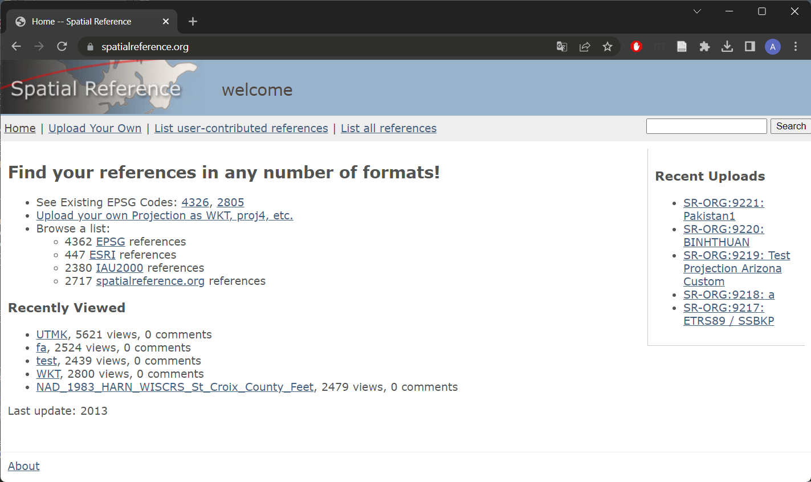

2. В правом верхнем углу в окне поиска введите `Pulkovo 1942 / Gauss-Kruger` и нажмите _Search_.

    > Примечание: датум СК-42 в англоязычной литературе обозначается как Pulkovo 1942.
    
    > Примечание: в описаниях систем координат орфография немецкого языка традиционно не соблюдается. Поэтому для поиска систем координат проекции Гаусса-Крюгера следует вводить именно `Gauss-Kruger`, а не `Gauss-Krüger` или `Gauss-Krueger`.
    
3. В открывшемся окне используйте кнопку _Next Page_, чтобы переходить на следующие страницы и найти системы координат, соответствующие нужной вам зоне.

    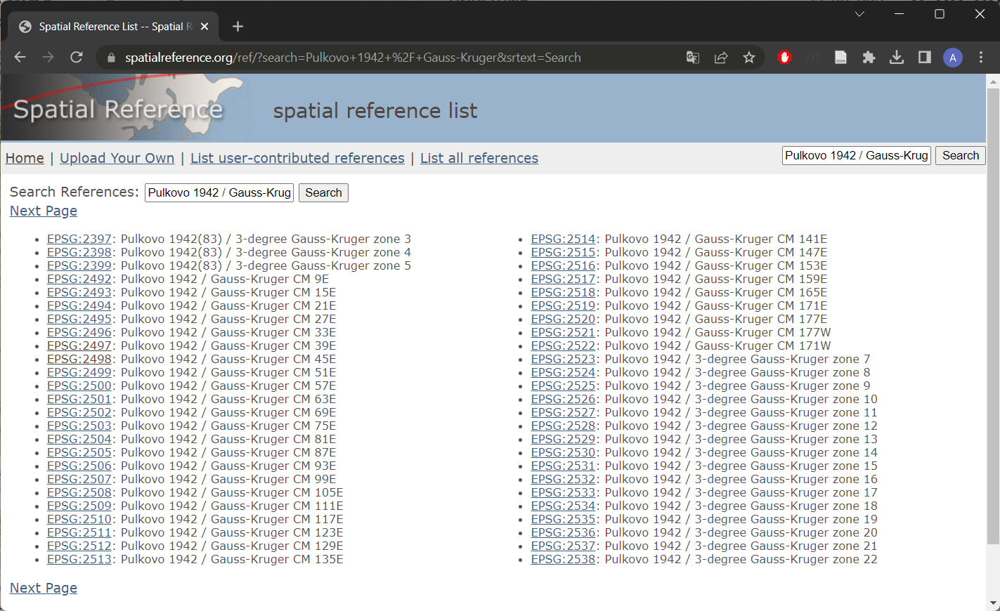
    
    Обратите внимание на три важных момента. Первое: для вашего листа карты подходит несколько разных систем координат. Второе: название соответствующей системы координат не обязательно содержит номер зоны. Вместо номера зоны может быть указан средний меридиан зоны (*Central Meridian*, CM). Центральный меридиан для своего номера зоны вы можете определить самостоятельно, используя знания из курса топографии. Третье: среди описаний встречаются системы координат 3-градусных зон. Они тоже иногда используются, но ваша карта составлена на основе 6-градусной разграфки, поэтому 3-градусные зоны вам не подходят.
    
4. Найдя нужные системы координат, откройте страницу каждой из них в новой вкладке браузера.
    
```{r, echo = FALSE}
library(htmltools)

shiny::actionButton("show_table_button", 
                    label = "Показать подходящие описания проекций для листа карты o38-085.tif", 
                    onclick = "button_handler()")

div(id = "resultContainer", hidden = "true", HTML("EPSG:2498, EPSG:28408, EPSG:28468"))
```

```{js, echo = FALSE}
function button_handler() {
  document.getElementById('resultContainer').hidden = false;
}
```
   
   
    
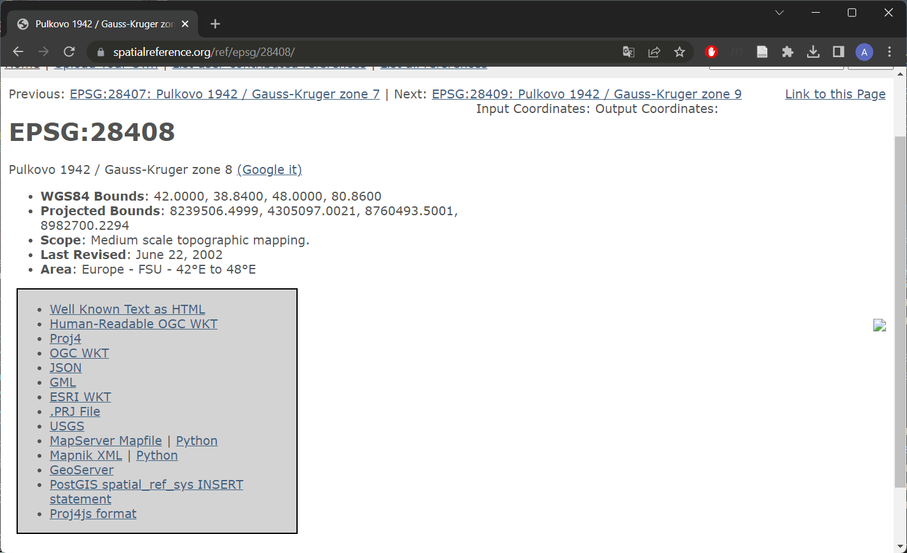

5. Определите, чем отличаются эти системы координат друг от друга. При необходимости посмотрите описания систем координат в форматах Proj4 или ESRI WKT.

6. Выберите подходящую систему координат для привязки.

    Прямоугольные координаты, подписываемые вдоль северной и южной рамок топографических карт СССР, формируются следующим образом. Берётся фактическое значение прямоугольной координаты, отсчитанное от среднего меридиана зоны, смещённого к востоку на 500 км (например, `348`). Слева к этому номеру приписывается номер зоны (например, `8`). Полученные числа (например, `8348`) обозначают координаты соответствующих линий сетки в километрах. Они подписываются целиком только в углах карты, а в остальных случаях пишется только последние две цифры числа (например, `48`). При описании таких координат в ГИС-среде может использоваться как полная форма записи, включающая номер зоны, так и сокращённая (англ. *truncated*) форма записи, не включающая номер зоны. Отличия между вариантами будут заключаться в единственном параметре: смещении координаты X (`x_0` в Proj4, `false easting` в WKT). На наш взгляд, удобнее пользоваться полной формой записи.
    
    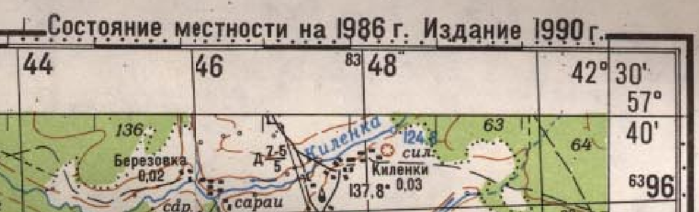


### Привязка листа топографической карты {#raster-reference-topomap}

1. Запустите QGIS и сохраните проект в вашу рабочую директорию

2. В QGIS запустите инструмент для привязки растров («Слой» — «Геопривязка...»)

    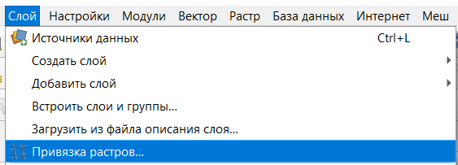

3. Перед началом процедуры привязки включите подписи идентификаторов точек. Для этого в окне привязки откройте меню «Параметры» — «Параметры геопривязки...» и отметьте опцию «Включить идентификаторы».

4. Добавьте файл `o38-085.tif` в окно инструмента привязки. Можно перетащить файл из проводника или воспользоваться  кнопкой  на панели инструментов

    

5. В окне привязки по умолчанию активен инструмент добавления опорных точек . С помощью мыши увеличьте изображение северо-западного угла карты, найдите пересечение линий сетки и определите его координаты.

6. Щёлкните левой кнопкой мыши по пересечению линий сетки, координаты которого вы определили. В появившемся окне введите координаты. Обратите внимание на следующие моменты:

  * В проекции Гаусса-Крюгера ось X считается направленной на север, ось Y — на восток. В QGIS и большинстве других геоинформационных программ ось X направлена на восток, ось Y — на север. 
  
  * Координаты, подписанные вдоль рамки карты, измеряются в километрах. Координаты, которые вам нужно ввести для привязки, должны быть измерены в метрах.
  
  * Непосредственно под формами ввода координат расположен выпадающий список, позволяющий выбрать систему координат. Убедитесь, что в этом поле выбрана нужная вам система координат. Если нужной вам системы координат нет в списке, нажмите кнопку 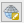 и отыщите нужную систему координат в окне выбора системы координат.

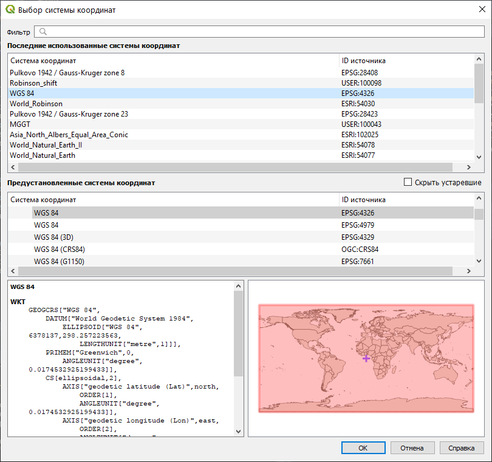
  
Сверьтесь с изображением ниже, чтобы убедиться, что вы всё делаете правильно:


В примере выше мы используем в качестве опорной точки перекрестия линий сетки прямоугольных координат. Однако на топографической карте есть также метки географических координат. Географические координаты подписаны у каждого угла рамки карты, а также у перекрестия в центре листа. Эти точки тоже можно использовать как опорные. Отличие от варианта с прямоугольными координатами состоит в том, что при установке опорных точек по географическим координатам в окне ввода координат точек необходимо выбрать географическую систему координат. Для отечественных топографических карт это система `Pulkovo 1942` (`EPSG: 4284`). Пример использования георгафических координат для привязки показан на рисунке ниже.

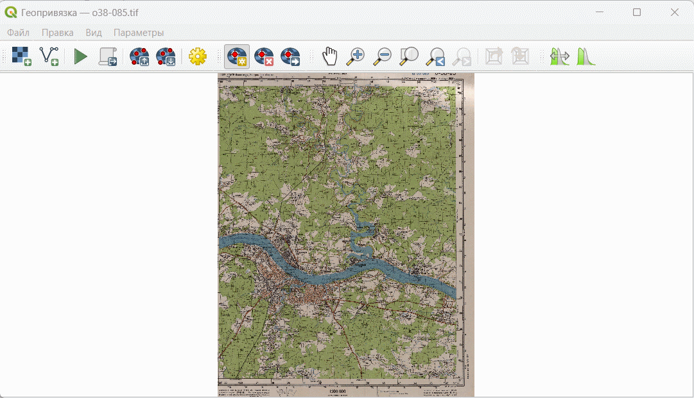

7. Аналогичным образом добавьте ещё четыре опорных точки. В итоге у вас должно получиться пять опорных точек: четыре в углах листа карты и одна в центре.

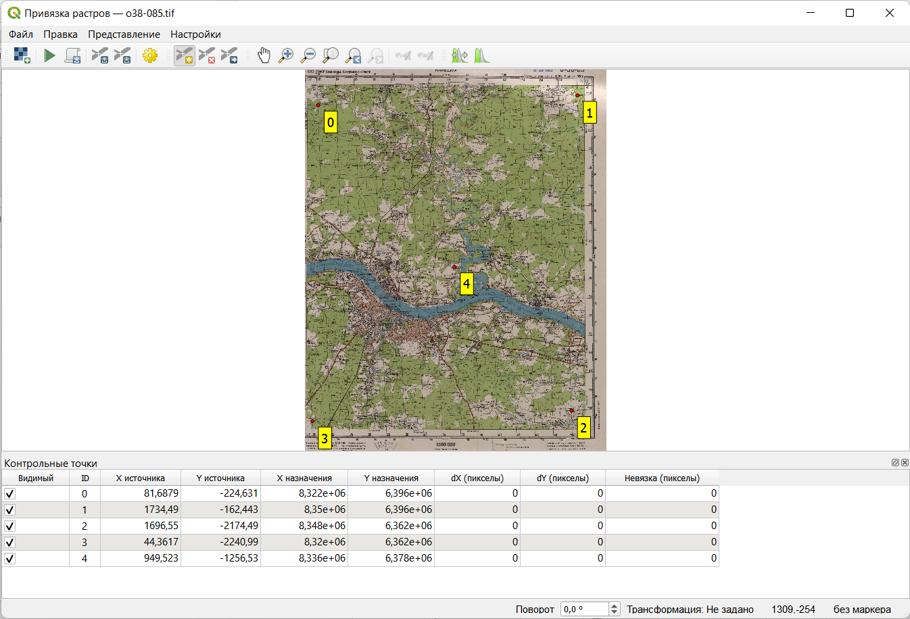

8. Изучите информацию, которая отображается в таблице внизу. «X источника» и «Y источника» — это координаты точек привязки на исходном растре, измеренные в пикселях растра от левого верхнего угла. «X назначения» и «Y назначения» — координаты на местности. В столбцах «dX», «dY» и «Невязка» будут отображаться несхождения в определении координат. Сейчас там отображаются нули, поскольку мы ещё не задали настройки трансформации.

9. Откройте интерфейс настроек трансформации растра, нажав на кнопку 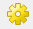. Изучите доступные параметры.

10. Самостоятельно определите значение параметра «Тип трансформации».

11. Параметр «Метод интерполяции» установите в значение «Линейная»

12. Установите целевую систему координат, которую вы определили в начале занятия. Выберите нужную систему координат по её названию или EPSG-коду.

13. Теперь, когда вы задали параметры привязки, нужно указать, куда будет сохранён привязанный файл. Это задаётся настройкой «Целевой растр». Укажите, что растр нужно сохранить в папку `referenced_images` вашей рабочей директории под именем `o38-085_modified.tif`. 

14. Также нужно отметить опции «Сохранить контрольные точки», чтобы сохранить пары координат в отдельный файл, и «Открыть результат в QGIS», чтобы резульат привязки был автоматически прикреплён к открытому проекту. Остальные параметры оставьте по умолчанию.

15. Закройте окно настроек привязки. Привязка не запустится автоматически: чтобы запустить процедуру, нужно нажать кнопку . Но пока не делайте этого. 

16. Изучите величины ошибок, которые отображаются в таблице внизу. Величины ошибок отображаются в пикселах исходного растра. Обычно в практике привязки стараются добиться, чтобы ошибка не превышала 0,5 пиксела (с рядом оговорок). В нашем же случае исходный картографический материал отсканирован с невысоким разрешением, и такой точности достичь не получится. Для учебного упражнения достаточно добиться точности порядка 1,5-2 пиксела. Если точность привязки какой-либо из ваших точек значительно превышает это пороговое значение, удалите точку и установите её заново.

17. Когда вы добьётесь приемлемых величин ошибки, сделайте снимок экрана и вставьте его в отчётный файл.

<kbd>В отчёт: снимок экрана №1 — окно привязки с топографической картой после расстановки опорных точек</kbd>

**Важно! Здесь и далее под «снимком экрана» понимается снимок всего экрана целиком. Если необходимо будет сделать изображение только части экрана, это будет прямо указано в инструкции**. 

18. Нажмите кнопку . QGIS выполнит привязку и попытается добавить изображение к карте. Если при этом появится всплывающее окно выбора параметров трансформации, нажмите ОК.

> Примечание: окно параметров трансформации, появившееся при добавлении, позволяет выбрать набор параметров перехода с датума на другой датум (в нашем случае — со старого отечественного датума СК-42 на стандартный в геоинформационных системах WGS 84). В большинстве случаев при выборе параметров можно использовать вариант, предлагаемый по умолчанию; подробное обсуждение вопросов преобразования датумов и связанных с этим проблем выходит за рамки нашего курса.


19. Закройте окно привязки растров. Окно QGIS примет вид, аналогичный представленному ниже:

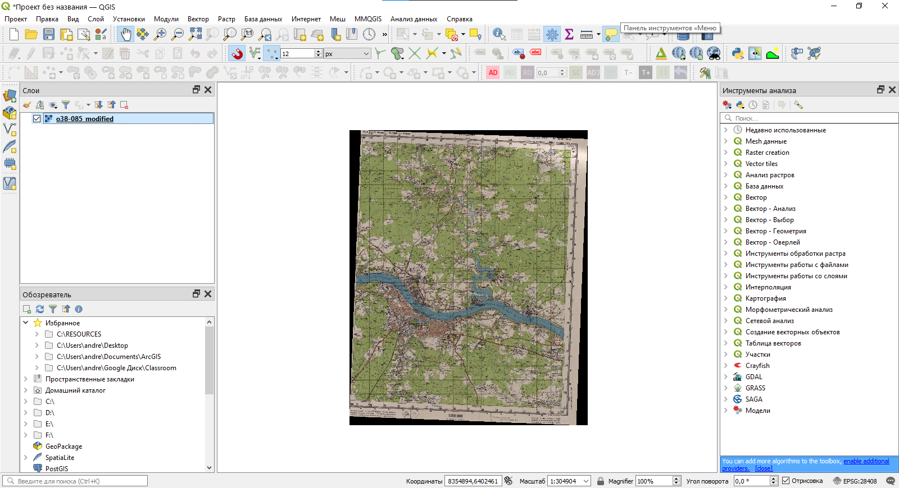

## Добавление базовой карты {#raster-reference-basemap}
[В начало упражнения ⇡](#raster-reference)

Вы успешно привязали растровое изображение топографической карты, и теперь можем определять координаты, измерять расстояния и площади по карте при помощи простого ГИС-инструментария. Однако наша карта пока «висит в воздухе». Давайте сравним её с изображением какой-нибудь популярной Интернет-карты, например, Google Maps или OpenStreetMap.

Базовые карты из сети интернет могут быть загружены в настольный ГИС-пакет с использованием протокола WMS, WFS или аналогичных. На базовом уровне знакомства с ГИС нас не интересуют технические подробности реализации, поэтому мы воспользуемся простым инструментом загрузки — подключаемым модулем (плагином) **QuickMapService.** Он позволяет добавлять многие карты из сети интернет «в один клик».

1. Модуль **QuickMapService** не включается в базовую поставку QGIS, его нужно установить отдельно. Для этого откройте меню «Модули» — «Управление и установка модулей...». Дождитесь, пока сведения о модулях загрузятся.

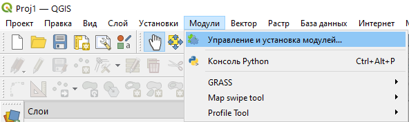

2. В открывшемся окне управления модулями начните вводить `QuickMap` в строке поиска. Модули будут отфильтрованы по названию.

3. Выберите модуль QuickMapServices в списке и нажмите кнопку «Установить» внизу окна. Дождитесь, пока модуль загрузится и установится.


4. После установки модуля его инструменты появляются в меню «Интернет» — «QuickMapServices». По умолчанию доступно небольшое число источников, но его можно увеличить. Для этого перейдите в настройки модуля и на вкладке «Загрузить сервисы» нажмите «Получить дополнительные источники данных». Подождите, пока дополнительные источники будут добавлены к модулю, и закройте настройки


5. Теперь вы можете добавить какую-нибудь базовую карту из сети Интернет, просто выбрав её в списке. Добавьте карты Google в проект.

6. Включая и отключая изображение топографической карты в панели слоёв, оцените, насколько хорошо она ложится на базовую карту Google.

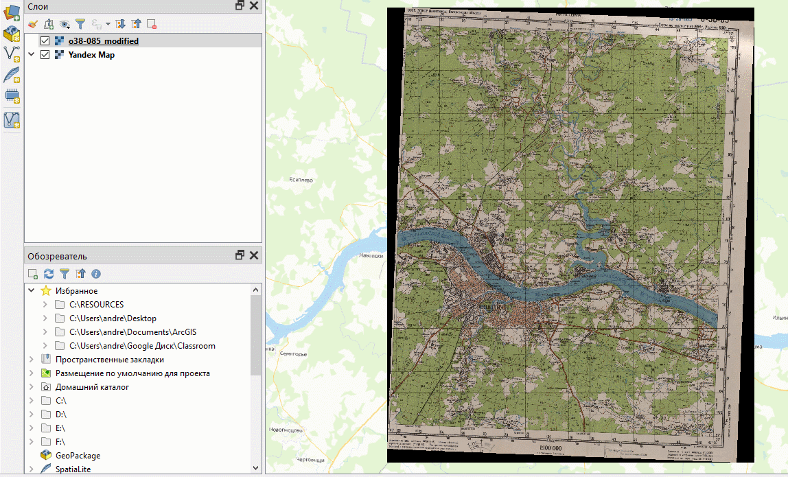

  >Для любознательных: обратите внимание на настройки прозрачности слоёв, а также на подключаемый модуль MapSwipe Tool.

7. Удалите из проекта карту Google и загрузите любую другую базовую карту на ваш выбор.

8. Уберите чёрные рамки вокруг привязанного изображения. Чтобы это сделать, можно воспользоваться следующим способом. Откройте настройки слоя привязанного снимка, перейдите на вкладку «Прозрачность» и введите дополнительное значение «нет данных», равное 0. QGIS будет воспринимать пиксели изображения, имеющие нулевую яркость, как «нет данных», и скроет их при визуализации.

9. Сохраните проект и сделайте снимок экрана.

<kbd>В отчёт: снимок экрана №2 — привязанная топографическая карта на фоне базовой карты из Интернета</kbd>.

10. Закройте проект QGIS.

## Использование координат с базовой карты {#raster-reference-frommap}
[В начало упражнения ⇡](#raster-reference)

Топографические карты — удобный материал для привязки, поскольку нужные системы координат известны, а точные значения координат нанесены непосредственно на карту. Однако в большинстве случаев привязка требуется таким материалам, у которых ни система координат, ни точные их значения не известны заранее — например, архивные аэрофотоснимки и космические снимки. В таком случае придётся не вводить координаты вручную, а считывать их значения из окна карты, используя в качестве опоры какой-либо материал, уже представленный в целевой системе координат.

1. Создайте новый проект QGIS и сохраните его в вашу рабочую директорию.

2. добавьте к новому проекту в качестве базовой карты любое покрытие космических снимков (например, Google Satellite). Обратите внимание, как изменилась система координат проекта.

3. Переместитесь по карте на юг Российской Федерации, в окрестности города Махачкала

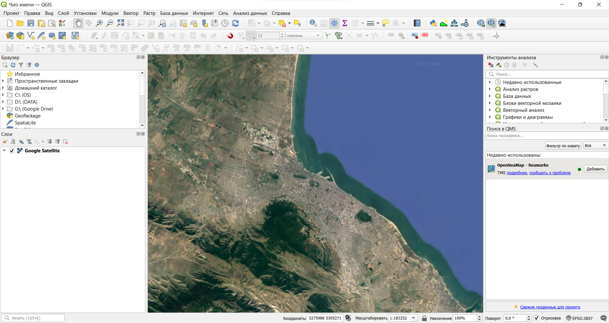

3. Откройте модуль привязки и загрузите в него изображение `DS1023-2087DF131_b_crop.tif`. Это фрагмент космического снимка, полученного в середине 1960-х со спутника системы CORONA (программа Keyhole).

    >Подробнее о спутниках CORONA и программе Keyhole вы можете прочитать по [этой ссылке](https://www.usgs.gov/centers/eros/science/usgs-eros-archive-declassified-data-declassified-satellite-imagery-1).
    
У отдельных снимков со спутников CORONA нет «собственной» внешней системы координат, мы привязываем снимок и одновременно трансформируем его в целевую систему координат, определяемую базовой картой привязки.

5. Изображение на космическом снимке повёрнуто относительно изображения базовой карты. Чтобы облегчить опознавание опорных точек, мы можем повернуть изображение в основном окне QIGS. Для этого найдите в нижней правой части окна QGIS настройку «Угол поворота» и введите значение `30`.

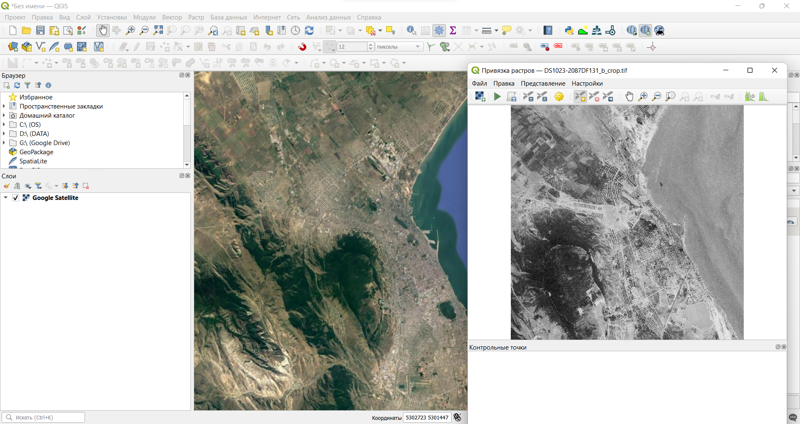

6. Начните расстановку контрольных точек. Установите первую точку нажатием левой кнопки мыши. Затем, когда появится окно ввода координат, не вводите координаты вручную, а нажмите кнопку «С карты». Окна привязки и ввода координат будут свёрнуты, давая возможность найти соответственную точку на карте. Найдя точку, кликните по ней левой кнопкой мыши. Координаты точки (в системе координат проекта) будут считаны с карты и подставлены в интерфейс ввода.


7. Введите таким образом координаты 15-20 точек. Следите, чтобы точки были равномерно распределены по площади снимка и не выстраивались в одну линию.

8. Настройте параметры привязки. Используйте полиномиальное преобразование 2-й степени. Такое преобразование иногда используется для космических снимков с сильными искажениями геометрии. Укажите, что изображение должно быть сохранено в папку `referenced_images` вашей рабочей директории.

9. Проверьте ошибки положения точек. Поскольку исходное изображение характеризуется высокой зашумленностью и «зернитостью», в этом упражнении не нужно добиваться высокой точности привязки. Ошибка порядка 7-10 пикселов может считаться приемлемой. Когда 

    
    
<kbd>В отчёт: снимок экрана №3 — окно привязки с космическим снимком после расстановки опорных точек</kbd>

10. Запустите привязку. Когда привязанное изображение добавится в проект, сравните его с базовой картой.

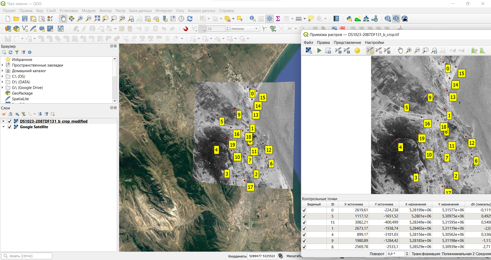

11. Если привязанное изображение хорошо согласуется с базовой картой, закройте окно привязки. Если вы видите заметные смещения каких-либо элементов на привязанном изображении относительно базовой карты, вернитесь в окно привязки и отредактируйте опорные точки, а затем снова выполните трансформацию изображения.

12. Верните угол поворота окна карты в исходное значение (0°) и увеличьте изображение до охвата космического снимка. Сделайте снимок экрана.

<kbd>В отчёт: снимок экрана №4 — привязанный космический снимок на фоне базовой карты из Интернета</kbd>.

14. Закройте проект QGIS

При привязке изображения к базовой карте следует соблюдать следующее правило: _детальность карты (снимка), используемого в качестве базы, должна быть выше («лучше»), чем детальность (разрешение) привязываемого изображения_. В нашем примере разрешение мозаики космических снимков Google в окрестностях Махачкалы составляет примерно 0,4–1 м, а наилучшее разрешение снимков CORONA — 6 футов, или около 1,8 м. Поэтому снимки Google можно использовать в качестве базовой карты для снимков CORONA. Другая ситуация может возникнуть в районах, не затронутых хозяйственной деятельностью человека. Мозаики снимков Google для таких районов создаются на основе снимков Landsat и Sentinel, имеющих наилучшее разрешение порядка 10–20 м, что гораздо грубее, чем разрешение снимков CORONA. Выполнять привязку по такой же схеме, как в этом упражнении, будет методически некорректным решением. Следует использовать другие базовые материалы для привязки.

## Оценка точности привязки {#raster-reference-accuracy}
[В начало упражнения ⇡](#raster-reference)

В реальных задачах бывает необходимо не только привязать растр, но и оценить точность привязки. Для этого часть опорных точек переводятся в класс контрольных. Эти точки не участвуют в вычислении параметров преобразования, поэтому по ним можно проверять абсолютную точность привязки.

1. Откройте проект, в котором вы работали с топографической картой.

2. Откройте окно привязки и снова загрузите в него исходное изображение топографической карты.

3. Загрузите опорные точки, которые вы использовали ранее для привязки этого листа карты (файл с расширением `*.points` в папке `referenced_images`).

4. Настройте параметры привязки: алгоритм привязки, алгоритм трансформации, систему координат и т.д.

5. Теперь добавьте ещё четыре опорные точки между «угловыми» и «центральной».

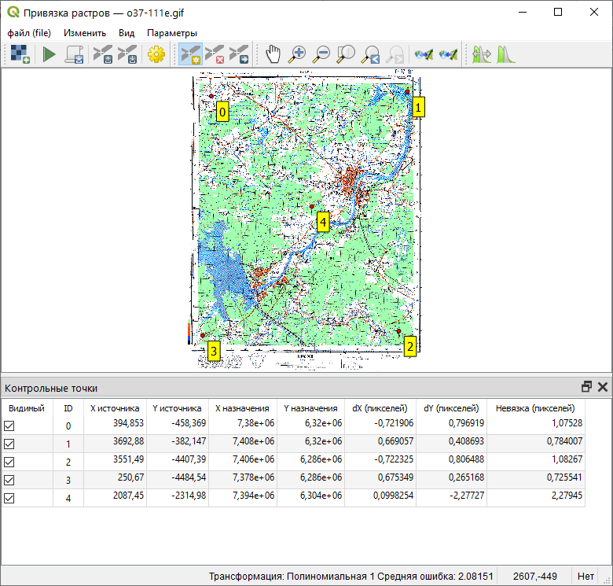

5. Когда вы добавите дополнительные точки, отключите их: снимите галочки в таблице возле их названий. Отключённые опорные точки перейдут в разряд **контрольных**: они не будут использоваться для вычисления параметров преобразования, но разность между теоретическим и фактическим значением координат для них будет рассчитана.


6. Найдите максимальную ошибку привязки по контрольным точкам. Запишите её с точность до второго знака после запятой в отчётный файл.
  
  Обратите внимание, что величина ошибки измеряется в пикселах. Чтобы получить абсолютное значение, нам нужно умножить эту величину на размер пиксела на местности
  
7. Запустите привязку растра. Добавьте привязанный растр в проект QGIS, если это не произошло автоматически.

8. Откройте свойства добавленного растра и выясните (на вкладке «Информация»), каков размер его пикселя в целевой системе координат.

9. Рассчитайте максимальное значение абсолютной ошибки привязки (в метрах) и впишите это значение в отчётный файл.

10. Сохраните контрольные точки в новый файл и закройте проект QGIS.

## Интерактивная привязка растров на основе аффинного преобразования {#raster-reference-linear}
[В начало упражнения ⇡](#raster-reference)

В предыдущих разделах упражнения мы рассматривали привязку при помощи опорных точек. Но есть и другой способ, менее точный, но в ряде случаев более быстрый и удобный — интерактивная привязка (*freehand georeferencing*). Этот способ годится в следующих случаях: когда необходимо ввести в ГИС-проект эскизные материалы, выполненные с невысокой точностью («традиционная» привязка в этом сценарии практически неприменима), или если нужно привязать современные картографические материалы, для которых заранее известна система координат (например, схемы и планы, составленные на основе изображений из картографических веб-сервисов). В этом упражнении мы рассмотрим второй сценарий.

1. Изучите изображение `20_okrugov_27-04-2020_13-32-09.png`. Это изображение составлено на основе Яндекс.карт. Однако дизайн Яндекс.карт заметно поменялся с момента составления схемы.

2. Создайте новый проект QGIS и сохраните его в вашу рабочую директорию.

3. Добавьте в проект базовое покрытие Яндекс.карт. Если покрытие Яндекс.карт недоступно в выпадающем меню, включите панель «Поиск в QMS» и с помощью поиска найдите и добавьте нужное покрытие.

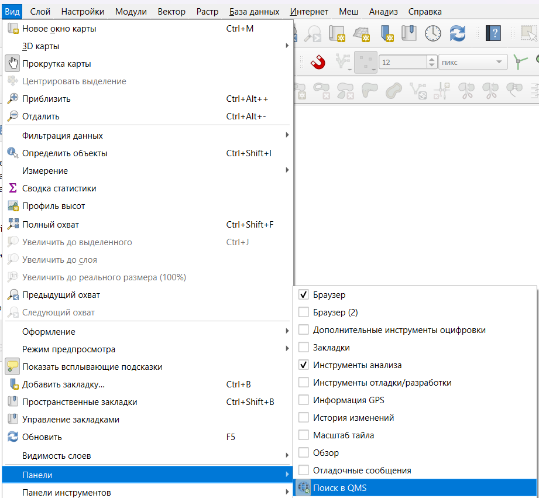
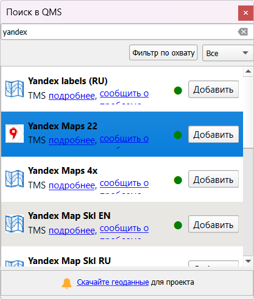

4. Установите модуль **Freehand raster georeferencer**. Панель инструментов модуля появится среди панелей QGIS:


5. Увеличьте изображение в окне QGIS таким образом, чтобы охват базовой карты, отображающейся в окне QGIS, примерно соответствовал охвату схемы избирательных округов. 


6. Нажмите кнопку «Add Raster for Interactive Georeferencing» . В открывшемся диалоговом окне с помощью кнопки «Browse...» укажите путь к файлу `20_okrugov_27-04-2020_13-32-09.png`, а затем нажмите «Add New». Полупрозрачное изображнение отобразится поверх базовой карты.

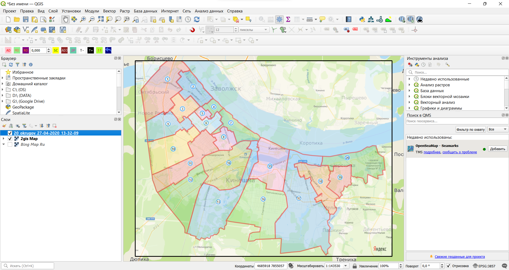.
    
7. Изучите опции преобразования растра, доступные на панели привязки. Попробуйте двигать, масштабировать и увеличивать/уменьшать изображение. Чтобы отменить последнее действие, нажмите кнопку **Undo** .
    
8. Верните растр в исходное положение и активируйте кнопку «Georeference raster with 2 points»  на панели инструментов интерактивной привязки. Будет активирован режим интерактивной привязки по двум точкам.

9. Опознайте на привязываемом растре и на основе какую-либо общую точку (например, характерный перекрёсток). Затем подведите курсор к этой точке на привязываемом растре, зажмите левую кнопку мыши и передвиньте курсор к той же точке на основе, как показано на изображении ниже:

    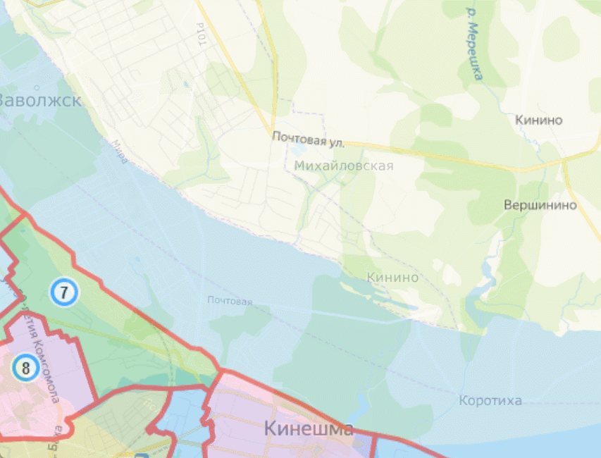.

10. Найдите ещё одну аналогичную пару точек и повторите действия, описанные в предыдущем пункте. Если всё сделано правильно, растр должен, насколько это возможно, совпасть с основой. Если этого не произошло, воспользуйтесь кнопкой Undo , а затем попробуйте ещё раз.

    .
 
11. Чтобы сохранить результат привязки, нажмите кнопку «Export Raster with World File» 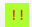. Сохраните результат привязки в папку `georeferenced_images`

12. Сделайте снимок экрана.

<kbd>В отчёт: снимок экрана №5 — привязанное изображение схемы избирательных округов</kbd>.

13. Закройте проект QGIS