# Векторизация карты избирательных округов {#digitizing-districts}

[Архив с данными и файлом отчёта](https://1drv.ms/u/s!AmtmZDq3JgxHgZtz3mcQqknItl3Gyw?e=TR90KB)

## Введение {#digitizing-intro}

**Цель задания** — знакомство с редактированием векторных пространственных данных, элементами базовых технологий ГИС (оверлей, пространственный запрос, атрибутивный запрос).

**Необходимая теоретическая подготовка:** Системы координат и проекции карт, привязка геоизображений, трансформирование геоизображений. Пространственные запросы, атрибутивные запросы, оверлей.

**Необходимая практическая подготовка:** Знание основных компонент интерфейса QGIS (менеджер источников данных, панель слоёв, фрейм карты). Добавление источников пространственных данных в проект. Настройка символики и подписей объектов. Создание макета, добавление карты и зарамочного оформления, экспорт макета.

**Исходные данные:** привязанная растровая карта избирательных округов г. Кинешма; набор пространственных данных о контурах зданий, созданный на основе базы OpenStreetMap

**Результат:** Набор пространственных данных с избирательными округами г. Кинешма и статистикой по застройке в пределах округов. Картодиаграммы по количеству домов и степени застроенности. Картографическое изображение.

### Контрольный лист {#digitizing-control}

* Создать набор пространственных данных об избирательных округах путем цифрования растровой карты
* Добавить номера районов в таблицу атрибутов
* Выполнить серию пространственных и атрибутивных запросов для определения структуры застройки в пределах избирательных округов
* Построить картодиаграммы по полученным значениям
* Подготовить проект карты с компоновкой

## Добавление базовых данных {#digitizing-basedata}
[В начало упражнения ⇡](#digitizingf-districts)

1. Для выполнения этого упражнения вам потребуется привязанный растр избирательных округов из [упражнения № 5](#raster-reference-linear). Выполните привязку этого растра, если вы не сделали её ранее.

2. Создайте в вашей рабочей директории каталог для хранения материалов проекта. Назовите его `Ex02`. Поместите привязанный растр в каталог. Поместите набор данных `kineshma_osm_buildings.gpkg` в этот же каталог.

3. Создайте новый проект QGIS и загрузите в него привязанный растр. 

4. Проверьте, что система координат растра и система координат проекта совпадают и соответствуют действительным. 

    **Важно:** если вы видите значок  напротив слоя растра в панели слоёв, это означает, что система координат растра не была корректно распознана. В таком случае вам нужно вручную установить систему координат слоя и систему координат проекта. Подсказка: система координат привязанного растра должна быть такой же, как система координат базовой карты, к которой вы привязывали растр (Яндекс.Карты).

<!-- EPSG:32638 -->

5. Сохраните проект QGIS в папку с данными проекта

<kbd>**Снимок экрана №1.** Окно QGIS с загруженным в него растровым изображением</kbd>.

## Создание набора пространственных данных {#digitizing-new-geopackage}
[В начало упражнения ⇡](#digitizingf-districts)

На этом этапе мы создадим новый векторный набор пространственных данных, в котором будут храниться контура избирательных округов. QGIS поддерживает множество форматов пространственных данных, выбор конкретного формата в каждом случае определяется задачами, требованиями и ограничениями проекта. В качестве формата по умолчанию в QGIS 3 используется [GeoPackage](https://www.geopackage.org/).

Файл GeoPackage представляет собой базу данных SQLite с дополнительными функциями для хранения наборов пространственных данных. Вся необходимая информация хранится в единственном файле `*.gpkg`; в процессе работы создаются временные файлы. В одном файле может быть сохранено несколько наборов пространственных данных (иногда их также называют «таблицами», *tables*, или «слоями», *layers*)

1. Запустите процедуру создания нового набора данных GeoPackage. Для этого нажмите кнопку  на панели менеджера источников данных или сочетание клавиш `Ctrl+Shift+N`.

2. В открывшемся окне введите следующие параметры:

    - **База данных:** сохраните файл `*.gpkg` в папку `Ex02` в вашей рабочей директории. Назовите его по шаблону `Kineshma_%Фамилия%.gpkg`;
    - **Имя таблицы:** примите значение, предлагаемое по умолчанию после указания пути к базе;
    - **Тип геометрии:** полигон
    - Чекбоксы «Include Z dimension» и «Include M values» оставьте выключенными;
    - **Система координат**: такая же, как система координат проекта.
    
3. Помимо геометрии объектов, нам нужно будет хранить семантическую информацию — номера избирательных округов. Создайте новое поле целочисленного типа с названием `district_id`, как показано на рисунке ниже

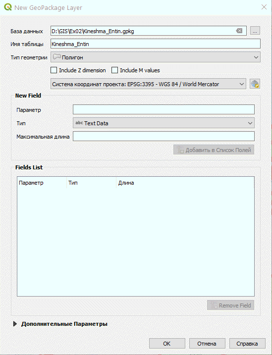

4. Проверьте правильность заполнения параметров. Если всё заполнено правильно, нажмите ОК. Новый слой будет добавлен в проект.

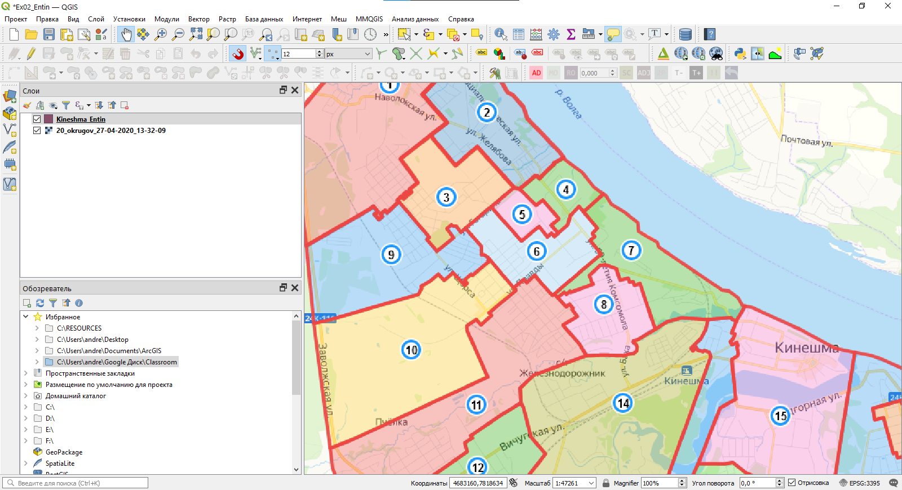

## Векторизация избирательных округов {#digitizing-drawing}
[В начало упражнения ⇡](#digitizingf-districts)

1. Измените стиль слоя на `pattern dot blue`. Эта символика будет удобна для цифрования, поскольку позволит не «скрывать» растровый слой под создаваемыми объектами и в то же время будет контрастно выделяться на их фоне.

2. Теперь всё готово к редактированию слоя. Режим редактирования запускается при помощи кнопки 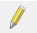 или из контекстного меню слоя. Запустите режим редактирования.

3. Когда режим редактирования запущен, нажмите кнопку , чтобы начать добавление нового объекта

4. Увеличьте изображение таким образом, чтобы видеть избирательные округа возле южного сегмента границы двух административных округов. Нажмите левой кнопкой мыши на карте в месте, где проходит граница избирательного округа и не проходит граница административного округа. По нажатию левой кнопки мыши устанавливается положение первого узла создаваемого контура. «Обходите» контур по часовой стрелке или против часовой стрелки, устанавливая новые узлы нажатием левой кнопки мыши, как показано на изображении ниже

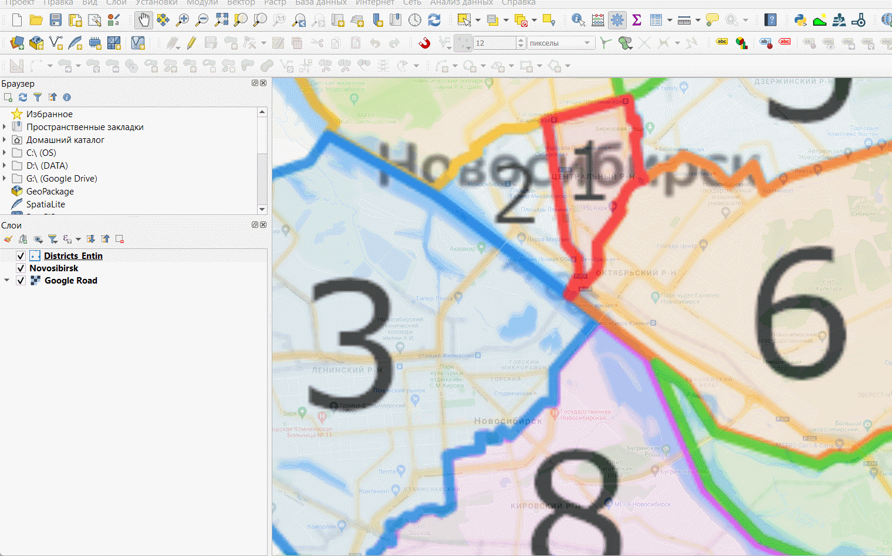
*Примечание: на этом изображении сегменты создаваемого объекта отрисовываются синим цветом. Когда вы начнёте создавать объект, те же линии у вас будут показаны тонкой красной линией — это настройка QGIS по умолчанию*

5. Чтобы завершить редактирование объекта, нажмите правую кнопку мыши.

6. Когда вы завершаете создание объекта в QGIS, появляется окно ввода значений атрибутов. Введите номер избирательного участка, как показано ниже

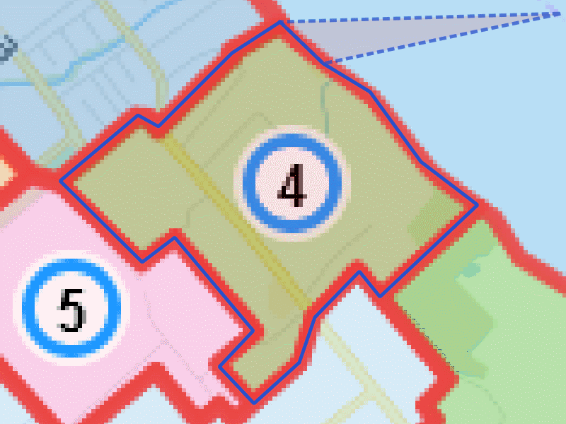

Когда вы создаёте пространственные объекты в ГИС, важно соблюдать топологию объектов. Координаты узлов соседних объектов должны совпадать, между объектами не должно быть пробелов и перекрытий. Чтобы добиться такого соответствия, вам необходимо активировать опцию прилипания (снеппинга). 

7. Найдите панель инструментов прилипания

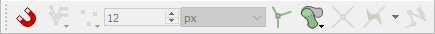

8. Включите режим прилипания, нажав на иконку с изображением магнита

9. Нажимая на соседние иконки в панели, включите прилипание к объектам во всех слоях, но только к вершинам объектов

10. Установите порог прилипания равным 12 пикселей экрана.

Теперь, если вы будете подводить курсор к существующим объектам, его положение будет автоматически «притягиваться» к ближайшим узлам

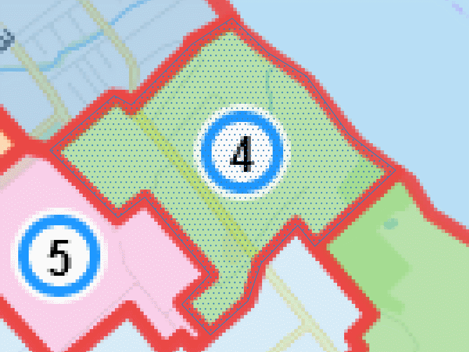

11. Прилипание позволяет реализовать создание новых объектов путём трассировки по существующим объектам. Включите режим трассировки, нажав на кнопку 

12. Оцифруйте соседний объект с помощью трассировки. Для этого подведите курсор к углу существующего объекта и установите первый узел. Затем переместите курсор вдоль общей границы и установите следующий узел. Промежуточные узлы будут добавлены автоматически. После оцифровки общей границы продолжайте векторизацию обычным способом.


13. После добавления нового объекта не забудьте внести его номер во всплывающем окне

14. Используя полученные навыки, оцифруйте все избирательные округа.

**Важно!** Время от времени сохраняйте ваши правки при помощи кнопки  на панели редактирования. В QGIS, как и во всех ГИС-пакетах, сохранение правок в данных выполняется отдельно от сохранения проекта.

Несколько советов по редактированию данных:

    - Чтобы отменить последний установленный узел, нажмите `Backspace`;
    - Чтобы полностью удалить последнюю оцифрованную фигуру, нажмите `Ctrl+Z`.
    - Чтобы изменить положение отдельного узла уже созданного объекта, можно воспользоваться инструментом редактирования узлов .
    - Трассировка в QGIS работает только тогда, когда весь путь трассировки отображается на экране. Если часть сегмента вылезла за пределы фрейма, трассировка не сработает.
    - Изучите панель «Дополнительные инструменты оцифровки» — она может вам пригодиться
    - Плавные кривые линии (берега, реки и т.п.) при цифровании обычно аппроксимируются ломаными линиями с относительно большим числом узлов — так, чтобы отличия не были визуально заметны. Хотя многие форматы данных позволяют создавать криволинейные объекты, этот подход не являются общепринятым.
    
18. По окончании цифрования объектов отключите растровый слой и отобразите данные в полном охвате. Сделайте снимок экрана.

<kbd>**Снимок экрана №2.** Окно QGIS с оцифрованными границами избирательных участков</kbd>.

## Пространственные и атрибутивные запросы {#digitizing-query}
[В начало упражнения ⇡](#digitizingf-districts)

В этой части работы вы оцените число жилых домов, оцифрованных пользователями ресурса [OpenStreetMap](https://www.openstreetmap.org/), в пределах избирательных участков. Волонтёрская географическая информация, к которой относится и OpenStreetMap, является важным источником данных для географических исследований благодаря своей детальности и относительной оперативности обновления, однако имеет ряд недостатков: неравномерное покрытие территории данными, низкая согласованность, структурированность и надёжность данных.

Для подсчёта числа зданий вы воспользуетесь следующим алгоритмом:

* Выбрать округ на карте

* Выбрать здания, попадающие в его пределы (*пространственный запрос*).

* Из полученной выборки оставить только здания, принадлежащие к определённому типу (*атрибутивный запрос*).

* Записать число отобранных зданий в соответствующий атрибут текущего района.

Операции повторяются для каждого округа.

1. Добавьте на карту набор данных о зданиях, который вы загрузили в начале занятия.

2. Откройте **таблицу атрибутов** слоя зданий. Для этого нажмите правой кнопкой мыши на слой в панели слоёв и выберите опцию «Открыть таблицу атрибутов» в контекстном меню.

>Таблица атрибутов — это представление базы данных в виде таблицы. В большинстве случаев работа с семантической информацией в ГИС выполняется через таблицу атрибутов.

Определите, какие значения атрибутов могут соответствовать жилым домам.

2. Закройте таблицу атрибутов слоя зданий и откройте таблицу атрибутов слоя избирательных округов.

2. Убедитесь, что для слоя избирательных участков включён режим редактирования.

3. В окне таблицы атрибутов слоя избирательных округов нажмите кнопку  или `Ctrl+W`, чтобы добавить новое поле, в которое будет записано число жилых домов для каждого избирательного участка. 

4. Добавьте поле с именем `number_of_houses` целочисленного типа.

На этом подготовительные операции закончены, мы переходим к запросам.

3. **Выберите** любой из округов: выделите строку в таблице атрибутов или воспользуйтесь инструментом выборки в окне карты . Выделенный объект будет подсвечен жёлтым цветом на карте и синим цветом в таблице атрибутов.


5. Теперь выберите те объекты из слоя зданий, которые находятся внутри выбранного округа. Для этого запустите инструмент «Вектор» — «Выборка» — «Выделение по районам...». Используйте условие «находятся внутри» (*are within*). Включите опцию «Использовать только выделенные объекты» для выбирающего слоя.

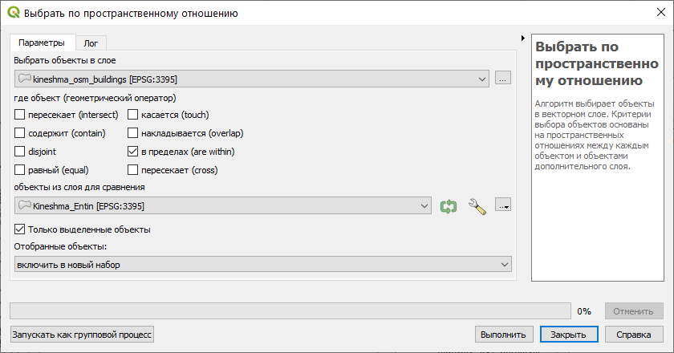
    
Нажмите «Выполнить», чтобы выбрать объекты в слое зданий.

6. Имея выборку в слое зданий и не закрывая окно пространственного запроса («Выделение по районам...»), осуществите выборку по атрибутам. Для этого выберите в таблице слоёв слой зданий и нажмите кнопку «Выделить объекты, удовлетворяющие условию» . Откроется форма ввода атрибутивного запроса.

>Атрибутивные запросы в ГИС, как правило, создаются с использованием диалектов языка [SQL](https://ru.wikipedia.org/wiki/SQL). Само выражение представляет собой только условие (*where clause*) и часто использует значения атрибутов.

Форма ввода атрибутивного запроса состоит из трёх частей. В левой части конструируется собственно запрос, средняя содержит список доступных переменных и функций, в правой отображается справочная и служебная информация. Сейчас вам нужно будет составить атрибутивный запрос, который позволит выбрать здания, являющиеся (с некоторой вероятностью) жилыми домами.

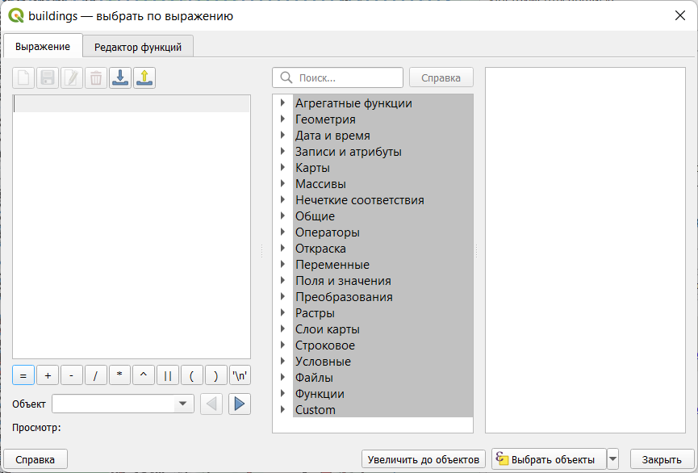

Атрибутивный запрос представляет собой логическое выражение, которое применяется к кортежу базы данных (строке таблицы). Результатом вычисления логического выражения является либо логическая 1 (ИСТИНА), либо логический 0 (ЛОЖЬ). В выборку попадают объекты, для которых при вычислении выражения получено значение 1.

В простейшем случае выражение состоит из проверки равенства. Например, выражение `"building" = 'house'` будет истинным для всех объектов, у которых в поле `building` записано значение `house`. Можно конструировать более сложные логические выражения с использованием операторов AND (И), OR (ИЛИ) и других. Например, выражение `"building" = 'house' AND "amenity" IS NOT NULL` будет истинным для объектов, у которых в поле `building` записано значение `house` и одновременно в поле `amenity` записано какое-либо значение, отличное от пустого (`NULL`). А запрос `"building" = 'garage' OR "building" = 'garages'` выберет из слоя зданий объекты, у которых в поле `building` записано значение `garage` или `garages`.

>Примечание 1: в QGIS названия полей обрамляются двойными кавычками ("), а строковые переменные — одинарными кавычками (')
>Примечание 2: в QGIS и в большинстве систем управления базами данных (СУБД) для работы с пустыми значениями (NULL) используются отдельные операторы. Например, выражение `"amenity" = NULL` будет воспринято как некорректное, вместо него следует писать `"amenity" IS NULL`

7. Составьте выражение, реализующее следующее условие:

  **Выбрать объекты, у которых атрибуту `building` присвоено значение `apartments` или `house`, а также объекты, у которых атрибуту `building` присвоено значение `yes`, но при этом не присвоено значение атрибута `amenity`.**
  
  Вводить выражение можно, пользуясь списком функций и полей в правой части окна. Двойной клик по полю или функции добавляет соответствующую запись в окно выражения 
  


  ```{r, echo = FALSE}
library(htmltools)

shiny::actionButton("show_table_button", 
                    label = "Показать выражение", 
                    onclick = "button_handler()")

div(id = "resultContainer", hidden = "true", HTML(" \"building\" = 'apartments' OR \"building\" = 'house' OR ( \"building\" =  'yes' AND  \"amenity\" IS NULL)"))
```

```{js, echo = FALSE}
function button_handler() {
  document.getElementById('resultContainer').hidden = false;
}
```

11. Мы сформулировали условие для выборки, однако нам нужно выбрать объекты не просто из слоя, а из уже существующей выборки. Для этого откройте выпадающий список кнопки «Выбрать объекты» и выберите функцию «Фильтровать текущее выделение»:


    
12. После применения фильтра появится всплывающее сообщение с числом выбранных объектов. Эта информация будет продублирована внизу окна QGIS:

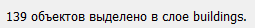
  
13. Введите полученную цифру в таблицу атрибутов слоя избирательных округов в строке, соответствующей выбранному объекту (подсвечена синим).

14. Теперь, не закрывая окна пространственного и атрибутивного запроса, выбирайте по очереди каждый следующий объект в слое границ избирательных округов и повторяйте для них шаги 3-13. Таким образом вы заполните весь столбец `number_of_houses` в таблице атрибутов. В процессе выполнения не забывайте периодически сохранять правки.

16. Скопируйте таблицу атрибутов в любой табличный процессор (Microsoft Excel, Google Sheets, LibreOffice Calc). Для этого при помощи сочетания клавиш `Ctrl+A` выделите все записи в таблице, скопируйте при помощи `Ctrl+C` и вставьте записи без форматирования в табличный процессор при помощи `Ctrl+Shift+V`.

17. Удалите столбец `wkt_geometry`, если он есть в вашей таблице. Скопируйте остальные столбцы и вставьте их в отчётный файл.

<kbd>**Таблица №1.** Таблица атрибутов слоя избирательных округов</kbd>.

18. Завершите редактирование слоя избирательных округов.

19. Отключите отображение слоя зданий.

## Визуализация слоя при помощи картодиаграмм {#digitizing-diagrams}
[В начало упражнения ⇡](#digitizing-districts)

Как вы уже знаете из курса картографии, не существует прямого взаимно-однозначного соответствия между способами изображения, принятыми в картографии, и способами визуализации данных в ГИС. Чтобы отобразить абсолютную величину в пределах единиц статистического учёта (или аналогичных контуров), в картографии применяют способ картодиаграмм. Для создания условных знаков, соответствующих способу картодиаграмм, в QGIS применяется вкладка «Диаграммы» в свойствах слоя.

1. Откройте свойства слоя избирательных округов и перейдите на вкладку «Диаграммы». По умолчанию отображение диаграмм отключено. Включите отображение круговых диаграмм, выбрав опцию Pie Chart из выпадающего списка вверху.

3. В настройках диаграмм перейдите на вкладку «Атрибуты». Добавьте атрибут `number_of_houses` к диаграмме. Задайте для него мягкий оттенок оранжевого или жёлтого цвета.

    >Примечание: вкладка «Атрибуты» нужна для настройки секторов круговых диаграмм. Если вы добавляете несколько атрибутов к диаграмме, программа автоматически рассчитывает размеры секторов для каждого объекта. Сейчас перед нами не стоит такая задача, так что, фактически, можно было не добавлять атрибуты или добавить любой другой.

4. На вкладке «Рендеринг» установите для диаграмм настройку прозрачности (70 %)

5. На вкладке «Размер» измените способ задания размера с фиксированного на переменный («масштабируемый»).

    >Изменение размера диаграмм в QGIS работает следующим образом. Пользователь задаёт максимальное значение показателя, который будет управлять размером диаграммы, и соответствующий ему максимальный диаметр диаграммы. Размер круга масштабируется пропорционально величине показателя. Из картографических соображений следует всегда выбирать масштабирование площади, а не линейного размера (диаметра).
  
6. В выпадающем списке «Атрибут» выберите нужный атрибут и нажмите кнопку «Найти, чтобы отобразить его максимальное значение. Оно будет отражено во вкладке «Макс. значение».


  
6. Округлите полученное максимальное значение в большую сторону до величины, кратной 50.

9. Установите максимальный размер диаграмм равным 14 (мм). Диаграмма такого диаметра будет соответстовать объекту с указанным максимальным значением атрибута.

    >В QGIS есть ещё одна полезная опция — увеличение размера диаграмм. Она применяется, если при масштабировании некоторые диаграммы становятся слишком малы. В таком случае их размер увеличивается до минимального (задаваемого пользователем) порогового значения. В этом упражнении она нам не требуется

10. Перейдите на вкладку «Размещение» и проверьте, что для ваших диаграмм указана опция размещения над центроидом.

10. Перейдите на вкладку «Легенда». Здесь вы настроите комбинацию условных знаков для отображения в легенде. Нажмите кнопку «Показать значки для размера диаграмм в легенде» (*Show Legend Entries for Diagram Size*).

11. Настройте отображение значков следующим образом:  
    * «Коллапсируйте» значки легенды;
    * В качестве символа используйте белый маркер круглой формы с тёмно-серой обводкой;
    * Задайте заголовок («Число домов»);
    
Интерфейс настройки диаграммы должен принять приблизительно следующий вид:
    

    
**Важное замечание:** конечно, такой набор значков не является картографически корректным для создания легенды к абсолютной непрерывной шкале значков. По состоянию на 28 февраля 2021 г. ни один широко используемый ГИС-пакет не может сделать легенду к размерам кругов картодиаграммы согласно принятым картографическим правилам. Легенды к таким картам следует составлять или исправлять вручную.

По окончанию настройки символов окно QGIS будет выглядеть следующим образом:

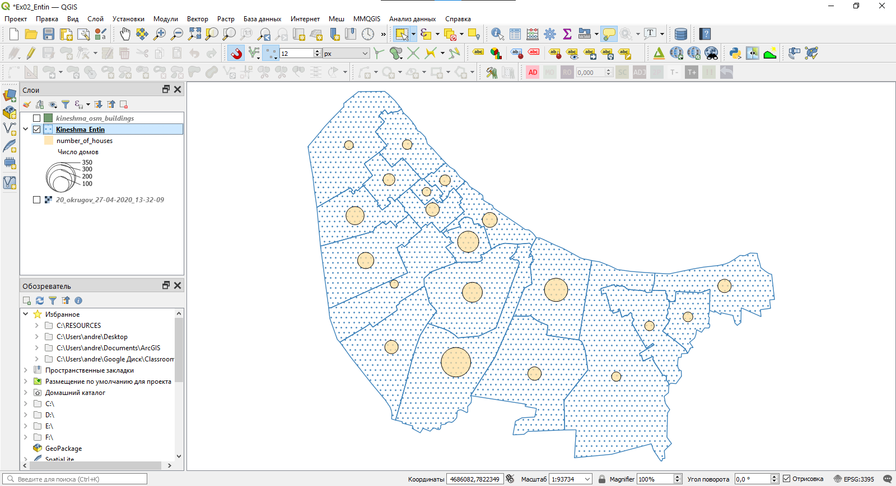

11. Добавьте базовую карту из сети Интернет. Самостоятельно решите, какую базовую карту использовать. Если вам покажется, что изображение базовой карты визуально «подавляет» слой избирательных округов, используйте настройки прозрачности. Сделайте снимок экрана.

<kbd>**Снимок экрана №3.** Окно QGIS с настроенной символикой</kbd>.

## Создание и экспорт макета компоновки {#digitizing-layout}
[В начало упражнения ⇡](#digitizing-districts)

Изображение, которое вы видите во фрейме данных, можно экспортировать «как есть» (с помощью опции «Проекты» — «Импорт/экспорт» — «Экспортировать карту как изображение...»). Однако для картографических целей, как правило, формируется **компоновка карты**. На листе заданного формата размещается картографическое изображение, добавляется название, легенда, масштабная линейка и элементы зарамочного оформления. 

Сейчас мы создадим макет компоновки с расчётом на то, что итоговая карта-схема будет вставлена в отчёт.

1. Создайте новый макет компоновки («Проект» — «Создать Макет...») или `Ctrl+P`. 

2. В качестве названия макета введите свою фамилию.

После ввода названия откроется окно компоновки (*Layout*)      

3. Измените ориентацию страницы с альбомной, предлагаемой по умолчанию, на портретную, соответствующую ориентации страниц отчёта. На изображении ниже показано, как это сделать.


4. Добавьте картографическое изображение (фрейм карты) на макет

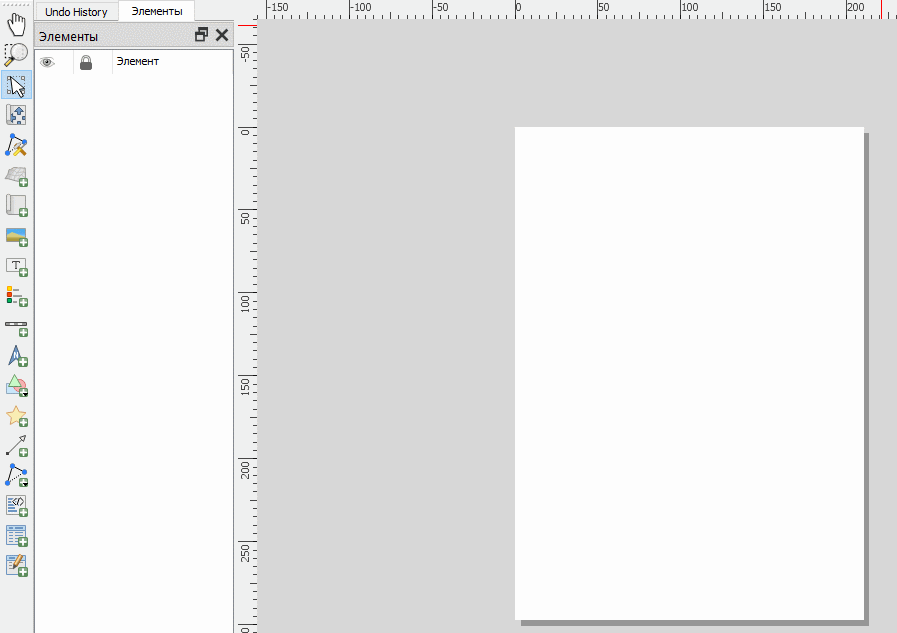

5. Измените положение и размер фрейма карты таким образом, чтобы на листе оставались поля: левое: 3 см, правое: 1,5 см.

6. Изменяя высоту фрейма, масштаб изображения, а также перемещая картографическое изображение внутри фрейма при помощи кнопки 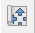 «Переместить содержимое элемента», добейтесь вида фрейма, аналогичного рисунку ниже:


7. Не закрывая окно макета, вернитесь в основное окно QGIS и переименуйте слой избирательных округов. Назовите его «Избирательные округа».

8. Добавьте на макет легенду с помощью кнопки . Поместите легенду в северо-восточном углу изображения.

9. Отключите автообновление легенды, чтобы удалить ненужные записи, как показано на рисунке ниже:


10. В свойствах элемента легенды найдите вкладку отступ и удалите (установите равным нулю) отступ под заголовком легенды.

11. Добавьте масштабную линейку с помощью кнопки . Разместите масштабную линейку в юго-западном углу изображения. При необходимости измените обозначение единиц измерения.

12. Экспортируйте карту-схему («Макет» — «Экспорт в Изображение» или кнопка 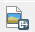) с разрешением 96 точек на дюйм (dpi). Используйте опцию «Обрезать по содержимому» (*Crop to Content*).

    >Примечание: разрешение 96 точек на дюйм считается довольно низким для картографических целей. Изображения с таким разрешением не годятся для печати, но иногда могут быть пригодны для размещения в Интернете. ВЫ снижаете разрешение для того, чтобы сохранить читаемость базовой карты.
    
13. Вставьте полученное изображение в отчётный файл.

14. Ответьте на контрольные вопросы в конце отчётного файла

