# Ручная векторизация растра {#digitizing-topomap}

[Архив с исходными данными](https://github.com/aentin/qgis-course/raw/master/files/Ex06.zip)

Контрольный лист: не требуется

**Внимание! Ваш преподаватель может предоставить вам другие исходные данные для выполнения этого упражнения или скорректировать его задачи**: [листы топографической карты](https://drive.google.com/drive/folders/1-NtO7MSvw7uX3O3pzXaxT8Z2qvGk1PJM?usp=sharing){target='blank'}. При возникновении противоречий следуйте указаниям преподавателя.

## Введение {#digitizing-topomap-intro}

**Цель задания** — освоение навыков создания векторных пространственных объектов разной геометрии путём векторизации растра.

**Необходимая теоретическая подготовка:** Концептуальные модели представления пространственной информации, модели пространственных данных, модели пространственных объектов. Векторная модель пространственных данных. Системы координат и проекции карт, привязка геоизображений, трансформирование геоизображений. Векторизация растра.

**Необходимая практическая подготовка:** Знание основных компонент интерфейса QGIS (менеджер источников данных, панель слоёв, фрейм карты). Добавление источников пространственных данных в проект. Настройка символики и подписей объектов. Привязка растра. Создание макета, добавление карты и зарамочного оформления, экспорт макета.

**Результат:** Набор пространственных данных, созданный на основе фрагмента изображения топографической карты.

### Контрольный лист {#digitizing-topomap-control}

* Привязать лист топографической карты
* Создать наборы пространственных данных, описывающие объекты точечной геометрии
* Создать наборы пространственных данных, описывающие объекты линейной геометрии
* Создать наборы пространственных данных, описывающие объекты полигональной геометрии
* Оформить картографическое изображение, создать макет компоновки

## Подготовка исходных данных {#digitizing-topomap-basedata}
[В начало упражнения ⇡](#digitizing-topomap)

1. Загрузите архив с исходными данными и распакуйте его в вашу рабочую директорию.

2. Создайте новый проект QGIS и сохраните его в ту же директорию, где находятся исходные данные.

3. Привяжите лист топографической карты. Если вы испытываете затруднения с привязкой растра, сверьтесь с [упражнением 5]{#raster-reference}

4. Увеличьте изображение до фрагмента территории к юго-западу от плотины Красноярской ГЭС, как показано на рисунке ниже. Вы будете работать с окрестностями посёлка, обозначенного на карте как «Шумиха» (квадраты 9850, 9852, 0050, 0852)

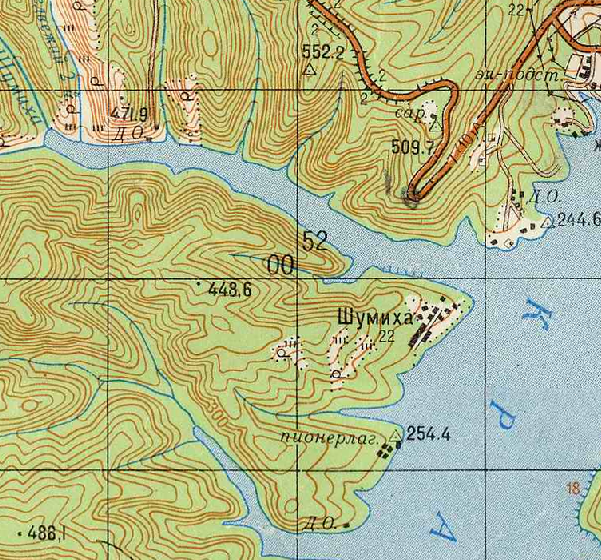

>Квадрат на листе топографической карты указывают подписями (номерами) образующих его километровых линий: сначала нижней горизонтальной линии, а затем левой (западной) вертикальной линии. В примере выше топоним «Шумиха» находится в квадрате 9852.

## Создание точечных объектов {#digitizing-topomap-points}
[В начало упражнения ⇡](#digitizing-topomap)

Чтобы начать создавать новые объекты в геоинформационной среде, необходимо сначала создать набор данных (базу данных), в которой эти объекты будут храниться. QGIS позволяет создавать и редактировать векторные пространственные данные во множестве различных форматов, но в качестве основного формата принят **GeoPackage**. Файл GeoPackage представляет собой базу данных SQLite с дополнительными функциями для хранения наборов пространственных данных. Вся необходимая информация хранится в единственном файле `*.gpkg`; в процессе работы создаются временные файлы. В одном файле может быть сохранено несколько наборов пространственных данных (иногда их также называют «таблицами», *tables*, или «слоями», *layers*)

Мы начнём векторизацию с объектов точечной геометрии. На фрагменте листа их два типа: геодезические пункты и отметки высот. Также есть условный знак отдельно расположенных дворов, не выражающихся в масштабе карты, но его мы проигнорируем. 

Сначала мы создадим новый файл формата GeoPackage и одновременно новую таблицу в нём для хранения данных о пунктах геодезической сети, затем добавим ещё одну таблицу к уже существующему файлу GeoPackage.

>Обратитесь к «Условным знакам для топографических карт», чтобы идентифицировать нужные объекты на фрагменте листа карты.

1. Запустите процедуру создания нового набора данных GeoPackage. Для этого нажмите кнопку «Создать слой GeoPackage...» (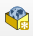) на панели менеджера источников данных или сочетание клавиш `Ctrl+Shift+N`.

2. В открывшемся окне введите следующие параметры:

    - **База данных:** сохраните файл `*.gpkg` в домашний каталог вашего проекта. Назовите его по образцу `Ex06_topo_%Фамилия%.gpkg`, где %Фамилия% — ваша фамилия в латинской транслитерации;
    - **Имя таблицы:** geodetic_points;
    - **Тип геометрии:** точечная
    - Чекбоксы «Include Z dimension» и «Include M values» оставьте выключенными;
    - **Система координат**: такая же, как система координат проекта.
    
    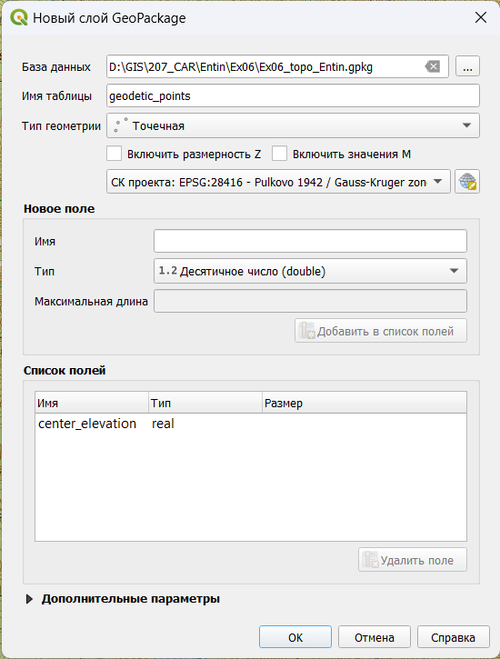
    
3. Помимо геометрии объектов, нам нужно будет хранить семантическую информацию. Для точечных объектов, представляющих пункты геодезической сети, на карте подписываются высоты их центров. Для хранения этой информации создайте новое поле с названием `center_elevation` типа «Десятичное число» (double), как показано на рисунке ниже.
    
    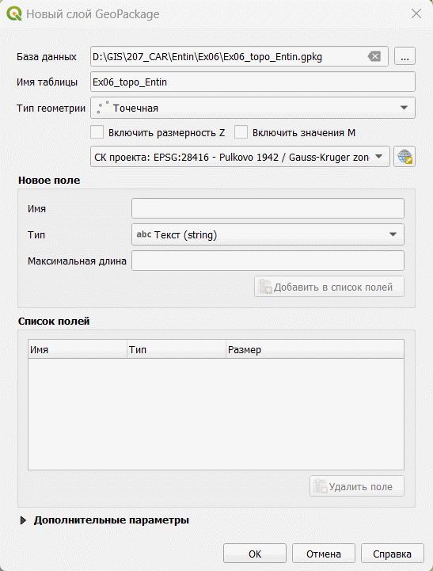
    
4. Проверьте правильность заполнения параметров. Если всё заполнено правильно, нажмите ОК. Новый слой будет добавлен в проект.

5. Переименуйте добавленный слой в «Геодезические пункты». Если необходимо, измените условный знак слоя таким образом, чтобы он контрастировал с изображением листа топографической карты.

6. Теперь мы готовы начинать векторизацию объектов. Для начала векторизации выберите слой «Геодезические пункты в таблице слоёв, а затем нажмите кнопку «Режим редактирования» (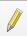) на панели инструментов редактирования. Альтернативный вариант: можно запустить режим редактирвоания из контекстного меню слоя.

7. Нажмите на панели редактирования кнопку «Добавить точечный объект» (). Курсор примет вид мишени. Переместите курсор на любой из геодезических пунктов и нажмите левую кнопку мыши, чтобы установить новую точку в этом месте. Новая точка будет установлена, также будет открыто окно ввода атрибутов. Введите высоту знака, подписанную на топографической карте, и нажмите ОК. Повторите процедуру для всех оставшихся геодезических пунктов на карте.

    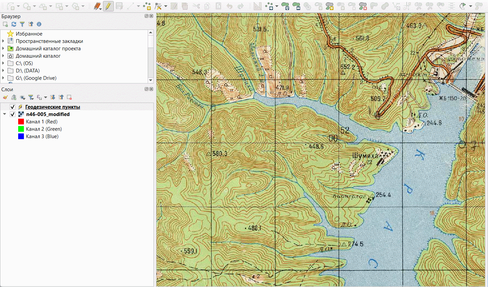
    
8. По окончании ввода точек нажмите кнопку «Сохранить изменения» (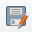) на панели редактирования, а затем отключите режим редактирования. 

    **Обратите внимание:** сохранение изменений в наборах пространственных данных делается независимо от сохранения проекта! Вы должны самостоятельно сохранять правки в слоях после каждого серьёзного изменения. Если выйти из режима редактирования без сохранения изменений, система предложит сохранить их во всплывающем окне.
    
9. Измените условный знак слоя геодезических пунктов таким образом, чтобы он максимально походил на условный знак, принятый на топографических картах. Настройте подписи для слоя геодезических пунктов.

10. Теперь вы векторизуете отметки высот. Для этого вы создадите новую таблицу в уже существующем файле GeoPackage. В панели браузера раскройте содержимое папки «Домашний каталог проекта» и вызовите контекстное меню файла GeoPackage, созданного ранее. В контекстном меню выберите опцию «Новая таблица...»

    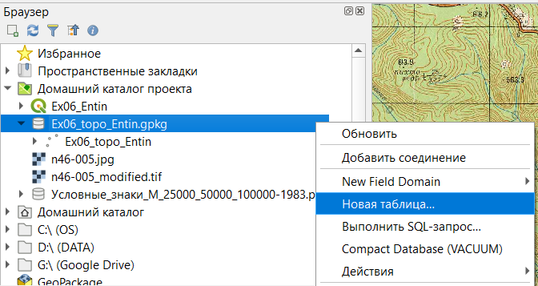
    
11. Будет открыт интерфейс создания новой таблицы в существующем файле GeoPackage. Он визуально отличается от того, что вы использовали на первом шаге, но содержимое его точно такое же. Настройте параметры следующим образом

    - **Имя таблицы:** elevation_points;
    - **Тип геометрии:** точечная
    - **Имя поля геометрии:** оставьте значение `geom`, предлагаемое по умолчанию
    - Чекбоксы «Include Z dimension» и «Include M values» оставьте выключенными;
    - **Система координат**: такая же, как система координат проекта.
    - Добавьте поле `elevation` типа «Десятичное число» (Real) для записи отметок высот.
    
    Сверьтесь с изображением ниже, чтобы убедиться, что вы всё сделали правильно.
    
    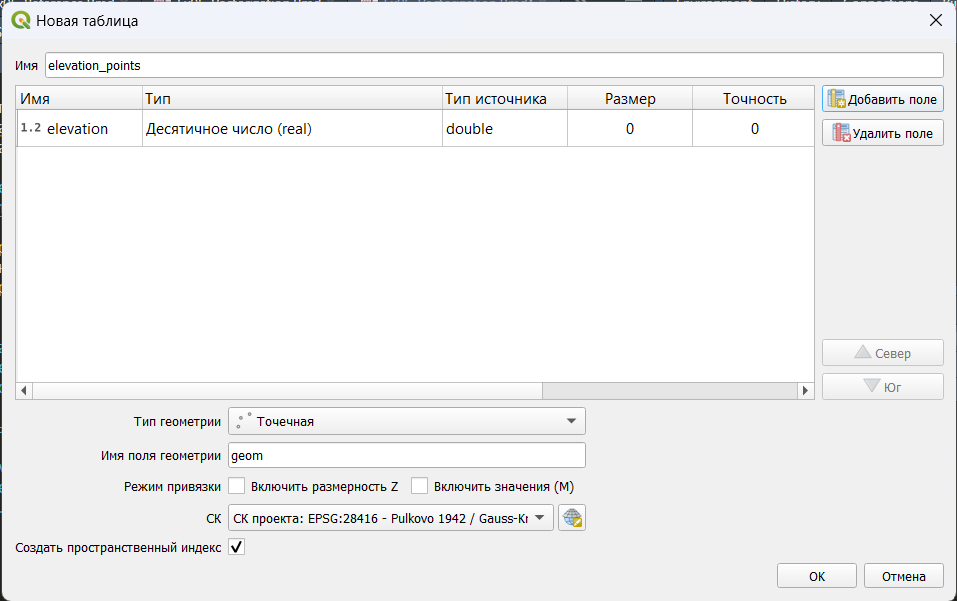
    
12. Нажмите OK, чтобы завершить процесс создания новой таблицы.

13. Новая таблица не добавляется в проект автоматически. Чтобы добавить новую таблицу в проект вручную, дважды щёлкните по её названию в панели браузера.

14. Переименуйте добавленный слой в «Отметки высот»

15. Векторизуйте отметки высот, находящиеся в пределах ваших квадратов.

16. По окончании векторизации сохраните правки и измените стиль слоя таким образом, чтобы он максимально походил на изображение, принятое на топографических картах.

## Создание линейных объектов {#digitizing-topomap-lines}
[В начало упражнения ⇡](#digitizing-topomap)

Мы закончили векторизацию объектов точечной геометрии и можем переходить к более сложным объектам линейной геометрии. На нашем листе карты представлены следущие линейные объекты:

- Береговая линия;
- Реки и ручьи шириной менее 10 м (изображаются на карте «в одну линию»);
- Автодороги.
- Контуры растительного покрова и грунтов.
- Горизонтали

Реки и ручьи, а также контуры растительного покрова и грунтов в пределах рассматриваемой территории не имеют значимой семантики. На береговой линии имеется участок, обозначенный знаком обрыва, но в рамках этого упражнения мы его проигнорируем. Автодороги в пределах участка бывают двух типов: автомобильные дороги с усовершенствованным покрытием (оранжевые) и автомобильные дороги без покрытия (белые). Для автодорог с усовершенствованным покрытием подписывается ширина дороги, ширина земляного полотна и материал покрытия, но мы не будем работать с ними в рамках настоящего упражнения. Горизонтали в пределах участка встречаются основные и утолщённые; кроме того, каждой горизонтали должно быть сопоставлено значение высоты.

1. Создайте в файле GeoPackage пять новых таблиц:

    - `coastline_lines` (береговая линия)
    - `rivers_lines` (реки и ручьи)
    - `vegetation_lines` (контуры растительного покрова и грунтов)
    - `roads_lines` (автодороги)
    - `contour_lines` (горизонтали)
    
    Тип геометрии для всех таблиц — «Линия», система координат — та же, что в проекте. Не создавайте полей таблицы атрибутов для этих объектов, мы добавим их позже. 

2. Добавьте в проект таблицу `rivers_lines` и переименуйте слой в «Реки и ручьи». Измените цвет линии слоя таким образом, чтобы он контрастировал с картографическим изображением.

3. Начните векторизацию с водотоков, находящихся в северной части участка и впадающих непосредственно в водохранилище. Включите режим редактирования и нажмите кнопку «Добавить линейный объект» (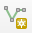). Векторизуйте водотоки по направлению от истока к устью, устанавливая новые узлы с помощью левой кнопки мыши. Чтобы завершить редактирование линии и перейти к следующей, нажмите правую кнопку мыши. Ошибочно установленные узлы можно удалить с помощью кнопки *Backspace*.

    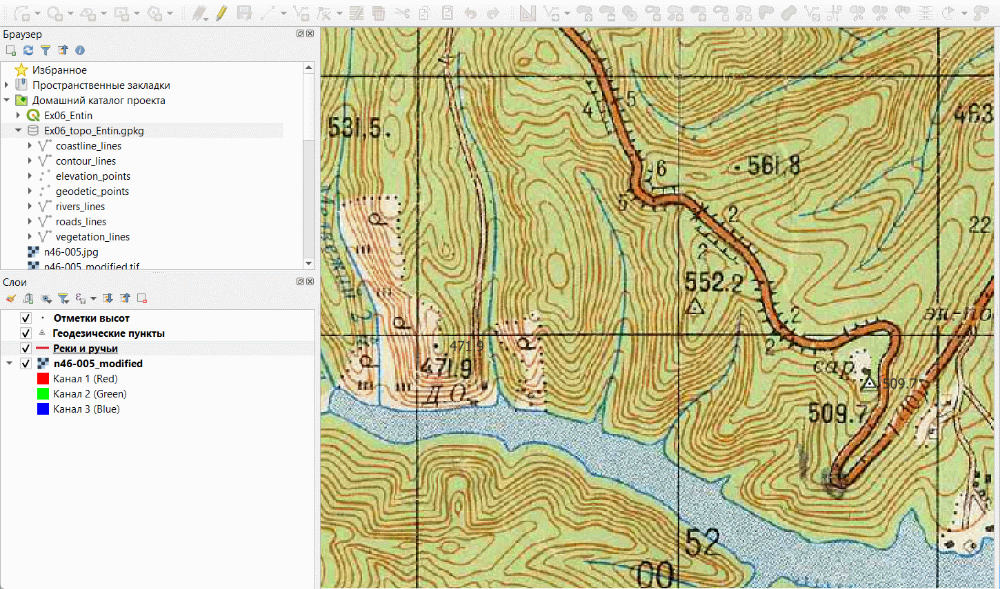
    
4. Теперь перейдите к юго-западной части фрагмента, где несколько водотоков образуют древовидную сеть. Чтобы корректно векторизовать такие водотоки, необходимо использовать прилипание (снеппинг). Прилипание позволяет установить новый узел точно в координаты существующего узла. Включите панель «Инструменты прилипания», если она отключена.

    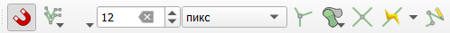
    
5. Нажмите на панели инструментов прилипания кнопку «Разрешить прилипание» (), чтобы активировать режим прилипания.

6. Проверьте, что прилипание осуществляется ко всем слоям (вторая кнопка справа на панели).

7. Укажите, к каким элементам следует осуществлять прилипание (третья кнопка слева на панели). Включите прилипание к вершинам и линиям.

    
    
8. Векторизуйте систему водотоков, используя прилипание. Начните векторизацию с любого истока и закончите объект на первом по течению слиянии. Затем векторизуйте соседний объект, впадающий в то же место слияния; при установке последней точки убедитесь, что срабатывает прилипание к существующему объекту: целевое положение узла обозначается сиреневым квадратом. Ориентируйтесь на рисунок ниже:

    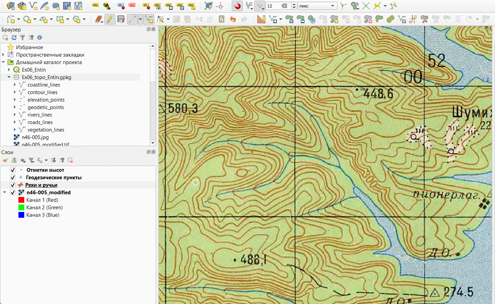
    
9. Векторизуйте все водотоки, которые хотя бы частично попадают в целевые квадраты. По окончании векторизации сохраните правки и измените внешний вид слоя таким образом, чтобы он максимально соответствовал изображению на топографической карте.

10. Добавьте в проект таблицу `coastline_lines`. Переименуйте новый слой в «Береговая линия» и настройте для него контрастный условный знак.

11. Начните векторизацию береговой линии. В ходе векторизации используйте прилипание, чтобы береговая линия точно стыковалась с реками и ручьями. Не пытайтесь векторизовать всю линию целиком: периодически завершайте объект, сохраняйте правки и начинайте создание нового объекта от последней установленной точки.

    >Примечание: положение узлов уже созданного объекта можно изменять с помощью инструмента редактирования вершин в текущем слое (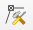)
    
12. Теперь, когда вся береговая линия векторизована, нужно объединить её в один объект. Для этого нам потребуются инструменты с панели выбора объектов, а также с панели дополнительных инструментов оцифровки. Убедитесь, что обе эти панели включены

    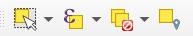
    
    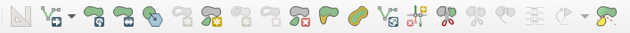

13. Используя инструмент «Выбрать объекты в прямоугольнике или точке» (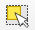), обведите рамкой все объекты в слое «Береговая линия». Сами линии будут выделены жёлтым цветом, а их вершины — красными крестиками.

    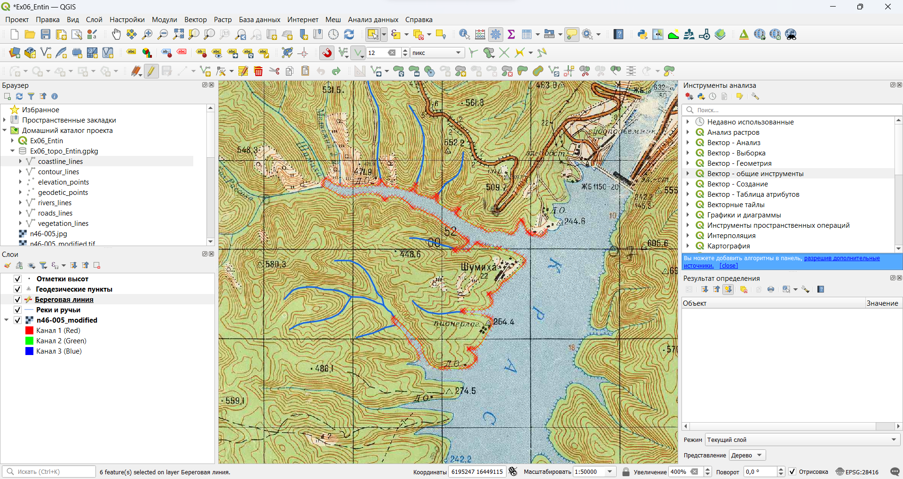
    
14. Нажмите кнопку «Объединить выделенные объекты» (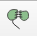) на панели дополнительных инструментов оцифровки. В открывшемся окне будет предложено определить, что делать с атрибутами объектов. Оставьте все значения по умолчанию и нажмите OK. Все объекты в слое береговой линии будут объединены в один.

15. Сохраните правки в слое «Береговая линия» и измените символику слоя так, чтобы результат максимально походил на изображение топографической карты.

16. Добавьте на карту таблицу границ растительного покрова и грунтов, переименуйте слой в «Границы растительности» и векторизуйте объекты, попадающие на выбранные вами квадраты.
   
    >Примечание: границы растительности могут образовывать замкнутые контура. Чтобы векторизовать такой контур, необходимо включить опцию самоприлипания (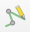)
    
17. После окончания векторизации линий границ измените символику слоя, чтобы она походила на изобравжение топографической карты.

18. Добавьте в проект таблицу автодорог и переименуйте слой в «Автодороги». Как мы помним, для этого набора данных необходим дополнительный столбец таблицы атрибутов, который не был создан в момент создания самой таблицы. Мы добавим его на следующем шаге.

19. Откройте таблицу атрибутов слоя автодорог и запустите редактирование этого слоя. В панели инструментов таблицы атрибутов нажмите кнопку «Новое поле» (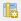) или комбинацию клавиш `Ctrl+W` на клавиатуре. Будет открыто окно добавления нового поля.

    >Примечание: создание и удаление полей таблицы атрибутов — это изменение структуры базы данных. В большинстве программных средств ГИС эти операции делаются при **выключенном** режиме редактирования. QGIS представляет собой исключение из общего правила.
    
20. Создайте поле `road_type` текстового типа. Размер (длину) поля можно не устанавливать.

21. Закройте таблицу атрибутов и перейдите в основное окно QGIS. Векторизуйте участок дороги с усовершенствованным покрытием в северной части территории. По окончании векторизации введите необходимое значение атрибута.

22. Векторизуйте дорогу без покрытия в населённом пункте, обозначенном как «Шумиха».

23. Сохраните правки и измените стилистику слоя. Задайте разные условные знаки для дорог разного типа. Чтобы создать знак, похожий на изображение топографической карты, воспользуйтесь многослойными символами: верхний слой символа должен представлять собой линию оранжевого (или белого) цвета, нижний слой — более широкую линию чёрного цвета. Пример изображён на рисунке ниже:

    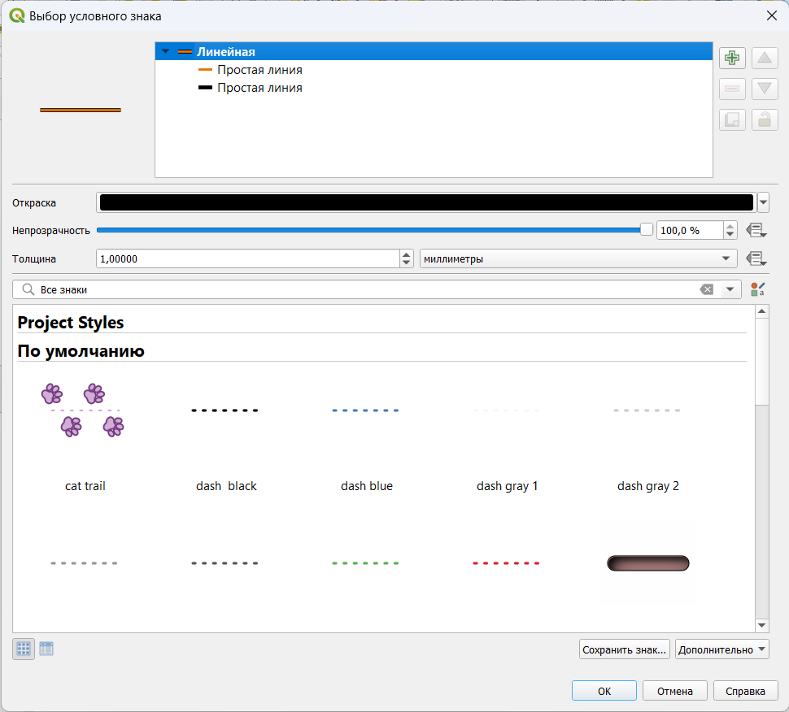
    
    После окончания векторизации автодорог отключите исходный растр и проверьте, как выглядит изображение слоёв вашего проекта. Для справки сверьтесь с изображением ниже:
    
    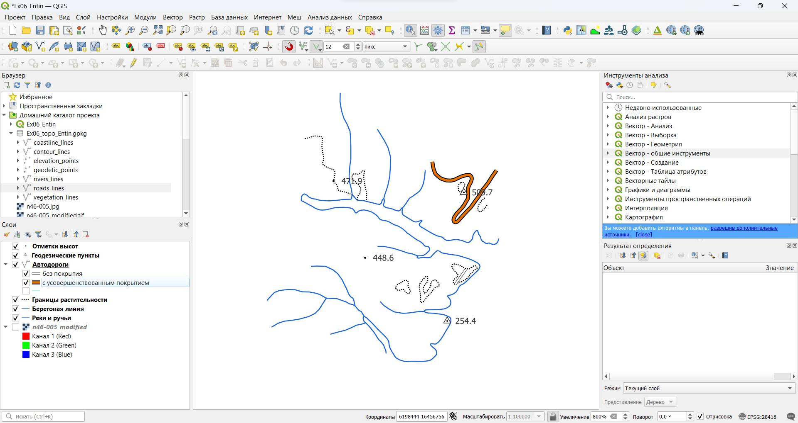
    
24. Добавьте на карту таблицу горизонталей, переименуйте слой в «Горизонтали» и добавьте необходимые столбцы таблицы атрибутов (`contour_type` для типа горизонтали, `contour_elevation` для высоты). 

25. Отключите прилипание, затем в панели инструментов оцифровки переключитесь на опцию «Оцифровка в потоковом режиме» или нажмите клавишу R на клавиатуре.

    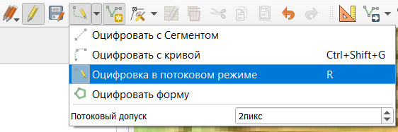

26. Векторизуйте горизонтали в пределах любого одного выбранного квадрата в потоковом режиме. Для этого установите курсор в стартовую точку, а затем медленно ведите курсор вдоль линии.

    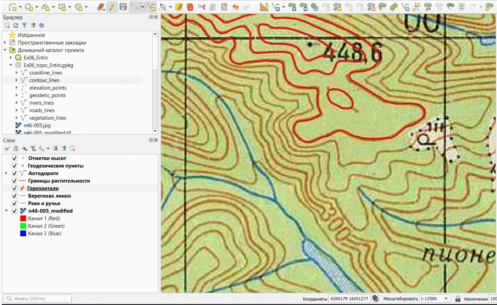
    
    Если трассировка покажется вам неудобной, переключитесь обратно в режим векторизации по сегментам.
    
27. После окончания векторизации горизонталей настройте их внешний вид аналогично изображению топографических карт, за исключением подписей.

## Создание полигональных объектов {#digitizing-topomap-polygons}
[В начало упражнения ⇡](#digitizing-topomap)

На нашем листе карты представлены следущие объекты полигональной геометрии:

- Площадные объекты гидрографии (водохранилище)
- Контура растительного покрова (леса)
- Здания и сооружения.

В ходе выполнения упражнения мы проигнорируем условные знаки травяной и кустарниковой растительности.

1. Создайте в файле GeoPackage три новых таблицы:

    - `water_polygons` (водохранилище)
    - `vegetation_polygons` (лесные массивы)
    - `building_polygons` (застройка населённых пунктов)

    Для таблиц `water_polygons` и `vegetation_polygons` установите тип геометрии «Полигональная» («Площадная»), для `building_polygons` — «Мультиполигон». 
    
    Для водохранилища и населённых пунктов предусмотрите поле строкового (текстового) типа для хранения названия. Не используйте `name` в качестве названия этого поля, поскольку это зарезервированая системная переменная. Лучше назвать поле `water_name` и `buildings_name` соответственно.
    
2. Добавьте таблицу векторных объектов гидрографии в проект и переименуйте слой в «Водохранилища».

3. Начните векторизацию водохранилища. На предыдущих шагах мы уже векторизовали береговую линию, поэтому сейчас при создании полигонального объекта нам нужно будет точно повторить существующий контур. Для решения этой задачи существует специальная функция трассировки (*tracing*), она включается с помощью кнопки «Включить трассировку» на панели инструментов прилипания ().

4. Включив трассировку, установите первый узел создаваемого объекта водохранилища на береговой линии за пределами целевых квадратов. Затем проведите курсором вдоль береговой линии и установите новый узел на некотором удалении от первого. Если трассировка включена, все промежуточные узлы будут расставлены автоматически. Повторите эту операцию столько раз, сколько нужно для векторизации контура водохранилизща вдоль имеющейся береговой линии. Последний узел создаваемого полигона установите в акватории за пределами векторизуемых квадратов. Посмотрите изображение ниже, чтобы увидеть, как это делается:

    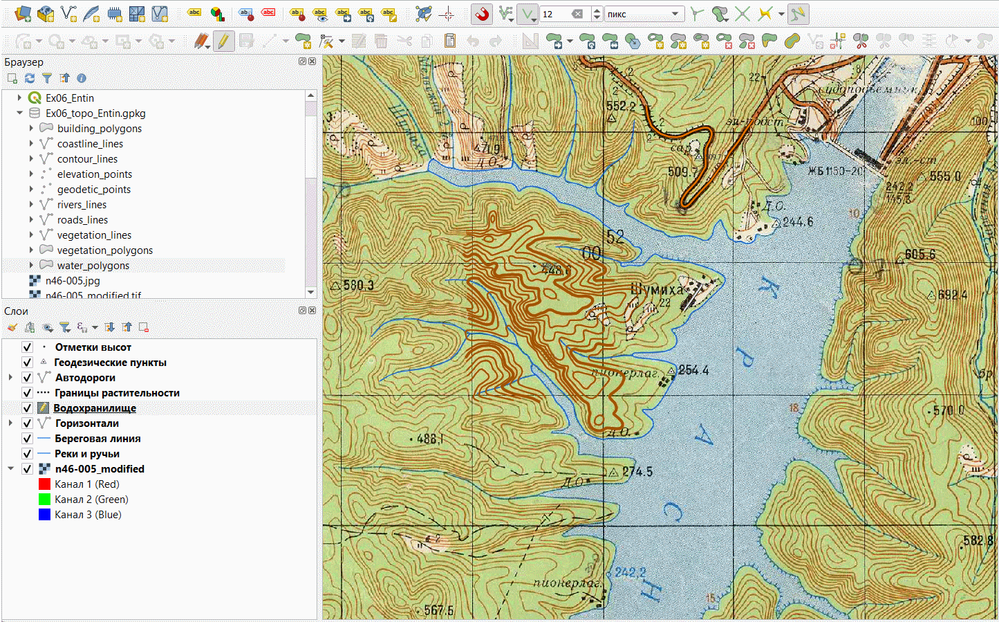
    
5. Сохраните правки в слое водохранилищ и измените символы слоя на максимально близкие к изображению топографической карты. Как и для горизонталей, не включайте подписи.

6. Добавьте в проект таблицу с контурами растительности. Переименуйте слой в «Растительность и грунты».

7. Используя уже известный вам инструмент трассировки, векторизуйте границы лесных массивов. При этом пока не обращайте внимания на «дырки» внутри контуров леса — мы будем работать с ними на следующем шаге. В результате векторизации ваш проект должен принять вид, аналогичный показанному ниже:

    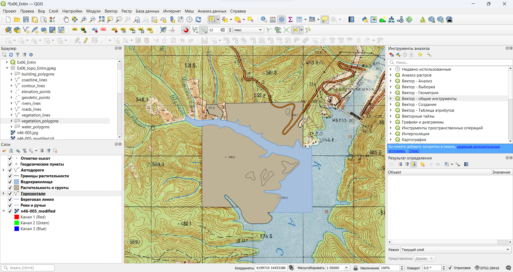
    
8. Теперь мы удалим незалесённые фрагменты из полигонов лесных массивов, ориентируясь на границы растительности, оцифрованные ранее. Найдите на панели дополнительных инструментов оцифровки и включите инструмент «Добавить кольцо» (). Используя этот инструмент и включённую трассировку, очертите контур любой из «дыр» на участке, как показано на рисунке ниже:
    
    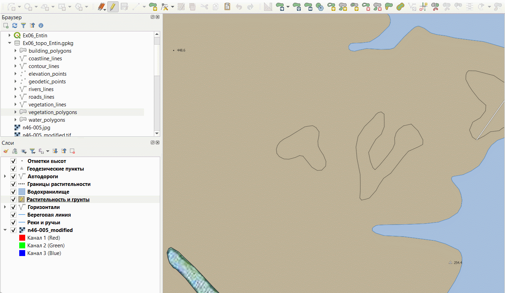
    
    Повторите операцию для всех аналогичных контуров.
    
9. Сохраните правки в слое растительности и измените символы слоя на максимально близкие к изображению топографической карты.

10. Отключите все слои, кроме исходного растра листа топографической карты.

11. Добавьте в проект таблицу со зданиями. Переименуйте слой в «Здания и сооружения»

12. Включите режим редактирования для слоя зданий и сооружений и отключите прилипание.

13. Векторизуйте самую крупную группу зданий в населённом пункте, подписанном как «Шумиха».

14. Теперь мы векторизуем другие группы зданий в том же населённом пункте, но сделаем это так, чтобы новые контура не образовывали новые объекты, а добавлялись к предыдущему (используем мультиполигональную геометрию). Для этого выберите созданное здание с помощью инструмента выборки (), а затем создайте новый фрагмент объекта с помощью инструмента «Добавить часть» (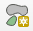) с панели дополнительных инструментов оцифровки. Векторизуйте таким образом все здания в этом населённом пункте.

15. Повторите аналогичные операции для других групп зданий в пределах векторизуемых квадратов. Каждая группа зданий должна быть самостоятельным объектом, все отдельные здания в пределах группы должны быть частями этого объекта.

16. Сохраните правки в слое зданий и сооружений и измените символы слоя на максимально близкие к изображению топографической карты. Настройте подписи объектов.

## Оформление макета компоновки {#digitizing-topomap-layout}
[В начало упражнения ⇡](#digitizing-topomap)

1. Убедитесь, что режим редактирования выключен для всех векторных слоёв проекта.

1. Отключите сканированное изображение топографической карты и включите все остальные слои

2. Расположите слои в порядке, соответствующем отрисовке объектов на топографической карте. Если необходимо, ещё раз проверьте и скорректируйте настройки визуализации для слоёв. Ваше изображение должно выглядеть примерно так, как показано на рисунке ниже:

    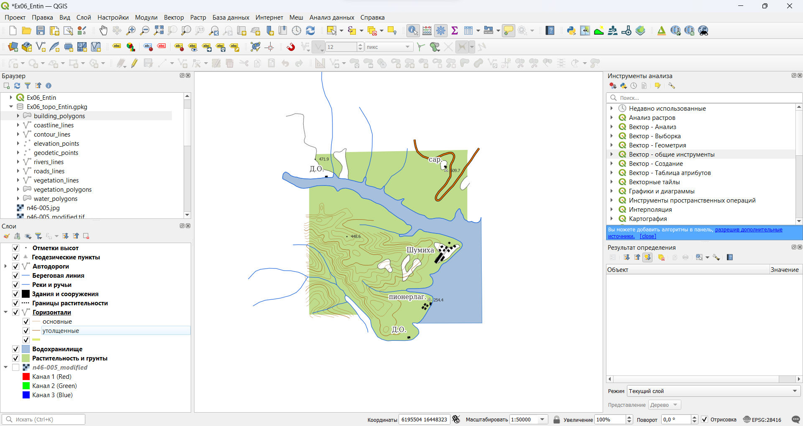

3. Создайте макет компоновки и оформите картографическое изображение в пределах векторизованных вами квадратов листа топографической карты. Добавьте на макет название, легенду, масштабную линейку и сведения об авторстве. 

4. Экспортируйте макет в графический файл.