# Пространственные и атрибутивные запросы {#query}

[Архив с исходными данными](https://github.com/aentin/qgis-course/raw/master/files/Ex07.zip)

[Контрольный лист](https://github.com/aentin/qgis-course/raw/master/files/Ex07_%D0%BE%D1%82%D1%87%D1%91%D1%82.docx)

**Внимание! Ваш преподаватель может предоставить вам другие исходные данные для выполнения этого упражнения или скорректировать его задачи**: [схемы городов](https://drive.google.com/drive/folders/11A1p2yQqX_wOjLQFITx8gkDGvvxtU2Ra?usp=sharing){target='blank'}. При возникновении противоречий следуйте указаниям преподавателя.

## Введение {#query-intro}

**Цель задания** — знакомство с редактированием векторных пространственных данных, элементами базовых технологий ГИС (оверлей, пространственный запрос, атрибутивный запрос).

**Необходимая теоретическая подготовка:** Системы координат и проекции карт, привязка геоизображений, трансформирование геоизображений. Пространственные запросы, атрибутивные запросы, оверлей.

**Необходимая практическая подготовка:** Знание основных компонент интерфейса QGIS (менеджер источников данных, панель слоёв, фрейм карты). Добавление источников пространственных данных в проект. Настройка символики и подписей объектов. Привязка растра. Создание макета, добавление карты и зарамочного оформления, экспорт макета.

**Исходные данные:** Схема районов города с сайта [НЕАГЕНТ](https://neagent.info/) по состоянию на 2021 г.; набор пространственных данных о зданиях и сооружениях, созданный на основе базы OpenStreetMap

**Результат:** Набор пространственных данных с вернакулярными районами г. Новосибирск и статистикой по застройке в пределах районов. Картодиаграммы по количеству домов и степени застроенности. Картографическое изображение.

### Контрольный лист {#query-control}

* Привязать растровую схему районов города
* Создать набор пространственных данных о районах путем цифрования растровой карты
* Добавить семантическую информацию о районах
* Выполнить серию пространственных и атрибутивных запросов для определения структуры застройки в пределах районов
* Построить картодиаграммы по полученным значениям
* Подготовить проект карты с компоновкой

## Подготовка исходных данных {#query-basedata}
[В начало упражнения ⇡](#query)

1. Загрузите архив с исходными данными и распакуйте его в вашу рабочую директорию.

2. Создайте новый проект QGIS и загрузите любую картографическую основу с веб-сервиса. Сохраните проект в ту же директорию, где находятся исходные данные.

3. Привяжите схему районов. Если вы не знаете, как привязать схему, сверьтесь с [упражнением 5]{#raster-reference}

<kbd>В отчёт: снимок экрана №1 — окно QGIS с привязанным растровым изображением</kbd>.

## Создание набора пространственных данных {#query-new-geopackage}
[В начало упражнения ⇡](#query)

На этом этапе мы создадим новый векторный набор пространственных данных, в котором будут храниться контура районов. QGIS поддерживает множество форматов пространственных данных, выбор конкретного формата в каждом случае определяется задачами, требованиями и ограничениями проекта. В качестве формата по умолчанию в QGIS 3 используется [GeoPackage](https://www.geopackage.org/).

Файл GeoPackage представляет собой базу данных SQLite с дополнительными функциями для хранения наборов пространственных данных. Вся необходимая информация хранится в единственном файле `*.gpkg`; в процессе работы создаются временные файлы. В одном файле может быть сохранено несколько наборов пространственных данных (иногда их также называют «таблицами», *tables*, или «слоями», *layers*)

1. Запустите процедуру создания нового набора данных GeoPackage. Для этого нажмите кнопку 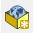 на панели менеджера источников данных или сочетание клавиш `Ctrl+Shift+N`.

2. В открывшемся окне введите следующие параметры:

    - **База данных:** сохраните файл `*.gpkg` в директорию вашего проекта. Назовите его по шаблону `Districts_%Фамилия%.gpkg`;
    - **Имя таблицы:** примите значение, предлагаемое по умолчанию после указания пути к базе;
    - **Тип геометрии:** полигон (площадная)
    - Чекбоксы «Include Z dimension» и «Include M values» оставьте выключенными;
    - **Система координат**: такая же, как система координат проекта.
    
3. Помимо геометрии объектов, нам нужно будет хранить семантическую информацию — номера районов. Создайте новое поле целочисленного типа с названием `district_id`, как показано на рисунке ниже.

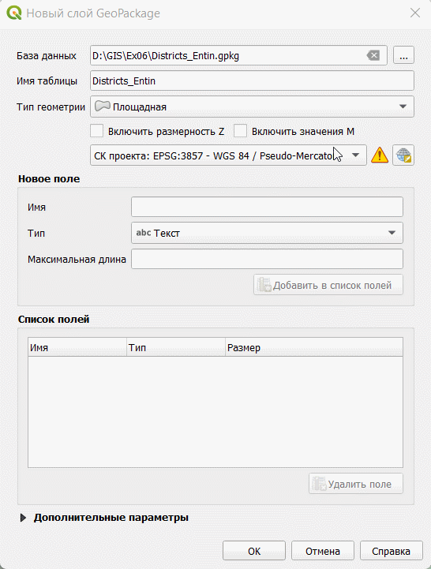

4. Проверьте правильность заполнения параметров. Если всё заполнено правильно, нажмите ОК. Новый слой будет добавлен в проект.

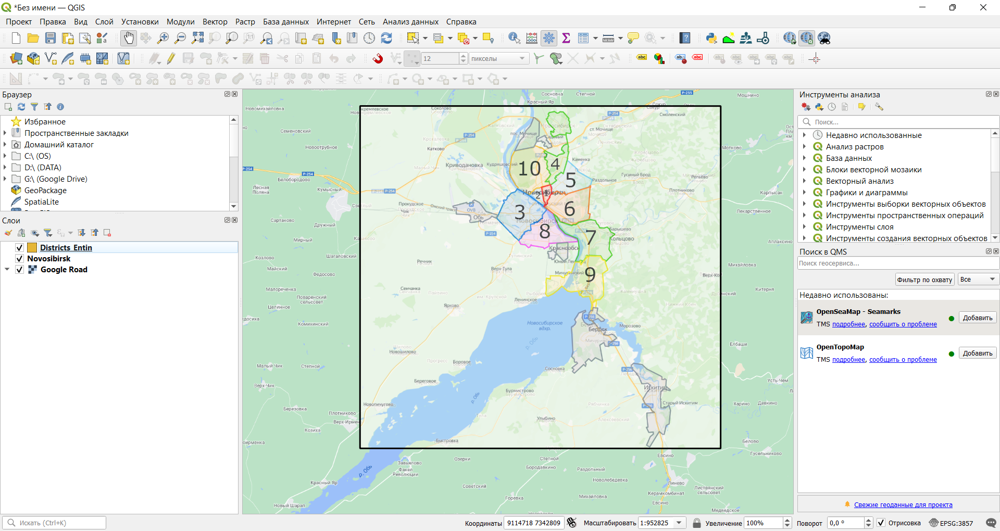

## Векторизация районов {#query-drawing}
[В начало упражнения ⇡](#query)

1. Измените стиль слоя на `pattern dot blue`. Эта символика будет удобна для цифрования, поскольку позволит не «скрывать» растровый слой под создаваемыми объектами и в то же время будет контрастно выделяться на их фоне.

2. Включите режим редактирования при помощи кнопки 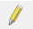 или из контекстного меню слоя. Запустите режим редактирования.

3. Когда режим редактирования запущен, нажмите кнопку 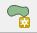, чтобы начать добавление нового объекта

4. Увеличьте изображение до района, обозначенного цифрой «1». Вы начнёте векторизацию с него. По нажатию левой кнопки мыши устанавливается положение первого узла создаваемого контура. «Обходите» контур по часовой стрелке или против часовой стрелки, устанавливая новые узлы нажатием левой кнопки мыши, как показано на изображении ниже

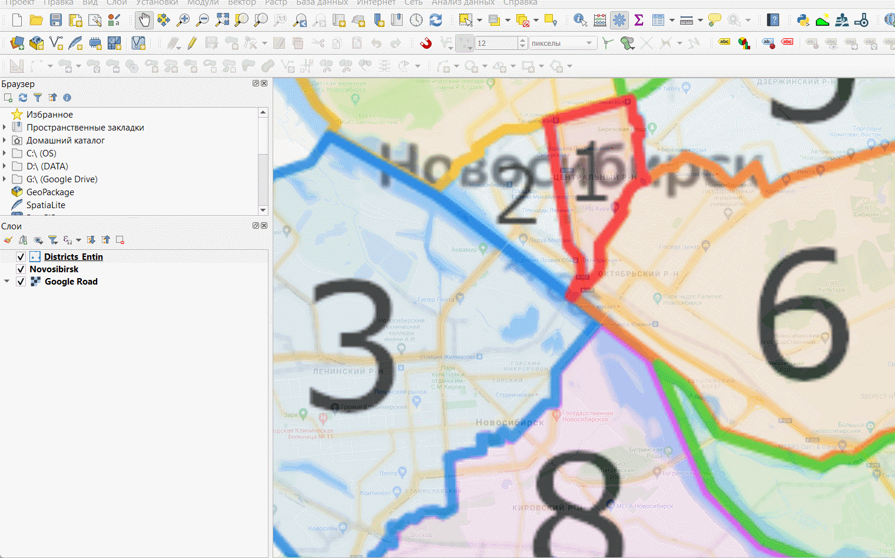

5. Чтобы завершить редактирование объекта, нажмите правую кнопку мыши.

6. Когда вы завершаете создание объекта в QGIS, появляется окно ввода значений атрибутов. Введите номер района, как показано ниже

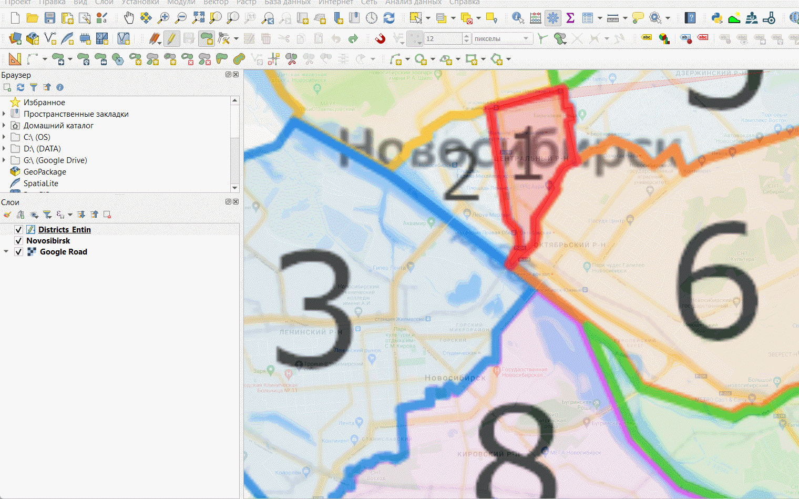

Когда вы создаёте пространственные объекты в ГИС, важно соблюдать топологию объектов. Координаты узлов соседних объектов должны совпадать, между объектами не должно быть пробелов и перекрытий. Чтобы добиться такого соответствия, вам необходимо активировать опцию прилипания (снеппинга). 

7. Найдите панель инструментов прилипания

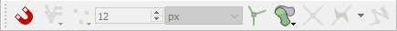

8. Включите режим прилипания, нажав на иконку с изображением магнита

9. Нажимая на соседние иконки в панели, включите прилипание к объектам во всех слоях, но только к вершинам объектов

Теперь, если вы будете подводить курсор к существующим объектам, его положение будет автоматически «притягиваться» к ближайшим узлам.

10. Прилипание позволяет реализовать создание новых объектов путём трассировки по существующим объектам. Включите режим трассировки, нажав на кнопку 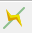

11. Оцифруйте соседний объект с помощью трассировки. Для этого подведите курсор к углу существующего объекта и установите первый узел. Затем переместите курсор вдоль общей границы и установите следующий узел. Промежуточные узлы будут добавлены автоматически. После оцифровки общей границы продолжайте векторизацию обычным способом. После добавления нового объекта не забудьте внести его атрибуты во всплывающем окне.

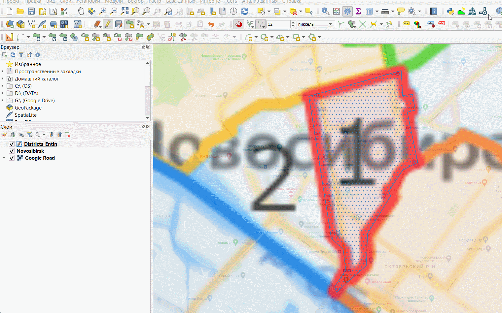

14. Используя полученные навыки, оцифруйте все районы города.

**Важно!** Время от времени сохраняйте ваши правки при помощи кнопки 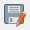 на панели редактирования. В QGIS, как и во всех ГИС-пакетах, сохранение правок в данных выполняется отдельно от сохранения проекта.

> Несколько советов по редактированию данных:

  > Чтобы отменить последний установленный узел, нажмите `Backspace`;
  
  > Чтобы полностью удалить последнюю оцифрованную фигуру, нажмите `Ctrl+Z`.
  
  > Чтобы изменить положение отдельного узла уже созданного объекта, можно воспользоваться инструментом редактирования узлов 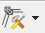.
  
  > Трассировка в QGIS работает только тогда, когда весь путь трассировки отображается на экране. Если часть сегмента вылезла за пределы фрейма, трассировка не сработает.
  
  > Изучите панель «Дополнительные инструменты оцифровки» — она может вам пригодиться
  
  > Плавные кривые линии (берега, реки и т.п.) при цифровании обычно аппроксимируются ломаными линиями с относительно большим числом узлов — так, чтобы отличия не были визуально заметны. Хотя многие форматы данных позволяют создавать криволинейные объекты, этот подход не являются общепринятым.
    
18. По окончании цифрования объектов отключите растровый слой и отобразите данные в полном охвате. Сделайте снимок экрана.

<kbd>В отчёт: снимок экрана №2 — окно QGIS с оцифрованными границами районов</kbd>.

## Пространственные и атрибутивные запросы {#query-query}
[В начало упражнения ⇡](#query)

В этой части работы вы оцените число жилых домов, оцифрованных пользователями ресурса [OpenStreetMap](https://www.openstreetmap.org/), в пределах вычерченных вами районов. Волонтёрская географическая информация, к которой относится и OpenStreetMap, является важным источником данных для географических исследований благодаря своей детальности и относительной оперативности обновления, однако имеет ряд недостатков: неравномерное покрытие территории данными, низкая согласованность, структурированность и надёжность данных.

Для подсчёта числа зданий вы воспользуетесь следующим алгоритмом:

* Выбрать район на карте

* Выбрать здания, попадающие в его пределы (*пространственный запрос*).

* Из полученной выборки оставить только здания, принадлежащие к определённому типу (*атрибутивный запрос*).

* Записать число отобранных зданий в соответствующий атрибут текущего района.

Операции повторяются для каждого района.

1. Добавьте на карту набор данных о зданиях, который вы загрузили в начале занятия.

2. Откройте **таблицу атрибутов** слоя зданий. Для этого нажмите правой кнопкой мыши на слой в панели слоёв и выберите опцию «Открыть таблицу атрибутов» в контекстном меню.

>Таблица атрибутов — это представление базы данных в виде таблицы. В большинстве случаев работа с семантической информацией в ГИС выполняется через таблицу атрибутов.

Определите, какие атрибуты есть у набора пространственных данных о зданиях. Установите, какие значения атрибутов могут соответствовать жилым домам.

2. Закройте таблицу атрибутов слоя зданий и откройте таблицу атрибутов слоя районов.

2. Убедитесь, что для слоя районов включён режим редактирования.

3. В окне таблицы атрибутов слоя районов нажмите кнопку 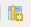 или `Ctrl+W`, чтобы добавить новое поле, в которое будет записано число жилых домов для каждого района. 

4. Добавьте поле с именем `number_of_houses` целочисленного типа.

На этом подготовительные операции закончены, мы переходим к запросам.

3. **Выберите** любой из районов: выделите строку в таблице атрибутов или воспользуйтесь инструментом выборки в окне карты . Выделенный объект будет подсвечен жёлтым цветом на карте и синим цветом в таблице атрибутов.

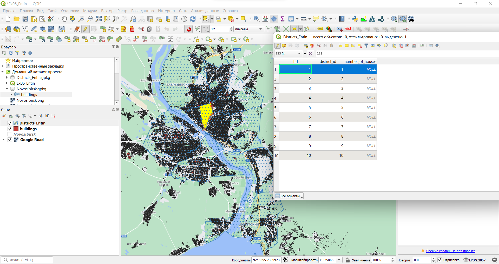

5. Теперь выберите те объекты из слоя зданий, которые находятся внутри выбранного района. Для этого запустите инструмент «Вектор» — «Выбор» — «Выбрать по расположению...». Используйте условие «находятся внутри» (*are within*). Включите опцию «Использовать только выделенные объекты» для выбирающего слоя.

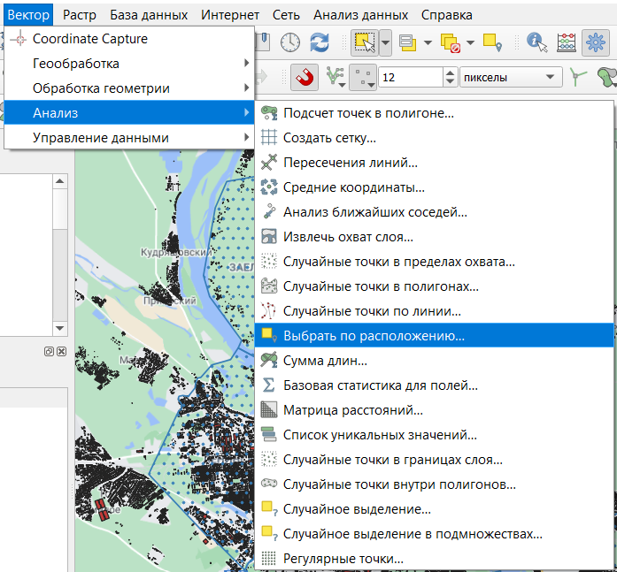

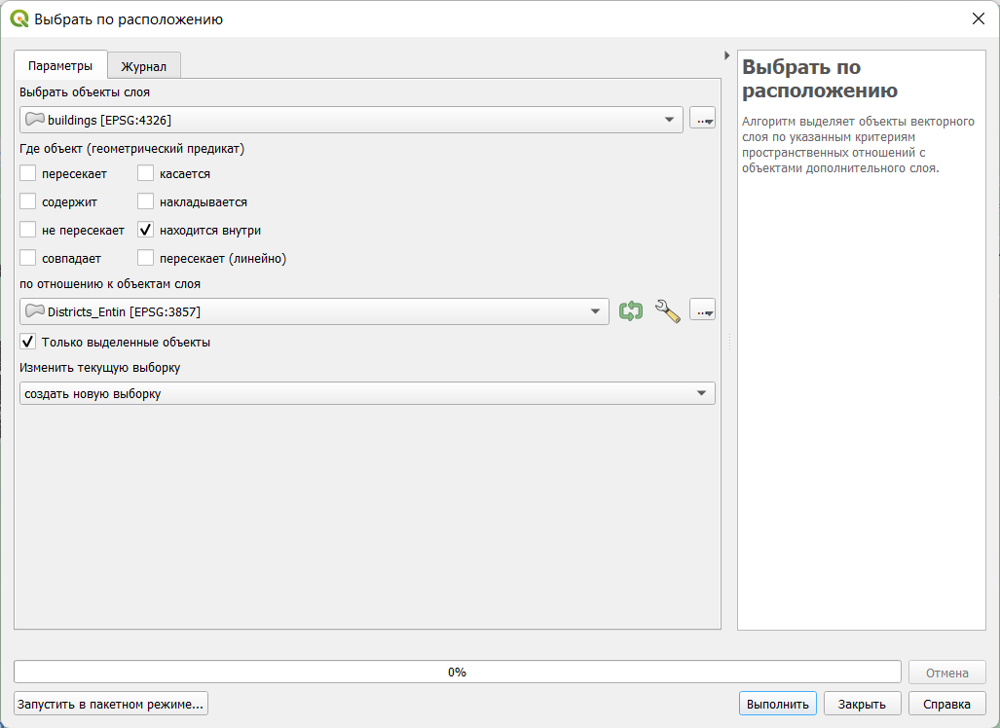
    
Нажмите «Выполнить», чтобы выбрать объекты в слое зданий.

6. Имея выборку в слое зданий и не закрывая окно пространственного запроса («Выбрать по расположению...»), осуществите выборку по атрибутам. Для этого выберите в таблице слоёв слой зданий и нажмите кнопку «Выделить объекты, удовлетворяющие условию»  (или нажмите `Ctrl+F3`. Откроется форма ввода атрибутивного запроса.

>Атрибутивные запросы в ГИС, как правило, создаются с использованием диалектов языка [SQL](https://ru.wikipedia.org/wiki/SQL). Само выражение представляет собой только условие (*where clause*) и часто использует значения атрибутов. В QGIS можно выполнить запрос и без составления выражения на языке SQL, но поскольку SQL более функционален, мы призываем вас сразу начать пользоваться им.

Форма ввода атрибутивного запроса состоит из трёх частей. В левой части конструируется собственно запрос, средняя содержит список доступных переменных и функций, в правой отображается справочная и служебная информация. Сейчас вам нужно будет составить атрибутивный запрос, который позволит выбрать здания, являющиеся (с некоторой вероятностью) жилыми домами.

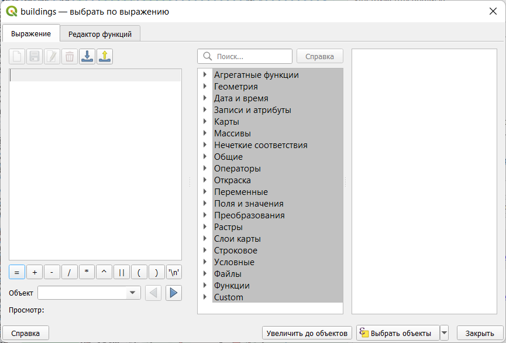

Атрибутивный запрос представляет собой логическое выражение, которое применяется к кортежу базы данных (строке таблицы). Результатом вычисления логического выражения является либо логическая 1 (ИСТИНА), либо логический 0 (ЛОЖЬ). В выборку попадают объекты, для которых при вычислении выражения получено значение 1.

В простейшем случае выражение состоит из проверки равенства. Например, выражение `"type" = 'house'` будет истинным для всех объектов, у которых в поле `type` записано значение `house`. Можно конструировать более сложные логические выражения с использованием операторов AND (И), OR (ИЛИ) и других. Например, выражение `"type" = 'apartments' AND "name" IS NOT NULL` будет истинным для объектов, у которых в поле `type` записано значение `apartments` (т.е. многоэтажные жилые дома) и одновременно в поле `name` записано какое-либо значение, отличное от пустого (`NULL`) (т.е. имеющие название). А запрос `"type" = 'garage' OR "type" = 'garages'` выберет из слоя зданий объекты, у которых в поле `type` записано либо значение `garage`, либо значение `garages`.

>Примечание 1: в интерфейсе атрибутивного запроса и во всех остальных инструментах QGIS, использующих тот же интерфейс, названия полей обрамляются двойными кавычками ("), а строковые переменные — одинарными кавычками (')
>Примечание 2: в QGIS и в большинстве систем управления базами данных (СУБД) для работы с пустыми значениями (NULL) используются отдельные операторы. Например, выражение `"type" = NULL` будет воспринято как некорректное, вместо него следует писать `"type" IS NULL`

7. Составьте выражение, реализующее следующее условие:

  **Выбрать объекты, у которых атрибуту `type` присвоено значение `apartments` или `house`**
  
  Вводить выражение можно, пользуясь списком функций и полей в правой части окна. Двойной клик по полю или функции добавляет соответствующую запись в окно выражения.
  
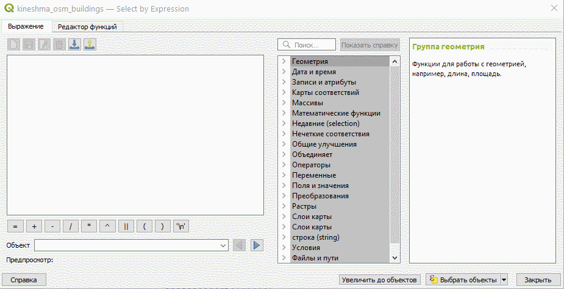

После окончания ввода выражения и перед тем, как перейти к следующему шагу, скопируйте получившееся выражение в отчётный файл.

<kbd>В отчёт: выражение №1 — условие для выбора объектов</kbd>.

11. Мы сформулировали условие для выборки, однако нам нужно выбрать объекты не просто из слоя, а из уже существующей выборки. Для этого откройте выпадающий список кнопки «Выбрать объекты» и выберите функцию «Фильтровать текущую выборку»:

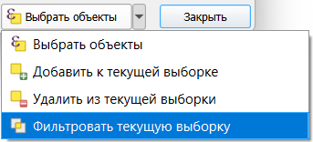
    
12. После применения фильтра появится всплывающее сообщение с числом выбранных объектов. Эта информация будет продублирована внизу окна QGIS:

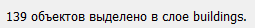
  
13. Введите полученную цифру в таблицу атрибутов слоя районов в строке, соответствующей выбранному объекту (подсвечена синим).

14. Теперь, не закрывая окна пространственного и атрибутивного запроса, выбирайте по очереди каждый следующий объект в слое границ районов и повторяйте для них шаги 3-13. Таким образом вы заполните весь столбец `number_of_houses` в таблице атрибутов. В процессе выполнения не забывайте периодически сохранять правки.

16. Скопируйте таблицу атрибутов в любой табличный процессор (Microsoft Excel, Google Sheets, LibreOffice Calc). Для этого при помощи сочетания клавиш `Ctrl+A` выделите все записи в таблице, скопируйте при помощи `Ctrl+C` и вставьте записи без форматирования в табличный процессор при помощи `Ctrl+Shift+V`.

17. Удалите столбец `wkt_geometry`, если он есть в вашей таблице. Скопируйте остальные столбцы и вставьте их в отчётный файл.

<kbd>В отчёт: таблица №1 — таблица атрибутов слоя районов</kbd>.

18. Завершите редактирование слоя районов.

19. Отключите отображение слоя зданий.

## Визуализация слоя при помощи картодиаграмм {#query-diagrams}
[В начало упражнения ⇡](#query)

Как вы уже знаете из курса картографии, не существует прямого взаимно-однозначного соответствия между способами изображения, принятыми в картографии, и способами визуализации данных в ГИС. Чтобы отобразить абсолютную величину в пределах единиц статистического учёта (или аналогичных контуров), в картографии применяют способ картодиаграмм. Для создания условных знаков, соответствующих способу картодиаграмм, в QGIS применяется вкладка «Диаграммы» в свойствах слоя.

1. Откройте свойства слоя районов и перейдите на вкладку «Диаграммы». По умолчанию отображение диаграмм отключено. Включите отображение круговых диаграмм, выбрав опцию Pie Chart из выпадающего списка вверху.

3. В настройках диаграмм перейдите на вкладку «Атрибуты». Добавьте атрибут `number_of_houses` к диаграмме. Задайте для него мягкий оттенок оранжевого или жёлтого цвета.

    >Примечание: вкладка «Атрибуты» нужна для настройки секторов круговых диаграмм. Если вы добавляете несколько атрибутов к диаграмме, программа автоматически рассчитывает размеры секторов для каждого объекта. Сейчас перед нами не стоит такая задача, так что, фактически, можно было не добавлять атрибуты или добавить любой другой.

4. На вкладке «Отрисовка» («Рендеринг») установите для диаграмм настройку прозрачности (70 %)

5. На вкладке «Размер» измените способ задания размера с фиксированного на изменяющийся («масштабируемый»).

    >Изменение размера диаграмм в QGIS работает следующим образом. Пользователь задаёт максимальное значение показателя, который будет управлять размером диаграммы, и соответствующий ему максимальный диаметр диаграммы. Размер круга масштабируется пропорционально величине показателя. Из картографических соображений следует всегда выбирать масштабирование площади (в новых версиях QGIS некорректно переведено как «к поверхности»), а не линейного размера (диаметра).
  
6. В выпадающем списке «Атрибут» выберите нужный атрибут и нажмите кнопку «Найти, чтобы отобразить его максимальное значение. Оно будет отражено во вкладке «Макс. значение».

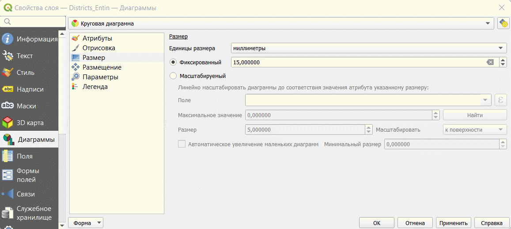
  
6. Округлите полученное максимальное значение в большую сторону до величины, кратной 100.

9. Установите максимальный размер диаграмм равным 14 мм. Диаграмма такого диаметра будет соответстовать объекту с указанным максимальным значением атрибута.

    >В QGIS есть ещё одна полезная опция — увеличение размера диаграмм. Она применяется, если при масштабировании некоторые диаграммы становятся слишком малы. В таком случае их размер увеличивается до минимального (задаваемого пользователем) порогового значения. В этом упражнении она нам не требуется

10. Перейдите на вкладку «Размещение» и проверьте, что для ваших диаграмм указана опция размещения над центроидом.

10. Перейдите на вкладку «Легенда». Здесь вы настроите комбинацию условных знаков для отображения в легенде. Нажмите кнопку «Условные обозначения для размеров диаграмм» (*Show Legend Entries for Diagram Size*).

11. Настройте отображение значков следующим образом:  
    * «Коллапсируйте» значки легенды;
    * В качестве символа используйте белый маркер круглой формы с тёмно-серой обводкой;
    * Задайте заголовок («Число домов»);
    
Интерфейс настройки диаграммы должен принять приблизительно следующий вид:
    
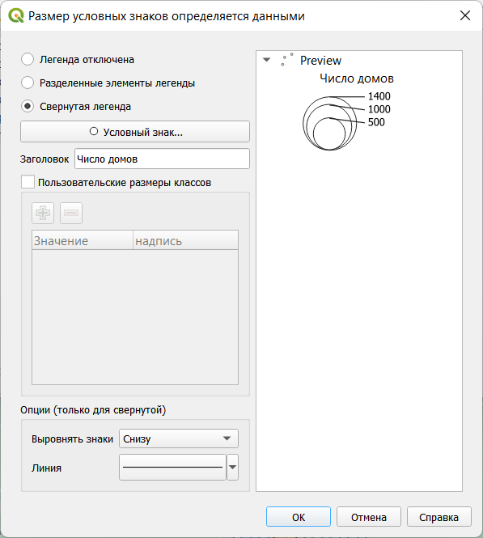
    
**Важное замечание:** такой набор значков не является картографически корректным для легенды к абсолютной непрерывной шкале значков. По состоянию на февраль 2022 г. ни один широко используемый ГИС-пакет не может сделать легенду к размерам кругов картодиаграммы согласно принятым картографическим правилам. Легенды к таким картам следует составлять или исправлять вручную.

По окончании настройки символов окно QGIS будет выглядеть следующим образом:

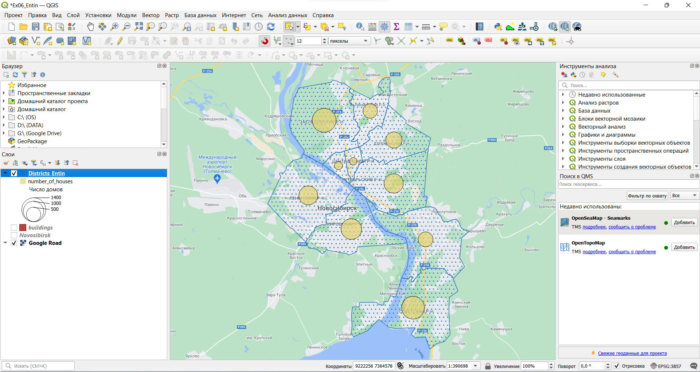

11. Самостоятельно измените настройки отображения слоёв так, чтобы базовая карта не «доминировала» над тематическим содержанием, и сделайте снимок экрана.

<kbd>В отчёт: снимок экрана №3 — окно QGIS с настроенной символикой</kbd>.

## Создание и экспорт макета компоновки {#query-layout}
[В начало упражнения ⇡](#query)

Изображение, которое вы видите во фрейме данных, можно экспортировать «как есть» (с помощью опции «Проекты» — «Импорт/экспорт» — «Экспортировать карту как изображение...»). Однако для картографических целей, как правило, формируется **компоновка карты**. На листе заданного формата размещается картографическое изображение, добавляется название, легенда, масштабная линейка и элементы зарамочного оформления. 

Сейчас мы создадим макет компоновки с расчётом на то, что итоговая карта-схема будет вставлена в отчёт.

1. Создайте новый макет компоновки («Проект» — «Создать Макет...») или `Ctrl+P`. 

2. В качестве названия макета введите свою фамилию.

  > В отличие от проектов QGIS и наборов пространственных данных, на названия макетов компоновки в QGIS не накладывается ограничений.

После ввода названия откроется окно компоновки (*Layout*)      

3. Измените ориентацию страницы с альбомной, предлагаемой по умолчанию, на портретную, соответствующую ориентации страниц отчёта. На изображении ниже показано, как это сделать.

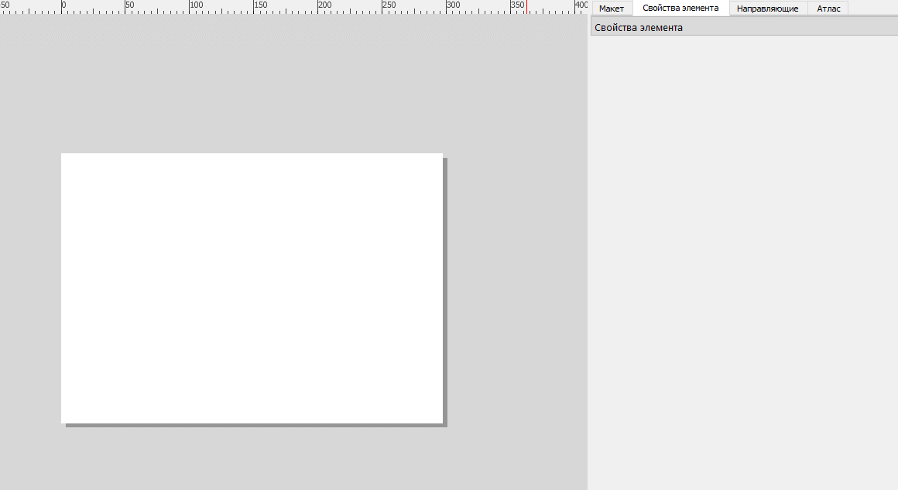

4. Добавьте картографическое изображение (фрейм карты) на макет

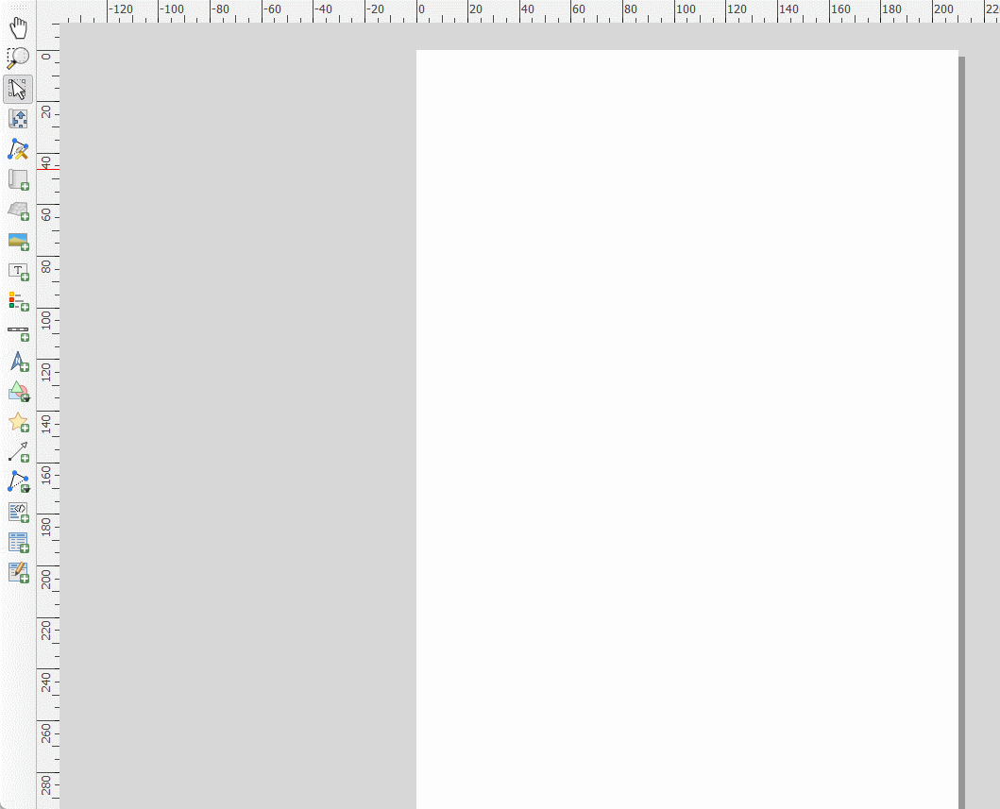

5. Измените положение и размер фрейма карты таким образом, чтобы на листе оставались поля: левое: 3 см, правое: 1,5 см.

6. Изменяя высоту фрейма, масштаб изображения, а также перемещая картографическое изображение внутри фрейма при помощи кнопки «Переместить содержимое элемента» 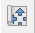, добейтесь вида фрейма, аналогичного рисунку ниже:

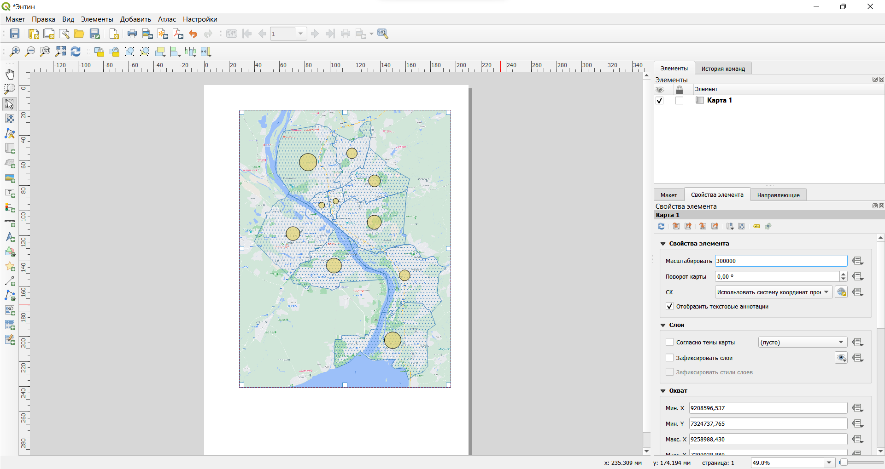

7. Не закрывая окно макета, вернитесь в основное окно QGIS и переименуйте слой районов. Назовите его «Районы Новосибирска».

8. Добавьте на макет легенду с помощью кнопки 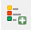. Поместите легенду в наиболее свободное место в пределах карты.

9. Отключите автообновление легенды и удалите ненужные записи, как показано на рисунке ниже:

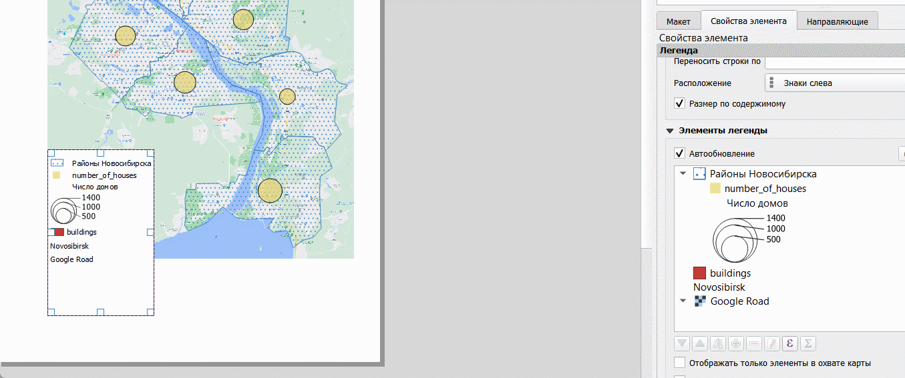

10. В свойствах элемента легенды найдите вкладку отступ и удалите (установите равным нулю) отступ под заголовком легенды.

11. Добавьте масштабную линейку с помощью кнопки 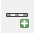. Разместите масштабную линейку в юго-западном углу изображения. При необходимости измените обозначение единиц измерения.

12. Добавьте название карты (текстовый элемент) с помощью кнопки 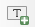. Самостоятельно выберите оптимальное место для размещения названия.

12. Экспортируйте карту-схему («Макет» — «Экспорт в Изображение» или кнопка 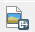) с разрешением 96 точек на дюйм (dpi). Используйте опцию «Кадрировать по содержимому» (*Crop to Content*).

    >Примечание: разрешение 96 точек на дюйм считается довольно низким для картографических целей. Изображения с таким разрешением не годятся для печати, но иногда могут быть пригодны для размещения в Интернете. ВЫ снижаете разрешение для того, чтобы сохранить читаемость базовой карты.
    
13. Вставьте полученное изображение в отчётный файл.

<kbd>В отчёт: итоговое картографическое изобаржение</kbd>
