# (PART) Геокодирование {.unnumbered}

# Адресное геокодирование и ядерная оценка плотности {#geocoding}

[Контрольный лист](https://github.com/aentin/qgis-course/raw/master/files/Ex14_%D0%BE%D1%82%D1%87%D1%91%D1%82.docx)

## Введение {#geoding-intro}

**Цель задания** --- научиться создавать новые наборы пространственных данных с использованием геокодирования

**Необходимая теоретическая подготовка:** модели пространственных данных, модели пространственных объектов, базы пространственных объектов, системы координат, геокодирование, адресное геокодирование, ядерная оценка плотности

**Необходимая практическая подготовка:** Знание основных компонент интерфейса QGIS (менеджер источников данных, таблица слоёв, фрейм карты, менеджер компоновок). Работа с различными форматами источников пространственных данных . Настройка символики и подписей объектов. Владение базовыми ГИС-технологиями.

**Исходные данные:** отсутствуют (вся необходимая информация загружается в процессе работы)

**Результат:** геокодированные точки объявлений о продаже недвижимости, карта плотности объявлений

### Контрольный лист {#geocoding-control}

-   Получить список адресов с веб-сайта в виде электронной таблицы
-   Загрузить таблицу в QGIS
-   Выполнить геокодирование с использованием сервиса Nominatim
-   Проанализировать результат, определить проблемы, мешающие геокодированию
-   Исправить таблицу в соответсвии с выявленными проблемами
-   Повторно выполнить геокодирование, получить координаты точек, заданных адресами
-   Выполнить ядерную оценку плотности полученных точек
-   Визуализировать результат в виде карты-схемы

### Аннотация {#geocoding-annotation}

Геокодирование (англ. *geocoding*) --- это определение координат объектов по их географическим текстовым описаниям, которые, как правило, выражены в виде адресов и/или почтовых кодов. Геокодирование широко применяется в тех сферах, где входящая информация поступает массово, но не имеет прямой географической привязки. Примеры такой информации: места дорожно-транспортных происшествий, адреса объектов недвижимости для продажи или сдачи в аренду, IP-адреса отправителей и получателей сообщений в сети Интернет.

Для обеспечения геокодирования необходимо иметь обширную и постоянно обновляемую базу пространственных данных, где каждому адресу сопоставлены географические координаты. Другой компонент геокодирования --- подсистема парсинга адреса, которая преобразует поданную на вход текстовую строку в вид, пригодный для автоматического распознавания геокодером.

Существует и противоположная операция --- обратное геокодирование (англ. *reverse geocoding*), в ходе которого по заданным географическим координатам определяются почтовые или сетевые адреса.

Оперативное и достоверное геокодирование представляет большой интерес для различных групп пользователей --- от служб доставок до спасателей и полиции. В то же время, для обеспечения пригодности результатов геокодирования требуется создать и поддерживать в актуальном состоянии обширную базу пространственных данных, а также предусмотреть надёжный интерфейс для обращения к сервису. Это превращает геокодирование в конкурентную бизнес-услугу. Существует ряд коммерческих сервисов, предоставляющих услуги геокодирования: [PickPoint](https://pickpoint.io/ru), [MapQuest](https://developer.mapquest.com/documentation/geocoding-api/), [LocationIQ](https://locationiq.com/geocoding); почти у всех из них есть «демонстрационный» бесплатный режим с ограничением по количеству запросов. Крупные картографические интернет-сервисы, такие, как Google Maps или Яндекс.Карты, предоставляют [свои](https://developers.google.com/maps/documentation/javascript/geocoding) [сервисы](https://yandex.ru/dev/maps/geocoder/doc/desc/concepts/about.html) геокодирования на похожих условиях. Из открытых решений популярностью пользуется сервис [Nominatim](https://nominatim.org/), использующий данные OpenStreetMap. Результаты геокодирования с помощью Nominatim проигрывают в точности и оперативности результатам коммерческих сервисов (по понятным причинам), но всё же пригодны для использования в научных и учебных целях.

Мы воспользуемся сервисом геокодирования Nominatim, чтобы нанести на карту точки, соответствующие объявлениям о продаже недвижимости, предоставленные сайтом [ЦИАН](https://www.cian.ru/).

## Получение исходных данных {#geocoding-input}

[В начало упражнения ⇡](#geocoding)

В качестве исходных данных в этом упражнении мы будем использовать выгрузку объявлений с сайта [ЦИАН](https://www.cian.ru/). Перед началом упражнения следует выбрать охват территории, на которую будет производиться выгрузка. На примерах, приведённых ниже, показаны микрорайоны Московский и Мервино города Рязань. В соответствии с указаниями преподавателя, ваш индивидуальный вариант может быть другим.

1.  Откройте сайт [ЦИАН](https://www.cian.ru/)

2.  В выпадающих списках главной страницы выберите опции поиска, соответствующе следующему запросу: «*Купить квартиру на вторичном рынке, любой планировки, любой цены*»

3.  Нажмите на кнопку «Показать на карте». Отобразите карту таким образом, чтобы охват территории соответствал вашему варианту задания.

    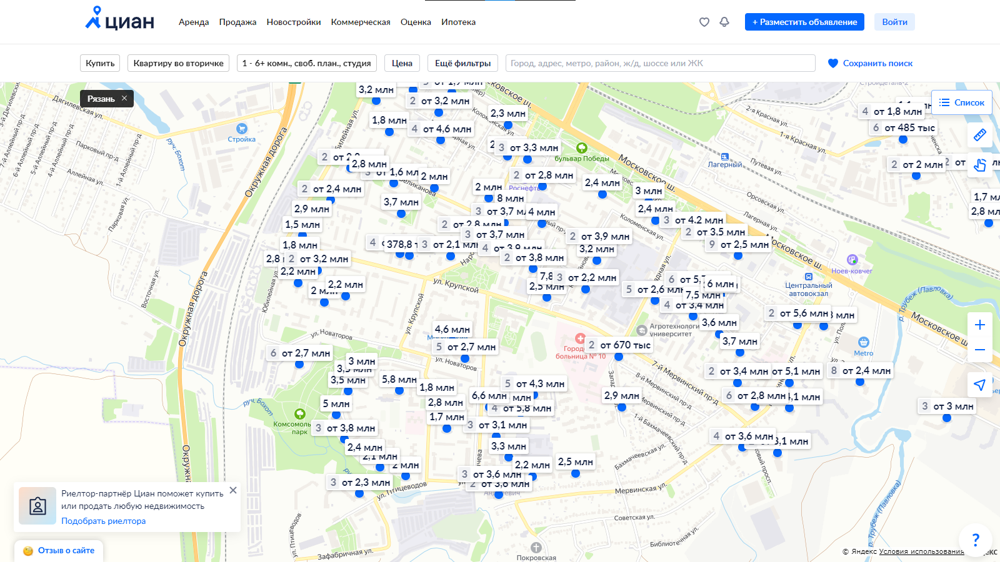

4.  Нажмите кнопку «Список» в правой части экрана. Под заголовком списка найдите число объявлений, найденных в текущем охвате.

    

5.  Для дальнейшей работы нам нужно, чтобы в вашей подборке было примерно 200 объявлений. Если в списке около 200 объявлений, переходите на следующий шаг инструкции. Если в списке меньше 150 или больше 250 объявлений, вернитесь в окно карты и измените экстент поиска, чтобы в него попало больше или меньше объявлений, а затем снова перейдите в окно списка.

6.  Найдите внизу списка кнопку «Сохранить файл в Excel» и нажмите на неё. Файл со списком будет загружен на ваш компьютер под именем `offers.xlsx`

    

>Примечание: для загрузки файла Excel требуется зарегистрироваться. Если вы по каким-то причинам не можете или не хотите этого делать, обратитесь за помощью к преподавателю.

7.  Создайте рабочую директорию и переместите в неё загруженный файл

8.  Откройте список любым табличным редактором (например, Microsoft Excel или LibreOffice Calc).

    

9.  Найдите в загруженном файле столбец, в котором записан адрес квартиры.

На следующих шагах вы выполните геокодирование адресов и соедините полученные пространственные объекты с текстовой информацией.

## Тестирование работы сервиса геокодирования {#geocoding-debug}

[В начало упражнения ⇡](#geocoding)

Прежде чем начинать «пакетное» геокодирование всего списка, мы возьмём несколько отдельных адресов из него и проверим, насколько хорошо работает сервис распознавания адресов Nominatim. Для этого мы воспользуемся страницей интерфейса отладки Nominatim.

1.  Откройте страницу интерфейса отладки Nominatim по [этой ссылке](https://nominatim.openstreetmap.org/ui/search.html)

    

2.  Скопируйте любой адрес из вашей таблицы и вставьте его в строку поиска (*Search*). Нажмите кнопку **Search**, чтобы запустить поиск

    Дальнейшее поведение системы зависит от того, насколько успешно парсер смог «прочитать» адрес. Если вся строка адреса распознана корректно, то в окне карты будет отображён объект, соответствующий найденному адресу.

    

    Если с распознаванием адресов возникли какие-либо трудности, то их можно отследить по выдаче. На рисунке ниже в адресе `Рязанская область, Рязань, улица Костычева, 8к1` распознал всё, кроме номера дома, и выдал в качестве результата объект, соответствующий улице.

    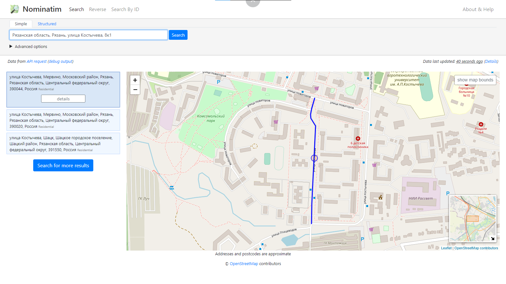

    В этом примере достаточно поставить пробел между номером дома и номером корпуса (`8 к1`), и Nominatim отработает корректно.

    

    В худшем случае геокодер вообще не сможет определить адрес. В примере ниже (`Рязанская область, Рязань, улица Надежды Крупской, 11`) геокодер «сломался» уже на названии улицы.

    

    В этом примере проблема кроется в названии улицы. В Рязани действительно есть улица, названная именем [Надежды Крупской](https://ru.wikipedia.org/wiki/%D0%9A%D1%80%D1%83%D0%BF%D1%81%D0%BA%D0%B0%D1%8F,_%D0%9D%D0%B0%D0%B4%D0%B5%D0%B6%D0%B4%D0%B0_%D0%9A%D0%BE%D0%BD%D1%81%D1%82%D0%B0%D0%BD%D1%82%D0%B8%D0%BD%D0%BE%D0%B2%D0%BD%D0%B0), но в OpenStreetMap она называется `улица Крупской`. С точки зрения Nominatim, `улица Надежды Крупской` и `улица Крупской` --- это разные улицы. Если изменить запрос на `Рязанская область, Рязань, улица Крупской, 11`, Nominatim выдаст корректный результат.

    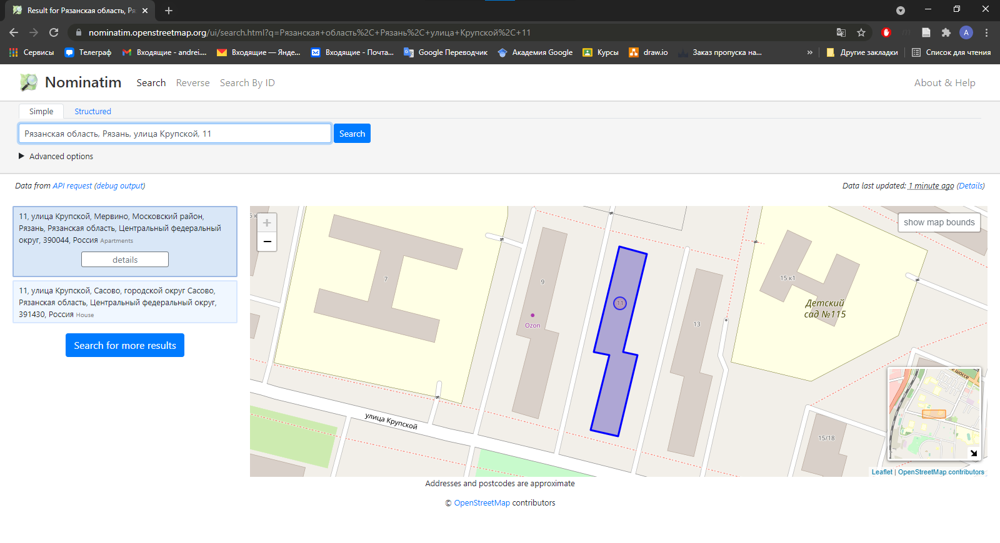

3.  Подберите три аналогичных примера из вашего набора исходных данных и сделайте скриншоты выдачи сервиса отладки Nominatim.

<kbd>**Снимок экрана №1:** успешное распознавание адреса сервисом Nominatim (в ответ на запрос выводится правильный дом)</kbd>

<kbd>**Снимок экрана №2:** неточное или неполное распознавание адреса (в ответ на запрос выводится улица, или неправильный дом, или правильный адрес, но в другом населённом пункте)</kbd>

<kbd>**Снимок экрана №3:** полностью неудачная попытка распознавания (пустая выдача)</kbd>

Мы рассмотрели некоторые потенциальные проблемы с распознаванием адресов, которые возникают при использовании сервиса Nominatim. Следует заметить, что другие, более «продвинутые» сервисы геокодирования могут автоматически распознавать и разрешать проблемы такого рода.

## Импорт списка адресов в QGIS {#geocoding-import}

[В начало упражнения ⇡](#geocoding)

В предыдущих упражнениях вы импортировали табличную информацию в QGIS, пользуясь форматом Comma-Separated Values (CSV). В этом упражнении вы импортируете данные напрямую из таблицы Excel, пользуясь подключаемым модулем **Spreadsheet Layers**.

1.  Создайте проект QGIS и сохраните его в своей рабочей директории

2.  Используя функционал модуля QuickMapServices, подключите к проекту QGIS базовую карту OpenStreetMap.

3.  Установите модуль Spreadsheet Layers. Модуль доступен в репозитории QGIS, поэтому достаточно ввести его имя в строке поиска.

    

4.  После установки модуля найдите опцию импорта табличных данных: меню «Слой» --- «Добавить слой» --- «Add Spreadsheet Layer».

    

5.  В открывшемся окне укажите путь к файлу Excel и страницу, с которой требуется загрузить данные. Выходной слой назовите по шаблону `offers-%Фамилия%`, где `%Фамилия%` --- ваша фамилия латинскими буквами

    

    При необходимости на этом этапе можно изменить типы данных для столбцов, но в нашем упражнении такой необходимости нет.

6.  Нажмите OK, чтобы добавить слой к проекту QGIS.

7.  Откройте таблицу атрибутов слоя и убедитесь, что данные из таблицы Excel отображаются корректно.

    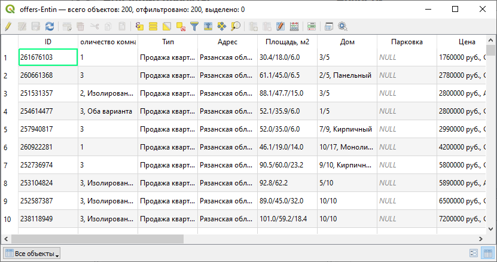

## Установка модуля пакетного геокодирования {#geocoding-batch-install}

[В начало упражнения ⇡](#geocoding)

Интерфейс отладки, который мы использовали на ранее, пригоден для геокодирования отдельных адресов, но неудобен для пакетного геокодирования, когда нужно распознавать несколько сотен адресов.

Для решения задача пакетного геокодирования на базе QGIS и Nominatim разработано несколько модулей. Мы воспользуемся модулем [Bulk Nominatim QGIS Plugin](https://github.com/NationalSecurityAgency/qgis-bulk-nominatim). В отличие от модуля Spreadsheet Layers, этот модуль не содержится в репозитории QGIS, поэтому его придётся установить из ZIP-архива.

1.  Перейдите на [страницу модуля Bulk Nominatim QGIS Plugin на GitHub](https://github.com/NationalSecurityAgency/qgis-bulk-nominatim):

    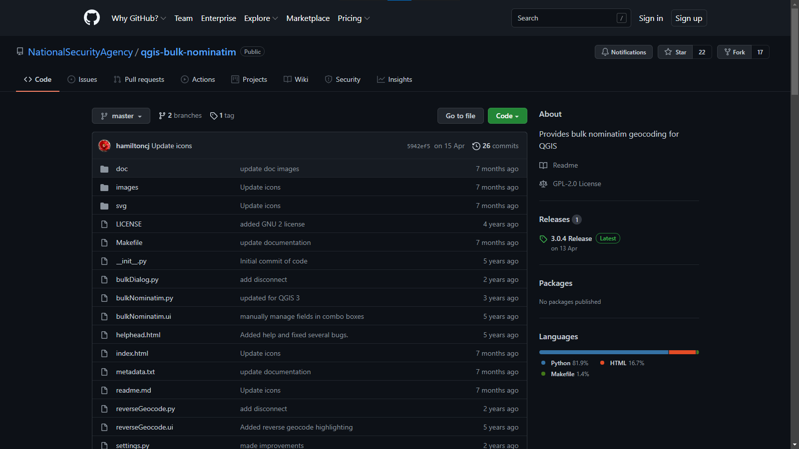

2.  Нажмите на кнопку «Code» и в открывшемся выпадающем списке выберите «Download ZIP».

    

3.  Перенесите загруженный ZIP-архив в вашу рабочую директорию.

4.  Вернитесь в QGIS и установите модуль из ZIP-файла

    

После установки модуля его инструменты будут доступны через меню «Модули» --- «Nominatim GeoCoding» или при помощи кнопок  на панели инструменов.

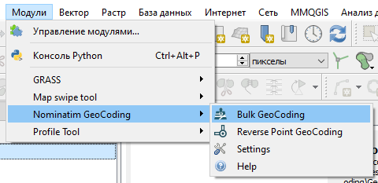

## Пакетное геокодирование {#geocoding-batch}

[В начало упражнения ⇡](#geocoding)

Теперь, когда вы установили инструмент для пакетного геокодирования, можно попытаться выполнить распознавание адресов при помощи Nominatim.

1.  Откройте интерфейс настройки модуля Bulk Geocoding («Модули» --- «Nominatim GeoCoding» --- «Settings»). Установите максимальное число объектов для геокодирования (*Maximum Features to Geocode*) равным $200$.

    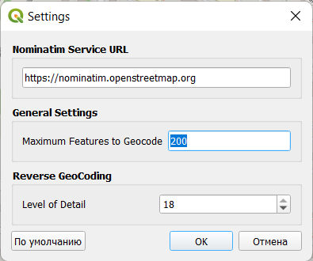

2.  Запустите инструмент Bulk GeoCoding. В открывшемся окне укажите исходный слой и поле, из которого будут взяты адреса.

    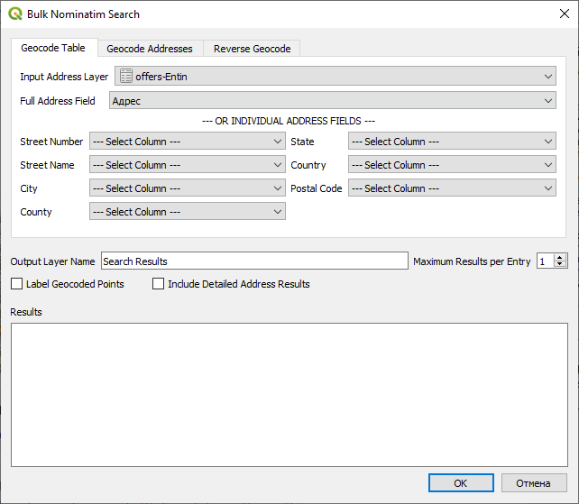

3.  Убедитесь, что вы подключены к Интернету.

4.  Нажмите кнопку OK, чтобы запустить процесс пакетного геокодирования. Не закрывайте окно инструмента.

    Результат геокодирования будет представлен в виде временного точечного слоя.

5.  Когда инструмент завершит работу, обратите внимание на выдачу в поле Results. В этом поле отображаются адреса, которые не удалось распознать. Скопируйте эти адреса в отдельный текстовый документ и сохраните этот документ в вашу рабочую директорию.

    

6.  Закройте окно инструмента и изучите распределение точек, которые были созданы в ходе геокодирования.

    На рисунке ниже все точки адресов, за исключением двух, группируются в северо-западной части карты. Две отлетающих точки попали в другие населённые пункты.

    

    Но и среди точек, попавших в правильный населённый пункт, есть ситуации некорректного и неточного распознавания. При правильном распознавании точка устанавливается поверх здания, имеющего соответствующий адрес. Если точка располагается поверх линейного объекта, как на рисунке ниже, это тоже следует считать ошибкой: распознано название улицы, но не распознан номер дома.

    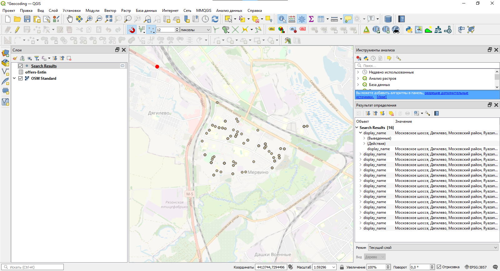

7.  Сделайте скриншот окна QGIS после первой попытки геокодирования. Покажите полный охват точечного слоя.

    <kbd>**Снимок экрана №4:** Результат геокодирования исходной таблицы адресов</kbd>

    На следующих шагах мы постараемся систематизировать ситуации, которые приводят к некорректным распознаваниям, и внести правки в соответствующие записи. Строго говоря, правки можно сделать непосредственно в Excel, но, поскольку одной из наших задач является освоение геоинформационного ПО, мы воспользуемся возможностями QGIS.

8.  Сохраните слой под именем `offers` (вашу таблицу с адресами) в формат GeoPackage. Для этого в контекстном меню слоя выберите «Экспорт» --- «Сохранить объекты как...». В открывшемся окне укажите имя выходного файла (`geocoding_%Фамилия%`) и имя слоя (`input_table_%Фамилия%`). В разделе «Геометрия» обязательно установите тип «Без геометрии». Убедитесь, что опция «Добавить слой в проект» включена.

    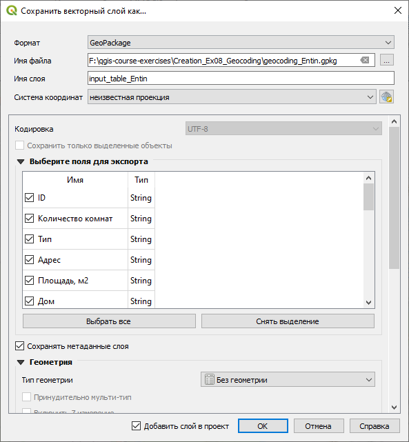

9.  После добавления слоя удалите из проекта старую таблицу, а новый слой переименуйте, убрав из названия имя выходного файла.

10. Изучите списки адресов, которые не были геокодированы или были кодированы с ошибками. Определите возможные причины ошибок.

    В каждом наборе исходных данных причины ошибок могут быть разными. В демонстрационном наборе наиболее заметны следующие причины:

    a.  Несовпадения в названиях улиц. Например, Nominatim не распознаёт такие записи, как `улица Надежды Крупской` или `Улица Александра Полина`. Вместо них следует подставить `улица Крупской` и `улица Полина`, соответственно;

    b.  Пунктуация в номерах домов. В OpenStreetMap литеры, корпуса, владения и другие «дополнительные» элементы номера дома традиционно вносятся через пробел, например `8 к2`. В исходной же таблице эти элементы написаны слитно (`8к2`).

11. Используя **калькулятор полей**, отредактируйте поле адресов, чтобы привести адреса в вид, пригодный для использования с Nominatim.

    В приведённых выше примерах это делается следующим образом:

    a.  Проблема с полным названием улицы решается использованием строковой функции `replace`, которая заменяет одну подстроку другой:

    `replace("Адрес", 'улица Надежды Крупской', 'улица Крупской')`

    `replace("Адрес", 'улица Александра Полина', 'улица Полина')`

    b.  Чтобы отделить номер корпуса от номера дома, замена с помощью `replace` уже не поможет, потому что нужно вставить пробел не перед каждой буквой `к`, а только перед теми, которые содержатся в номере дома. Здесь нам на помощь придут [регулярные выражения](https://ru.wikipedia.org/wiki/%D0%A0%D0%B5%D0%B3%D1%83%D0%BB%D1%8F%D1%80%D0%BD%D1%8B%D0%B5_%D0%B2%D1%8B%D1%80%D0%B0%D0%B6%D0%B5%D0%BD%D0%B8%D1%8F) и функция QGIS `regexp_replace`. Выражение, приведённое ниже, ищет вхождения буквы `к`, стоящие после любой цифры (`0 - 9`), и заменяет его на `\_к` (т.е. ставит пробел перед буквой):

    `regexp_replace("Адрес", '(.*[0-9])к(.*)', '\\1 к\\2')`

    Подробное изучение операторов и синтаксиса регулярных выражений выходит за рамки нашего курса.

12. После внесения необходимых правок в поле «Адрес» удалите из списка слоёв предыдущий результат геокодирования, а затем выполните геокодирование повторно.

13. Изучите новый результат геокодирования. Если из 200 имеющихся адресов корректно распознано менее 150, повторите шаги 11--12. Добейтесь корректного позициронирования по крайней мере 150 адресов.

    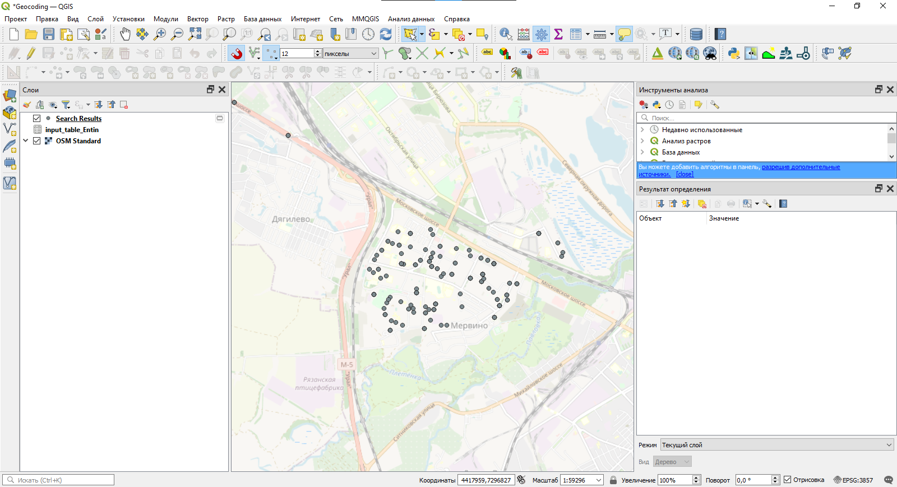

14. После получения пригодного результата перепроецируйте его в подходящую систему координат («Вектор» --- «Управление данными» --- «Перепроецировать слой...») и сохраните в тот же GeoPackage, где лежит исходная таблица. Назовите его `points`.

15. Удалите временный слой с результатом распознавания из таблицы слоёв

16. Запустите редактирование слоя точек и удалите все точки, которые находятся за пределами вашего участка. После удаления увеличьте изображение до охвата слоя и сделайте снимок экрана и ответьте на контрольный вопрос.

<kbd>**Снимок экрана №5:** Результат геокодирования отредактированной таблицы адресов</kbd>

## Картографирование плотности объявлений {#geocoding-mapping}

[В начало упражнения ⇡](#geocoding)

В результате геокодирования вы получили набор точек, каждая из которых соответствует одному объявлению о продаже недвижимости. При этом точки объявлений с одинаковым адресом будут иметь полностью совпадающие координаты. Поэтому визуальное отображение адресов даёт искажённое представление о распределении продаваемой недвижимости по территории.

Чтобы получить более достоверное распределение, можно перейти от дискретного представления явления (отдельные точки) к континуальному представлению (поле плотности). Для решения этой задачи применяется ядерная оценка плотности (*kernel density estimation*). Результатом ядерной оценки плотности является растр (регулярная сетка), каждая ячейка которой характеризует плотность явления или его ожидаемое количество.

> Примечание: результат ядерной оценки плотности зачастую называют «тепловой картой» или «теплокартой», поскольку при удачно подобранных графических средствах области высокой концентрации явления выглядят «яркими», «горячими», а области низкой концентрации --- «тёмными», «холодными». Несмотря на широкое распространение этих названий, мы не рекомендуем пользоваться ими в географических исследованиях, чтобы избежать путаницы с картами климатических и метеорологических характеристик, где «тепло» и «холодно» используются в прямом смысле.

Для выполнения ядерной оценки плотности в QGIS имеется инструмент **Тепловая карта (оценка плотности ядер)**. Его можно найти в панели инструментов анализа, в разделе «Интерполяция»

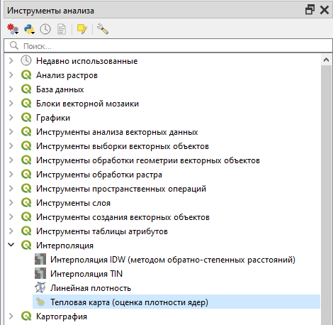

1.  Запустите инструмент ядерной оценки плотности. В качестве исходного слоя задайте геокодированные точки

2.  Проверьте предлагаемое значение в поле «Радиус». Если возле поля «Радиус» изображён предупреждающий знак, а предлагаемая единица измерения --- градусы, значит, ваш исходный слой сохранён в географической системе координат. Выполните перепроецирование слоя (шаг 14 предыдущего раздела).

3.  Если с единицами измерения всё в порядке, установите радиус равным 250 м. Это охват области, на которую будет «распределяться» плотность точек.

4.  Установите размер пиксела по X и по Y равным 5 м. Этого вполне достаточно для аппроксимации.

5.  Укажите, что результирующий слой (*Heatmap*) нужно сохранить в вашу рабочую директорию под именем `heatmap_%Фамилия%.tif`, где `%Фамилия%` --- ваша фамилия латинскими буквами

    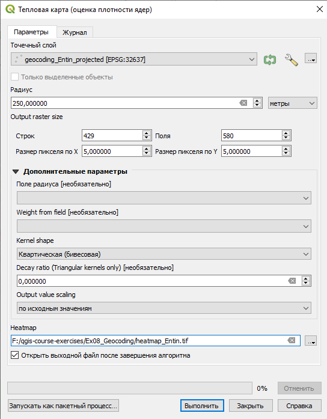

6.  Запустите инструмент ядерной оценки плотности и дождитесь, пока результат оценки будет добавлен к карте. После этого закройте инструмент ядерной оценки плотности.

    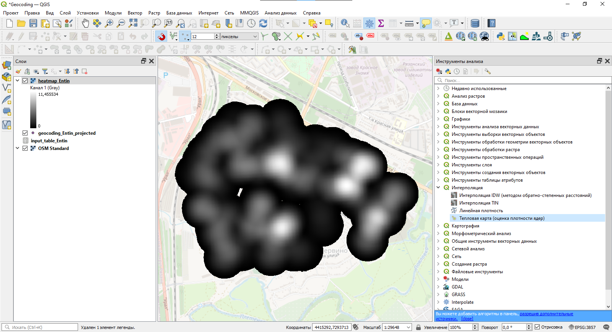

7.  Поместите слой исходных точек над слоем ядерной оценки плотности.

8.  Откройте свойства слоя ядерной оценки плотности на вкладке «Стиль». Измените цветовую схему на «Одноканальное псевдоцветное». Округлите максимальное отображаемое значение вверх до ближайшего целого числа, кратного 5. Измените тип интерполяции на «Линейную», задайте точность подписи равной 0, режим классификации --- «Равные интервалы». Установите число интервалов, равное или пропорциональное максимальному значению.

    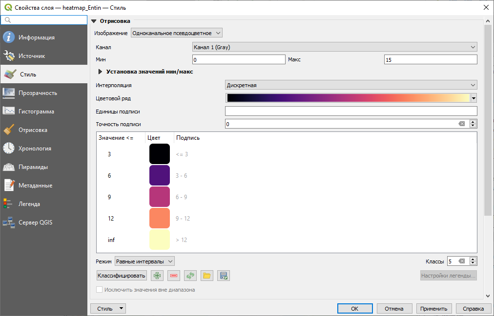

9.  Нажмите правой кнопкой на изображение шкалы (градиента) и активируйте опцию «Инвертировать градиент».

10. Перейдите на вкладку «Прозрачность» и установите прозрачность слоя равной 50 %.

    В результате применения описанных настроек вы получите изображение ядерной оценки, аналогичное представленному ниже:

    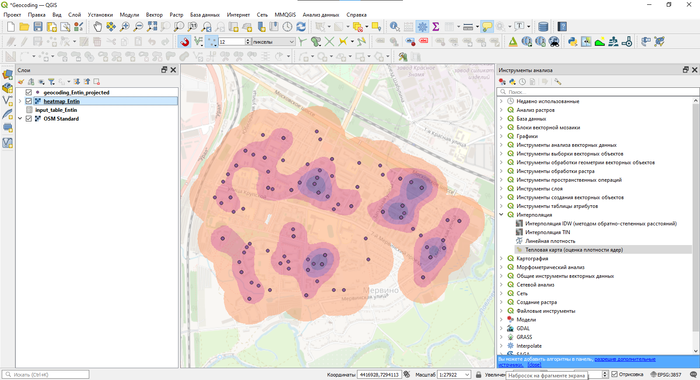

11. Сделайте снимок экрана.

<kbd>**Снимок экрана №6:** Ядерная оценка плотности объявлений о продаже недвижимости</kbd>

12. Создайте картографическое изображение на основе имеющихся пространственных данных. Создайте макет компоновки, добавьте на него картографическое изображение, легенду, масштабную линейку, название карты и сведения об авторстве. Для картографического изображения настройте градусную сетку. В легенде сохраните только те условные знаки, которые соответствуют тематическому содержанию карты.

13. Экспортируйте карту в формат PNG и вставьте её в отчёт.

<kbd>**Рисунок 7:** Карта-схема плотности объявлений о продаже недвижимости</kbd>

14. Ответьте на контрольные вопросы в отчётном файле.
