# (PART) Векторный анализ {-}

# Геометрические операции с векторными объектами {#geometry}

[Архив с исходными данными](https://github.com/aentin/qgis-course/raw/master/files/Ex08.zip)

[Контрольный лист](https://github.com/aentin/qgis-course/raw/master/files/Ex08_%D0%BE%D1%82%D1%87%D1%91%D1%82.docx)

## Введение {#geometry-intro}

**Цель задания** — определить территории, непригодные для нового  капитального строительства, используя операции векторного анализа и оверлея.

**Необходимая теоретическая подготовка:** Буферные зоны, слияние (объединение по признаку), соединение таблиц, ключи соединения, векторный оверлей.

**Необходимая практическая подготовка:** Знание основных компонент интерфейса QGIS (менеджер источников данных, таблица слоёв, фрейм карты, менеджер компоновок). Работа с векторными источниками пространственных данных. Настройка символики и подписей объектов. Владение базовыми ГИС-технологиями.

**Исходные данные:** База пространственных данных на территорию части Ленинградской области.

**Результат:** Карта-схема участков Ленинградской области, пригодных для сооружения нового промышленного объекта.

### Контрольный лист {#geometry-control}

* Объединить контура карты четвертичных отложений
* Выбрать участки с грунтами, пригодными для строительства
* Построить буферные зоны вокруг объектов гидрографической сети
* Построить буферные зоны вокруг объектов дорожной сети
* Построить буферные зоны вокруг особо охраняемых природных территорий
* Получить контура застройки путём выбора объектов кадастрового деления
* Последовательно исключить из участков, пригодных для строительства, контура, образованные лимитирующими условиями

### Аннотация {#geometry-annotation}

Задание посвящено знакомству с пространственным анализом на основе векторных данных. Векторная модель представляет объекты в виде отдельных геометрических фигур с набором атрибутов. Она является объектно-ориентированной и удобна для анализа формы, размеров объектов, их взаимной конфигурации в пространстве. Используя векторное представление, можно рассчитывать длины и площади объектов, строить вокруг них буферные зоны, объединять объекты, имеющие одинаковые значения атрибутов. 

В этом задании вы изучите работу некоторых инструментов векторного анализа на примере задачи определения территорий, доступных для ведения нового капитального строительства. В рамках задания предполагается, что такое строительство может вестись только на территориях с грунтами, подходящими по литологическому составу, и не может производиться на территориях с теми или иными ограничениями: на землях особо охраняемых природных территорий и в их охранных зонах, в водоохранных зонах рек и озёр, а также на землях, уже занятых жилой застройкой. Следует отметить, что набор критериев, применяемых для решения этой задачи в реальной практике, значительно более обширен и детализирован, однако мы считаем сделанные упрощения допустимыми в методическом отношении.

## Объединение контуров схемы четвертичных отложений {#geometry-dissolve}
[В начало упражнения ⇡](#geometry)

1. Создайте проект QGIS и сохраните его в своей рабочей директории.

2. Добавьте в проект таблицу `q_deposit_polygon` из базы данных `LenObl.gpkg`.

    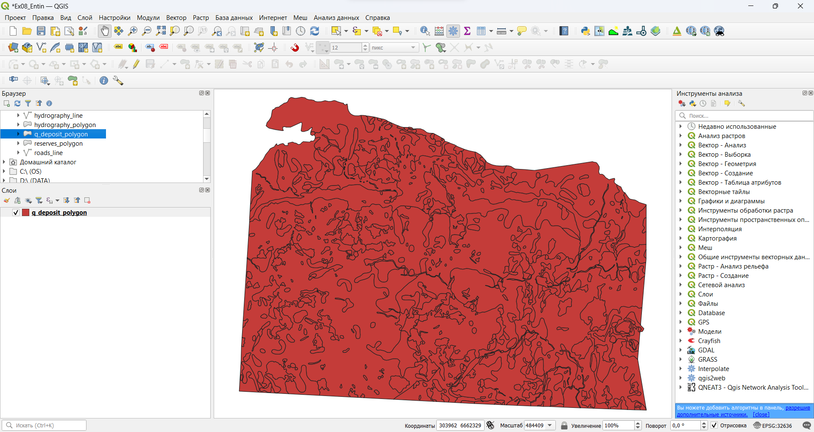
    
3. Переименуйте слой в «Четвертичные отложения» и изучите таблицу атрибутов добавленного слоя.

    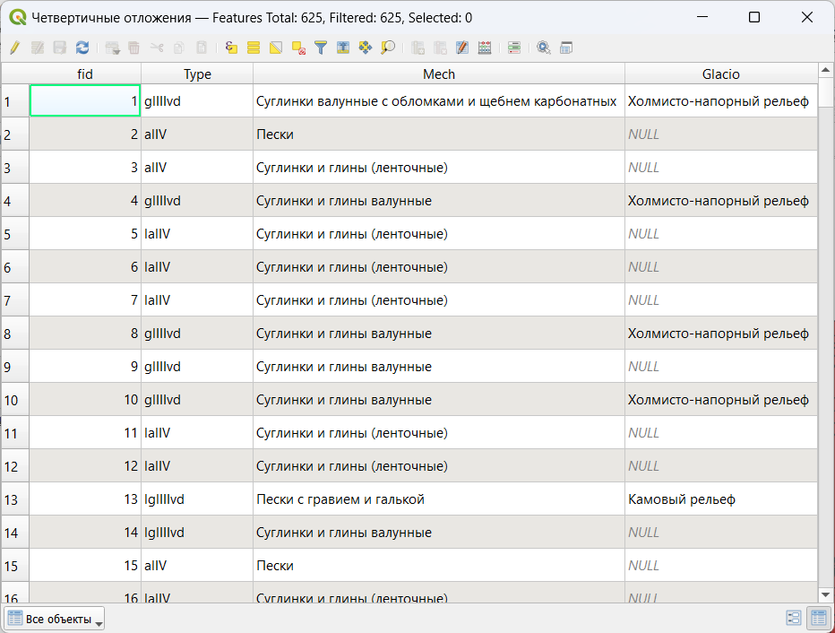
    
    Вы можете заметить, что каждый контур схемы четвертичных отложений содержит разнообразную информацию, включая индекс с исходной карты, характеристику механического состава грунта и (для некоторых контуров) генезис рельефа. Для решения задачи нам достаточно знать только механический состав грунта. Мы можем объединить контура, имеющие одинаковый механический состав грунта («стереть границы») между ними, с помощью процедуры слияния (объединения по признаку).
    
4. Запустите инструмент слияния («Вектор» — «Геоообработка» — «Объединение по признаку...»).

    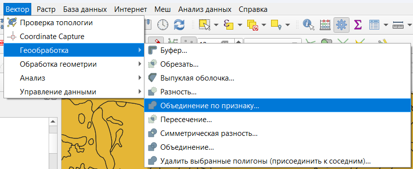

5. Настройте параметры инструмента слияния следующим образом:

    * **Исходный слой:** Четвертичные отложения
    * **Поля классификации:** выберите поле (столбец таблицы атрибутов), которое содержит информацию о механическом составе грунта
    * Опцию **Сохранять несовпадающие элементы раздельно** оставьте выключенной
    * **Объединённый слой:** в выпадающем меню кнопки справа выберите вариант «Сохранить как GeoPackage...». Сохраните новый GeoPackage в вашу рабочую директорию под именем `Ex08_*Фамилия*`, где *Фамилия* — ваша фамилия. После указания имени GeoPackage появится всплывающее окно, где нужно будет указать имя созаваемой таблицы внутри нового GeoPackage. Введите имя `ground` и нажмите OK
    
    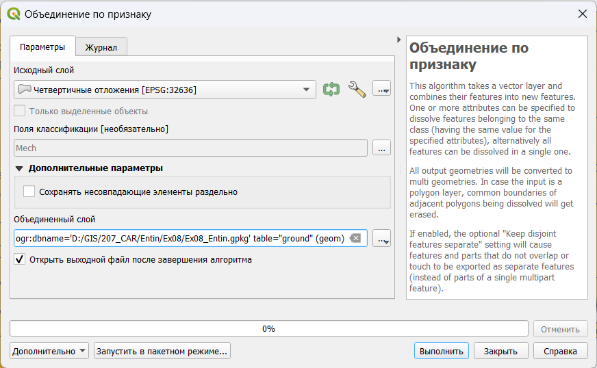
    
    >Примечание: сейчас мы фактически создаём новую базу данных, в которую будем записывать все результаты геоинформационного анализа, получаемые в ходе этого упражнения. В дальнейшем она будет часто упоминаться в упражнении под названием «созданная база данных».
    
5. Запустите инструмент и дождитесь, когда результат работы будет добавлен в проект. Переименуйте новый слой в «Типы грунта».

    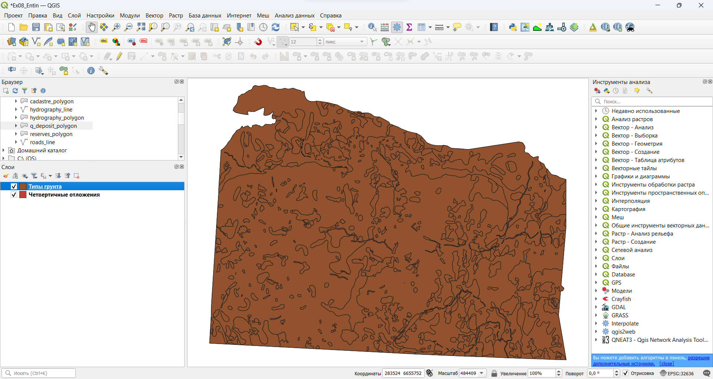

6. Изобразите результат слияния способом качественного фона (символизация по уникальным значениям). Исходный слой четвертичных отложений отобразите при помощи тонкой обводки чёрного цвета без заливки. Расположите слой четвертичных отложений над слоем типов грунта и сделайте снимок экрана.

<kbd>**Снимок экрана №1.** Результат слияния (объединения по признаку)</kbd>

**Вопрос №1**: как был изменён исходный набор данных в ходе слияния?

## Построение буферных зон постоянной ширины {#geometry-buffer}
[В начало упражнения ⇡](#geometry)

По условию задания необходимо исключить из рассмотрения территории, находящиеся в водоохранных зонах. Согласно п. 4 [статьи 65 Водного кодекса Российской Федерации](http://www.consultant.ru/document/cons_doc_LAW_60683/4c65ff0f232195d8dccc08535d2c3923d5b67f1c/), ширина водоохранной зоны для рек или ручьёв различается в зависимости от их протяжённости от истока до устья, а согласно п. 6 той же статьи ширина водоохранной зоны для водоёмов небольшой площади составляет 50 м. Мы определим положение искомых территорий с помощью построения буферных зон.

### Буферные зоны постоянной ширины {#geometry-buffer-constant}

1. Добавьте в проект таблицы `hydrography_line` и `hydrography_polygon` из исходного набора данных. Переименуйте слои в «Водотоки» и «Водоёмы» соответственно. Измените стили слоёв, чтобы сделать изображение похожим на изображение гидрографической сети на общегеографических картах. Слои четвертичных отложений и грунтов пока отключите.

    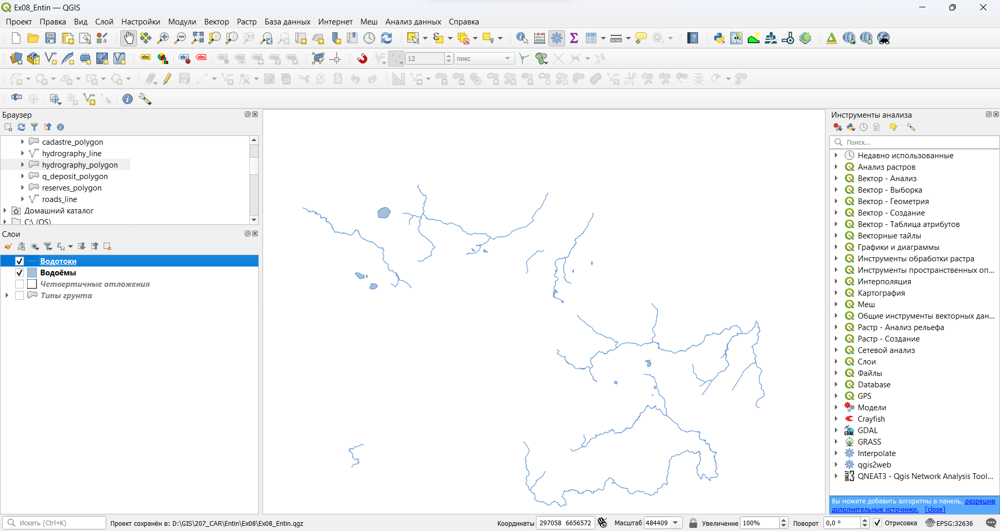

2. Постройте буферные зоны радиусом 50 м вокруг водоёмов. Для этого запустите инструмент построения буферных зон («Вектор» — «Геообработка» — «Буфер...»).
    
    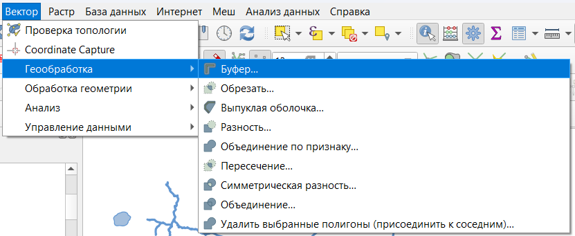
    
3. В окне инструмента введите следующие параметры:
   
    * **Исходный слой:** Водоёмы
    * **Расстояние:** 50 м
    * **Результат буферизации** сохраните в тот же GeoPackage, который вы создали на предыдущем шаге, под именем `hydrography_polygon_buffer_50m`.
    Для остальных параметров сохраните значения по умолчанию
    
    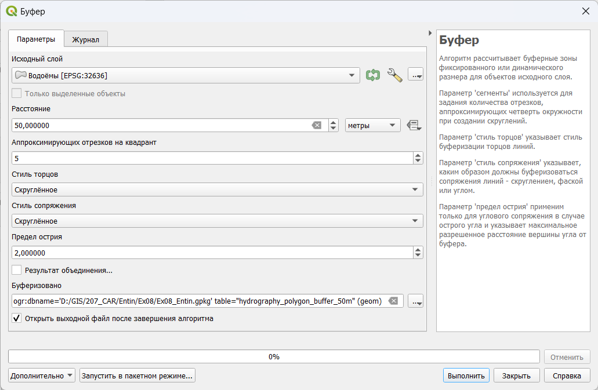
    
4. Запустите инструмент и дождитесь, когда результат геообработки добавится в проект.

    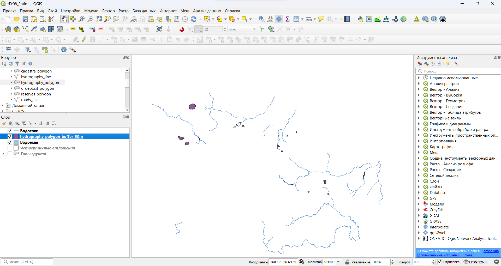

### Построение буферных зон переменной ширины {#geometry-buffer-variable}

Ширина водоохранной зоны для рек зависит от их протяжённости. Для рек протяжённостью до 10 км ширина составляет 50 м, от 10 до 50 км – 100 м, свыше 50 км — 200 м. Мы рассчитаем протяжённость каждой реки и запишем её в таблицу атрибутов, а затем используем калькулятор полей, чтобы задать для каждого объекта собственный размер буферной зоны.

1. Добавьте атрибуты геометрии в таблицу атрибутов слоя «Водотоки». Для этого используйте инструмент «Добавить атрибуты геометрии...» («Вектор» — «Обработка геометрии» — «Добавить атрибуты геометрии...»). Этот инструмент создаёт новый набор данных, дополняя таблицу атрибутов характеристиками геометрии объектов. Сохраните новый набор данных в созданный ранее GeoPackage под именем `hydrography_line`.

    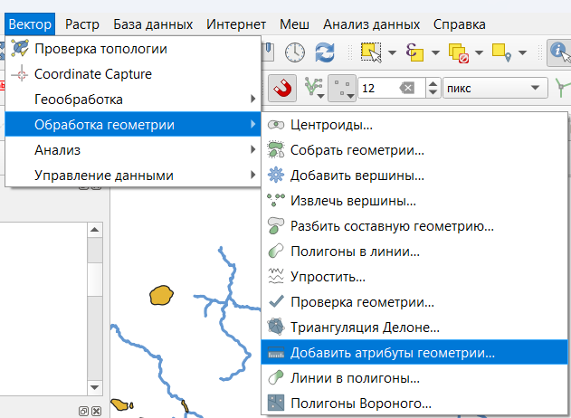

2. Когда результат обработки будет добавлен в проект QGIS, удалите «старый» слой водотоков, а «новый» переименуйте в «Водотоки» и настройте его символику.

3. Откройте таблицу атрибутов слоя водотоков. Найдите поле length и определите, в каких единицах измеряется и в каких пределах изменяется длина водотоков.

4. Теперь нам необходимо создать новое поле, в котором будет записан целевой радиус буферной зоны. Для этого мы воспользуемся калькулятором полей. Его можно вызвать комбинацией клавиш `Ctrl+I` или нажатием на кнопку 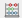 в панели инструментов или в таблице атрибутов.

    Калькулятор полей используется для вычисления новых значений атрибутов объектов на основе имеющихся пространственных и семантических характеристик. Его интерфейс аналогичен интерфейсу атрибутивного запроса.
    
    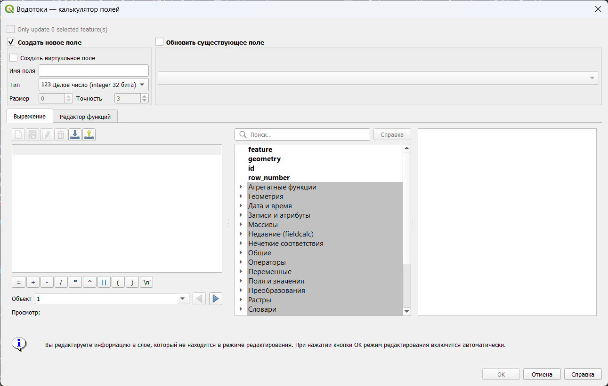
    
5. В верхней части окна калькулятора полей задаётся целевое поле для записи вычисленных значений. Это может быть как новое поле, так и уже существующее поле. Если вам необходимо создать новое поле, то следует ввести его название и указать тип данных. Название поля должно быть записано латиницей, не включать пробелы и специальные символы, а также не должно начинаться с цифры. Поскольку вам предстоит рассчитать целевой радиус буферной зоны, назовите поле `buffer_radius`. Тип поля укажите самостоятельно.

6. Основная часть окна калькулятора полей разделена на три формы. Левая форма служит непосредственно для ввода выражения. В центральной форме собраны все доступные функции, а также поля таблицы атрибутов. В правой форме отображается справка по функциям и вспомогательные формы для полей. 

    Вам необходимо ввести выражение, которое будет выдавать разный результат в зависимости от значения в поле `length`. Для этого используется функция CASE из раздела «Условные».
    
7. Разверните группу функций «Условные» в средней форме и дважды щёлкните по названию функции **CASE**. В конструктор формул добавится следующая строка: 
    
    `CASE WHEN condition THEN result END`

    Это образец синтаксиса функции. Вместо `condition` подставляется условие, вместо `result` — результат вычисления. Инструкция `CASE` открывает блок условия, инструкция `END` закрывает его. Можно вынести эти инструкции в отдельные строки, а промежуточную часть скопировать и вставить несколько раз.
    
    ```
    CASE 
    WHEN condition THEN result 
    WHEN condition THEN result 
    WHEN condition THEN result 
    END
    ```
    
    Теперь будем заполнять выражение нужными значениями. Например, если длина водотока меньше 10 км (10 000 м), то радиус буферной зоны должен быть равен 50. Длина водотока записана в поле `length`, поэтому блок условия будет выглядеть так:
    
    `WHEN "length" <=10000 THEN 50`
    
    Введите это условие, а затем все остальные необходимые условия по образцу. Если необходимо, вы также можете воспользоваться оператором ELSE, который обрабатывает все значения, не покрытые основным набором условий.
    
    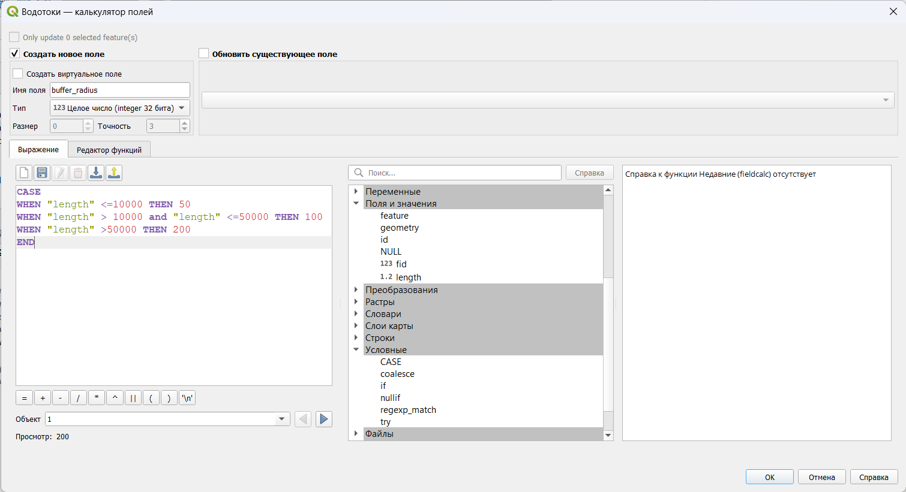

8. Нажмите ОК, чтобы выполнить расчёт. По окончании расчёта сохраните изменения в наборе и выключите режим редактирования. Посмотрите, что изменилось в таблице атрибутов.

9. Теперь мы используем рассчитанные значения радиусов непосредственно для построения буферных зон. Запустите инструмент создания буферных зон и задайте слой водотоков в качестве исходного набора данных. Чтобы задать радиус поиска из поля, нажмите кнопку справа от поля «Расстояние» и выберите нужное поле в контекстном меню, как показано на рисунке ниже:

    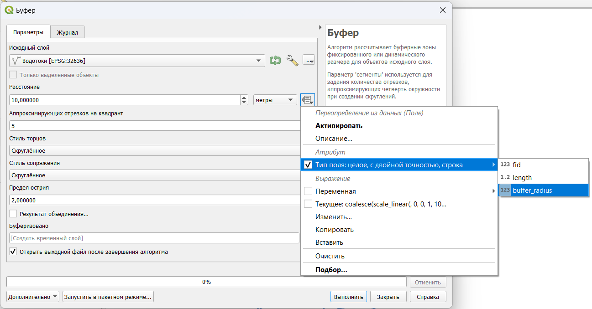
    
10. Укажите, что выходные буферные зоны должны быть сохранены в созданный ранее GeoPackage под именем `hydrography_line_buffer_variable` и запустите расчёт буферных зон. Результат расчёта будет добавлен в проект. 

    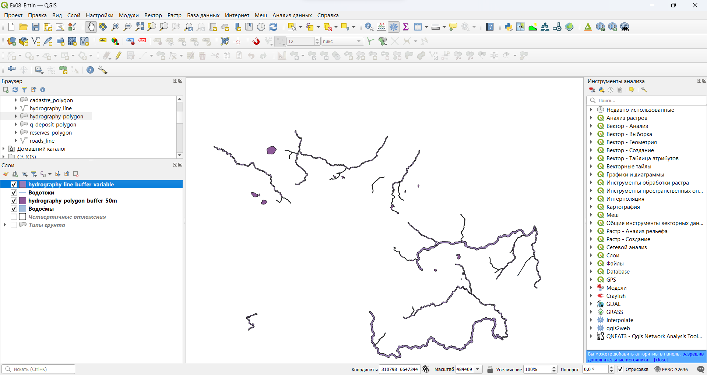
    
### Буферные зоны других объектов {#geometry-buffer-other}

1. Добавьте в проект таблицы автодорог (`roads_line`) и особо охраняемых природных территорий (`reserves_polygon`)

2. Создайте вокруг автодорог буферные зоны шириной 50 м и сохраните их в созданный вами GeoPackage под именем `roads_buffer_50m`.

3. Создайте вокруг особо охраняемых природных территорий буферные зоны шириной [1 км](http://publication.pravo.gov.ru/Document/View/0001201502240019?rangeSize=10) и сохраните их в созданный вами GeoPackage под именем `reserves_buffer_1km`.

4. Отключите все слои, кроме буферных зон, и сделайте снимок экрана.

<kbd>**Снимок экрана №2.** Результат построения буферных зон</kbd>

**Вопрос №2**: что такое буферная зона? Для каких типов геометрии может применяться построение буферных зон? Какой тип геометрии может иметь результат построения буферной зоны в QGIS?

5. Объедините все построенные буферы в один набор пространственных данных. Для этого воспользуйтесь инструментом «Объединить векторные слои...» («Вектор» — «Управление данными»). Систему координат не задавайте, целевой слой назовите `buffer_merge`.
    
    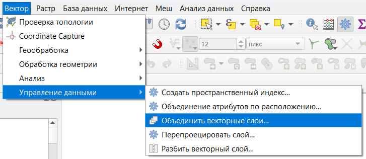
    
    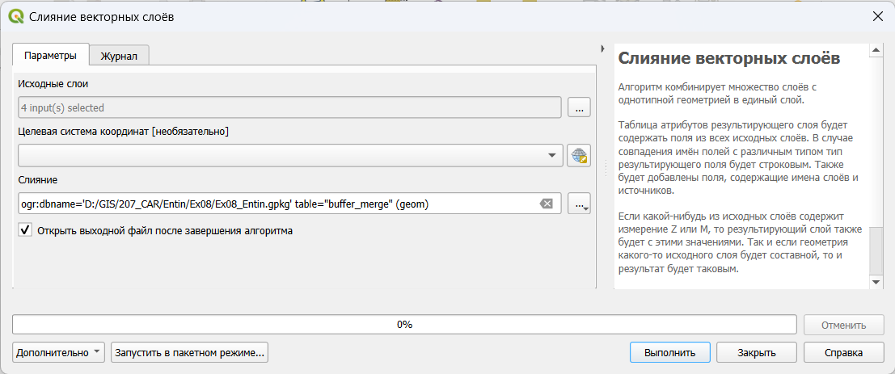

6. Удалите буферные зоны отдельных объектов из проекта, сохраните только объединённый слой буферных зон. Переименуйте этот слой в «Буферные зоны». Изучите таблицу атрибутов полученного слоя. 

## Сохранение выборки в новую таблицу {#geometry-selection}
[В начало упражнения ⇡](#geometry)

В рамках задания мы должны исключить территории, уже занятые застройкой или предназначенные для застройки. Информацию о существующей застройке можно взять из разных источников. В этом упражнении мы воспользуемся кадастровой информацией.

1. Отключите слой буферных зон и добавьте в проект информацию о кадастровом делении (`cadastre_polygon`). Переименуйте новый слой в «Кадастр»

2. Выберите в слое кадастрового деления объекты, обозначенные как `ГКН_УЧАСТКИ` и `ГКН_ГРАНИЦЫ`. Эти объекты ограничивают земли населённых пунктов.

    >Примечание: если вы не помните, как сделать выборку объектов по значениям атрибутов, обратитесь к упражнению 7
    
    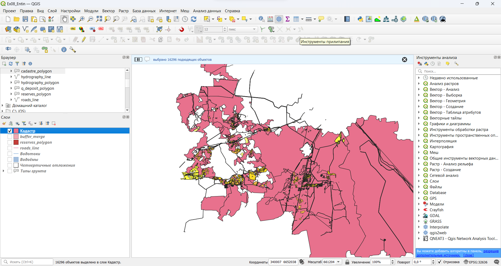
    
3. Сохраните выборку как новую таблицу пространственных данных. Для этого вызовите контекстное меню слоя «Кадастр» и найдите в нём опцию «Экспорт» — «Сохранить выбранные объекты как...» 

    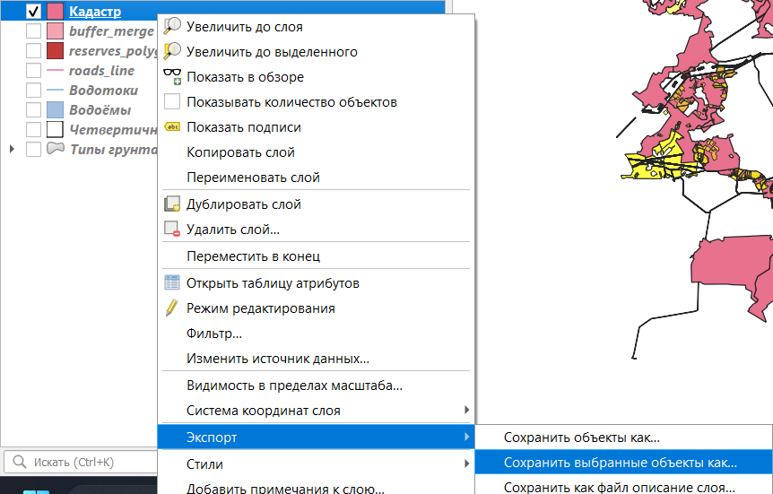
    
4. В верхней части окна параметров сохранения укажите целевой формат (GeoPackage) и целевой файл (тот же файл, в который вы сохраняли все предыдущие результаты). В качестве имени слоя (таблицы) введите `settlements`.

    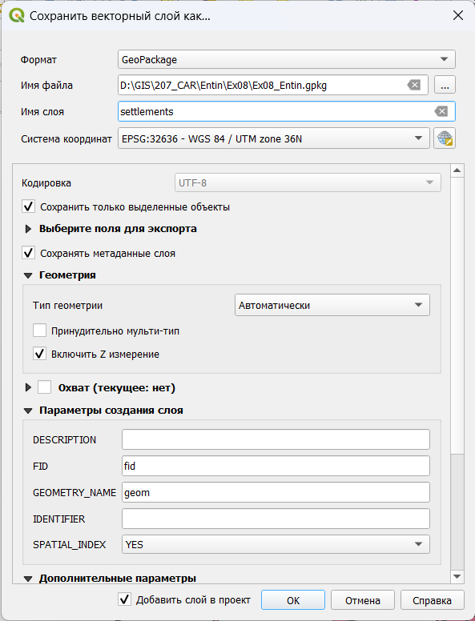
    
5. После того, как новый слой будет добавлен в проект, переименуйте его в «Населённые пункты». Удалите слой «Кадастр» из проекта.

    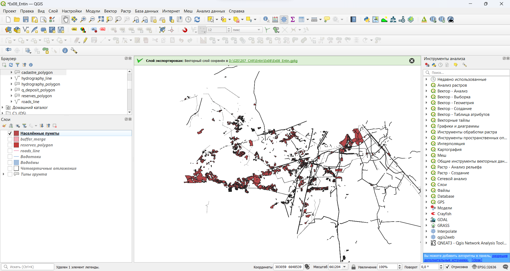
    
    >Примечание: фактически ваш новый слой содержит информацию не только о землях населённых пунктов, но мелкими контурами в рамках задания можно пренебречь.
    
## Нахождение геометрической разности объектов {#geometry-erase}
[В начало упражнения ⇡](#geometry)

Мы создали геометрические объекты, описывающие территории, непригодные для возведения нового здания (в условиях задачи). Теперь мы воспользуемся векторным оверлеем, чтобы исключить из контуров с пригодными грунтами те части, которые пересекаются с созданными объектами. Это реализуется с помощью операции геометрической разности (*difference*). Мы применим инструмент нахождения разности последовательно несколько раз, чтобы исключить все неподходящие территории. При этом мы не будем сохранять результат в явном виде на каждом шаге, а вместо этого воспользуемся временными слоями.

    >Примечание: в различном геоинформационном ПО необходимый инструмент может иметь разные названия. Например, в QGIS он называется «Разность» (*Difference*), а в ArcGIS — «Стирание» (*Erase*)

1. Включите слой «Типы грунта»

2. Выберите в слое «Типы грунта» контура, механический состав которых представлен суглинками и глинами.

3. Запустите инструмент «Разность...» из группы инструментов геообработки.

    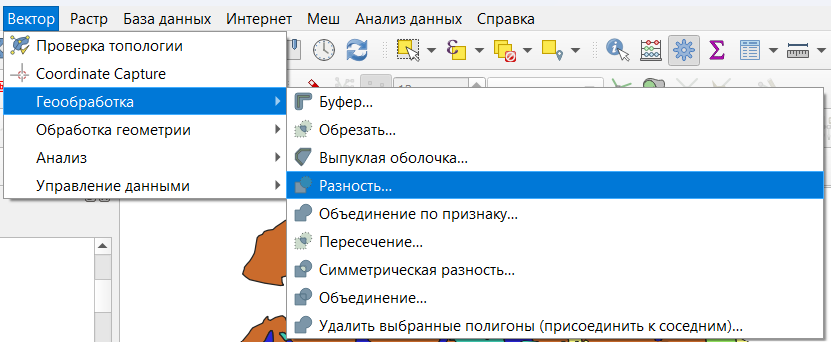
    
4. В качестве исходного слоя («уменьшаемого») выберите «Типы грунта». Обязательно включите опцию «Только выделенные объекты». В качестве оверлейного слоя («вычитаемого») задайте «Населённые пункты». Проверьте, что результат будет сохранён во временный слой.

    
    
    **Важно:** на этом шаге инструмент может не сработать из-за некорректной геометрии одного из входных объектов. Если инструмент выдаст сообщение об ошибке, закройте его и в основном окне QGIS откройте окно параметров. На вкладке «Анализ» в разделе «Общие» найдите опцию «Фильтрация ошибочных объектов» и выберите параметр «Пропустить (игнорировать) объекты с ошибочными геометриями». После  выполнения упражнения верните изначальное значение этой опции.
    
    
    
5. После завершения работы инструмента в проект будет добавлен слой «Разность». Изучите геометрию объектов добавленного слоя, после этого отключите все остальные слои.

    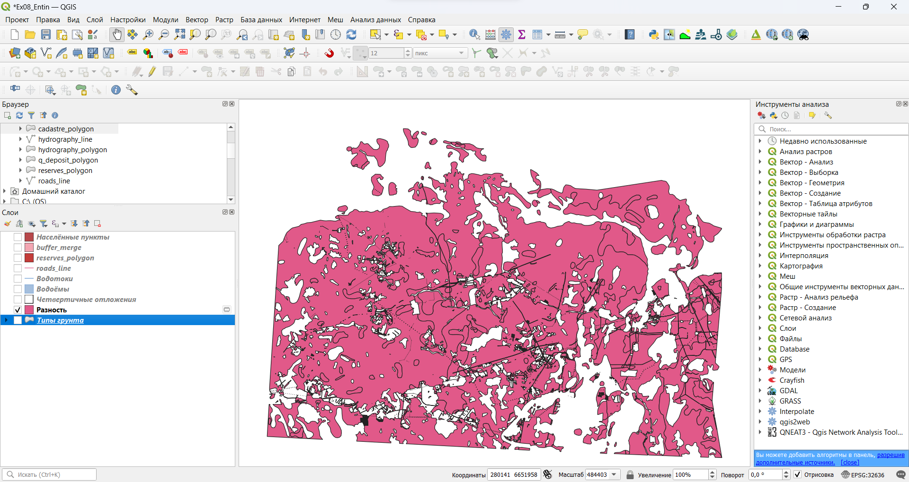
    
6. Теперь вычтите из полученной разности слой буферных зон. Новый слой разности тоже будет иметь название «Разность». Не перепутайте эти слои!

    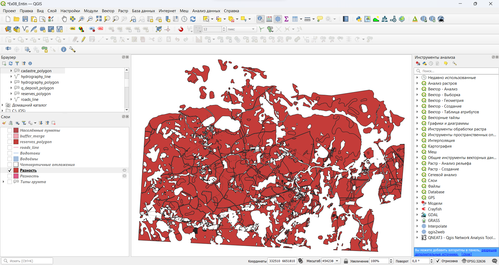
    
7. Обратите внимание, что все объекты разностей наследуют геометрию от первого оверлейного слоя («уменьшаемого»). В нашем случае это приводит к тому, что в результирующем слое содержится небольшое число мультиполигонов (всего три). Мы бы хотели разделить эти объекты на простые полигоны. Для этого используется инструмент «Разбить составную геометрию».

    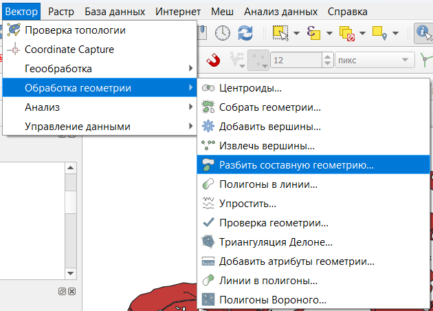

8. Преобразуйте мультиполигоны в обычные полигоны с помощью инструмента «Разбить составную геометрию». Результат сохраните в ваш GeoPackage под именем `available_area`. Когда новый слой будет добавлен в проект, переименуйте его в «Доступные территории». Отключите остальные слои и сделайте снимок экрана.

<kbd>**Снимок экрана №3.** Территории, пригодные для сооружения новых объектов</kbd>

**Вопрос №3**: что такое оверлей? Какие функции векторного оверлея вы знаете? Как работает функция разности векторных объектов?

## Расчёт зональной статистики {#geometry-zonal-stat}
[В начало упражнения ⇡](#geometry)

На заключительном шаге упражнения мы рассчитаем средние значения высот в пределах полученных контуров. Для этого мы воспользуемся фрагментом глобальной цифровой модели рельефа SRTM (исходное разрешение 3″) и инструментом расчёта зональной статистики

1. Добавьте в проект фрагмент цифровой модели рельефа (файл `srtm_fragment_project_crop.tif`). Переименуйте новый слой в «Цифровая модель рельефа».
    
    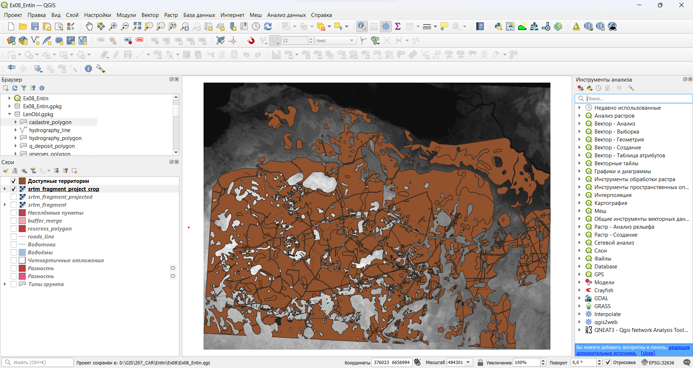
    
2. Включите панель инструментов анализа, если она отключена. Это можно сделать с помощью кнопки  или сочетания клавиш `Ctrl+Alt+T`.

3. В панели инструментов анализа с помощью строки поиска найдите инструмент «Зональная статистика»

    
    
4. Задайте в качестве исходного слоя «Доступные территории», а в качестве растрового слоя — цифровую модель рельефа. Введите префикс поля вывода `elevation_` (обратите внимание на нижнее подчёркивание). В списке статистик для расчёта укажите среднее, медиану, минимум, максимум и диапазон. Результат сохраните в ваш GeoPackage под именем `available_area_zonal_statistics_elevation`.

    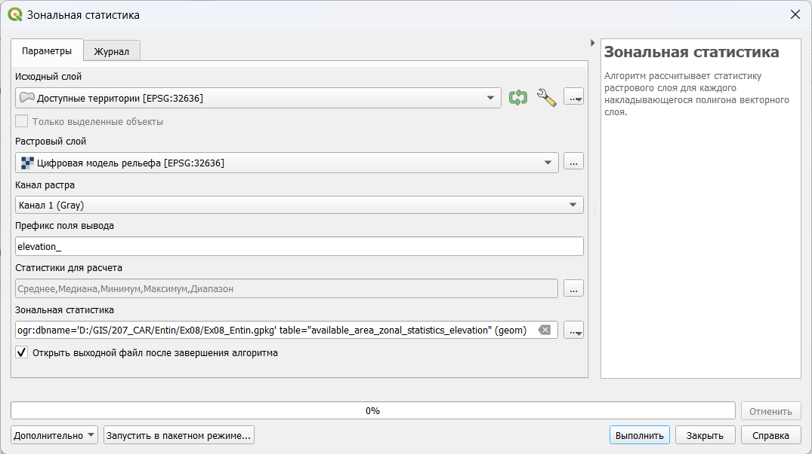
    
5. Когда результат обработки будет добавлен в проект, переименуйте слой в «Доступные территории (зональная статистика)». Изучите таблицу атрибутов этого слоя.

6. Составьте схему территорий, доступных для строительства. Используйте слои, которые сочтёте необходимыми. Подпишите средние высоты в пределах крупных участков.

<kbd>**Итоговое картографическое изображение:** Территории, пригодные для сооружения новых объектов</kbd>

**Вопрос №4**: почти каждый шаг этого упражнения можно было выполнить другим путём или в другой последовательности. Напишите, какие шаги (этапы) работы вы могли бы сделать иначе (или в другом порядке) и получить тот же результат.