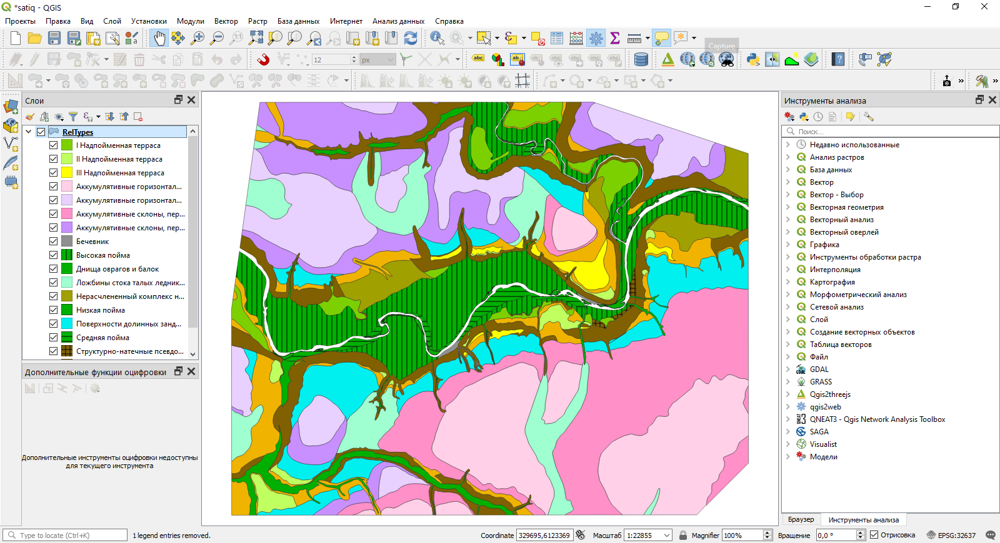
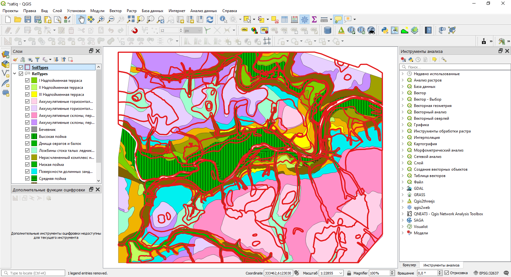
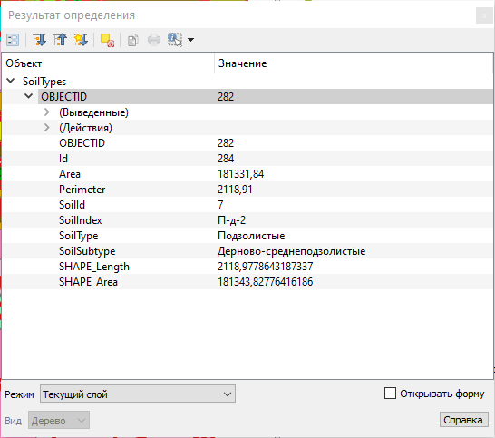
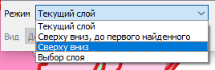
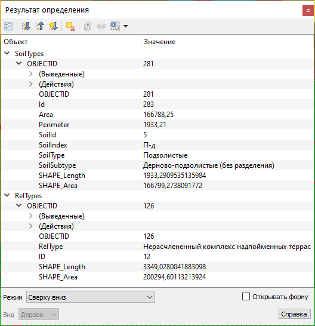
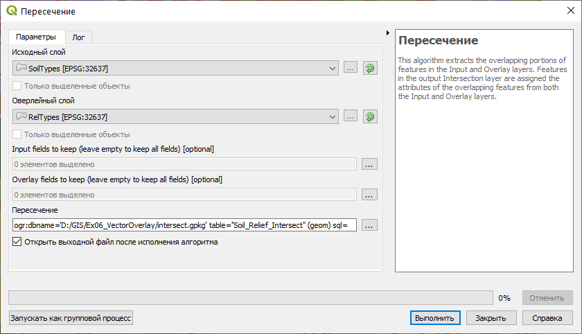
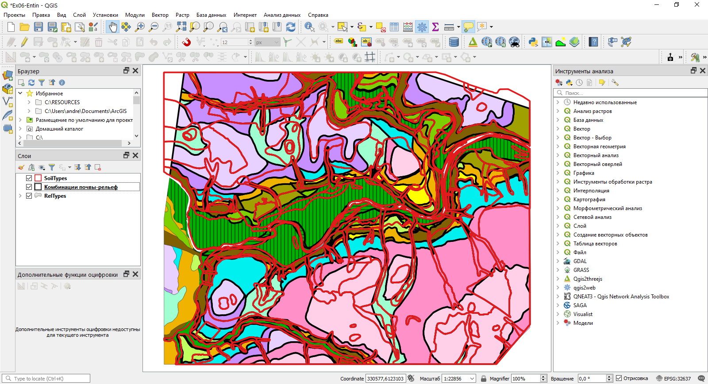
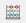
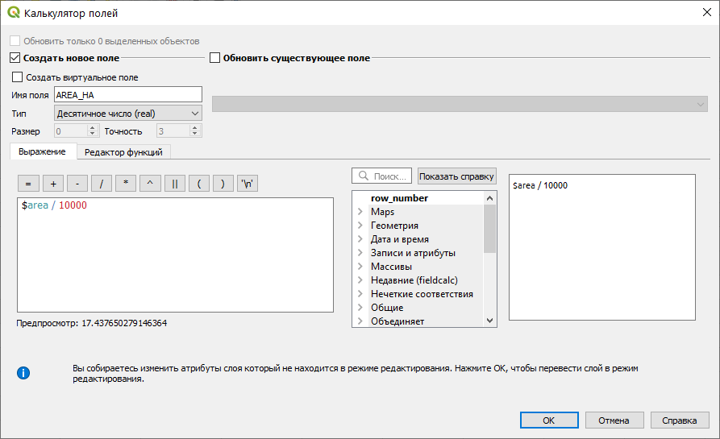
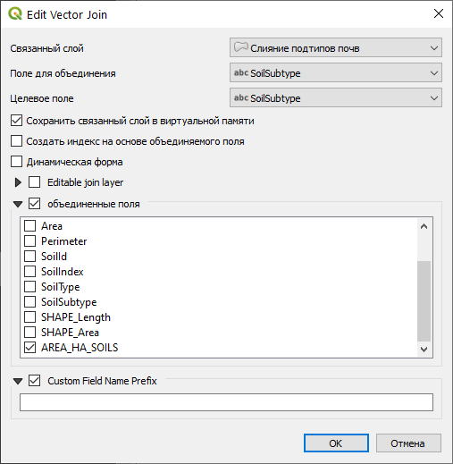

# Анализ пространственных взаимосвязей {#overlay}

[Архив с исходными данными](https://github.com/aentin/qgis-course/raw/master/files/Ex09.zip)

[Контрольный лист](https://github.com/aentin/qgis-course/raw/master/files/Ex09_%D0%BE%D1%82%D1%87%D1%91%D1%82.docx)

## Введение {#overlay-intro}

**Цель задания** — научиться определять пространственную приуроченность двух явлений на основе процента взаимного покрытия их площадей (методом оверлея).

**Необходимая теоретическая подготовка:** Оверлей пространственных объектов, геометрическое определение вероятности как отношения мер (площадей), соединение таблиц в реляционных базах данных, внешний и внутренний ключ соединения.

**Необходимая практическая подготовка:** Знание основных компонент интерфейса QGIS (менеджер источников данных, таблица слоёв, фрейм карты, менеджер компоновок). Работа с различными форматами источников пространственных данных . Настройка символики и подписей объектов. Владение базовыми ГИС-технологиями.

**Исходные данные:** База данных ГИС «Сатино».

**Результат:** Таблица взаимного покрытия площадей типов рельефа и подтипов почв.

### Контрольный лист {#overlay-control}

* Добавить на карту слои типов почв и рельефа, оформить их
* Произвести оверлей слоев
* Произвести слияние данных и соединение таблиц
* Подсчитать процент покрытия площадей

### Аннотация {#overlay-annotation}

Задание посвящено знакомству с пространственным анализом на основе векторных данных. Векторная модель представляет объекты в виде отдельных геометрических фигур с набором атрибутов. Она является объектно-ориентированной и удобна для анализа формы, размеров объектов, их взаимной конфигурации в пространстве.  Одним из широко используемых методов анализа на основе векторных данных является оверлей.

> При *оверлее* происходит наложение двух или более слоев, в результате чего образуется их графическая композиция. Полученные участки наследуют атрибуты от каждого слоя. Эта операция базируется на стандартных отношениях множеств, таких как пересечение, объединение и симметрическая разность.

С помощью оверлея можно, например, установить, к каким генетическим типам рельефа приурочены различные типы и подтипы почв. В общем случае оверлей позволяет установить, какие комбинации объектов встречаются в пространстве. В задании предлагается исследовать методом оверлея взаимосвязь типов рельефа и типов и подтипов почв.

## Визуальный анализ векторных слоев {#overlay-vectors}
[В начало упражнения ⇡](#overlay)

В первую очередь при анализе данных следует провести их визуальную оценку, которая может натолкнуть на отыскание закономерностей во взаимном расположении объектов.

1. Распакуйте архив с материалами упражнения в свою рабочую директорию. Создайте проект QGIS в папке с распакованными материалами.

2. Добавьте на карту слой *RelTypes* из базы геоданных `Satino.gdb`. Примените к нему стиль из файла `RelTypes.qml`.

    
    
3. Добавьте на карту слой *SoilTypes* из той же базы. Изобразите его в виде полигонов без заливки с обводкой красного цвета.

    
    
4. Сделайте снимок экрана.

<kbd>В отчёт: снимок экрана №1 — исходные данные для анализа пространственных взаимосвязей</kbd>

4. Выберите инструмент идентификации  и щелкните в пределах карты на любом полигоне. Откроется форма идентификации (отображения) атрибутов объекта

    
    
    По умолчанию QGIS идентифицирует объекты либо из самого верхнего слоя (*Сверху вниз, до первого найденного*, в порядке перечисления в панели слоёв), либо из того слоя, который выбран в панели слоёв (*Текущий слой*). Можно настроить инструмент идентификации таким образом, чтобы отображать атрибуты объектов из всех доступных слоёв. Для этого в нижней части панели идентификации нужно установить режим *Сверху вниз*.
    
    
    
    
    
    Пользуясь инструментом идентификации, проанализируйте совмещенное изображение границ типов почв и рельефа. 

Когда данные исследованы визуально и путем идентификации, можно перейти к их анализу с помощью оверлея.

## Оверлей слоев методом пересечения {#overlay-intersect}
[В начало упражнения ⇡](#overlay)

Инструменты векторного оверлея, а также некоторые родственные им инструменты в QGIS размещаются в меню «Вектор — Геообработка». Также эти инструменты доступны из панели инструментов анализа.

*Изучите, как работают инструменты геообработки*. Для этого сохраните и закройте свой проект QGIS, затем создайте новый проект, а в нём — два временных полигональных слоя.

> Временный слой в QGIS хранится в выделенной директории среди системных файлов. Если не сохранять временные файлы, они будут удалены после закрытия окна QGIS.
    
> Чтобы создать временный слой, нажмите кнопку *Новый временный слой* в панели менеджера источников данных. Используйте для создаваемых слоёв проецированную систему координат!
    
Поочерёдно примените к вашим слоям следующие инструменты геообработки: Обрезать (Clip), Разность (Erase), пересечение (Intersect), Симметрическая разность (Symmetrical Difference), Объединение (Union)

2. Теперь вернитесь в основной рабочий проект и запустите инструмент *Пересечение (Intersect)*. Настройте параметры следующим образом:

    1. Используйте слой `SoilTypes` в качестве исходного и слой `RelTypes` в качестве оверлейного.    
    2. Сохраните выходной набор данных как GeoPackage в вашу рабочую директорию. Назовите выходной файл `%фамилия%_geoprocessing.gpkg`, а в открывшемся окне задания имени слоя введите `Soil_Relief_Intersect`.
  
    
  
3. Нажмите «Выполнить», чтобы запустить вычисления.

    Результат вычислений добавится на карту и в таблицу слоёв под именем `Пересечение`. 
    
4. Переименуйте добавленный слой в `Комбинации почвы-рельеф`.

5. Поместите полученный оверлеем слой между слоями типов почв и рельефа, и настройте его отображение в виде полигона без заливки с черной обводкой. Там, где границы совпадают с контурами типов рельефа, они будут черного цвета, а там где они совпадают с контурами типов почв, будет красная линия с черной обводкой. 

    
    
6. Раскройте атрибутивную таблицу слоя *Комбинации почвы-рельеф* и изучите, какие поля находятся в ней. 

7. Расположите окно таблицы атрибутов так, чтобы оно не перекрывала изображение результата пересечения целиком, и сделайте снимок экрана.

<kbd>В отчёт: снимок экрана №2 — результат пересечения (геометрия и семантика)</kbd>

## Слияние результатов пересечения с целью получения показателя пространственной связи {#overlay-merge}
[В начало упражнения ⇡](#overlay)

Поскольку каждый полигон в оверлейном слое содержит значение типа/подтипа почвы и типа рельефа, появляется возможность установить приуроченность типов и подтипов почв к определенным типам рельефа.

Чтобы подсчитать долю каждого типа рельефа в площади каждого подтипа почв, необходимо просуммировать площади каждой их уникальной комбинации. Например, дерново-карбонатные выщелоченные почвы (*Д-в-к*) на крутых эрозионных склонах встречаются в пределах Сатинского полигона в виде 6 разрозненных участков, имеющих некоторую суммарную площадь. Эта площадь, деленная на суммарную площадь почв подтипа *Д-в-к* даст вероятностный критерий приуроченности почв *Д-в-к* к крутым эрозионным склонам. То же самое касается остальных комбинаций подтипов почв и типов рельефа.

С точки зрения рабочих процессов ГИС, операцию следует разбить на 5 шагов:

* подсчет суммарной площади каждой комбинации подтипа почв и типа рельефа;

* подсчет суммарной площади каждого подтипа почв;

* добавление поля, в которое будет записана процентная доля;

* соединение таблиц комбинаций и подтипов почв по названию подтипа почв;

* деление площади комбинации на площадь подтипа почв и запись результата в соответствующее поле.

> Объединение разрозненных объектов, обладающих одинаковым набором атрибутов, осуществляется с помощью *операции объединения по признаку* (Dissolve). Причем, если объекты примыкают друг к другу, граница между ними будет стерта, а если объекты разнесены в пространстве, на выходе получится составной объект (Multipart feature), состоящий из нескольких полигонов. Объединение по признаку — это один из методов генерализации, он очень часто используется в геоинформационном анализе и картографировании.

1. Откройте инструмент геообработки «Объединение по признаку».

2. Выберите в качестве исходного слоя *Комбинации почвы-рельеф*.

3. Нажмите на кнопку с изображением многоточия в строке *Dissolve fields (optional)*, чтобы задать поля, по которым будет производиться слияние. В открывшемся списке отметьте поля *SoilType*, *SoilSubtype* и *RelType*. Тем самым можно будет найти все уникальные комбинации подтипов почв и типов рельефа.

    > Поле *SoilType* необходимо отметить для того, чтобы в таблице результирующего слоя сохранилась информация о типах почв. Это не повлияет на сам результат, поскольку количество комбинаций типа и подтипа почв равно количеству самих подтипов.
    
4. Укажите путь для сохранения результата объединения по признаку. Сохраните результат в тот же GeoPackage, что и результат пересечения, а слой назовите `Soil_Relief_Intersect_Dissolve`. 

5. Запустите выполнение инструмента.

6. После того, как результат появится в таблице содержания, закройте окно инструмента. Переименуйте полученный слой в *Слияние комбинаций почвы-рельеф*.

7. Откройте таблицу атрибутов полученного слоя и изучите её содержимое. Расположите окно таблицы атрибутов так, чтобы были одновременно виден и основной фрейм карты, и таблица, и сделайте снимок экрана.

<kbd>В отчёт: снимок экрана №3 — результат слияния (объединения по признаку)</kbd>

## Объединение подтипов почв для подсчёта суммарной площади {#overlay-sumarea-subtypes}
[В начало упражнения ⇡](#overlay)

1. Запустите инструмент объединения по признаку еще раз.

2. Выберите в качестве входных данных слой *SoilTypes*.

3. В списке полей для объединения выберите поля *SoilType* и *SoilSubtype*.

4. Выходной набор данных сохраните в тот же GeoPackage с именем слоя *SoilTypes_Dissolve*.

5. Остальные параметры оставьте по умолчанию и запустите инструмент.

6. Назовите полученный слой *Слияние подтипов почв*. В данном слое в результате операции слияния каждый подтип почв будет представлен единственным объектом.

## Расчёт площадей объектов {#overlay-fieldcalc}
[В начало упражнения ⇡](#overlay)

К сожалению, QGIS не умеет автоматически пересчитывать площади объектов при изменении их геометрии. А изменения, которые мы произвели в процессе объединения по признаку, достаточно велики. Далее мы рассчитаем площади каждого объекта в «объединённых» слоях, затем выполним соединение атрибутивных таблиц и рассчитаем показатель связи на основе соотношения площадей.

1. Откройте таблицу атрибутов слоя *Слияние комбинаций почвы-рельеф*.

2. В заголовке таблицы найдите **Открыть калькулятор полей** () или нажмите `Ctrl+I`.  

    В QGIS, в отличие от ArcGIS и многих СУБД, не требуется отдельно создавать новое поле перед выполнением расчёта. Мы создадим новое поле, в котором будет записана площадь объекта в гектарах, и одновременно заполним его значениями с помощью калькулятора полей.
    
3. Введите имя поля `AREA_HA_INTERSECT` и установите тип данных «Десятичное число (real)».

4. Введите выражение ` $area / 10000` в поле «Выражение». 

    
    
    Пояснение: `area()` — системная функция QGIS, возвращающая площадь объекта. Значок `$` означает, что функция будет применена к текущему объекту. Площадь вычисляется в единицах измерения площади, предусмотренных для системы координат источника данных. Для проецированных систем координат это, как правило, метры (реже футы). Смысл выражения `/ 10000` постарайтесь определить самостоятельно.
    
5. Нажмите ОК. Слой перейдёт в режим редактирования, а в таблице атрибутов появится новый столбец.

>Примечание: в некоторых случаях операция `$area` может выдавать пустые (`NULL`) результаты. Если это произошло, проверьте систему координат слоя и при необходимости выставьте правильную систему координат.

6. Сохраните правки и выключите режим редактирования для слоя *Слияние комбинаций почвы-рельеф*. Кнопка включения/выключения режима редактирования доступна не только в панели редактирования, но и в окне таблицы атрибутов.

7. Проделайте аналогичную операцию для слоя *Слияние подтипов почв*. **Важно:** используйте другое имя для поля площади, например, `AREA_HA_SOILS`, чтобы избежать ошибки на следующем шаге.

8. Откройте атрибутивную таблицу слоя *Слияние подтипов почв* и настройте её отображение так, чтобы добавленный столбец был виден. Сделайте снимок экрана.

<kbd>В отчёт: снимок экрана №4 — рассчитанная площадь объектов</kbd>

## Соединение таблиц по названию подтипа почв {#overlay-join}
[В начало упражнения ⇡](#overlay)

Для расчета пространственной взаимосвязи необходимо поделить площадь каждой комбинации на площадь соответствующего подтипа почв. Эти площади находятся сейчас в разных таблицах — *Слияние подтипов почв* и *Слияние комбинаций почвы-рельеф*. Их можно соединить, используя поля с общими значениями атрибутов.

> *Соединение таблиц* (table join) — операция, в результате которой к одной таблице временно добавляются столбцы из другой таблицы. Чтобы установить соответствие между строками целевой и присоединяемой таблицы, необходимо иметь в каждой таблице поля с общими для них значениями — так называемые *ключевые поля*. Например, это может быть числовой код объекта или, как в нашем случае, подтип почв (строковый тип данных). При соединении проверяется соответствие значения из поля для объединения и целевого поля. Если найдено совпадение, то строка из присоединяемой таблицы добавляется к атрибутам соответствующих объектов целевой таблицы. Если совпадения нет, то столбцы присоединяемой таблицы всё равно добавляются в целевую таблицу, но все значения в них будут пустыми (*NULL*).

>Соединение в QGIS имеет реализуется по схеме M:1. Это значит, что одна и та же строка присоединяемой таблицы может быть добавлена ко многим строкам целевой таблицы, в то время как к одной строке целевой таблицы присоединяется только одна строка присоединяемой таблицы. Ключевые поля такого соединения имеют собственные специальные названия: ключевое поле из присоединяемой таблицы называется *первичным ключом*, а ключевое поле из целевой таблицы называется *внешним ключом*. На первичный ключ накладывается следующее ограничение: значения в этом поле должны быть уникальными. На внешний ключ такое ограничение не накладывается.

1. Откройте свойства слоя *Слияние комбинаций почвы-рельеф* и перейдите на вкладку *Связи*.

2. Нажмите на кнопку с изображением знака «+» внизу, чтобы добавить новую связь.

3. Настройте параметры соединения, как показано на рисунке ниже:

    

<kbd>В отчёт: вопрос №1 — Что такое «поле для объединения» и «целевое поле» в QGIS? Как правильно называются эти поля в процедуре соединения таблиц? К каким таблицам (слоям) относится каждое из них?</kbd>
   
4. Примените изменения, закройте свойства слоя и откройте таблицу атрибутов. Изучите изменения в таблице.
    
## Вычисление результирующих значений показателя связи {#overlay-resulting}
[В начало упражнения ⇡](#overlay)

1. Откройте таблицу атрибутов слоя *Слияние комбинаций почвы-рельеф*, а затем вызовите калькулятор полей.

2. Укажите, что результат вычисления будет сохраняться в новое поле вещественного (real) типа, имя поля — `Percent`

3. В окне ввода выражения составьте следующее выражение:

    **Площадь сочетания подтипа почв и типа рельефа / Площадь подтипа почв × 100 **
    
    > Подсказка: чтобы использовать значения полей в выражении, найдите в средней панели группу «Поля и значения». Добавляйте поля в выражение, кликая по их названиям дважды левой кнопкой мыши.

4. Скопируйте полученную формулу и вставьте её в отчётный файл

<kbd>В отчёт: выражение №1 — формула расчёта показателя связи</kbd>

5. Запустите расчёт. После окончания расчёта посмотрите получившиеся значения в поле *Percent*.

2. Удалите соединение таблиц через свойства слоя *Слияние комбинаций почвы-рельеф* (вкладка «Связи», кнопка с изображением знака «минус» внизу).

3. Отсортируйте таблицу атрибутов по значению поля *Percent* по убыванию. Выберите объекты, значение показателя связи для которых превышает 75 %.

4. Скройте все столбцы, кроме типа почв, подтипа почв, типа рельефа и поля *Percent.*. Для того, чтобы скрыть столбец в таблице атрибутов, нажмите на его название правой кнопкой мыши и выберите опцию *Hide column*.

5. Скомпонуйте окно приложения так, чтобы было видно целиком карту, а также выделенные в таблице строки, а также столбцы, перечисленные в предыдущем пункте.

<kbd>В отчёт: снимок экрана №4 — окно карты и результирующая таблица</kbd>

6. Сохраните проект QGIS.
