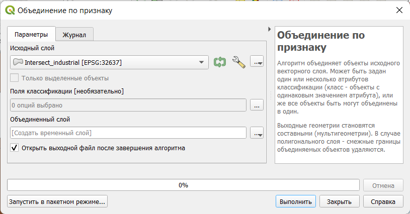
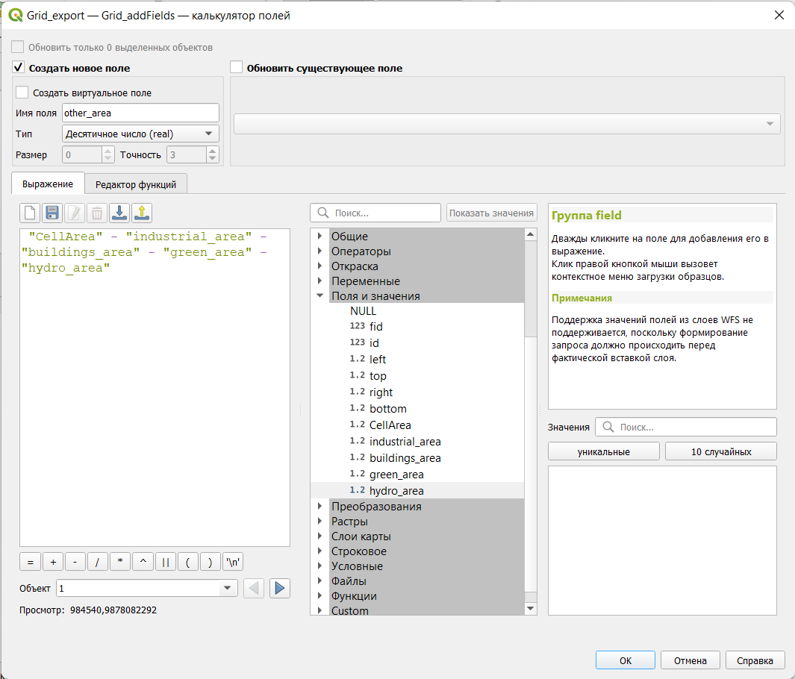

# Анализ пространственных соотношений {#spatrelations}

[Архив с исходными данными](https://github.com/aentin/qgis-course/raw/master/files/Ex10.zip)

[Контрольный лист](https://github.com/aentin/qgis-course/raw/master/files/Ex10_%D0%BE%D1%82%D1%87%D1%91%D1%82.docx)

## Введение {#spatrelations-intro}

**Цель задания** — научиться рассчитывать соотношение различных явлений на регулярной сетке с использованием векторного оверлея.

**Необходимая теоретическая подготовка:** Оверлей пространственных объектов, геометрическое определение вероятности как отношения мер (площадей), соединение таблиц в реляционных базах данных, внешний и внутренний ключ соединения.

**Необходимая практическая подготовка:** Знание основных компонент интерфейса QGIS (менеджер источников данных, таблица слоёв, фрейм карты, менеджер компоновок). Работа с различными форматами источников пространственных данных . Настройка символики и подписей объектов. Владение базовыми ГИС-технологиями.

**Исходные данные:** Векторные контура типов земельного покрова, полученные на основе данных OpenStreetMap.

**Результат:** карта соотношения различных типов земельного покрова.

### Контрольный лист {#spatrelations-control}

* Добавить на карту слои типов объектов и регулярную сетку, оформить их
* Произвести оверлей и слияние объектов в пределах ячеек
* Рассчитать площадь объектов
* Присоединить поля площади к таблице регулярной сетки и рассчитать площадь оставшихся объектов
* Визуализировать результат

### Аннотация {#spatrelations-annotation}

Задание посвящено знакомству с пространственным анализом на основе векторных данных. Векторная модель представляет объекты в виде отдельных геометрических фигур с набором атрибутов. Она является объектно-ориентированной и удобна для анализа формы, размеров объектов, их взаимной конфигурации в пространстве.  Одним из широко используемых методов анализа на основе векторных данных является оверлей.

> При *оверлее* происходит наложение двух или более слоев, в результате чего образуется их геометрическая (пространственная) композиция. Полученные участки наследуют атрибуты от каждого слоя. Эта операция базируется на стандартных отношениях множеств, таких как пересечение, объединение и симметрическая разность.

С помощью оверлея можно, например, установить, как соотносятся площади объектов разных типов в пределах ячеек регулярной сетки. Это может быть важно при моделировании, например, локальных климатических зон или анализе экологической ситуации.

## Визуальный анализ векторных слоев {#spatrelations-vizual}
[В начало упражнения ⇡](#spatrelations)

В первую очередь при анализе данных следует провести их визуальную оценку, которая может натолкнуть на отыскание закономерностей во взаимном расположении объектов.

1. Распакуйте архив с материалами упражнения в свою рабочую директорию. Создайте проект QGIS в папке с распакованными материалами.

2. Добавьте на карту слои *Industrial*, *Hydro*, *Green*, *Buildings* из базы данных `LandCover.gpkg`. Присвойте этим слоям разные цвета для лучшего восприятия данных.

    
    
4. Создайте регулярную сетку квадратов с помощью инструмента **Вектор – Анализ – Создать сетку...**. В открывшемся окне параметров инструмента выберите прямоугольный тип сетки, укажите вертикальный и горизонтальный шаг сетки в 1000 м, а в качестве экстента (охвата) слоя укажите существующий слой проекта *Buildings*. Сохраните сетку в отдельный файл Geopackage в вашей рабочей директории.

5. Измените стиль слоя сетки таким образом, чтобы отображались только границы полигонов. Установите толщину линии границы равной 0,26 мм. Переместите слой на верх таблицы слоёв. Сделайте снимок экрана.

    <kbd>**Снимок экрана 1:** Визуализация исходных данных</kbd>

    

## Расчёт площадей и оверлей {#spatrelations-overlay}
[В начало упражнения ⇡](#spatrelations)
    
1. Для расчёта доли площади каждого типа объекта в пределах ячейки необходимо знать площадь самой ячейки. Для этого выберите слой в таблице слоёв, а затем нажмите кнопку **Калькулятор полей** . Эту кнопку можно найти на панели атрибутов либо непосредственно в таблице атрибутов.

2. В интерфейсе калькулятора полей укажите, что вы создаёте новое поле, введите имя поля `CellArea` и выберите подходящий тип поля. 

3. Введите в форму выражения функцию *$area* и выполните расчёт.

    >Примечание: `area()` — системная функция QGIS, возвращающая площадь объекта. Значок `$` означает, что функция будет применена к текущему объекту. Площадь вычисляется в единицах измерения площади, предусмотренных для системы координат источника данных. Для проецированных систем координат это, как правило, метры, реже – футы.

**Вопрос 1:** Почему площади разных ячеек различаются? Почему рассчитанная площадь не равна 1 000 000?

4. При использовании Калькулятора полей автоматически включается режим редактирования. После расчёта площади сохраните изменения и выключите режим редактирования.

2. Для того чтобы рассчитать площади каждого типа объекта в пределах ячеек регулярной сетки, необходимо выполнить операцию пересечения (оверлея) слоев. Для этого воспользуйтесь инструментом **Вектор — Геообработка — Пересечение**. В качестве входного набора данных (*Input layer*) укажите регулярную сетку, а в качестве пересекающего набора данных (*Overlay layer*) — слой с растительностью. Результат сохраните во временный слой.

    >Временный слой в QGIS хранится в выделенной директории среди системных файлов. Если не сохранять временные файлы, они будут удалены после закрытия окна QGIS. Временные слои обозначаются значком  справа от названия в таблице слоёв.

3. Результирующий слой будет называться *Пересечение* или *Intersect*. Переименуйте его так, чтобы было понятно, в результате пересечения каких именно слоев он получился.

**Вопрос 2:** Чем отличается (визуально) полученный слой от исходного слоя растительности?

**Вопрос 3:** Чем отличается (по структуре таблицы атрибутов) полученный слой от исходного слоя растительности?

3. Повторите аналогичную операцию для оставшихся трёх слоёв.

4. Обратите внимание, что в полученных слоях в пределах каждой ячейки мы видим, как правило, не один объект, а несколько. Мы можем рассчитать площадь каждого из них, но нам нужна суммарная площадь всех объектов.

    

Для получения общей площади можно объединить все объекты в пределах ячейки в один объект. Этого можно добиться с помощью операциии **объединения по признаку** (англ. *Dissolve*). Суть этой операции состоит в объединении объектов, имеющих совпадающие значения какого-либо атрибута (или нескольких атрибутов). После оверлея полигонов у каждого объекта растительности появился уникальный идентификатор ячейки регулярной сетки (`id`), его можно использовать для объединения по признаку.

5. Запустите инструмент **Вектор – Геообработка – Объединение по признаку...**. В качестве параметров инструмента необходимо указать исходный слой (возьмите пересечение сетки и растительности), а также столбец (или столбцы) таблицы атрибутов, по которому будет осуществляться слияние («поле классификации»). Результат сохраните в тот же файл GeoPackage, в который записана регулярная сетка; задайте имя таблицы `green_intersect_dissolve`

    

    

    

Результирующий временный слой будет называться *Объединенный слой* или *Dissolved* – переименуйте его так, чтобы было понятно, о каком типе объектов идёт речь.

5. Повторите аналогичную операцию для оставшихся трёх слоёв.

    >Подсказка: можно не закрывать интерфейс инструмента объединения по признаку, а просто менять необходимые параметры и нажимать «Выполнить»
    
    >Примечание: из-за ошибок в коде QGIS в некоторых случаях объединение по признаку может срабатывать некорректно: в целевой набор не записываются объекты, и таблица атрибутов не содержит записей. Если вы столкнётесь с такой проблемой, сохраните объединенный слой в новый файл GeoPackage или во временный слой.

6. Рассчитайте площади всех объектов в каждом объединённом слое с помощью калькулятора полей. Используйте осмысленные имена полей, различные для разных наборов данных (например, `buildings_area`).

## Соединение таблиц по ключевому полю {#spatrelations-join}
[В начало упражнения ⇡](#spatrelations)

На данном этапе у вас должны быть 4 слоя с известными площадями объектов в ячейках и собственно слой ячеек, для которых рассчитана площадь. Для дальнейшего анализа нам необходимо соединить атрибутивные таблицы всех этих слоёв.

> **Соединение таблиц** (*table join*) — операция, в результате которой к одной таблице временно добавляются столбцы из другой таблицы. Чтобы установить соответствие между строками исходной и присоединяемой таблицы, необходимо иметь в каждой таблице поле с общими для них значениями. Например, это может быть числовой код объекта.

1. Откройте свойства слоя регулярной сетки. Перейдите на вкладку **Связи** (*Joins*). Чтобы добавить новое соединение, нужно нажать кнопку «+» внизу. Откроется окно, в котором нужно выбрать слой, атрибутивную таблицу которого мы хотим присоединить, а также ключевые поля, хранящие общие значения – в нашем случае это поля *id*. Установите галочку напротив опции **Присоединенные поля** (*Joined fields*), чтобы выбрать поля, которые нужно присоединить. Нам нужна только площадь объектов. Кроме того, можно включить **Пользовательский префикс имени поля** и удалить все символы из формы.

    

2. Проделайте аналогичную операцию для остальных трёх слоёв.

## Расчёт площадей, не покрытых объектами {#spatrelations-other}
[В начало упражнения ⇡](#spatrelations)

Четыре типа объектов покрывают далеко не всю территорию, поскольку есть и иные объекты, которые в нашем случае не берутся в расчёт. Для корректного анализа и визуализации необходимо рассчитать оставшуюся площадь для каждой ячейки. Это можно сделать, отняв из площади ячейки площади всех объектов каждого типа. Проще всего для такой задачи воспользоваться калькулятором поля. Однако здесь возникает проблема: в атрибутивной таблице встречаются пустые значения (`NULL`) в полях площадей, которые обозначают отсутствие данных. Такое значение получается в случае, если в ячейке регулярной сетки отсутствует соответствующий тип объектов. Со значением `NULL` мы не сможем корректно рассчитать оставшуюся площадь, поэтому необходимо заменить его на $0$. Для этого воспользуемся запросами к атрибутивной таблице и калькулятором полей.

1. Сохраните слой регулярной сетки с присоединенными полями как новый набор объектов (GeoPackage), щёлкнув правой кнопкой мыши по нему и выбрав соответствующий пункт меню. Это нужно, чтобы вы могли редактировать присоединённые столбцы и при этом не изменяли данные в исходных слоях.

2. Запустите калькулятор полей для вновь созданного слоя.

3. В открывшемся окне укажите, что нужно не создавать новое поле, а обновить существующее. Выберите одно из полей, содержащих сведения о площади покрытий (зданиями, растительностью и др.)

4. В калькуляторе полей разверните блок **Условные** и найдите функцию `if`. Изучите справку к этой функции.

5. Составьте выражение, которое будет выдавать значение `0`, если исходное значение поля — `NULL`, и исходное значение во всех остальных случаях. **Важно**: вы не можете использовать оператор `=` вместе со значением `NULL`, вместо `=` используйте оператор `IS`. Чтобы использовать названия полей в выражении, найдите в средней панели группу «Поля и значения». Добавляйте поля в выражение, кликая по их названиям дважды левой кнопкой мыши.
        
    

Если выражение составлено корректно, значения `NULL` будут заменены на `0`

5. Проделайте аналогичную последовательность действий с выборкой и калькулятором полей для оставшихся трёх типов объектов.

6. Теперь используйте калькулятор полей, чтобы рассчитать площадь ячейки, не покрытую ни одним из типов объектов. Составьте выражение самостоятельно аналогично представленному на скриншоте ниже.

    

## Настройка символики {#spatrelations-symbology}
[В начало упражнения ⇡](#spatrelations)

1. Визуализируйте доли покрытий с помощью картодиаграмм.

    
    
2. Оформите фрагмент вашего набора данных в виде картографического изображения. Вставьте полученную карту в отчётный файл.
    
     <kbd>**Снимок экрана 2:** Визуализация результата</kbd>

2. Сохраните документ карты.

4. Ответьте на контрольные вопросы в отчётном файле.
