# Гидрологическое моделирование на основе ЦМП {#hydrodem}

[Архив с исходными данными](https://github.com/aentin/qgis-course/raw/master/files/Ex12.zip)

[Контрольный лист](https://github.com/aentin/qgis-course/raw/master/files/Ex12_%D0%BE%D1%82%D1%87%D1%91%D1%82.docx){target="_blank"}

## Введение {#hydrodem-intro}

**Цель задания** — научиться на основе цифровой модели рельефа выделять водотоки и их водосборные бассейны в автоматическом режиме. Осуществлять расчет статистики по высотам в рамках выделенных бассейнов

**Необходимая теоретическая подготовка:** Растровая модель пространственных данных, цифровые модели рельефа (ЦМР), цифровые модели поверхности (ЦМП) и их типы, построение ЦМР, построение производных поверхностей (углы наклона, водосборная площадь), гидрологическое моделирование с использованием ЦМР и его принципы.

**Необходимая практическая подготовка:** Знание основных компонент интерфейса QGIS (менеджер источников данных, таблица слоёв, фрейм карты, менеджер компоновок). Работа с различными форматами источников пространственных данных. Настройка символики и подписей объектов. Владение базовыми ГИС-технологиями. Создание компоновки карты: название, легенда, масштаб, градусная сетка.

**Исходные данные:** тайлы глобальной ЦМП [FABDEM V1-2](https://data.bris.ac.uk/data/dataset/s5hqmjcdj8yo2ibzi9b4ew3sn)

**Результат:** Схема водотоков и их водосборных бассейнов, построенная по ЦМП, с указанием морфометрических параметров бассейнов.

### Контрольный лист {#hydrodem-control}

* Создать виртуальный растр из отдельных тайлов ЦМП;

* Выполнить перепроецирование ЦМП;

* Рассчитать водосборную площадь

* Построить границы бассейна указанного створа

* Обрезать растры по границам построенного бассейна

* Построить сеть тальвегов и частных водосборов

* Рассчитать характеристики поверхности для частных водосборов

* Визуализировать результаты расчёта

### Аннотация {#hydrodem-annotation}

Цифровые модели рельефа играют важную роль в гидрологическом и геоморфологическом анализе. Одно из основных приложений ЦМР, позволивших значительно упростить анализ речных систем, — это автоматизированное построение водосборов и расчет их морфометрических характеристик. Большинство современных программных средств ГИС включают те или иные реализации инструментов гидрологического моделирования на основе ЦМР. QGIS в этом смысле является исключением: у него нет собственных инструментов анализа такого рода, но есть возможность использовать наработки других программных продуктов — например, [GRASS](https://grass.osgeo.org/), [SAGA](https://saga-gis.sourceforge.io/en/index.html) и [Whitebox](https://www.whiteboxgeo.com/).

В этом упражнении вы используете инструменты Whitebox посредством интерфейса QGIS, чтобы выполнить гидрологический анализ цифровой модели рельефа, а затем визуализируете полученный результат в виде блок-диаграммы (3D-изображения).

## Предварительные операции {#hydrodem-init}
[В начало упражнения ⇡](#hydrodem)

Перед началом работы нам потребуется, как обычно, создать рабочую директорию и загрузить в неё исходные данные, а также установить и настроить два плагина для QGIS — а именно [Whitebox Workflows for QGIS](https://github.com/jblindsay/whitebox_workflows_for_qgis), требуемый для анализа, и [Qgis2threejs](https://github.com/minorua/Qgis2threejs), который будет использоваться для визуализации на заключительных этапах анализа.

1. Загрузите исходные данные для упражнения и поместите их в свою рабочую директорию.

2. Запустите QGIS и сохраните проект в свою рабочую директорию.

3. Установите модуль **Qgis2threejs**.

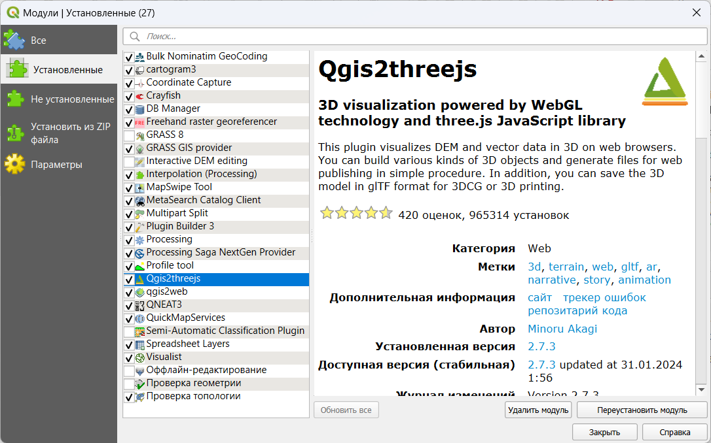
4. Установите модуль **Whitebox Workflows for QGIS**. Будьте внимательны: в репозитории модулей QGIS есть и другие модули с названием Whitebox, вам нужен именно Whitebox Workflows for QGIS.

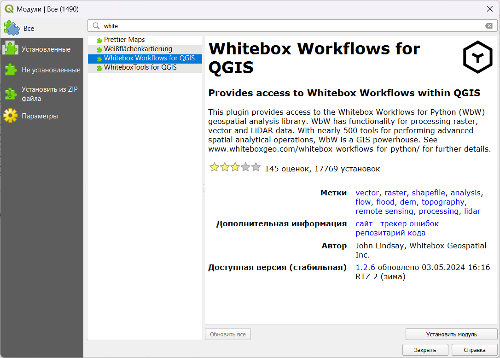
После установки модуля Whitebox Workflows for QGIS его инструменты доступны в панели «Инструменты анализа»:

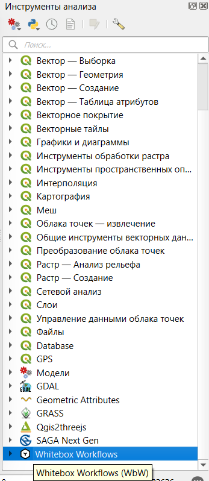

## Подготовка ЦМП к анализу {#hydrodem-preprocessing}
[В начало упражнения ⇡](#hydrodem)

Чтобы работать с цифровой моделью местности, необходимо объединить все тайлы в единую мозаику, затем обрезать (кадрировать) её по охвату территории анализа и перепроецировать из географической системы координат в прямоугольную. 

>Создание мозаики из тайлов, кадрирование и перепроектирование — типичные процедуры подготовки растровых тайлов к геоинформационному анализу. Хранить каждый промежуточный результат в виде отдельного файла, как правило, нет необходимости, а при больших объёмах данных и малых объёмах свободного места на диске — нет и возможности. На помощь здесь приходит виртуальный растр ([VRT](https://gdal.org/drivers/raster/vrt.html)) — структура, хранящая ссылки на исходные данные и необходимые операции их преобразования.

1. Загрузите тайлы FABDEM из папки `fabdem` в проект QGIS.

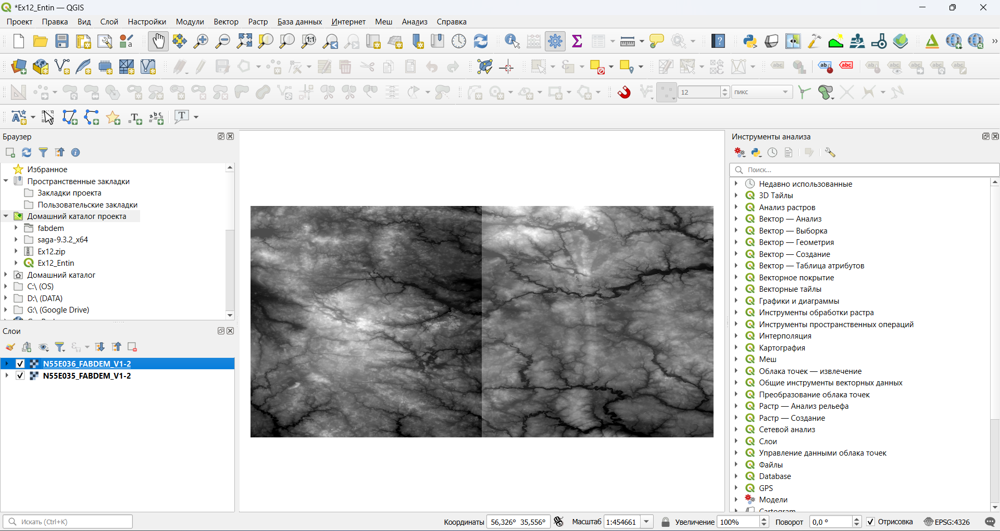

2. Соберите мозаику растровых тайлов. Для этого воспользуйтесь инструментом «Растр» — «Прочее» — «Создать виртуальный растр».

    * Добавьте тайлы FABDEM в качестве исходных данных
    
    * Если установлена опция *Place each input file into a separate band*, отключите её.
    
    * Укажите, что виртуальный растр должен быть сохранён в рабочую директорию под именем `fabdem_mosaic.vrt`
    
    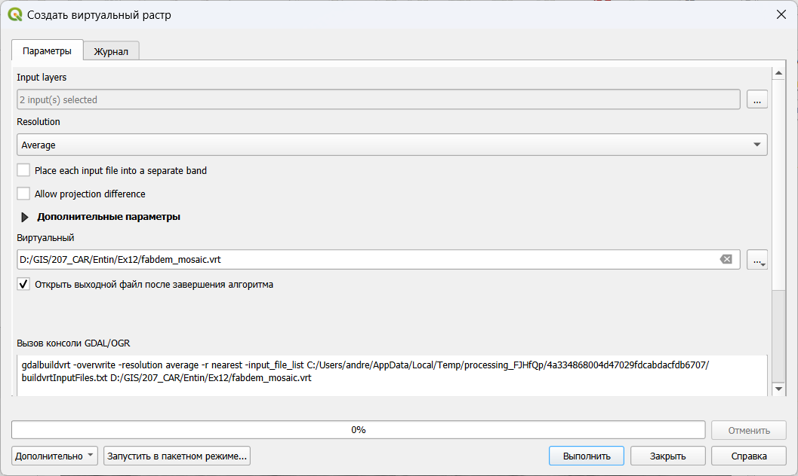
    
    Результат будет автоматически добавлен в проект
    
    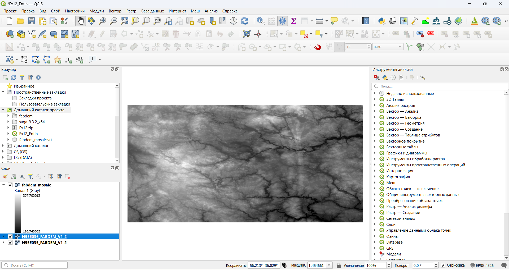

3. Удалите исходные тайлы FABDEM из проекта.

4. Для анализа нам не потребуется вся площадь полученной мозаики, мы можем обрезать (кадрировать) мозаику до необходимого охвата, чтобы оптимизировать скорость вычислений и сократить объём требуемой памяти. Для этого воспользуемся инструментом «Растр» — «Извлечение» — «Обрезать растр по охвату...».

    * Укажите слой fabdem_mosaic в качестве исходного набора данных
    
    * Введите следующий охват обрезки: `35.4,36.5,55.0,55.7` (это, соответственно, минимальная долгота, максимальная долгота, минимальная широта и максимальная широта. Для разделения целой и дробной части используется точка, для разделения чисел — запятая).
    
    * Результат сохраните в рабочую директорию под именем `fabdem_mosaic_crop.vrt`
    
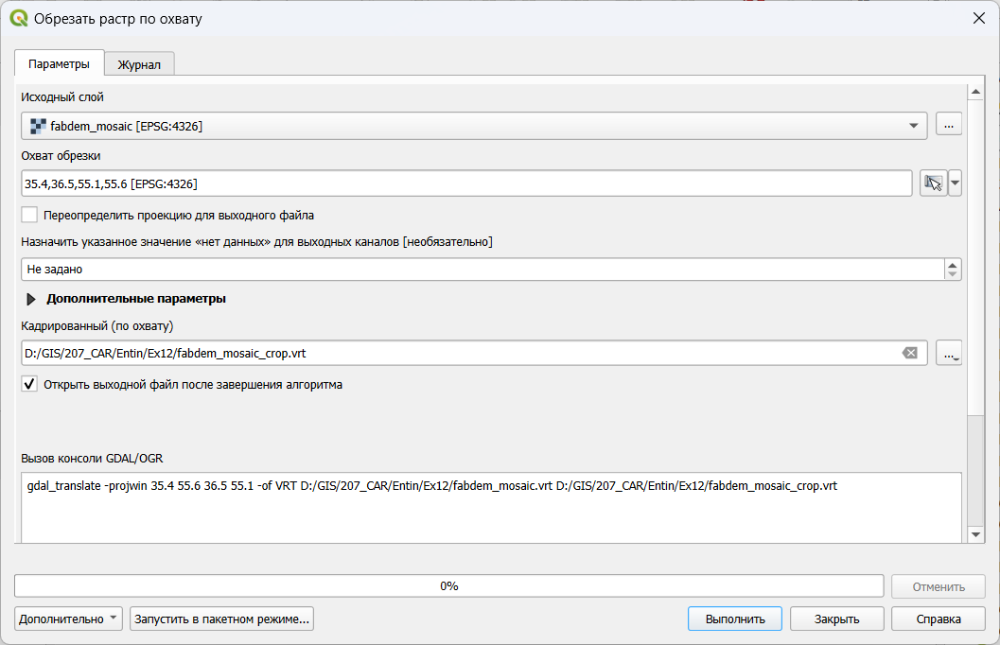

5. Когда результат обрезки будет добавлен в проект, удалите из проекта старую мозаику и увеличьте изображение до охвата обрезанного набора данных.

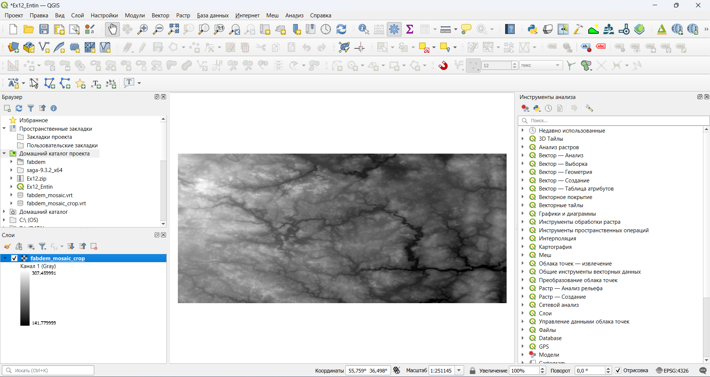

6. Теперь необходимо перевести растр в прямоугольную систему координат. Для крупномасштабного картографирования обычно используют системы координат топографических карт, и в этом смысле наша территория анализа расположена не очень удачно — на стыке двух соседних зон. Выберите подходящую систему прямогольных координат из систем проекции UTM на датуме WGS 84. Нужный номер зоны определите самостоятельно (можно выбрать любую из двух соседних зон). Установите для проекта выбранную систему координат.

Из упражнения 1 мы помним, что QGIS умеет перепроецировать наборы данных на лету. Однако для целей морфометрического анализа ЦМП нам необходимо, чтобы набор данных был «физически» сохранён с использованием проецированной системы координат.

7. Используйте инструмент «Деформация (перепроецирование...)» («Растр» — «Проекции»), чтобы конвертировать вашу мозаику в новый набор данных. Укажите исходную и целевую систему координат (целевая СК должна совпадать с СК проекта), установите метод интерполяции «Билинейная (ядро 2×2)». Сохраните перепроецированный растр под именем `DEM` (от англ. *Digital Elevation Model*) в рабочую директорию, формат файла — GeoTIFF.

Будьте внимательны: все ваши предыдущие результаты сохранялись в формат виртуальных растров (VRT), но на этом шаге вам нужно подготовить «реальный» растр (GeoTIFF). QGIS по умолчанию предложит вам сохранить результат в формат VRT, поскольку именно этот формат использовался в предыдущих шагах. Измените выходной формат на GeoTIFF

8. Когда перепроецированный растр добавится в проект, удалите из него «старую» мозаику и сделайте снимок экрана.

<kbd>В отчёт: снимок экрана №1 – ЦМП, подготовленная к анализу</kbd>

## Гидрологическая коррекция ЦМП {#hydrodem-fill}
[В начало упражнения ⇡](#hydrodem)

На этом и последующих шагах вы примените ряд операций так называемого гидрологического моделирования на основе ЦМП, реализованных в инструментарии Whitebox. Гидрологическое моделирование с использованием ЦМП основывается на следующей идее: моделируемая вода стекает из ячейки с большей высотой в соседнюю ячейку с меньшей высотой. Трассируя поток вниз по склону, можно связывать ячейки в так называемые "сети потока" (*drainage networks*) и определять водосборные площади и границы бассейнов.

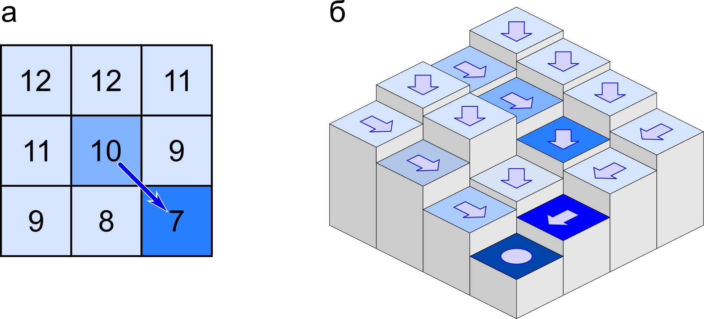

Если на модели есть замкнутые локальные понижения, то они выступают как препятствие для распространения стока. 

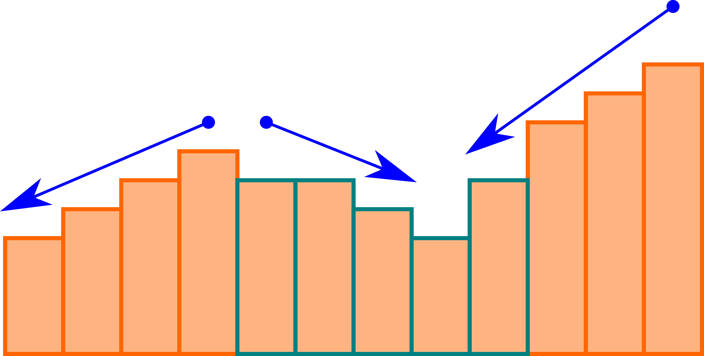

Распространённая практика — удалять замкнутые локальные понижения с ЦМП перед началом собственно гидрологического моделирования. Удалить повышения можно путём заполнения, то есть увеличения высот внутри них — таким образом понижение либо исчезает, либо перестаёт быть замкнутым. По-английски эта операция называется *Fill sinks* или *Fill depressions*. Альтернативный вариант — разрушать границы замкнутых локальных понижений (*Breach depressions*), чтобы они переставали быть замкнутыми. В Whitebox реализованы оба варианта, и разрушение границ в общем случае считается предпочтительным, но из-за особенностей рельефа нашей местности оно, как показывает практика, проигрывает заполнению. Поэтому мы воспользуемся заполнением понижений.

1. Создайте в вашей рабочей директории папку `processing`. Поскольку на этом и на следующих шагах мы будем создавать множество наборов данных с помощью Whitebox, желательно, чтобы они хранились в порядке.

2. Найдите и запустите инструмент **Fill Depressions** через поиск в панели «Инструменты анализа». В Whitebox реализовано несколько инструментов с похожими названиями, вам нужен именно тот, который называется Fill Depressions без всяких уточнений и комментариев.

Настройте параметры инструмента, как указано ниже:

* Входная ЦМП (ЦМР): `DEM`;
* Опция «Исправлять плоские участки» (*Fix flats*) включена;
* Приращение высот для исправления плоскости: $0.000001$.
* Максимальная глубина заполняемого понижения: поставьте любое число, сопоставимое по величине с амплитудой ЦМР, например 50, 100 или 200. Это «пороговая» глубина понижения; алгоритм не заполняет понижения, которые глубже этого порога. Если оставить значение 0, предлагаемое по умолчанию, алгоритм не будет заполнять понижения совсем.
* Результат сохраните в папку `processing` под именем `dem_fill.tif`

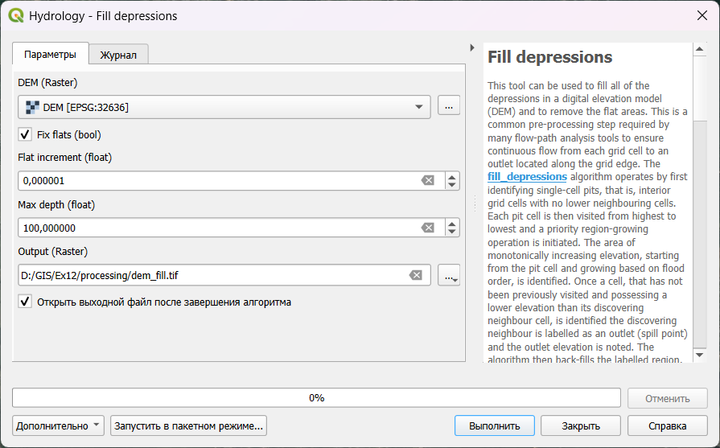

3. Запустите инструмент и дождитесь, пока он закончит работу, а результат обработки будет добавлен в проект.

4. Когда результат будет добавлен в проект, разверните список слоёв и сделайте снимок экрана.

<kbd>В отчёт: снимок экрана №2 – ЦМП после заполнения локальных понижений</kbd>

## Расчёт направлений стока {#hydrodem-flowdir}
[В начало упражнения ⇡](#hydrodem)

Направление стока (англ. *catchment area*) — морфометрический параметр, вычисляемый для каждой ячейки растра и определяющий, в каком направлении потечёт моделируемая вода из центра этой ячейки. Разработан ряд принципов и алгоритмов определения направлений стока, самым простым и наиболее широко используемым из них является D8. Согласно алгоритму D8, весь поток из центральной ячейки распределяется в одну из соседних ячеек по линии наибольшего уклона (или не распределяется, если такой линии не существует). Для каждой ячейки, таким образом, кодируется направление, соответствующее целевой ячейке. Коды представляют собой степени числа 2, как показано на рисунке ниже:

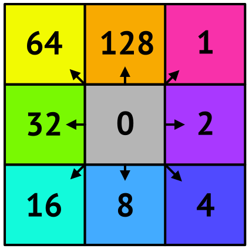

На этом шаге мы создадим растр направлений стока по ЦМП, прошедшей процедуру гидрологической коррекции.

1. Найдите инструмент **D8 Pointer** в панели инструментов анализа и запустите его.

2. В открывшемся окне укажите следующие параметры инструмента:

* Исходная ЦМР: `dem_fill`;
* Опция *ESRI pointer*: оставьте выключенной;
* Результат сохраните в директорию `processing` под именем `dem_fill_flowdir.tif`.

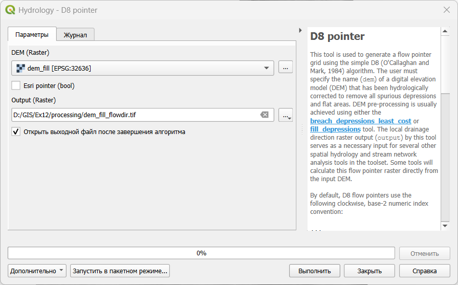

>Примечание: схема нумерации направлений, показанная выше — не единственная возможная. В частности, в программных продуктах компании ESRI (ArcGIS) применяется нумерация, «повёрнутая» относительно этой схемы на 45° по часовой стрелке: направление 1 указывает на восток, 2 — на юго-восток и т.д. Опция *ESRI pointer* позволяет инструменту Whitebox сгенерировать выходной файл, используя нумерацию, принятую в ArcGIS.

3. Запустите инструмент и дождитесь, пока он закончит работу, а результат обработки будет добавлен в проект. Результат будет выглядеть, как показано на рисунке ниже — QGIS не распознаёт, что полученный растр содержит кодированные значения, и «красит» его в оттенки серого.

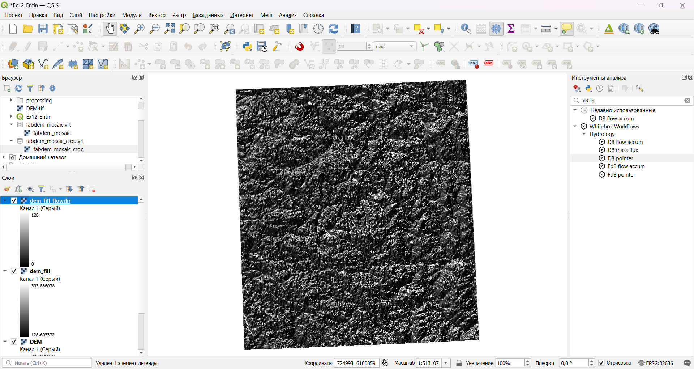

4. Измените настройки визуализации растра направлений стока: поменяйте стиль отрисовки на «Палитра / уникальные значения» и нажмите кнопку «Классифицировать», чтобы назначить собственный цвет каждому уникальному значению в полученном растре. Убедитесь, что список значений содержит только те значения, которые показаны на схеме выше. Если у вас есть время, измените цвета кодов таким образом, чтобы они соответствовали схеме, и настройте подписи, чтобы вместо кода в легенде отображалось географическое направление.

5. Примените новые настройки стиля и сделайте снимок экрана. 

<kbd>В отчёт: снимок экрана №3 – растр направлений стока</kbd>

## Расчёт водосборной площади {#hydrodem-flowacc}
[В начало упражнения ⇡](#hydrodem)

Водосборная площадь (англ. *catchment area*) в геоморфометрии определяется для каждой точки поверхности так, как если бы точка была замыкающим створом. В регулярно-сеточном анализе водосборная площадь определяется для отдельных ячеек ЦМП и равняется суммарной площади всех ячеек, сток из которых проходит через данную ячейку (по принципу, описанному выше). Вместо площадей ячеек можно использовать какой-нибудь весовой коэффициент. Например, если этот коэффициент представляет слой поверхностного стока, то результирующая величина будет являться объёмом стока для данной ячейки.

Водосборную площадь вместе со всеми другими величинами, которые можно рассчитать по аналогичному принципу, часто называют аккумуляцией потока (англ. *flow accumulation*). Похожим образом называются инструменты расчёта водосборной площади в большинстве современных ГИС-пакетов, в том числе в Whitebox.

1. Найдите инструмент **D8 Flow Accum** в панели инструментов анализа и запустите его.

2. Установите следующие настройки:

    * Исходный растр: `dem_fill_flowdir`
    * Тип выходного набора данных: водосборная площадь (*catchment Area*)
    * Опция *Input is pointer* (входной набор данных — растр направлений стока) включена, остальные опции выключены.
    * Результат сохраните в директорию `processing` под именем `dem_fill_flowdir_flowacc.tif`.

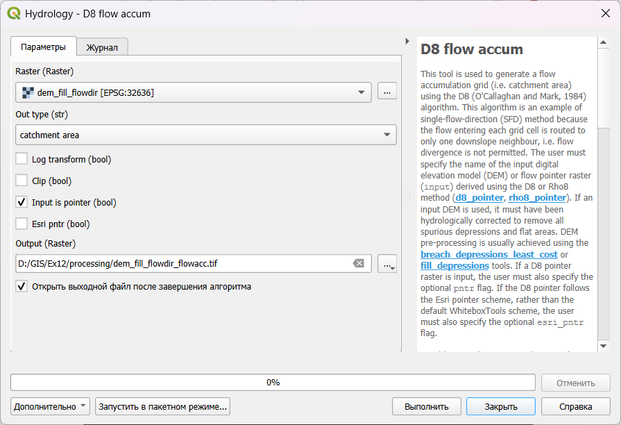

3. Запустите расчёт и дождитесь его завершения (может занимать до 10 минут). По окончании расчётов в проект QGIS будет добавлен новый растровый слой:

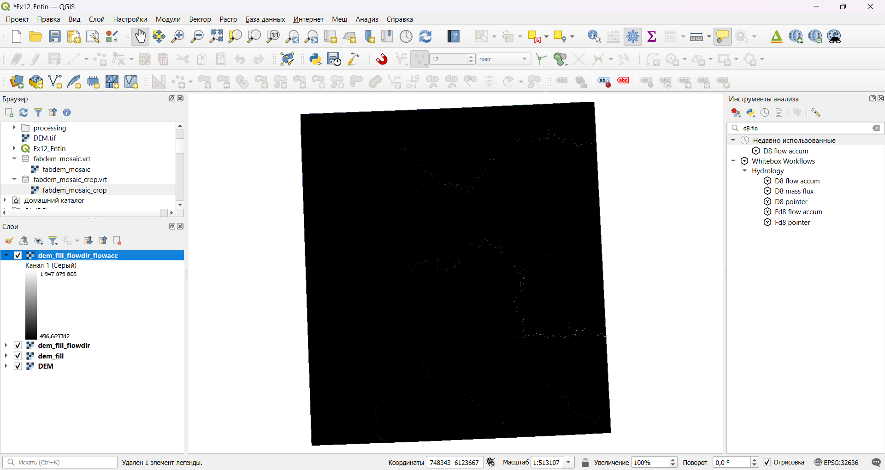

>Водосборная площадь при движении вниз по склону увеличивается экспоненциально, поэтому изображение в оттенках серого, которое вы видите, почти целиком чёрное

5. Измените стиль отображения растра водосборной площади на «Одноканальное псевдоцветное», максимальное значение — `1e7`, и выберите шкалу Blues. Примените изменения.

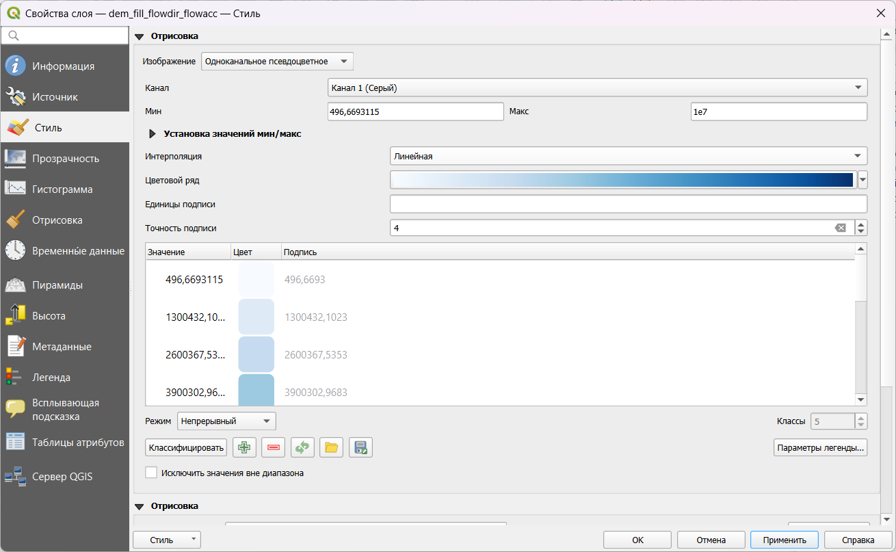

6. В свойствах слоя растра водосборной площади перейдите на вкладку «Пирамиды» и постройте пирамидальные слои всех доступных разрешений для вашего набора данных. Для этого выберите в списке справа все доступные разрешения, установите в переключателе внизу метод передискретизации Гаусса и нажмите кнопку «Построение пирамид». Примените изменения.

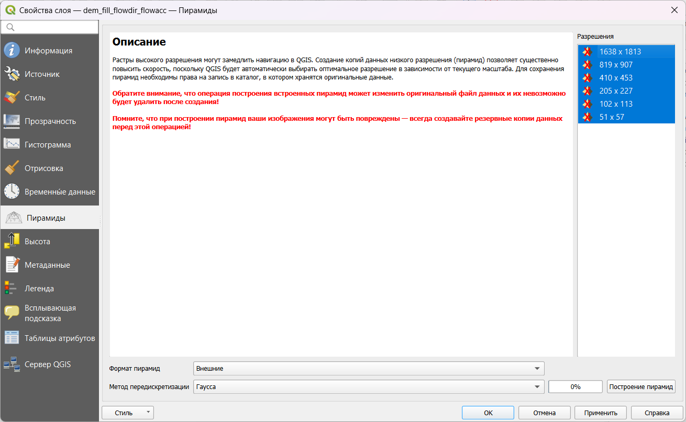

>Пирамидальные слои, или пирамиды — это производные растры относительно низкого разрешения, создаваемые на основе исходного растра для улучшения производительности в процессе визуализации. Если используется мелкий масштаб карты, ГИС-пакет отрисовывает не исходный растр, а один из пирамидальных слоёв.
    
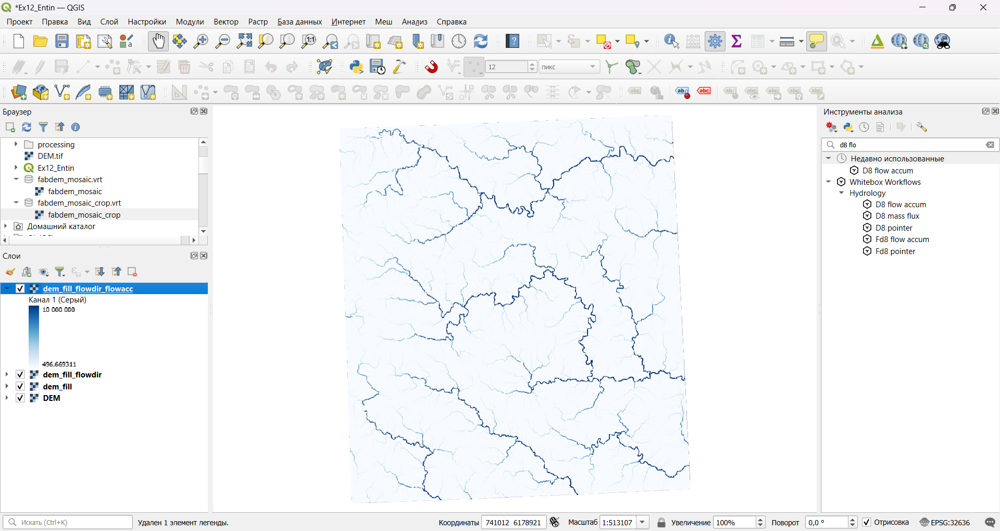
    
>Если после построения пирамид на экране не произойдёт никаких изменений, обновите изображение с помощью клавиши F5 или измените масштаб изображения.

7. Изучите полученное изображение, увеличивая и уменьшая масштаб визуализации. 

8. Установите для растра водосборной площади прозрачность 50 %. Остальные слои отключите.

9. Добавьте в проект базовую карту Google Hybrid. Увеличьте изображение в юго-восточной части растра, где проходит граница Московской и Калужской областей. Найдите деревню Сатино, а к северу от неё — место слияния рек Протва и Исьма. Оцените, в какой мере области высоких значений водосборной площади соответствуют положениям водотоков и крупных эрозионных форм. 

10. В контекстном меню слоя водосборной площади используйте опцию «Увеличить до реального размера (100 %)». Эта опция изменит масштаб картинки на экране таким образом, что один пиксель растра будет соответствовать одному пикселю вашего монитора. Сделайте снимок экрана так, чтобы на него попали окрестности д. Сатино.

<kbd>В отчёт: снимок экрана №4 – растр водосборной площади</kbd>

## Определение границ бассейна р. Протвы {#hydrodem-basin}
[В начало упражнения ⇡](#hydrodem)

Гидрологическое моделирование на основе ЦМР позволяет определять границы водосборного бассейна для произвольной точки местности. Продемонстрируем это на примере створа р. Протвы выше слияния её с р. Исьмой.

1. Создайте новый шейп-файл для хранения точки, соответствующей замыкающему створу бассейна. Обратите внимание, что это должен быть именно шейп-файл: Whitebox не умеет работать с другими типами пространственных данных. Шейп-файл должен иметь точечный тип геометрии, а также ту же систему координат, которая применяется в проекте. Из атрибутов необходим только уникальный идентификатор точки (Id, целочисленного типа).

2. Увеличьте изображение до места слияния Протвы и Исьмы, как показано на рисунке ниже:

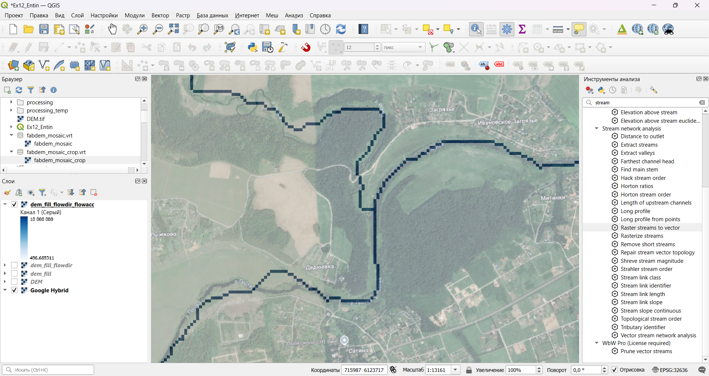

3. Включите режим редактирования для вашего шейп-файла и поставьте точку на ячейку растра, соответствующей руслу р. Протвы выше по течению её слияния с р. Исьмой, как показано на рисунке ниже. Создав точку, сохраните правки и выключите режим редактирования.

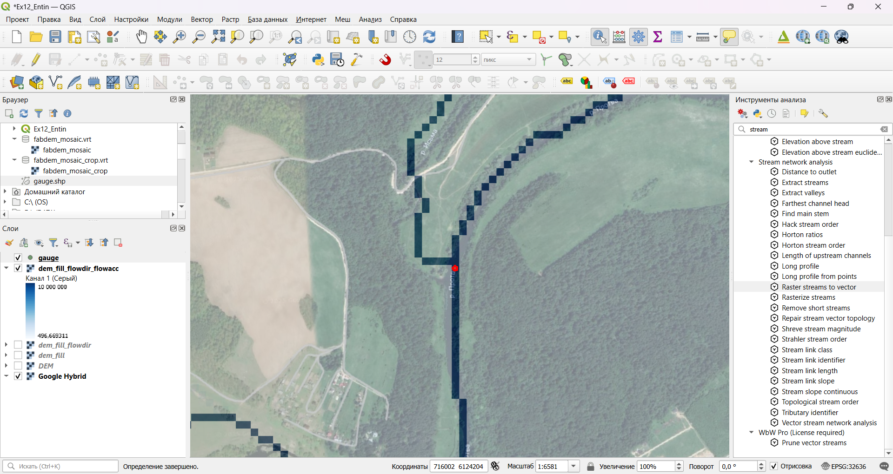

4. Найдите и запустите инструмент **Watershed**. Этот инструмент предназначен для идентификации водосборного бассейна заданного набора точек. Для этого ему нужны растр направлений стока и точки замыкающих створов. Установите настройки инструмента соответствующим образом. Результат можно сохранить во временный файл.

5. Запустите расчёт. Когда результат будет добавлен в проект, увеличьте изображение до полного охвата нового слоя.

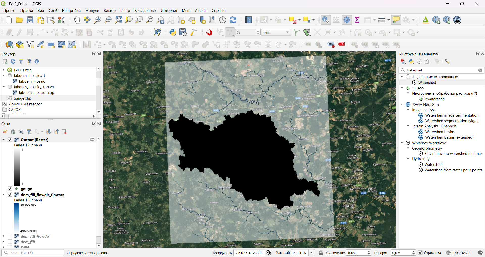
    
На полученном растре представлено всего два значения: значение, соответствующее идентификатору исходной точки для ячеек, входящих в границы бассейна, и значение «нет данных» для всех остальных ячеек. Охват полученного растра соответствует охвату исходного растра направлений стока.
    
6. Векторизуйте полученный растр. Результат векторизации сохраните в корневую папку проекта под именем `basin_protva_polygon`, формат — шейп-файл (*.shp). 

7. Изобразите полученный полигон с помощью обводки красного цвета без заливки. Удалите из проекта растровый слой бассейна.

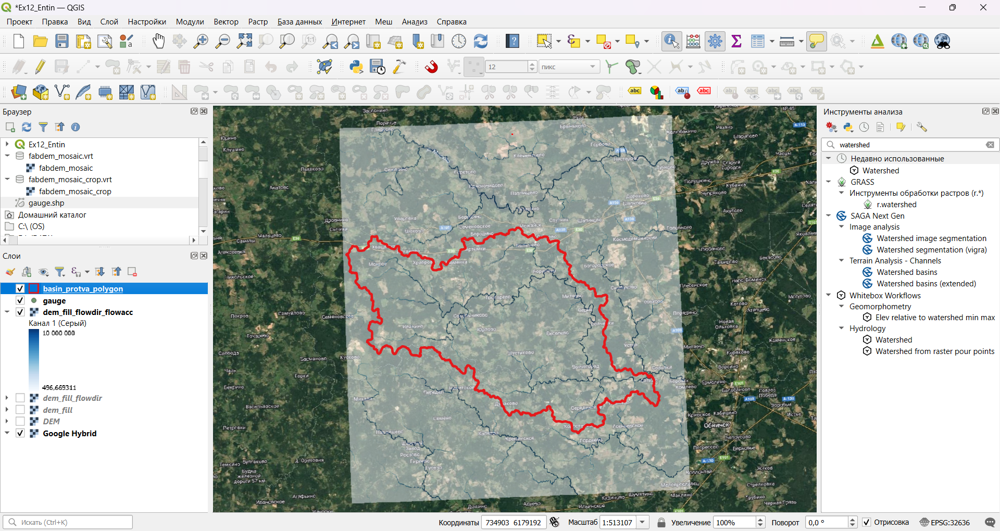

8. Используйте полученный полигон, чтобы обрезать растр водосборной площади по маске. Для этого воспользуйтесь инструментом «Растр» — «Извлечение» — «Обрезать растр по маске...». Поместите целевой растр в папку `processing`, назовите его `flowacc_crop.tif`.

9. Когда «обрезанный» растр будет добавлен в проект, примените к нему ту же символику, которая была задана исходному слою водосборной площади. Сам исходный слой водосборной площади отключите. Увеличьте изображение до охвата границ бассейна и сделайте снимок экрана.

<kbd>В отчёт: снимок экрана №5 – водосборный бассейн и обрезанный растр водосборной площади</kbd>

10. Повторите ту же операцию для растра направлений стока; результат назовите `flowdir_crop.tif`. Когда новый слой будет добавлен в проект, отключите его.

## Создание модели водотоков на основе водосборной площади {#hydrodem-network}
[В начало упражнения ⇡](#hydrodem)

Растр водосборной площади (или объёма стока) позволяет выделить сеть потенциальных водотоков. Ячейка считается принадлежащей к сети потенциальных водотоков, если величина водосборной площади в ней превышает некоторый заданный порог. Это упрощённый принцип, но он позволяет строить сети, подобные реальным.

Для выборки ячеек в QGIS можно воспользоваться уже знакомым вам инструментом переклассификации (см. [Переклассификация наборов данных](#weighted-overlay-reclass)). Но в Whitebox есть специальный инструмент для решения этой задачи, мы воспользуемся им.

1. Найдите и запустите инструмент **Extract Streams**. Этот инструмент принимает на вход растр водосборной площади и пороговое значение, при котором ячейка считается относящейся к водотоку. Используйте в качестве исходных данных слой `flowacc_crop` и пороговое значение, равное $1000000$. Результат сохраните в папку `processing` под именем `flowacc_crop_streams.tif`.

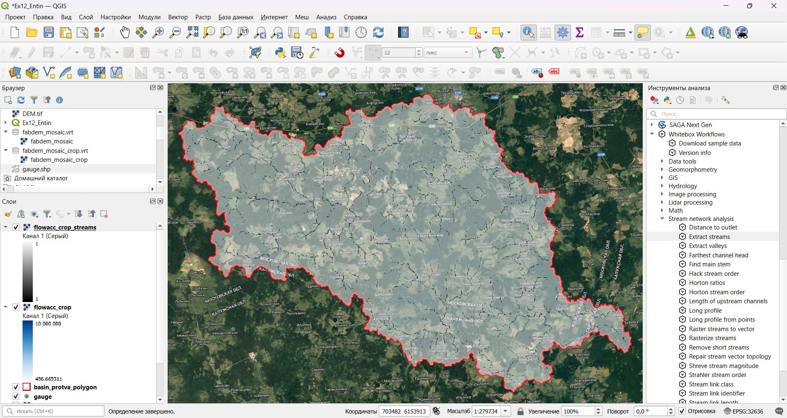

Мы получили растр, в котором значение $1$ маркирует принадлежность ячейки к сети водотоков, а ячейки, не принадлежащие к сети водотоков, имеют значения «нет данных». На основе этой сети можно выполнить множество производных операций — например, назначить каждому сегменту сети уникальный идентификатор или рассчитать порядки водотоков по какой-либо системе.

2. Найдите и запустите инструмент **Stream Link Identifier**. Этот инструмент задаёт уникальные идентификаторы для каждого сегмента сети (от истока до слияния, от слияния до слияния, от слияния до устья). Для работы ему нужны растр направлений стока и растр сети водотоков. Установите соответствующие исходные данные, укажите, что результат следует записать в папку `processing` под именем `stream_links.tif` 

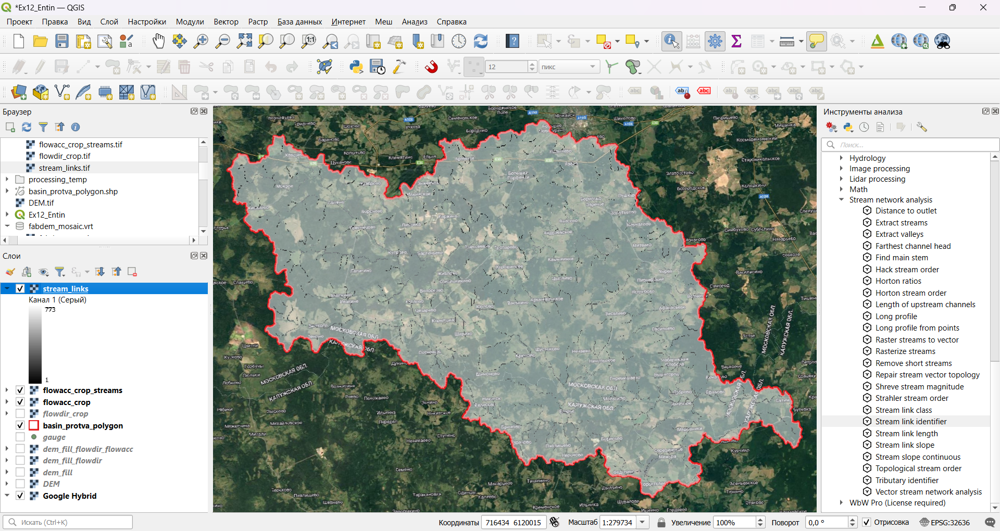

> Примечание: большая часть инструментов Whitebox, принимающих несколько растров на вход, требуют, чтобы эти растры были одинаковой конфигурации, и не будут работать, если вы подадите на вход растры с разным числом строк или столбцов. Об этом возвестит сообщение об ошибке.

4. Отключите слой `stream_links`, мы вернёмся к нему позже.

5. Найдите и запустите инструмент **Strahler Stream Order**. Этот инструмент присваивает сегментам сети порядки по системе Стралера: порядок 1 получают водотоки, начинающиеся от истока, а при слиянии двух водотоков одинакового порядка результирующий порядок увеличивается на единицу. Для работы этого инструмента, как и для Stream Link Identifier, нужны растр направлений стока и растр сети водотоков (в любом виде). Установите соответствующие исходные данные, укажите, что результат следует записать в папку `processing` под именем `stream_order.tif`. 

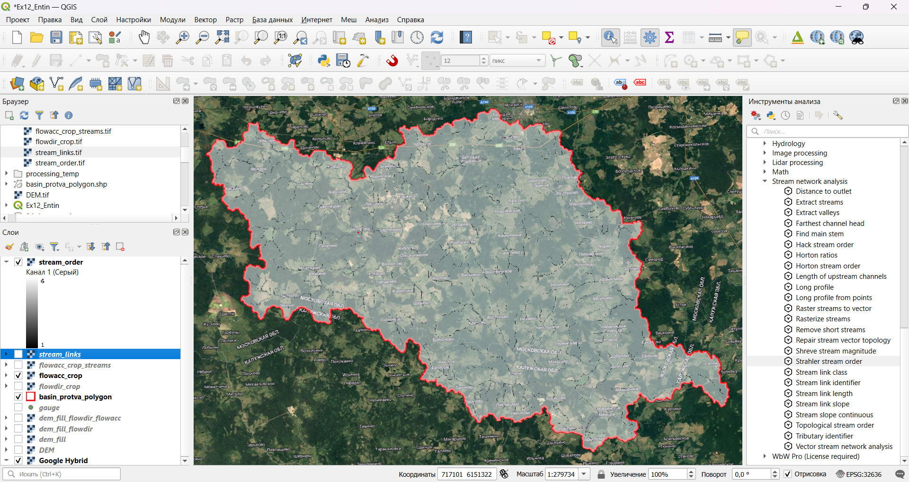

6. Конвертируем полученный растр порядков водотоков в векторный набор данных. Для этого воспользуемся инструментом **Rasters streams to vector**. Этот инструмент не просто векторизует растровые линии водотоков, но и несколько генерализует их в процессе, а также следит за топологической корректностью получаемой сети. Для работы инструмента нужны растровая сеть водотоков (используйте `stream_order`, чтобы сохранить семантику порядков водотоков) и растр направлений стока. Результат сохраните в вашу рабочую директорию под именем `rivers.shp`.

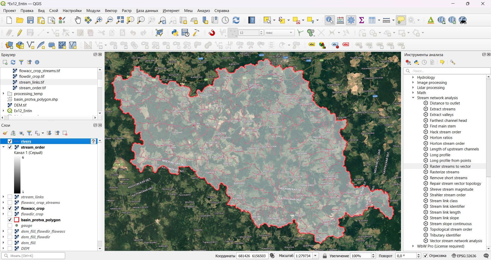

7. Когда слой векторных водотоков будет добавлен в проект, отключите все слои, кроме водотоков и границы бассейна. Также установите для слоя рек правильную систему координат — Whitebox не умеет этого делать.

4. Визуализируйте слой водотоков на основе символизации по диапазонам значений. Значения возьмите из поля `STRM_VAL`, исходный знак — тонкая линия синего цвета, метод (изменения знака) — размер, минимальный размер —  $0,26$, максимальный размер — $1,5$. Окно настройки символов должно быть похоже на изображение ниже:

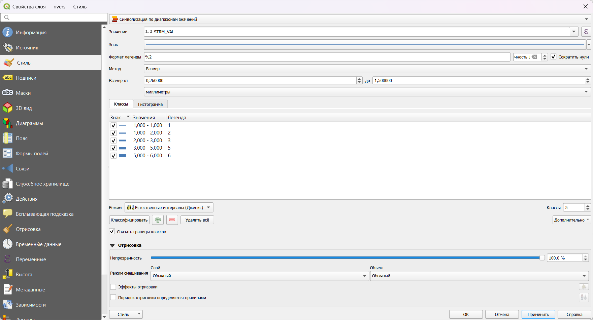

5. Примените настройки стиля, увеличьте изображение до полного охвата слоя водотоков и сделайте снимок экрана.

<kbd>В отчёт: снимок экрана №6 – векторная сеть потенциальных водотоков</kbd>

## Создание покрытия частных водосборов {#hydrodem-watersheds}
[В начало упражнения ⇡](#hydrodem)

В этой части упражнения мы создадим сетку частных водосборов. Частным водосбором сегмента сети называется часть его водосборного бассейна, не включающая бассейны сегментов, расположенных выше по течению. Частные водосборы сегментов сети полностью замощают водосборный бассейн замыкающего створа всей сети и не перекрываются друг с другом.

Для создания сетки частных водосборов в Whitebox используется инструмент Subbasins. Он работает полностью аналогично инструменту Watershed, только замыкающие створы для него задаются не в виде точек, а в виде растра.

1. Отключите векторный слой водотоков и включите растровый слой, где каждому сегменту сети водотоков был назначен уникальный идентификатор (`stream_links`).

2. Найдите и запустите инструмент **Subbasins**. Задайте необходимые исходные данные и укажите, куда сохранить результат. На этом шаге для хранения результата можно использовать временный файл.

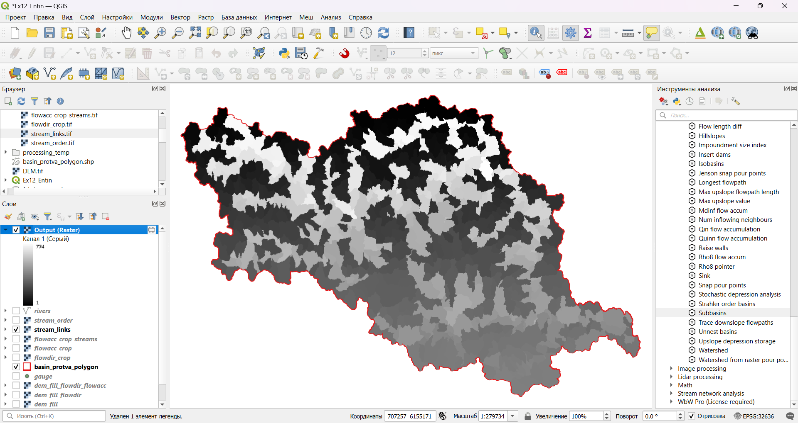

3. Векторизуйте полученную сетку частных водосборов. Результат векторизации можно либо сохранить в папку `processing`, либо оставить временным слоем.

4. Рассчитайте зональную статистику высот (инструмент «Зональная статистика»), используя векторные полигоны частных водосборов в качестве исходного слоя и `dem_fill` в качестве растрового слоя. Рассчитайте минимальную, максимальную, среднюю и медианную высоты, а также амплитуду (диапазон) высот. Результат расчёта сохраните в новый шейп-файл `subbasins_stat` в вашей рабочей директории.

5. Разместите слой `watersheds_stat` под векторным слоем сети водотоков. Отключите все остальные слои, кроме общей границы водосборного бассейна.

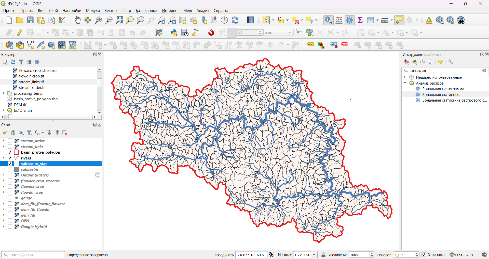

7. Визуализируйте сетку водосборных бассейнов путём символизации по диапазонам значений. Для классификации используйте поле, представляющее среднее. Настройки классификации и цветовую шкалу подберите самостоятельно — но, пожалуйста, не используйте стандартную шкалу оттенков красного, предлагаемую в QGIS по умолчанию. Сделайте снимок экрана.

<kbd>В отчёт: снимок экрана №7 – сетка частных водосборов</kbd>

## Представление результата в виде перспективного изображения {#hydrodem-mapping}
[В начало упражнения ⇡](#hydrodem)

На этом этапе мы создадим трёхмерную визуализацию полученного плоского изображения, используя ЦМП в качестве данных для моделирования высот и модуль Qgis2threejs.

**Внимание!** Модуль Qgis2threejs очень требователен к ресурсам компьютера. Убедитесь, что вы сохранили проект и все необходимые данные, прежде чем приступать к следующим шагам.
 
1. Отобразите слои проекта в охвате любого из слоёв, включённых в проекте в настоящий момент: общей границы бассейна, векторной сети водотоков или сетки частных водосборов.

2. Найдите на панели инструментов иконку модуля Qgis2treejs . Нажмите на неё, чтобы открыть окно модуля.

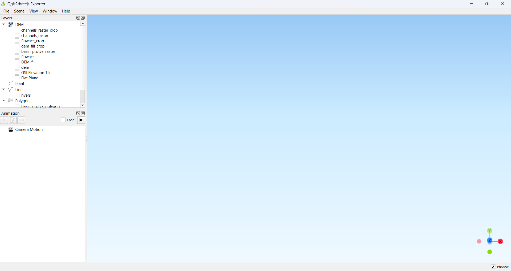

3. В панели слоёв модуля Qgis2treejs (слева вверху) включите слой DEM (исходная ЦМП), чтобы использовать его в качестве базы для показа высот

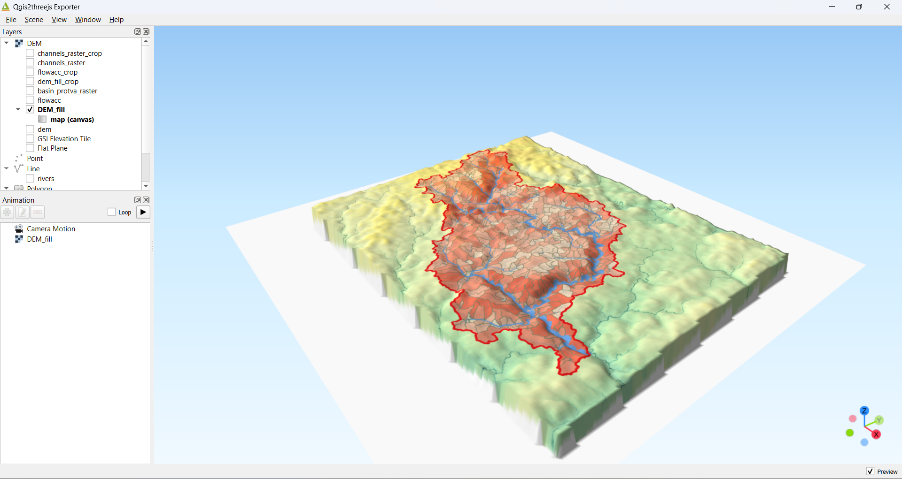

3. Попробуйте вращать, перемещать и масштабировать модель в окне модуля Qgis2treejs с помощью клавиш мыши. Изучите, как работает навигация.

4. После того, как вы освоитесь с навигацией, перейдите в настройки сцены (Scene — Scene Settings) и установите параметр «Вытягивание по вертикали» (*Vertical Exaggeration*) равным $25$. Изучите, как изменилась сцена.

5. Настройте наиболее выгодное изображение сцены (ракурс, вытягивание по вертикали) на свой вкус.

6. Экспортируйте полученное изображение (File – Save Scene As – Image (\*.png) ...) и вставьте его в отчётный файл.

<kbd>В отчёт: рисунок №8 – перспективное изображение ЦМП и тематических данных в окне модуля Qgis2threejs</kbd>

7. Опицонально (для любознательных): экспортируйте сцену как самостоятельную модель (File — Export to Web; обратите внимание, что результат экспортируется в виде набора файлов в указанную папку). Откройте результат экспорта в веб-браузере.