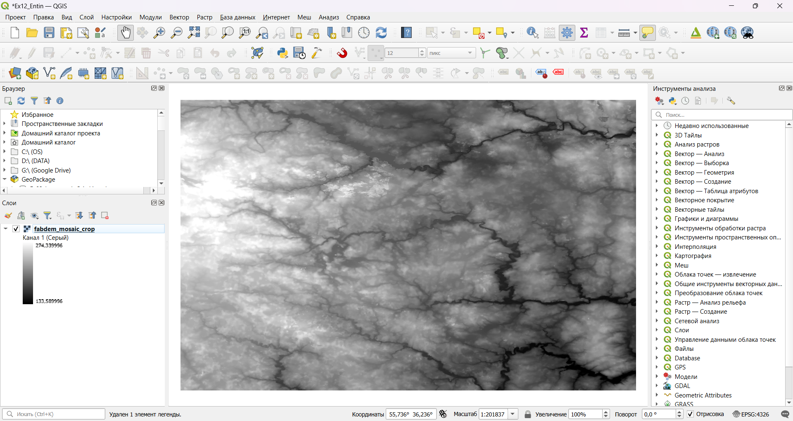
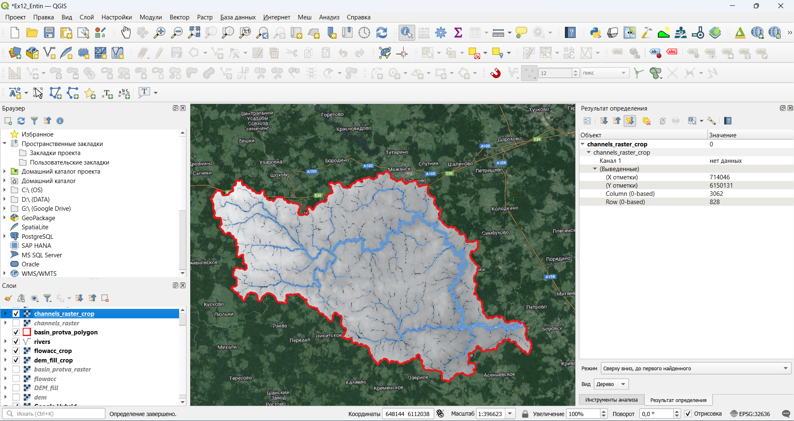
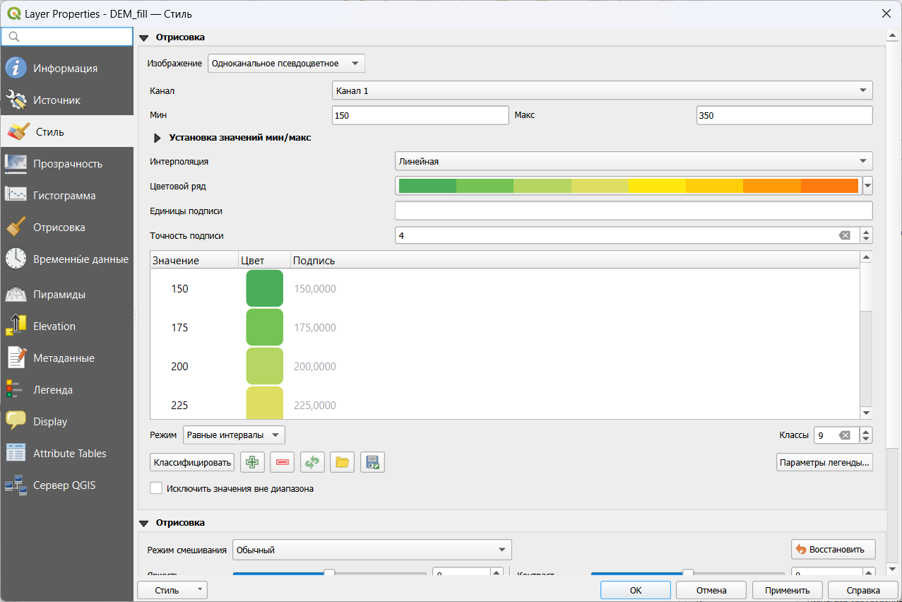

# Гидрологическое моделирование на основе ЦМП {#hydrodem}

[Архив с исходными данными](https://github.com/aentin/qgis-course/raw/master/files/Ex12.zip)

[Контрольный лист](https://github.com/aentin/qgis-course/raw/master/files/Ex12_%D0%BE%D1%82%D1%87%D1%91%D1%82.docx){target="_blank"}

## Введение {#hydrodem-intro}

**Цель задания** — научиться на основе цифровой модели рельефа выделять водотоки и их водосборные бассейны в автоматическом режиме. Осуществлять расчет статистики по высотам в рамках выделенных бассейнов

**Необходимая теоретическая подготовка:** Растровая модель пространственных данных, цифровые модели рельефа (ЦМР), цифровые модели поверхности (ЦМП) и их типы, построение ЦМР, построение производных поверхностей (углы наклона, водосборная площадь), гидрологическое моделирование с использованием ЦМР и его принципы.

**Необходимая практическая подготовка:** Знание основных компонент интерфейса QGIS (менеджер источников данных, таблица слоёв, фрейм карты, менеджер компоновок). Работа с различными форматами источников пространственных данных. Настройка символики и подписей объектов. Владение базовыми ГИС-технологиями. Создание компоновки карты: название, легенда, масштаб, градусная сетка.

**Исходные данные:** тайлы глобальной ЦМП [FABDEM V1-2](https://data.bris.ac.uk/data/dataset/s5hqmjcdj8yo2ibzi9b4ew3sn)

**Результат:** Схема водотоков и их водосборных бассейнов, построенная по ЦМП, с указанием морфометрических параметров бассейнов.

### Контрольный лист {#hydrodem-control}

* Создать виртуальный растр из отдельных тайлов ЦМП;

* Выполнить перепроецирование ЦМП;

* Рассчитать водосборную площадь

* Построить границы бассейна указанного створа

* Обрезать растры по границам построенного бассейна

* Построить сеть тальвегов и частных водосборов

* Рассчитать характеристики поверхности для частных водосборов

* Визуализировать результаты расчёта

### Аннотация {#hydrodem-annotation}

Цифровые модели рельефа играют важную роль в гидрологическом и геоморфологическом анализе. Одно из основных приложений ЦМР, позволивших значительно упростить анализ речных систем, — это автоматизированное построение водосборов и расчет их морфометрических характеристик. Большинство современных программных средств ГИС включают те или иные реализации инструментов гидрологического моделирования на основе ЦМР. QGIS в этом смысле является исключением: у него нет собственных инструментов анализа такого рода, но есть возможность использовать наработки других программных продуктов — например, [GRASS](https://grass.osgeo.org/), [SAGA](https://saga-gis.sourceforge.io/en/index.html) и [Whitebox](https://www.whiteboxgeo.com/whitebox-workflows-for-python/).

В этом упражнении вы используете инструменты SAGA посредством интерфейса QGIS, чтобы выполнить гидрологический анализ цифровой модели рельефа, а затем визуализируете полученный результат в виде блок-диаграммы (3D-изображения).

## Предварительные операции {#hydrodem-init}
[В начало упражнения ⇡](#hydrodem)

Перед началом работы нам потребуется, как обычно, создать и настроить рабочую директорию, а также установить и настроить два плагина для QGIS — а именно [Processing Saga NextGen Provider](https://github.com/north-road/qgis-processing-saga-nextgen), требуемый для анализа, и [Qgis2threejs](https://github.com/minorua/Qgis2threejs), который будет использоваться для визуализации на заключительных этапах анализа. Модуль Qgis2threejs работает «из коробки», а для работы Processing Saga NextGen Provider требуется загрузка дополнительного программного обеспечения.

1. Загрузите исходные данные для упражнения и поместите их в свою рабочую директорию.

2. Запустите QGIS и сохраните проект в свою рабочую директорию.

3. Установите модуль **Qgis2threejs**.

4. Установите модуль **Processing Saga NextGen Provider**.

5. Для работы модуля необходимо, чтобы на вашем компьютере имелся дистрибутив SAGA. Если эта программа уже имеется на вашем компьютере, перейдите к шагу 7. Если у вас нет этой программы, перейдите на [страницу загрузки SAGA GIS](https://sourceforge.net/projects/saga-gis/) и загрузите архив с дистрибутивом, нажав на кнопку Download. Размер архива составляет порядка 80 МБ в сжатом виде и 200 МБ после распаковки.

](images/Ex12_HydroDEM/saga_download_page.png)

6. Когда дистрибутив SAGA GIS будет загружен, распакуйте его в свою рабочую директорию.

>Примечание: строго говоря, неважно, в какой именно директории будет размещён дистрибутив SAGA GIS. Если вы уверенный пользователь ПК, можете размещать его там, где вам удобнее.

7. С помощью Проводника Windows или аналогичных средств MacOS и Linux скопируйте полный путь к каталогу с дистрибутивом SAGA в буфер обмена. Он может выглядеть, например, так: `D:\GIS\207_CAR\Entin\Ex12\saga-9.3.2_x64`.

8. В основном окне QGIS откройте меню «Настройки» — «Параметры» и перейдите на вкладку «Анализ». В открывшемся меню разверните блок «Источники» и найдите в нём пункт «SAGANG». Включите в этом пункте все опции, а в строку SAGA Folder вставьте полный путь к каталогу с дистрибутивом SAGA. Результат будет выглядеть подобно тому, как показано на рисунке ниже:

## Подготовка ЦМП к анализу {#hydrodem-preprocessing}
[В начало упражнения ⇡](#hydrodem)

Чтобы работать с цифровой моделью местности, необходимо объединить все тайлы в единую мозаику, затем обрезать (кадрировать) её по охвату территории анализа и перепроецировать из географической системы координат в прямоугольную. 

>Создание мозаики из тайлов, кадрирование и перепроектирование — типичные процедуры подготовки растровых тайлов к геоинформационному анализу. Хранить каждый промежуточный результат в виде отдельного файла, как правило, нет необходимости, а при больших объёмах данных и малых объёмах свободного места на диске — нет и возможности. На помощь здесь приходит виртуальный растр ([VRT](https://gdal.org/drivers/raster/vrt.html)) — структура, хранящая ссылки на исходные данные и необходимые операции их преобразования.

1. Загрузите тайлы FABDEM из папки `fabdem` в проект QGIS.

2. Соберите мозаику растровых тайлов. Для этого воспользуйтесь инструментом «Создать виртуальный растр» («Растр» — «Прочее»).

    * Добавьте тайлы FABDEM в качестве исходных данных
    
    * Если установлена опция *Place each input file into a separate band*, отключите её.
    
    * Укажите, что виртуальный растр должен быть сохранён в рабочую директорию под именем `fabdem_mosaic.vrt`
    
    
    
    Результат будет автоматически добавлен в проект
    
    

3. Удалите исходные тайлы FABDEM из проекта.

4. Для анализа нам не потребуется вся площадь полученной мозаики, мы можем обрезать (кадрировать) мозаику до необходимого охвата, чтобы оптимизировать скорость вычислений и объём требуемой памяти. Для этого воспользуемся инструментом «Обрезать растр по охвату...» («Растр» — «Извлечение»).

    * Укажите слой fabdem_mosaic в качестве исходного набора данных
    
    * Введите следующий охват обрезки: `35.4,36.5,55.1,55.6` (это, соответственно, минимальная долгота, максимальная долгота, минимальная широта и максимальная широта. Для разделения целой и дробной части используется точка, для разделения чисел — запятая).
    
    * Результат сохраните в рабочую директорию под именем `fabdem_mosaic_crop.vrt`
    
    

5. Когда результат обрезки будет добавлен в проект, удалите из проекта старую мозаику и увеличьте изображение до охвата обрезанного набора данных.

6. Теперь необходимо перевести растр в прямоугольную систему координат. Для крупномасштабного картографирования обычно используют системы координат топографических карт, и в этом смысле наша территория анализа расположена не очень удачно — на стыке двух соседних зон. Выберите подходящую систему прямогольных координат из систем проекции UTM на датуме WGS 84. Нужный номер зоны определите самостоятельно. Установите для проекта выбранную систему координат и сделайте снимок экрана.

**Вопрос 1:** укажите EPSG-код выбранной системы координат

<kbd>**Снимок экрана №1:** окно QGIS после изменения системы координат</kbd>

Из упражнения 1 мы помним, что QGIS умеет перепроецировать наборы данных на лету. Однако для целей морфометрического анализа ЦМП нам необходимо, чтобы набор данных был «физически» сохранён с использованием проецированной системы координат.

7. Используйте инструмент «Деформация (перепроецирование...)» («Растр» — «Проекции»), чтобы конвертировать вашу мозаику в новый набор данных. Укажите исходную и целевую систему координат (целевая СК должна совпадать с СК проекта), установите метод интерполяции «Билинейная (ядро 2×2)». Сохраните перепроецированный растр под именем `DEM` (от англ. *Digital Elevation Model*) в рабочую директорию, формат файла — GeoTIFF.

>Будьте внимательны: все ваши предыдущие результаты сохранялись в формат виртуальных растров (VRT), но на этом шаге вам нужно подготовить «реальный» растр (GeoTIFF). QGIS по умолчанию предложит вам сохранить результат в формат VRT, поскольку именно этот формат использовался в предыдущих шагах. Измените выходной формат на GeoTIFF

8. Когда перепроецированный растр добавится в проект, удалите из него «старую» мозаику.

## Гидрологическая коррекция ЦМП {#hydrodem-fill}
[В начало упражнения ⇡](#hydrodem)

Гидрологическое моделирование с использованием ЦМП основывается на следующей идее: моделируемая вода стекает из ячейки с большей высотой в соседнюю ячейку с меньшей высотой. Трассируя поток вниз по склону, можно связывать ячейки в так называемые "сети потока" (*drainage networks*) и определять водосборные площади и границы бассейнов.

Если на модели есть замкнутые локальные понижения, то они выступают как препятствие для распространения стока. 

Распространённая практика — удалять замкнутые локальные понижения с ЦМП перед началом собственно гидрологического моделирования. Удалить повышения можно путём заполнения, то есть увеличения высот внутри них — таким образом понижение либо исчезает, либо перестаёт быть замкнутым. По-английски эта операция называется *Fill sinks* или *Fill depressions*. Альтернативный вариант — разрушать границы замкнутых локальных понижений (*Breach depressions*), чтобы они переставали быть замкнутыми. В SAGA реализованы оба варианта, но разрушение границ понижений работает значительно дольше заполнения, поэтому мы воспользуемся заполнением.

1. Создайте в вашей рабочей директории папку `processing_saga`. Поскольку на этом и на следующих шагах мы будем создавать множество наборов данных с помощью SAGA, желательно, чтобы они хранились хотя бы в относительном порядке.

2. Найдите инструмент *Fill Sinks XXL (Wang & Liu)* через поиск в панели инструментов. Этот инструмент преобразует ЦМР таким образом, что на месте замкнутых понижений будет сформирована наклонная поверхность. Угол наклона задаётся пользователем. Примените этот инструмент к набору DEM с углом наклона 0,0001°. Результат сохраните в директорию `processing_saga` под именем `DEM_filled`, расширение оставьте таким, какое предлагается по умолчанию (`*.sdat`).

> SAGA GRID — нативный растровый формат SAGA. Он состоит как минимум из двух файлов: заголовка (\*.sgrd) и файла с данными (\*.sdat). Часто к ним добавляется файл с описанием системы координат (\*.prj). Наконец, если набор был создан непосредственно в SAGA (или, что то же самое, в QGIS), он будет сопровождаться файлом *.mgrd, в котором записывается история применения инструментов геообработки.

3. Сравните исходную и скорректированную ЦМП.

**Вопрос 2:** Как изменилась амплитуда высот ЦМП после заполнения замкнутых локальных понижений? Какие формы рельефа изменились наиболее сильно?

## Расчёт водосборной площади {#hydrodem-flowacc}
[В начало упражнения ⇡](#hydrodem)

Водосборная площадь (англ. *catchment area*) в геоморфометрии определяется для каждой точки поверхности так, как если бы точка была замыкающим створом. В регулярно-сеточном анализе водосборная площадь определяется для отдельных ячеек ЦМП и равняется суммарной площади всех ячеек, сток из которых проходит через данную ячейку (по принципу, описанному выше). Вместо площадей ячеек можно использовать какой-нибудь весовой коэффициент. Например, если этот коэффициент представляет слой поверхностного стока, то результирующая величина будет являться объёмом стока для данной ячейки.

Водосборную площадь вместе со всеми другими величинами, которые можно рассчитать по аналогичному принципу, часто называют аккумуляцией потока (англ. *flow accumulation*). Именно так называются инструменты расчёта водосборной площади в большинстве современных ГИС-пакетов, в том числе в последних версиях SAGA. Однако в модуле SAGA Processing Provider сохраняются старые названия соответствующих инструментов.

1. Найдите инструмент **Catchment Area** (без дополнительных слов в названии) в панели инструментов. Запустите его, используя следующие настройки:

    * Исходное поле высот (Elevation): `DEM_filled`
    * Целевой растр аккумуляции (Accumulation Target): `DEM_filled`
    * Метод расчёта: [0] Deterministic 8
    * Выходной растр водосборной площади (Flow Accumulation): сохраните в директорию `processing_saga` под именем `flowacc`. Оставьте включённой опцию «Открыть выходной файл после завершения алгоритма».
    * Все прочие выходные растры: оставьте поля пустыми и отключите опции «Открыть выходной файл после завершения алгоритма».
    * Остальные параметры оставьте по умолчанию.

2. Запустите расчёт и дождитесь его завершения (может занимать до 10 минут). По окончании расчётов в проект QGIS будет добавлен новый растровый слой:

>Водосборная площадь при движении вниз по склону увеличивается экспоненциально, поэтому изображение в оттенках серого, которое вы видите, почти чёрное.

3. Измените стиль отображения растра на «Одноканальное псевдоцветное», максимальное значение — `1e7`, и выберите шкалу Blues. Примените изменения.

4. Перейдите на вкладку «Пирамиды» и постройте пирамидальные слои всех доступных разрешений для вашего набора данных. Для этого выберите в списке справа все доступные разрешения, установите в переключателе внизу метод передискретизации Гаусса и нажмите кнопку «Построение пирамид». Примените изменения.

>Пирамидальные слои, или пирамиды — это производные растры относительно низкого разрешения, создаваемые на основе исходного растра для улучшения производительности в процессе визуализации. Если используется мелкий масштаб карты, ГИС-пакет отрисовывает не исходный растр, а один из пирамидальных слоёв.
    

    
>Если после построения пирамид на экране не произойдёт никаких изменений, перезагрузите проект QGIS.

5. Изучите полученное изображение, увеличивая и уменьшая масштаб визуализации. 

6. Установите для растра водосборной площади прозрачность 50 %. Остальные слои отключите.

7. Добавьте в проект базовую карту Google Hybrid. Увеличьте изображение до севера Калужской области, где находится д. Сатино. Найдите к северу от неё место слияния рек Протва и Исьма.Оцените, в какой мере области высоких значений водосборной площади соответствуют положениям водотоков и крупных эрозионных форм. 

8. Установите масштаб отображения 1:1 и сделайте снимок экрана так, чтобы на него попали окрестности д. Сатино.

<kbd>**Снимок экрана № 2:** растр водосборной площади после настройки визуализации</kbd>

**Вопрос 3:** Можно ли сказать, что области высоких значений водосборной площади, рассчитанной по ЦМП, соответствуют тальвегам эрозионных форм и руслам рек? Ответ обоснуйте.

## Определение границ бассейна р. Протвы {#hydrodem-basin}
[В начало упражнения ⇡](#hydrodem)

Для дальнейшего анализа нам будет нужна только территория водосборного бассейна р. Протвы до слияния её с р. Исьмой. На этом шаге мы определим границы бассейна этого створа. 

1. Увеличьте изображение до места слияния Протвы и Исьмы, как показано на рисунке ниже:

2. В панели слоёв выберите слой `flowacc`, затем включите инструмент идентификации и укажите пиксель растра, предшествующий слиянию. В новых версиях QGIS выбранный пиксель подсвечивается красным цветом. Убедитесь, что в панели результата определения выводятся координаты выбранной точки.

3. Найдите и запустите инструмент **Upslope Area** из группы SAGA. Этот инструмент предназначен для идентификации всех ячеек, сток из которых проходит через точку с заданными координатами — фактически, он позволяет определить границы водосборного бассейна.

4. Задайте входные параметры инструмента **Upslope Area**. Скопируйте координаты X и Y в соответствующие поля. Установите `DEM_filled` в качестве исходной ЦМП и выберите метод Deterministic 8. Остальные опции не задавайте. Результат сохраните в папку `processing_saga` под именем `basin_protva_raster`.

5. Когда результат будет добавлен в проект, увеличьте изображение до полного охвата новго слоя.

    
На полученном растре представлено всего два значения: $100$ для ячеек, входящих в границы бассейна, и $0$ для всех остальных ячеек.
    
6. Векторизуйте полученный растр. Результат векторизации сохраните в папку `processing_saga` под именем `basin_protva_polygon`, формат — шейп-файл (*.shp)

7. Если необходимо, удалите из результата векторизации полигон, соответствующий областям за пределами бассейна р. Протва. Также отключите растр границ бассейна.

8. Изобразите полученный полигон с помощью обводки красного цвета и Удалите из проекта растровый слой бассейна.

9. Используйте полученный полигон, чтобы обрезать растры заполненной ЦМП и водосборной площади по маске. Для этого воспользуйтесь инструментом «Обрезать растр по маске...» («Растр» — «Извлечение»). Назовите целевые растры, соответственно, `DEM_fill_crop.tif` и `flowacc_crop.tif`; обратие внимание, что формат выходного растра опять нужно задать вручную как GeoTIFF.

10. Когда обрезанные слои будут добавлены в проект, расположите их в следующем порядке: вверху полигон водосборного бассейна, затем растр водосборной площади, и под ним растр ЦМП. Остальные слои, кроме мозаики спутниковых снимков, отключите.

11. Сделайте снимок экрана.

<kbd>**Снимок экрана №3:** Границы водосборного бассейна и обрезанные тематические растры</kbd>

## Создание модели водотоков на основе водосборной площади {#hydrodem-network}
[В начало упражнения ⇡](#hydrodem)

Растр водосборной площади (или объёма стока) позволяет выделить сеть потенциальных водотоков. Ячейка считается принадлежащей к сети потенциальных водотоков, если величина водосборной площади в ней превышает некоторый заданный порог. Это упрощённый принцип, но он позволяет строить сети, подобные реальным.

Для выборки ячеек в QGIS можно воспользоваться уже знакомым вам инструментом переклассификации (см. [Переклассификация наборов данных](#weighted-overlay-reclass)). Альтернативный вариант — специально предназначенный для этого инструмент Channel Network из набора SAGA.

1. Запустите инструмент Channel Network. Задайте следующие параметры:

    * Elevation: DEM_fill
    * Initiation grid: flowacc
    * Initiation threshold: $1000000$
    * Остальные параметры оставьте по умолчанию
    
    Обратите внимание, что мы используем исходные наборы данных, а не обрезанные по маске на предыдущем шаге. Это связано с некорректной работой SAGA в этих условиях.
    
    Инструмент выводит три выходных набора данных: 1) растр сети водотоков, где каждый сегмент водотока маркируется уникальным индексом; 2) растр направлений стока для в пределах сети водотоков; 3) векторное представление сети водотоков. Укажите, куда и под каким именем должны быть сохранены эти результаты:
    
    * Растр водотоков: в каталог `processing_saga` под именем `channels_raster`;
    * Растр направлений стока: в каталог `processing_saga` под именем `channels_direction`;
    * Векторная сеть водотоков: в каталог `processing_saga` под именем `channels_polyline`

2. Дождитесь, пока инструмент анализа завершит работу (может занимать порядка 10 минут) и изучите полученный результат.

3. Обрежьте векторное представление сети водотоков, используя границы водобсорного бассейна в качестве маски. Результат сохраните в вашу рабочую директорию (не в папку `processing_saga`) в формате GeoPackage. Файл GeoPackage назовите `Ex12`, а таблицу водотоков в нём — `rivers`.

4. Визуализируйте слой rivers на основе символизации по диапазонам значений. Значения возьмите из поля `Order`, знак — *topo hydrology*, метод (изменения знака) — размер, режим классификации — логарифмическая шкала (см. рисунок ниже).

5. Удалите из проекта исходный векторный слой водотоков и растр направлений стока.

## Создание модели частных водосборов на основе водосборной площади {#hydrodem-watersheds}
[В начало упражнения ⇡](#hydrodem)

В этой части упражнения мы создадим сетку частных водосборов для каждого сегмента водотока. При этом водосбор соответствующего сегмента не будет включать площади, относящиеся к сегментам, лежащим выше по течению.

Для создания сетки частных водосборов в SAGA используется инструмент **Watershed Basins**.

1. Обрежьте растр сети водотоков по маске бассейна. В отличие от предыдущих шагов с обрезкой, отключите опцию «Совместить охват кадрированного растра с охватом слоя маски» — это позволит сохранить экстент исходного растра и при этом не брать в расчёт те водотоки, которые находятся за пределами изучаемого бассейна. Результат сохраните в папку `processing_saga` под именем `channels_raster_crop`, формат — GeoTIFF.

2. Запустите инструмент Watershed Basins. Задайте следующие настройки:

    * Высоты: DEM_fill
    * Сеть водотоков: channels_raster_crop
    * Результат сохраните в `processing_saga` под именем `watersheds_raster`
    
3. Дождитесь, пока инструмент завершит работу. Изучите полученный набор данных.

4. Векторизуйте полученную сетку водосборных бассейнов. Результат векторизации сохраните в папку `processing_saga` под именем `watersheds_vector`.

5. Рассчитайте зональную статистику высот (инструмент «Зональная статистика»), используя `watersheds_vector` в качестве исходного слоя и `DEM_fill` в качестве растрового слоя. Рассчитайте минимальную, максимальную, среднюю и медианную высоты, а также амплитуду (диапазон) высот. Результат сохраните в файл GeoPackage `Ex12`, созданный ранее, под именем `watersheds_stat`.

6. Удалите из проекта все представления частных водосборов, кроме финального `watersheds_stat`. Разместите слой `watersheds_stat` под слоем `rivers`.

7. Визуализируйте сетку водосборных бассейнов путём символизации по диапазонам значений. Для классификации используйте поле `_range`, представляющее амплитуду. Настройки классификации и цветовую шкалу подберите самостоятельно. Установите для слоя прозрачность $50 %$.

## Картографическое представление результата {#hydrodem-mapping}
[В начало упражнения ⇡](#hydrodem)

На этом этапе мы создадим трёхмерную визуализацию бассейна р. Протвы до слияния её с р. Исьмой.

1. Отобразите слои проекта в охвате слоя `DEM_fill`. Включите только следующие слои: границы водосбора, речную сеть (вектор), полигоны частных водосборов (зональная статистика), полный растр водосборной площади (`flowacc`) и `DEM_fill`.

2. Измените настройки визуализации слоя `DEM_fill` следующим образом:

    * Стиль: одноканальное псевдоцветное
    * Минимальное значение: 150
    * Максимальное значение: 350
    * Интерполяция: дискретная
    * Шкала: нажмите правой кнопкой мыши на палитру, выберите «Создать новый градиент», тип градиента — «Каталог: cpt-city». В открывшемся интерфейсе в разделе Topography выберите палитру `wiki-knutux`. 
    * Режим классификации: равные интервалы
    * Число классов: 9
    

После применения настроек изображение должно выглядеть, как показано на рисунке ниже (возможно, с другими настройками отображения частных водосборов):
    

    
3. Найдите на панели инструментов иконку модуля Qgis2treejs . Нажмите на неё, чтобы открыть окно модуля.

4. В окне модуля Qgis2threejs включите слой DEM_fill. Высоты из этого слоя будут использоваться для создания 3D-поверхности, а текстура (материал) изображения будет составлена на основе изображения в основном окне карты.

5. Изображение в окне Qgis2threejs выглядит плоским. Для того, чтобы сделать его более «объёмным», можно увеличить вертикальный масштаб. Для этого зайдите в настройки сцены (Scene – Scene settings...) и установите коэффициент вертикального масштабирования (Z exaggeration) равным $20$.

    
6. Вращая (с помощью зажатой левой кнопки мыши), перемещая (правой кнопкой мыши) и масштабируя (колесо мыши) изображение в окне Qgis2threejs, подберите такой ракурс изображения, который позволит наиболее наглядно, на ваш взгляд, продемонстрировать рельеф местности.

7. Экспортируйте полученное изображение (File – Save Scene As – Image (\*.png) ...) и вставьте его в отчётный файл.

<kbd>**Изображение №4:** трёхмерная визуализация бассейна р. Протва</kbd>