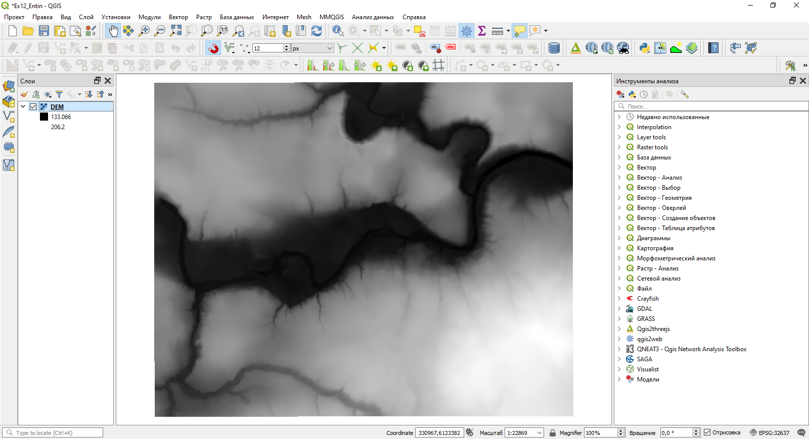
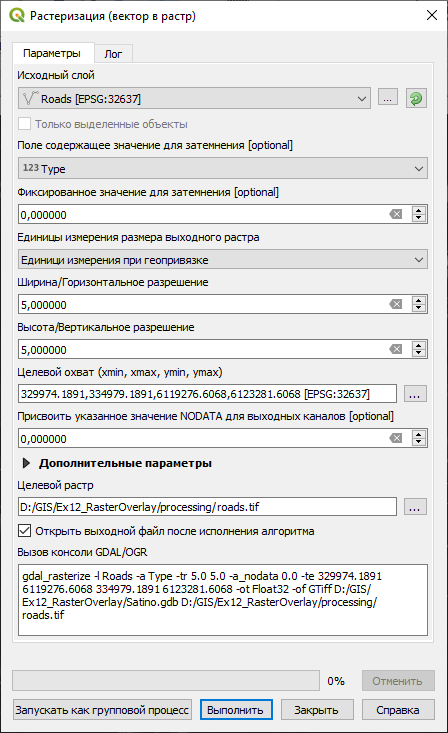
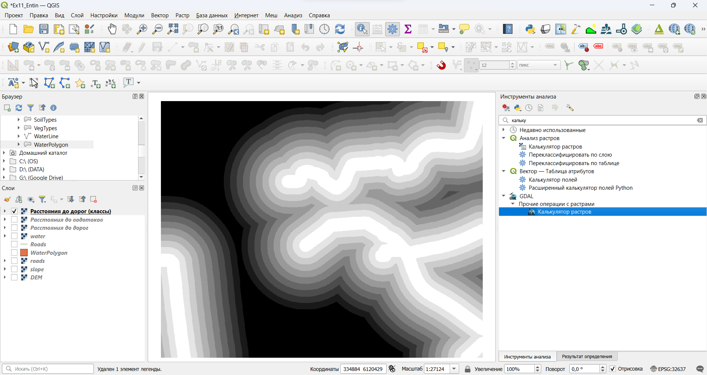
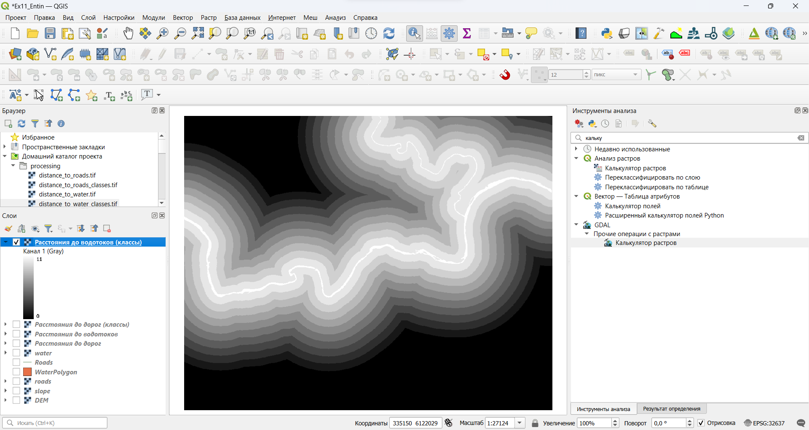
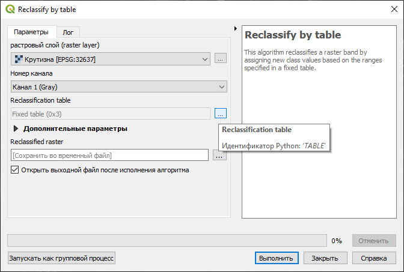
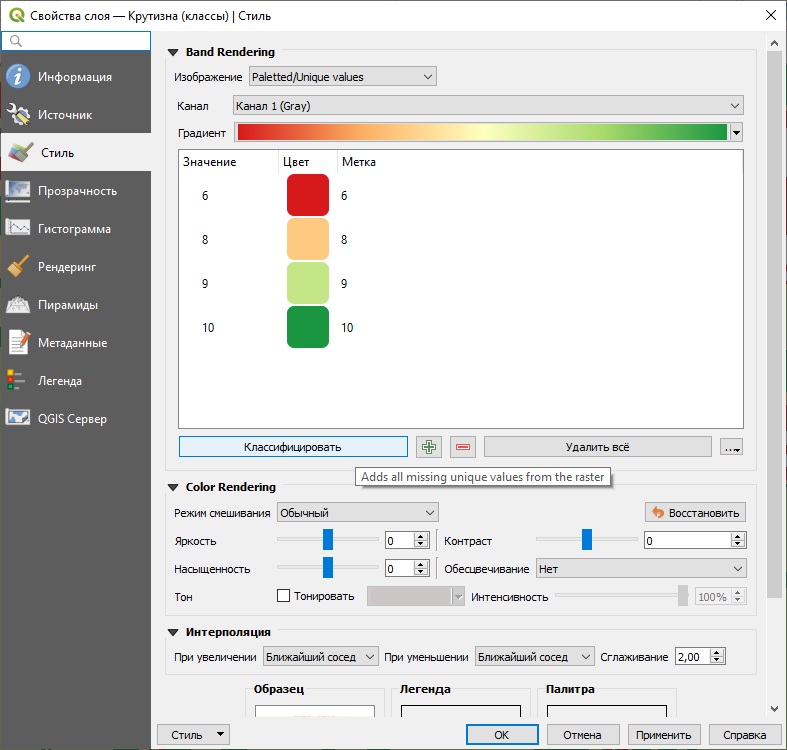

# (PART) Растровый анализ {-}

# Оптимизация местоположения {#weighted-overlay}

[Архив с исходными данными](https://github.com/aentin/qgis-course/raw/master/files/Ex11.zip)

[Контрольный лист](https://github.com/aentin/qgis-course/raw/master/files/Ex11_%D0%BE%D1%82%D1%87%D1%91%D1%82.docx)

## Введение {#weighted-overlay-intro}

**Цель задания** — овладеть основами растрового анализа в ГИС на примере решения задачи поиска оптимального местоположения для размещения объектов.

**Необходимая теоретическая подготовка:** Растровая модель пространственных данных, вычисление евклидова расстояния на плоскости, методы классификации числовых рядов, оверлей с весовыми коэффициентами (взвешенный оверлей).

**Необходимая практическая подготовка:** Знание основных компонент интерфейса QGIS (менеджер источников данных, таблица слоёв, фрейм карты, менеджер компоновок). Работа с различными форматами источников пространственных данных. Настройка символики и подписей объектов. Владение базовыми ГИС-технологиями.

**Исходные данные:** База данных ГИС «Сатино», цифровая модель рельефа Сатинского полигона

**Результат:** Набор пространственных данных, содержащий участок, оптимальный по совокупности критериев для размещения объектов.

### Контрольный лист {#weighted-overlay-control}

* Конвертировать слой землепользования в растровое представление
* Построить и классифицировать растр углов наклона рельефа
* Построить и классифицировать растры расстояний до водотоков и домов
* Осуществить взвешенный оверлей полученных растров
* Конвертировать класс с максимальной суммой баллов в векторное представление и выбрать участок, удовлетворяющий критерию минимальной площади.


### Аннотация {#weighted-overlay-annotation}

В предыдущих заданиях вы познакомились с редактированием векторных данных. Для ряда практических задач более удобным оказывается растровое представление. Оно хорошо подходит для анализа географического пространства, которое обладает постоянно меняющимися характеристиками среды. Растровая модель топологически неразрывна, что позволяет моделировать различные поля и перенос вещества в пространстве из одной ячейки в другую. В силу своей регулярности растровая модель проста в обработке, поскольку все операции можно унифицировать, ориентируясь на матрицу ячеек. В частности, к растровым слоям удобно применять операции алгебры карт, такие как сложение, вычитание, суммирование — что и используется данном задании.

Вам предстоит решить задачу выбора оптимального местоположения участка для строительства производственного объекта. Критерии выбора следующие:

* участок должен располагаться на горизонтальном участке или участе с небольшим уклоном. Площадки с крутизной склона более *18°* запрещены для строительства;

* участок должен располагаться вблизи автомобильных дорог;

* участок должен располагаться вблизи крупных водотоков, поскольку требуется водоснабжение;

* оптимальные зоны для размещения — открытые пространства, такие как выгоны, пустыри, луга, вырубки и т.д;

* необходимая площадь участка — не менее *2,5 га*.

### Прежде чем начать... {#weighted-overlay-warning}

Инструкция по выполнению этого упражнения предполагает использование инструментов [GDAL](https://gdal.org/), интегрированных в сборку QGIS. GDAL печально известен трудоёмкостью установки и нестабильной работой при малейших отклонений от «правильных» условий. Поэтому, если инструменты GDAL выдают ошибку при попытке запуска, попробуйте следующие решения:

1) Обновите QGIS до последней стабильной версии;

2) Воспользуйтесь альтернативными инструментами GRASS и SAGA, интегрированными в QGIS. Для каждого инструмента GDAL в инструкции указаны альтернативные инструменты GRASS и SAGA.


## Добавление исходных данных {#weighted-overlay-init}
[В начало упражнения ⇡](#weighted-overlay)

1. Скопируйте папку с исходными данными в вашу рабочую директорию и создайте в ней новый проект QGIS.

2. Создайте в этой же папке вложенную папку `processing`. Вы будете использовать её для хранения промежуточных результатов.

2. Добавьте в проект цифровую модель рельефа (ЦМР, файл `DEM.tif`).

    
    
3. Откройте свойства слоя ЦМР и перейдите на вкладку «Информация». Изучите характеристики файла ЦМР.

> Для описания геометрии растрового набора данных обязательно задаются следующие характеристики: число строк, число столбцов, шаг сетки (размер ячейки), начальные координаты. Некоторые форматы хранения растровых данных (в том числе GeoTIFF) поддерживают многоканальность; в этом случае указывается также число каналов. В разном программном обеспечении эти параметры могут называться немного по-разному.

**Вопрос 1**: впишите в отчётный файл основные характеристики ЦМР.
    
## Расчет углов наклона {#weighted-overlay-slopes}
[В начало упражнения ⇡](#weighted-overlay)

В QGIS имеется ряд инструментов для создания и анализа поверхностей, представленных в растровой форме. Изучите список доступных инструментов в меню «Растр» — «Анализ». 

> Создание, анализ и визуализация поверхностей (в том числе поверхности рельефа) — большая область исследований на стыке геоинформатики, физической географии и ряда других наук. В зарубежной традиции её принято называть *геоморфометрией* (англ. *geomorphometry*). Создание и использование алгоритмов расчёта морфометрических характеристик поверхности, таких как крутизна и экспозиция склона — одна из многих задач, решаемых геоморфометрией.

3. Откройте интерфейс инструмента «Крутизна...» из группы «Растр» — «Анализ».

4. Задайте DEM в качестве исходного слоя, все остальные параметры сохраните по умолчанию. Сверните блок «Дополнительные параметры» — в этом упражнении они не требуются.

5. Укажите путь к выходному файлу. По умолчанию QGIS предлагает вам сохранять результат во временный файл, но мы запишем результат явно. Для этого нажмите на многоточие `...` справа от поля «Крутизна» в нижней части формы и выберите опцию «Сохранить в файл». Укажите, что файл следует сохранить в папку `processing` под именем `slope.tif`.  
    
    В итоге интерфейс настройки инструмента «Крутизна...» будет выглядеть, как показано на рисунке ниже:
    
    
    
6. Убедитесь, что опция «Открыть выходной файл после исполнения алгоритма» включена. Запустите инструмент. Дождитесь, пока результат расчёта добавится в проект. Присвойте добавленному слою имя «Крутизна», слой цифровой модели рельефа отключите.

    > Если инструмент GDAL не сработал, альтернативные инструменты для расчёта углов наклона можно найти в Панели инструментов: `Slope, Aspect, Curvature` (SAGA), `r.slope.aspect` (GRASS). В обоих случаях нужно снять отметки «Открыть выходной файл после исполнения алгоритма» для всех результатов, кроме крутизны склона (Slope). Остальные настройки задаются по аналогии или сохраняются по умолчанию.

    **Скриншот 1:** рассчитанный растр крутизны склона

7. Изучите свойства рассчитанного набора данных.

    Обратите внимание, что геометрия полученного растра (число строк и столбцов, размер ячейки) полностью совпадает с геометрией исходной ЦМР. 
    
    > Для любознательных: если вы увеличите изображение до края полученного растра и одновременно включите обратно слой ЦМР, вам может показаться, что растр ЦМР «шире», чем растр крутизны. Это на самом деле не так: просто краевым ячейкам растра крутизны присвоены значения «нет данных». При желании можно этого избежать, включив опцию «Обрабатывать краевые ячейки» в настройках инструмента расчёта крутизны.
    
    Далее мы получим ещё несколько растровых наборов данных, но уже не на основе ЦМР. Однако нам придётся следить, чтобы все растры имели одинаковую геометрию. В некоторых программных продуктах (GRASS, SAGA) это требование соблюдается автоматически, в других (ArcGIS) можно заранее задать необходимые настройки. QGIS в настоящее время не поддерживает такие опции на уровне проекта, поэтому геометрию растра придётся задавать каждый раз заново.
    
8. Закройте свойства слоя «Крутизна».

## Расчет расстояний {#weighted-overlay-distances}
[В начало упражнения ⇡](#weighted-overlay)

Чтобы определить участки, наиболее подходящие с точки зрения транспортной доступности, можно построить растр, в каждой ячейке которого будет содержится расстояние (евклидово) от центра этой ячейки до ближайшей дороги. Такое представление имитирует непрерывное поле расстояний. 

### Расстояния до дорог {#weighted-overlay-roads}

1. Добавьте на карту слой дорог `Roads` из базы геоданных `Satino`.

2. Изучите таблицу атрибутов слоя.

    **Вопрос 2**: как соотносятся записи в поле `Type` и поле `Description`? Какие значения поля `Type` имеют асфальтированные и просёлочные дороги?

    Для того, чтобы построить растр расстояний, мы сначала конвертируем данные о дорогах в растровое представление

3. Конвертируйте слой дорог в растр. Для этого запустите инструмент «Растр» — «Преобразование» — «Растеризация (вектор в растр)...». Настройте параметры инструмента, как описано ниже:

    a. Исходный набор данных: `Roads`;
  
    b. Поле, содержащее значение для затемнения: `Type`. Название опции некорректно переведено на русский язык — на самом деле здесь задаётся столбец таблицы атрибутов, значения из которого будут записаны в результирующий растр. Большинство растровых форматов не поддерживают запись строковых переменных в ячейки растра, поэтому система позволяет использовать только атрибуты «числовых» типов. 
  
    c. Единицы измерения выходного растра: единицы, используемые при геопривязке;
  
    d. Ширина/горизонтальное разрешение: 5;
  
    e. Высота/вертикальное разрешение: 5;
  
    f. Целевой охват: нажмите на многоточие справа, выберите опцию «Использовать охват слоя...» и используйте охват слоя DEM;
  
    g. Целевой растр: сохраните растр под названием `roads.tif` в папку `processing`;  
    
    Интерфейс настройки инструмента примет вид, как показано на рисунке ниже

    
    
    ***Важное замечание**: настройки c — f в списке выше отвечают за геометрию растра. Мы задали их таким образом, чтобы конфигурация создаваемого растра соответствовала тем растрам, которые уже есть в проекте.* 

    Результат работы инструмента растеризации:
    
    
    
    > Альтернативный инструмент: `Rasterize` (SAGA). Нужно установить целочисленный тип выходных данных. Перед запуском инструмента рекомендуется сделать выборку в исходном векторном слое, для этого изучите следующий пункт инструкции.
    
4. Рассчитайте евклидово расстояние до дорог. Для этого запустите инструмент «Растр» —  «Анализ» — «Близость (расстояния в растре)...».

5. Настройте инструмент следующим образом:

    * Исходный слой: растровый слой дорог;
    
    * Список значений пикселов в исходном изображении...: перечислите через запятую те значения, которые соответствуют асфальтированным и просёлочным дорогам.
    
    * Единицы расстояния: координаты геопривязки  
    
    Остальные параметры оставьте по умолчанию. Сохраните результат в папку `processing` под именем `distance_to_roads.tif`. Убедитесь, что включена настройка добавления результата в проект после окончания расчёта.
    
    > Альтернативный инструмент: `Proximity` (SAGA), `r.grow.distance` (GRASS). Эти инструменты не умеют применять условие для выборки значений из исходного растра, поэтому вернитесь на предыдущий шаг и осуществите выборку в векторном слое перед его растеризацией.
    
6. Когда слой добавится в проект, переименуйте его в «Расстояние до дорог».

7. Измените символику слоя:

    * Стиль: одноканальное псевдоцветное» 
    * Минимальное значение: 0
    * Максимальное значение: 2500
    * Тип интерполяции: дискретная 
    * Градиент: Magma (после установки градиента нажмите на него правой кнопкой мыши и используйте опцию «Инвертировать градиент»)
    * Мода: «равные интервалы»
    * Число классов: 25
    
    В некоторых версиях QGIS может потребоваться нажать кнопку «Классифицировать», чтобы применить заданные настройки. Итоговый результат должен выглядеть как послойная окраска изолиний. В случае затруднений с настройкой символики обратитесь к преподавателю.
    
8. Разместите растровый слой дорог над слоем расстояний до дорог. Сделайте скриншот окна QGIS.

**Скриншот 2:** рассчитанный растр расстояний до дорог

### Водотоки {#weighted-overlay-streams}

1. Отключите все слои.

1. Добавьте на карту слой «площадных» объектов гидрографии `WaterPolygon` из базы геоданных `Satino`.

2. Выберите (любым способом) объекты, соответствующие р. Протве и р. Исьме.

3. Растеризуйте выбранные объекты. Самостоятельно установите настройки инструмента растеризации таким образом, чтобы использовать только выделенные объекты. Ячейкам растра, соответствующим объектам гидрографии, должно быть присвоено фиксированное значение 1 (атрибутивные поля не используются). Кроме того, геометрия получаемого растра должна быть аналогична всем остальным растрам в проекте. Сохраните растр в папку `processing` под именем `water.tif`.

    *Примечание: в некоторых версиях QGIS после активации опции «Только выделенные объекты» выдаётся сообщение об ошибке, как на рисунке ниже. **Сообщение об ошибке можно игнорировать.***
    
    
    
    Результат будет выглядеть, как показано на рисунке:
    
    

4. Рассчитайте евклидово расстояние до водотоков аналогично тому, как вы рассчитывали евклидово расстояние до дорог. Назовите выходной файл `distance_to_water.tif`.

5. Когда новый слой добавится в проект, переименуйте его в «Расстояние до водотоков».

6. Скопируйте символику из слоя «Расстояние до дорог» (контекстное меню слоя — «Стили» — «Копировать стиль») в слой «Расстояние до водотоков» (контекстное меню слоя — «Стили» — «Вставить стиль»).

Расположите векторный слой объектов гидрографии над растром расстояния до водотоков и отключите все остальные слои. Сделайте скриншот окна QGIS

**Скриншот 3:** рассчитанный растр расстояний до водотоков

## Переклассификация наборов данных {#weighted-overlay-reclass}
[В начало упражнения ⇡](#weighted-overlay)

Мы подготовили три набора данных, характеризующих различные критерии пригодности участков для строительства. Два их них измеряются в метрах, ещё один — в градусах. Для того, чтобы иметь возможность сопоставлять величины, измеренные в разных единицах, можно использовать нормирование или перейти от точных значений к баллам благоприятности. В последнем случае говорят о **переклассификации** числового ряда. Мы определим балльную оценку на основе имеющихся значений растров.

В большинстве программных средств ГИС существуют специальные инструменты для переклассификации значений растров. Они называются Reclass, Reclassify или другим аналогичным образом. Есть такой инструмент и в QGIS, однако сейчас мы воспользуемся не им, а *Калькулятором растров*. Это инструмент, который позволяет применять алгебраические выражения к значениям исходных растров и получать производные растры с рассчитанными значениями.

### Переклассификация растров расстояний {#weighted-overlay-reclass-distance}

Для переклассификации растров расстояний до дорог и расстояний до водотоков мы воспользуемся функцией **Калькулятора растров**. Калькулятор растров позволяет применять к ячейкам растра алгебраические выражения и простые условные операторы; результат вычислений записывается в новый растр.

В QGIS доступно несколько инструментов, выполняющих функцию калькулятора растров. Один из них разработан непосредственно в рамках QGIS, остальные заимствуются из другого программного обеспечения ([GDAL](https://gdal.org/), [GRASS](https://grass.osgeo.org/), [SAGA](http://www.saga-gis.org/en/index.html)). Мы воспользуемся калькулятором растров GDAL.

1. Откройте панель инструментов анализа, если она не открыта. Это можно сделать при помощи комбинации клавиш `Ctrl+Alt+T`, из контекстного меню панелей инструментов или через меню «Анализ данных» — «Панели инструментов»

    

2. В панели инструментов найдите группу инструментов GDAL, а в ней — подгруппу Raster Miscellaneous. Запустите инструмент «Калькулятор растров» из этой группы.

3. Выберите в качестве исходного слоя A «Расстояние до дорог». Исходные слои B, C, D, E, F не задавайте.

    

4. В поле «Вычисление...» введите формулу:

    **`10 - A/100`**  

    Здесь A — значение в ячейке растра. 10 — максимальное количество баллов, при удалении от дорог на каждые 100 м число баллов будет уменьшаться на 1.
    
5. В поле «Тип целевого растра» установите значение `Byte`. Это округлит результат расчёта до целых чисел.

    >Примечание: «байтовый» тип выходных данных означает, что одно значение ячейки записывается одним байтом. Следовательно, область допустимых значений для такого растра составляет [0, 255].

6. Укажите, что целевой растр должен быть сохранён в папку `processing` под именем `distance_to_roads_classes.tif`

    

7. Дождитесь, пока созданный файл добавится в проект. Переименуйте его в «Расстояния до дорог (классы).
    
    
    
    
    > В качестве альтернативного инструмента на этом этапе следует воспользоваться `Raster Calculator` (SAGA). Введите формулу `ifelse((10 - g1 / 100) > 0, (10 - g1 / 100), 0)` и установите тип данных беззнаковый целочисленный 2-байтовый (Unsigned 2 byte integer).
    
8. Аналогичным образом переклассифицируйте расстояния до водотоков. Назовите выходной файл `distance_to_water_classes.tif`, а слой в QGIS — «Расстояния до водотоков (классы)».

    

### Переклассификация растра крутизны {#weighted-overlay-reclass-slope}

Для оценки пригодности мы заменим точные значения крутизны склона (в градусах) на баллы благоприятности по 10-балльной шкале, где 10 — наивысшая благоприятность, 0 — минимальная благоприятность.

Старые значения, °    Новые значения
-------------------   ---------------
0-3                   9
3-6                   10
6-9                   8
9-18                  6
\>18                  *NoData*

*Примечание: при значениях крутизны больше 18° строительство, как правило, сопряжено с решением нетривиальных инженерных задач. При переклассификации мы не будем определять новых значений для ячеек с крутизной более 18°. Впоследствии, при суммировании балльных оценок, это приведёт к тому, что соответствующие ячейки получат значение NoData независимо от того, какие значения будут записаны в других слагаемых.*

Для переклассификации крутизны склона мы воспользуемся инструментом QGIS, который называется *Reclassify by Table*. Это основной инструмент для переклассификации растров, хотя по функционалу он уступает аналогам из проприетарного ПО. Найдите этот инструмент в панели инструментов через поиск или в группе «Растр» — «Анализ»

1. Запустите инструмент *Reclassify by Table*. Установите растр крутизны в качестве исходного набора данных

    

2. Нажмите на многоточие в опции *Reclassification table* (таблица переклассификации). В открывшейся таблице нажмите Add Row четыре раза, чтобы добавить четыре строчки. Введите значения из таблицы выше для каждого ранга, кроме NoData. Результат должен получиться таким же, как на рисунке ниже:

      

    *Примечание 1: значение -9999 в последней строчке — это зарезервированное значение, маркирующее отсутствие данных (NoData) в целочисленных растрах.*

3. Задайте для выходного слоя имя `slope_classes.tif`. Когда слой добавится в проект, переименуйте его в «Крутизна (классы)»

       

4. Измените стиль отображения слоя на *Paletted/Unique values* (отображение по уникальным значениям) и задайте шкалу `RdYlGr`. Нажмите «Классифицровать, чтобы добавить значения растра в таблицу уникальных значений, и «ОК», чтобы закрыть свойства слоя, применив изменения.

      

**Скриншот 4:** классифицированный растр углов наклона

**Вопрос 3**: почему на получившемся растре есть «белые пятна»? Какие значения присвоены этим ячейкам?

### Преобразование слоя типов землепользования в растровое представление
[В начало упражнения ⇡](#weighted-overlay)

Мы успешно создали балльные оценки для следующих факторов: рельефа, транспортной доступности, доступности водных объектов. Ещё один фактор, влияющий на выбор места под строительство — существующий режим землепользования.

Сведения о землепользовании имеются в базе данных ГИС «Сатино» в виде векторного полигонального набора данных, содержащего качественную классификацию типов землепользования. Мы создадим балльную оценку на основе этой классификации, а затем конвертируем вектор в растр.

1. Отключите все слои.

2. Добавьте в проект набор данных о землепользовании (`LandUse`) из базы данных `Satino.gdb`. 

3. Изучите таблицу атрибутов добавленного слоя. Информация о землепользовании записана в поле `Land_Type`.

    Информация о типах землепользования представлена в виде качественной характеристики («леса», «пашни», «фермерские хозяйства» и т.п.). Для анализа нам необходимо создать балльную оценку на основе этой характеристики. Небольшая техническая сложность заключается в том, что исходный набор данных записан в базу геоданных ESRI, а QGIS не умеет редактировать такие наборы данных, он способен только читать их. Мы воспользуемся функцией «виртуального поля» в QGIS, чтобы присвоить балльную оценку, а затем конвертировать вектор в растр.
    
    **Виртуально поле** в QGIS — это динамическая структура данных, создаваемая на основе выражения калькулятора полей. Виртуальное поле не помещается в таблицу атрибутов и хранится на уровне проекта QGIS. При удалении проекта виртуальные поля слоя будут потеряны.

4. В таблице атрибутов слоя `LandUse` откройте калькулятор полей. Задайте для нового слоя имя `LT_rank`, тип — целочисленный (*Integer*).

    Нам предстоит переклассифицировать значения из поля `Land_Type` в баллы. Для этого мы воспользуемся функцией **CASE**, которая позволяет присваивать новые значения в соответствии с условиями, причём условий может быть множество.
    
5. Разверните группу функций «Условные» в средней форме и дважды щёлкните по названию функции **CASE**. В конструктор формул добавится следующая строка:
    
    `CASE WHEN condition THEN result END`

    Это образец синтаксиса функции. Вместо `condition` подставляется условие, вместо `result` — результат вычисления. Инструкция `CASE` открывает блок условия, инструкция `END` закрывает его. Можно вынести эти инструкции в отдельные строки, а промежуточную часть скопировать и вставить несколько раз.
    
    ```
    CASE 
    WHEN condition THEN result 
    WHEN condition THEN result 
    WHEN condition THEN result 
    WHEN condition THEN result 
    WHEN condition THEN result 
    END
    ```
    
    Теперь будем заполнять выражение нужными значениями. Самым благоприятным типом участка с точки зрения землепользования являются выгоны. Меняем первую строчку с условием по следующему образцу:

    `WHEN "Land_Type" = 'Выгоны' THEN 10`
    
    Леса и территории населённых пунктов относительно малопригодны для размещения новой строительной площадки, им будет присвоен балл 3.
    
    `WHEN "Land_Type" = 'Леса' OR "Land_Type" = 'Территории населенных пунктов' THEN 3`
    
    По такому же принципу создайте условия для переклассификации остальных значений в соответствии с таблицей ниже:

    Тип землепользования      Баллы благоприятности
    -----------------------   ----------------------
    Вырубки                   2
    Гидрологические объекты   0
    Дороги и тропы            1
    Заболоченные земли        0
    Лесные поляны             5
    Луга                      8
    Нет данных                0
    Пашни                     4
    Сады                      2
    Фермерские хозяйства      2


    *Примечание:* для типов с нулевыми баллами можно не делать отдельные условия. Вместо этого в качестве предпоследней инструкции, перед END, можно вписать `ELSE 0`. Она означает, что во всех остальных случаях, не покрываемых перечисленными ранее условиями, полю будет присвоено значение 0.
    
6. Запустите расчёт. Изучите таблицу атрибутов после окончания расчёта — в ней должен появиться новый столбец.

    К сожалению, инструменты растеризации, доступные в QGIS, не умеют работать с виртуальными полями, поэтому мы сохраним полученный набор данных в более простой формат — шейп-файл
    
8. Закройте таблицу атрибутов. В панели слоёв щёлкните правой кнопкой мыши на слое *LandUse* и выберите опцию «Экспорт» — «Сохранить объекты как...». Сохраните слой в формате ESRI Shapefile под именем `Land_Type_Rank` в папку `processing`.

    
    
    Когда новый набор добавится в проект, старый слой можно будет удалить.

7. Преобразуйте векторный набор данных в растровый так же, как вы делали это ранее в этом упражнении. Укажите, что в результирующий растр должны быть записаны значения поля `LT_Rank`. Проследите также, чтобы значение NODATA, присвоенное результирующему слою, было равно 0 — это позволит нам  исключить из рассмотрения участки, имеющие нулевой балл благоприятности по землепользованию (аналогично тому, как мы поступили с крутыми склонами).

    **Вопрос 4**: какие настройки геометрии растра вы введёте для преобразования векторного представления типов землепользования в растровое? Почему?

    Сохраните целевой файл под именем `landuse_classes.tif`. Когда он добавится в проект, переименуйте слой в «Землепользование (классы)».
    
    
    
    Обратите внимание, что из-под полученного растра «просвечивает» исходный векторный набор данных. Те контура, значение балла благоприятности для которых было равно нулю, на результирующем растре интерпретированы как пустые ячейки («нет данных»).
    
## Нахождение мест с наилучшей комбинацией факторов с помощью взвешенного оверлея {#weighted-overlay-combination}
[В начало упражнения ⇡](#weighted-overlay)

Наилучшие участки соответствуют территориям, где сумма баллов по всем факторам максимальна. Соединение значений (в том числе и сложение) по нескольким слоям, располагающимся друг над другом, осуществляется с помощью растрового оверлея.  
Растровый оверлей реализуется с помощью различных инструментов. Мы воспользуемся калькулятором растров GDAL, которым вы уже пользовались ранее в этом упражнении. 

1. Запустите Калькулятор растров из наборов инструментов GDAL

2. Задайте исходные растры:

    A: Классы крутизны
    
    B: Классы расстояний до дорог
    
    C: Классы расстояний до водотоков
    
    D: Классы благоприятности по землепользованию
    
    Для каждого растра укажите канал, из которого будут браться значения для расчёта. Во всех случаях это первый канал (*Gray*).
    
3. Задайте формулу для выполнения взвешенного оверлея. Формула будет иметь вид 

$$\sum_{i=1}^n A_i \cdot w_i,$$

где $A_i$ — фактор, а $w_i$ — весовой коэффициент. В качестве факторов используются значения классифицированных растров. Веса задаются таким образом, чтобы их сумма была равна $1$. Задайте веса в соответствии с таблицей:

Фактор                   Вес
-------                  ----
Крутизна склона          0,15
Расстояние до дорог      0,35
Расстояние до водотоков  0,20
Землепользование         0,30

**Вопрос 5**: скопируйте получившуюся формулу и вставьте её в отчётный файл.

4. Задайте байтовый тип выходного растра. Это приведёт к округлению результирующих значений до целых чисел.

5. Укажите, что растр следует сохранять в папку `processing` под именем `overlay`, и запустите расчёт.

6. Когда результирующий растр будет добавлен в таблицу слоёв, назовите его «Комбинация факторов».

7. Изучите полученный растр. Если необходимо, измените настройки его визуализации.

**Вопрос 6**: какие значения могут принимать ячейки полученного растра? Каково происхождение «белых пятен» на этом растре?

## Окончательный выбор участка {#weighted-overlay-final-decision}
[В начало упражнения ⇡](#weighted-overlay)

В качестве потенциальных мест на размещение площадки следует выбрать 10-балльные участки. При этом необходимо выбрать участки, площадь которых превышает 2,5 га. Для применения этого критерия удобнее представить результат взвешенного оверлея в виде векторного полигонального набора данных.

1. Преобразуйте растр комбинации факторов в векторное представление. Для этого используйте инструмент «Растр» — «Преобразование» — «Создание полигонов (растр в вектор)...». Этот инструмент объединит смежные ячейки растра с одинаковыми значениями в единый полигон. Значение растра будет сохранено в поле с названием, которое вы указываете в инструмента. Запишите векторный набор данных в новый GeoPackage, назвав файл по шаблону %Фамилия%_%№упражнения%.gpkg, а слой в нём — `parcels`.

2. Рассчитайте площади полученных полигонов.

3. Выберите на карте все участки с благоприятностью 10 баллов и площадью более 2,5 га.

    Поздравляем! Выбранные участки являются результатом вашего анализа.
    
5. Сохраните выбранные участки в отдельный слой того же GeoPackage.

4. Представьте результат анализа в виде схемы. Для этого воспользуйтесь возможностями подключаемого модуля QuickMapServices (см. [упражнение 3](#map-ref-districts-wms)). Используйте любую из карт на основе OpenStreetMap в качестве географической основы. Самостоятельно выберите условные знаки, скомпонуйте и экспортируйте макет карты. Размер итогового изображения должен быть таким, чтобы его можно было вставить в отчётный документ без искажений.

6. Вставьте экспортированное изображение в отчётный файл.

**Дополнительный вопрос для картографов.** Это упражнение основано на [аналогичном упражнении для ArcGIS](https://tsamsonov.github.io/arcgis-course/weighted-overlay.html). Сравните обе инструкции и ответьте, какие возможности обработки и анализа растровых данных отсутствуют в QGIS по сравнению с ArcGIS.