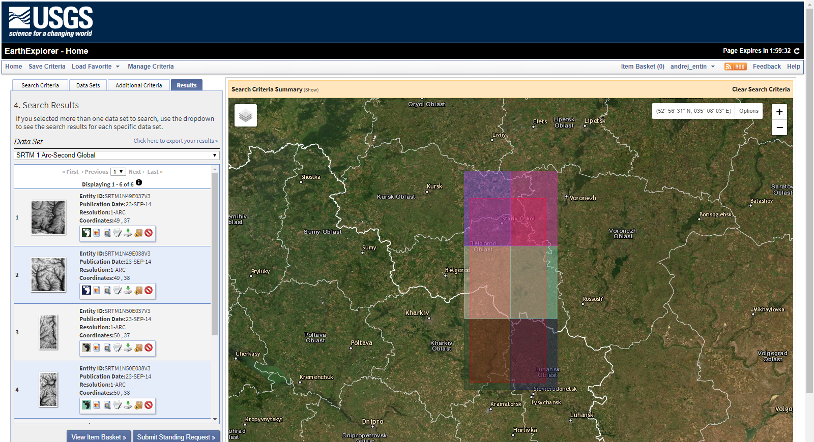
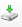
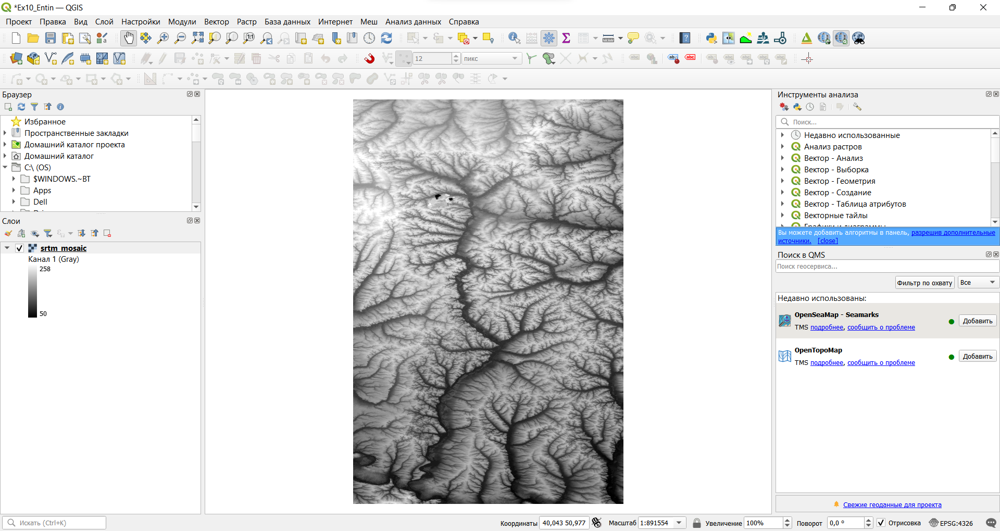
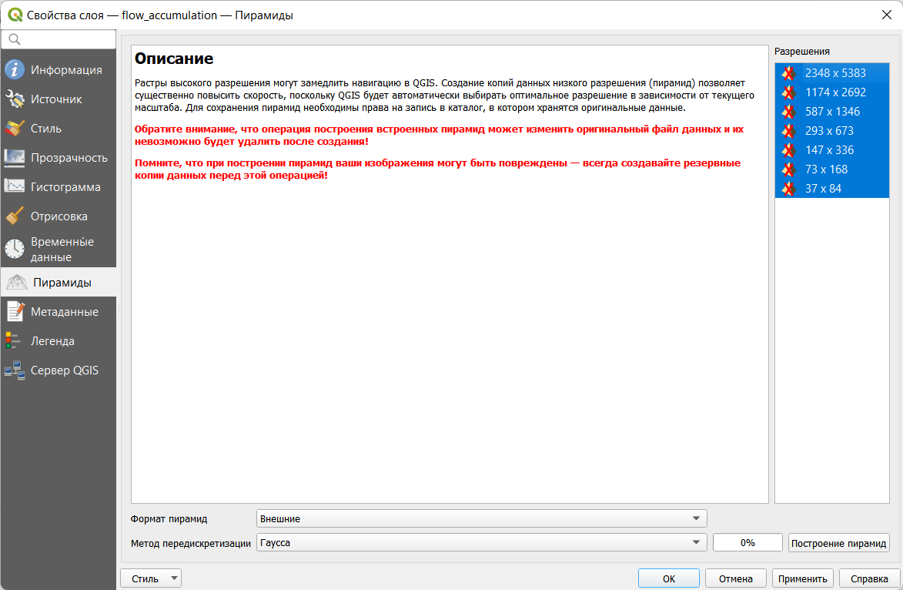
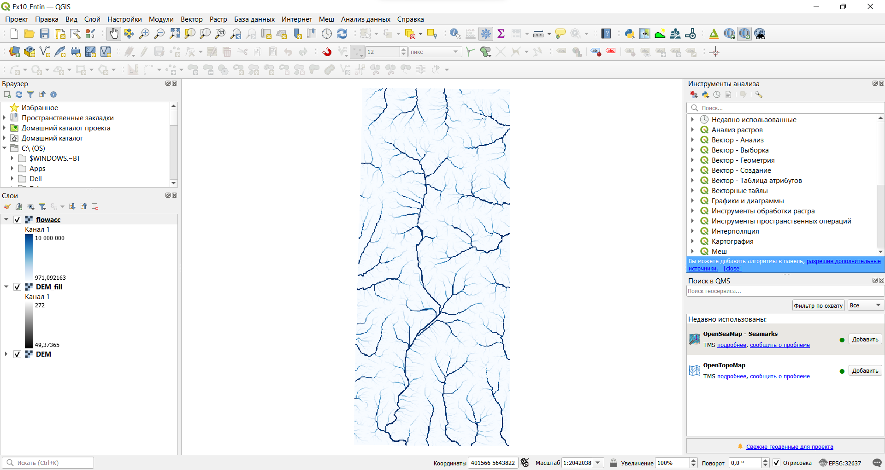
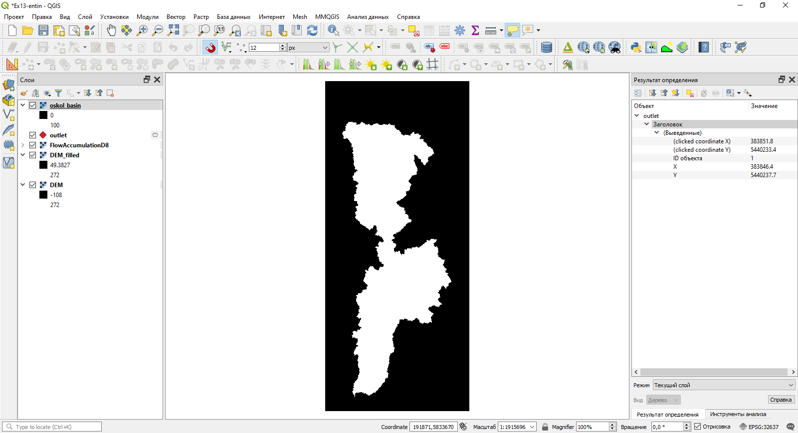
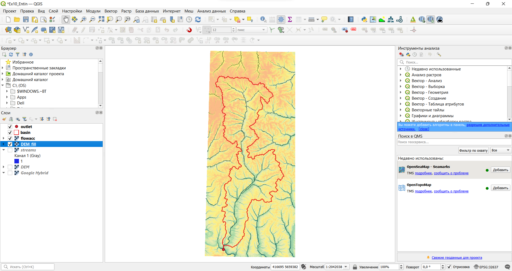
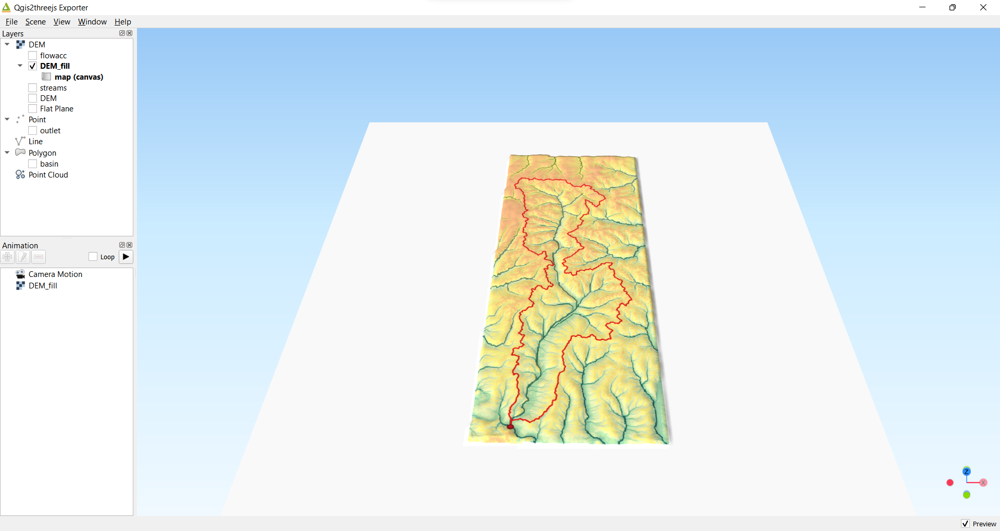

# Гидрологическое моделирование на основе ЦМР {#hydrodem}

[Архив с исходными данными](https://github.com/aentin/qgis-course/raw/master/files/Ex10.zip)

[Контрольный лист](https://github.com/aentin/qgis-course/raw/master/files/Ex10_%D0%BE%D1%82%D1%87%D1%91%D1%82.docx){target="_blank"}

## Введение {#hydrodem-intro}

**Цель задания** — научиться на основе цифровой модели рельефа выделять водотоки и их водосборные бассейны в автоматическом режиме. Осуществлять расчет статистики по высотам в рамках выделенных бассейнов

**Необходимая теоретическая подготовка:** Растровая модель пространственных данных, цифровые модели рельефа (ЦМР) и их типы, построение ЦМР, построение производных поверхностей (углы наклона, водосборная площадь), гидрологическое моделирование с использованием ЦМР и его принципы.

**Необходимая практическая подготовка:** Знание основных компонент интерфейса QGIS (менеджер источников данных, таблица слоёв, фрейм карты, менеджер компоновок). Работа с различными форматами источников пространственных данных. Настройка символики и подписей объектов. Владение базовыми ГИС-технологиями. Создание компоновки карты: название, легенда, масштаб, градусная сетка.

**Исходные данные:** приблизительный контур бассейна Северского Донца, тайлы глобальной ЦММ SRTM (загружаются в процессе выполнения упражнения)

**Результат:** Карта водотоков и их водосборных бассейнов, построенная по ЦМР, с указанием морфометрических параметров бассейнов.

### Контрольный лист {#hydrodem-control}

* Получить тайлы SRTM с ресурса EarthExplorer

* Создать виртуальный растр

* Выполнить перепроецирование ЦМР

* Рассчитать направления стока

* Рассчитать водосборную площадь

* Построить границы бассейна

* Визуализировать результаты расчёта

### Аннотация {#hydrodem-annotation}

Цифровые модели рельефа играют важную роль в гидрологическом и геоморфологическом анализе. Одно из основных приложений ЦМР, позволивших значительно упростить анализ речных систем, — это автоматизированное построение водосборов и расчет их морфометрических характеристик. Большинство современных программных средств ГИС включают те или иные реализации инструментов гидрологического моделирования на основе ЦМР. QGIS в этом смысле является исключением: у него нет собственных инструментов анализа такого рода, но есть возможность использовать наработки других программных продуктов — например, [GRASS](https://grass.osgeo.org/) и [SAGA](https://saga-gis.sourceforge.io/en/index.html).

В этом упражнении вы используете инструменты SAGA посредством интерфейса QGIS, чтобы выполнить гидрологический анализ цифровой модели рельефа, а затем визуализируете полученный результат в виде блок-диаграммы (3D-изображения).

## Получение и подготовка исходных данных {#hydrodem-init}
[В начало упражнения ⇡](#hydrodem)

1. Зарегистрируйтесь на ресурсе [EarthExplorer](https://earthexplorer.usgs.gov/){target="_blank"} Геологической службы США. Этот ресурс предоставляет доступ к массиву данных дистанционного зондирования и наборов данных, созданных на их основе. 

2. В левой части окна на вкладке **Search Critera** откройте вкладку **KML/Shapefile upload** и используйте файл `oskol.kml` из архива с исходными данными, чтобы указать область поиска материалов. Или самостоятельно установите рамку поиска аналогично изображению на рисунке ниже

    
    
3. Перейдите на вкладку **Data Sets** и выберите набор **Digital Elevation – SRTM – SRTM 1-arc second global**

    
    
4. Перейдите на вкладку **Results** и дождитесь, пока система выполнит запрос по заданным вами условиям. В результате запроса должно быть выдано 6 результатов — тайлов SRTM.

    
    
5. Поочерёдно нажимая на кнопку «Скачать»  каждой записи, загрузите все 6 необходимых тайлов в формате GeoTIFF. Создайте в своей рабочей директории папку `input_data` и поместите загруженные тайлы в неё. Также создайте в рабочей директории папку `processing`, чтобы в дальнейшем сохранять в неё промежуточные наборы данных.

    >Примечание: при загрузке отдельных файлов EarthExplorer может ограничить число скачиваемых файлов и/или скорость загрузки. Если это происходит, дождитесь загрузки тех файлов, которые уже скачиваются, а затем повторите попытку.
    
6. Запустите QGIS и сохраните проект в вашу рабочую директорию.

7. Чтобы работать с цифровой моделью рельефа, необходимо объединить все тайлы в единую мозаику, а затем перепроецировать её из географической системы координат в проецированную. 

    > Создание мозаики, перепроектирование, а также обрезка по маске, которую мы применим чуть позже — типичные процедуры подготовки растровых тайлов к геоинформационному анализу. Хранить каждый промежуточный результат в виде отдельного файла, как правило, нет необходимости, а при больших объёмах данных и малых объёмах свободного места на диске — нет и возможности. На помощь здесь приходит виртуальный растр ([VRT](https://gdal.org/drivers/raster/vrt.html)) — структура, хранящая ссылки на исходные данные и необходимые операции их преобразования.

8. Соберите мозаику растровых тайлов. Для этого воспользуйтесь инструментом «Создать виртуальный растр» («Растр» — «Прочее»).

    * Добавьте тайлы SRTM в качестве исходных данных
    
    * Если установлена опция *Place each input file into a separate band*, отключите её.
    
    * Укажите, что виртуальный растр должен быть сохранён в папку `processing` под именем `srtm_mosaic`
    
    
    
    Результат будет автоматически добавлен в проект
    
    
    
9. Измените проекцию документа карты на UTM, датум WGS-84. Самостоятельно определите номер зоны и выберите нужную систему координат (СК).

**Вопрос 1:** укажите EPSG-код выбранной системы координат

<kbd>**Скриншот 1:** окно QGIS после изменения системы координат</kbd>

Из упражнения 1 мы помним, что QGIS умеет перепроецировать наборы данных на лету. Однако для целей морфометрического анализа ЦМР нам необходимо, чтобы набор данных был «физически» сохранён с использованием проецированной системы координат.

10. Используйте инструмент «Деформация (перепроецирование...)» («Растр» — «Проекции»), чтобы конвертировать вашу мозаику в новый набор данных. Укажите исходную и целевую систему координат (целевая СК должна совпадать с СК проекта), установите кубический метод интерполяции и значение «нет данных», равное $-9999$. Сохраните перепроецированный растр под именем `DEM` (от англ. *Digital Elevation Model*) в папку `processing`, формат файла — GeoTIFF.
    
11. Когда перепроецированный растр добавится в проект, удалите из него «старую» мозаику.

    

## Гидрологическая коррекция ЦМР {#hydrodem-preprocessing}
[В начало упражнения ⇡](#hydrodem)

Гидрологическое моделирование с использованием ЦМР основывается на следующей идее: моделируемая вода стекает из ячейки с большей высотой в соседнюю ячейку с меньшей высотой. Трассируя поток вниз по склону, можно связывать ячейки ЦМР в так называемые "сети потока" (drainage networks) и определять водосборные площади и границы бассейнов.

Если на модели есть замкнутые локальные понижения, то они выступают как препятствие для распространения стока. 

Распространённая практика — удалять замкнутые локальные понижения с ЦМР перед началом собственно гидрологического моделирования. Удалить повышения можно путём увеличения высот внутри них — таким образом понижение либо исчезает, либо перестаёт быть замкнутым.

1. Найдите инструмент *Fill Sinks XXL (Wang & Liu)* через поиск в панели инструментов. Этот инструмент преобразует ЦМР таким образом, что на месте замкнутых понижений будет сформирована наклонная поверхность. Угол наклона задаётся пользователем. Примените этот инструмент к набору DEM с углом наклона 0,01°. Результат сохраните **в рабочую директорию** под именем `DEM_filled`, расширение оставьте таким, какое предлагается по умолчанию (`*.sdat`).

> SAGA GRID — нативный растровый формат SAGA. Он состоит как минимум из двух файлов: заголовка (\*.sgrd) и файла с данными (\*.sdat). Часто к ним добавляется файл с описанием системы координат (\*.prj). Наконец, если набор был создан непосредственно в SAGA (или, что то же самое, в QGIS), он будет сопровождаться файлом *.mgrd, в котором записывается история применения инструментов геообработки.

> Примечание: если в вашей версии QGIS появляется сообщение *Версия SAGA 7.8.2 официально не поддерживается - алгоритмы могут вызвать ошибки*, игнорируйте его. Инструмент Fill Sinks XXL (Wang & Liu) будет работать без проблем.

2. Сделайте снимок экрана.

<kbd>**Скриншот 2:** окно QGIS после заполнения локальных понижений на ЦМР</kbd>

3. Сравните исходную и скорректированную ЦМР.

**Вопрос 2:** Как изменилась амплитуда высот ЦМР после заполнения замкнутых локальных понижений? Какие формы рельефа изменились наиболее сильно?

## Расчёт водосборной площади {#hydrodem-flowacc}
[В начало упражнения ⇡](#hydrodem)

Водосборная площадь (англ. *catchment area*) в геоморфометрии определяется для каждой точки поверхности так, как если бы точка была замыкающим створом. В регулярно-сеточном анализе водосборная площадь определяется для отдельных ячеек ЦМР и равняется суммарной площади всех ячеек, сток из которых проходит через данную ячейку (по принципу, описанному выше). Вместо площадей ячеек можно использовать какой-нибудь весовой коэффициент. Например, если этот коэффициент представляет слой поверхностного стока, то результирующая величина будет являться объёмом стока для данной ячейки.

Водосборную площадь вместе со всеми другими величинами, которые можно рассчитать по аналогичному принципу, часто называют аккумуляцией потока (англ. *flow accumulation*). Именно так называются инструменты расчёта водосборной площади в большинстве современных ГИС-пакетов (в том числе в SAGA).

1. Найдите инструмент **Flow Accumulation (Top-Down)** в панели инструментов. Запустите его, используя следующие настройки:

    * Исходное поле высот (Elevation): `DEM_filled`
    * Метод расчёта (Method): Deterministic 8
    * Выходной растр водосборной площади (Flow Accumulation): сохраните в рабочую директорию и назовите его `flowacc`. Оставьте включённой опцию «Открыть выходной файл после завершения алгоритма».
    * Все прочие выходные растры: оставьте поля пустыми и отключите опции «Открыть выходной файл после завершения алгоритма».
    * Остальные параметры оставьте по умолчанию.

2. Запустите расчёт и дождитесь его завершения (может занимать до 7-8 минут). По окончании расчётов в проект QGIS будет добавлен новый растровый слой:

    

    > Водосборная площадь при движении вниз по склону увеличивается экспоненциально, поэтому изображение в оттенках серого, которое вы видите, почти чёрное.

2. Измените стиль отображения растра на «Одноканальное псевдоцветное», максимальное значение — `1e+07`, и выберите шкалу Blues. Примените изменения.

3. Перейдите на вкладку «Пирамиды» и постройте пирамидальные слои всех доступных разрешений для вашего набора данных. Для этого выберите в списке справа все доступные разрешения, установите в переключателе внизу метод передискретизации Гаусса и нажмите кнопку «Построение пирамид». Примените изменения.

    

    >Пирамидальные слои, или пирамиды — это производные растры относительно низкого разрешения, создаваемые на основе исходного растра для улучшения производительности в процессе визуализации. Если используется мелкий масштаб карты, ГИС-пакет отрисовывает не исходный растр, а один из пирамидальных слоёв.
    
    
    
    Если после построения пирамид на экране не произойдёт никаких изменений, перезагрузите проект QGIS.

3. Изучите полученное изображение, увеличивая и уменьшая масштаб визуализации. 

4. Добавьте в проект мозаику спутниковых снимков из Интернета. Оцените, в какой мере области высоких значений водосборной площади соответствуют положениям водотоков и крупных эрозионных форм. Сделайте снимок экрана.

<kbd>**Скриншот 3:** растр водосборной площади после настройки визуализации</kbd>

**Вопрос 3:** Можно ли сказать, что области высоких значений водосборной площади, рассчитанной по ЦМР, соответствуют тальвегам эрозионных форм и руслам рек? Ответ обоснуйте.

## Создание растра водотоков на основе модели водосборной площади {#hydrodem-network}
[В начало упражнения ⇡](#hydrodem)

Растр водосборной площади (или объёма стока) позволяет выделить сеть потенциальных водотоков. Ячейка считается принадлежащей к сети потенциальных водотоков, если величина водосборной площади в ней превышает некоторый заданный порог. Это упрощённый принцип, но он позволяет строить сети, подобные реальным.

Для выборки ячеек в QGIS можно воспользоваться уже знакомым вам инструментом переклассификации (см. [Переклассификация наборов данных](#weighted-overlay-reclass)). Примем в рамках упражнения, что минимальная водосборная площадь, необходимая для формирования водотока, составляет 1 км².

1. Запустите инструмент «Переклассификация по таблице». Переклассифицируйте растр `flowacc` таким образом, чтобы все значения, меньшие 1 км², получили новое значение $-9999$ (нет данных), а все значения, большие или равные 1 км² — новое значение $1$. Результат сохраните в вашу рабочую директорию под именем `streams`, формат — GeoTIFF.

    

2. Откройте свойства растра водотоков и измените стиль отображения на «Палитра / Уникальные значения». Нажмите «Классифицировать», чтобы добавить в таблицу все возможные значения растра, а затем выберите и удалите все значения, кроме $1$. Для значения $1$ установите тёмно-синий цвет, как показано на рисунке ниже.

    
    
3. Увеличьте изображение до масштаба 1:100 000 и сделайте снимок экрана.

<kbd>**Скриншот 4:** Фрагмент растра сети потенциальных водотоков</kbd>

## Определение границ бассейна р. Оскол {#hydrodem-basin}
[В начало упражнения ⇡](#hydrodem)

**Внимание!** Инструменты, используемые в этой части упражнения, могут работать некорректно или не работать вовсе. Если вы сталкиваетесь с проблемами, переходите к следующему шагу упражнения.

Для дальнейшего анализа нам будет нужна только территория водосборного бассейна р. Оскол. На этом шаге мы определим границы её бассейна. 

1. Добавьте на карту набор данных `outlet.kml`. Он отражает конечную точку модели водотока, соответствующей р. Оскол.

4. Найдите и запустите инструмент **Upslope Area** из группы SAGA. Этот инструмент предназначен для идентификации всех ячеек, сток из которых проходит через точку с заданными координатами — фактически, он позволяет определить границы водосборного бассейна.

4. Используйте инструмент определения , чтобы узнать координаты X и Y установленной точки.

    
    
5. Задайте входные параметры инструмента **Upslope Area**. Скопируйте координаты X и Y в соответствующие поля. Установите `DEM_filled` в качестве исходной ЦМР и выберите метод D8. Остальные опции не задавайте. Результат сохраните в папку `processing` под именем `oskol_basin`.

    
    
    На полученном растре представлено всего два значения: $100$ для ячеек, входящих в границы бассейна, и $0$ для всех остальных ячеек.
    
6. Векторизуйте полученный растр. Результат векторизации сохраните в папку `processing` под именем `basin`. 

7. Если необходимо, удалите из результата векторизации полигон, соответствующий областям за пределами бассейна р. Оскол. Также отключите растр границ бассейна.

    
    
## Картографическое представление результата {#hydrodem-mapping}
[В начало упражнения ⇡](#hydrodem)

На этом этапе мы создадим трёхмерную визуализацию бассейна р. Оскол.

1. Отобразите слои проекта в охвате слоя DEM.

1. Если на предыдущем шаге упражнения вам не удалось построить границы бассейна, добавьте в проект набор `basin.shp` из папки с исходными данными. Этот шейп-файл содержит границу бассейна.

2. Измените стиль отображения слоя границ бассейна: установите прозрачную заливку и красную обводку толщиной 0,46 мм

3. Поместите слой устья реки (*outlet*) над слоем границы бассейна. Измените условный знак устья на маркер в виде красного круга размером 2 мм.

4. Поместите под слоем границ бассейнов слой водосборной площади, а под ним — слой скорректированной ЦМР. Остальные слои отключите.

5. Для слоя водосборной площади установите прозрачность 50 %.

6. Измените настройки визуализации слоя ЦМР следующим образом:

    * Стиль: одноканальное псевдоцветное
    * Минимальное значение: 50
    * Максимальное значение: 275
    * Интерполяция: дискретная
    * Шкала: нажмите правой кнопкой мыши на палитру, выберите «Создать новый градиент», тип градиента — «Каталог: cpt-city». В открывшемся интерфейсе в разделе Topography выберите палитру `wiki-knutux`. 
    * Режим классификации: равные интервалы
    * Число классов: 9
    
    

    После применения настроек изображение должно выглядеть, как показано на рисунке ниже:
    
    
    
7. Для создания 3D-визуализации установите модуль **Qgis2threejs**. Этот модуль предназначен для создания трёхмерных визуализаций в QGIS на основе растровых и векторных пространственных данных — в первую очередь, цифровых моделей рельефа.

8. Иконка модуля Qgis2treejs  появится в панели инструментов. Нажмите на неё, чтобы открыть окно модуля.

    

9. В окне модуля Qgis2threejs включите слой DEM_fill. Высоты из этого слоя будут использоваться для создания 3D-поверхности, а текстура (материал) изображения будет составлена на основе изображения в основном окне карты.

10. Изображение в окне Qgis2threejs выглядит плоским. Для того, чтобы сделать его более «объёмным», можно увеличить вертикальный масштаб. Для этого зайдите в настройки сцены (Scene – Scene settings...) и установите коэффициент вертикального масштабирования (Z exaggeration) равным 25.

    
    
11. Вращая (с помощью зажатой левой кнопки мыши), перемещая (правой кнопкой мыши) и масштабируя (колесо мыши) изображение в окне Qgis2threejs, подберите такой ракурс изображения, который позволит наиболее наглядно, на ваш взгляд, продемонстрировать рельеф местности.

12. Экспортируйте полученное изображение (File – Save Scene As – Image (\*.png) ...) и вставьте его в отчётный файл.

<kbd>**Изображение 5:** трёхмерная визуализация бассейна р. Оскол</kbd>