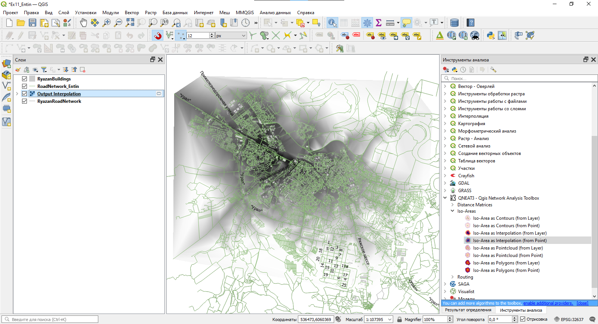
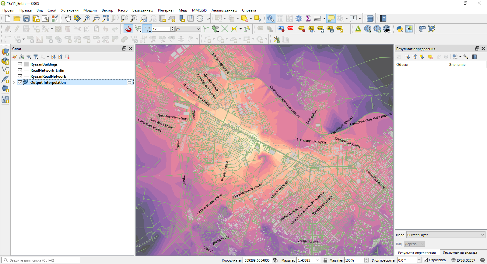

# (PART) Сетевой анализ {-}

# Анализ транспортных сетей {#networks}

[Архив с исходными данными](https://github.com/aentin/qgis-course/raw/master/files/Ex13.zip)

[Контрольный лист](https://github.com/aentin/qgis-course/raw/master/files/Ex13_%D0%BE%D1%82%D1%87%D1%91%D1%82.docx)

## Введение {#networks-intro}

**Цель задания** — научиться решать простые задачи сетевого анализа в ГИС

**Необходимая теоретическая подготовка:** Понятие о сетевой модели данных, граф дорожной сети. Сетевой анализ и его основные задачи: поиск кратчайшего маршрута, определение границ зон обслуживания и ближайшего пункта обслуживания, размещение-распределение. Матрица источник-назначение.

**Необходимая практическая подготовка:** Знание основных компонент интерфейса QGIS (менеджер источников данных, таблица слоёв, фрейм карты, менеджер макетов). Выделение объектов на карте. Пространственные и атрибутивные запросы. 

**Исходные данные:** наборы пространственных данных о дорожной сети, созданные на основе выгрузки с OpenStreetMap на территорию г. Рязань.

**Результат:** Маршрут между двумя точками назначения. Схема изохрон относительно выбранных стартовых точек. Матрица источник-назначение для складов и точек продажи. Схема зонирования территории по принадлежности к складам.

### Контрольный лист {#networks-control}

* Добавить на карту слой дорожной сети, слой зданий и сооружений
* Выбрать из слоя дорожной сети объекты, подходящие для создания графа дорожной сети
* Построить маршрут между двумя точками
* Выполнить анализ дорожной сети для расчёта изохрон
* Рассчитать матрицу источник-назначение, определить ближайшие источники для каждого назначения
* Очертить зоны обслуживания

### Аннотация {#networks-annotation}

Задание посвящено знакомству с сетевым анализом. Задачи, предлагаемые в задании, связаны с определением оптимальных маршрутов, построением зон обслуживания, определением ближайших сервисных точек, размещением сервисных точек. Данные задачи активно используются в логистике — оптимизации перевозок, а также в геомаркетинге и оптимизации местоположения пунктов обслуживания (магазинов, складов, пожарных депо и т.д.). 

В основе решения этих задач лежит сетевая модель данных, являющаяся частным случаем векторной модели. В сетевой модели дорожная сеть представляется в виде графа.

## Добавление исходных данных {#networks-init}
[В начало упражнения ⇡](#networks)

1. Скопируйте материалы к упражнению (файл GeoPackage) в свою рабочую директорию

2. Создайте проект QGIS и сохраните его в свою рабочую директорию

3. Добавьте в проект слои *RyazanRoadNetwork* (улично-дорожная сеть) и *RyazanBuildings* (здания и сооружения). Оба этих слоя подготовлены на основе данных OpenStreetMap

4. Задайте следующие настройки отображения слоёв:

* Улично-дорожная сеть — линии серого цвета (60 % светлоты) толщиной 0,26 мм;
* Здания и сооружения — полигоны серого цвета (80 % светлоты) без обводки.

5. Задайте подписи слоёв. Для этого откройте свойства соответствующего слоя, перейдите на вкладку «Подписи» и измените стиль подписей с *No labels* на *Single labels*. Изучите доступные настройки подписей.

6. Задайте следующие параметры подписей:

* Для слоя дорожной сети: подписи по полю `Name`, кегль (размер) шрифта — 8 типографских пунктов, остальные параметры по умолчанию;
* Для слоя зданий и сооружений: подписи по полю `addr:housenumber`, кегль (размер) шрифта — 6 типографских пунктов, остальные параметры по умолчанию.

>Примечание: в некоторых версиях QGIS в интерфейсе настройки подписей некорректно переведено название единиц измерения — вместо правильного «Пункты» написано «Точки». Как правило, эти единицы используются по умолчанию, поэтому даже в случае некорректного перевода у вас не должно возникнуть проблем.

7. Увеличьте масштаб изображения до 1:5000 и сделайте снимок экрана. Изображение фрейма карты должно быть похож на изображение ниже.

<kbd>В отчёт: снимок экрана №1 – окно QGIS после завершения настройки символов и подписей площади</kbd>

## Выбор элементов дорожной сети {#networks-query}
[В начало упражнения ⇡](#networks)

В рамках этого упражнения мы будем решать задачи логистики на примере движения автомобилей. Однако набор данных об улично-дорожной сети, предоставленный вам в качестве исходных данных, содержит не только действующие автомобильные дороги, но и другие типы объектов. Тип объекта хранится в поле `highway`. В таблице ниже перечислены значения атрибута `highway` для тех объектов, которые **не** должны участвовать в анализе.

Значения атрибута `highway`    Пояснение
----------------------------   ---------------
construction                   строящиеся дороги
cycleway                       велодорожки
footway, pedestrian            пешеходные дороги и тротуары
path                           тропы
proposed                       планируемые дороги
raceway                        гоночные треки
steps                          лестницы

1. Составьте запрос, чтобы выбрать в слое *RyazanRoadNetwork* все объекты, **кроме** перечисленных выше. Это можно сделать разными способами: с использованием оператора `<>` (не равно), с использованием операторов `NOT` и `IN`, либо через опцию инверсии выборки.

2. Сохраните выборку в новый набор данных формата GeoPackage (правой кнопкой мыши на слой — «Экспорт...» — «Сохранить выбранные объекты как...»). Сохраните новый GeoPackage в вашу рабочую директорию и присвойте ему имя по шаблону `Ex13_Familia`, а таблицу в нём назовите `road_network``. Укажите, что слой необходимо добавить в проект после сохранения.

3. Когда новый слой будет добавлен к проекту, измените настройки его визуализации: установите толщину линий равной 0,26 мм, а цвет — любой, кроме того, который уже используется для улично-дорожной сети. Сделайте снимок экрана.

<kbd>В отчёт: снимок экрана №1 – окно QGIS после сохранения выбранных дорог в новую таблицу</kbd>

## Построение маршрута {#networks-route}
[В начало упражнения ⇡](#networks)

Существует несколько подключаемых модулей для QGIS, которые позволяют решать задачи сетевого анализа. Мы воспользуемся одним из самых простых — модулем [QNEAT3](https://root676.github.io/).

Большинство модулей для сетевого анализа в QGIS не требуют представления графа дорожной сети в виде отдельной сущности. Вместо этого такой граф создаётся непосредственно в процессе работы инструментов на основе векторного линейного набора объектов.

1. Установите модуль QNEAT3.

2. Откройте панель инструментов анализа и убедитесь, что в неё добавилась группа инструментов QNEAT3.

Теперь мы попробуем построить маршрут между двумя точками. Для решения этой задачи используется инструмент **Shortest path (point to point)** из группы *Routing* набора QNEAT3

3. Найдите здание вокзала **Рязань-1** (Вокзальная улица, 26А) и **Музыкальный колледж** (улица Дзержинского, 42). Запомните расположение этих зданий.

> Подсказка: названия зданий и их адреса могут быть указаны в таблице атрибутов.

4. Запустите инструмент **Shortest path (point to point)**. Откроется интерфейс настройки инструмента.

5. В качестве слоя дорожной сети (*Network Layer*) укажите набор данных, который вы создали на предыдущем шаге.

6. Чтобы указать начальную точку маршрута, нажмите многоточие справа от поля ввода *Start point*. Интерфейс настройки инструмента будет свёрнут, а курсор в окне QGIS примет вид мишени. Найдите здание вокзала Рязань-1 и щёлкните левой кнопкой мыши в произвольном месте внутри здания. Координаты курсора будут считаны и введены в поле *Start point*.

7. Аналогичным образом укажите конечную точку маршрута в пределах здания музыкального колледжа.

8. Проверьте, что в качестве критерия оптимизации указано *Shortest Path* (кратчайшее расстояние), а выходной набор данных сохраняется во временный файл.

9. Запустите инструмент. Дождитесь, пока будет рассчитан кратчайший маршрут, и не закрывайте интерфейс инструмента — мы воспользуемся им снова, но изменим параметры.

10. Построенный кратчайший маршрут появится в таблице слоёв как временный слой с названием *Shortest Path Layer*. Измените стиль этого слоя на линию красного цвета толщиной 1 мм. Отобразите карту в охвате слоя *Shortest Path Layer*.

Обратите внимание, что при построении этого маршрута учитывались только длины сегментов пути, но не учитывались характерные скорости и разрешённые направления движения. На следующих шагах мы внесём соответствующие коррективы.

11. Откройте таблицу атрибутов слоя дорожной сети и изучите её содержимое. Определите, в каких полях и в каком виде хранится информация о: 1) разрешенных направлениях движения; 2) разрешенной скорости движения.

12. Вернитесь в интерфейс инструмента **Shortest path (point to point)** (напомним, что его не нужно было закрывать). 

13. Измените критерий оптимизации с кратчайшего пути на наиболее быстрый путь.

14. В настройке *Direction field* укажите, в каком поле содержится информация о разрешённых направлениях движения. В следующих полях введите значения, соответствующие разрешённым направлениям: `yes` для движения только в прямом направлении, `-1` для движения только в обратном направлении, `no` для разрешения движения в обоих направлениях.

15. В настройке *Speed field* укажите, из какого поля следует взять разрешённую скорость движения.

    >Примечание: обратите внимание, в каких единицах измеряется скорость в исходных данных и какие единицы требуются на вход модулю QNEAT. При необходимости воспользуйтесь калькулятором полей, чтобы преобразовать единицы измерения.

16. Снова запустите расчёт пути. Дождитесь, пока инструмент завершит работу, и новый временный слой будет добавлен в проект. После этого окно инструмента можно закрыть.

17. Переименуйте добавленный слой в *Fastest Path Layer* и измените его отображение на линию синего цвета толщиной 0,6 мм.

18. Самостоятельно повторите расчёт маршрутов по кратчайшему расстоянию и скорейшему времени для одной из пар «источник-назначение», приведённых в таблице ниже. Сохраняйте построенные пути в «постоянные» наборы данных. 

№ п/п	  Источник	                      Адрес	                       Назначение	                                             Адрес
------  ---------                       ------                       -----------                                             ------
1         ДК Станкозавода                 Октябрьская улица, 5         Соборная колокольня                                     улица Кремль, 10
2         ДК Станкозавода                 Октябрьская улица, 5         Рязанский цирк                                          Лево-Лыбедская улица, 34
3         ДК Станкозавода                 Октябрьская улица, 5         Вознесенский храм                                       Вознесенская улица, 26А
4         ДК Станкозавода                 Октябрьская улица, 5         Рязанский городской центр детского творчества   улица Есенина, 46
5         Рязань-1                        Вокзальная улица, 26А        Рязанский государственный радиотехничекий университет  улица Гагарина, 59/1
6         Рязань-1                        Вокзальная улица, 26А        ТЦ "Полетаевский"                                       улица Гагарина, 164
7         Муниципальный культурный центр  Первомайский проспект, 68/2  Рязанский театр драмы                                   Театральная площадь, 7
8         Муниципальный культурный центр  Первомайский проспект, 68/2  Театр кукол                                             улица Есенина, 27
9         Муниципальный культурный центр  Первомайский проспект, 68/2  РИРО                                                    улица Урицкого, 2А
10        Муниципальный культурный центр  Первомайский проспект, 68/2  НИИ газоразрядных приборов «Плазма»                     улица Циолковского, 17

19. Создайте карту-схему построенных путей с масштабной линейкой и легендой. Вставьте эту схему в отчётный файл

>Примечание: перед тем, как оформлять схему, отключите подписи номеров домов

<kbd>В отчёт: Изображение №1 – схема маршрутов</kbd>

## Расчёт изохрон {#networks-isochrones}
[В начало упражнения ⇡](#networks)

Модуль QNEAT3 комбинирует собственные алгоритмы анализа и базовый функционал QGIS для создания представления расстояний (или времени достижения) от определённых точек в виде изохрон. Для этого вычисляется расстояние (или время движения) от стартовой точки до ближайших узлов графа дорожной сети, а затем выполняется линейная интерполяция вычисленной величины между узлами, в результате чего создаётся поверхность расстояния (времени достижения) в растровом представлении. На основе растра создаётся изолинейное представление — в виде изолиний либо в виде полигонов, представляющих послойную окраску.

За расчёт изолиний отвечают инструменты группы `Iso-Areas`.

1. Найдите на карте Автовокзал Центральный (Московское шоссе, 31). Мы будем рассчитывать время, которое затрачивается на проезд от этой точки на автотранспорте.

2. Запустите инструмент *Iso-Area as Interpolation (from Point)*. Используйте дорожную сеть, которую вы применяли на предыдущем шаге, и укажите здание автовокзала в качестве стартовой точки для расчёта изохрон.

3. Размер области расчёта, или предельное расстояние/время, устанавливается либо в метрах, либо в секундах. Интерпретация величины зависит от того, какой критерий оптимизации был выбран. Установите в переменной *Size of Iso-Area* значение 900, а критерий оптимизации — по времени. В этом случае значение переменной будет прочитано как время в секундах.

4. Размер ячейки целевого растра интерполяции — оставьте 10 м, как предлагается по умолчанию.

5. Установите дополнительные настройки расчёта таким образом, чтобы при расчёте учитывались скорость и разрешённые направления движения:

* В поле Direction field нужно выбрать столбец таблицы атрибутов, в котором записаны кодированные значения направления движения;
* В опциях *Value for forward direction*, *Value for backward direction* и *Value for both directions* указать конкретные значения, которые кодируют соответствующее направление движения
* В поле *Speed Field* нужно выбрать столбец таблицы атрибутов, в котором указана скоросто движения по выбранному участку пути.

6. Запустите расчёт. Дождитесь, пока растр времени достижения (временный набор данных) будет добавлен к проекту QGIS

7. Переместите построенный растр на последнее место в списке слоёв.

8. Измените настройки визуализации растра следующим образом

- Тип визуализации: одноканальное псевдоцветное;
- Минимум: 0
- Максимум: 900
- Интерполяция: дискретная
- Градиент: Magma, инвертировать градиент
- Число знаков после запятой в легенде (*Label Precision*): 0
- Мода: равные интервалы
- Число классов: 15

Кроме того, задайте на вкладке «Прозрачность»  значение 66 %.

В результате окно QGIS будет выглядеть, как показано ниже

9. Добавьте на карту слой складов (*Warehouses*) из базы *RyazanNetworkData.gpkg*.

10. С помощью инструмента *Iso-Area as Interpolation (from Layer)* рассчитайте изохроны для движения от складов. Используйте параметры, аналогичные применённым ранее. Также укажите, что результат интерполяции должен быть сохранён в вашу рабочую директорию как файл TIFF.

11. Когда файл будет создан и добавлен к проекту, примените к нему те же настройки визуализации, которые вы использовали для предыдущего аналогичного растра.

12. Создайте новый макет, а в нём — карту-схему с масштабной линейкой и легендой на основе созданного слоя. По окончании создания схемы зафиксируйте её слои, чтобы не потерять изображение при дальнейшей работе, а затем экспортируйте схему в отдельный графический файл. Вставьте полученный файл в бланк отчёта.

<kbd>В отчёт: Изображение №2 – время достижения точек местности при движении от складов</kbd>

## Работа с матрицей «источник-назначение» {#networks-matrix}
[В начало упражнения ⇡](#networks)

При расчёте изохрон для каждой точки местности рассчитывается расстояние до «источника». При этом, если источников несколько, расстояние рассчитывается только до ближайшего из них, причём сам источник никак не идентифицируется. Однако расчёт кратчайших путей можно делать таким образом, что пути будут построены для каждой пары источник-назначение. Результат такого вычисления удобно представлять в виде матрицы: матрица «источник-назначение» отражает стоимость пути между каждой точкой-источником и каждой точкой-назначением. Под стоимостью здесь может пониматься любая величина, которую необходимо минимизировать: длина маршрута, продолжительность поездки, денежная стоимость.

Если в задаче дано $M$ точек-источников и $N$ точек-назначений, то результирующая матрица будет иметь размер $M \times N$. В практике геоинформационного анализа такое представление по ряду причин не очень удобно, поэтому чаще применяют форму представления не в виде матрицы, а в виде списка из трёх столбцов, где в первом столбце указывается идентификатор источника, во втором — идентификатор назначения, в третьем — рассчитанная стоимость маршрута.

>Примечание: такой список в математике и анализе данных называется «вектор», а процедура трансформации матрицы в вектор — «векторизация». Мы не пользуемся здесь этими терминами во избежание путаницы с более «фундаментальными» понятиями геоинформатики.

QNEAT3 позволяет создавать матрицы источник-назначение на основе одного или двух наборов точечных данных и представлять их в виде списка. Опционально строкам списка могут быть сопоставлены линейные векторные объекты, связывающие источник и назначение по прямой линии. Мы воспользуемся матрицей источник-назначение, чтобы определить источник, ближайший к каждой точке назначения и рассчитать границы «зоны обслуживания» (*service area*) для каждого источника. Для этого мы:

* Создадим точечный слой, представляющий пункты назначений;
* Построим матрицу источник-назначение в виде таблицы;
* Для каждой строки назначения определим путь с наименьшей стоимостью и выберем строку, соответствующую этому пути;
* Удалим все невыбранные строки;
* Присоединим матрицу источник-назначение к точечному слою пунктов назначений, таким образом "приписав" к каждому назначению идентификатор источника — иначе говоря, найдём ближайший пункт обслуживания (*closest facility*) для каждого пункта назначения;
* Построим диаграмму Вороного (полигоны Тиссена) на пунктах назначений;
* Объединим построенные полигоны по признаку.

В качестве исходных точек мы возьмём известные положения складов, с которыми вы работали в предыдущей части упражнения. В качестве точек назначения мы будем использовать центры полигонов зданий и сооружений. Однако этот набор данных содержит почти 25 тыс. объектов — избыточно много для учебного упражнения. Поэтому сначала мы уменьшим это количество путём случайной выборки.

**Прежде, чем вы приступите к этой части упражнения**: все инструменты, указанные ниже, по умолчанию сохраняют выходные данные как временные файлы. Временные файлы удаляются после закрытия проекта QGIS, поэтому, если вы планируете надолго прерваться при выполнении упражнения, при запуске каждого инструмента явно указывайте, куда и в каком виде следует сохранить результирующий набор данных. Это требование не будет упоминаться далее в инструкции.

1. Создайте случайную выборку объектов в слое зданий и сооружений. Для этого воспользуйтесь инструментом «Вектор» — «Исследование» — «Случайное выделение...». Выберите в слое *RyazanBuildings* от 400 до 600 объектов, согласно указаниям преподавателя, и закройте интерфейс инструмента.

2. Рассчитайте положения центральных точек (центроидов) для выбранных объектов. Для этого воспользуйтесь инструментом «Вектор» — «Обработка геометрии» — «Центроиды...». Создайте центроиды только для выбранных объектов, при этом игнорируйте составную геометрию (не создавайте отдельный центроид для каждой части полигона).

3. Рассчитайте матрицу источник-назначение при помощи инструмента *OD Matrix from Layers as Table (m:n)*. Самостоятельно укажите, какой слой должен использоваться в качестве источника, а какой — в качестве назначения. Уникальными идентификаторами в обоих случаях лучше назначить поле `fid`. Настройки поиска оптимальных маршрутов установите следующим образом: искать самый быстрый маршрут с учётом направления движения (вы уже неоднократно устанавливали такие настройки). Подождите, пока инструмент рассчитает матрицу — на это потребуется несколько минут, в зависимости от мощности компьютера.

4. Откройте рассчитанную матрицу источник-назначение как таблицу атрибутов. Обратите внимание, что в каждой строке этой таблицы указан идентификатор источника, идентификатор назначения и несколько характеристик стоимости пути. Нас интересует последняя из них — полная стоимость, `total_cost`. Также обратите внимание на число записей в таблице. Почему их столько?

5. Теперь вам нужно выбрать в этой таблице строки, соответствующие минимальным расстояниям для каждого пункта назначения. Для этого откройте интерфейс выборки по условию и введите следующее выражение:

`"total_cost" = minimum("total_cost", "destination_id")`

Это выражение устроено следующим образом. Функция `minimum` ищет минимальное значение в столбце, указанном в качестве первого её аргумента. Второй аргумент используется как критерий группировки: в данном случае он указывает, что нужно искать не единое минимальное значение по всему столбцу, а сгруппировать минимальные значения, соответствующие разным идентификаторам пунктов назначений. Как мы помним, логическое выражение в целом применяется только к текущей строке таблицы атрибутов, поэтому функция `minimum` выдаст то минимальное значение, которое найдено для группы строк с тем же значением `destination_id`, что и у текущей строки. Соответственно, логическое выражение в целом будет истинным для строк с минимальной стоимостью проезда для данного пункта назначения и ложным для всех остальных строк того же пункта.

6. Нажмите кнопку «Выбрать объекты» и подождите несколько минут, пока QGIS реализует введённый запрос. Оцените число выбранных записей.

7. Включите режим редактирования для таблицы.

8. Инвертируйте выборку. Для этого нажмите кнопку  «Инвертировать выделение» или `Ctrl+R` на клавиатуре. Таким образом вы выделите те записи, где время достижения не является минимальным для данных точек назначения.

9. Удалите выбранные строки, сохраните правки и выключите режим редактирования. Не закрывая таблицу атрибутов, сделайте снимок экрана.

<kbd>В отчёт: снимок экрана №3 – отредактированная таблица атрибутов матрицы «источник—назначение</kbd>

>Примечание: после этой операции в таблице должно остаться столько строк, сколько было исходных центроидов. Если у вас другое количество строк, удалите таблицу и выполните заново часть инструкции, начиная с расчёта матрицы источник-назначение.

10. Теперь мы должны соединить то, что осталось от матрицы источник-назначение, с исходным слоем центроидов, чтобы сопоставить каждому центроиду идентификатор соответствующего склада. Присоедините таблицу к слою центроидов. Из всех столбцов таблицы можно присоединить только один — идентификатор источника.

>примечание: если вы забыли, как выполняется присоединение таблиц в ГИС, обратитесь к соответствующему разделу [упражнения 8](#overlay-join)

После того, как вы осуществите присоединение, таблица атрибутов слоя центроидов примет следующий вид:

Теперь мы создадим диаграмму Вороного (*Voronoy diagram*) точек центроидов. Диаграмма Вороного разбивает пространство вокруг точек на полигоны, причём каждый полигон ограничивает область пространства, более близких к одной из исходных точек, чем к остальным точкам. Поскольку каждый полигон диаграммы Вороного унаследует атрибуты исходных точек и поскольку в атрибутах точек содержится идентификатор ближайшего склада, мы сможем выделить области пространства, ближайшие к каждому складу при движении по сети автодорог.

Полигоны диаграммы Вороного иногда называют полигонами Тиссена (*Thiessen polygons*). Распространено также некорректное название «полигоны Вороного» — именно оно используется в QGIS.

11. Откройте интерфейс инструмента построения диаграммы Вороного («Вектор» — «Обработка геометрии» — «Полигоны Вороного...»). Задайте исходный слой для построения, оставьте параметр «Буферная область» по умолчанию и запустите расчёт. Результат будет выглядеть аналогично представленному на рисунке ниже:

12. Объедините полигоны с одинаковыми идентификаторами источников. Для этого воспользуйтесь уже знакомой вам функцией [объединения по признаку](#overlay-merge). Полученные полигоны представляют зоны обслуживания (*service areas*) для каждой из исходных точек.

13. Создайте в новом макете карту-схему зон обслуживания и вставьте её в отчётный документ. На карте-схеме должны быть показаны положения складов и границы зон обслуживания, соответствующих им. Желательно использовать цветовой фон для изображения разных складов и зон. Также схема должна иметь необходимую географическую основу (можно пользоваться базовой картой из Интернета), название и масштабную линейку. Добавлять легенду не обязательно.

<kbd>В отчёт: Изображение №3 – зоны обслуживания</kbd>
