# (PART) Точечные процессы {.unnumbered}

# Адресное геокодирование и ядерная оценка плотности {#geocoding}

[Архив с исходными данными](https://github.com/aentin/qgis-course/raw/master/files/Ex14.zip)

[Контрольный лист](https://github.com/aentin/qgis-course/raw/master/files/Ex14_%D0%BE%D1%82%D1%87%D1%91%D1%82.docx)

**Внимание! Ваш преподаватель может предоставить вам другие исходные данные для выполнения этого упражнения**: [альтернативные исходные таблицы адресов](https://drive.google.com/drive/folders/1-49SDiZutkI8iyMn-3q8z4B67hON8JeG?usp=sharing){target='blank'}. При возникновении противоречий следуйте указаниям преподавателя!

Для выполнения этого упражнения вам потребуется веб-браузер с доступом в Интернет. Перед началом выполнения упражнения убедитесь, что у вас есть всё необходимое.

## Введение {#geoding-intro}

**Цель задания** --- научиться создавать новые наборы пространственных данных с использованием геокодирования, визуализировать множества точек с помощью ядерной оценки плотности.

**Необходимая теоретическая подготовка:** модели пространственных данных, модели пространственных объектов, базы пространственных объектов, системы координат, геокодирование, адресное геокодирование, ядерная оценка плотности

**Необходимая практическая подготовка:** Знание основных компонент интерфейса QGIS (менеджер источников данных, таблица слоёв, фрейм карты, менеджер компоновок). Работа с различными форматами источников пространственных данных . Настройка символики и подписей объектов. Владение базовыми ГИС-технологиями.

**Исходные данные:** таблица адресов недвижимости с ресурса [ЦИАН](https://www.cian.ru/) 

**Результат:** геокодированные точки объявлений о продаже недвижимости, карта плотности объявлений

### Контрольный лист {#geocoding-control}

-   Загрузить таблицу адресов в QGIS
-   Выполнить геокодирование с использованием сервиса Nominatim
-   Проанализировать результат, определить проблемы, мешающие геокодированию
-   Исправить таблицу в соответсвии с выявленными проблемами
-   Повторно выполнить геокодирование, получить координаты точек, заданных адресами
-   Выполнить ядерную оценку плотности полученных точек
-   Визуализировать результат в виде карты-схемы

### Аннотация {#geocoding-annotation}

Геокодирование (англ. *geocoding*) --- это определение координат объектов по их географическим текстовым описаниям, которые, как правило, выражены в виде адресов и/или почтовых кодов. Геокодирование широко применяется в тех сферах, где входящая информация поступает массово, но не имеет прямой географической привязки. Примеры такой информации: места дорожно-транспортных происшествий, адреса объектов недвижимости для продажи или сдачи в аренду, IP-адреса отправителей и получателей сообщений в сети Интернет.

Для обеспечения геокодирования необходимо иметь обширную и постоянно обновляемую базу пространственных данных, где каждому адресу сопоставлены географические координаты. Другой компонент геокодирования --- подсистема парсинга адреса, которая преобразует поданную на вход текстовую строку в вид, пригодный для автоматического распознавания геокодером.

Оперативное и достоверное геокодирование представляет большой интерес для различных групп пользователей --- от служб доставок до спасателей и полиции. В то же время, для обеспечения пригодности результатов геокодирования требуется создать и поддерживать в актуальном состоянии обширную базу пространственных данных, а также предусмотреть надёжный интерфейс для обращения к сервису. Это превращает геокодирование в конкурентную бизнес-услугу. Существует ряд коммерческих сервисов, предоставляющих услуги геокодирования: [PickPoint](https://pickpoint.io/ru), [MapQuest](https://developer.mapquest.com/documentation/geocoding-api/), [LocationIQ](https://locationiq.com/geocoding); почти у всех из них есть «демонстрационный» бесплатный режим с ограничением по количеству запросов. Крупные картографические интернет-сервисы, такие, как Google Maps или Яндекс.Карты, предоставляют [свои](https://developers.google.com/maps/documentation/javascript/geocoding) [сервисы](https://yandex.ru/dev/maps/geocoder/doc/desc/concepts/about.html) геокодирования на похожих условиях. Из открытых решений популярностью пользуется сервис [Nominatim](https://nominatim.org/), использующий данные OpenStreetMap. Результаты геокодирования с помощью Nominatim проигрывают в точности и оперативности результатам коммерческих сервисов, но всё же пригодны для использования в научных и учебных целях.

Мы воспользуемся сервисом геокодирования Nominatim, чтобы нанести на карту точки, соответствующие объявлениям о продаже недвижимости, предоставленные сайтом [ЦИАН](https://www.cian.ru/).

## Импорт исходных данных в QGIS {#geocoding-input}

[В начало упражнения ⇡](#geocoding)

1. Скопируйте исходные данные к упражнению в свою рабочую директорию. Создайте проект QGIS и разместите его в вашей рабочей директории.

2.  Установите модуль **Spreadsheet Layers**. Этот модуль позволяет импортировать таблицы Excel напрямую в QGIS. Модуль доступен в репозитории QGIS, поэтому достаточно ввести его имя в строке поиска.

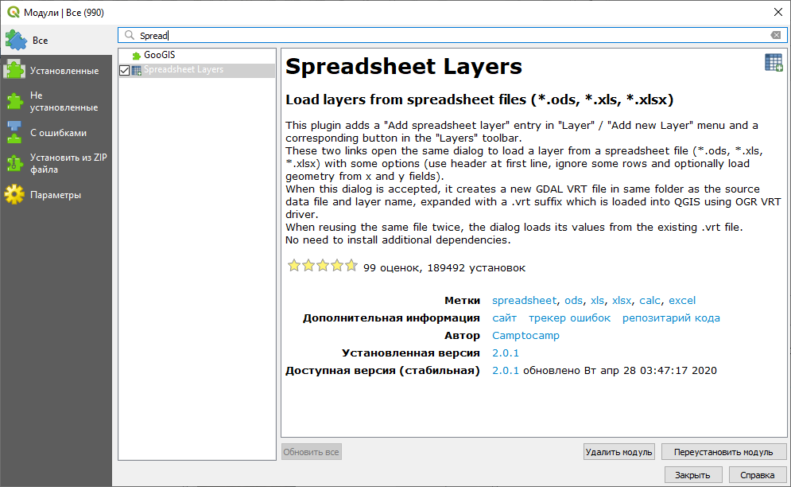

3.  После установки модуля найдите опцию импорта табличных данных: меню «Слой» --- «Добавить слой» ---  «Добавить слой из таблицы» («Add Spreadsheet Layer»).

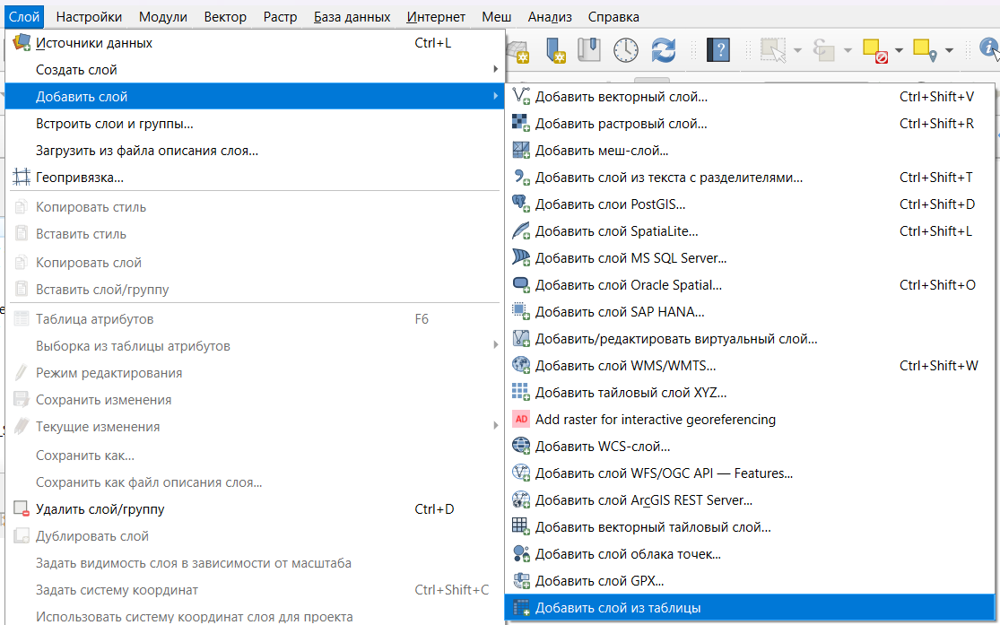

4.  В открывшемся окне укажите путь к файлу Excel и страницу, с которой требуется загрузить данные. Выходной слой назовите по шаблону `Адреса - %Фамилия%`, где `%Фамилия%` --- ваша фамилия. Укажите, что заголовки столбцов должны быть взяты из первой строки файла.

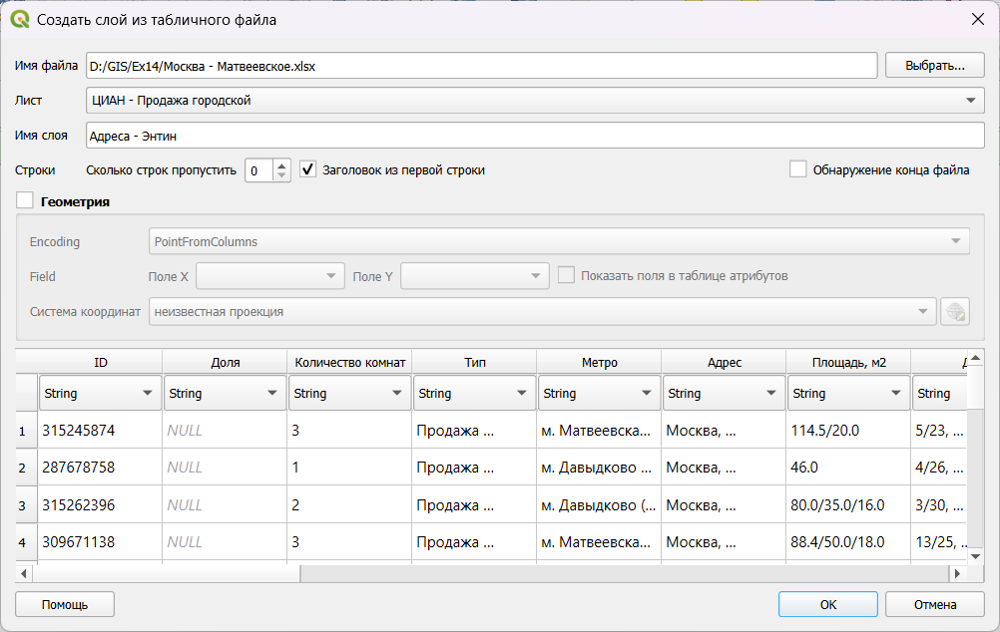

    При необходимости на этом этапе можно изменить типы данных для столбцов, но в нашем упражнении такой необходимости нет.

6.  Нажмите OK, чтобы добавить слой к проекту QGIS.

7.  Откройте таблицу атрибутов слоя и убедитесь, что данные из таблицы Excel отображаются корректно. Обратите внимание, что никаких пространственных данных в проекте пока нет.

8.  Найдите в загруженном файле столбец, в котором записан адрес объекта недвижимости

## Тестирование работы сервиса геокодирования {#geocoding-debug}

[В начало упражнения ⇡](#geocoding)

Прежде чем начинать «пакетное» геокодирование всего списка, мы возьмём несколько отдельных адресов из него и проверим, насколько хорошо работает сервис распознавания адресов Nominatim. Для этого мы воспользуемся страницей интерфейса отладки Nominatim.

1.  Откройте страницу интерфейса отладки Nominatim по [этой ссылке](https://nominatim.openstreetmap.org/ui/search.html)

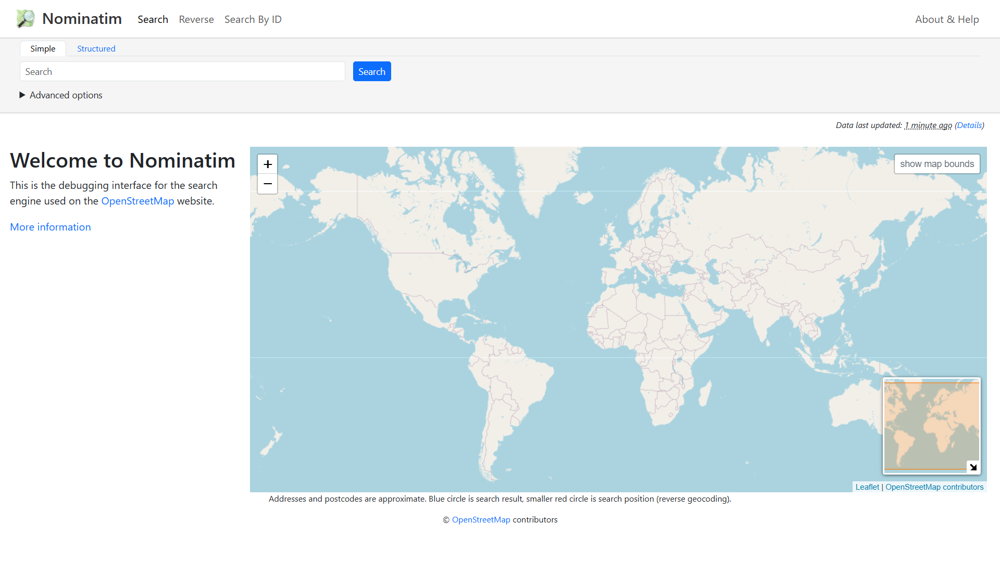

2.  Скопируйте любой адрес из вашей таблицы и вставьте его в строку поиска (*Search*). Нажмите кнопку **Search**, чтобы запустить поиск

Дальнейшее поведение системы зависит от того, насколько успешно парсер смог «прочитать» адрес. Если вся строка адреса распознана корректно, то в окне карты будет отображён объект, соответствующий найденному адресу.

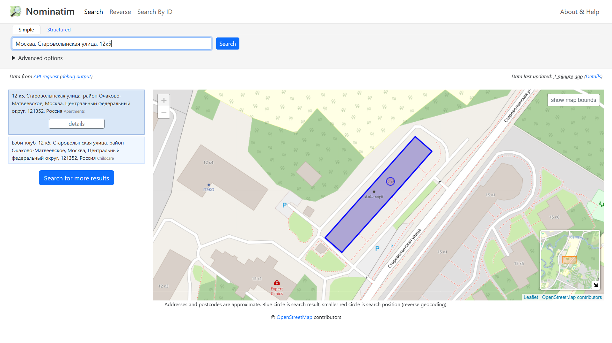

Если с распознаванием адресов возникли какие-либо трудности, то их можно отследить по выдаче. На рисунке ниже в адресе `Москва, Староволынская улица, 12-5` распознал всё, кроме номера дома, и выдал в качестве результата объект, соответствующий улице.

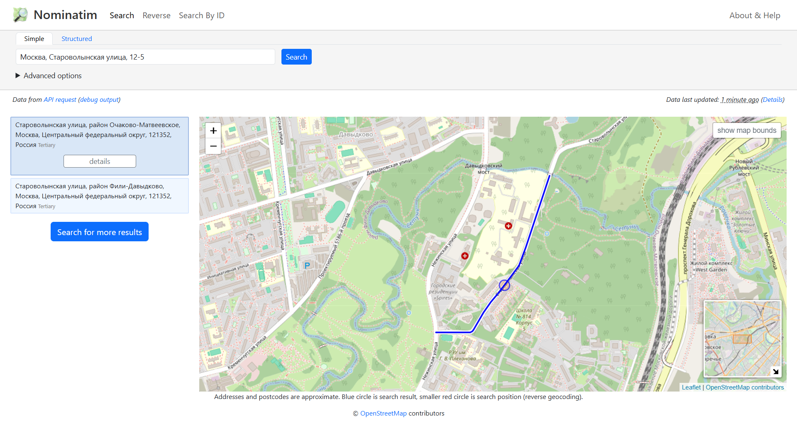
В этом примере достаточно восстановить букву «к» между номером дома и номером корпуса (`12к5`), и Nominatim отработает корректно.

В худшем случае геокодер вообще не сможет определить адрес. В примере ниже (`Москва, Нежинская улица, 3А, ш. Можайское ( км до МКАД)`) геокодер «сломался» уже на названии улицы.

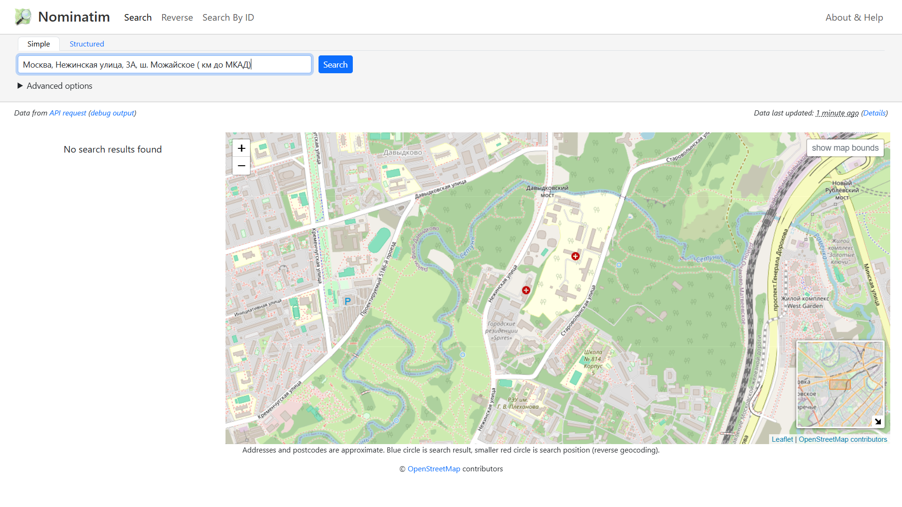

В этом примере проблема решается относительно просто. В строке адреса слишком много лишней информации. Если убрать слова `, ш. Можайское ( км до МКАД)`, то Nominatim выдаст корректный результат.

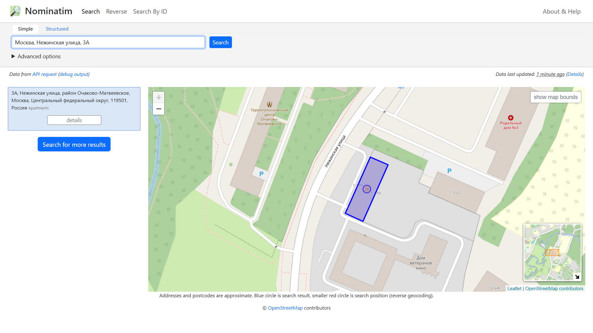

3.  Подберите аналогичные примеры из вашего набора исходных данных и сделайте скриншоты выдачи сервиса отладки Nominatim. Если какие-либо примеры не удаётся найти быстро — пропустите этот шаг, у вас будет возможность сделать его позже. Если какие-либо примеры не удаётся найти совсем, напишите в бланке отчёта «примеров нет» вместо снимка экрана

<kbd>В отчёт: снимок экрана №1 – успешное распознавание адреса сервисом Nominatim (в ответ на запрос выводится правильный дом)</kbd>

<kbd>В отчёт: снимок экрана №2 – неточное или неполное распознавание адреса (в ответ на запрос выводится улица, или неправильный дом, или правильный адрес, но в другом населённом пункте)</kbd>

<kbd>В отчёт: снимок экрана №3 – полностью неудачная попытка распознавания (пустая выдача)</kbd>

Мы рассмотрели некоторые потенциальные проблемы с распознаванием адресов, которые возникают при использовании сервиса Nominatim. Следует заметить, что другие, более «продвинутые» сервисы геокодирования могут автоматически распознавать и разрешать проблемы такого рода.

## Пакетное геокодирование {#geocoding-batch}

[В начало упражнения ⇡](#geocoding)

Теперь можно попытаться выполнить распознавание адресов при помощи Nominatim «пакетно», т. е. сразу для многих адресов (для всех адресов в вашей таблице).

1. Откройте панель инструментов и с помощью строки поиска найдите инструмент «Пакетный геокодер Nominatim».

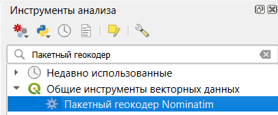

2. Запустите инструмент и настройте входные параметры. Укажите, что результат должен быть сохранён во временный файл.

3. Запустите инстумент и дождитесь, пока он выполнит геокодирование. Для работы инструмента требуется доступ к сети Интернет, а сам процесс может занять 10-15 минут. По окончании работы инструмента не закрывайте его окно, оно нам пригодится.

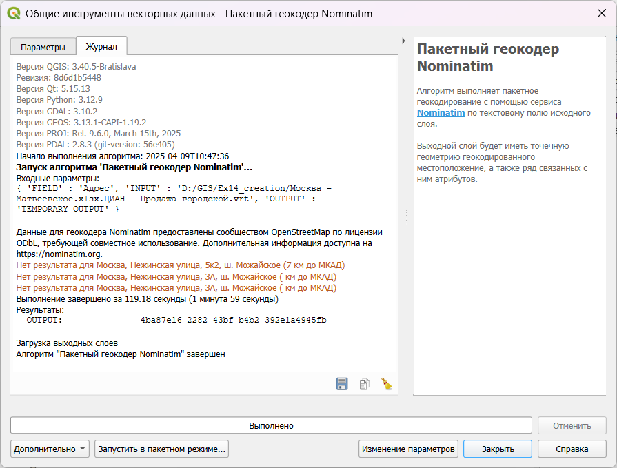
4. Когда инструмент закончит работу, сделайте снимок экрана целиком.

<kbd>В отчёт: снимок экрана №4 – результат геокодирования исходной таблицы адресов</kbd>

5. Обратите внимание на строки, выделенные жёлтым цветом в журнале инструмента. Таким способом обозначаются нераспознанные объекты. Скопируйте эти строки в отдельный текстовый документ (например, в «Блокнот»)

6. Удалите точечный слой с результатом геокодирования и сохраните проект QGIS.

Теперь нам нужно отредактировать адреса в исходной таблице. QGIS даёт возможность запустить режим редактирования непосредственно для таблицы Excel, но результат такого редактирования не сохраняется в постоянный файл, а само редактирование может привести к полному «исчезновению» всех строк таблицы. Поэтому мы пойдём обходным путём: сначала экспортируем таблицу в формат базы пространственных данных, а затем отредактируем базу, а не исходную таблицу.

7. Нажмите правой кнопкой мыши на таблицу в панели слоёв и выберите опцию «Экспорт» --- «Сохранить объекты как...»

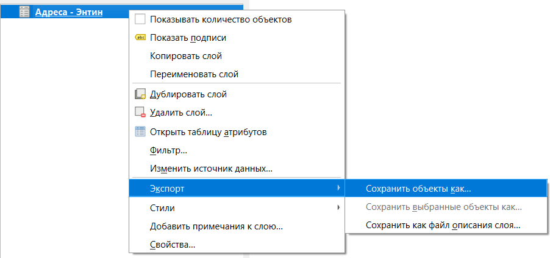

8. Экспортируйте таблицу в вашу рабочую директорию в файл `Ex14_%Familia%.gpkg` (`%Familia%` — ваша фамилия латиницей), таблицу внутри Geopackage назовите `source_table`.

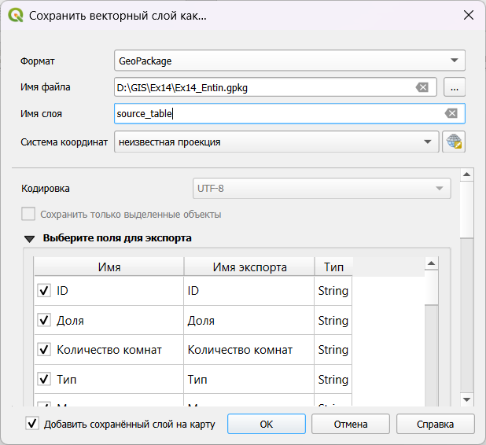

9. Когда экспорт будет завершён, а таблица добавлена в проект, удалите из прокекта старую таблицу.

10. Отредактируйте таблицу с адресами --- исправьте те адреса, которые вызвали проблемы (см. шаг 5 этого раздела). Используйте [интерфейс отладки Nominatim](https://nominatim.openstreetmap.org/ui/search.html), к которому вы обращались ранее, чтобы подобрать корректно распознаваемую строку для каждого «проблемного» адреса.

>Примечание: в некоторых вариантах вам, вероятно, не удастся добиться геокодирования  отдельных адресов. Игнорируйте такие адреса.

11. Запустите инструмент геокодирования снова. На этот раз сохраните результат в GeoPackage (`Ex14_%Familia%.gpkg`) под именем `points`. Убедитесь, что все адреса (кроме тех, которые вы специально проигнорировали) распознаны. Если какие-либо адреса не распознаны, отредактируйте их, а затем выполните геокодирование снова.

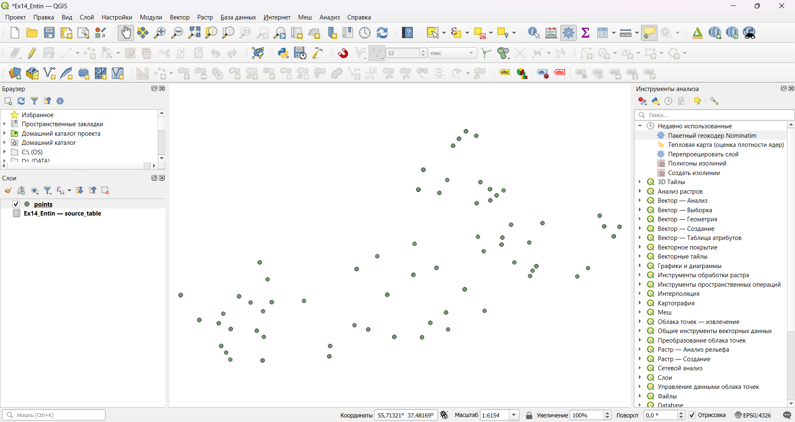

12. Добавьте в проект какую-либо базовую карту из сети Интернет, чтобы убедиться, что адреса корректно позционированы. Изучите визуально несколько точек на выбор. Если несколько точек «отлетают» от основного массива данных, удалите их.

13. Когда вы убедитесь в корректности позиционирования, удалите из проекта исходную таблицу с адресами, сделайте базовую карту полупрозрачной, а затем сделайте снимок экрана в охвате слоя `points`.

<kbd>В отчёт: снимок экрана №5 – результат геокодирования отредактированной таблицы адресов</kbd>

## Моделирование плотности объявлений {#geocoding-kde}

[В начало упражнения ⇡](#geocoding)

В результате геокодирования вы получили набор точек, каждая из которых соответствует одному объявлению о продаже недвижимости. При этом точки объявлений с одинаковым адресом будут иметь полностью совпадающие координаты. Поэтому визуальное отображение адресов даёт искажённое представление о распределении продаваемой недвижимости по территории.

Чтобы получить более достоверное распределение, можно перейти от дискретного представления явления (отдельные точки) к континуальному представлению (поле плотности). Для решения этой задачи применяется ядерная оценка плотности (*kernel density estimation*). Результатом ядерной оценки плотности является растр (регулярная сетка), каждая ячейка которой характеризует плотность явления или его ожидаемое количество.

> Примечание: результат ядерной оценки плотности зачастую называют «тепловой картой» или «теплокартой», поскольку при удачно подобранных графических средствах области высокой концентрации явления выглядят «яркими», «горячими», а области низкой концентрации --- «тёмными», «холодными». Несмотря на широкое распространение этих названий, мы не рекомендуем пользоваться ими в географических исследованиях, чтобы избежать путаницы с картами климатических и метеорологических характеристик, где «тепло» и «холодно» используются в прямом смысле.

Для построения ядерной оценки плотности желательно, чтобы исходные данные были приведены к прямоугольной системе координат, поэтому мы начнём с перепроецирования.

1. Измените систему координат проекта на какую-либо подходящую систему из числа тех, что могут быть использованы для топографического картографирования на вашей теорритории.

2. Перепроецируйте распознанные точки в систему координат проекта («Вектор» --- «Управление данными» --- «Перепроецировать слой...»). Результат перепроецирования сохраните в тот же GeoPackage, где лежат все предыдущие данные, под именем `points_project`. После успешного перепроецирования можно удалить из проекта исходные точки.

Для выполнения ядерной оценки плотности в QGIS имеется инструмент **Тепловая карта (оценка плотности ядер)**. Его можно найти в панели инструментов анализа, в разделе «Интерполяция»

3.  Запустите инструмент ядерной оценки плотности. В качестве исходного слоя задайте геокодированные точки

4.  Проверьте предлагаемое значение в поле «Радиус». Если возле поля «Радиус» изображён предупреждающий знак, а предлагаемая единица измерения --- градусы, значит, ваш исходный слой сохранён в географической системе координат. Выполните перепроецирование слоя (шаг 14 предыдущего раздела).

5.  Если с единицами измерения всё в порядке, установите радиус равным 400 м. Это охват области, на которую будет «распространяться» плотность точек.

6.  Установите размер пиксела по X и по Y равным 10 м. Этого вполне достаточно для аппроксимации.

7.  Укажите, что результирующий слой (*Heatmap*) нужно сохранить в вашу рабочую директорию под именем `heatmap_%Familia%.tif`, где `%Familia%` --- ваша фамилия латинскими буквами

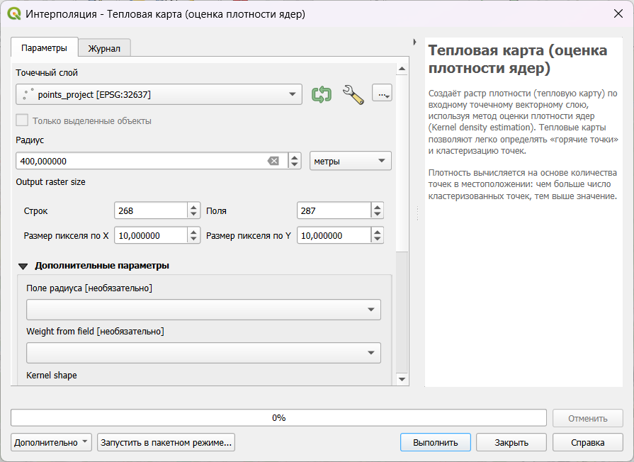

8.  Запустите инструмент ядерной оценки плотности и дождитесь, пока результат оценки будет добавлен к карте. После этого закройте инструмент ядерной оценки плотности.

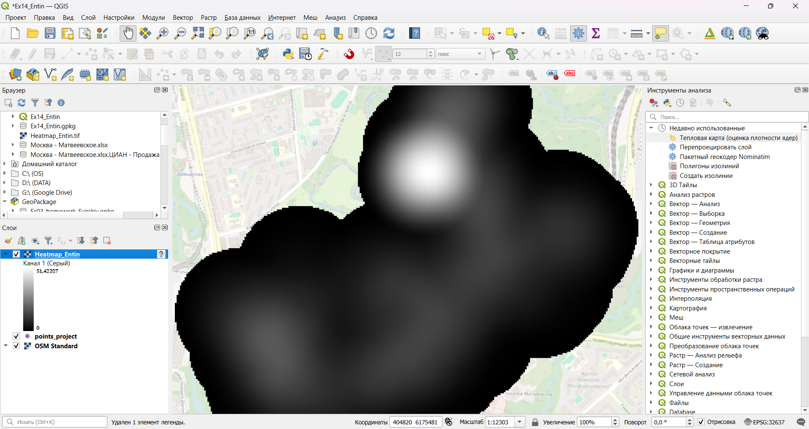

9. Если, как в примере выше, у результата геокодирования наблюдаются «трудности» с системой координат, установите для него нужную систему координат в свойствах слоя.

10.  Поместите слой исходных точек над слоем ядерной оценки плотности, отобразите данные в охвате слоя ядерной оценки плотности и сделайте снимок экрана.

<kbd>В отчёт: снимок экрана №6 – ядерная оценка плотности объявлений о продаже недвижимости</kbd>

## Картографирование плотности объявлений {#geocoding-mapping}

[В начало упражнения ⇡](#geocoding)

Покрытие (растр) ядерной оценки плотности, которое мы получили на предыдущем шаге, уже само по себе пригодно для геоинформационного анализа. В каждой ячейке этого растра записано ожидаемое число объявлений о продаже недвижимости в радиусе 400 м. Однако если вы хотите сделать картографическое изображение из такого набора данных, придётся проделать некоторую дополнительную работу. В этой части упражнения мы настроим визуализацию для растрового слоя, а затем создадим на его основе векторные наборы данных с аналогичной символикой.

1.  Откройте свойства слоя ядерной оценки плотности на вкладке «Стиль». Измените цветовую схему на «Одноканальное псевдоцветное». Округлите максимальное отображаемое значение вверх до ближайшего целого числа, кратного 5. Измените тип интерполяции на «Дискретную», задайте точность подписи равной 0.

2. Внизу слева, под таблицей с классами, выберите режим классификации --- «Равные интервалы». Справа в той же строке установите число интервалов таким образом, чтобы интервал, отображающиеся выше, в таблице с классами, были «круглыми», т.е. с границами, кратными 5 или 10, как показано на рисунке ниже.

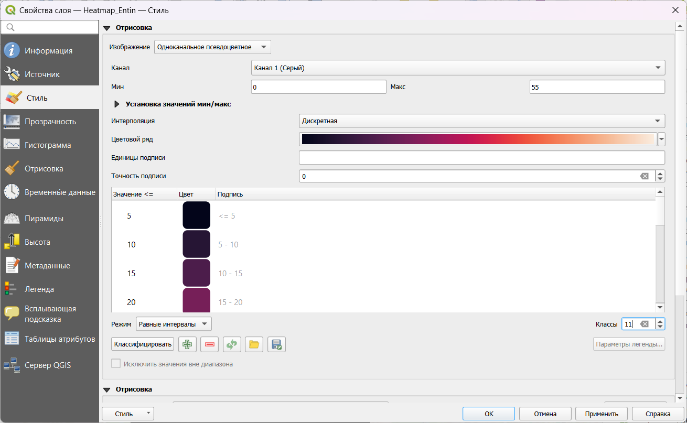

3.  Нажмите правой кнопкой на изображение шкалы (градиента) и активируйте опцию «Инвертировать градиент».

4. Перейдите на вкладку «Прозрачность» и установите прозрачность слоя равной 50 или 66 %.

В результате применения описанных настроек вы получите изображение ядерной оценки, аналогичное представленному ниже:

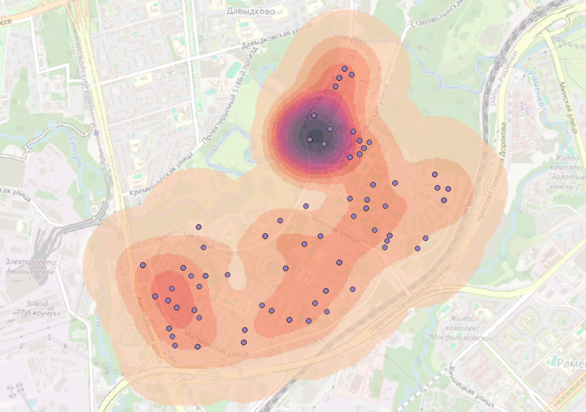

5. В панели слоёв разверните легенду к ядерной оценке плотности и сделайте снимок экрана целиком.

<kbd>В отчёт: снимок экрана №7 – ядерная оценка плотности объявлений о продаже недвижимости с настроенной символикой</kbd>

Мы получили изображение, которое в терминах классической картографии можно было бы описать как псевдоизолинии с послойной окраской --- если, конечно, на схему были бы нанесены изолинии. QGIS позволяет сделать на основе растрового покрытия и изолинии, и послойную окраску, и на следующих шагах мы сделаем их.

6. Чтобы создать изолинии на основе растра, запустите инструмент «Растр» — «Извлечение» — «Создать изолинии...». Установите сечение изолиний равным шагу вашей «послойной окраски», результат сохраните в вашу рабочую директорию в формате шейп-файла (не GeoPackage!) под именем `contours.shp` 

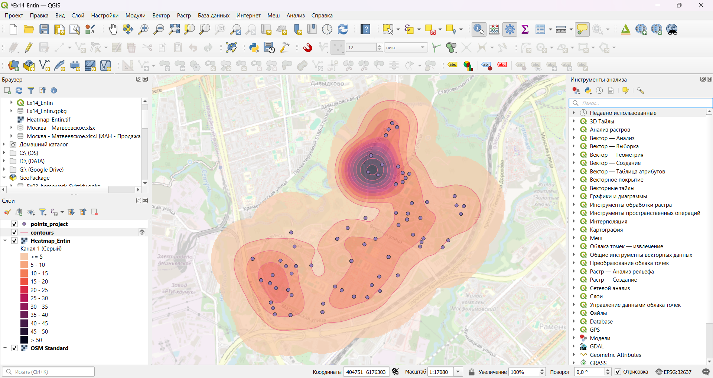

7. При необходимости «поправьте» систему координат слоя изолиний.

8. Настройте подписи для изолиний. Укажите, что изолинии должны быть подписаны значениями «высот» (поле `ELEV`, если вы не поменяли его при создании), а подписи должны размещаться непосредственно на линиях.

9. Теперь создадим полигоны для изображения послойной окраски. Для этого в панели инструментов найдите инструмент под названием «Полигоны изолиний». Откройте интерфейс этого инструмента.

10. Установите «сечение» полигонов равным шагу вашей «послойной окраски», результат сохраните в вашу рабочую директорию в формате шейп-файла (не GeoPackage!) под именем `contours.shp`.

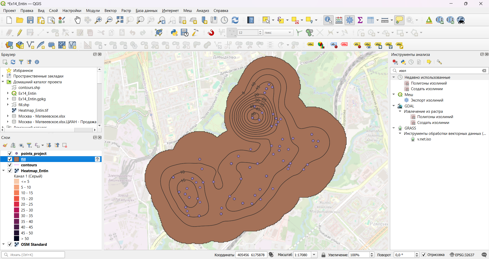

11. При необходимости «поправьте» систему координат слоя послойной окраски.

12. Настройте символику для полигонов таким образом, чтобы она была аналогична изображению растра, и при этом отображался только их фон, но не граница. Этого можно добиться следующим образом:

- изменить символизацию полигонов на «Символизацию по уникальным значениям»;
- в качестве поля для значения взять `ELEV_MIN` или `ELEV_MAX`;
- в настройке «Знак» зайти в опцию знака и любым способом отключить обводку
- нажать кнопку «Классифицировать» внизу таблицы элементов;
- после завершения классификации удалить строчку «Все другие значения...»
- настроить цветовую шкалу так же, как вы настроили её для растра.

После завершения настройки окно свойств слоя послойной окраски будет выглядеть, как показано на рисунке ниже:

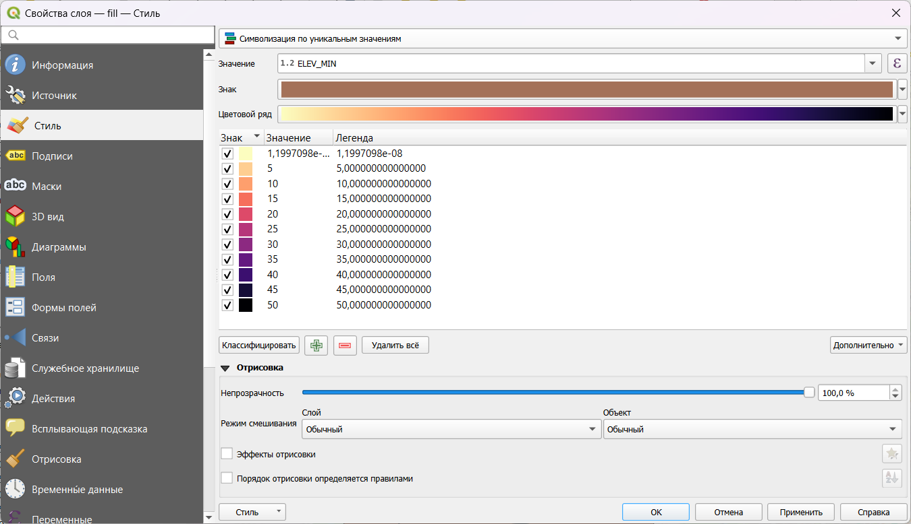

13. Закройте окно свойств слоя послойной окраски. Разместите изолинии над послойной окраской, а исходный растр отключите. Сделайте снимок экрана.

<kbd>В отчёт: снимок экрана №8 – ядерная оценка плотности (векторное представление)</kbd>

12. Создайте картографическое изображение на основе имеющихся пространственных данных. Создайте макет компоновки, добавьте на него картографическое изображение, легенду, масштабную линейку, название карты и сведения об авторстве. Для картографического изображения настройте градусную сетку. В легенде сохраните только те условные знаки, которые соответствуют тематическому содержанию карты; при необходимости самостоятельно отредактируйте подписи.

>Примечание для картографов: легенда к изолиниям и псевдоизолиниям должна быть оформлена в виде шкалы, а не в виде отдельных «патчей» --- см. примеры ниже. QGIS не обладает функционалом для автоматического сбора легенды, её нужно сделать самостоятельно в QGIS или в векторном графическом редакторе.

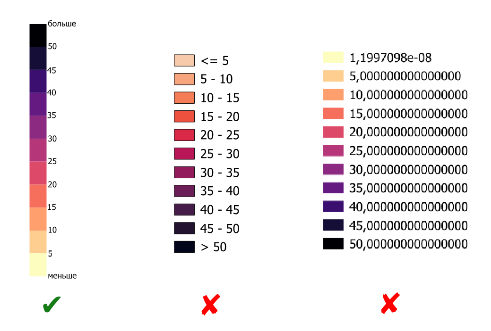

13. Экспортируйте карту в формат PNG и вставьте её в отчёт.

<kbd>В отчёт: рисунок №1 – распределение объявлений о продаже недвижимости в выбранном районе</kbd>
