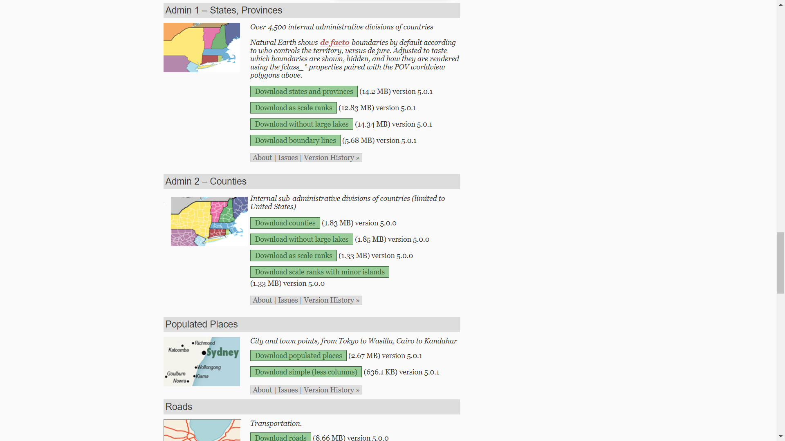
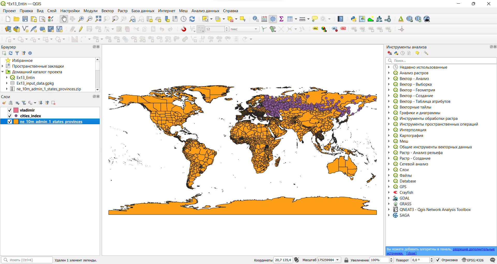
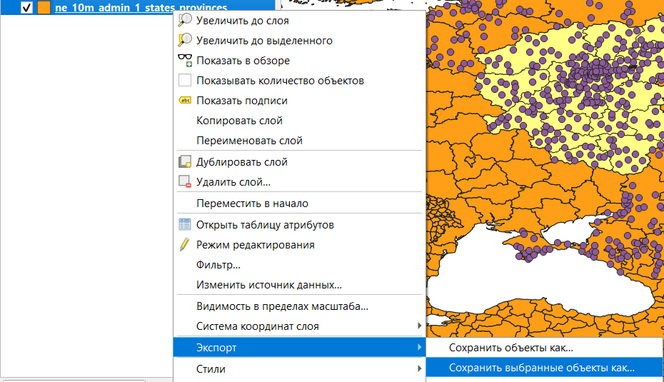
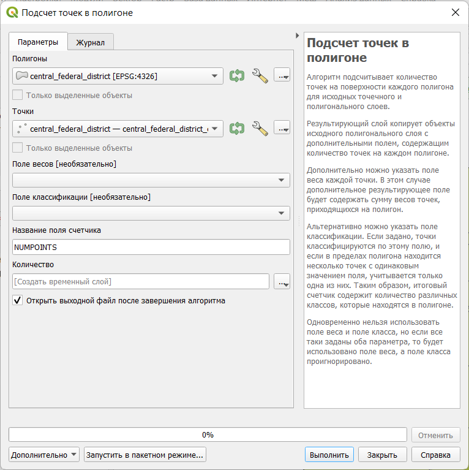
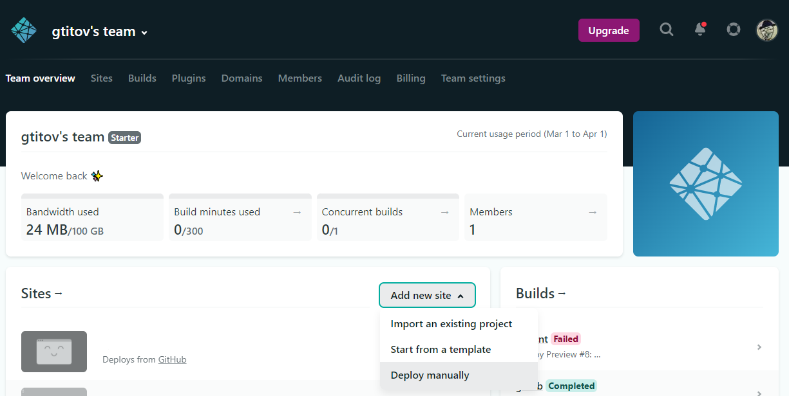

# (PART) Веб-картографирование {-}

# Создание веб-карты {#web-map}

[Архив с исходными данными](https://github.com/aentin/qgis-course/raw/master/files/Ex13.zip)

[Контрольный лист](https://github.com/aentin/qgis-course/raw/master/files/Ex10_%D0%BE%D1%82%D1%87%D1%91%D1%82.docx){target="_blank"}

## Введение {#web-map-intro}

**Цель задания** --- получение навыков создания веб-карт с использованием QGIS.

**Необходимая теоретическая подготовка:** модели пространственных данных, модели пространственных объектов, базы пространственных объектов, картографические проекции.

**Необходимая практическая подготовка:** Знание основных компонент интерфейса QGIS (менеджер источников данных, таблица слоёв, фрейм карты, менеджер компоновок).
Работа с различными форматами источников пространственных данных.
Настройка символики и подписей объектов.
Владение базовыми ГИС-технологиями, в том числе пространственный и атрибутивный запросы.

**Исходные данные:** набор данных, созданный на основе [Natural Earth](https://www.naturalearthdata.com/), [индекс-городов.рф](https://xn----dtbcccdtsypabxk.xn--p1ai/#/) и  [how-old-is-this.house](https://kontikimaps.ru/how-old/dataset?p=h-menu).

**Ожидаемый результат:** мультимасштабная веб-карта, доступная для просмотра по ссылке.

### Контольный лист {#web-map-checklist}

-   Добавить на карту слои пространственных данных
-   Подготовить слои пространственных данных с помощью атрибутивных и пространственных запросов
-   Оформить слои
-   Задать масштабные границы отображения слоёв
-   Экспортировать результат в виде веб-страницы
-   Опубликовать веб-страницу

### Аннотация {#web-map-annotation}

Веб-карты — это карты, предназначенные для использования в сети. Их основными достоинствами являются интерактивность, общедоступность и мультимасштабность. В рамках данного упражнения мы научимся создавать веб-карты с помощью QGIS, по ходу подготовки веб-карты закрепим полученные на предыдущих занятиях навыки.

## Получение и подготовка исходных данных {#web-map-init}
[В начало упражнения ⇡](#web-map)

<!-- ### Получение пространственных данных -->

1. Создайте рабочую директорию для выполнения упражнения и заведите в ней новый проект QGIS.

2. Добавьте в созданный проект все слои, содержащиеся в архиве с исходными данными и изучите их.

**Вопрос 1:** какие данные имеются в загруженном наборе? Какую семантическую информацию они содержат?

**Вопрос 2:** какую информацию содержат поля с суффиксом `\_points` в наборе данных о городах?

3. Отключите слой со зданиями.

<!-- 1. Изучите слои -->

<!-- 1. Временно отключите слой со зданиями -->

4. Перейдите на сайт [Natural Earth](https://www.naturalearthdata.com/downloads/) и загрузите набор пространственных данных, описывающий единицы административно-территориального деления (АТД) 1-го порядка с детальностью масштаба 1:10 000 000.

    
    
5. Распакуйте архив в вашу рабочую директорию и добавьте набор данных в проект QGIS

    >Примечание: данные, получаемые с Natural Earth, поставляются в формате шейп-файлов. Помните, что шейп-файл — это несколько файлов. Не стоит распаковывать архив непосредственно в директорию проекта; вместо этого лучше завести вложенную папку специально для этого набора даных.
    
    
    
6. Выберите в слое единиц АТД регионы, относящиеся к Центральному федеральному округу РФ (ЦФО).

7. Экспортрируйте выборку в новый файл формата GeoPackage. Для этого в контекстном меню слоя выберите «Экспорт — Сохранить выбранные объекты как...»

    
    
8. Добавьте экспортированный набор данных в проект, если этого не произошло автоматически, и удалите из проекта исходный слой с регионами мира.

<!-- ### Подготовка слоя регионов ЦФО -->

<!-- 1. Выберите из слоя с регионами мира регионы Центрального Федерального округа (ЦФО) РФ -->
<!-- 1. Экспортируйте регионы ЦФО в отдельный слой -->
<!-- 1. Добавьте в проект слой с регионами ЦФО -->
<!-- 1. Удалите из проекта слой со всеми регионами мира -->

9. Из общего набора данных о городах выберите те города, которые попадают в пределы ЦФО. Экспортируйте выборку и добавьте её в проект. Удалите из проекта исходный слой с городами.

10. Отобразите содержимое фрейма карты в QGIS в полном охвате и сделайте снимок экрана.

<kbd>**Скриншот 1:** подготовленные исходные данные</kbd>

<!-- ### Подготовка слоя городов ЦФО -->

<!-- 1. Выберите из слоя с городами РФ города в пределах ЦФО -->
<!-- 1. Экспортируйте города ЦФО в отдельный слой -->
<!-- 1. Добавьте в проект слой с городами ЦФО -->
<!-- 1. Удалите из проекта слой со всеми городами РФ -->
<!-- 1. Изучите атрибутивную таблицу слоя с городами ЦФО. -->

<!-- *За что отвечают поля с суффиксом "\_points" (ответ для каждого поля)?* -->

## Расчёт среднего качества городской среды в регионе
[В начало упражнения ⇡](#web-map)

На этом шаге вам нужно рассчитать среднее значение индекса качества городской среды для каждого субьекта РФ. В QGIS есть инструмент, позволяющий подсчитать число точек в полигоне, в том числе с учётом весовых коэффициентов. Можно рассчитать «суммарный» индекс качества городской среды для каждого региона, а затем разделить его на число городов в регионе и таким образом получить среднее значение индекса.

1. Используйте инструмент **Подсчёт точек в полигоне...** (**Вектор — Анализ**), чтобы определить число точек в каждом полигоне. Самостоятельно задайте имя целевого поля. Результат можно сохранить во временный слой.

    

2. Теперь вновь используйте тот же инструмент, чтобы рассчитать суммарное значение индекса («вес») в каждом полигоне. Самостоятельно задайте имя целевого поля, но таким образом, чтобы оно отличалось от имени поля числа точек, созданного на предыдущем шаге. Результат вновь сохраните во временный слой.

3. Соедините таблицы атрибутов двух полученных слоёв.

4. Используйте калькулятор полей, чтобы посчитать среднее значение индекса в каждом регионе. Результат запишите в виде целых чисел (integer)

5. Сохраните слой, в котором посчитаны средние значения индекса, в файл формата GeoPackage.

<!-- Подсчитайте среднее значение поля "total_points" для регионов ЦФО: используйте инструмент Vector \> Analysis Tools \> Count Points in Polygon..., чтобы подсчитать сумму баллов "total_points" всех городов в регионе, и используйте его, чтобы подсчитать количество городов в регионе; используйте калькулятор полей, чтобы получить среднее значение индекса городов в каждом регионе (используйте целое число для хранения данных). -->

## Оформление карты
[В начало упражнения ⇡](#web-map)

1. Удалите с карты все слои, кроме:
    1. Слоя с регионами ЦФО, для которых подсчитаны средние значения индекса;
    2. Слоя с городами ЦФО;
    3. Слоя со зданиями города Владимир.
  
2. Изобразите города с помощью значков разного цвета в зависимости от значения показателя *total_points* (символизация по диапазонам значений). Число классов, метод классификации и цветовую шкалу выберите самостоятельно, учитывая особенности картографируемого показателя

<!-- Для городов используйте поле "total_points", примените градиурованный знак, выполните классификацию городов (количество классов, вариант классификации и шкалы подберите самостоятельно, учитывая особенности картографируемого показателя). -->

3. Изобразите регионы ЦФО с помощью картограммы на основе рассчитанных средних значений индекса. Отредактируйте число классов, границы классов и цветовую шкалу таким образом, чтобы они совпадали с настройками слоя городов

<!-- 1. Аналогичную классификацию примените к слою с регионами ЦФО (шкала, количество классов и их граничные значения должны совпадать со слоем городов), используйте рассчитанное поле со средним значением индекса в регионе. -->

4. Изобразите здания способом «градуированных цветов» (символизация по диапазонам значений) на основе года постройки. Самостоятельно задайте число классов, метод классификации (можно задать граничные значения вручную), цветовую шкалу. Отключите обводку полигонов.

<!-- 1. Для зданий используйте поле с годом постройки, границы классов задайте самостоятельно (примените, например, знания об истории России или особенности распределения значений показателя в слое), отключите обводку полигонов. -->

5. Сделайте снимок экрана

<kbd>**Скриншот 2:** слои проекта после применения настроек визуализации</kbd>

<!-- *Зачем мы устанавливаем аналогичное оформления для слоя городов и слоя регионов?  Скриншот* -->

## Подготовка карты к публикации
[В начало упражнения ⇡](#web-map)

### Перевод названий полей на русский язык

Необходимо заменить английские наименования полей на русские, чтобы пользователю было удобнее работать с информацией на карте.

1. В слое с регионами назовите по-русски поля с названием региона и со средним значением индекса качества городской среды. Экспортируйте его в новый слой, оставив только переведённые поля.
1. В слое с городами назовите по-русски поля с названием города и поля с суффиксом "_points". Экспортируйте его в новый слой, оставив только переведённые поля.
1. В слое со зданиями назовите по-русски поле "r_year_int" и другие поля на своё усмотрение. Экспортируйте его в новый слой, оставив только переведённые поля.

*Зачем выполняется экспорт в новый слой? Почему после перевода названий полей исчезают слои?*

### Настройки мультимасштабного отображения

В мелком масштабе нецелесообразно показывать городские здания, а в крупном — регионы.

Для определения мультимасштабности используйте вкладку Rendering в свойствах слоя. Регионы должны отображаться в масштабах мельче 1:1 000 000. Города — в масштабах от 1:2 000 000 до 1:100 000. Здания — в масштабах крупнее 1:100 000.

### Добавление базовой карты

<!-- Для добавления базовой карты используйте плагин QuickWebServices (Web > QuickWebServices > CartoDB > Positron). -->

> Лицензии ряда базовых карт жёстко ограничивают возможности их использования. Например, подложку Яндекс.Карт можно использовать только в сервисах на основе API Яндекс карт. При создании веб-карт, доступных в глобальной сети, к этому надо относиться особенно внимательно.

## Публикация карты
[В начало упражнения ⇡](#web-map)

Чтобы карта стала доступна в Интернете, её надо экспортировать в виде веб-страницы и разместить её на веб-сервере (мы для этого используем бесплатные возможности сервиса Netlify).

1. Установите плагин qgis2web
1. Приблизьтесь к карте так, как бы хотели, чтобы она выглядела при публикации. Создайте веб-карту на основе проекта Web > qgis2web > Create web map.
    1. Для каждого из полей во всплывающем окне кроме полей с индексами установите строчную подпись (inline label).
    1. В качестве движка для создания веб-карты выберите OpenLayers или Leaflet.
    1. Во вкладке Appearance добавьте список слоёв и возможность поиска городов по названию.
    1. Во вкладке Export задайте папку, куда будет экспортирована папка с веб-картой.
1. Зарегистрируйтесь на Netlify
1. Зайдите в аккаунт и перенесите папку с веб-страницей карты в соответсвующее окно.
1. В настройках сайта замените имя сайта по собственному усмотрению.

