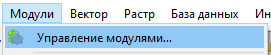
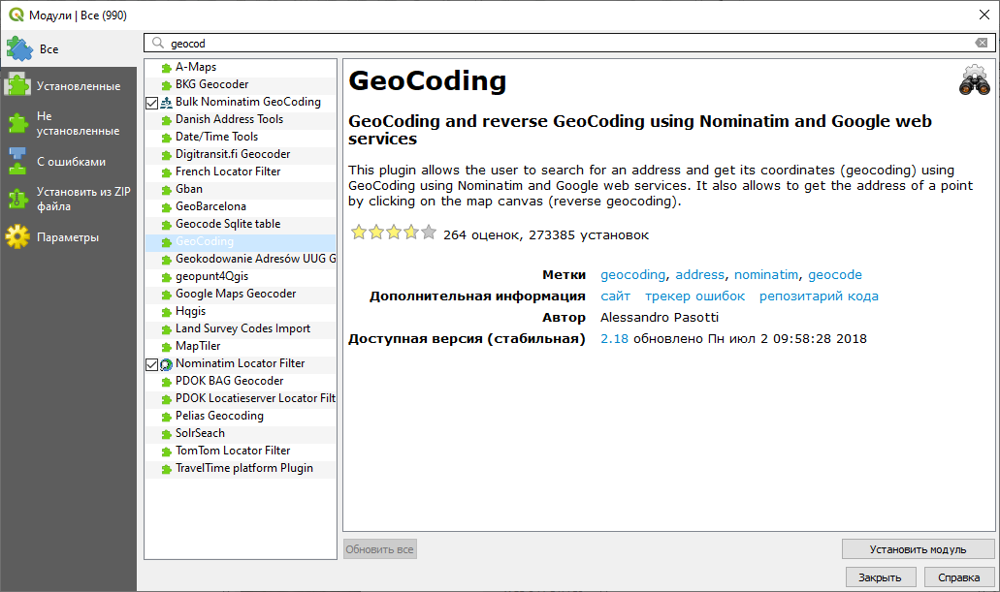

# Установка модулей в QGIS {#manual-plugins}

Одно из преимуществ QGIS как геоинформационной платформы — наличие большого количества подключаемых модулей (плагинов). Подключаемые модули расширяют возможности QGIS, предоставляя пользователям специализированные инструменты для решения определённых задач — например, для конвертации логов ГНСС-приёмников, геокодирования или получения информации из кадастровых баз данных. С другой стороны, поскольку большинство подключаемых модулей написано сторонними разработчиками, программный код любого модуля может содержать ошибки, приводящей к некорректной работе модуля, или не обеспечивать требуемый функционал.

## Установка модулей {#manual-plugins-install}

Существует два пути установки модулей:

1. Установка из репозитория;

2. Установка из ZIP-архива.

Для установки новых модулей, обновления или удаления имеющихся модулей следует зайти в меню «Модули» — «Управление модулями...»

**Установка из репозитория** — наиболее удобный способ установки модулей в QGIS. Этот способ требует подключения к Интернету. При запуске команды «Управление модулями...» QGIS производит проверку доступных модулей в репозиториях, сохранённых в списке. По умолчанию в списке присутствует только официальный репозиторий модулей QGIS. Включение модуля в официальный репозиторий даёт некоторые гарантии его стабильной работы: от разработчика требуется поддерживать сайт и репозиторий кода модуля, а также отслеживать сообщения об ошибках.

Для установки из репозитория достаточно выбрать вкладку «Все» или «Не установленные» в левой части окна управления модулями, а затем при помощи строки поиска в верхней части найти нужный модуль по названию или ключевым словам. Выбрав нужный модуль из списка подходящих, нажмите кнопку «Установить модуль» в правом нижнем углу.

**Установка модуля из архива** применяется, как правило, для экспериментальных модулей, которые не доведены разработчиками до состояния, пригодного для размещения в открытом репозитории. 
Для установки модуля из архива необходимо загрузить на компьютер пользователя ZIP-архив с файлами модуля. Затем в окне управления модулями нужно открыть вкладку «Установить из ZIP файла», в этой вкладке указать путь к файлу и нажать на кнопку «Установить модуль»

## Обновление модулей {#manual-plugins-update}

Модули, размещённые в открытых репозиториях, периодически получают обновления от разработчиков.

Модули, установленные из ZIP-архивов, не получают обновлений автоматически. Для перехода на новую версию модуля нужно получить архив с новой версией, а затем повторить процедуру установки.

## Удаление модулей {#manual-plugins-uninstall}

Для удаления модуля нужно выбрать его на вкладке «Установленные», а затем нажать кнопку «Удалить модуль» в правом нижнем углу.