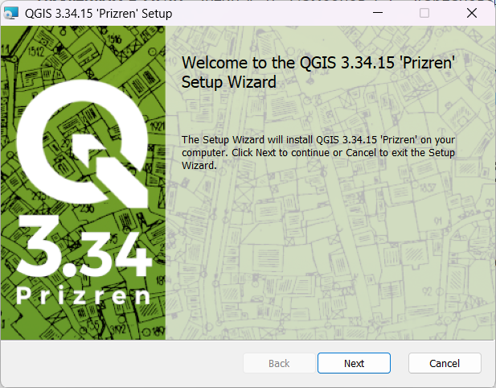

--- 
title: "Основы геоинформатики: практикум в QGIS"
author: "Тимофей Самсонов, Андрей Карпачевский, Андрей Энтин"
date: "`r Sys.Date()`"
site: bookdown::bookdown_site
documentclass: book
bibliography: [book.bib, packages.bib]
biblio-style: apalike
link-citations: yes
description: "Основы геоинформатики: практикум в QGIS"
colorlinks: true
github-repo: aentin/qgis-course
fontsize: 12pt
mainfont: PT Serif
toc_float:
  collapse: section
  smooth_scroll: true
apple-touch-icon: images/apple-touch-icon.png
apple-touch-icon-size: 120
favicon: images/favicon.ico
---

# Общие сведения {-}

> Если вы ищете практикум на основе __ArcGIS__, то он находится [__тут__](https://tsamsonov.github.io/arcgis-course/).

## Учебные материалы {-}

- __Учебник__: Лурье И. К. _Геоинформационное картографирование. Методы геоинформатики и цифровой обработки космических снимков: Учебник для вузов._ 2-е изд. – М.: КДУ, 2010. [__PDF__](https://istina.msu.ru/download/295728157/1jUpeD:roxrGk69x0LxZCpC5w_KNV0o390/)

- __Пособие__: Лурье И. К., Самсонов Т. Е. _Информатика с основами геоинформатики. Часть 2. Основы геоинформатики. Учебное пособие._ Москва. Изд-во МГУ, 2016. [__PDF__](https://istina.msu.ru/download/45821659/1ej66u:uSUtcUS-XmdMMyRRpC-yflDmCv8/)

- __Практикум в ArcGIS__: Самсонов Т. Е. _Основы геоинформатики: практикум в ArcGIS_. — Географический факультет МГУ Москва, 2018. — 460 с. DOI: 10.5281/zenodo.1167857. [__Website__](https://tsamsonov.github.io/arcgis-course/)

- __Практикум в QGIS__: Энтин А. Л., Самсонов Т. Е. _Основы геоинформатики: практикум в QGIS_. [__Website__](https://aentin.github.io/qgis-course/)

<!-- - __Презентации__: -->

<!--   - [Привязка](https://1drv.ms/p/s!AmtmZDq3JgxHgZ1VMkl568n2flOdyg?e=zjwgJt){target="_blank"} -->

<!--   - [Пространственное моделирование и пространственная интерполяция](https://1drv.ms/p/s!AmtmZDq3JgxHgZ1X_f0g_iu-lbC-dg?e=mW6Jjb){target="_blank"} -->

<!--   - [ГИС-проект](https://1drv.ms/p/s!AmtmZDq3JgxHgZ1Umn-wlCou1CFBFQ?e=TqyBy5){target="_blank"} -->

<!--   - [Итоговая лекция по курсу](https://1drv.ms/p/s!AmtmZDq3JgxHgZ1WdopazJmTuqeE8A?e=WeWhcG){target="_blank"} -->
<!-- <!--   - *Фундаментальные понятия геоинформатики*: [__PDF__](https://www.dropbox.com/s/skfry975yev660o/GIS_Models_Referencing.pdf?dl=0) -->
<!-- <!--   - *Географическая информация*: [__PDF__](https://www.dropbox.com/s/15x9c5a1zkk34ep/GIS_Information_Economics.pdf?dl=0) -->
<!-- <!--   - *Программное обеспечение ГИС (17 апреля)*: [__PPT__](https://1drv.ms/p/s!AmtmZDq3JgxHgZYyWa7tCh6cnSncZg?e=4uXt7L) -->
<!-- <!--   - *Обзор программных средств ГИС (17 апреля)*: [__PPT__](https://1drv.ms/b/s!AmtmZDq3JgxHgZYzXaJpig-PVM3g0A?e=XrTnyu) -->
<!-- <!--   - *Технологии пространственного моделирования (20 марта, 27 марта)*: [__PPT__](https://1drv.ms/p/s!AmtmZDq3JgxHgZUH2LWFrSxmy9FnEw?e=NGpBCU) -->
<!-- <!--   - *Основные этапы развития ГИС. Типы ГИС (10 апреля)*: [__PPT__](https://1drv.ms/p/s!AmtmZDq3JgxHgZYTeyK01FEjAt-08w?e=IXMy3D) --> <!--[__PPT__](https://1drv.ms/p/s!AmtmZDq3JgxHgZYS0k69BhHwrTxFzw?e=VL6xWU) -->
<!-- <!--   - *Обзорная лекция (24 апреля)*: [__PPT__](https://1drv.ms/p/s!AmtmZDq3JgxHgZY1r1o6Vj4-J7ohlA?e=o6796y) -->

## Программное обеспечение для работы {-}

Для работы вам потребуется скачать и установить на свои компьютеры геоинформационное приложение QGIS. Это свободно распространяемое программное обеспечение, для его установки не требуется покупка или регистрация. 

### Windows {-}

Скачайте с [официального сайта](https://qgis.org/ru/site/forusers/download.html) последнюю стабильную версию QGIS. По состоянию на 7 февраля 2022 г. это версия 3.16. [Скачать](https://qgis.org/downloads/QGIS-OSGeo4W-3.16.16-1.msi).

Если на вашем компьютере уже установлена более старая версия QGIS, удалите её перед началом установки новой версии. Вы можете использовать старую версию QGIS для выполнения большинства заданий практикума, однако, если у вас возникнут технические проблемы, 

Когда исполняемый файл загрузится, запустите его. Если потребуется, разрешите приложению вносить изменения на вашем устройстве. 

Будет показано приветственное окно мастера установки. Нажмите «Далее», чтобы перейти на следующий шаг.

На следующем шаге будет показано лицензионное соглашение QGIS и другого программного обеспечения, входящего в пакет поставки. Нажмите «Принимаю».

На следующем шаге выберите папку для установки и отметьте, нужно ли создавать ярлыки на рабочем столе и в меню «Пуск». По возможности используйте параметры, предлагаемые по умолчанию.

На следующем шаге предлагается запустить процедуру установки. Нажмите «Install». Когда система выдаст запрос на внесение изменений, примите его.

После окончания установки ярлыки QGIS будут добавлены в меню "Пуск" и в отдельную папку QGIS на рабочем столе.

<!--  -->

### macOS {-}

По состоянию на 7 февраля 2022 г. для прохождения практикума рекомендуется использовать альтернативную сборку версии [3.4.12](https://www.kyngchaos.com/files/software/qgis/QGIS-macOS-3.4.12-1.dmg). Перейдя по ссылке, необходимо согласиться сохранить образ установочного диска  на компьютер (можно разрешить его сразу открыть средствами _DiskImageMounter_):

После того как образ загрузится и будет открыт, необходимо последовательно запустить три установщика, выделенные на снимке экрана ниже (именно в том порядке, в котором они пронумерованы!):

Установщики __GDAL Complete__ и __QGIS 3 LTR__ необходимо запускать через контекстное меню и выбирать пункт "Открыть":

В появившемся диалоговом окне необходимо нажать "Открыть", чтобы разрешить установку:

Все опции при установке каждой компоненты приложения оставляйте по умолчанию, ничего не меняйте и нажимайте в диалоговых окнах "Продолжить", пока не запустится установщик.

После того как последняя компонента — __QGIS__ — будет установлена, вы сможете найти приложение и запустить его из каталога _Программы_ macOS:

### Linux {-}

Воспользуйтесь инструкциями по [этой ссылке](https://qgis.org/ru/site/forusers/alldownloads.html#linux).

Дополнительную информацию по установке можно найти на [https://qgis.org/ru/site/forusers/download.html](https://qgis.org/ru/site/forusers/download.html).

<!-- # Введение{-} -->

<!-- Практикум разрабатывается для студентов кафедры картографии и геоинформатики географического факультета МГУ имени М.В. Ломоносова. Упражнения выполяются в свободно распространяемом ГИС-пакете [QGIS](https://www.qgis.org/ru/site/forusers/download.html). На занятиях вы можете пользоваться стационарными компьютерами в аудитории 1903, а для выполнения домашних работ вам нужно будет установить QGIS на ваши личные машины. -->

<!-- Сдавать отчёты и домашние работы мы будем через [Google Classroom](https://classroom.google.com). Для того, чтобы присоединиться к курсу, нужно: -->

<!-- 1. Зарегистрировать аккаунт Google. Для этого не обязательно создавать почтовый ящик в Google Mail, можно воспользоваться любой имеющейся почтой. -->
<!-- 2. Зайти на главную страницу Google Classroom (https://classroom.google.com) -->
<!-- 3. Присоединиться к курсу по коду **`glb5hvb`**. -->

<!-- Практиум находится в разработке, поэтому вы неизбежно столкнётесь с ошибками в данных, процедурах и текстах упражнений. О любых найденных ошибках, опечатках и выявленных проблемах с программным обеспечением прошу немедленно сообщать преподавателю одним из следующих способов: через систему учёта ошибок GitHub (Issues), через Classroom, по [электронной почте](mailto:aentin@geogr.msu.ru). -->

<!-- *Сейчас практикум доступен только в формате HTML, возможность его использования в других форматах (PDF, EPUB) будет реализована позже.* -->

<!-- **Перед выполнением практикума необходимо внимательно ознакомиться с регламентом и тщательно придерживаться его при выполнении заданий.** -->

<!-- ## Регламент{-} -->

<!-- Вы можете выполнять упражнения как на своих личных компьютерах, так и на стационарных компьютерах, которые имеются в аудитории 1903. Если вы пользуетесь личным компьютером, рекомендую создать папку `GIS` в корне одного из дисков и помещать материалы упражнений туда. Если вы работаете на компьютерах в 1903, соблюдайте следующие требования: -->

<!-- - __Ваша личная рабочая директория должна иметь адрес__ -->

<!--     `D:\GIS\<ваша кафедра>\<фамилия>` -->

<!--     Например, студент 207 группы Петров хранит результаты своей работы в каталоге `D:\GIS\207_CAR\Petrov`. Если в группе есть несколько человек с одинаковой фамилией, добавляйте к фамилии первые буквы имени и отчества, например: `D:\GIS\207_CAR\PetrovIS` -->

<!-- - __Каждое задание вы начинаете с того, что копируете соответствующую папку в свою директорию на локальном диске D.__ -->

<!--     Исходные данные для выполнения упражнений размещаются в виде файлового архива в Google Classroom. Вы скачиваете этот архив и распаковываете его в свою директорию -->

<!-- - __Отчётные файлы по упражнениям сдаются только через Classroom.__ -->