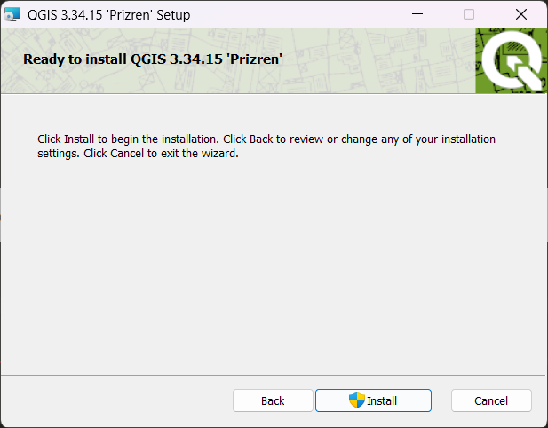

--- 
title: "Основы геоинформатики: практикум в QGIS"
author: "Андрей Энтин, Тимофей Самсонов, Андрей Карпачевский"
date: "`r Sys.Date()`"
site: bookdown::bookdown_site
documentclass: book
bibliography: [book.bib, packages.bib]
biblio-style: apalike
link-citations: yes
description: "Основы геоинформатики: практикум в QGIS"
colorlinks: true
github-repo: aentin/qgis-course
fontsize: 12pt
mainfont: PT Serif
toc_float:
  collapse: section
  smooth_scroll: true
apple-touch-icon: images/apple-touch-icon.png
apple-touch-icon-size: 120
favicon: images/favicon.ico
---

# Общие сведения {-}

Практикум предназначен для курса «Основы геоинформатики» для студентов 2 года обучения географического факультета МГУ имени М.В. Ломоносова. Упражнения выполяются в свободно распространяемом ГИС-пакете [QGIS](https://www.qgis.org/ru/site/forusers/download.html).

> Если вы ищете практикум на основе __ArcGIS__, то он находится [__тут__](https://tsamsonov.github.io/arcgis-course/).

## Учебные материалы {-}

- __Презентации__: Самсонов Т. Е. Основы геоинформатики: курс лекций для студентов географического факультета МГУ, 2023. [__Website__](https://tsamsonov.github.io/gis-course/)

- __Учебное пособие__: Лурье И. К., Самсонов Т. Е. _Информатика с основами геоинформатики. Часть 2. Основы геоинформатики. Учебное пособие._ Москва. Изд-во МГУ, 2016. [__PDF__](https://github.com/aentin/qgis-course/raw/master/files/%D0%9F%D0%BE%D1%81%D0%BE%D0%B1%D0%B8%D0%B5.pdf)

- __Учебник__: Лурье И. К. _Геоинформационное картографирование. Методы геоинформатики и цифровой обработки космических снимков: Учебник для вузов._ 2-е изд. – М.: КДУ, 2010. [__DJVU__](https://github.com/aentin/qgis-course/raw/master/files/%D0%9B%D1%83%D1%80%D1%8C%D0%B5_%D0%93%D0%B5%D0%BE%D0%B8%D0%BD%D1%84%D0%BE%D1%80%D0%BC%D0%B0%D1%86%D0%B8%D0%BE%D0%BD%D0%BD%D0%BE%D0%B5%D0%9A%D0%B0%D1%80%D1%82%D0%BE%D0%B3%D1%80%D0%B0%D1%84%D0%B8%D1%80%D0%BE%D0%B2%D0%B0%D0%BD%D0%B8%D0%B5.djvu)

- __Практикум в QGIS__: Энтин А. Л., Самсонов Т. Е., Карпачевский А.М. _Основы геоинформатики: практикум в QGIS_. [__Website__](https://aentin.github.io/qgis-course/)

- __Практикум в ArcGIS__: Самсонов Т. Е. _Основы геоинформатики: практикум в ArcGIS_. — Географический факультет МГУ Москва, 2018. — 460 с. DOI: 10.5281/zenodo.1167857. [__Website__](https://tsamsonov.github.io/arcgis-course/)

## Программное обеспечение для работы {-}

Для работы вам потребуется скачать и установить на свои компьютеры геоинформационное приложение QGIS. Это свободно распространяемое программное обеспечение, для его установки не требуется покупка или регистрация. 

### Windows {-}

Скачайте с [официального сайта](https://qgis.org/ru/site/forusers/download.html) последнюю версию QGIS. По состоянию на 7 февраля 2025 г. это версия 3.34. Если у вас возникнут трудности с загрузкой с официального сайта, воспользуйтесь прямой ссылкой: [https://download.osgeo.org/qgis/windows/QGIS-OSGeo4W-3.34.15-1.msi](https://download.osgeo.org/qgis/windows/QGIS-OSGeo4W-3.34.15-1.msi).

Если на вашем компьютере уже установлена более старая версия QGIS, удалите её перед началом установки новой версии. Вы можете использовать старую версию QGIS для выполнения большинства заданий практикума, однако, если у вас возникнут технические проблемы, 

Когда исполняемый файл загрузится, запустите его. Если потребуется, разрешите приложению вносить изменения на вашем устройстве. 

Будет показано приветственное окно мастера установки. 

Нажмите «Далее» (Next), чтобы перейти на следующий шаг.

На следующем шаге будет показано лицензионное соглашение QGIS и другого программного обеспечения, входящего в пакет поставки. Установите галочку напротив опции «Я принимаю условия лицензионного соглашения» (I accept the terms in the License Agreement) и нажмите «Далее» (Next).

На следующем шаге выберите папку для установки и отметьте, нужно ли создавать ярлыки на рабочем столе и в меню «Пуск». По возможности используйте параметры, предлагаемые по умолчанию.

На следующем шаге предлагается запустить процедуру установки. Нажмите «Install». Когда система выдаст запрос на внесение изменений, примите его.

Дождитесь окончания установки.

Когда установка будет завершена, нажмите Finish

Вы можете запустить QGIS одним из следующих способов:

* с помощью ярлыка *QGIS Desktop 3.34.15* из папки `QGIS Desktop 3.34.15` на рабочем столе;
* с помощью ярлыка приложения *QGIS Desktop 3.28.3* в меню «Пуск»

### macOS {-}

Скачайте с [официального сайта](https://qgis.org/ru/site/forusers/download.html) образ диска QGIS последней вышедшей версии. По состоянию на 7 февраля 2025 г. это версия 3.34.15. Если у вас возникнут трудности с загрузкой с официального сайта, воспользуйтесь прямой ссылкой:  [https://download.osgeo.org/qgis/mac/qgis-macos-ltr.dmg](https://download.osgeo.org/qgis/mac/qgis-macos-ltr.dmg).

После того как образ загрузится, запустите его. В открывшемся окне нажмите кнопку «Agree», чтобы принять условия лицензионного соглашения.

Дождитесь, пока нужные файлы будут распакованы.

По окончании распаковки появится окно, в котором нужно будет перетащить значок QGIS в папку «Приложения» (*Applications*).

Перетащите значок QGIS в папку «Приложения» (*Applications*). Это запустит процесс установки.

Дождитесь, пока компьютер выполнит необходимые действия.

Запустите приложение QGIS, чтобы убедиться в его работоспособности. Если установка выполнена корректно, откроется главное окно приложения.

При первом запуске может потребоваться разрешение на использование приложений от сторонних разработчиков. В этом случае откройте настройки и включите соответствующую опцию.

По окончании установки можно размонтировать («извлечь») образ диска QGIS.

### Linux {-}

Воспользуйтесь инструкциями по [этой ссылке](https://qgis.org/ru/site/forusers/alldownloads.html#linux).

Дополнительную информацию по установке можно найти на [https://qgis.org/ru/site/forusers/download.html](https://qgis.org/ru/site/forusers/download.html).

<!-- Сдавать отчёты и домашние работы мы будем через [Google Classroom](https://classroom.google.com). Для того, чтобы присоединиться к курсу, нужно: -->

<!-- 1. Зарегистрировать аккаунт Google. Для этого не обязательно создавать почтовый ящик в Google Mail, можно воспользоваться любой имеющейся почтой. -->
<!-- 2. Зайти на главную страницу Google Classroom (https://classroom.google.com) -->
<!-- 3. Присоединиться к курсу по коду **`glb5hvb`**. -->

<!-- Практиум находится в разработке, поэтому вы неизбежно столкнётесь с ошибками в данных, процедурах и текстах упражнений. О любых найденных ошибках, опечатках и выявленных проблемах с программным обеспечением прошу немедленно сообщать преподавателю одним из следующих способов: через систему учёта ошибок GitHub (Issues), через Classroom, по [электронной почте](mailto:aentin@geogr.msu.ru). -->

<!-- *Сейчас практикум доступен только в формате HTML, возможность его использования в других форматах (PDF, EPUB) будет реализована позже.* -->

<!-- **Перед выполнением практикума необходимо внимательно ознакомиться с регламентом и тщательно придерживаться его при выполнении заданий.** -->

<!-- ## Регламент{-} -->

<!-- Вы можете выполнять упражнения как на своих личных компьютерах, так и на стационарных компьютерах, которые имеются в аудитории 1903. Если вы пользуетесь личным компьютером, рекомендую создать папку `GIS` в корне одного из дисков и помещать материалы упражнений туда. Если вы работаете на компьютерах в 1903, соблюдайте следующие требования: -->

<!-- - __Ваша личная рабочая директория должна иметь адрес__ -->

<!--     `D:\GIS\<ваша кафедра>\<фамилия>` -->

<!--     Например, студент 207 группы Петров хранит результаты своей работы в каталоге `D:\GIS\207_CAR\Petrov`. Если в группе есть несколько человек с одинаковой фамилией, добавляйте к фамилии первые буквы имени и отчества, например: `D:\GIS\207_CAR\PetrovIS` -->

<!-- - __Каждое задание вы начинаете с того, что копируете соответствующую папку в свою директорию на локальном диске D.__ -->

<!--     Исходные данные для выполнения упражнений размещаются в виде файлового архива в Google Classroom. Вы скачиваете этот архив и распаковываете его в свою директорию -->

<!-- - __Отчётные файлы по упражнениям сдаются только через Classroom.__ -->
