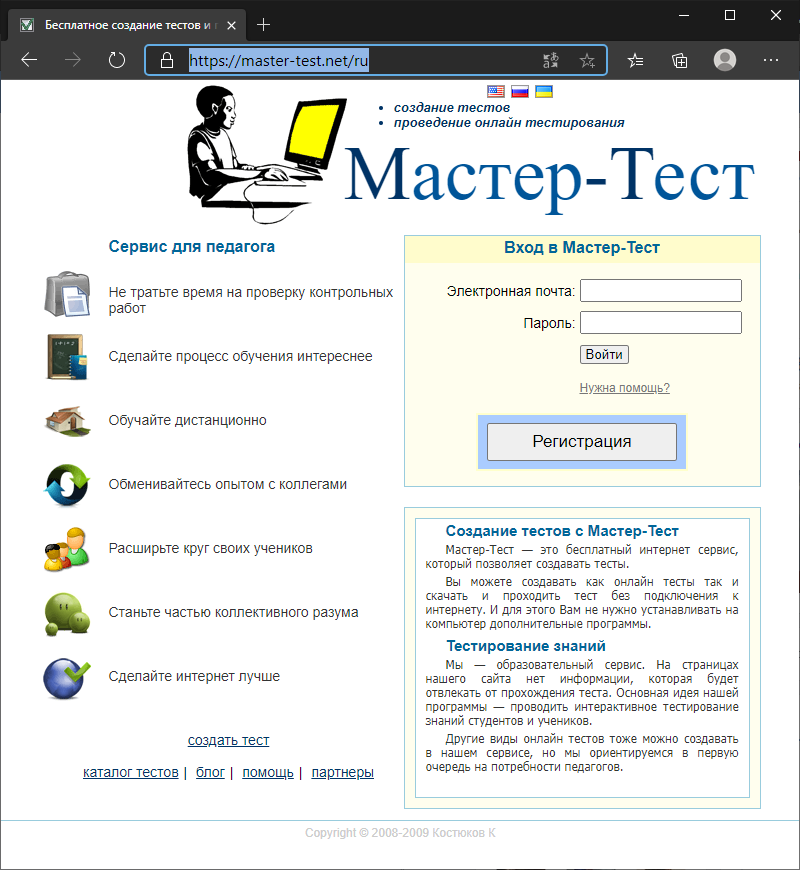
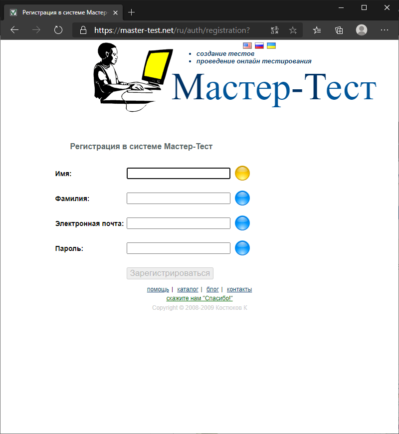
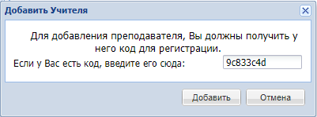
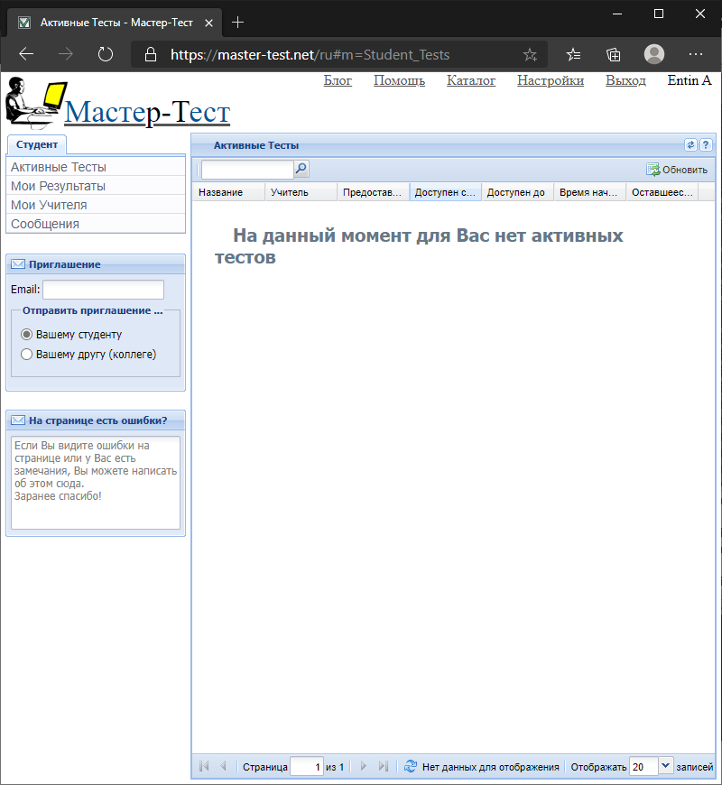

Инструкция
==========

1. Зайдите на сайт [Мастер-Тест](https://master-test.net/ru)

    

2. Нажмите кнопку «Регистрация»

3. Введите ваше имя и фамилию, а также адрес электронной почты. Придумайте пароль.

    

4. На указанный e-mail придёт сообщение с кодом. Введите его в поле «Код»:

    

5. После регистрации в системе перейдите на главную страницу

6. На главной странице укажите, что вы регистрируетесь как студент, и выберите часовой пояс, соответствующий вашему местоположению. Нажмите «Продолжить»

    

7. Перейдите на вкладку «Мои учителя» и нажмите кнопку «Добавить учителя» в верхней строке.

    

8. В появившемся окне введите код `9c833c4d` и нажмите «Добавить»

    

9. Доступные вам тесты будут отображаться на вкладке «Активные тесты».

    

