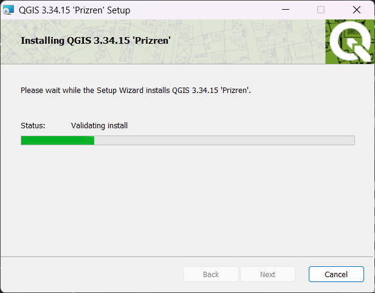
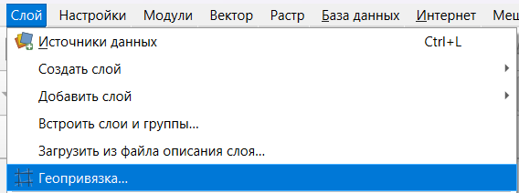

--- 
title: "Основы геоинформатики: практикум в QGIS"
author: "Андрей Энтин, Тимофей Самсонов"
date: "`r Sys.Date()`"
site: bookdown::bookdown_site
documentclass: book
bibliography: [book.bib, packages.bib]
biblio-style: apalike
link-citations: yes
description: "Основы геоинформатики: практикум в QGIS"
colorlinks: true
github-repo: aentin/qgis-course
fontsize: 12pt
mainfont: PT Serif
toc_float:
  collapse: section
  smooth_scroll: true
apple-touch-icon: images/apple-touch-icon.png
apple-touch-icon-size: 120
favicon: images/favicon.ico
---

# Общие сведения {-}

<!-- Вторая пересдача по курсу «Основы геоинформатики» назначена на пятницу 11 сентября, 17:00 по московскому времени. Зачёт будет проведён в форме устного собеседования в дистанционном режиме на платформе Zoom: [ссылка](https://us02web.zoom.us/j/87114028549?pwd=OEVacURRTXYrMkZLbTNoWkdvRExrQT09) -->

<!-- Учебные материалы и вопросы для подготовки размещены на странице ниже.  -->

<!-- Обращаем ваше внимание, что для получения зачёта необходимо выполнить все практические работы. Преподаватели, которые вели у вас практические занятия в весеннем семестре, больше не будут принимать отчёты о практических работах. Вместо них отчёты следует направлять инженеру кафедры картографии А.Л. Энтину на электронную почту [aentin@geogr.msu.ru](mailto:aentin@geogr.msu.ru), в теме письма обязательно указывайте "основы геоинформатики", а также вашу фамилию. -->


> Если вы ищете практикум на основе __ArcGIS__, то он находится [__тут__](https://tsamsonov.github.io/arcgis-course/).

## Учебные материалы {-}

- __Учебник__: Лурье И. К. _Геоинформационное картографирование. Методы геоинформатики и цифровой обработки космических снимков: Учебник для вузов._ 2-е изд. – М.: КДУ, 2010. [__PDF__](https://istina.msu.ru/download/295728157/1jUpeD:roxrGk69x0LxZCpC5w_KNV0o390/)

- __Пособие__: Лурье И. К., Самсонов Т. Е. _Информатика с основами геоинформатики. Часть 2. Основы геоинформатики. Учебное пособие._ Москва. Изд-во МГУ, 2016. [__PDF__](https://istina.msu.ru/download/45821659/1ej66u:uSUtcUS-XmdMMyRRpC-yflDmCv8/)

- __Практикум в ArcGIS__: Самсонов Т. Е. _Основы геоинформатики: практикум в ArcGIS_. — Географический факультет МГУ Москва, 2018. — 460 с. DOI: 10.5281/zenodo.1167857. [__Website__](https://tsamsonov.github.io/arcgis-course/)

- __Практикум в QGIS__: Энтин А. Л., Самсонов Т. Е. _Основы геоинформатики: практикум в QGIS_. [__Website__](https://aentin.github.io/qgis-course/)

- __Презентации__:
  - *Фундаментальные понятия геоинформатики*: [__PDF__](https://www.dropbox.com/s/skfry975yev660o/GIS_Models_Referencing.pdf?dl=0)
  - *Географическая информация*: [__PDF__](https://www.dropbox.com/s/15x9c5a1zkk34ep/GIS_Information_Economics.pdf?dl=0)
  - *Программное обеспечение ГИС (17 апреля)*: [__PPT__](https://1drv.ms/p/s!AmtmZDq3JgxHgZYyWa7tCh6cnSncZg?e=4uXt7L)
  - *Обзор программных средств ГИС (17 апреля)*: [__PPT__](https://1drv.ms/b/s!AmtmZDq3JgxHgZYzXaJpig-PVM3g0A?e=XrTnyu)
  - *Технологии пространственного моделирования (20 марта, 27 марта)*: [__PPT__](https://1drv.ms/p/s!AmtmZDq3JgxHgZUH2LWFrSxmy9FnEw?e=NGpBCU)
  - *Основные этапы развития ГИС. Типы ГИС (10 апреля)*: [__PPT__](https://1drv.ms/p/s!AmtmZDq3JgxHgZYTeyK01FEjAt-08w?e=IXMy3D)
  - *Проектирование ГИС. Разработка ГИС-проекта (10 апреля)*: [__PPT__](https://1drv.ms/p/s!AmtmZDq3JgxHgZYS0k69BhHwrTxFzw?e=VL6xWU)
  - *Обзорная лекция (24 апреля)*: [__PPT__](https://1drv.ms/p/s!AmtmZDq3JgxHgZY1r1o6Vj4-J7ohlA?e=o6796y)

<!-- ## Программа зачета {-} -->

<!-- Для подготовки к зачету следует использовать перечень вопросов, представленный ниже. Данный перечень можно также [__просмотреть__](https://docs.google.com/spreadsheets/d/1XkEj_3ciispGcWGvSMhCuWBQhmZfvw0JpKXH3_YZemM/edit?usp=sharing) непосредственно в _Google Docs_ или [__скачать__](https://docs.google.com/spreadsheets/d/e/2PACX-1vQxLnmOdaCMSpLT-TL9t0F97mzlP-v8njteOoVm1NOijWYle9YQiv8ELWGmehVFNDyesQDyF9TPy63-/pub?output=xlsx) в формате _Microsoft Excel_. -->

<!-- ```{r, out.width = "690px", echo=FALSE} -->
<!-- # tab = googlesheets4::read_sheet("https://docs.google.com/spreadsheets/d/1XkEj_3ciispGcWGvSMhCuWBQhmZfvw0JpKXH3_YZemM/edit?usp=sharing") -->
<!-- knitr::include_url('https://docs.google.com/spreadsheets/d/e/2PACX-1vQxLnmOdaCMSpLT-TL9t0F97mzlP-v8njteOoVm1NOijWYle9YQiv8ELWGmehVFNDyesQDyF9TPy63-/pubhtml?gid=0&amp;single=true&amp;widget=true&amp;headers=false', height = '1938px') -->
<!-- ``` -->
<!-- Темы для подготовки составлены И. К. Лурье (лектор) и Т. Е. Самсоновым. -->

<!-- Темы занятия: -->

<!-- 1. Задачи пространственного моделирования -->
<!-- 2. Способы моделирования -->
<!-- 3. Подготовка исходных данных для создания модели -->
<!-- 4. Методы интерполяции -->
<!-- 5. Геостатистическая интерполяция и кригинг -->
<!-- 2. Сопоставление методов -->
<!-- 3. Применение пространственных моделей -->


## Программное обеспечение для работы {-}

Для работы вам потребуется скачать и установить на свои компьютеры геоинформационное приложение QGIS. Это свободно распространяемое программное обеспечение, для его установки не требуется покупка или регистрация. 

### Windows {-}

Скачайте с официального сайта последнюю стабильную версию QGIS (3.10). Выберите версию в зависимости от разрядности вашей системы: [64 bit](https://qgis.org/downloads/QGIS-OSGeo4W-3.10.3-3-Setup-x86_64.exe), [32 bit](https://qgis.org/downloads/QGIS-OSGeo4W-3.10.3-3-Setup-x86.exe).

Когда исполняемый файл загрузится, запустите его. Если потребуется, разрешите приложению вносить изменения на вашем устройстве. 

Будет показано приветственное окно мастера установки.


Нажмите «Далее», чтобы перейти на следующий шаг

На следующем шаге будет показано лицензионное соглашение QGIS и другого программного обеспечения, входящего в пакет поставки.


Нажмите «Принимаю».

На следующем шаге выберите папку для установки. По возможности используйте расположение, предлагаемое по умолчанию.


На следующем шаге предлагается выбрать дополнительные компоненты для установки. Снимите все флажки, кроме QGIS, и нажмите «Установить»


После окончания установки ярлыки QGIS будут добавлены в меню "Пуск" и в отдельную папку QGIS на рабочем столе.



### macOS {-}

По состоянию на `r Sys.Date()` для прохождения практикума рекомендуется использовать альтернативную сборку версии [3.4.12](https://www.kyngchaos.com/files/software/qgis/QGIS-macOS-3.4.12-1.dmg). Перейдя по ссылке, необходимо согласиться сохранить образ установочного диска  на компьютер (можно разрешить его сразу открыть средствами _DiskImageMounter_):


После того как образ загрузится и будет открыт, необходимо последовательно запустить три установщика, выделенные на снимке экрана ниже (именно в том порядке, в котором они пронумерованы!):


Установщики __GDAL Complete__ и __QGIS 3 LTR__ необходимо запускать через контекстное меню и выбирать пункт "Открыть":


В появившемся диалоговом окне необходимо нажать "Открыть", чтобы разрешить установку:


Все опции при установке каждой компоненты приложения оставляйте по умолчанию, ничего не меняйте и нажимайте в диалоговых окнах "Продолжить", пока не запустится установщик.

После того как последняя компонента — __QGIS__ — будет установлена, вы сможете найти приложение и запустить его из каталога _Программы_ macOS:


### Linux {-}

Воспользуйтесь инструкциями по [этой ссылке](https://qgis.org/ru/site/forusers/alldownloads.html#linux).

Дополнительную информацию по установке можно найти на [https://qgis.org/ru/site/forusers/download.html](https://qgis.org/ru/site/forusers/download.html).

<!-- # Введение{-} -->

<!-- Практикум разрабатывается для студентов кафедры картографии и геоинформатики географического факультета МГУ имени М.В. Ломоносова. Упражнения выполяются в свободно распространяемом ГИС-пакете [QGIS](https://www.qgis.org/ru/site/forusers/download.html). На занятиях вы можете пользоваться стационарными компьютерами в аудитории 1903, а для выполнения домашних работ вам нужно будет установить QGIS на ваши личные машины. -->

<!-- Сдавать отчёты и домашние работы мы будем через [Google Classroom](https://classroom.google.com). Для того, чтобы присоединиться к курсу, нужно: -->

<!-- 1. Зарегистрировать аккаунт Google. Для этого не обязательно создавать почтовый ящик в Google Mail, можно воспользоваться любой имеющейся почтой. -->
<!-- 2. Зайти на главную страницу Google Classroom (https://classroom.google.com) -->
<!-- 3. Присоединиться к курсу по коду **`glb5hvb`**. -->

<!-- Практиум находится в разработке, поэтому вы неизбежно столкнётесь с ошибками в данных, процедурах и текстах упражнений. О любых найденных ошибках, опечатках и выявленных проблемах с программным обеспечением прошу немедленно сообщать преподавателю одним из следующих способов: через систему учёта ошибок GitHub (Issues), через Classroom, по [электронной почте](mailto:aentin@geogr.msu.ru). -->

<!-- *Сейчас практикум доступен только в формате HTML, возможность его использования в других форматах (PDF, EPUB) будет реализована позже.* -->

<!-- **Перед выполнением практикума необходимо внимательно ознакомиться с регламентом и тщательно придерживаться его при выполнении заданий.** -->

<!-- ## Регламент{-} -->

<!-- Вы можете выполнять упражнения как на своих личных компьютерах, так и на стационарных компьютерах, которые имеются в аудитории 1903. Если вы пользуетесь личным компьютером, рекомендую создать папку `GIS` в корне одного из дисков и помещать материалы упражнений туда. Если вы работаете на компьютерах в 1903, соблюдайте следующие требования: -->

<!-- - __Ваша личная рабочая директория должна иметь адрес__ -->

<!--     `D:\GIS\<ваша кафедра>\<фамилия>` -->

<!--     Например, студент 207 группы Петров хранит результаты своей работы в каталоге `D:\GIS\207_CAR\Petrov`. Если в группе есть несколько человек с одинаковой фамилией, добавляйте к фамилии первые буквы имени и отчества, например: `D:\GIS\207_CAR\PetrovIS` -->

<!-- - __Каждое задание вы начинаете с того, что копируете соответствующую папку в свою директорию на локальном диске D.__ -->

<!--     Исходные данные для выполнения упражнений размещаются в виде файлового архива в Google Classroom. Вы скачиваете этот архив и распаковываете его в свою директорию -->

<!-- - __Отчётные файлы по упражнениям сдаются только через Classroom.__ -->

<!--chapter:end:index.Rmd-->

# (PART) Основы работы с QGIS {-}

# Создание общегеографической карты {#map-design-general}

[Архив с данными и файлом отчёта](https://1drv.ms/u/s!AmtmZDq3JgxHgZUGIl2IXikh_JmrhA?e=NdRmIe)

## Введение {#map-design-general-intro}

**Цель задания** — знакомство с моделями пространственных объектов и базой пространственных данных. Визуализация данных на карте. Оформление легенды и компоновки карты.

**Необходимая теоретическая подготовка:** модели пространственных данных, модели пространственных объектов, базы пространственных объектов, картографические проекции.

**Необходимая практическая подготовка:** практическая подготовка не требуется.

**Исходные данные:** база географических данных на территорию Кавказских гор, собранная из нескольких источников.

**Ожидаемый результат:** общегеографическая карта гор Кавказа и прилегающих территорий масштаба 1:4 500 000.

### Контольный лист {#map-design-general-checklist}

* Добавить на карту источники пространственных данных и настроить их оформление
* Настроить подписи объектов
* Создать компоновку карты и легенду
* Экспортировать результат в графический файл

<!-- ### Аннотация {#map-design-general-annotation}

Задание посвящено знакомству с созданием тематических карт на основе баз пространственных данных. Вы познакомитесь с представлением площадных, линейных, точечных объектов в базе пространственных данных. Научитесь создавать карты на их основе, оформлять легенду, сетку координат и зарамочные элементы карты. -->

## Начало работы {#map-design-general-begin}
[В начало упражнения ⇡](#map-design-general)

1. Скачайте архив с исходными данными для упражнения и распакуйте его в свою рабочую директорию.

1. Запустите **QGIS**. Для запуска воспользуйтесь иконкой с названием **`QGIS Desktop [...] with GRASS [...]`**.

2. Найдите **панель менеджера источников данных**  и откройте **Менеджер источников данных**.

3. В менеджере источников данных в режиме браузера найдите вашу рабочую директорию, а в ней — каталог `Ex01_GeneralMap\raster_data`. В этом каталоге отображается единственный источник данных — `30n030e_20101117_gmted_mea075.tif`. Иконка  и расширение `\*.tif` (Tagged Image Tile Format) подсказывают вам, что этот источник представляет пространственные данные в растровой (регулярно-сеточной) модели.   

    > Замечание 1: растр, с которым вы будете работать сейчас, сохранён в формате [GeoTIFF](https://www.opengeospatial.org/standards/geotiff). От «обычного» TIFF этот формат отличается тем, что сведения о пространственной привязке в GeoTIFF записываются непосредственно в файл с данными, в то время как «обычный» формат TIFF не поддерживает запись сведений о пространственной привязке, поэтому она хранится отдельно — в [world-файле](https://en.wikipedia.org/wiki/World_file). В дальнейшем вы часто будете работать и с тем, и с другим способом хранения пространственных данных.

    > Замечание 2: файл `30n030e_20101117_gmted_mea075.tif` является фрагментом («тайлом») глобальной цифровой модели рельефа (ЦМР) [GMTED2010](https://www.usgs.gov/land-resources/eros/coastal-changes-and-impacts/gmted2010). Этот источник часто используется для геоинформационного анализа и картографирования. Загрузить тайлы GMTED2010 можно через сервис [EarthExplorer](https://earthexplorer.usgs.gov/) геологической службы США.

3. Дважды щёлкните левой кнопкой мыши на название файла `30n030e_20101117_gmted_mea075.tif` в менеджере источников данных. В панель слоёв (по умолчанию слева) добавится слой с названием `30n030e_20101117_gmted_mea075`.

4. Сохраните проект QGIS в папку с материалами упражнения (на том же иерархическом уровне, где находятся . Назовите его по шаблону `<Ex01_%Фамилия%>`, где `%Фамилия%` —  ваша фамилия латинскими буквами. 

<kbd>**Снимок экрана №1.** Окно QGIS после загрузки набора данных</kbd>

> Примечание: файл проекта QGIS (\*.qgs, \*.qgz) и документ карты ArcGIS (\*.mxd) отличаются от тех файлов, с которыми вы работали ранее. В этих файлах не хранятся пространственные данные, а только ссылки на них и настройки их отображения (включая порядок слоёв, символику и подписи). Если вы перемещаете файл проекта относительно источников данных, ссылки «теряются». Поэтому важно правильно организовать структуру ГИС-проекта. В рамках нашего упражнения мы разместили файл проекта в директории более высокого уровня по отношению к тем директориям, где лежат данные. Теперь, если мы переместим всю папку Ex01 вместе со всем её содержимым, относительные пути от файла проекта до файлов данных не изменятся, и проект сохранит работоспособность. Разумеется, такое простое решение не будет оптимальным для крупных организаций с разветвлённой структурой сетевых ресурсов, но для студенческих проектов оно, как правило, работает

## Настройка системы координат {#map-design-general-projection}
[В начало упражнения ⇡](#map-design-general)

В правом нижнем углу карты вы видите надпись . Нажмите на эту надпись, чтобы открыть интерфейс выбора системы координат проекта. 

В открывшемся окне вы видите более подробную информацию об используемой системе координат. Код `EPSG:4326` соответствует системе географических координат **WGS 84**. Термин «географическая система координат» (*geographic coordinate systems*) в ГИС означает, что координаты объектов и линейные параметры растров хранятся в виде широты и долготы. Альтернативный подход — проецированные системы координат (*projected coordinate systems*), где плановые координаты измеряются в метрических единицах.

Система координат проекта была импортирована из первого (в нашем случае — пока единственного) загруженного источника пространственных данных. Система координат WGS 84, как правило, не используется для картографирования, поэтому мы изменим систему координат проекта.

Для выбора проекции воспользуемся удобным инструментом, который позволяет оптимизировать этот процесс — [Projection Wizard](http://projectionwizard.org/).

1. Перейдите на сайт [Projection Wizard](http://projectionwizard.org/). Настройте параметры территории и проекции следующим образом:
    
    - класс проекции по виду искажений: **равнопромежуточная** (*Equidistant*);
    - охват территории картографирования: от 39° с.ш. до 46° с.ш., от 36° в.д. до 51° в.д.
    
    Если все сделано верно, то окно приложения должно принять приблизительно следующий вид:
    

    Вам будет предложено две проекции. **Нажмите на ссылку PROJ.4**, соответствующей **косой азимутальной** проекции. В верхней части экрана будет отображено всплывающее окно с параметрами выбранной проекции в формате [PROJ](https://proj.org/usage/quickstart.html).

    > Формат **PROJ** — один из трёх стандартных форматов описания систем координат, был предложен разработчиками библиотеки [PROJ](https://proj.org/), используемой для преобразования систем координат пространственных данных (отсюда и название формата). Часто этот формат называют также PROJ.4, поскольку он был введен в 4-й версии библиотеки PROJ. Другой формат — коды [**EPSG**](http://www.epsg-registry.org/) (удобный ресурс для поиска — [epsg.io](https://epsg.io/)), введённые в оборот для быстрого доступа к наиболее распространенным системам координат. Третий вариант — формат **Well-Known Text (WKT)**, который предоставляет наиболее полные возможности для описания параметров системы координат. Формат WKT является [международным стандартом](https://www.iso.org/standard/76496.html). Ознакомиться с его определением можно на [сайте](http://docs.opengeospatial.org/is/18-010r7/18-010r7.html) Open Geospatial Consortium.

2. Скопируйте строку PROJ в буфер обмена
   
    Также **вставьте скопированную строку в отчётный документ**

2. В QGIS откройте меню **Установки** — **Пользовательские проекции...**

3. Нажмите кнопку **Добавить новую проекцию**

4. В полях для ввода ниже введите название проекции: *Azimuthal Equidistant (Caucasus)*, в поле _Формат_ выберите тип *Proj String*, в поле _Параметры_ вставьте скопированную строку PROJ.

5. Нажмите **ОК**.

    Вы успешно добавили новую систему координат в пользовательский список. Теперь нужно применить её к проекту.

6. Откройте интерфейс выбора системы координат. Это можно сделать не только нажатием на элемент в правом нижнем углу, но и через меню **Проекты** — **Свойства...** (вкладка **Система координат**).

7. В открывшемся меню найдите в списке свою проекцию (для этого можно использовать поле "Фильтр" вверху окна), выберите её и нажмите **ОК**.

Если все сделано верно, изображение ЦМР должно приобрести форму сфероидической трапеции.

<kbd>**Снимок экрана №2.** Окно QGIS после изменения проекции</kbd>

Закройте интерфейс выбора системы координат и нажмите правой кнопкой на слой `30n030e_20101117_gmted_mea075` в таблице слоёв. В контекстном меню выберите **Свойства...** и в открывшемся окне перейдите на вкладку **Информация**. Вы видите, что проекция набора данных не изменилась. QGIS, как и большинство ГИС-пакетов, умеет трансформировать наборы данных для отображения их в целевой проекции. На жаргоне ГИС-специалистов это называется *«перепроецирование на лету» (reprojection on the fly)*. 

## Навигация по карте {#map-design-general-navigation}
[В начало упражнения ⇡](#map-design-general)

Чтобы иметь возможность рассмотреть территорию картографирования более детально, потребуется увеличить масштаб и переместить изображение. Изучите функциональные возможности инструментов навигациии, которые расположены на панели инструментов __Map Navigation__ (если панель отсутствует, щелкните на пустом поле среди панелей инструментов, и активируйте соответствующий пункт в меню): 


Некоторые инструменты навигации могут быть задействованы независимо. Например, масштабирование выполняется прокруткой колеса мыши, а перемещение по карте — движением мыши с зажатой средней кнопкой.

> Режим _панорамирования_ (перемещения карты) также активируется нажитием пробела. Зажмите пробел и просто двигайте курсор мышкой или тачпадом. Нажимать кнопку мыши или тачпад при этом не надо! 

После того как инструменты навигации станут понятны, установите масштаб карты равным $1:5~000~000$. Это можно сделать в элементе _Масштаб_ в нижней панели QGIS. При этом достаточно ввести только знаменатель масштаба, выделив его двойным кликом и заменив на нужное значение без пробела (`5000000`).

После этого переместите изображение таким образом, чтобы Кавказские горы занимали картографическое изображение целиком по ширине.

## Оформление рельефа {#map-design-general-relief}
[В начало упражнения ⇡](#map-design-general)

Изображение рельефа, которые вы видите, представляет собой так называемую аналитическую отмывку по высоте. Для аналитической отмывки используется шкала оттенков серого, применяемая по умолчанию. Мы будем использовать аналитическую отмывку по высоте вместе со светотеневой отмывкой.

1. Откройте свойства слоя `30n030e_20101117_gmted_mea075` и перейдите на вкладку **Стиль**.

2. Измените тип представления с *Одноканальное серое* на *Одноканальное псевдоцветное*.

3. Установите минимальное значение равным *0*, а максимальное значение — *4000*.

4. В строке выбора градиента нажмите правой кнопкой на шкалу и в открывшемся контекстном меню выберите опцию **Создать новый градиент**

5. В появившемся всплывающем окне в ниспадающем списке выберите тип градиента *Catalog: cpt-city* ([подробнее о cpt-city](http://soliton.vm.bytemark.co.uk/pub/cpt-city/))

6. В открывшемся каталоге в разделе *Topography* выберите градиент *c3t3* и нажмите **OK**

7. После нажатия OK были закрыты все окна, кроме окна свойств слоя `30n030e_20101117_gmted_mea075`. Нажмите **OK**, чтобы применить изменения символики и закрыть окно.

    Вы успешно применили аналитическую отмывку по высоте к цифровой модели рельефа. Но для красочного, визуально привлекательного изображения этого недостаточно. Помимо аналитической отмывки по высоте, мы создадим светотеневую отмывку.

8. Щёлкните правой кнопкой мыши по слою `30n030e_20101117_gmted_mea075` в таблице слоёв и в контекстном меню нажмите **Дублировать слой**.

    Дубликат слоя будет помещён в таблице слоёв ниже исходного слоя, выключен, а к его имени будет приписано "копия".

    > **Обратите внимание, что оба слоя используют один и тот же источник данных.** Вы можете сделать сколько угодно слоёв с разными настройками визуализации на базе одного и того же набора пространственных данных. Но если вы измените используемый набор пространственных данных, это повлечёт за собой автоматическое изменение вида слоёв (но не настроек их визуализации).

9. Используя контекстное меню или окно свойств слоя, переименуйте оба слоя. Нижний слой назовите *Аналитическая отмывка по высоте*, верхний — *Светотеневая отмывка*.

    *Названия слоёв никак не затрагивают источник пространственных данных. До тех пор, пока вам не приходится работать со слоями с помощью скриптов на языке Python, вы можете никак не ограничивать себя в названиях.*

10. Включите отображение нижнего слоя.

11. Откройте свойства слоя «Светотеневая отмывка», перейдите на вкладку «Стиль».

12. Измените способ визуализации на *Теневой рельеф* и нажмите **Применить**. При этом изменения будут применены, но окно свойств не закроется.

    На заднем плане вы видите изменения, произошедшие с вашим слоем. Во-первых, изображение светотеневой отмывки полностью закрыло изображение аналитической отмывки по высоте. Эту проблему можно решить, включив настройки прозрачности для слоя. Во-вторых, сама светотеневая отмывка выглядит очень тёмной. Это связано с несовпадением единиц измерения «по горизонтали» и «по вертикали» в исходном наборе данных: ячейки растра образут градусную сетку, а высотные отметки хранятся в метрах.   Проблему можно решить двумя путями: трансформировать слой в проецированную систему координат или применить коэффициент масштабирования по вертикали (*Z-factor*). Мы пойдём вторым путём и будем изменять значение коэффициента масштабирования.

    > Коэффициент масштабирования представляет собой переводной коэффициент из «вертикальных» единиц измерения в «горизонтальные». Для растров на градусной сетке, коэффициент, строго говоря, будет различным по широте и долготе в силу сближения меридианов. 

    **Рассчитайте коэффициент масштабирования по отношению к 1° долготы и 1° широты (на широте параллели касания проекции)**. После этого сверьтесь с результатом ниже:
    
```{r, echo = FALSE}
library(htmltools)

shiny::actionButton("show_table_button", 
                    label = "Показать Z-factor", 
                    onclick = "button_handler()")

div(id = "resultContainer", hidden = "true", HTML("0.000012"))
```

```{js, echo = FALSE}
function button_handler() {
  document.getElementById('resultContainer').hidden = false;
}
```

13. Помимо переводного коэффициента между единицами измерения, нам нужно дополнительно масштабировать высоты по вертикали, чтобы отмывка выглядела более «рельефно». В разных случаях применяется дополнительный множитель в диапазоне от 1,5 до 10, мы воспользуемся коэффициентом *5*.

14. Перемножьте оба коэффициента и введите полученное значение в качестве Z-фактора слоя.

15. Перейдите на вкладку **Прозрачность** и установите коэффициент непрозрачности для слоя равным 50 %. Примените изменения, закройте окно свойств слоя и сохраните проект.

<kbd>**Снимок экрана №3.** Изображение рельефа с высотной и светотеневой отмывкой</kbd>

> Настройки визуализации рельефа, которые применялись в этом упражнении, подобраны приблизительно, без предварительного анализа распределения высот картографируемой территории и выбора оптимальной шкалы. Эти вопросы подробно освещаются в курсах «Оформление карт» и «Общегеографическое картографирование», читаемых на кафедре картографии и геоинформатики

## Добавление векторных наборов данных {#map-design-general-vector}
[В начало упражнения ⇡](#map-design-general)

Откройте стыкуемое окно браузера и перейдите в директорию *Размещение по умолчанию для проекта*. Раскройте папку *vector_data*.

> Размещение по умолчанию для проекта — это директория, в которую был сохранён проект QGIS (*.qgz).


Вы видите несколько источников данных, обозначенных символом . Это векторные наборы данных, представленные в формате [шейп-файлов](https://desktop.arcgis.com/ru/arcmap/latest/manage-data/shapefiles/what-is-a-shapefile.htm).

Теперь откройте эту же директорию через Проводник Windows (или любой другой файловый менеджер). Сравните количество файлов в Проводнике с количеством доступных источников данных в браузере QGIS

> Шейп-файлы были базовым форматом ГИС-пакета ArcView и за счёт этого получили очень широкое распространение. Шейп-файлы не такие функциональные, как базы геоданных ESRI (современный базовый формат для продуктов линейки ArcGIS) или GeoPackage, но тем не менее их продолжают активно использовать. Многие особенности шейп-файлов обусловлены спецификой и возможностями компьютеров начала 90-х гг. В частности, геометрия набора данных хранится отдельно (в файле `.shp`), семантика — отдельно (в формате dBASE, `.dbf`), а для связи между ними используется индекс-файл (`.shx`). Эти три файла — обязательные компоненты шейп-файла. Помимо них, отдельно могут быть записаны сведения о проекции (`.prj`), кодировке (`.cpg`) и многое другое. Основным файлом, тем не менее, считается `.shp`, а все остальные на компьютерном сленге называются [*sidecar*-файлами](https://en.wikipedia.org/wiki/Sidecar_file). 

> **Важно:** при копировании шейп-файлов через Проводник необходимо копировать <kbd>все</kbd> файлы с одинаковым именем

1. Добавьте на карту наборы данных об объектах гидрографии (`hydrography-polyline.shp`, `hydrography-polygon.shp`). В таблице слоёв разместите линии над полигонами. Переименуйте слои в «Водотоки» и «Водоёмы» соответственно.

    > Все векторные наборы данных для этого упражнения созданы на основе [цифровых географических основ ВСЕГЕИ](http://www.vsegei.com/ru/info/topo/). Это один из немногих общедоступных источников пространственных данных общегеографического содержания на территорию нашей страны и ближнего зарубежья.

2. Настройте символику для добавленных векторных наборов данных. Также, как и для растров, настройки символики векторных данных помещаются в свойствах слоя, на вкладке **Стиль**.   

    - Для полигонов гидрографии установите стандартный стиль *topo water* из библиотеки QGIS.  
    - Для линейных объектов используйте стандартный стиль *simple blue line*, но уменьшите толщину линии до 0,26 мм

    > Если приглядеться, то можно увидеть, что знак контура береговой линии и знаки линейных объектов гидрографии на суше не совпадают. Можно изменить цвет и толщину обводки для полигонов объектов гидрографии, сделав их такими же, как у рек и каналов.

3. Добавьте к карте железные дороги и автодороги. Переименуйте слои и изобразите их линиями толщиной 0,26 мм. Для автодорог используйте красный цвет, для железных дорог — тёмно-серый (20 % светлоты).

## Использование атрибутов объектов при визуализации {#map-design-general-attributes}
[В начало упражнения ⇡](#map-design-general)

До этого момента мы работали только визуальным представлением слоя и никак не касались семантической составляющей. На следующем шаге вы будете использовать разные значки для различных типов объектов в одном слое.

1. Добавьте к карте набор данных `adm_line`, переместите добавленный слой ниже всех линейных объектов и переименуйте его в «Границы».

2. Вызовите контекстное меню слоя «Границы» и выберите опцию «Открыть таблицу атрибутов». Откроется таблица атрибутов источника данных.

    
    
    Таблица атрибутов — это представление базы данных, связанной с набором пространственных объектов. База функционирует по общим правилам реляционной базы данных: каждый объект представляется одной «строкой», в каждом столбце (поле) одному объекту соответствует одно значение. Атрибуты играют важную роль в геоинформационных системах. На их основе происходит визуализация данных, также они участвуют в большинстве операций пространственного анализа. В этом упражнении вы используете атрибуты, чтобы присвоить различные стили объектам в одном слое.
    
4. Закройте таблицу атрибутов или пристыкуйте к нижней части окна. Откройте свойства слоя на вкладке *Стиль*.

5. Измените тип визуализации с *Обычный знак* на *Уникальные значения*. Эта настройка позволяет присваивать объектам различные стили в соответствии со значениями определённого атрибута.

6. В выпадающем списке **Поле** выберите столбец `L_TYPE`, по которому будет происходить классификация, и нажмите кнопку **Классифицировать** внизу формы.

    В форму добавились три записи. Две из них представляют фактически имеющиеся значения атрибутов, третья — «пустая» — предназначена для визуализации всех остальных значений (которых фактически нет в таблице на настоящий момент, но которые могут появиться позже в результате редактирования)  

      
    
    <!-- Возможности автоматической настройки визуализации у QGIS пока невелики по сравнению с ArcGIS или MapInfo. Например, сейчас нашим классам присвоены стили в виде линий, у которых совпадают все параметры, кроме цвета. По-другому QGIS (пока) не умеет .   -->

    <!-- Наша задача — создать разные условные знаки для разных типов границ -->
    
7. Дважды щёлкните на значке, соответствующем классу *Границы государственные*. Откроется уже знакомый вам интерфейс настройки условных знаков. Обратите внимание на форму в левом верхнем углу: вы можете задать несколько слоёв для одного условного знака.

    > Разумеется, слои в таблице слоёв и слои условного знака — это две не связанные между собой сущности
    
8. Создайте для государственных границ двухслойный знак. Нижний слой: линия серого цвета (75 % светлоты) шириной 1 мм, с плоскими концами (чтобы концы линии не «свешивались» в воду). Верхний слой: линия тёмно-серого цвета (светлота 20 %) толщиной 0,26 мм, штрихпунктирная, с плоскими концами.

9. Создайте аналогичный знак для границ субъектов РФ. Нижний слой: линия серого цвета (75 % светлоты) шириной 0,8 мм, с плоскими концами. Верхний слой: линия тёмно-серого цвета (светлота 20 %) толщиной 0,26 мм, штриховая, с плоскими концами.

10. Для прочих границ используйте однослойный условный знак: пунктирная линия тёмно-серого цвета

**Сохраните проект.**

<!-- **Далее мы не будем напоминать вам о необходимости сохранять проект карты. Делайте это самостоятельно.** -->

## Подписи {#map-design-general-labels}
[В начало упражнения ⇡](#map-design-general)

1. Добавьте на карту набор данных `elevation_points.shp`, расположите слой на самом верху списка и переименуйте его в *Вершины*. Настройте отображение единым знаком в виде чёрного треугольника, аналогично тому, как высочайшие отметки показываются в школьных атласах.

2. Откройте таблицу атрибутов слоя. Какие поля можно использовать для подписей?

    > На общегеографических картах обычно приводятся высоты и названия горных вершин. В этом упражнении мы ограничимся названиями.

3. Закройте таблицу атрибутов и откройте свойства слоя. Перейдите на вкладку «Подписи». Переключите режим подписей на *Single labels* («Подписывать объекты значением атрибута»). В открывшемся меню в выпадающем списке «Подписывать значениями» выберите поле `NAME` — тексты подписей будут «считываться» из него. 

4. В поле **Text sample** отображается пример подписи с теми настройками, которые заданы по умолчанию. Если вы будете менять настройки подписей (шрифт, форматирование, «гало» и др.), этот пример будет меняться. Сейчас мы последовательно пройдём по вкладкам настройки подписей, исправив необходимые параметры.

    - На вкладке *Текст* установите гарнитуру («шрифт») Times New Roman, начертание («стиль») полужирный курсив, кегль («размер») 8.
    - На вкладке *Тень* включите опцию «Рисовать падающую тень». Это повысит читаемость подписей на карте.
    - На вкладке *Размещение* выберите опцию «Картографическое», расстояние 0,1 мм от границ символа (*from symbol bounds*)
    
    > Также с целью повышения читаемости подписей можно использовать обводку («Буфер») и фон (англ. *Background*, неправильно переведён как «История»).
    
    Примените настройки подписей и закройте свойства слоя
    
8. В каталоге `vector_data` остался незадействованный слой — `population_points`. Добавьте его в проект, переименуйте и самостоятельно настройте условные знаки и подписи. Используйте параметр *уникальные значения* для того, чтобы отобразить города с разной численностью населения разными условными знаками.

<kbd>**Снимок экрана №4.** Окно QGIS после завершения настройки символов</kbd>

**Сохраните проект.**

## Настройка компоновки карты {#map-design-general-layout}
[В начало упражнения ⇡](#map-design-general)

Изображение, которое вы видите во фрейме данных, можно экспортировать «как есть» (с помощью опции **Проекты — Импорт/экспорт — Экспортировать карту как изображение...**). Однако для картографических целей, как правило, формируется **компоновка карты**. На листе заданного формата размещается картографическое изображение, добавляется название, легенда, масштабная линейка и элементы зарамочного оформления. 

Сейчас мы создадим макет компоновки с расчётом на то, что итоговая карта будет вставлена в отчёт.

1. Создайте новый макет компоновки (**Проект — Создать Макет...**) или `Ctrl+P`. 

2. Введите название макета на своё усмотрение.

    После ввода названия откроется окно компоновки (*Layout*)  
    
    
4. Добавьте на лист картографическое изображение. Для этого используется инструмент **Добавить карту** из панели инструментов. Выберите инструмент и «растяните» прямоугольник карты на листе. 

5. После добавления элемента откроется панель его свойств. Изучите настройки, доступные в этой панели, а затем установите для карты знаменатель масштаба *4 000 000* и размеры $237\times130$ мм. В том же разделе, где устанавливаются размеры элемента, задайте для элемента карты положение по $X = 30$ мм и положение по $Y = 30$ мм.

    > Положение элемента на листе отсчитывается от верхнего левого угла листа до точки привязки элемента.
    
6. Добавьте к карте градусную сетку. Для этого в свойствах элемента найдите раздел **Сетки**, нажмите на кнопку *Добавить новую сетку*, а затем *Modify Grid*. Откроется меню настройки сетки. Задайте для сетки проекцию WGS84, интервал по долготе — $4°$, интервал по широте — $2°$. Также уменьшите толщину линий сетки до $0.1$ мм. Для этого щёлкните левой кнокой мыши по элементу *Стиль линии* и выполните необходимые настройки в уже привычном для вас интерфейсе. Вернуться обратно к настройкам сетки можно, нажав на кнопку *Назад* в левом верхнем углу интерфейса.

7. Добавьте рамку сетки в виде простой линии. Для этого в свойствах элемента активируйте раздел **Рамка**. 

8. Включите отображение подписей координатной сетки. Для этого в разделе **Сетки** выберите в списке созданную сетку, нажмите кнопку **Modify Grid...** и отметьте флажок *Draw Coordinates*. Настройте отображение подписей так, чтобы широта подписывалась только вдоль западной и восточной рамки, а долгота — только вдоль северной и южной. Используйте формат координат *Десятичные с окончанием* и нулевое число знаков после запятой (этот параметр в QGIS называется *Точность координат*).

8. Вернитесь к макету и передвиньте картографическое изображение внутри элемента таким образом, чтобы вместилась вся основная часть Главного Кавказского хребта. Можно ориентироваться на города: в северо-западном углу карты должен отображаться Краснодар, в юго-восточном — Баку.  

    > Для перемещения карты внутри фрейма используется инструмент **Перемещение содержимого элемента**.

5. Добавьте на лист название карты. Для этого **вставьте новую надпись** и разместите её над элементом карты. Введите название карты «Кавказские горы», используйте выключку (горизонтальное выравнивание) по центру, настройте параметры шрифта на своё усмотрение (заголовки обычно набираются прописными буквами с разреженным кернингом). 

7. Добавьте на лист масштабную линейку. Переместите линейку в юго-западный угол карты, установите для неё отображение фона и границы, исправьте обозначение единиц измерения. Уменьшите высоту линейки, кегль шрифта и отступы подписей, чтобы линейка смотрелась более компактно. 

8. Добавьте на лист легенду. Легенда будет собрана автоматически на основе тех настроек визуализации, которые применены для слоёв карты. 

9. Отредактируйте легенду. Для этого сначала выключите автообновление (*Auto update*) элементов легенды, чтобы сделать список элементов доступным для редактирования. Удалите из легенды те условные знаки, которые не встречаются на карте, и переименуйте неинформативные или пустые подписи.

10. Добавьте обводку для элемента легенды и разместите элемент в северо-восточном углу карты.

11. Добавьте ещё один текстовый элемент и впишите в него сведения об авторстве.

12. Экспортируйте получившуюся карту в изображение формата PNG («Макет» — «Экспорт в изображение...» или специальная кнопка на главной панели инструментов макета).

**Сохраните проект.**
    
----
_Энтин А.Л., Самсонов Т.Е._ **Основы геоинформатики: практикум в QGIS**. М.: Географический факультет МГУ, `r lubridate::year(Sys.Date())`.
----

<!--chapter:end:Ex01_MapGeneral.Rmd-->

# Создание политической карты мира {#map-design-world}

[Файл отчёта]()


## Введение {#map-design-world-intro}

**Цель задания** — закрепление навыков загрузки и визуализации данных в QGIS.

**Необходимая теоретическая подготовка:** модели пространственных данных, модели пространственных объектов, базы пространственных объектов, картографические проекции.

**Необходимая практическая подготовка:** не требуется.

**Исходные данные:** [Natural Earth](https://www.naturalearthdata.com/).

**Ожидаемый результат:** политическая карта мира М 1:130 000 000

### Контольный лист {#map-design-world-checklist}

* Добавить на карту источники пространственных данных
* Создать определение проекции
* Настроить отображение объектов на карте различными цветами в соответствии с данными в таблице атрибутов
* Скомпоновать картографическое изображение
* Экспортировать результат в графический файл

## Начало работы {#map-design-world-begin}
[В начало упражнения ⇡](#map-design-world)

Работа с пространственными данными обычно подразумевает одновременное использование множества файлов и баз данных, которые могут располагаться как на вашем локальном компьютере, так и в локальной сети или в Интернете. Хотя в реальной практике использования ГИС обычно применяется сетевое размещение ресурсов, в этом упражнении и далее в курсе геоинформатики вы, как правило, будете организовывать все ресурсы ваших ГИС-проекты в локальных директориях.

1. Создайте или выберите директорию (папку) для упражнений по геоинформатике на вашем рабочем компьютере. Например, для компьютеров под управлением ОС Windows: `D:\GIS\207_CAR\Ivanov`. Мы настоятельно рекомендуем, чтобы полный путь к рабочей директории не содержал символов русского алфавита, диакритики или других специальных символов.

2. В рабочей директории создайте папку для текущего упражнения, например, `Ex02`. Все данные, относящиеся к этому упражнению, будут находиться здесь.

3. В папке для текущего упражнения создайте ещё одну вложенную папку. Назовите её `data`. В эту папку вы будете помещать пространственные данные, которые получите на последующих этапах.

## Загрузка исходных данных {#map-design-world-input-data}
[В начало упражнения ⇡](#map-design-world)

Работа в ГИС — это в первую очередь работа с пространственными данными. Пространственные данные могут иметь различную форму представления, уровень детализации, назначение и лицензионные ограничения на использование. В этом упражнении мы воспользуемся данными ресурса [Natural Earth](https://www.naturalearthdata.com/). Это наборы пространственных данных низкой детализации, предназначенные для создания карт мелкого масштаба (1:10 000 000, 1:50 000 000, 1:110 000 000). Важно, что все данные находятся в свободном доступе — вы можете использовать их без ограничений как в учебных и научных задачах, так и в коммерческих проектах. Посмотрите вкладку *About*, чтобы узнать больше о Natural Earth.

1. Перейдите на страницу загрузок Natural Earth (https://www.naturalearthdata.com/downloads/). На этой странице перейдите в раздел Cultural, соответствующий самому мелкому масштабу.
    
    
    
2. Скачайте набор данных `Admin 0 – Countries`. На ваш компьютер будет загружен архив в формате [ZIP](https://pkware.cachefly.net/webdocs/casestudies/APPNOTE.TXT). Этот формат поддерживается большинством современных программ для архивирования и разархивирования файлов.

3. Распакуйте содержимое архива в папку `data`, созданную на предыдущем шаге. Сам архив можно удалить.

    Содержимое архива составляют пространственные данные в виде [шейп-файла ESRI](#manual-dataformats-shapefile), а также несколько сопроводительных файлов
    
    
    
    > Шейп-файлы были базовым форматом ГИС-пакета ArcView и за счёт этого получили очень широкое распространение. Шейп-файлы не такие функциональные, как базы геоданных ESRI (современный базовый формат для продуктов линейки ArcGIS) или GeoPackage, но тем не менее их продолжают активно использовать. Многие особенности шейп-файлов обусловлены спецификой и возможностями компьютеров начала 90-х гг. В частности, геометрия набора данных хранится отдельно (в файле `.shp`), семантика — отдельно (в формате [dBase](https://en.wikipedia.org/wiki/DBase), `.dbf`), а для быстрого поиска по пространственным данным используется индекс-файл (`.shx`). Эти три файла — обязательные компоненты шейп-файла. Помимо них, отдельно могут быть записаны сведения о проекции (`.prj`), кодировке (`.cpg`) и многое другое. Основным файлом, тем не менее, считается `.shp`, а все остальные на компьютерном сленге называются [*sidecar*-файлами](https://en.wikipedia.org/wiki/Sidecar_file). Все файлы в составе шейп-файла имеют одинаковые имена, но разные расширения.
    
4. Изучите содержимое папки после разархивирования. Удалите файлы, которые не входят в состав шейп-файла. Определите назначение остальных файлов.

## Создание ГИС-проекта и загрузка данных в проект {#map-design-world-qgis-project}
[В начало упражнения ⇡](#map-design-world)

1. Запустите QGIS.
    
    >Для запуска можно воспользоваться ярлыком QGIS Desktop <...> или QGIS Desktop <...> with GRASS <...>. Второй ярлык одновременно с QGIS запускает сессию GRASS, что позволяет задействовать инструменты GRASS изнутри QGIS. В этом упражнении вы не будете использовать инструменты GRASS, поэтому можно воспользоваться любым ярлыком для запуска.
    
2. Сохраните проект в папку с материалами текущего упражнения (в нашем примере — `Ex02`) под именем `Ex02_*Surname*` (вместо surname вставьте вашу фамилию в латинской транслитерации). Чтобы сохранить проект, воспользуйтесь опцией «Сохранить» из меню «Проект» или кнопкой  на панели инструментов проекта. Проект QGIS версии 3 имеет расширение `*.qgz`.

    >Для самопроверки: проект QGIS (файл `*.qgz`) должен располагаться в том же каталоге, что и папка `data`.

3. Откройте **Менеджер источников данных**. Это можно сделать из меню «Слой», с помощью кнопки  на специальной панели (которая так и называется — панель менеджера источников данных) или нажав комбинацию клавиш `Ctlr`+`L`. Откроется окно Менеджера источников данных

4. Если вы впервые пользуетесь QGIS, то окно Менеджера откроется на вкладке «Обозреватель», вид которого аналогичен проводнику файловой системы. Если Менеджер источников данных открылся на другой вкладке, перейдите на вкладку «Обозреватель»

5. Найдите в списке папок «Размещение по умолчанию для проекта» и раскройте его.


    
    «Размещение по умолчанию для проекта» — это каталог, в котором находится ваш файл проекта. Если бы мы не сохранили проект на предыдущем шаге, этого пункта в проводнике не было бы. Размещение по умолчанию облегчает доступ к файлам проекта, если вы поддерживаете структуру ГИС-проекта в порядке.
    
6. Разверните содержимое папки `data`. Сколько наборов пространственных данных находится в этой папке?

7. Добавьте набор `ne_110m_admin_0_countries.shp` в проект. Для этого дважды щёлкните по его названию левой клавишей мыши или воспользуйтесь опцией «Добавить слой в проект» из контекстного меню.

8. Закройте Менеджер источников данных. Окно QGIS примет вид, аналогичный представленному ниже.


    
9. Сохраните проект QGIS. 
    
<kbd>**Снимок экрана №1.** Окно QGIS после загрузки набора данных</kbd>

## Настройка системы координат проекта {#map-design-world-crs}
[В начало упражнения ⇡](#map-design-world)

В правом нижнем углу окна QGIS вы видите надпись . Нажмите на эту надпись, чтобы открыть интерфейс выбора системы координат проекта. 

  >Примечание: в тот же интерфейс можно попасть, выбрав «Проект» — «Свойства», и в открывшемся окне перейдя на вкладку «Система координат».

В открывшемся окне вы видите более подробную информацию об используемой системе координат. Код `EPSG:4326` соответствует системе географических координат **WGS 84**. Термин «географическая система координат» (*geographic coordinate systems*) в ГИС означает, что координаты объектов и линейные параметры растров хранятся в виде широты и долготы. Альтернативный подход — проецированные системы координат (*projected coordinate systems*), где плановые координаты измеряются в метрических единицах.

Система координат проекта была импортирована из первого (в нашем случае — пока единственного) загруженного источника пространственных данных. Система координат WGS 84, как правило, не используется для картографирования, поэтому мы изменим систему координат проекта. Поскольку проект предназначен для создания карты мира, мы выберем систему координат, использующую подходящую проекцию — например, [проекцию Робинсона](https://en.wikipedia.org/wiki/Robinson_projection)

1. В строке «Фильтр» в верхней части интерфейса выбора системы координат проекта начните вводить `robinson`, чтобы отфильтровать доступные системы координат по названию. Ниже, в блоке «Предустановленные системы координат», будет выведен список систем координат, в название которых входит введённая совокупность символов.


    
2. Выберите ту из систем координат, где в качестве вспомогательной поверхности используется эллипсоид вращения

    >Примечание: на карте общемирового охвата различия между системами координат, использующих одну проекцию, но разные геодезические даты (датумов), несущестенно. Но в общем случае использование разных геодезических дат (датумов) может приводить к изменению положений контуров на сотни метров.
    
3. Примените изменения и закройте окно свойств проекта

Сейчас ваша карта выглядит приблизительно так, как показано на иллюстрации ниже:


Это изображение уже больше похоже на «приличную» карту мира, но у него есть ряд заметных недостатков. Главный из них — разрыв вдоль 180-го меридиана, из-за которого Чукотка оказывается «оторванной» от основной территории Российской Федерации и переносится в северо-западный угол карты.

Чтобы избавиться от этого эффекта, мы изменим один из параметров системы координат — центральный меридиан проекции. Изменение центрального меридиана приведёт к тому, что картографическое изображение «сдвинется», как лента конвейера. В результате Чукотка окажется в восточной части карты и не будет оторвана от Евразии. Но сначала нам нужно определить, на какую величину нужно сдвинуть центральный меридиан.

4. Верните проекту исходную систему координат (`WGS 84`) и увеличьте изображение Берингова пролива. Обратите внимание, что воображаемые линии меридианов в некотором диапазоне не пересекают сушу


    
5. Подводя курсор узлам полигонов, ближайшим к «разрыву», определите диапазон долгот более точно, до десятых долей градуса.

6. В найденном диапазоне выберите меридиан, долгота которого будет кратна 0,5°

7. Теперь вычислите разность между 180° и найденной долготой. Это и будет искомое смещение центрального меридиана проекции. Запомните или запишите его.

8. Вернитесь в интерфейс выбора системы координат и снова выберите систему координат с проекцией Робинсона.

9. В блоке определений системы координат скопируйте описание системы координат в формате WKT. Копируйте строки, показанные ниже:

    

    Для удобства можете сохранить скопированные строки в отдельный текстовый файл
    
10. Закройте интерфейс выбора системы координат.

11. Откройте меню настройки новых систем координат («Установки» — «Пользовательские проекции...»).

12. Нажмите зелёную клавишу с изображением знака «+», чтобы начать добавление новой системы координат.

13. В строке «Параметр» введите имя для вашей новой системы координат. Для удобства дальнейшей работы имя должно быть коротким и информативным, например `Robinson_shift`. Можно также вписать в имя конкретное значение параметра, которое вы собираетесь изменить.

14. Убедитесь, что опция «Формат» установлена в значение `WKT (Recommended)`. Вы скопировали параметры системы координат в формате WKT, поэтому данная опция вам подходит.

15. В блок «Параметры» вставьте определение системы координат, скопированный ранее на шаге 9.

16. Измените параметры системы координат следующим образом:

  * Параметр *Longitude of natural origin*: вместо 0 установите значение, найденное на шаге 7. В качестве разделителя целой и дробной части используйте точку!
  * Параметр *ID* в самом конце списка: удалите запись ` ID["ESRI",54030]`, а также запятую, которая находится перед ней в строке выше. Обратите внимание, что удалить нужно только одну квадратную скобку — вторая относится к более крупному блоку описания! Если вы всё сделали правильно, описание системы координат будет оканчиваться **тремя** квадратными скобками.
  
17. Нажмите кнопку «Validate», чтобы проверить синтаксическую корректность введённого определения координат. Если система выдаст сообщеине «The WKT projection definition is valid», то вы всё сделали правильно. В противном случае вернитесь на шаг 15.

18. Если определение успешно прошло валидацию, нажмите ОК, чтобы сохранить введённые параметры. На этом этапе система также может выдать ошибку, если введённые параметры совпадают с определением, которое уже есть в базе. В этом случае вернитесь на шаг 16.

19. Теперь снова откройте окно выбора системы координат. Задайте проекту систему координат, которую вы только что ввели.

Увеличьте изображение так, чтобы видеть северо-восточную оконечность Евразии. Ваше изображение должно выглядеть аналогично показанному ниже:


Также обратите внимание на изображение Антарктиды. **Из-за смещения центрального меридиана этот континет отрисовывается с ошибками**, но в рамках данного упражнения мы их проигнорируем.

20. Отобразите набор данных в полном охвате (`Ctrl+Shift+F` или кнопка  на панели навигации) и сделайте снимок экрана.

<kbd>**Снимок экрана №2.** Окно QGIS после настройки системы координат</kbd>

Вы настроили систему координат проекта (проекцию для будущей карты). Теперь вы начнёте работать с визуализацией слоя государств.

## Окраска стран в разные цвета {#map-design-world-colorbrewer}
[В начало упражнения ⇡](#map-design-world)

1. Переименуйте слой `ne_110m_admin_0_countries`. Назовите его `Страны`.

2. Откройте таблицу атрибутов слоя `Страны`. Для этого нажмите правой кнопкой мыши на название слоя в таблице слоёв и выберите пункт «Открыть таблицу атрибутов».


Таблица атрибутов является представлением базы данных, сопоставленной набору пространственных данных. Каждый объект на карте имеет массу семантической (атрибутивной) информации. Например, в том наборе, который вы сейчас используете, есть названия стран на различных языках, текстовые характеристики уровня экономического развития и многое другое. Но сейчас нас интересуют столбцы с названием `MAPCOLOR`.

1. Изучите столбец `MAPCOLOR7`. Сколько различных уникальных значений присвоено объектам в полях этого столбца?

В настоящий момент все страны обозначены в окне проекта при помощи одного и того же условного знака. На политических картах различные территории обычно отображаются различными цветами, причём цвета могут повторяться. Столбец `MAPCOLOR7` (и соседние с ним столбцы) специально созданы разработчиками Natural Earth, чтобы закодировать отображение стран разными цветами. При этом цифры в столбце не означают какой-то конкретный цвет — это просто условные «коды», которыми ГИС-специалист может пользоваться для присвоения различных условных знаков. Мы изменим способ визуализации слоя таким образом, чтобы каждому уникальному значению поля `MAPCOLOR7` соответствовал свой цвет. Но сначала подберём нужную палитру цветов.

2. Перейдите на сайт [ColorBrewer](https://colorbrewer2.org/). Выясните, для чего он предназначен, каким функционалом обладает.

    >Примечание: ColorBrewer — это палитры цветов, широко применяемые в картографии и смежных задачах. Палитры ColorBrewer интегрированы в различное популярное программное обеспечение, в том числе в QGIS. Сайт [ColorBrewer](https://colorbrewer2.org/) предоставляет удобный интерфейс для выбора нужной палитры.
    
    
    
3. Подберите палитру, исходя из следующих соображений:
  
  * Число цветов: по числу уникальных значений в поле `MAPCOLOR7`;
  * Тип данных, к которым применяется палитра: качественные (*qualitative*);
  * Из доступных вариантов выберите палитру мягких, так называемых «пастельных» цветов.
  
4. Запомните или запишите название выбранной палитры. Сделайте снимок экрана.

<kbd>**Снимок экрана №3.** Окно браузера с выбранной палитрой ColorBrewer</kbd>
  
5. Вернитесь в QGIS. Откройте окно свойств слоя `Страны`. Для этого дважды щёлкните левой кнопкой мыши по названию слоя или нажмите на него правой кнопкой мыши, а в контекстном меню выберите «Свойства...»

6. Основная вкладка для настройки визуализации слоя — это вкладка «Оформление». Как видите, сейчас для слоя применён стиль «Обычный знак». Это значит, что все объекты слоя изображаются на карте при помощи одного и того же условного знака.


7. Измените способ визуализации с «Обычный знак» на «Уникальные значения». Внешний вид окна сильно изменится.

8. Ниже, в поле «Значение», выберите из выпадающего списка поле `MAPCOLOR7`. Мы возьмём значения из этого поля и каждому из них присвоим свой условный знак.

9. Найдите кнопку «Классифицировать» в нижней части окна и нажмите на неё. QGIS автоматически выберет все уникальные значения из столбца и присвоит им случайные цвета. Окно настройки примет вид, аналогичный этому:


Обратите внимание, что в таблице значений больше записей, чем уникальных значений в поле `MAPCOLOR7`. QGIS автоматически добавляет строку «*все другие значения*» на случай, если после редактирования слоя в столбец добавляют новые, не встречавшиеся ранее значения. Без специального знака «*все другие значения*» объекты с новыми значениями прост не будут отображаться на карте.

10. Примените изменения, закройте окно свойств слоя, сохраните проект и сделайте снимок экрана.

<kbd>**Снимок экрана №4.** Окно QGIS с визуализацией стран с помощью случайно заданных цветов</kbd>.

11. Вновь откройте окно свойст слоя на вкладке «Оформление».

12. В таблице значений удалите запись «*все другие значения*». Мы не будем редактировать слой, а значит, можем быть уверены, что никаких новых значений не появится.

13. Измените палитру цветов. Для этого щёлкните правой кнопкой мыши на выпадающем меню «Градиент» и выберите пункт «Создать новый градиент»


14. В открывшемся окне выберите тип градиента: «Каталог: ColorBrewer» и нажмите OK.

15. В новом открывшемся окне введите два параметра:

  * Имя схемы: название палитры, которое вы запомнили на шаге 4;
  * Цвета: необходимое число цветов
  
Выбранные настройки палитры будут автоматически применены к слою. Картографическое изображение примет вид, аналогичный представленному ниже:


16. Последний штрих к изображению стран — удаление обводки. На следующих шагах мы добавим другие слои, с помощью которых изобразим береговую линию и границы государств, поэтому обводка полигонов слоя государств будет нам только мешать. Чтобы удалить обводку, вернитесь в свойства слоя на вкладку «Оформление», нажмите на поле «Знак», выберите слой *Simple Fill* в перечне слоёв знака и установите для параметра «Стиль обводки» значение «Без обводки».


<kbd>**Снимок экрана №5.** Окно QGIS с визуализацией стран с помощью специально заданной палитры</kbd>.

## Добавление других слоёв на карту {#map-design-world-other-layers}
[В начало упражнения ⇡](#map-design-world)

1. Загрузите с сайта Natural Earth следующие наборы данных, соответствующие детальности вашей карты:
  
  * береговую линию (*Coastline*)
  * сухопутные границы (*Boundary Lines*)
  * Населённые пункты (*Populated Places*)
  
2. Распакуйте содержимое архивов в ту же директорию, где находится шейп-файл государств. Удалите лишние файлы.

3. Добавьте загруженные наборы данных в ваш проект QGIS. Переименуйте их следующим образом: «Береговая линия», «Границы», «Населённые пункты».

4. Расставьте слои в следующем порядке:

  * Населённые пункты
  * Береговая линия
  * Границы
  * Страны
  
5. Примените следующие настройки визуализации слоёв линейной геометрии

  * Береговая линия: линии синего цвета толщиной 0,26 мм
  * Границы государств: линии серого цвета толщиной 0,26 мм
  
  Самостоятельно изучите интерфейс настройки цвета в QGIS
  
6. Примените следующие настройки для слоя населённых пунктов: условный знак `city` из библиотеки QGIS, размер 1,2 мм.

7. Помимо добавленных слоёв, нам необходим слой для изображения океанов. К сожалению, из-за несовершенства QGIS вы не можете воспользоваться для этой цели набором данных с Natural Earth. Загрузите шейп-файл океанов по [этой ссылке](https://1drv.ms/u/s!AmtmZDq3JgxHgZswh2sFnErE-JEmGw?e=xoZW4c). Распакуйте шейп-файл в папку с другими шей-файлами и добавьте его в проект. 

8. Переименуйте добавленный слой в «Океан» и расположите его в самом низу таблицы слоёв.

9. Задайте для слоя «Океан» условный знак в виде заливки светло-голубого цвета без обводки.

10. Сохраните проект и сделайте снимок экрана.

<kbd>**Снимок экрана №6.** Окно QGIS с визуализацией стран с помощью специально заданной палитры</kbd>.

## Создание компоновки карты {#map-design-world-layout}
[В начало упражнения ⇡](#map-design-world)

Изображение, которое вы создали — ещё не карта. Нужно создать компоновку карты — разместить картографическое изображение на листе бумаги, добавить название, масштабную линейку и другие элементы зарамочного оформления. 

1. Создайте новый макет (`Ctrl+P` или «Проект» — «Создать макет...»). В небольшом диалоговом окне, появляющемся при создании макета, введите его название — свою фамилию на русском языке. Нажмите ОК.

2. На экране откроется отдельное окно настройки компоновки. В центре его — белый прямоугольник, имитирующий лист бумаги. Панели по краям экрана предназначены для добавления и настройки элементов макета.

3. Найдите и активируйте инструмент добавления карты к макету .

4. Продумайте, как будет расположена карта на вашем листе. Обязательно запланируйте отступ 2–2,5 см от края листа с каждой стороны.

5. Переместите курсор на лист в положение, соответствующее планируемому положению северо-западного угла карты.

6. Зажав левую кнопку мыши, ведите курсор к планируемому положению юго-восточного угла карты.


7. Пока элемент карты выбран, в правой части окна компоновки отображается панель свойств элемента. Найдите в нём раздел «Положение и размер» и установите размер карты равным 260×130 мм

8. В той же панели задайте знаменатель масштаба картографического изображения равным 130 000 000.

9. Пользуясь инструментом перемещения содержимого элемента (), измените положение изображения карты так, чтобы вписать её в рамки


10. Добавьте к макету текст и напишите в нём название карты. Подберите форму и размер шрифта. Расположите название над картой.

11. Добавьте к карте масштабную линейку.

12. Добавьте к карте текст и укажите в нём автора карты.

13. Экспортируйте изображение в формат PNG

<!--chapter:end:Ex02_MapWorld.Rmd-->

# Создание карты четвертичных отложений {#map-design-quaternary}

[Архив с данными и файлом отчёта](https://1drv.ms/u/s!AmtmZDq3JgxHgZUFCgDwGfEvocDIrw?e=LZbP6h)


## Введение {#map-design-quaternary-intro}

**Цель задания** — закрепление навыков загрузки и визуализации данных в QGIS.

**Необходимая теоретическая подготовка:** модели пространственных данных, модели пространственных объектов, базы пространственных объектов, картографические проекции.

**Необходимая практическая подготовка:** в объёме упражнения 1.

**Исходные данные:** база геоданных ESRI на территорию Сатинского учебного полигона, Калужская область.

**Ожидаемый результат:** карта четвертичных отложений Сатинского полигона М 1:30 000

### Контольный лист {#map-design-quaternary-checklist}

* Добавить на карту источники пространственных данных
* Импортировать символику
* Настроить подписи объектов
* Создать набор пространственных данных из текстового файла
* Создать компоновку карты и легенду
* Экспортировать результат в графический файл

## Начало работы {#map-design-quaternary-begin}
[В начало упражнения ⇡](#map-design-quaternary)

1. Скачайте архив с исходными данными для упражнения и распакуйте его в свою рабочую директорию.

    В вашей рабочей директории появилась «папка» `Satino.gdb`. Зайдя в неё с помощью проводника или Finder'a, вы увидите множество файлов с различными расширениями (*.spx, *.gdbtable, *.gdbtablx и др.). Ничего не редактируйте в этой «папке».

2. Запустите **QGIS** и сразу сохраните проект в своей рабочей директории, на одном иерархическом уровне с `Satino.gdb`. Назовите его по шаблону `Ex02_%Фамилия.qgz%`.

    >Примечание: не забывайте периодически сохранять проект QGIS!

3. Откройте Менеджер источников данных и разверните содержимое базы `Satino.gdb`

    
    
    Вы видите список наборов пространственных данных, хранящихся в базе `Satino.gdb`. Это векторные наборы различной геометрии (точечной, линейной и полигональной).
    
    >База геоданных ESRI (*.gdb) — основной формат, используемый линейкой программных продуктов ArcGIS. В базах геоданных могут храниться как векторные, так и растровые данные. Кроме того, базы геоданных поддерживают специальные возможности (подтипы, доменты) и структуры данных (топологические и сетевые наборы).  
    
    >QGIS способен получать доступ к базам геоданных ESRI в режиме чтения, но не в режиме редактирования. И даже эти возможности ограничены: QGIS «видит» векторные наборы пространственных данных, но «не считывает» структуру базы (классы и наборы пространственных объектов), растровые наборы, топологию и другие элементы, специфические для ArcGIS. В частности, набор DEM, который отображается в браузере как векторный полигональный набор данных, на самом деле является растровым набором.
    
## Добавление данных в проект {#map-design-quaternary-data}
[В начало упражнения ⇡](#map-design-quaternary)

1. Добавьте на карту наборы `WaterLine`, `WaterPolygon` и `QDeposit`.

    **Вопрос 1:** какая система координат присвоена для каждого набора данных? Какая проекция используется для этой системы координат? К какому виду относится эта проекция по характеру искажений? Для чего она применяется?  
    **Вопрос 2:** какая система координат присвоена проекту QGIS после добавления набора данных?  
    
2. Настройте визуализацию слоёв `WaterLine` и `WaterPolygon`, используя условные знаки из библиотеки QGIS. Окно QGIS должно принять вид, аналогичный рисунку ниже:  

    

3. Откройте таблицу атрибутов слоя `QDeposit` и изучите её.  

    
    
    Вы видите индексы и текстовые описания четвертичных отложений. Далее вы визуализируете слой QDeposit таким образом, что каждому типу отложений (`Deposit`) будет сопоставлен уникальный условный знак.
    
## Применение готового стиля к слою {#map-design-quaternary-classification}
[В начало упражнения ⇡](#map-design-quaternary)

1. Откройте свойства слоя `QDeposit`.

2. На вкладке «Стиль» измените тип отображения на *Уникальные значения* и настройте классификацию по полю `Index` c использованием случайных цветов (*Random colors*). Закройте свойства слоя и оцените результат.  

    **Скриншот 1:** результат классификации — отображение каждого типа отложений уникальным цветом. 
    
3. Изображение стало более «пёстрым», но не стало более читаемым. Человеческому глазу трудно распознать два десятка уникальных оттенков цвета. Кроме того, исходя из географической логики, родственным категориям должны быть присвоены схожие цвета.  

    Разработка цветовых решений для сложных, комплексных карт является отдельной научной задачей. В этом упражнении вы будете использовать готовые наборы стилей.
    
4. В левом нижнем углу вкладки «Стиль» найдите кнопку «Стиль». Нажмите на неё и выберите опцию «Загрузить стиль». В открывшемся окне в строчке «Файл» найдите стилевой файл `QDeposit.qml`. Загрузите из этого файла всю доступную символику. 

    >QGIS, как и другое геоинформационное ПО, позволяет сохранять настройки отображения слоя в отдельный стилевой файл. Поддерживаются два формата: QGIS Layer Style File (*.qml) и Styled Layer Descriptor (*.sld). В проприетарном ПО (ArcGIS, MapInfo) используются другие форматы описания стилей. Как правило, они несовместимы друг с другом.
    
    **Скриншот 2:** изображение готового слоя после импорта символики
    
5. Изучите условные знаки, применённые для слоя, и ответьте на вопросы:

    **Вопрос 3**: чем отличается условный знак, применённый для биогенных отложений, от всех прочих условных знаков? Каким образом это осуществлено?
    
    **Вопрос 4**: как соотносятся записи в таблице атрибутов (поле Deposit) и записи в поле «Легенда» в настройках стиля условных знаков?
    
6. Настройте подписи для слоя. Для подписывания используйте поле Index. Настройки подписей определите самостоятельно.

## Создание набора пространственных данных из таблицы с координатами {#map-design-quaternary-csv}
[В начало упражнения ⇡](#map-design-quaternary)

1. Найдите в проводнике файл `geol_points.csv` и откройте его с помощью простого текстового редактора (Блокнот или аналогичный). Изучите содержимое файла.

    

    >Comma-Separated Values (CSV) — простой текстовый формат, предназначенный для хранения табличных данных. Каждая строка представляет строку таблицы, а ячейки, соответствующие столбцам, разделяются специальными символами. В качестве такого символа может быть использована запятая, точка с запятой, знак табуляции или сочетание из нескольких символов. 
    
    В представленном файле вы видите два столбца — X и Y. Это представление координат точек. Система координат, которая использовалась при создании файла, совпадает с системой координат вашего проекта. На следующих шагах вы загрузите эту таблицу в QGIS как набор пространственных данных.
    
2. Откройте панель менеджера источников данных и перейдите на вкладку *Delimited Text*. Поскольку текстовый файл не содержит сведений, необходимых для корректного импорта и визуализации, мы будем настраивать параметры импорта вручную.
    
3. Нажмите значок с символом `...` справа от первого поля и в окне Проводника откройте файл `geol_points.csv`. Не меняйте имя слоя и кодировку.

    >Примечание: в дальнейшем в вашей практике будут встречаться CSV-файлы, созданные в различных кодировках. В таких случаях нужно будет выбрать (или подобрать) правильную кодировку. Проверить себя можно по образцу загружаемой таблицы, который отображается в нижней части интерфейса загрузчика.

4. В первом блоке настроек («Формат файла») установите корректный разделитель столбцов.

5. Во втором блоке настроек («Настройки полей и записей») установите нужные параметры самостоятельно.

6. В третьем блоке настроек («Геометрия») определите, какие поля содержат координаты точек, и установите целевую систему координат — такую же, как система координат проекта.

7. В блоке «Настройки слоя» не меняйте значения, определённые по умолчанию.

8. Проверьте себя, посмотрев блок «Примеры данных». Если настройки заданы правильно, в этом блоке будут корректно отображены первые 20 строк таблицы (не считая заголовков).
    
    **Скриншот 3:** Окно настроек импорта CSV-файла

9. Нажмите кнопку «Добавить», чтобы добавить слой на карту.

10. Настройте условные знаки для добавленного слоя. Отобразите все разрезы чёрными кругами диаметром 1,4 мм без обводки.

## Оформление карты {#map-design-quaternary-final}
[В начало упражнения ⇡](#map-design-quaternary)

7. Создайте макет карты в портретной ориентировке и добавьте на него картографическое изображение.

8. Установите следующие параметры элемента карты: ширина 170 мм, высота 140 мм, масштаб картографического изображения 1:30 000.

9. Разместите элемент карты в верхней половине листа

10. Настройте сетку **прямоугольных** координат для карты в виде перекрестий.  

     >*Подсказка: используйте для сетки ту же систему координат, которая применена для проекта QGIS в целом*

11. Добавьте зарамочное оформление: название карты, легенду, масштабную линейку.

12. Экспортируйте карту в формат PNG и вставьте её в отчётный документ.  

    >*Подсказка: используйте опцию «Обрезать по содержимому», чтобы сохранить размеры изображения в отчётном документе*


<!--chapter:end:Ex02_MapQuaternary.Rmd-->

# Создание социально-экономической карты {#map-design-population}

[Архив с данными и файлом отчёта](https://1drv.ms/u/s!AmtmZDq3JgxHgZkCX20q_RZQo7SXWQ?e=k0InAb)

## Введение {#map-design-population-intro}

**Цель задания** — закрепление навыков загрузки и визуализации данных в QGIS.

**Необходимая теоретическая подготовка:** модели пространственных данных, модели пространственных объектов, базы пространственных объектов, картографические проекции.

**Необходимая практическая подготовка:** в объёме упражнения 1.

**Исходные данные:** база пространственных данных на территорию Российской Федерации

**Ожидаемый результат:** тематическая карта «Население России» масштаба 1:35 000 000

В этом упражнении вы закрепите базовые навыки визуализации с использованием программных средств ГИС, составив карту населения Российской Федерации в разрезе субъектов фередации и крупных населённых пунктов. На картах населения, как правило, изображается людность городов (способом значков) и плотность населения (способом количественного фона). В рамках упражнения мы не будем пытаться выполнить «объективное» районирование территории по естественным градациям плотности населения; вместо этого воспользуемся обобщённой статистикой по плотности населения субъектов РФ.

### Контольный лист {#map-design-population-checklist}

* Добавить на карту источники пространственных данных
* Импортировать символику
* Настроить подписи объектов
* Создать набор пространственных данных из текстового файла
* Создать компоновку карты и легенду
* Экспортировать результат в графический файл

## Начало работы {#map-design-population-begin}
[В начало упражнения ⇡](#map-design-population)

1. Скачайте архив с исходными данными для упражнения и распакуйте его в свою рабочую директорию.

2. Запустите **QGIS**. Нажмите кнопку **Сохранить** и сохраните проект QGIS (файл формата `.qgz`) в распакованную папку (*Ex03_PopulationMap*) под именем `Ex03_%Фамилия%`. Папка *Ex03_PopulationMap* теперь является расположением по умолчанию для проекта.

3. Откройте **Менеджер источников данных**, на вкладке **Браузер** найдите и разверните **Размещение по умолчанию для проекта**. Вы видите там файл проекта, который вы только что сохранили, и базу данных `RussiaPopulationMap.gpkg`.

4. Разверните содержимое базы `RussiaPopulationMap.gpkg`.

    
    
    >Файл формата GeoPackage (*.gpkg) представляет собой базу данных SQLite, внутри которой содержатся таблицы с данными и таблицы с метаданными. В отличие от шейп-файлов, GeoPackage хранит всю необходимую информацию в одном файле. Это позиционируется как одно из главных преимуществ формата.
    
    Один файл формата GeoPackage может хранить один или несколько наборов пространственных данных. В терминологии разработчиков формата разные наборы данных внутри базы называются *слоями* (*layers*) или *таблицами данных* (*data tables*). В браузере менеджера источников данных они отображаются с использованием разных значков в зависимости от типа геометрии:
    
    -  точки;
    -  линии;
    -  полигоны.
    
    Как и в случае с шейп-файлами, один набор данных может содержать объекты только одного типа геометрии.
    
5. Добавьте на карту все наборы из базы `RussiaPopulationMap.gpkg`. Для добавления набора дважды щёлкните по его названию левой кнопкой мыши.

6. В панели **Слои** основного окна QGIS расположите слои в следующем порядке:

    - cities (города)
    - coastline (береговая линия)
    - boundaries (государственные границы)
    - lakes (озера)
    - regions (регионы РФ)
    - neighbouring countries (соседние страны)

7. Используя кнопку  **Полный охват** или комбинацию клавиш `Ctrl+Shift+F`, измените охват изображения, чтобы во фрейме карты отобразились все объекты из добавленных слоёв.

    
    
    Как видите, изображение выглядит немного странно и мало похоже на карту России. Поскольку Чукотский автономный округ расположен одновременно в западном и восточном полушариях, его изображение разрывается, если в проекте используется географическая система координат (что соответствует цилиндрической равнопромежуточной по меридианам проекции). Для карт России обычно применяются конические проекции, причём многих из них нет в международных базах данных. На следующем шаге мы выберем для карты подходящую проекцию и систему координат.
    
## Изменение системы координат проекта {#map-design-population-change-crs}
[В начало упражнения ⇡](#map-design-population)

1. Откройте **Свойства проекта**, а в них — вкладку **Система координат**

    >Это можно сделать одним из следующих способов: из меню **Проект** — **Свойства...**, при помощи сочетания клавиш `Ctrl+Shift+P` или нажатием на надпись `EPSG:4326` в правом нижнем углу окна QGIS. Рекомендуем пользоваться последним способом, поскольку он сразу открывает нужную вкладку. 

2. В строке поиска введите `Asia_North`, чтобы отфильтровать список доступных систем координат. Теперь в списке предустановленных систем координат (*Predefined coordinate systems*) отображаются только системы координат, название которых включает символы `Asia_North`.

    

3. Выберите из списка систему координат в конической равновеликой проекции (*Equal Area Conic*).

4. Нажмите **ОК**.

5. Установите масштаб карты равным **1:35 000 000**.
    
<kbd>**Снимок экрана №1.** Окно QGIS после изменения системы координат проекта</kbd>

5. Сохраните проект QGIS. Запишите файл проекта (`*.qgz`) в папку с исходными данными и назовите его по шаблону `Ex03_%Фамилия%`. 

>Примечание: в дальнейшем мы не будем напоминать вам о необходимости сохранять

## Создание картограмм {#map-design-population-fill-color}
[В начало упражнения ⇡](#map-design-population)

Для отображения относительных показателей по единицам административно-территориального деления используется способ изображения, который в русской картографической традиции называется **картограммой**. Картограмму очень просто сделать в ГИС, если у вас есть набор пространственных данных, пригодный для картографирования.

1. Откройте таблицу атрибутов слоя **regions**. Найдите в этой таблице поле `population_density`. Это поле таблицы хранит значения плотности населения по субъектам РФ.

    
    
2. Закройте таблицу атрибутов. Откройте свойства слоя **regions** и перейдите на вкладку **Стиль**.

3. В верхней части окна выберите из выпадающего списка метод визуализации *Градуированный знак*

    

4. Во втором поле выберите столбец таблицы атрибутов, значения которого будут использованы для создания визуализации. Вам нужно выбрать из выпадающего списка поле, хранящее информцию о значениях плотности населения.

    
    
    >Значения, взятые из выбранного поля, будут классифицированы, то есть разделены на диапазоны, с использованием одного из доступных в QGIS метода классификации. Каждому диапазону сопоставляется уникальный условный знак. Все пространственные объекты, значения выбранного атрибута которых попадают в один и тот же диапазон, будут изображены на карте с использованием этого условного знака. Метод визуализации *Градуированный знак* предполагает, что условные знаки будут отличаться цветом фона, и эти цвета определяются на основе заданного градиента цветов.
    
5. Нажмите **правой кнопкой мыши** на содержимое параметра **Градиент**. В открывшемся меню перейдите к пункту **Все градиенты** и выберите градиент **Oranges**

    

6. После всех применённых настроек блок классов (*Classes*) остаётся пустым. Чтобы классифицировать имеющееся множество значений, нажмите кнопку **Классифицировать**. Классификация будет выполнена с использованием метода естественных разрывов (*Natural Breaks*), который используется в QGIS по умолчанию.

7. Нажмите **ОК**, чтобы применить изменения и закрыть окно свойств слоя. Изображение должно принять вид, аналогичный рисунку ниже.

    

    >Существует множество методов классификаций: равных интервалов, квантилей, стандартных отклонений и т.д. По умолчанию в большинстве геоинформационных продуктов используется метод естественных интервалов: считается, что он в среднем неплохо отражает особенности распределения. Следует знать, однако, что этот метод классификации плохо справляется с распределениями, обладающими значительной асимметрией и эксцессом (*heavy-tail distribution*). Кроме того, интервалы, генерируемые этим методом, не обладают свойством наглядности. На следующем шаге мы отредактируем применяемую классификацию.
    
8. Снова откройте окно свойств слоя на вкладке **Стиль**. Проверьте, что опция **Связать границы классов** (ниже кнопки **Классифицировать**) включена.

9. Используя поле ввода в правой части окна, измените число классов на 7.

    
    
10. Теперь мы отредактируем вручную границы классов. Дважды щёлкните левой кнопкой мыши по значениям первого класса в списке. Откроется окно редактирования границ классов

    
    
11. Введение следующие параметры:

    - нижнее значение: **0**
    - верхнее значение: **1**
    
12. Нажмите **ОК** в окне редактирования границ классов. Вы выделили в отдельный класс регионы РФ со средней плотностью менее 1 человека на квадратный километр. Обратите внимание, что нижняя граница следующего класса тоже изменилась. Это произошло потому, что исполььзуется опция **Связать границы классов**. Это ускорит для вас процесс редактирования границ других классов

13. Измените границы следующих классов в соответствии со следующим списком:

    - 1 -- 5;
    - 5 -- 10;
    - 10 -- 20;
    - 20 -- 50;
    - 50 -- 100;
    - 100 -- 5000

14. Нажмите **OK**, чтобы применить новые настройки и закрыть окно свойств слоя.

<kbd>**Снимок экрана №2.** Окно QGIS после настройки визуализации слоя регионов РФ</kbd>

15. Вы настроили визуализацию слоя, но прежде чем переходить к другим слоям, необходимо сделать ряд косметических изменений. Начните с переименования слоя. В таблице слоёв щёлкните правой кнопкой мыши по названию слоя **regions**, выберите пункт меню **Переименовать** и введите для слоя новое название: **Плотность населения, чел/км²**.

16. Теперь измените отображение некоторых классов в легенде. Снова откройте свойства слоя на вкладке **Стиль**. В таблице классов в колонке **Легенда** отображаются названия классов в таком виде, в котором они будут показаны в легенде. Дважды щёлкните на подписи легенды класса «0 -- 1». Введите вручную новую подпись для легенды: **менее 1**.

17. Аналогичным образом измените запись в легенде для класса «100 -- 5000»: **более 100**.

18. Примените изменения и закройте окно свойств слоя.

19. Зажимая левой кнопкой мыши и перетаскивая записи в таблице, измените их порядок так, чтобы они были отсортированы по убыванию:

    
    
Вы закончили настраивать отображение слоя картограммы и можете перейти к настройке следующего слоя.

## Создание шкалы значков {#map-design-population-symbols}
[В начало упражнения ⇡](#map-design-population)

Плотность населения на картах обычно отображается с помощью шкалы значков. Вы создадите такую шкалу, используя положения населённых пунктов и данные из таблицы атрибутов соответствующего набора данных.

1. Откройте таблицу атрибутов слоя **cities**. Найдите в этой таблице поле `population_2020`. Это поле таблицы хранит значения численности населения по городам РФ (в тысячах человек).

2. Закройте таблицу атрибутов. Откройте свойства слоя **cities** и перейдите на вкладку **Стиль**.

3. В верхней части окна выберите из выпадающего списка метод визуализации *Градуированный знак*

4. Во втором поле выберите столбец таблицы атрибутов, значения которого будут использованы для создания визуализации. Вам нужно выбрать из выпадающего списка поле, хранящее информцию о значениях численности населения.

5. Нажмите на кнопку **Значок**. В открывшемся меню выберите новый символ для значка — *Dot Purple*

    

6. В поле **Метод** поменяйте вариант *Цвет* на вариант *Размер*. Для отображения различных классов будут использоваться значки разных размеров.

7. Настройки поля **Размер** (*Size from ... to ...*) служат для изменения размера значков. Оставьте значения, предложенные QGIS по умолчанию.

7. Нажмите кнопку **Классифицировать**. В списке классов появится пять записей.

8. Измените границы классов в соответствии со следующим списком:

    - 100 -- 200;
    - 200 -- 500;
    - 500 -- 1000;
    - 1000 -- 5000;
    - 5000 -- 15000;
    
9. Переименуйте элемент легенды, соответствующей классу с самыми большими значениями. Установите новую подпись **более 5000**

10. Измените порядок строк в таблице таким образом, чтобы значения располагались по убыванию (аналогично тому, как вы делали для легенды картограммы)

    
    
11. Примените изменения и закройте окно свойств слоя.

12. Переименуйте слой **cities**. Задайте этому слою имя **Людность городов, тыс. чел.**

Результат будет выглядеть приблизительно так, как показано на рисунке:


    
<kbd>**Снимок экрана №3.** Окно QGIS после настройки визуализации слоя населённых пунктов РФ</kbd>

## Добавление подписей значков {#map-design-population-labels}
[В начало упражнения ⇡](#map-design-population)

1. Откройте свойства слоя **cities**, вкладку **Подписи**. Эта вкладка используется для настройки подписей и содержит ряд вложенных вкладок, позволяющих настраивать параметры размещения и отображения подписей. Прямо сейчас все вложенные опции отключены, поскольку используется режим **Не показывать подписи** (*No labels*).

2. В выпадающем списке в верхней части окна измените **No labels** (**Не показывать подписи**) на **Single labels** (**Подписи по значениям одного поля**). Сразу после изменения этой настройки на вкладке откроется множество других параметров.

    
    
3. В опции **Значение** выберите поле, из которого будут взяты тексты подписей. Это поле **name_map**

4. На вкладке **Текст** измените **размер** на **7**.

    
    
    >«Размер текста» в QGIS — это кегль, или высота шрифта. Традиционно она измеряется в типографских пунктах (пт, *pt*), так же, как в текстовых редакторах типа Microsoft Word.

5. Перейдите на вкладку «Буфер». Включите опцию **Показывать текстовый буфер** (*Draw text buffer*). Установите для буфера размер **0,6 миллиметра**.

    

6. На вкладке **Размещение** установите способ размещения значков **Картографический** (*Cartographic*) и расстояние **0,1 миллиметра** от границ символа (*From Symbol Bounds*)

    
    
7. Примените изменения и закройте окно свойств слоя.

Результат будет выглядеть приблизительно так, как показано на рисунке ниже. Заметьте, что QGIS отрисовывает не все подписи, доступные в таблице атрибутов — например, с высокой вероятностью не показывается подпись Москвы. Опции размещения подписей можно настраивать более детально, но это не входит в задачи этого упражнения.


<kbd>**Снимок экрана №4.** Окно QGIS после добавления подписей</kbd>

## Настройка условных знаков географической основы {#map-design-population-basemap}
[В начало упражнения ⇡](#map-design-population)

Мы задали оформление слоям, отвечающим за тематическую нагрузку создаваемой карты. Теперь нам необходимо задать символику для всех остальных слоёв и расположить их в правильном порядке.

1. Переименуйте оставшиеся слои:

    - boundaries: **государственные границы**
    - coastline: **береговая линия**
    - lakes: **озёра**
    - neighbouring_countries: **соседние страны**
    
2. Расположите слои в следующем порядке:

    - Людность городов
    - береговая линия
    - государственные границы
    - озёра
    - Плотность населения
    - соседние страны
    
3. Задайте для слоя береговой линии символ **simple blue line** и толщину **0,36**

    
    
4. Задайте для слоя государственных границ символ **Residental road**

    
    
5. Задайте для слоя озёр символ **topo water**

6. Задайте для слоя соседних стран символ **gray 2 fill**

Результат обновления символики слоёв будет выглядеть приблизительно так:


## Создание макета карты {#map-design-population-layout}
[В начало упражнения ⇡](#map-design-population)

Макет (*Layout*) в QGIS – это основной способ создания картографических изображений на основе визуализированных пространственных данных. Вы размещаете картографическое изображение на листе, добавляете зарамочное оформление (название, легенду, подпись масштаба и др.), и в заключение экспортируете результат в виде растровой или векторной графики.

>*Примечание:* в одном проекте QGIS может быть создано несколько макетов, использующих разные наборы слоёв.

1. Измените охват картографического изображения в основном окне QGIS так, чтобы территория России умещалась в нём целиком.

1. Создайте новый макет компоновки. Для этого нажмите `Ctrl+P`, воспользуйтесь пунктом меню **Проект** — **Создать макет** или кнопкой   **Создать макет** на главной панели

2. QGIS попросит вас ввести название макета. Никаких ограничений на название не накладывается, вы можете использовать любое имя. Например, `%Фамилия%_карта_России`

3. Когда вы введёте название макета и нажмёте ОК, откроется новое окно — окно вёрстки макета:

    
    
    Белый прямоугольник, который вы видите в центре окна, обозначает страницу бумаги, на которой вы размещаете ваше изображение. Для добавления и редактирования элементов макета используется **Панель инструментов** (см. рисунок ниже). Она может быть размещена горизонтально или вертикально.
    
    
    
3. Добавьте картографическое изображение на макет. Нажмите кнопку **Добавить Карта** на Панели инструментов или выберите аналогичную опцию из меню **Добавить объект**. Затем установите курсор на то место страницы, где вы хотите поместить северо-западный (верхний левый) угол карты. Зажмите левую кнопку мыши и ведите курсор к месту, где должен располагаться юго-восточный (нижний правый) угол карты. Доведя курсор до этого места, отпустите левую кнопку мыши. Результат должен выглядеть приблизительно так, как показано на рисунке ниже:

    
    
    Обратите внимание, что размер картографического изображения меньше размера страницы. Это сделано специально: мы оставляем поля для печати. Несколько позже вы ещё немного уменьшите размер изображения, чтобы разместить на листе название карты, легенду, масштабную линейку и другую необходимую информацию.
    
    >Примечание: перевод QGIS на русский язык всё ещё оставляет желать лучшего. В некоторых случаях ошибки незначительны (как, например, с названием опции «Добавить Карта»), но иногда неправильный перевод может сбить с толку. 
    
4. Следущие несколько шагов будут посвящены настройке сетки координат для карты. Чтобы начать настройку, найдите панель **Свойства элемента**, а в ней — вкладку **Сетки**
    
    
    
5. Разверните вкладку **Сетки** и нажмите на кнопку **Добавить сетку**. Обратите внимание, что к одному картографическому изображению можно добавить несколько сеток, присвоив им разные имена. Сейчас мы этого делать не будем, нам достаточно одной сетки географических координат.

    
    
4. Нажмите на кнопку **Modify Grid...**, чтобы перейти к настройкам сетки

5. В открывшейся панели измените значения следующих параметров:

    Внешний вид:

    - **Система координат:** установите систему координат WGS 1984 (EPSG:4326)
    - **Интервал по X (долготе):** 30
    - **Интервал по Y (широте):** 15
    - **Стиль линии:** используйте существующий стиль, но уменьшите толщину линии до 0,15 мм

    Рамка:
    
    - **Вид рамки:** Exterior ticks (внешние метки)
    - Отображать слева и справа только широту (latitude only)
    - Отображать сверху и снизу только метки долготы (longitude only)
    
    Координаты:
    
    - Включить опцию **Draw Coordinates** (**Показывать координаты**)
    - **Формат:** Decimal with Suffix (десятичные дроби с меткой направления)
    - Показывать слева и справа только подписи широты
    - Показывать снизу и сверху только подписи долготы
    - **Точность координат:** 0 (*эта настройка отвечает за число знаков после запятой*)
    
5. Вернитесь в «Свойства элемента» и найдите настройку «Фон» (англ. *Background*, неправиильно переведено как «история»). Измените фон картографического изображения на светло-голубой. Таким образом вы сымитируете цветной фон морей и океанов.    

    Результат будет выглядеть приблизительно так, как показано на рисунке ниже:
    
    

5. Добавьте легенду на макет. Нажмите кнопку **Добавить Легенда**, а затем щёлкните левой кнопкой мыши возле северо-восточного угла карты. Нажмите ОК в появившемся окне настройки размера элемента. После добавления легенды макет будет выглядеть примерно так, как показано на рисунке ниже:

    

6. Выберите элемент легенды и перейдите в «Свойства элемента». Найдите пункт **Элементы легенды** (Legend Items). Этот пункт позволяет вам настраивать содержимое автоматически собираемой легенды.

7. Отключите опцию Auto Update. Выключая эту опцию, вы «разрываете связь» между основным окном QGIS и легендой. Теперь при любых изменениях в основной карте легенда не будет обновляться автоматически. С другой стороны, это даёт вам возможность редактировать содержимое легенды.

8. Удалите из легенды все элементы, кроме «Людность городов» и «Плотность населения».

6. Измените размер и положение элементов макета таким образом, чтобы и карта, и легенда помещались на листе и не перекрывали друг друга. Результат должен выглядеть приблизительно так, как показано на рисунке ниже:

    

6. Добавьте масштабную линейку на макет. Нажмите кнопку **Добавить Масштабная линейка** или воспользуйтесь аналогичной опцией из меню **Добавить Объект**. Разместите его под основным картографическим изображением.

7. Измените подпись единиц измерения масштабной линейки: вместо варианта «km», который используется по умолчанию, впишите «км»

8. Вставьте текстовые блоки: название карты и информацию об авторстве карты.

9. Если необходимо, измените размеры или взаимное расположение элементов, чтобы все они умещались на листе и не «прилипали» к его краям. Результат должен выглядеть приблизительно так, как показано на рисунке ниже:

    

10. Экспортируйте изображение в графический файл формата PNG. Для этого используйте кнопку  **Экспорт в изображение** или опцию меню **Макет**, имеющую такое же название. В настройках экспорта укажите целевое разрешение 300 точек на дюйм (dots per inch, dpi).

<!--chapter:end:Ex03_MapHumanGeography.Rmd-->

# (PART) Редактирование данных в ГИС {-}

# Привязка графических материалов {#raster-reference}

[Архив с данными и контрольным листом](https://1drv.ms/u/s!AmtmZDq3JgxHgZspcmBD8H6C5-eloQ?e=9Dz4C6)

## Введение {#raster-reference-intro}

**Цель задания** — знакомство с привязкой и трансформированием растровых геоизображений.

**Необходимая теоретическая подготовка:** Системы координат и проекции карт, привязка геоизображений, трансформирование геоизображений. Разграфка, номенклатура и проекция топографических карт. Методы трансформации: аффинное, проективное, полиномиальное, метод резинового листа.

**Необходимая практическая подготовка:** Знание основных компонент интерфейса QGIS (менеджер источников данных, панель слоёв, фрейм карты), умение выполнять масштабирование и перемещение по карте, определять координаты курсора.

**Исходные данные:** Растровые изображения листов топографических карт и тематических карт, сканированные аэрофотоснимки.

**Результат:** Привязанные и трансформированные растровые изображения, пригодные для непосредственно использования в ГИС.

### Контрольный лист {#raster-reference-control}

* Определить систему координат для привязки
* Привязать растровую карту по известным координатам точек
* Оценить точность привязки карты
* Привязать растровую карту путём интерактивного определения положения точек привязки
* Использовать базовые карты из сети Интернет для привязки

## Привязка растра по известным координатам {#raster-reference-input}
[В начало упражнения ⇡](#raster-reference)

1. Скачайте архив с исходными данными и распакуйте его в свою рабочую директорию

2. Найдите в папке `raw_images` изображение `o38-085.jpg`. Это отсканированный лист топографической карты масштаба 1:100 000 на город Кинешма и его окрестности.
  
  >Топографические карты на территорию СССР составлялись в проекции Гаусса-Крюгера. Задание проекции позволяет ввести систему плоских прямоугольных координат — соответствующая сетка наносится на лист карты. Когда вы работаете с листом карты в бумажном виде, вы можете определить координаты любой точки, проведя несложные измерения относительно линий сетки, измерить расстояния, углы и площади. Использование ГИС значительно упрощает рутинные операции, поскольку все объекты в ГИС-проекте помещены в некоторую систему координат. Но простые растровые изображения таким функционалом не обладают.
  Чтобы использовать растр в геоинформационной среде, необходимо выполнить его привязку — то есть задать соотношение между внутренней системой координат растра (связанной с его строками и столбцами) и «внешней» проецированной системой координат.
  
Для выполнения привязки нам нужно определить несколько пар точек, для которых известны и «внутренние», и «внешние» координаты. Пересечения линий сетки прямоугольных координат идеально подходят в этом качестве, поскольку их «внешние» координаты подписаны вдоль рамок карты.

3. Определите прямоугольные координаты пересечений линий сетки, ближайших к углам карты. Если какое-то из пересечений читается нечётко, возьмите одно из соседних.

4. Запустите QGIS

5. В QGIS запустите инструмент для привязки растров («Растр» — «Привязка растров»)



6. Используя кнопку , добавьте файл `o38-085.jpg` в окно инструмента привязки


7. В окне привязки по умолчанию активен инструмент добавления опорных точек. С помощью мыши увеличьте изображение северо-западного угла карты, а затем щёлкните левой кнопкой мыши по пересечению линий сетки, координаты которого вы определили раньше. В появившемся окне введите координаты. Обратите внимание на следующие моменты:

  * В проекции Гаусса-Крюгера ось X считается направленной на север, ось Y — на восток. В QGIS и большинстве других геоинформационных программ ось X направлена на восток, ось Y — на север. Поменяйте местами координаты при необходимости
  * Координаты, подписанные вдоль рамки карты, измеряются в километрах. Координаты, которые вам нужно ввести для привязки, должны быть измерены в метрах.
  
Сверьтесь с изображением ниже, чтобы убедиться, что вы всё делаете правильно:


Чтобы включить подписи идентификаторов точек, зайдите в «Параметры» — «Настройки привязки растров» 

8. Аналогичным образом добавьте остальные контрольные точки по углам карты.

9. Добавьте ещё одну опорную точку в центре карты. Координаты определите самостоятельно.


10. Изучите информацию, которая отображается в таблице внизу. «X источника» и «Y источника» — это координаты точек привязки на исходном растре, измеренные в пикселях растра от левого верхнего угла. «X назначения» и «Y назначения» — координаты на местности. В столбцах «dX», «dY» и «Невязка» будут отображаться несхождения в определении координат. Сейчас там отображаются нули, поскольку мы не задали настройки трансформации.

11. Откройте интерфейс настроек трансформации растра, нажав на кнопку . Изучите доступные параметры.

12. Самостоятельно определите значение параметра «Тип трансформации».

13. Параметр «Метод интерполяции» установите в значение «Линейная»

14. Чтобы установить целевую систему координат, нажмите кнопку 


Нам необходимо выбрать целевую систему координат. Мы помним, что топографические карты составляются в проекции Гаусса-Крюгера, однако для задания системы координат этого недостаточно. Система координат состоит из двух основных элементов: геодезической основы и параметров проектирования. В геодезическую основу входят параметры вспомогательной поверхности, аппроксимирующей земной шар (для эллипсоида: большая полуось и эксцентриситет), а также ряд параметров, определяющих положение этой фигуры в теле Земли. В параметры проектирования входит вид проекции (например, равноугольная поперечно-цилиндрическая) и конкретные параметры проектирования (например, средний меридиан или широта начала отсчёта долгот).

Существуют десятки эллипсоидов и сотни проекций, что в сочетании с конкретными значениями параметров даёт десятки тысяч возможных систем координат. Чтобы систематизировать это множество, существуют базы данных о системах координат. Крупнейшая из открытых баз создана под эгидой European Petroleum Survey Group (EPSG). Системы координат, соответствующие отечественным топографическим картам, также включены в эту базу (причём в нескольких вариантах)

15. Найдите в списке систем координат две записи: `Pulkovo 1942 / Gauss-Kruger zone 8` и `Pulkovo 1942 / Gauss-Kruger 8N`. Сравните их параметры. В чём различие между двумя этими системами координат? Какую из них следует использовать в нашем упражнении? Выберите нужную систему координат и закройте окно выбора проекции

16. Теперь, когда вы задали параметры привязки, нужно указать, куда будет сохранён привязанный файл. Это задаётся настройкой «Целевой растр». Укажите, что растр нужно сохранить в папку `referenced_images` под именем `o38-085_modified.tif`. Остальные параметры оставьте по умолчанию.

17. Закройте окно настроек привязки. Привязка не запустится автоматически: чтобы запустить процедуру, нужно нажать кнопку . Но пока не делайте этого. 

18. Изучите величины ошибок, которые отображаются в таблице внизу. Величины ошибок отображаются в пикселах исходного растра. Обычно в практике привязки стараются добиться, чтобы ошибка не превышала 0,5 пиксела (с рядом оговорок). В нашем же случае исходный картографический материал отсканирован с невысоким разрешением, и такой точности достичь не получится. Для учебного упражнения достаточно добиться точности порядка 1,5 пиксела. Если точность привязки какой-либо из ваших точек значительно превышает это пороговое значение, удалите точку и установите её заново.

19. Когда вам удастся добиться точной привязки, нажмите кнопку . QGIS выполнит привязку и попытается добавить изображение к карте. Если при этом появится всплывающее окно выбора параметров трансформации, нажмите ОК.

20. Закройте окно привязки растров. Окно QGIS примет вид, аналогичный представленному ниже:


 
21. Сохраните проект QGIS в рабочую директорию (`Ex01`). Сделайте снимок экрана и вставьте его в отчёт.

<kbd>**Снимок экрана №1.** Привязанная топографическая карта в окне QGIS</kbd>.

## Добавление базовой карты {#raster-reference-basemap}
[В начало упражнения ⇡](#raster-reference)

Мы успешно привязали растровое изображение топографической карты, и теперь можем определять координаты, измерять расстояния и площади по карте при помощи простого ГИС-инструментария. Однако наша карта пока «висит в воздухе». Давайте сравним её с изображением какой-нибудь популярной Интернет-карты, например, Яндекс.Карт или OpenStreetMap.

Базовые карты из сети интернет могут быть загружены в настольный ГИС-пакет с использованием протокола WMS, WFS или аналогичных. На базовом уровне знакомства с ГИС нас не интересуют технические подробности реализации, поэтому мы воспользуемся простым инструментом загрузки — подключаемым модулем (плагином) QuickMapService. Он позволяет добавлять многие карты из сети интернет «в один клик».

1. Модуль QuickMapService не включается в базовую поставку QGIS, его нужно установить отдельно. Для этого откройте меню «Модули» — «Управление и установка модулей...». Дождитесь, пока сведения о модулях загрузятся.


2. В открывшемся окне управления модулями начните вводить `QuickMap...` в строке поиска. Модули будут отфильтрованы по названию.

3. Выберите модуль QuickMapServices в списке и нажмите кнопку «Установить» внизу окна. Дождитесь, пока модуль загрузится и установится.


4. После установки модуля его инструменты появляются в меню «Интернет» — «QuickMapServices». По умолчанию доступно небольшое число источников, но его можно увеличить. Для этого перейдите в настройки модуля и на вкладке «Загрузить сервисы» нажмите «Получить дополнительные источники данных». Подождите, пока дополнительные источники будут добавлены к модулю, и закройте настройки


5. Теперь вы можете добавить какую-нибудь базовую карту из сети Интернет, просто выбрав её в списке. Добавьте карту Яндекса в проект.

6. Включая и отключая изображение топоографической карты в панели слоёв, оцените, насколько хорошо она ложится на базовую карту Яндекса.


  >Для любознательных: обратите внимание на настройки прозрачности слоёв, а также на подключаемый модуль MapSwipe Tool.

7. Удалите из проекта карту Яндекса и загрузите любую другую базовую карту на ваш выбор.

8. Сохраните проект и сделайте снимок экрана.

<kbd>**Снимок экрана №2.** Привязанная топографическая карта на фоне базовой карты из Интернета</kbd>.

## Оценка точности привязки {#raster-reference-accuracy}
[В начало упражнения ⇡](#raster-reference)

В реальных задачах бывает необходимо не только привязать растр, но и оценить точность привязки. Для этого часть опорных точек переводятся в класс контрольных. Эти точки не участвуют в вычислении параметров преобразования, поэтому по ним можно проверять абсолютную точность привязки.

1. Создайте новый проект QGIS.

2. Начните выполнять привязку растра `o37-111e.gif`. Разместите пять опорных точек, как в предыдущем разделе упражнения. Настройте параметры трансформации. Самостоятельно определите, какую систему координат использовать. Укажите, что результирующий файл должен быть записан в каталог `referenced_images`.


4. Теперь добавьте ещё четыре опорные точки между «угловыми» и «центральной». Можно воспользоваться подписями вдоль линий сетки на карте.

5. Когда вы добавите дополнительные точки, отключите их: снимите галочки в таблице возле их названий.


6. Оцените максимальную величину ошибки по контрольным точкам. Запишите её с точность до второго знака после запятой в отдельный текстовый файл.
  
  Обратите внимание, что величина ошибки измеряется в пикселах. Чтобы получить абсолютное значение, нам нужно умножить эту величину на размер пиксела на местности
  
7. Запустите привязку растра. Добавьте привязанный растр в проект QGIS, если это не произошло автоматически.

8. Откройте свойства добавленного растра и выясните (на вкладке «Информация»), каков размер его пикселя в целевой системе координат

9. Рассчитайте максимальное значение абсолютной ошибки привязки.

Не закрывайте QGIS после окончания этой части упражнения. В следующей части мы будем работать с этой же территорией

## Использование координат с карты  {#raster-reference-frommap}
[В начало упражнения ⇡](#raster-reference)

Топографические карты — наиболее удобный материал для привязки, поскольку нужные системы координат известны, а точные значения координат подписаны у линий сетки. Однако в большинстве случаев привязка требуется таким материалам, у которых ни система координат, ни точные их значения не известны наперёд — например, архивные аэрофотоснимки и космические снимки. В таком случае придётся не вводить координаты вручную, а считывать их значения из окна карты.

1. Добавьте к проекту любую базовую карту, по которой вам удобно ориентироваться, и отключите слой `o37-111e_modified`.

2. Переместитесь по карте на юг, в окрестности г. Долгопрудный. Область, с которой вам предстоит работать — район между парком культуры и отдыха (ПКиО) и каналом им. Москвы


3. Откройте модуль привязки и загрузите в него изображение `Долгопрудный 001.jpg`. Это фрагмент аэрофотоснимка, полученного приблизительно 20-30 лет назад.

4. Добавьте или включите мозаику космических снимков в качестве базовой карты.


5. Изображение на аэрофотоснимке повёрнуто относительно изображения базовой карты. Чтобы облегчить опознавание опорных точек, мы можем повернуть изображение в основном окне QIGS. Для этого найдите в нижней правой части окна настройку «Угол поворота» и введите значение `-38`.


6. Начните расстановку контрольных точек. Установите первую точку нажатием левой кнопки мыши. Затем, когда появится окно ввода координат, не вводите координаты вручную, а нажмите кнопку «С карты». Окна привязки и ввода координат будут свёрнуты, давая возможность найти соответственную точку на карте. Найдя точку, кликните по ней левой кнопкой мыши. Координаты точки (в системе координат проекта) будут считаны с карты и подставлены в интерфейс ввода.


7. Введите таким образом 8-10 опорных точек

8. Настройте параметры привязки. Используйте проективное преобразование.

9. Проверьте ошибки положения точек. Отключите точки с самыми большими ошибками. Поскольку референсное изображение имеет более низкое разрешение, в этом упражнении не нужно добиваться высокой точности привязки. Ошибка порядка 10 пикселов может считатсья приемлемой.

10. Запустите привязку. Когда привязанное изображение добавится в проект, сравните его с базовой картой.


11. Чтобы убрать чёрные рамки вокруг изображения, можно воспользоваться следующим способом. Откройте настройки слоя привязанного снимка, перейдите на вкладку «Прозрачность» и введите дополнительное значение «нет данных», равное 0. QGIS будет воспринимать пиксели изображения, имеющие нулевую яркость, как «нет данных», и скроет их при визуализации.

12. Верните угол поворота окна карты в исходное значение (0°)

13. Сохраните проект QGIS и сделайте снимок экрана

<kbd>**Снимок экрана №3.** Привязанный аэрофотоснимок</kbd>.

14. Закройте проект QGIS

## Привязка с использованием линейной трансформации  {#raster-reference-linear}
[В начало упражнения ⇡](#raster-reference)

Обычно, говоря о привязке, мы рассматриваем исторические картографические изображения или материалы дистанционного зондирования. Современные геоинформационные продукты, как правило, поставляются в виде, непосредственно пригодном для использования в ГИС-среде. Но иногда возникает необходимость выполнять привязку и современных материалов — например, схем и эскизов, вычерченных поверх современных материалов. В таком случае для привязки изображения можно обойтись двумя-тремя опорными точками.

1. Изучите изображение `20_okrugov_27-04-2020_13-32-09.png`. На какой основе оно составлено?

2. Откройте проект QGIS с привязкой на окрестности города Кинешма, который вы создавали в первой части этого упражнения.

3. Добавьте из набора QuickMapServices ту базовую карту, на основе которой составлено изображение из п. 1

4. Откройте свойства слоя базовой карты и перейдите на вкладку «Источник». Определите, в какой системе координат он поставляется. Запомните или запишите эту систему координат. QGIS использует базу данных о системах координат EPSG, поэтому достаточно запомнить только EPSG-код
  
5. Закройте свойства слоя и откройте свойства проекта («Проект» — «Свойства...» или `Ctrl+Shift+P`). Перейдите на вкладку «Система координат».

  >Обратите внимание, что система координат базовой карты отличается от системы координат проекта. Все основные современные ГИС-пакеты поддерживают так называемое «перепроецирование на лету» — если в проект добавлено несколько источников с разными системами координат, то программа автоматически пересчитввает координаты, приводя всё к единой системе.
  
5. Измените систему координат проекта на ту систему, которая используется в слое базовой карты. Обратите внимание, как изменилось изображение топографической карты.

6. Отключите изображение топографической карты.

7. Запустите модуль привязки растров и добавьте в него файл `20_okrugov_27-04-2020_13-32-09.png`.

8. Увеличьте изображение в окне QGIS таким образом, чтобы детализация базовой карты соответствовала детальности основы с привязываемого изображения. 


Для самопроверки: такая детальность соотвествует масштабу порядка 1:60 000.

9. Добавьте две опорные точки в разных углах изображения.

10. Настройте параметры привязки следующим образом:

  * Тип трансформации: линейная
  * Метод интерполяции: линейная
  * Также включите опцию «Только создать World-файл». В результате применения этой опции привязка не создаст новое изображение, а вместо этого создаст файл с параметрами привязки
  
11. Запустите привязку изображения. Когда изображение будет добавлено в проект, сохраните проект и сделайте снимок экрана.

<kbd>**Снимок экрана №4.** Привязанное изображение схемы избирательных округов.</kbd>.

  >Примечание: в последующих упражнениях мы не будем указывать вам, когда нужно сохранять проект. Вы будете делать это самостоятельно.

12. В проводнике Windows перейдите в папку `raw_images` и найдите файл `20_okrugov_27-04-2020_13-32-09.wld`. Это World-файл. Откройте его с помощью блокнота и изучите его содержимое. Самостоятельно найдите и изучите информацию о том, какие коэффициенты в нём представлены.

13. Ответьте на вопросы в контрольном листе

<!--chapter:end:Ex05_Reference.Rmd-->

# Векторизация карты избирательных округов {#digitizing-districts}

[Архив с данными и файлом отчёта](https://1drv.ms/u/s!AmtmZDq3JgxHgZtz3mcQqknItl3Gyw?e=TR90KB){target="_blank"}

## Введение {#digitizing-intro}

**Цель задания** — знакомство с редактированием векторных пространственных данных, элементами базовых технологий ГИС (оверлей, пространственный запрос, атрибутивный запрос).

**Необходимая теоретическая подготовка:** Системы координат и проекции карт, привязка геоизображений, трансформирование геоизображений. Пространственные запросы, атрибутивные запросы, оверлей.

**Необходимая практическая подготовка:** Знание основных компонент интерфейса QGIS (менеджер источников данных, панель слоёв, фрейм карты). Добавление источников пространственных данных в проект. Настройка символики и подписей объектов. Создание макета, добавление карты и зарамочного оформления, экспорт макета.

**Исходные данные:** привязанная растровая карта избирательных округов г. Кинешма; набор пространственных данных о контурах зданий, созданный на основе базы OpenStreetMap

**Результат:** Набор пространственных данных с избирательными округами г. Кинешма и статистикой по застройке в пределах округов. Картодиаграммы по количеству домов и степени застроенности. Картографическое изображение.

### Контрольный лист {#digitizing-control}

* Создать набор пространственных данных об избирательных округах путем цифрования растровой карты
* Добавить номера районов в таблицу атрибутов
* Выполнить серию пространственных и атрибутивных запросов для определения структуры застройки в пределах избирательных округов
* Построить картодиаграммы по полученным значениям
* Подготовить проект карты с компоновкой

## Добавление базовых данных {#digitizing-basedata}
[В начало упражнения ⇡](#digitizingf-districts)

1. Для выполнения этого упражнения вам потребуется привязанный растр избирательных округов из [упражнения № 5](#raster-reference-linear). Выполните привязку этого растра, если вы не сделали её ранее.

2. Создайте в вашей рабочей директории каталог для хранения материалов проекта. Назовите его `Ex02`. Поместите привязанный растр в каталог. Поместите набор данных `kineshma_osm_buildings.gpkg` в этот же каталог.

3. Создайте новый проект QGIS и загрузите в него привязанный растр. 

4. Проверьте, что система координат растра и система координат проекта совпадают и соответствуют действительным. 

    **Важно:** если вы видите значок  напротив слоя растра в панели слоёв, это означает, что система координат растра не была корректно распознана. В таком случае вам нужно вручную установить систему координат слоя и систему координат проекта. Подсказка: система координат привязанного растра должна быть такой же, как система координат базовой карты, к которой вы привязывали растр (Яндекс.Карты).

<!-- EPSG:32638 -->

5. Сохраните проект QGIS в папку с данными проекта

<kbd>**Снимок экрана №1.** Окно QGIS с загруженным в него растровым изображением</kbd>.

## Создание набора пространственных данных {#digitizing-new-geopackage}
[В начало упражнения ⇡](#digitizingf-districts)

На этом этапе мы создадим новый векторный набор пространственных данных, в котором будут храниться контура избирательных округов. QGIS поддерживает множество форматов пространственных данных, выбор конкретного формата в каждом случае определяется задачами, требованиями и ограничениями проекта. В качестве формата по умолчанию в QGIS 3 используется [GeoPackage](https://www.geopackage.org/).

Файл GeoPackage представляет собой базу данных SQLite с дополнительными функциями для хранения наборов пространственных данных. Вся необходимая информация хранится в единственном файле `*.gpkg`; в процессе работы создаются временные файлы. В одном файле может быть сохранено несколько наборов пространственных данных (иногда их также называют «таблицами», *tables*, или «слоями», *layers*)

1. Запустите процедуру создания нового набора данных GeoPackage. Для этого нажмите кнопку  на панели менеджера источников данных или сочетание клавиш `Ctrl+Shift+N`.

2. В открывшемся окне введите следующие параметры:

    - **База данных:** сохраните файл `*.gpkg` в папку `Ex02` в вашей рабочей директории. Назовите его по шаблону `Kineshma_%Фамилия%.gpkg`;
    - **Имя таблицы:** примите значение, предлагаемое по умолчанию после указания пути к базе;
    - **Тип геометрии:** полигон
    - Чекбоксы «Include Z dimension» и «Include M values» оставьте выключенными;
    - **Система координат**: такая же, как система координат проекта.
    
3. Помимо геометрии объектов, нам нужно будет хранить семантическую информацию — номера избирательных округов. Создайте новое поле целочисленного типа с названием `district_id`, как показано на рисунке ниже


4. Проверьте правильность заполнения параметров. Если всё заполнено правильно, нажмите ОК. Новый слой будет добавлен в проект.


## Векторизация избирательных округов {#digitizing-drawing}
[В начало упражнения ⇡](#digitizingf-districts)

1. Измените стиль слоя на `pattern dot blue`. Эта символика будет удобна для цифрования, поскольку позволит не «скрывать» растровый слой под создаваемыми объектами и в то же время будет контрастно выделяться на их фоне.

2. Теперь всё готово к редактированию слоя. Режим редактирования запускается при помощи кнопки  или из контекстного меню слоя. Запустите режим редактирования.

3. Когда режим редактирования запущен, нажмите кнопку , чтобы начать добавление нового объекта

4. Увеличьте изображение таким образом, чтобы видеть избирательные округа возле южного сегмента границы двух административных округов. Нажмите левой кнопкой мыши на карте в месте, где проходит граница избирательного округа и не проходит граница административного округа. По нажатию левой кнопки мыши устанавливается положение первого узла создаваемого контура. «Обходите» контур по часовой стрелке или против часовой стрелки, устанавливая новые узлы нажатием левой кнопки мыши, как показано на изображении ниже


*Примечание: на этом изображении сегменты создаваемого объекта отрисовываются синим цветом. Когда вы начнёте создавать объект, те же линии у вас будут показаны тонкой красной линией — это настройка QGIS по умолчанию*

5. Чтобы завершить редактирование объекта, нажмите правую кнопку мыши.

6. Когда вы завершаете создание объекта в QGIS, появляется окно ввода значений атрибутов. Введите номер избирательного участка, как показано ниже


Когда вы создаёте пространственные объекты в ГИС, важно соблюдать топологию объектов. Координаты узлов соседних объектов должны совпадать, между объектами не должно быть пробелов и перекрытий. Чтобы добиться такого соответствия, вам необходимо активировать опцию прилипания (снеппинга). 

7. Найдите панель инструментов прилипания


8. Включите режим прилипания, нажав на иконку с изображением магнита

9. Нажимая на соседние иконки в панели, включите прилипание к объектам во всех слоях, но только к вершинам объектов

10. Установите порог прилипания равным 12 пикселей экрана.

Теперь, если вы будете подводить курсор к существующим объектам, его положение будет автоматически «притягиваться» к ближайшим узлам


11. Прилипание позволяет реализовать создание новых объектов путём трассировки по существующим объектам. Включите режим трассировки, нажав на кнопку 

12. Оцифруйте соседний объект с помощью трассировки. Для этого подведите курсор к углу существующего объекта и установите первый узел. Затем переместите курсор вдоль общей границы и установите следующий узел. Промежуточные узлы будут добавлены автоматически. После оцифровки общей границы продолжайте векторизацию обычным способом.


13. После добавления нового объекта не забудьте внести его номер во всплывающем окне

14. Используя полученные навыки, оцифруйте все избирательные округа.

**Важно!** Время от времени сохраняйте ваши правки при помощи кнопки  на панели редактирования. В QGIS, как и во всех ГИС-пакетах, сохранение правок в данных выполняется отдельно от сохранения проекта.

Несколько советов по редактированию данных:

    - Чтобы отменить последний установленный узел, нажмите `Backspace`;
    - Чтобы полностью удалить последнюю оцифрованную фигуру, нажмите `Ctrl+Z`.
    - Чтобы изменить положение отдельного узла уже созданного объекта, можно воспользоваться инструментом редактирования узлов .
    - Трассировка в QGIS работает только тогда, когда весь путь трассировки отображается на экране. Если часть сегмента вылезла за пределы фрейма, трассировка не сработает.
    - Изучите панель «Дополнительные инструменты оцифровки» — она может вам пригодиться
    - Плавные кривые линии (берега, реки и т.п.) при цифровании обычно аппроксимируются ломаными линиями с относительно большим числом узлов — так, чтобы отличия не были визуально заметны. Хотя многие форматы данных позволяют создавать криволинейные объекты, этот подход не являются общепринятым.
    
18. По окончании цифрования объектов отключите растровый слой и отобразите данные в полном охвате. Сделайте снимок экрана.

<kbd>**Снимок экрана №2.** Окно QGIS с оцифрованными границами избирательных участков</kbd>.

## Пространственные и атрибутивные запросы {#digitizing-query}
[В начало упражнения ⇡](#digitizingf-districts)

В этой части работы вы оцените число жилых домов, оцифрованных пользователями ресурса [OpenStreetMap](https://www.openstreetmap.org/), в пределах избирательных участков. Волонтёрская географическая информация, к которой относится и OpenStreetMap, является важным источником данных для географических исследований благодаря своей детальности и относительной оперативности обновления, однако имеет ряд недостатков: неравномерное покрытие территории данными, низкая согласованность, структурированность и надёжность данных.

Для подсчёта числа зданий вы воспользуетесь следующим алгоритмом:

* Выбрать округ на карте

* Выбрать здания, попадающие в его пределы (*пространственный запрос*).

* Из полученной выборки оставить только здания, принадлежащие к определённому типу (*атрибутивный запрос*).

* Записать число отобранных зданий в соответствующий атрибут текущего района.

Операции повторяются для каждого округа.

1. Добавьте на карту набор данных о зданиях, который вы загрузили в начале занятия.

2. Откройте **таблицу атрибутов** слоя зданий. Для этого нажмите правой кнопкой мыши на слой в панели слоёв и выберите опцию «Открыть таблицу атрибутов» в контекстном меню.

>Таблица атрибутов — это представление базы данных в виде таблицы. В большинстве случаев работа с семантической информацией в ГИС выполняется через таблицу атрибутов.

Определите, какие значения атрибутов могут соответствовать жилым домам.

2. Закройте таблицу атрибутов слоя зданий и откройте таблицу атрибутов слоя избирательных округов.

2. Убедитесь, что для слоя избирательных участков включён режим редактирования.

3. В окне таблицы атрибутов слоя избирательных округов нажмите кнопку  или `Ctrl+W`, чтобы добавить новое поле, в которое будет записано число жилых домов для каждого избирательного участка. 

4. Добавьте поле с именем `number_of_houses` целочисленного типа.

На этом подготовительные операции закончены, мы переходим к запросам.

3. **Выберите** любой из округов: выделите строку в таблице атрибутов или воспользуйтесь инструментом выборки в окне карты . Выделенный объект будет подсвечен жёлтым цветом на карте и синим цветом в таблице атрибутов.


5. Теперь выберите те объекты из слоя зданий, которые находятся внутри выбранного округа. Для этого запустите инструмент «Вектор» — «Выбор» — «Выбрать по пространственному отношению...». Используйте условие «находятся внутри» (*are within*). Включите опцию «Использовать только выделенные объекты» для выбирающего слоя.


    
Нажмите «Выполнить», чтобы выбрать объекты в слое зданий.

6. Имея выборку в слое зданий и не закрывая окно пространственного запроса («Выделение по районам...»), осуществите выборку по атрибутам. Для этого выберите в таблице слоёв слой зданий и нажмите кнопку «Выделить объекты, удовлетворяющие условию» . Откроется форма ввода атрибутивного запроса.

>Атрибутивные запросы в ГИС, как правило, создаются с использованием диалектов языка [SQL](https://ru.wikipedia.org/wiki/SQL). Само выражение представляет собой только условие (*where clause*) и часто использует значения атрибутов.

Форма ввода атрибутивного запроса состоит из трёх частей. В левой части конструируется собственно запрос, средняя содержит список доступных переменных и функций, в правой отображается справочная и служебная информация. Сейчас вам нужно будет составить атрибутивный запрос, который позволит выбрать здания, являющиеся (с некоторой вероятностью) жилыми домами.


Атрибутивный запрос представляет собой логическое выражение, которое применяется к кортежу базы данных (строке таблицы). Результатом вычисления логического выражения является либо логическая 1 (ИСТИНА), либо логический 0 (ЛОЖЬ). В выборку попадают объекты, для которых при вычислении выражения получено значение 1.

В простейшем случае выражение состоит из проверки равенства. Например, выражение `"building" = 'house'` будет истинным для всех объектов, у которых в поле `building` записано значение `house`. Можно конструировать более сложные логические выражения с использованием операторов AND (И), OR (ИЛИ) и других. Например, выражение `"building" = 'house' AND "amenity" IS NOT NULL` будет истинным для объектов, у которых в поле `building` записано значение `house` и одновременно в поле `amenity` записано какое-либо значение, отличное от пустого (`NULL`). А запрос `"building" = 'garage' OR "building" = 'garages'` выберет из слоя зданий объекты, у которых в поле `building` записано значение `garage` или `garages`.

>Примечание 1: в QGIS названия полей обрамляются двойными кавычками ("), а строковые переменные — одинарными кавычками (')
>Примечание 2: в QGIS и в большинстве систем управления базами данных (СУБД) для работы с пустыми значениями (NULL) используются отдельные операторы. Например, выражение `"amenity" = NULL` будет воспринято как некорректное, вместо него следует писать `"amenity" IS NULL`

7. Составьте выражение, реализующее следующее условие:

  **Выбрать объекты, у которых атрибуту `building` присвоено значение `apartments` или `house`, а также объекты, у которых атрибуту `building` присвоено значение `yes`, но при этом не присвоено значение атрибута `amenity`.**
  
  Вводить выражение можно, пользуясь списком функций и полей в правой части окна. Двойной клик по полю или функции добавляет соответствующую запись в окно выражения 
  


  ```{r, echo = FALSE}
library(htmltools)

shiny::actionButton("show_table_button", 
                    label = "Показать выражение", 
                    onclick = "button_handler()")

div(id = "resultContainer", hidden = "true", HTML(" \"building\" = 'apartments' OR \"building\" = 'house' OR ( \"building\" =  'yes' AND  \"amenity\" IS NULL)"))
```

```{js, echo = FALSE}
function button_handler() {
  document.getElementById('resultContainer').hidden = false;
}
```

11. Мы сформулировали условие для выборки, однако нам нужно выбрать объекты не просто из слоя, а из уже существующей выборки. Для этого откройте выпадающий список кнопки «Выбрать объекты» и выберите функцию «Фильтровать текущее выделение»:


    
12. После применения фильтра появится всплывающее сообщение с числом выбранных объектов. Эта информация будет продублирована внизу окна QGIS:


  
13. Введите полученную цифру в таблицу атрибутов слоя избирательных округов в строке, соответствующей выбранному объекту (подсвечена синим).

14. Теперь, не закрывая окна пространственного и атрибутивного запроса, выбирайте по очереди каждый следующий объект в слое границ избирательных округов и повторяйте для них шаги 3-13. Таким образом вы заполните весь столбец `number_of_houses` в таблице атрибутов. В процессе выполнения не забывайте периодически сохранять правки.

16. Скопируйте таблицу атрибутов в любой табличный процессор (Microsoft Excel, Google Sheets, LibreOffice Calc). Для этого при помощи сочетания клавиш `Ctrl+A` выделите все записи в таблице, скопируйте при помощи `Ctrl+C` и вставьте записи без форматирования в табличный процессор при помощи `Ctrl+Shift+V`.

17. Удалите столбец `wkt_geometry`, если он есть в вашей таблице. Скопируйте остальные столбцы и вставьте их в отчётный файл.

<kbd>**Таблица №1.** Таблица атрибутов слоя избирательных округов</kbd>.

18. Завершите редактирование слоя избирательных округов.

19. Отключите отображение слоя зданий.

## Визуализация слоя при помощи картодиаграмм {#digitizing-diagrams}
[В начало упражнения ⇡](#digitizing-districts)

Как вы уже знаете из курса картографии, не существует прямого взаимно-однозначного соответствия между способами изображения, принятыми в картографии, и способами визуализации данных в ГИС. Чтобы отобразить абсолютную величину в пределах единиц статистического учёта (или аналогичных контуров), в картографии применяют способ картодиаграмм. Для создания условных знаков, соответствующих способу картодиаграмм, в QGIS применяется вкладка «Диаграммы» в свойствах слоя.

1. Откройте свойства слоя избирательных округов и перейдите на вкладку «Диаграммы». По умолчанию отображение диаграмм отключено. Включите отображение круговых диаграмм, выбрав опцию Pie Chart из выпадающего списка вверху.

3. В настройках диаграмм перейдите на вкладку «Атрибуты». Добавьте атрибут `number_of_houses` к диаграмме. Задайте для него мягкий оттенок оранжевого или жёлтого цвета.

    >Примечание: вкладка «Атрибуты» нужна для настройки секторов круговых диаграмм. Если вы добавляете несколько атрибутов к диаграмме, программа автоматически рассчитывает размеры секторов для каждого объекта. Сейчас перед нами не стоит такая задача, так что, фактически, можно было не добавлять атрибуты или добавить любой другой.

4. На вкладке «Рендеринг» установите для диаграмм настройку прозрачности (70 %)

5. На вкладке «Размер» измените способ задания размера с фиксированного на переменный («масштабируемый»).

    >Изменение размера диаграмм в QGIS работает следующим образом. Пользователь задаёт максимальное значение показателя, который будет управлять размером диаграммы, и соответствующий ему максимальный диаметр диаграммы. Размер круга масштабируется пропорционально величине показателя. Из картографических соображений следует всегда выбирать масштабирование площади, а не линейного размера (диаметра).
  
6. В выпадающем списке «Атрибут» выберите нужный атрибут и нажмите кнопку «Найти, чтобы отобразить его максимальное значение. Оно будет отражено во вкладке «Макс. значение».


  
6. Округлите полученное максимальное значение в большую сторону до величины, кратной 50.

9. Установите максимальный размер диаграмм равным 14 (мм). Диаграмма такого диаметра будет соответстовать объекту с указанным максимальным значением атрибута.

    >В QGIS есть ещё одна полезная опция — увеличение размера диаграмм. Она применяется, если при масштабировании некоторые диаграммы становятся слишком малы. В таком случае их размер увеличивается до минимального (задаваемого пользователем) порогового значения. В этом упражнении она нам не требуется

10. Перейдите на вкладку «Размещение» и проверьте, что для ваших диаграмм указана опция размещения над центроидом.

10. Перейдите на вкладку «Легенда». Здесь вы настроите комбинацию условных знаков для отображения в легенде. Нажмите кнопку «Показать значки для размера диаграмм в легенде» (*Show Legend Entries for Diagram Size*).

11. Настройте отображение значков следующим образом:  
    * «Коллапсируйте» значки легенды;
    * В качестве символа используйте белый маркер круглой формы с тёмно-серой обводкой;
    * Задайте заголовок («Число домов»);
    
Интерфейс настройки диаграммы должен принять приблизительно следующий вид:
    

    
**Важное замечание:** конечно, такой набор значков не является картографически корректным для создания легенды к абсолютной непрерывной шкале значков. По состоянию на 28 февраля 2021 г. ни один широко используемый ГИС-пакет не может сделать легенду к размерам кругов картодиаграммы согласно принятым картографическим правилам. Легенды к таким картам следует составлять или исправлять вручную.

По окончанию настройки символов окно QGIS будет выглядеть следующим образом:


11. Добавьте базовую карту из сети Интернет. Самостоятельно решите, какую базовую карту использовать. Если вам покажется, что изображение базовой карты визуально «подавляет» слой избирательных округов, используйте настройки прозрачности. Сделайте снимок экрана.

<kbd>**Снимок экрана №3.** Окно QGIS с настроенной символикой</kbd>.

## Создание и экспорт макета компоновки {#digitizing-layout}
[В начало упражнения ⇡](#digitizing-districts)

Изображение, которое вы видите во фрейме данных, можно экспортировать «как есть» (с помощью опции «Проекты» — «Импорт/экспорт» — «Экспортировать карту как изображение...»). Однако для картографических целей, как правило, формируется **компоновка карты**. На листе заданного формата размещается картографическое изображение, добавляется название, легенда, масштабная линейка и элементы зарамочного оформления. 

Сейчас мы создадим макет компоновки с расчётом на то, что итоговая карта-схема будет вставлена в отчёт.

1. Создайте новый макет компоновки («Проект» — «Создать Макет...») или `Ctrl+P`. 

2. В качестве названия макета введите свою фамилию.

После ввода названия откроется окно компоновки (*Layout*)      

3. Измените ориентацию страницы с альбомной, предлагаемой по умолчанию, на портретную, соответствующую ориентации страниц отчёта. На изображении ниже показано, как это сделать.


4. Добавьте картографическое изображение (фрейм карты) на макет


5. Измените положение и размер фрейма карты таким образом, чтобы на листе оставались поля: левое: 3 см, правое: 1,5 см.

6. Изменяя высоту фрейма, масштаб изображения, а также перемещая картографическое изображение внутри фрейма при помощи кнопки  «Переместить содержимое элемента», добейтесь вида фрейма, аналогичного рисунку ниже:


7. Не закрывая окно макета, вернитесь в основное окно QGIS и переименуйте слой избирательных округов. Назовите его «Избирательные округа».

8. Добавьте на макет легенду с помощью кнопки . Поместите легенду в северо-восточном углу изображения.

9. Отключите автообновление легенды, чтобы удалить ненужные записи, как показано на рисунке ниже:


10. В свойствах элемента легенды найдите вкладку отступ и удалите (установите равным нулю) отступ под заголовком легенды.

11. Добавьте масштабную линейку с помощью кнопки . Разместите масштабную линейку в юго-западном углу изображения. При необходимости измените обозначение единиц измерения.

12. Экспортируйте карту-схему («Макет» — «Экспорт в Изображение» или кнопка ) с разрешением 96 точек на дюйм (dpi). Используйте опцию «Обрезать по содержимому» (*Crop to Content*).

    >Примечание: разрешение 96 точек на дюйм считается довольно низким для картографических целей. Изображения с таким разрешением не годятся для печати, но иногда могут быть пригодны для размещения в Интернете. ВЫ снижаете разрешение для того, чтобы сохранить читаемость базовой карты.
    
13. Вставьте полученное изображение в отчётный файл.

14. Ответьте на контрольные вопросы в конце отчётного файла


<!--chapter:end:Ex05_Vectorization.Rmd-->

# Привязка и цифрование административной карты {#map-ref-districts}

[Архив с данными и файлом отчёта](https://1drv.ms/u/s!AmtmZDq3JgxHgZUEDiSdZeUQ-2U9dw?e=kBWcAM)

## Введение {#map-ref-districts-intro}

**Цель задания** — знакомство с привязкой, трансформированием и цифрованием геоизображений, элементами базовых технологий ГИС (оверлей, пространственные запросы).

**Необходимая теоретическая подготовка:** Системы координат и проекции карт, привязка геоизображений, трансформирование геоизображений, цифрование геоизображений. Методы трансформации: аффинное, проективное, полиномиальное, метод резинового листа (сплайны). Пространственные запросы, атрибутивные запросы, оверлей.

**Необходимая практическая подготовка:** Знание основных компонент интерфейса QGIS (менеджер источников данных, панель слоёв, фрейм карты, окно настройки компоновки). Добавление источников пространственных данных в проект. Настройка символики и подписей объектов. Создание макета, добавление карты и зарамочного оформления, экспорт макета.

**Исходные данные:** Cлои картографической основы OpenStreetMap, растровая карта избирательных округов г. Белгорода.

**Результат:** Набор пространственных данных с избирательными округами г. Белгорода и статистикой по застройке в пределах округов. Картодиаграммы по количеству домов и степени застроенности. Картографическое изображение.

### Контрольный лист {#map-ref-economic-control}

* Привязать растровую карту к опорным данным
* Создать класс избирательных округов путем цифрования растровой карты
* Добавить номера районов в таблицу атрибутов
* Определить (путем применения серии пространственных запросов) структуру застройки в каждом округе
* Построить картодиаграммы по полученным значениям
* Подготовить проект карты с компоновкой

## Добавление базовых данных {#map-ref-districts-basemap}
[В начало упражнения ⇡](#map-ref-districts)

1. Скачайте архив и распакуйте его в свою рабочую директорию. 

2. Создайте проект QGIS и сохраните его в распакованную папку (*Ex05_RefAdm*) в своей рабочей директории.

3. В менеджере источников данных найдите расположение проекта и разверните содержимое базы `belgorod.gpkg`.

    
    
    >Формат [GeoPackage](http://www.geopackage.org/) был предложен в середине 2010-х как открытая [альтернатива существующим форматам](https://imgs.xkcd.com/comics/standards.png) хранения пространственных данных: [шейп-файлу](http://switchfromshapefile.org/#shapefileisbad) и базам геоданных ESRI. GeoPackage представляет собой базу данных SQLite, внутри которой содержатся таблицы с данными и таблицы с метаданными. Такой подход аналогичен базе геоданных ESRI. Однако, в отличие от базы геоданных и от шейп-файлов, GeoPackage хранит всю необходимую информацию в одном файле (*.gpkg). Это позиционируется как одно из главных преимуществ формата.

4. Добавьте на карту все наборы из базы `belgorod.gpkg`.

    >*Примечание: проще всего сделать это через менеджер источников данных. Другой вариант — перетащить файл из окна системного файлового менеджера.* 
    
5. Разместите слои в следующем порядке и настройте их символику:

    - **железные дороги:** тёмно-серые линии толщиной 0,4 мм;
    - **автодороги:** светло-оранжевые линии толщиной 0,26 мм;
    - **здания и сооружения:** заливка светло-серого цвета без обводки;
    - **водоёмы:** используйте стиль `topo water`;
    - **водотоки:** синие линии толщиной 0,26 мм;
    - **административные границы:** иcпользуйте стиль `outline red`.
    
    Задайте слоям русскоязычные названия

6. Отобразите карту в охвате слоя границ.

    **Скриншот 1:** окно QGIS после завершения настройки символики
    
    **Вопрос 1:** какая система координат используется в проекте? Для чего обычно применяется эта система координат?
    
## Привязка карты {#map-ref-districts-referencing}
[В начало упражнения ⇡](#map-ref-districts)

1. Для привязки растров в QGIS имеется модуль «Привязка растров (GDAL)». Чтобы запустить его, выберите «Растр» — «Привязка растров...». Откроется окно модуля привязки.

    >Примечание: Если в меню «Растр» нет нужного пункта, следует зайти в меню «Модули» — «Управление модулями...» и в разделе «Установленные» включить модуль «Привязка растров (GDAL)». «Привязка растров» — модуль, который входит в ядро QGIS, он обязательно устанавливается вместе с основной программой.
    
2. В окне привязки нажмите кнопку «Открыть растр» и откройте файл `ElectionMap.jpg`, который находится в вашей рабочей директории. При загрузке QGIS попросит вас указать систему координат для добавляемого растра. Выбирайте ту же систему координат, которая используется в проекте.

3. Расположите окно модуля привязки таким образом, чтобы оно не закрывало основной фрейм карты. Выключите панели инструментов QGIS, если они вам мешают.

    
    
    Обратите внимание, что растровое изображение выглядит искажённым («сплюснутым») по сравнению с изображением в основном окне QGIS. Если вы откроете растр в какой-либо программе просмотра изображений, вы убедитесь, что растр действительно будто бы «сжат» по вертикали.
    
4. Перемещаясь по карте, найдите соответствующие точки на изображении и в основном окне QGIS

   
   
5. Используя инструмент «Добавить точку» в окне модуля привязки, установите первую точку на растровом изображении (щелчком левой кнопки мыши). QGIS выдаст запрос на ввод координат:

    
    
6. В некоторых случаях можно ввести координаты вручную, но нам будет проще «снять их с карты», то есть указать соответственную точку в основном окне QGIS. Нажмите кнопку «С карты». Окна модуля привязки при этом свернутся.

7. Щёлкните левой кнопкой мыше в соответствующей точке основного окна QGIS. Программа автоматически считает координаты точки и подставит их в форму:

    
    
8. Нажмите OK, чтобы добавить первую опорную точку.

    >Примечание: счёт опорных точек в QGIS начинается с нуля, поэтому первая точка получит индекс «0», вторая — «1» и так далее.
    
9. **Найдите и расставьте ещё 7-8 опорных точек.**. Точки должны быть равномерно распределены по полю карты и не находиться на одной линии. В качестве опорных точек лучше всего использовать пересечения автодорог и/или железных дорог. Кроме того, не следует использовать контура границ для расстановки опорных точек — в представленных материалах они не совпадают!

10. Откройте окно параметров трансформации  и ознакомьтесь с доступными параметрами трансформации.

    **Вопрос 2:** какие типы трансформации растра доступны в QGIS? В каких случаях они применяются? Сколько точек необходимо для осуществления каждого типа трансформации? 
    

11. Настройте параметры трансформации следующим образом:

    - **Тип трансформации:** Проективная;
    - **Метод интерполяции:** Ближайший сосед;
    - **Целевая система координат:** такая же, как СК проекта;
    - Остальные параметры оставьте по умолчанию
    - Обязательно включите опцию «Открыть результат в QGIS»
    
12. Нажмите ОК, чтобы закрыть окно параметров трансформации и сохранить изменения настроек.

13. Изучите таблицу опорных точек, которая отображается внизу окна модуля привязки. Если суммарная невязка для какой-либо точки превышает 0,5 пикселя, отключите её и добавьте новую точку. Не удаляйте отключённые точки!

    >Подсказка: чтобы легче было ориентироваться в опорных точках, можно включить отображение идентификаторов точек в настройках модуля привязки.

    **Вопрос 3:** Можно ли загружать и сохранять опорные точки привязки в QGIS? Если да, как это сделать?

14. Когда точность всех активных опорных точек составит меньше 1 пикселя, нажмите кнопку , чтобы запустить процесс привязки. В результате будет создан новый файл, который автоматически добавится в основное окно QGIS.

15. Изучите результат привязки. Если он устраивает вас, окно привязки можно закрывать. Если нет, удалите добавленный слой, вернитесь в окно привязки, внесите необходимые изменения и запустите привязку ещё раз.

    **Скриншот 2:** окно QGIS после завершения привязки.
    
## Создание слоя избирательных округов {#map-ref-districts-creation}
[В начало упражнения ⇡](#map-ref-districts)

1. Отключите все слои, кроме административных границ. Измените стиль слоя границ на `outline black`. Разместите привязанный растр в таблице слоёв под слоем административных границ.

    Мы готовы к тому, чтобы начать векторизовать («цифровать») контура избирательных округов. Но для этого нам нужен набор данных, в который мы будем сохранять создаваемые объекты. На следующем шаге мы создадим такой набор данных.
    
2. **Создайте новый набор данных GeoPackage**. Это можно сделать из панели источников данных, из меню «слой» или нажав комбинацию клавиш `Ctrl+Shift+N`. Откроется окно настройки нового слоя.

3. Заполните поля в открывшемся окне следующим образом:
    
    - **База данных:** сохраните файл `*.gpkg` в папку `Ex05_RefAdm`. Назовите его по шаблону `Belgorod_%фамилия%.gpkg`;
    - **Имя таблицы:** примите значение, предлагаемое по умолчанию после указания пути к базе;
    - **Тип геометрии:** _(определите самостоятельно)_
    - Чекбоксы «Include Z dimension» и «Include M values» оставьте выключенными;
    - **Система координат**: такая же, как система координат проекта.
    
4. Блоки *New Field* и *Fields List* предназначены для настройки таблицы атрибутов создаваемого набора данных. В блоке *New Field* вводится имя, тип и длина поля, по нажатию кнопки *Add to Fields list* создаваемое поле добавляется в список.
    
    Добавьте поле **district_id** целочисленного типа в список полей.
    
    не раскрывайте блок *Advanced Options*, они не интересуют нас в рамках этого упражнения.
    
    После применения всех настроек окно создания нового набора будет выглядеть аналогично представленному на экране:
    
    
    
5. Нажмите ОК, чтобы создать источник данных. Новый слой автоматически добавится в проект.  

    На следующих шагах вы будете создавать новые пространственные объекты в этом слое.

6. Измените стиль слоя на `pattern dot red`. Такая символика удобна для цифрования, поскольку позволит не «скрывать» растровый слой под созданными объектами.

7. Редактирование данных в ГИС по умолчанию «выключено». Чтобы получить возможность редактировать наборы данных, нужно включать специальный режим редактирования. В QGIS этот режим включается отдельно для каждого слоя. Чтобы включить режим редактирования, выберите слой, который вы собираетесь редактировать, в таблице слоёв и нажмите кнопку  на панели инструментов оцифровки.

8. Включив режим редактирования, нажмите кнопку «Добавить объект»  в панели инструментов оцифровки, чтобы добавить новый объект. Внешний вид и название этой кнопки будут отличаться в зависимости от типа геометрии слоя.
    
9. Включите панель инструментов прилипания, если она ещё не включена.

    
    
    >Примечание: прилипание (*snapping*, снеппинг) и его частный случай — трассировка (*tracing*) — исключительно важные функции программных средств ГИС. Они позволяют повторять контура уже существующих объектов при редактировании. Это не только ускоряет процесс, но и позволяет соблюдать специфические геоинформационные требования к топологии пространственных данных.
    
10. В панели инструментов прилипания:  
    
    * Включите прилипание;
    * Установите режим прилипания «к вершинам и сегментам»
    * Порог прилипания — не меньше 10 пикселей
    * Включите трассировку (*Tracing*)
    
    Эти настройки нужны, чтобы контура создаваемых вами объектов повторяли контура слоя административных границ, где это необходимо.
    
    Теперь вы готовы к тому, чтобы оцифровать свой первый контур. Ваша задача будет состоять в том, чтобы оцифровать границы избирательных округов в пределах одного из административных округов Белгорода (Западного или Восточного).
    
11. Увеличьте изображение таким образом, чтобы видеть избирательные округа возле южного сегмента границы двух административных округов. Нажмите левой кнопкой мыши на карте в месте, где проходит граница избирательного округа и не проходит граница административного округа. По нажатию левой кнопки мыши устанавливается положение первого узла создаваемого контура.

12. «Обходите» контур по часовой стрелке или против часовой стрелки, устанавливая новые узлы.  

    

    Не пугайтесь, если QGIS отобразит зелёный крестик поверх вашего контура — таким образом маркируются самопересечения.  

    Чтобы удалить последний введённый узел, нажмите `Backspace`. Чтобы сбросить контур целиком, нажмите `Esc`.

13. Дойдя до границы административных округов, установите новый узел на ней. Место установки узла автоматически притянется к границе.

    
    
14. Теперь переместите курсор вдоль границы. Наблюдайте за тем, как ориентируется контур создаваемого объекта. Установите следующий узел на границе подальше от точки касания.

    
    
15. Когда границы округов «разойдутся», снова нажимайте левую кнопку мыши, чтобы установить новый узел в желаемой точке.

16. Чтобы завершить редактирование, нажмите правую кнопку мыши. Откроется окно ввода атрибутов. Введите номер избирательного округа и нажмите ОК или Enter, чтобы применить изменения и закрыть окно ввода атрибутов.  

    Новый объект добавлен в слой и отображается на карте.
    
    >Примечание: неправильно введённый номер можно исправить в таблице атрибутов
    
17. Векторизуйте остальные объекты в пределах выделенной вам половины г. Белгорода. Следуйте границам административных округов и ранее оцифрованных объектах. При незначительных различиях в границах цифруйте по границам административных округов, если расхождения большие — цифруйте по границам избирательных округов.

18. Сохраните изменения в слое. Для этого нажмите кнопку «Сохранить правки»  на панели инструментов оцифровки. Не выключайте режим редактирования.

    >Примечание: сохранение правок в слое никак не сказывается на сохранении проекта и независимо от него. Вы можете сохранить проект, затем в другом проекте изменить один из наборов пространственных данных, затем вернуться в изначальный проект — и все изменения набора отобразятся в нём. На символику слоя это не повлияет.
    
19. Отключите растровый слой. Включите для набора данных об избирательных округах подписи по полю `district_id`. Настройки подписей задайте самостоятельно.

    **Скриншот 3:** оцифрованные контура избирательных округов.


## Расчет статистики по округам {#map-ref-districts-stats}
[В начало упражнения ⇡](#map-ref-districts)

В данной части работы предлагается определить количество зданий разных типов (жилые многоэтажки и частная застройка), которые попадают в пределы каждого округа, затем построить картодиаграммы по полученным значениям. Для этого будет использован следующий алгоритм:

* Выбрать округ на карте

* Выбрать здания, попадающие в его пределы (*пространственный запрос*).

* Из полученной выборки оставить только здания, принадлежащие к определённому типу (*атрибутивный запрос*).

* Записать число отобранных зданий в соответствующий атрибут текущего района.

Эти операции необходимо повторить для каждого округа.

1. Не выключая режим редактирования, откройте таблицу атрибутов слоя.

2. Нажмите кнопку «Добавить новое поле» или `Ctrl+W` на клавиатуре, чтобы добавить новый столбец в таблицу.

3. Добавьте два целочисленных поля: `count_apartments` и `count_house`. Эти поля будут служить для подсчёта (*count*) многоквартирных жилых домов (*apartments*) и частной застройки (*house*) соответственно.

4. Включите слой зданий.

4. **Выберите** первый созданный вами контур округа: выделите строку в таблице атрибутов или воспользуйтесь инструментом выборки в окне карты . Выделенный объект будет подсвечен жёлтым цветом на карте и синим — в таблице атрибутов.

5. Теперь выберите те объекты из слоя зданий, которые находятся внутри выбранного округа. Для этого запустите инструмент «Вектор» — «Выборка» — «Выделение по районам...». Используйте условие «находятся внутри» (*are within*). 

    
    
    Нажмите «Выполнить», чтобы выбрать объекты в слое зданий.
    
4. Имея выборку в слое зданий и не закрывая окно пространственного запроса («Выделение по районам...»), осуществите выборку по атрибутам. Для этого выберите в таблице слоёв слой зданий и нажмите кнопку «Выделить объекты, удовлетворяющие условию» . Откроется форма ввода атрибутивного запроса.

    >Атрибутивные запросы в ГИС, как правило, создаются с использованием диалектов языка [SQL](https://ru.wikipedia.org/wiki/SQL). Само выражение представляет собой только условие (*where clause*) и часто использует значения атрибутов.

5. Форма ввода атрибутивного запроса состоит из трёх частей. В левой части конструируется собственно запрос, средняя содержит список доступных переменных и функций, в правой отображается справочная и служебная информация.

6. В структуре тегов OpenStreetMap многоэтажные жилые дома обозначаются тегом `apartments`. После конвертации данных OpenStreetMap в реляционную базу данных соответствующий тег содержится в поле `buildings`.

    Мы должны **выбрать** в слое зданий те объекты, значение атрибута `buildings` которых задано как `apartments`.
    
7. Найдите в среднем поле группу «Поля и значения» и разверните её. Найдите поле «Building» и дважды щёлкните по нему левой кнопкой мыши. Поле будет добавлено в запрос, в нижней части окна появится пример результата запроса, а в правой части отобразится вспомогательная форма извлечения уникальных значений.

8. Введите знак `=` в поле конструирования запроса.

9. Нажмите кнопку *All Unique*, чтобы получить список уникальных значений, записанных в поле `building`.

10. Дважды щёлкните по записи `apartments` в списке уникальных значений. Она будет добавлена в конструктор запроса.

    После применения всех действий окно конструктора запроса будет выглядеть, как на рисунке ниже:
    
    
    
    **Вопрос 4:** Почему в нижней части окна отображается запись «Предпросмотр: 0»?
    
11. Мы сформулировали условие для выборки, однако нам нужно выбрать объекты не просто из слоя, а из уже существующей выборки. Для этого откройте выпадающий список кнопки «Выбрать объекты» и выберите функцию «Фильтровать текущее выделение»:

    
    
12. После применения фильтра появится всплывающее сообщение с числом выбранных объектов. Эта информация будет продублирована внизу окна QGIS:

    
    
13. Введите полученную цифру в таблицу атрибутов слоя избирательных округов.

14. Повторите выборку поочерёдно для каждого округа. Вводите получаемые значения в таблицу атрибутов. Не забывайте периодически сохранять изменения!

15. Теперь повторите выборку ещё раз, но уже не для многоквартирных домов, а для частных владений. Им соответствует запись `house` в поле `building`.

    **Вопрос 5:** вставьте в отчёт SQL-выражение для выбора частных владений.
    
    **Вопрос 6:** можно ли было делать выборку в другом порядке (т.е. сначала выборку по атрибутам, а затем — по пространственному положению)? Если да, то каковы были бы отличия процедуры?
    
16. Скопируйте таблицу атрибутов в любой табличный процессор (Microsoft Excel, Google Sheets, LibreOffice Calc). Для этого при помощи сочетания клавиш `Ctrl+A` выделите все записи в таблице, скопируйте при помощи `Ctrl+C` и вставьте записи без форматирования в табличный процессор при помощи `Ctrl+Shift+V`.

17. Удалите первый столбец (`wkt_geometry`).

18. **Скопируйте остальные столбцы и вставьте их в отчётный файл**.

## Построение картодиаграмм {#map-ref-districts-diagrams}
[В начало упражнения ⇡](#map-ref-districts)

Диаграммы в QGIS создаются как настройка отображения слоя. Однако соответствующий блок располагается не на вкладке «Стиль», как «обычные» условные знаки, а на отдельной вкладке «Диаграммы».

Инструменты создания диаграмм в QGIS пока ещё несовершенны и находятся в стадии активной разработки, поэтому, во-первых, некоторые настройки могут работать некорректно, во-вторых, в скором будущем возможно кардинальное изменение интерфейса настройки.

1. Откройте свойства слоя избирательных округов и перейдите на вкладку «Диаграммы». В верхнем левом углу включите отображение круговых диаграмм.

2. На вкладке «Атрибуты» добавьте атрибуты `count_apartments` и `count_house` в список включённых в диаграмму. Настройте мягкие, пастельные цвета для их отображения.

3. Вкладку «Рендеринг» установите для диаграмм настройку прозрачности (70 %)

4. На вкладке «Размер» измените способ задания размера с фиксированного на переменный («масштабируемый»).

    Изменение размера диаграмм в QGIS работает следующим образом. Пользователь задаёт максимальное значение показателя, который будет управлять размером диаграммы, и соответствующий ему максимальный диаметр диаграммы. Размер круга масштабируется пропорционально величине показателя. Из картографических соображений следует всегда выбирать масштабирование площади, а не линейного размера (диаметра).
    
    В качестве показателя можно использовать значение из какого-либо столбца таблицы атрибутов. Но можно и рассчитывать это значение непосредственно при визуализации. Мы воспользуемся вторым вариантом.
    
5. Нажмите кнопку со значком в виде буквы ε справа от поля «Атрибут». Откроется уже знакомое вам окно конструирования выражений.

6. Задайте выражение для суммирования значений полей `count_apartments` и `count_house`. Убедитесь, что расчёт выполняется кооректно (см. строку «Предпросмотр») и, если это так, нажмите OK.

7. Вернувшись в окно настройки диаграмм, нажмите кнопку «Найти» в строке «Максимальное значение», чтобы автоматически рассчитать максимальный результат выражения.

8. Округлите полученное значение в большую сторону до тысяч.

9. Установите максимальный размер диаграмм равным 30 (мм).

    В QGIS есть ещё одна полезная опция — увеличение размера диаграмм. Она применяется, если при масштабировании некоторые диаграммы становятся слишком малы. В таком случае их размер увеличивается до минимального (задаваемого пользователем) порогового значения.
    
    После установки всех параметров окно должно принять следующий вид:
    
    
    
10. Перейдите на вкладку «Легенда». Здесь вы настроите комбинацию условных знаков для отображения в легенде. Нажмите кнопку «Показать значки для размера диаграмм в легенде» (*Show Legend Entries for Diagram Size*).

11. Настройте отображение значков следующим образом:  
    * «Коллапсируйте» значки легенды;
    * В качестве символа используйте белый маркер круглой формы с тёмно-серой обводкой;
    * Задайте заголовок («Число домов»);
    * Задайте классы значков вручную: 100, 500, 1000, далее через 1000 до максимальной величины.
    
    Интерфейс настройки диаграммы должен принять приблизительно следующий вид:
    
    
    
    >**Важное замечание:** конечно, такой набор значков не является картографически корректным для создания легенды к абсолютной непрерывной шкале значков. По состоянию на `r Sys.Date()` ни один широко используемый ГИС-пакет не может сделать легенду к размерам кругов картодиаграммы согласно принятым картографическим правилам. Легенды к таким картам следует составлять или исправлять вручную.
    
## Использование базовых слоёв из сети Интернет {#map-ref-districts-wms}
[В начало упражнения ⇡](#map-ref-districts)

Большинство современных программных средств ГИС даёт возможность использовать не только локальные данные, но и наборы, распространяемые через Интернет с использованием специальных протоколов (WMS, WFS, WCS и др.). В частности, таким способом можно добавлять в ваш проект базовые карты Google Maps, Яндекс.Карт и некоторых других сервисов.

Разработан удобный плагин, позволяющий вам получить доступ к этим источникам «в один клик». Он называется **QuickMapServices**.

1. Откройте меню управления подключаемыми модулями («Модули» — «Управление модулями...»), наберите в строке поиска `QuickMapServices` и установите найденный модуль.

    Установленный модуль будет доступен из выпадающего меню «Интернет»:
    
    

2. Откройте настройки модуля *QuickMapServices*, перейдите на вкладку «Загрузить сервисы» и нажмите «Получить дополнительные источники данных». В список доступных сервисов добавится ряд дополнительных источников.

    
    
3. Добавьте к проекту базовую карту OpenStreetMap Monochrome.

4. Расположите слой с избирательными округами поверх базовой карты. Все остальные слои отключите.

## Оформление итоговой схемы {#map-ref-districts-result}
[В начало упражнения ⇡](#map-ref-districts)

1. Создайте макет компоновки для оформления итоговой схемы. 

2. Добавьте карту к макету. Настройте оформление карты. Исходите из того, что ваша схема предназначена для вставки в отчёт: учтите ориентировку страницы, необходимость зарезервировать место под поля и др.
    
    В рамках этого упражнения не создавайте сетку координат, но добавьте рамку карты и отключите фон.
    
3. Добавьте легенду и настройте её.

4. Добавьте остальные необходимые элементы зарамочного оформления.

5. Оцените получившееся изображение. При необходимости вернитесь в основное окно QGIS и измените настройки оформления слоёв.

6. Экспортируйте схему с разрешением 96 точек на дюйм. Используйте опцию «Обрезать по содержимому».

    >Примечание: разрешение 96 точек на дюйм считается довольно низким для картографических целей. Изображения с таким разрешением не годятся для печати, но иногда могут быть пригодны для размещения в Интернете. ВЫ снижаете разрешение для того, чтобы сохранить читаемость базовой карты.
    
7. Вставьте итоговую схему в отчётный файл.

<!--chapter:end:Ex05_RefAdm.Rmd-->

# (PART) Векторный анализ {-}

# Анализ пространственных взаимосвязей {#overlay}

[Архив с данными и файлом отчёта](https://1drv.ms/u/s!AmtmZDq3JgxHgZYNAX886rcJmcJoiw?e=70M3MA)

## Введение {#overlay-intro}

**Цель задания** — научиться определять пространственную приуроченность двух явлений на основе процента взаимного покрытия их площадей (методом оверлея).

**Необходимая теоретическая подготовка:** Оверлей пространственных объектов, геометрическое определение вероятности как отношения мер (площадей), соединение таблиц в реляционных базах данных, внешний и внутренний ключ соединения.

**Необходимая практическая подготовка:** Знание основных компонент интерфейса QGIS (менеджер источников данных, таблица слоёв, фрейм карты, менеджер компоновок). Работа с различными форматами источников пространственных данных . Настройка символики и подписей объектов. Владение базовыми ГИС-технологиями.

**Исходные данные:** База данных ГИС «Сатино».

**Результат:** Таблица взаимного покрытия площадей типов рельефа и подтипов почв.

### Контрольный лист {#overlay-control}

* Добавить на карту слои типов почв и рельефа, оформить их
* Произвести оверлей слоев
* Произвести слияние данных и соединение таблиц
* Подсчитать процент покрытия площадей

### Аннотация {#overlay-annotation}

Задание посвящено знакомству с пространственным анализом на основе векторных данных. Векторная модель представляет объекты в виде отдельных геометрических фигур с набором атрибутов. Она является объектно-ориентированной и удобна для анализа формы, размеров объектов, их взаимной конфигурации в пространстве.  Одним из широко используемых методов анализа на основе векторных данных является оверлей.

> При *оверлее* происходит наложение двух или более слоев, в результате чего образуется их графическая композиция. Полученные участки наследуют атрибуты от каждого слоя. Эта операция базируется на стандартных отношениях множеств, таких как пересечение, объединение и симметрическая разность.

С помощью оверлея можно, например, установить, к каким генетическим типам рельефа приурочены различные типы и подтипы почв. В общем случае оверлей позволяет установить, какие комбинации объектов встречаются в пространстве. В задании предлагается исследовать методом оверлея взаимосвязь типов рельефа и типов и подтипов почв.

## Визуальный анализ векторных слоев {#overlay-vectors}
[В начало упражнения ⇡](#overlay)

В первую очередь при анализе данных следует провести их визуальную оценку, которая может натолкнуть на отыскание закономерностей во взаимном расположении объектов.

1. Распакуйте архив с материалами упражнения в свою рабочую директорию. Создайте проект QGIS в папке с распакованными материалами.

2. Добавьте на карту слой *RelTypes* из базы геоданных `Satino.gdb`. Примените к нему стиль из файла `RelTypes.qml`.

    
    
3. Добавьте на карту слой *SoilTypes* из той же базы. Изобразите его в виде полигонов без заливки с обводкой красного цвета.

    

4. Выберите инструмент идентификации  и щелкните в пределах карты на любом полигоне. Откроется форма идентификации (отображения) атрибутов объекта

    
    
    По умолчанию QGIS идентифицирует объекты либо из самого верхнего слоя (*Сверху вниз, до первого найденного*, в порядке перечисления в панели слоёв), либо из того слоя, который выбран в панели слоёв (*Текущий слой*). Можно настроить инструмент идентификации таким образом, чтобы отображать атрибуты объектов из всех доступных слоёв. Для этого в нижней части панели идентификации нужно установить режим *Сверху вниз*.
    
    
    
    
    
    Пользуясь инструментом идентификации, проанализируйте совмещенное изображение границ типов почв и рельефа. 

**Вопрос 1:** Есть ли какие-то совпадения или подобия рисунков контуров типов рельефа и подтипов почв в пределах речных долин, междуречий, малых эрозионных форм?
    
Когда данные исследованы визуально и путем идентификации, можно перейти к их анализу с помощью оверлея.

## Оверлей слоев методом пересечения {#overlay-intersect}
[В начало упражнения ⇡](#overlay)

Инструменты векторного оверлея, а также некоторые родственные им инструменты в QGIS размещаются в меню «Вектор — Геообработка». Также эти инструменты доступны из панели инструментов анализа.

*Изучите, как работают инструменты геообработки*. Для этого сохраните и закройте свой проект QGIS, затем создайте новый проект, а в нём — два временных полигональных слоя.

> Временный слой в QGIS хранится в выделенной директории среди системных файлов. Если не сохранять временные файлы, они будут удалены после закрытия окна QGIS.
    
> Чтобы создать временный слой, нажмите кнопку *Новый временный слой* в панели менеджера источников данных. Используйте для создаваемых слоёв проецированную систему координат!
    
**поочерёдно примените к вашим слоям следующие инструменты геообработки: Обрезать (Clip), Разность (Erase), пересечение (Intersect), Симметрическая разность (Symmetrical Difference), Объединение (Union)** и ответьте на вопросы:

**Вопрос 2**: опишите словесно, как будет выглядеть результат применения каждого из инструментов геообработки к произвольной паре наборов данных?

**Вопрос 3**: какие из изученных инструментов геообработки будут выдавать одинаковый результат независимо от порядка исходных слоёв, а для каких этот результат будет различен? Учитывайте не только геометрические, но и атрибутивные свойства результата.

**Вопрос 4**: чем отличаются результаты обработки с помощью инструментов Обрезать (Clip) и Пересечение (Intersect)?

1. Вернитесь в основной рабочий проект. 

2. Запустите инструмент *Пересечение (Intersect)*. Настройте параметры следующим образом:

    1. Используйте слой `SoilTypes` в качестве исходного и слой `RelTypes` в качестве оверлейного.    
    2. Сохраните выходной набор данных как GeoPackage в вашу рабочую директорию. Назовите выходной файл `%фамилия%_geoprocessing.gpkg`, а в открывшемся окне задания имени слоя введите `Soil_Relief_Intersect`.
  
    
  
3. Нажмите «Выполнить», чтобы запустить вычисления.

    Результат вычислений добавится на карту и в таблицу слоёв под именем `Пересечение`. 
    
4. Переименуйте добавленный слой в `Комбинации почвы-рельеф`.

5. Поместите полученный оверлеем слой между слоями типов почв и рельефа, и настройте его отображение в виде полигона без заливки с черной обводкой. Там, где границы совпадают с контурами типов рельефа, они будут черного цвета, а там где они совпадают с контурами типов почв, будет красная линия с черной обводкой.

    
    
3. Раскройте атрибутивную таблицу слоя *Комбинации почвы-рельеф*.

**Вопрос 5**: Какие поля содержатся в атрибутивной таблице полученного слоя?

## Слияние результатов пересечения с целью получения показателя пространственной связи {#overlay-merge}
[В начало упражнения ⇡](#overlay)

Поскольку каждый полигон в оверлейном слое содержит значение типа/подтипа почвы и типа рельефа, появляется возможность установить приуроченность типов и подтипов почв к определенным типам рельефа.

Чтобы подсчитать долю каждого типа рельефа в площади каждого подтипа почв, необходимо просуммировать площади каждой их уникальной комбинации. Например, дерново-карбонатные выщелоченные почвы (*Д-в-к*) на крутых эрозионных склонах встречаются в пределах Сатинского полигона в виде 6 разрозненных участков, имеющих некоторую суммарную площадь. Эта площадь, деленная на суммарную площадь почв подтипа *Д-в-к* даст вероятностный критерий приуроченности почв *Д-в-к* к крутым эрозионным склонам. То же самое касается остальных комбинаций подтипов почв и типов рельефа.

С точки зрения рабочих процессов ГИС, операцию следует разбить на 5 шагов:

* подсчет суммарной площади каждой комбинации подтипа почв и типа рельефа;

* подсчет суммарной площади каждого подтипа почв;

* добавление поля, в которое будет записана процентная доля;

* соединение таблиц комбинаций и подтипов почв по названию подтипа почв;

* деление площади комбинации на площадь подтипа почв и запись результата в соответствующее поле.

> Объединение разрозненных объектов, обладающих одинаковым набором атрибутов, осуществляется с помощью *операции объединения по признаку* (Dissolve). Причем, если объекты примыкают друг к другу, граница между ними будет стерта, а если объекты разнесены в пространстве, на выходе получится составной объект (Multipart feature), состоящий из нескольких полигонов. Объединение по признаку — это один из методов генерализации, он очень часто используется в геоинформационном анализе и картографировании.

1. Откройте инструмент геообработки «Объединение по признаку».

2. Выберите в качестве исходного слоя *Комбинации почвы-рельеф*.

3. Нажмите на кнопку с изображением многоточия в строке *Dissolve fields (optional)*, чтобы задать поля, по которым будет производиться слияние. В открывшемся списке отметьте поля *SoilType*, *SoilSubtype* и *RelType*. Тем самым можно будет найти все уникальные комбинации подтипов почв и типов рельефа.

    > Поле *SoilType* необходимо отметить для того, чтобы в таблице результирующего слоя сохранилась информация о типах почв. Это не повлияет на сам результат, поскольку количество комбинаций типа и подтипа почв равно количеству самих подтипов.
    
4. Укажите путь для сохранения результата объединения по признаку. Сохраните результат в тот же GeoPackage, что и результат пересечения, а слой назовите `Soil_Relief_Intersect_Dissolve`. 

5. Запустите выполнение инструмента.

6. После того, как результат появится в таблице содержания, закройте окно инструмента. Переименуйте полученный слой в *Слияние комбинаций почвы-рельеф*.

7. Отключите этот слой в таблице содержания.

## Объединение подтипов почв для подсчёта суммарной площади {#overlay-sumarea-subtypes}
[В начало упражнения ⇡](#overlay)

1. Запустите инструмент объединения по признаку еще раз.

2. Выберите в качестве входных данных слой *SoilTypes*.

3. В списке полей для объединения выберите поля *SoilType* и *SoilSubtype*.

4. Выходной набор данных сохраните в тот же GeoPackage с именем слоя *SoilTypes_Dissolve*.

5. Остальные параметры оставьте по умолчанию и запустите инструмент.

6. Назовите полученный слой *Слияние подтипов почв*. В данном слое в результате операции слияния каждый подтип почв будет представлен единственным объектом.

7. Отключите этот слой в таблице содержания.

## Расчёт площадей объектов {#overlay-fieldcalc}
[В начало упражнения ⇡](#overlay)

В отличие от ArcGIS, QGIS не умеет автоматически пересчитывать площади объектов при изменении их геометрии. А изменения, которые мы произвели в процессе объединения по признаку, достаточно велики. Далее мы рассчитаем площади каждого объекта в «объединённых» слоях, затем выполним соединение атрибутивных таблиц и рассчитаем показатель связи на основе соотношения площадей.

1. Откройте таблицу атрибутов слоя *Слияние комбинаций почвы-рельеф*.

2. В заголовке таблицы найдите **Открыть калькулятор полей** () или нажмите `Ctrl+I`.  

    В QGIS, в отличие от ArcGIS и многих СУБД, не требуется отдельно создавать новое поле перед выполнением расчёта. Мы создадим новое поле, в котором будет записана площадь объекта в гектарах, и одновременно заполним его значениями с помощью калькулятора полей.
    
3. Введите имя поля `AREA_HA_INTERSECT` и установите тип данных «Десятичное число (real)».

4. Введите выражение ` $area / 10000` в поле «Выражение». 

    
    
    Пояснение: `area()` — системная функция QGIS, возвращающая площадь объекта. Значок `$` означает, что функция будет применена к текущему объекту. Площадь вычисляется в единицах измерения площади, предусмотренных для системы координат источника данных. Для проецированных систем координат это, как правило, метры (реже футы). Назначение выражения `/ 10000` постарайтесь определить самостоятельно.
    
5. Нажмите ОК. Слой перейдёт в режим редактирования, а в таблице атрибутов появится новый столбец.

6. Сохраните правки и выключите режим редактирования для слоя *Слияние комбинаций почвы-рельеф*. Кнопка включения/выключения режима редактирования доступна не только в панели редактирования, но и в окне таблицы атрибутов.

7. Проделайте аналогичную операцию для слоя *Слияние подтипов почв*. **Важно:** используйте другое имя для поля площади, например, `AREA_HA_SOILS`, чтобы избежать ошибки на следующем шаге.

## Соединение таблиц по названию подтипа почв {#overlay-join}
[В начало упражнения ⇡](#overlay)

Для расчета пространственной взаимосвязи необходимо поделить площадь каждой комбинации на площадь соответствующего подтипа почв. Эти площади находятся сейчас в разных таблицах — *Слияние подтипов почв* и *Слияние комбинаций почвы-рельеф*. Их можно соединить по полю подтипа почв.

> *Соединение таблиц* (table join) — операция, в результате которой к одной таблице временно добавляются столбцы из другой таблицы. Чтобы установить соответствие между строками исходной и присоединяемой таблицы, необходимо иметь в каждой таблице поле с общими для них значениями. Например, это может быть числовой код объекта или, как в нашем случае, подтип почв (строковый тип данных).

1. Откройте свойства слоя *Слияние комбинаций почвы-рельеф* и перейдите на вкладку *Связи*.

2. Нажмите на кнопку с изображением знака «+» внизу, чтобы добавить новую связь.

3. Настройте параметры соединения, как показано на рисунке ниже:

    
    
    **Вопрос 6**: Что такое «поле для объединения» и «целевое поле» в QGIS? К каким слоям относится каждое из них?
    
4. Примените изменения, закройте свойства слоя и откройте таблицу атрибутов.

    **Вопрос 7**: Что изменилось в таблице атрибутов после создания связи?
    
## Вычисление результирующих значений показателя связи {#overlay-resulting}
[В начало упражнения ⇡](#overlay)

1. Откройте таблицу атрибутов слоя *Слияние комбинаций почвы-рельеф*, а затем вызовите калькулятор полей.

2. Укажите, что результат вычисления будет сохраняться в новое поле вещественного (real) типа, имя поля — `Percent`

3. В окне ввода выражения составьте следующее выражение:

    **Площадь сочетания подтипа почв и типа рельефа / Площадь подтипа почв × 100 **
    
    > Подсказка: чтобы использовать значения полей в выражении, найдите в средней панели группу «Поля и значения». Добавляйте поля в выражение, кликая по их названиям дважды левой кнопкой мыши.
    
1. Запустите расчёт. После окончания расчёта посмотрите получившиеся значения в поле *Percent*.

2. Удалите соединение таблиц через свойства слоя *Слияние комбинаций почвы-рельеф* (вкладка «Связи», кнопка с изображением знака «минус» внизу).

3. Отсортируйте таблицу атрибутов по значению поля *Percent* по убыванию. Выберите объекты, значение показателя связи для которых превышает 75 %.

4. Скройте все столбцы, кроме типа почв, подтипа почв, типа рельефа и поля *Percent.*. Для того, чтобы скрыть столбец в таблице атрибутов, нажмите на его название правой кнопкой мыши и выберите опцию *Hide column*.

5. Скомпонуйте окно приложения так, чтобы было видно целиком карту, а также выделенные в таблице строки, а также столбцы, перечисленные в предыдущем пункте.

    **Скриншот 1:** окно карты и результирующая таблица
    
    > Примечание: если размер вашего экрана не позволяет скомпоновать окно QGIS в запрошенном виде, сделайте два скриншота: отдельно основное окно QGIS, отдельно таблицу атрибутов.
    
6. Сохраните документ карты.


<!--chapter:end:Ex06_VectorOverlay.Rmd-->

# (PART) Растровый анализ {-}

# Оптимизация местоположения {#weighted-overlay}

[Архив с данными и файлом отчёта](https://1drv.ms/u/s!AmtmZDq3JgxHgZYOUyfdqKq93AamtA?e=JgHKi2)

## Введение {#weighted-overlay-intro}

**Цель задания** — овладеть основами растрового анализа в ГИС на примере решения задачи поиска оптимального местоположения для размещения объектов.

**Необходимая теоретическая подготовка:** Растровая модель пространственных данных, вычисление евклидова расстояния на плоскости, методы классификации числовых рядов, оверлей с весовыми коэффициентами (взвешенный оверлей).

**Необходимая практическая подготовка:** Знание основных компонент интерфейса QGIS (менеджер источников данных, таблица слоёв, фрейм карты, менеджер компоновок). Работа с различными форматами источников пространственных данных. Настройка символики и подписей объектов. Владение базовыми ГИС-технологиями.

**Исходные данные:** База данных ГИС «Сатино», цифровая модель рельефа Сатинского полигона

**Результат:** Набор пространственных данных, содержащий участок, оптимальный по совокупности критериев для размещения объектов.

### Контрольный лист {#weighted-overlay-control}

* Конвертировать слой землепользования в растровое представление
* Построить и классифицировать растр углов наклона рельефа
* Построить и классифицировать растры расстояний до водотоков и домов
* Осуществить взвешенный оверлей полученных растров
* Конвертировать класс с максимальной суммой баллов в векторное представление и выбрать участок, удовлетворяющий критерию минимальной площади.


### Аннотация {#weighted-overlay-annotation}

В предыдущих заданиях вы познакомились с редактированием векторных данных. Для ряда практических задач более удобным оказывается растровое представление. Оно хорошо подходит для анализа географического пространства, которое обладает постоянно меняющимися характеристиками среды. Растровая модель топологически неразрывна, что позволяет моделировать различные поля и перенос вещества в пространстве из одной ячейки в другую. В силу своей регулярности растровая модель проста в обработке, поскольку все операции можно унифицировать, ориентируясь на матрицу ячеек. В частности, к растровым слоям удобно применять операции алгебры карт, такие как сложение, вычитание, суммирование — что и используется данном задании.

Вам предстоит решить задачу выбора оптимального местоположения участка для строительства производственного объекта. Критерии выбора следующие:

* участок должен располагаться на горизонтальном участке или участе с небольшим уклоном. Площадки с крутизной склона более *18°* запрещены для строительства;

* участок должен располагаться вблизи автомобильных дорог;

* участок должен располагаться вблизи крупных водотоков, поскольку требуется водоснабжение;

* оптимальные зоны для размещения — открытые пространства, такие как выгоны, пустыри, луга, вырубки и т.д;

* необходимая площадь участка — не менее *2,5 га*.

### Прежде чем начать... {#weighted-overlay-warning}

Инструкция по выполнению этого упражнения предполагает использование инструментов [GDAL](https://gdal.org/), интегрированных в сборку QGIS. GDAL печально известен трудоёмкостью установки и нестабильной работой при малейших отклонений от «правильных» условий. Поэтому, если инструменты GDAL выдают ошибку при попытке запуска, попробуйте следующие решения:

1) Обновите QGIS до последней стабильной версии;

2) Воспользуйтесь альтернативными инструментами GRASS и SAGA, интегрированными в QGIS. Для каждого инструмента GDAL в инструкции указаны альтернативные инструменты GRASS и SAGA.


## Добавление исходных данных {#weighted-overlay-init}
[В начало упражнения ⇡](#weighted-overlay)

1. Скопируйте папку с исходными данными в вашу рабочую директорию и создайте в ней новый проект QGIS.

2. Создайте в этой же папке вложенную папку `processing`. Вы будете использовать её для хранения промежуточных результатов.

2. Добавьте в проект цифровую модель рельефа (ЦМР, файл `DEM.tif`).

    
    
3. Откройте свойства слоя ЦМР и перейдите на вкладку «Информация». Изучите характеристики файла ЦМР.

> Для описания геометрии растрового набора данных обязательно задаются следующие характеристики: число строк, число столбцов, шаг сетки (размер ячейки), начальные координаты. Некоторые форматы хранения растровых данных (в том числе GeoTIFF) поддерживают многоканальность; в этом случае указывается также число каналов. В разном программном обеспечении эти параметры могут называться немного по-разному.

**Вопрос 1**: впишите в отчётный файл основные характеристики ЦМР.
    
## Расчет углов наклона {#weighted-overlay-slopes}
[В начало упражнения ⇡](#weighted-overlay)

В QGIS имеется ряд инструментов для создания и анализа поверхностей, представленных в растровой форме. Изучите список доступных инструментов в меню «Растр» — «Анализ». 

> Создание, анализ и визуализация поверхностей (в том числе поверхности рельефа) — большая область исследований на стыке геоинформатики, физической географии и ряда других наук. В зарубежной традиции её принято называть *геоморфометрией* (англ. *geomorphometry*). Создание и использование алгоритмов расчёта морфометрических характеристик поверхности, таких как крутизна и экспозиция склона — одна из многих задач, решаемых геоморфометрией.

3. Откройте интерфейс инструмента «Крутизна...» из группы «Растр» — «Анализ».

4. Задайте DEM в качестве исходного слоя, все остальные параметры сохраните по умолчанию. Сверните блок «Дополнительные параметры» — в этом упражнении они не требуются.

5. Укажите путь к выходному файлу. По умолчанию QGIS предлагает вам сохранять результат во временный файл, но мы запишем результат явно. Для этого нажмите на многоточие `...` справа от поля «Крутизна» в нижней части формы и выберите опцию «Сохранить в файл». Укажите, что файл следует сохранить в папку `processing` под именем `slope.tif`.  
    
    В итоге интерфейс настройки инструмента «Крутизна...» будет выглядеть, как показано на рисунке ниже:
    
    
    
6. Убедитесь, что опция «Открыть выходной файл после исполнения алгоритма» включена. Запустите инструмент. Дождитесь, пока результат расчёта добавится в проект. Присвойте добавленному слою имя «Крутизна», слой цифровой модели рельефа отключите.

    > Если инструмент GDAL не сработал, альтернативные инструменты для расчёта углов наклона можно найти в Панели инструментов: `Slope, Aspect, Curvature` (SAGA), `r.slope.aspect` (GRASS). В обоих случаях нужно снять отметки «Открыть выходной файл после исполнения алгоритма» для всех результатов, кроме крутизны склона (Slope). Остальные настройки задаются по аналогии или сохраняются по умолчанию.

    **Скриншот 1:** рассчитанный растр крутизны склона

7. Изучите свойства рассчитанного набора данных.

    Обратите внимание, что геометрия полученного растра (число строк и столбцов, размер ячейки) полностью совпадает с геометрией исходной ЦМР. 
    
    > Для любознательных: если вы увеличите изображение до края полученного растра и одновременно включите обратно слой ЦМР, вам может показаться, что растр ЦМР «шире», чем растр крутизны. Это на самом деле не так: просто краевым ячейкам растра крутизны присвоены значения «нет данных». При желании можно этого избежать, включив опцию «Обрабатывать краевые ячейки» в настройках инструмента расчёта крутизны.
    
    Далее мы получим ещё несколько растровых наборов данных, но уже не на основе ЦМР. Однако нам придётся следить, чтобы все растры имели одинаковую геометрию. В некоторых программных продуктах (GRASS, SAGA) это требование соблюдается автоматически, в других (ArcGIS) можно заранее задать необходимые настройки. QGIS в настоящее время не поддерживает такие опции на уровне проекта, поэтому геометрию растра придётся задавать каждый раз заново.
    
8. Закройте свойства слоя «Крутизна».

## Расчет расстояний {#weighted-overlay-distances}
[В начало упражнения ⇡](#weighted-overlay)

Чтобы определить участки, наиболее подходящие с точки зрения транспортной доступности, можно построить растр, в каждой ячейке которого будет содержится расстояние (евклидово) от центра этой ячейки до ближайшей дороги. Такое представление имитирует непрерывное поле расстояний. 

### Расстояния до дорог {#weighted-overlay-roads}

1. Добавьте на карту слой дорог `Roads` из базы геоданных `Satino`.

2. Изучите таблицу атрибутов слоя.

    **Вопрос 2**: как соотносятся записи в поле `Type` и поле `Description`? Какие значения поля `Type` имеют асфальтированные и просёлочные дороги?

    Для того, чтобы построить растр расстояний, мы сначала конвертируем данные о дорогах в растровое представление

3. Конвертируйте слой дорог в растр. Для этого запустите инструмент «Растр» — «Преобразование» — «Растеризация (вектор в растр)...». Настройте параметры инструмента, как описано ниже:

    a. Исходный набор данных: `Roads`;
  
    b. Поле, содержащее значение для затемнения: `Type`. Название опции некорректно переведено на русский язык — на самом деле здесь задаётся столбец таблицы атрибутов, значения из которого будут записаны в результирующий растр. Большинство растровых форматов не поддерживают запись строковых переменных в ячейки растра, поэтому система позволяет использовать только атрибуты «числовых» типов. 
  
    c. Единицы измерения выходного растра: единицы, используемые при геопривязке;
  
    d. Ширина/горизонтальное разрешение: 5;
  
    e. Высота/вертикальное разрешение: 5;
  
    f. Целевой охват: нажмите на многоточие справа, выберите опцию «Использовать охват слоя...» и используйте охват слоя DEM;
  
    g. Целевой растр: сохраните растр под названием `roads.tif` в папку `processing`;  
    
    Интерфейс настройки инструмента примет вид, как показано на рисунке ниже

    
    
    ***Важное замечание**: настройки c — f в списке выше отвечают за геометрию растра. Мы задали их таким образом, чтобы конфигурация создаваемого растра соответствовала тем растрам, которые уже есть в проекте.* 

    Результат работы инструмента растеризации:
    
    
    
    > Альтернативный инструмент: `Rasterize` (SAGA). Нужно установить целочисленный тип выходных данных. Перед запуском инструмента рекомендуется сделать выборку в исходном векторном слое, для этого изучите следующий пункт инструкции.
    
4. Рассчитайте евклидово расстояние до дорог. Для этого запустите инструмент «Растр» —  «Анализ» — «Близость (расстояния в растре)...».

5. Настройте инструмент следующим образом:

    * Исходный слой: растровый слой дорог;
    
    * Список значений пикселов в исходном изображении...: перечислите через запятую те значения, которые соответствуют асфальтированным и просёлочным дорогам.
    
    * Единицы расстояния: координаты геопривязки  
    
    Остальные параметры оставьте по умолчанию. Сохраните результат в папку `processing` под именем `distance_to_roads.tif`. Убедитесь, что включена настройка добавления результата в проект после окончания расчёта.
    
    > Альтернативный инструмент: `Proximity` (SAGA), `r.grow.distance` (GRASS). Эти инструменты не умеют применять условие для выборки значений из исходного растра, поэтому вернитесь на предыдущий шаг и осуществите выборку в векторном слое перед его растеризацией.
    
6. Когда слой добавится в проект, переименуйте его в «Расстояние до дорог».

7. Измените символику слоя:

    * Стиль: одноканальное псевдоцветное» 
    * Минимальное значение: 0
    * Максимальное значение: 2500
    * Тип интерполяции: дискретная 
    * Градиент: Magma (после установки градиента нажмите на него правой кнопкой мыши и используйте опцию «Инвертировать градиент»)
    * Мода: «равные интервалы»
    * Число классов: 25
    
    В некоторых версиях QGIS может потребоваться нажать кнопку «Классифицировать», чтобы применить заданные настройки. Итоговый результат должен выглядеть как послойная окраска изолиний. В случае затруднений с настройкой символики обратитесь к преподавателю.
    
8. Разместите растровый слой дорог над слоем расстояний до дорог. Сделайте скриншот окна QGIS.

**Скриншот 2:** рассчитанный растр расстояний до дорог

### Водотоки {#weighted-overlay-streams}

1. Отключите все слои.

1. Добавьте на карту слой «площадных» объектов гидрографии `WaterPolygon` из базы геоданных `Satino`.

2. Выберите (любым способом) объекты, соответствующие р. Протве и р. Исьме.

3. Растеризуйте выбранные объекты. Самостоятельно установите настройки инструмента растеризации таким образом, чтобы использовать только выделенные объекты. Ячейкам растра, соответствующим объектам гидрографии, должно быть присвоено фиксированное значение 1 (атрибутивные поля не используются). Кроме того, геометрия получаемого растра должна быть аналогична всем остальным растрам в проекте. Сохраните растр в папку `processing` под именем `water.tif`.

    *Примечание: в некоторых версиях QGIS после активации опции «Только выделенные объекты» выдаётся сообщение об ошибке, как на рисунке ниже. **Сообщение об ошибке можно игнорировать.***
    
    
    
    Результат будет выглядеть, как показано на рисунке:
    
    

4. Рассчитайте евклидово расстояние до водотоков аналогично тому, как вы рассчитывали евклидово расстояние до дорог. Назовите выходной файл `distance_to_water.tif`.

5. Когда новый слой добавится в проект, переименуйте его в «Расстояние до водотоков».

6. Скопируйте символику из слоя «Расстояние до дорог» (контекстное меню слоя — «Стили» — «Копировать стиль») в слой «Расстояние до водотоков» (контекстное меню слоя — «Стили» — «Вставить стиль»).

Расположите векторный слой объектов гидрографии над растром расстояния до водотоков и отключите все остальные слои. Сделайте скриншот окна QGIS

**Скриншот 3:** рассчитанный растр расстояний до водотоков

## Переклассификация наборов данных {#weighted-overlay-reclass}
[В начало упражнения ⇡](#weighted-overlay)

Мы подготовили три набора данных, характеризующих различные критерии пригодности участков для строительства. Два их них измеряются в метрах, ещё один — в градусах. Для того, чтобы иметь возможность сопоставлять величины, измеренные в разных единицах, можно использовать нормирование или перейти от точных значений к баллам благоприятности. В последнем случае говорят о **переклассификации** числового ряда. Мы определим балльную оценку на основе имеющихся значений растров.

В большинстве программных средств ГИС существуют специальные инструменты для переклассификации значений растров. Они называются Reclass, Reclassify или другим аналогичным образом. Есть такой инструмент и в QGIS, однако сейчас мы воспользуемся не им, а *Калькулятором растров*. Это инструмент, который позволяет применять алгебраические выражения к значениям исходных растров и получать производные растры с рассчитанными значениями.

### Переклассификация растров расстояний {#weighted-overlay-reclass-distance}

Для переклассификации растров расстояний до дорог и расстояний до водотоков мы воспользуемся функцией **Калькулятора растров**. Калькулятор растров позволяет применять к ячейкам растра алгебраические выражения и простые условные операторы; результат вычислений записывается в новый растр.

В QGIS доступно несколько инструментов, выполняющих функцию калькулятора растров. Один из них разработан непосредственно в рамках QGIS, остальные заимствуются из другого программного обеспечения ([GDAL](https://gdal.org/), [GRASS](https://grass.osgeo.org/), [SAGA](http://www.saga-gis.org/en/index.html)). Мы воспользуемся калькулятором растров GDAL.

1. Откройте панель инструментов анализа, если она не открыта. Это можно сделать при помощи комбинации клавиш `Ctrl+Alt+T`, из контекстного меню панелей инструментов или через меню «Анализ данных» — «Панели инструментов»

    

2. В панели инструментов найдите группу инструментов GDAL, а в ней — подгруппу Raster Miscellaneous. Запустите инструмент «Калькулятор растров» из этой группы.

3. Выберите в качестве исходного слоя A «Расстояние до дорог». Исходные слои B, C, D, E, F не задавайте.

    

4. В поле «Вычисление...» введите формулу:

    **`10 - A/100`**  

    Здесь A — значение в ячейке растра. 10 — максимальное количество баллов, при удалении от дорог на каждые 100 м число баллов будет уменьшаться на 1.
    
5. В поле «Тип целевого растра» установите значение `Byte`. Это округлит результат расчёта до целых чисел.

    >Примечание: «байтовый» тип выходных данных означает, что одно значение ячейки записывается одним байтом. Следовательно, область допустимых значений для такого растра составляет [0, 255].

6. Укажите, что целевой растр должен быть сохранён в папку `processing` под именем `distance_to_roads_classes.tif`

    

7. Дождитесь, пока созданный файл добавится в проект. Переименуйте его в «Расстояния до дорог (классы).
    
    
    
    
    > В качестве альтернативного инструмента на этом этапе следует воспользоваться `Raster Calculator` (SAGA). Введите формулу `ifelse((10 - g1 / 100) > 0, (10 - g1 / 100), 0)` и установите тип данных беззнаковый целочисленный 2-байтовый (Unsigned 2 byte integer).
    
8. Аналогичным образом переклассифицируйте расстояния до водотоков. Назовите выходной файл `distance_to_water_classes.tif`, а слой в QGIS — «Расстояния до водотоков (классы)».

    

### Переклассификация растра крутизны {#weighted-overlay-reclass-slope}

Для оценки пригодности мы заменим точные значения крутизны склона (в градусах) на баллы благоприятности по 10-балльной шкале, где 10 — наивысшая благоприятность, 0 — минимальная благоприятность.

Старые значения, °    Новые значения
-------------------   ---------------
0-3                   9
3-6                   10
6-9                   8
9-18                  6
\>18                  *NoData*

*Примечание: при значениях крутизны больше 18° строительство, как правило, сопряжено с решением нетривиальных инженерных задач. При переклассификации мы не будем определять новых значений для ячеек с крутизной более 18°. Впоследствии, при суммировании балльных оценок, это приведёт к тому, что соответствующие ячейки получат значение NoData независимо от того, какие значения будут записаны в других слагаемых.*

Для переклассификации крутизны склона мы воспользуемся инструментом QGIS, который называется *Reclassify by Table*. Это основной инструмент для переклассификации растров, хотя по функционалу он уступает аналогам из проприетарного ПО. Найдите этот инструмент в панели инструментов через поиск или в группе «Растр» — «Анализ»

1. Запустите инструмент *Reclassify by Table*. Установите растр крутизны в качестве исходного набора данных

    

2. Нажмите на многоточие в опции *Reclassification table* (таблица переклассификации). В открывшейся таблице нажмите Add Row четыре раза, чтобы добавить четыре строчки. Введите значения из таблицы выше для каждого ранга, кроме NoData. Результат должен получиться таким же, как на рисунке ниже:

      

    *Примечание 1: значение -9999 в последней строчке — это зарезервированное значение, маркирующее отсутствие данных (NoData) в целочисленных растрах.*

3. Задайте для выходного слоя имя `slope_classes.tif`. Когда слой добавится в проект, переименуйте его в «Крутизна (классы)»

       

4. Измените стиль отображения слоя на *Paletted/Unique values* (отображение по уникальным значениям) и задайте шкалу `RdYlGr`. Нажмите «Классифицровать, чтобы добавить значения растра в таблицу уникальных значений, и «ОК», чтобы закрыть свойства слоя, применив изменения.

      

**Скриншот 4:** классифицированный растр углов наклона

**Вопрос 3**: почему на получившемся растре есть «белые пятна»? Какие значения присвоены этим ячейкам?

### Преобразование слоя типов землепользования в растровое представление
[В начало упражнения ⇡](#weighted-overlay)

Мы успешно создали балльные оценки для следующих факторов: рельефа, транспортной доступности, доступности водных объектов. Ещё один фактор, влияющий на выбор места под строительство — существующий режим землепользования.

Сведения о землепользовании имеются в базе данных ГИС «Сатино» в виде векторного полигонального набора данных, содержащего качественную классификацию типов землепользования. Мы создадим балльную оценку на основе этой классификации, а затем конвертируем вектор в растр.

1. Отключите все слои.

2. Добавьте в проект набор данных о землепользовании (`LandUse`) из базы данных `Satino.gdb`. 

3. Изучите таблицу атрибутов добавленного слоя. Информация о землепользовании записана в поле `Land_Type`.

    Информация о типах землепользования представлена в виде качественной характеристики («леса», «пашни», «фермерские хозяйства» и т.п.). Для анализа нам необходимо создать балльную оценку на основе этой характеристики. Небольшая техническая сложность заключается в том, что исходный набор данных записан в базу геоданных ESRI, а QGIS не умеет редактировать такие наборы данных, он способен только читать их. Мы воспользуемся функцией «виртуального поля» в QGIS, чтобы присвоить балльную оценку, а затем конвертировать вектор в растр.
    
    **Виртуально поле** в QGIS — это динамическая структура данных, создаваемая на основе выражения калькулятора полей. Виртуальное поле не помещается в таблицу атрибутов и хранится на уровне проекта QGIS. При удалении проекта виртуальные поля слоя будут потеряны.

4. В таблице атрибутов слоя `LandUse` откройте калькулятор полей. Задайте для нового слоя имя `LT_rank`, тип — целочисленный (*Integer*).

    Нам предстоит переклассифицировать значения из поля `Land_Type` в баллы. Для этого мы воспользуемся функцией **CASE**, которая позволяет присваивать новые значения в соответствии с условиями, причём условий может быть множество.
    
5. Разверните группу функций «Условия» в среднем столбце и дважды щёлкните по названию функции **CASE**. В конструктор формул добавится следующая строка:
    
    `CASE WHEN condition THEN result END`

    Это образец синтаксиса функции. Вместо `condition` подставляется условие, вместо `result` — результат вычисления. Инструкция `CASE` открывает блок условия, инструкция `END` закрывает его. Можно вынести эти инструкции в отдельные строки, а промежуточную часть скопировать и вставить несколько раз.
    
    ```
    CASE 
    WHEN condition THEN result 
    WHEN condition THEN result 
    WHEN condition THEN result 
    WHEN condition THEN result 
    WHEN condition THEN result 
    END
    ```
    
    Теперь будем заполнять выражение нужными значениями. Самым благоприятным типом участка с точки зрения землепользования являются выгоны. Меняем первую строчку с условием по следующему образцу:

    `WHEN "Land_Type" = 'Выгоны' THEN 10`
    
    Леса и территории населённых пунктов относительно малопригодны для размещения новой строительной площадки, им будет присвоен балл 3.
    
    `WHEN "Land_Type" = 'Леса' OR "Land_Type" = 'Территории населенных пунктов' THEN 3`
    
    По такому же принципу создайте условия для переклассификации остальных значений в соответствии с таблицей ниже:

    Тип землепользования      Баллы благоприятности
    -----------------------   ----------------------
    Вырубки                   2
    Гидрологические объекты   0
    Дороги и тропы            1
    Заболоченные земли        0
    Лесные поляны             5
    Луга                      8
    Нет данных                0
    Пашни                     4
    Сады                      2
    Фермерские хозяйства      2


    *Примечание:* для типов с нулевыми баллами можно не делать отдельные условия. Вместо этого в качестве предпоследней инструкции, перед END, можно вписать `ELSE 0`. Она означает, что во всех остальных случаях, не покрываемых перечисленными ранее условиями, полю будет присвоено значение 0.
    
6. Запустите расчёт. Изучите таблицу атрибутов после окончания расчёта — в ней должен появиться новый столбец.

    К сожалению, инструменты растеризации, доступные в QGIS, не умеют работать с виртуальными полями, поэтому мы сохраним полученный набор данных в более простой формат — шейп-файл
    
8. Закройте таблицу атрибутов. В панели слоёв щёлкните правой кнопкой мыши на слое *LandUse* и выберите опцию «Экспорт» — «Сохранить объекты как...». Сохраните слой в формате ESRI Shapefile под именем `Land_Type_Rank` в папку `processing`.

    
    
    Когда новый набор добавится в проект, старый слой можно будет удалить.

7. Преобразуйте векторный набор данных в растровый так же, как вы делали это ранее в этом упражнении. Укажите, что в результирующий растр должны быть записаны значения поля `LT_Rank`. Проследите также, чтобы значение NODATA, присвоенное результирующему слою, было равно 0 — это позволит нам  исключить из рассмотрения участки, имеющие нулевой балл благоприятности по землепользованию (аналогично тому, как мы поступили с крутыми склонами).

    **Вопрос 4**: какие настройки геометрии растра вы введёте для преобразования векторного представления типов землепользования в растровое? Почему?

    Сохраните целевой файл под именем `landuse_classes.tif`. Когда он добавится в проект, переименуйте слой в «Землепользование (классы)».
    
    
    
    Обратите внимание, что из-под полученного растра «просвечивает» исходный векторный набор данных. Те контура, значение балла благоприятности для которых было равно нулю, на результирующем растре интерпретированы как пустые ячейки («нет данных»).
    
## Нахождение мест с наилучшей комбинацией факторов с помощью взвешенного оверлея {#weighted-overlay-combination}
[В начало упражнения ⇡](#weighted-overlay)

Наилучшие участки соответствуют территориям, где сумма баллов по всем факторам максимальна. Соединение значений (в том числе и сложение) по нескольким слоям, располагающимся друг над другом, осуществляется с помощью растрового оверлея.  
Растровый оверлей реализуется с помощью различных инструментов. Мы воспользуемся калькулятором растров GDAL, которым вы уже пользовались ранее в этом упражнении. 

1. Запустите Калькулятор растров из наборов инструментов GDAL

2. Задайте исходные растры:

    A: Классы крутизны
    
    B: Классы расстояний до дорог
    
    C: Классы расстояний до водотоков
    
    D: Классы благоприятности по землепользованию
    
    Для каждого растра укажите канал, из которого будут браться значения для расчёта. Во всех случаях это первый канал (*Gray*).
    
3. Задайте формулу для выполнения взвешенного оверлея. Формула будет иметь вид 

$$\sum_{i=1}^n A_i \cdot w_i,$$

где $A_i$ — фактор, а $w_i$ — весовой коэффициент. В качестве факторов используются значения классифицированных растров. Веса задаются таким образом, чтобы их сумма была равна $1$. Задайте веса в соответствии с таблицей:

Фактор                   Вес
-------                  ----
Крутизна склона          0,15
Расстояние до дорог      0,35
Расстояние до водотоков  0,20
Землепользование         0,30

**Вопрос 5**: скопируйте получившуюся формулу и вставьте её в отчётный файл.

4. Задайте байтовый тип выходного растра. Это приведёт к округлению результирующих значений до целых чисел.

5. Укажите, что растр следует сохранять в папку `processing` под именем `overlay`, и запустите расчёт.

6. Когда результирующий растр будет добавлен в таблицу слоёв, назовите его «Комбинация факторов».

7. Изучите полученный растр. Если необходимо, измените настройки его визуализации.

**Вопрос 6**: какие значения могут принимать ячейки полученного растра? Каково происхождение «белых пятен» на этом растре?

## Окончательный выбор участка {#weighted-overlay-final-decision}
[В начало упражнения ⇡](#weighted-overlay)

В качестве потенциальных мест на размещение площадки следует выбрать 10-балльные участки. При этом необходимо выбрать участки, площадь которых превышает 2,5 га. Для применения этого критерия удобнее представить результат взвешенного оверлея в виде векторного полигонального набора данных.

1. Преобразуйте растр комбинации факторов в векторное представление. Для этого используйте инструмент «Растр» — «Преобразование» — «Создание полигонов (растр в вектор)...». Этот инструмент объединит смежные ячейки растра с одинаковыми значениями в единый полигон. Значение растра будет сохранено в поле с названием, которое вы указываете в инструмента. Запишите векторный набор данных в новый GeoPackage, назвав файл по шаблону %Фамилия%_%№упражнения%.gpkg, а слой в нём — `parcels`.

2. Рассчитайте площади полученных полигонов.

3. Выберите на карте все участки с благоприятностью 10 баллов и площадью более 2,5 га.

    Поздравляем! Выбранные участки являются результатом вашего анализа.
    
5. Сохраните выбранные участки в отдельный слой того же GeoPackage.

4. Представьте результат анализа в виде схемы. Для этого воспользуйтесь возможностями подключаемого модуля QuickMapServices (см. [упражнение 3](#map-ref-districts-wms)). Используйте любую из карт на основе OpenStreetMap в качестве географической основы. Самостоятельно выберите условные знаки, скомпонуйте и экспортируйте макет карты. Размер итогового изображения должен быть таким, чтобы его можно было вставить в отчётный документ без искажений.

6. Вставьте экспортированное изображение в отчётный файл.

**Дополнительный вопрос для картографов.** Это упражнение основано на [аналогичном упражнении для ArcGIS](https://tsamsonov.github.io/arcgis-course/weighted-overlay.html). Сравните обе инструкции и ответьте, какие возможности обработки и анализа растровых данных отсутствуют в QGIS по сравнению с ArcGIS.

<!--chapter:end:Ex12_RasterOverlay.Rmd-->

# Гидрологическое моделирование на основе ЦМР {#hydrodem}

[Файл отчёта](https://1drv.ms/u/s!AmtmZDq3JgxHgZUDoyAAULiTkkgkCg?e=DOzWcj)

## Введение {#hydrodem-intro}

**Цель задания** — научиться на основе цифровой модели рельефа выделять водотоки и их водосборные бассейны в автоматическом режиме. Осуществлять расчет статистики по высотам в рамках выделенных бассейнов

**Необходимая теоретическая подготовка:** Растровая модель пространственных данных, цифровые модели рельефа (ЦМР) и их типы, построение ЦМР, построение производных поверхностей (уhttps://1drv.ms/u/s!AmtmZDq3JgxHgZUDoyAAULiTkkgkCg?e=DOzWcjглы наклона, водосборная площадь), гидрологическое моделирование с использованием ЦМР и его принципы.

**Необходимая практическая подготовка:** Знание основных компонент интерфейса QGIS (менеджер источников данных, таблица слоёв, фрейм карты, менеджер компоновок). Работа с различными форматами источников пространственных данных. Настройка символики и подписей объектов. Владение базовыми ГИС-технологиями. Создание компоновки карты: название, легенда, масштаб, градусная сетка.

**Исходные данные:** приблизительный контур бассейна Северского Донца, тайлы глобальной ЦММ SRTM

**Результат:** Карта водотоков и их водосборных бассейнов, построенная по ЦМР, с указанием морфометрических параметров бассейнов.

### Контрольный лист {#hydrodem-control}

* Получить тайлы SRTM с ресурса EarthExplorer

* Создать виртуальный растр

* Выполнить перепроецирование ЦМР

* Рассчитать направления стока

* Рассчитать водосборную площадь

* Указать устьевую точку бассейна

* Построить границы бассейна

### Аннотация {#hydrodem-annotation}

Цифровые модели рельефа играют важную роль в гидрологическом и геоморфологическом анализе. Одно из основных приложений ЦМР, позволивших значительно упростить анализ речных систем, — это автоматизированное построение водосборов и расчет их морфометрических характеристик.

В этом упражнении вы 

## Получение и подготовка исходных данных {#hydrodem-init}

1. Зарегистрируйтесь на ресурсе [EarthExplorer](https://earthexplorer.usgs.gov/) Геологической службы США. Этот ресурс предоставляет доступ к массиву данных дистанционного зондирования и наборов данных, созданных на их основе. 

2. Используйте [этот архив с шейп-файлом](https://1drv.ms/u/s!AmtmZDq3JgxHgZY2yqR_DOlBpv0ZDw?e=U0dvNG), чтобы указать область поиска материалов, или самостоятельно установите рамку поиска аналогично изображению на рисунке

    
    
3. На вкладке Data Sets выберите набор **SRTM 1-arc second global**

    
    
4. Перейдите на вкладку Results и дождитесь, пока система выполнит запрос по заданным вами условиям. В результате запроса должно быть выдано 6 результатов — тайлов SRTM.

    
    
5. Поочерёдно нажимая на кнопку «Скачать»  каждой записи, загрузите все 6 необходимых тайлов и разместите их в отдельной папке в своей рабочей директории.
    
6. Запустите QGIS и сохраните проект в вашу рабочую директорию.

7. Чтобы работать с цифровой моделью рельефа, необходимо объединить все тайлы в единую мозаику, а затем перепроецировать её из географической системы координат в проецированную. 

    > Создание мозаики, перепроектирование, а также обрезка по маске, которую мы применим чуть позже — типичные процедуры подготовки растровых тайлов к геоинформационному анализу. Хранить каждый промежуточный результат в виде отдельного файла, как правило, нет необходимости, а при больших объёмах данных и малых объёмах свободного места на диске — нет и возможности. На помощь здесь приходит виртуальный растр ([VRT](https://gdal.org/drivers/raster/vrt.html)) — структура, хранящая ссылки на исходные данные и необходимые операции их преобразования.

8. Соберите мозаику растровых тайлов. Для этого воспользуйтесь инструментом «Создать виртуальный растр» («Растр» — «Прочее»).

    * Добавьте папку с тайлами SRTM в качестве исходных данных
    
    * Снимите галочку с опции *Place each input file into a separate band*, чтобы создать одноканальный растр.
    
    * Укажите, что виртуальный растр должен быть сохранён в папку `processing` под именем `srtm_mosaic`
    
    
    
    Результат будет автоматически добавлен в проект
    
9. Измените систему координат документа карты на UTM (датум WGS-84). Самостоятельно определите номер зоны.

**Вопрос 1:** укажите EPSG-код выбранной системы координат

**Скриншот 1:** окно QGIS после изменения системы координат 

Из упражнения 1 мы помним, что QGIS умеет перепроецировать наборы данных на лету. Однако для целей морфометрического анализа ЦМР нам необходимо, чтобы набор данных был «физически» сохранён с использованием проецированной системы координат.

10. Используйте инструмент «Перепроецирование...» («Растр» — «Проекции»), чтобы конвертировать вашу мозаику в новый набор данных. Укажите исходную и целевую систему координат (целевая СК должна совпадать с СК проекта), установите «кубический» метод интерполяции и $-9999$ как значение «нет данных». Сохраните перепроецированный растр под именем `DEM` (*Digital Elevation Model*) в папку `processing`, формат файла — GeoTIFF.
    
11. Когда перепроецированный растр добавится в проект, удалите из него «старую» мозаику.

    

## Гидрологическая коррекция ЦМР {#hydrodem-preprocessing}

Гидрологическое моделирование с использованием ЦМР основывается на следующей идее: моделируемая вода стекает из ячейки с большей высотой в соседнюю ячейку с меньшей высотой. Трассируя поток вниз по склону, можно связывать ячейки ЦМР в так называемые "сети потока" (drainage networks) и определять водосборные площади и границы бассейнов.


Если на модели есть замкнутые локальные понижения, то они выступают как препятствие для распространения стока. 


Распространённая практика — удалять замкнутые локальные понижения с ЦМР перед началом собственно гидрологического моделирования. Удалить повышения можно путём увеличения высот внутри них — таким образом понижение либо исчезает, либо перестаёт быть замкнутым.

Найдите инструмент *Fill Sinks XXL (Wang & Liu)* через поиск в панели инструментов. Этот инструмент преобразует ЦМР таким образом, что на месте замкнутых понижений будет сформирована наклонная поверхность. Угол наклона задаётся пользователем. Примените этот инструмент к набору DEM с углом наклона 0,01°. Результат сохраните **в рабочую директорию** под именем `DEM_filled`, расширение оставьте таким, какое предлагается по умолчанию (`*.sdat`).

> SAGA GRID — нативный растровый формат SAGA. Он состоит как минимум из двух файлов: заголовка (\*.sgrd) и файла с данными (\*.sdat). Часто к ним добавляется файл с описанием системы координат (\*.prj). Наконец, если набор был создан непосредственно в SAGA (или, что то же самое, в QGIS), он будет сопровождаться файлом *.mgrd, в котором записывается история применения инструментов геообработки.

**Скриншот 2:** окно QGIS после заполнения локальных понижений на ЦМР

Сравните исходную и скорректированную ЦМР.

**Вопрос 2:** Как изменилась амплитуда высот ЦМР после заполнения замкнутых локальных понижений? Какие формы рельефа изменились наиболее сильно?

## Расчёт водосборной площади {#hydrodem-flowacc}

Водосборная площадь (англ. *catchment area*) в геоморфометрии определяется для каждой точки поверхности так, как если бы точка была замыкающим створом. В регулярно-сеточном анализе водосборная площадь определяется для отдельных ячеек ЦМР и равняется суммарной площади всех ячеек, сток из которых проходит через данную ячейку (по принципу, описанному выше). Вместо площадей ячеек можно использовать какой-нибудь весовой коэффициент. Например, если этот коэффициент представляет слой поверхностного стока, то результирующая величина будет являться объёмом стока для данной ячейки.

Водосборную площадь вместе со всеми другими величинами, которые можно рассчитать по аналогичному принципу, часто называют аккумуляцией потока (англ. *flow accumulation*). Именно так называются инструменты расчёта водосборной площади в большинстве современных ГИС-пакетов (в том числе в SAGA). Однако в QGIS интегрирована старая версия SAGA, и инструмент, который мы будем использовать, называется в ней Catchment Area.

1. Найдите инструмент Catchment Area (без дополнительных слов в названии) в панели инструментов. Запустите его, используя заполненную ЦМР в качестве исходных данных. В опции «метод расчёта» выберите D8. Результат сохраните в рабочую директорию под именем `FlowAccumulation`.

    

    > Водосборная площадь при движении вниз по склону увеличивается экспоненциально, поэтому изображение в оттенках серого, которое вы видите, почти чёрное.

2. Измените стиль отображения растра на «Одноканальное псевдоцветное», максимальное значение — 1e+07, и выберите шкалу Blues. Примените изменения.

3. Перейдите на вкладку «Пирамиды» и постройте пирамидальные слои всех доступных разрешений для вашего набора данных.

    >Пирамидальные слои, или пирамиды — это производные растры относительно низкого разрешения, создаваемые на основе исходного растра для улучшения производительности в процессе визуализации. Если используется мелкий масштаб карты, ГИС-пакет отрисовывает не исходный растр, а один из пирамидальных слоёв.

3. Изучите полученное изображение, увеличивая и уменьшая масштаб визуализации.

**Скриншот 3:** растр водосборной площади после настройки визуализации

## Определение границ бассейна р. Оскол {#hydrodem-basin}

Для дальнейшего анализа нам будет нужна только территория водосборного бассейна р. Оскол. На этом шаге мы определим границы её бассейна. Но сначала надо определить положение её устья на полученной растровой модели.

1. Изучите изображение самого крупного водотока. В юго-восточном углу карты найдите место, соответствующее скриншоту ниже:

    
    
    Три линии меридионального простирания (ориентированных с севера на юг) соответствуют р. Оскол. Линия, тянущаяся с северо-запада на юго-восток — фрагмент р. Северский Донец. Нам нужна средняя из трёх линий меридионального простирания.
    
2. Создайте новый временный слой точечной геометрии. Задайте для него ту же систему координат, которая используется в проекте

3. В новом временном слое установите точку на средней из линий, немного к северу от её «слияния», как показано на скриншоте:

    
    
4. Сохраните правки и отключите режим редактирования для временного слоя.

4. Используйте инструмент определения  или калькулятор полей, чтобы узнать координаты X и Y установленной точки.

    
    
4. Найдите и запустите инструмент Upslope Area из группы SAGA. Этот инструмент предназначен для идентификации всех ячеек, сток из которых проходит через точку с заданными координатами — фактически, он позволяет определить границы водосборного бассейна.

5. Задайте входные параметры инструмента. Скопируйте координаты X и Y в соответствующие поля. Установите `DEM_filled` в качестве исходной ЦМР и выберите метод D8. Остальные опции не задавайте. Результат сохраните в папку `processing` под именем `oskol_basin`.

    
    
    На полученном растре представлено всего два значения: $100$ для ячеек, входящих в границы бассейна, и $0$ для всех остальных ячеек.
    
6. Векторизуйте полученный растр. Результат векторизации сохраните в папку `processing` под именем `basin`. Используйте формат шейп-файла ESRI.

7. Если необходимо, удалите из результата векторизации полигон, соответствующий областям за пределами бассейна р. Оскол. Также отключите растр границ бассейна.

    

    **Вопрос 3:** какова площадь бассейна р. Оскол?
    
8. Используйте границы бассейна в качестве маски для обрезки «заполненной» ЦМР и растра водосброной площади. Инструмент обрезки по маске находится в группе «Растр» — «Извлечение». Установите для нового растра водосборной площади такие же настройки визуализации, как и для исходного растра.

9. Удалите из проекта все слои, кроме ЦМР и растра водосборной площади, обрезанного по маске

    **Скриншот 4:** Растр водоосборной площади, обрезанный по маске.


<!--chapter:end:Ex13_HydroDEM.Rmd-->

# (APPENDIX) Справочные сведения {-}

# Форматы пространственных данных {#manual-catalog}

## Шейп-файлы {#manual-dataformats-shapefile}

## GeoPackage

## Базы геоданных ESRI

<!--chapter:end:Man00_DataFormats.Rmd-->

# Инструкция по регистрации в системе Мастер-тест {#mastertest}


1. Зайдите на сайт [Мастер-Тест](https://master-test.net/ru)

    

2. Нажмите кнопку «Регистрация»

3. Введите ваше имя и фамилию, а также адрес электронной почты. Придумайте пароль.

    

4. На указанный e-mail придёт сообщение с кодом. Введите его в поле «Код»:

    

5. После регистрации в системе перейдите на главную страницу

6. На главной странице укажите, что вы регистрируетесь как студент, и выберите часовой пояс, соответствующий вашему местоположению. Нажмите «Продолжить»

    

7. Перейдите на вкладку «Мои учителя» и нажмите кнопку «Добавить учителя» в верхней строке.

    

8. В появившемся окне введите код `9c833c4d` и нажмите «Добавить»

    

9. Доступные вам тесты будут отображаться на вкладке «Активные тесты».

    


<!--chapter:end:instruction.Rmd-->

